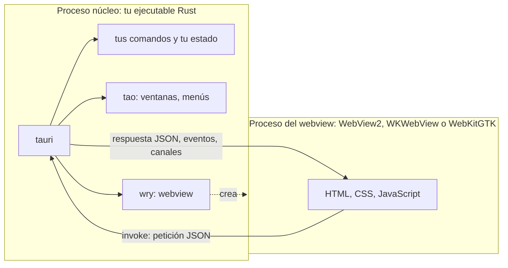

import { Tabs, TabItem } from '@astrojs/starlight/components';
import explorerScreenshot from '../../../../assets/rust-for-csharp-java/l16-chord-explorer.webp';

Ejemplo completo: [`l16-tauri/`](https://github.com/spareilleux/learn/tree/main/code/rust-for-csharp-java/l16-tauri), un explorador de acordes de escritorio. Las lecciones 16 a 21 lo construyen; ejecuta `npm install` y luego `npm run tauri dev` desde esa carpeta.

Las lecciones 1 a 15 cubrieron el lenguaje. Esta segunda parte responde a una pregunta que todo desarrollador de C# o Java se hace tarde o temprano: ¿puedo escribir una aplicación de escritorio en Rust, y con qué?

## Lo que ya conoces

En .NET y en la JVM, se elige entre toolkits que dibujan sus propios controles y toolkits que integran un motor de navegador:

| Toolkit | Interfaz descrita en | Renderizado |
|---|---|---|
| [WinForms](https://learn.microsoft.com/dotnet/desktop/winforms/overview/) | código C#, diseñador | controles Win32, solo Windows |
| [WPF](https://learn.microsoft.com/dotnet/desktop/wpf/overview/) | XAML + bindings | su propio renderizador DirectX, solo Windows |
| [.NET MAUI](https://learn.microsoft.com/dotnet/maui/what-is-maui) | XAML + bindings | los controles nativos de la plataforma (WinUI en Windows) |
| [Avalonia](https://avaloniaui.net/) | `.axaml`, parecido a XAML | su propio renderizador, en todos los sistemas |
| [Swing](https://docs.oracle.com/javase/tutorial/uiswing/), [JavaFX](https://openjfx.io/) | código Java, FXML | su propio renderizador, en todos los sistemas |
| [Electron](https://www.electronjs.org/docs/latest/) | HTML, CSS, JavaScript | un Chromium incluido en cada aplicación, más Node.js |
| [Blazor Hybrid](https://learn.microsoft.com/aspnet/core/blazor/hybrid/) | componentes Razor | el webview del sistema (WebView2 en Windows) dentro de una ventana MAUI, WPF o WinForms |

Rust también tiene ambas familias. Lo que le falta es el framework oficial: no hay un WPF de Rust, solo proyectos de la comunidad, y ninguno es tan maduro como WPF o JavaFX.

## Renderizado nativo: egui, iced, Slint

Estos crates dibujan cada píxel ellos mismos, normalmente en la GPU, en una ventana abierta por [winit](https://docs.rs/winit):

| Crate | Modelo | Interfaz descrita en | Licencia | Lo más parecido |
|---|---|---|---|---|
| [egui](https://docs.rs/egui) con [eframe](https://docs.rs/eframe) | **modo inmediato**: la interfaz se redibuja a partir de tus datos en cada fotograma | código Rust | MIT o Apache-2.0 | [Dear ImGui](https://github.com/ocornut/imgui), interfaces de depuración de videojuegos |
| [iced](https://docs.rs/iced) | **arquitectura Elm**: estado, mensajes, `update`, `view` | código Rust | MIT | Model-View-Update, como [Elmish](https://elmish.github.io/elmish/) en F# |
| [Slint](https://docs.rs/slint) | marcado declarativo compilado a Rust | archivos `.slint` | GPLv3, libre de regalías o comercial | XAML, FXML |

Versiones en crates.io el 2026-09-15: egui y eframe 0.36.2, iced 0.14.0, Slint 1.17.1. egui e iced siguen en 0.x y sus API cambian entre versiones menores; Slint está en 1.x desde abril de 2023.

[Dioxus](https://dioxuslabs.com/) parece una cuarta opción, con componentes al estilo de React escritos en Rust. Sin embargo, su renderizador de escritorio depende de `wry` y `tao` ([`dioxus-desktop` 0.7.10](https://crates.io/crates/dioxus-desktop/0.7.10/dependencies)): el mismo webview del sistema que Tauri.

### egui en IX: `ix-demo`

[IX](https://github.com/GuitarAlchemist/ix) tiene una aplicación egui, [`crates/ix-demo`](https://github.com/GuitarAlchemist/ix/tree/a7e5fbce3d4a7a9d15bb9638b3bcba7c08c2941a/crates/ix-demo) (commit `a7e5fbc`, 2026-09-15): 23 pestañas de demos interactivas sobre los crates del workspace. Su `main` abre una ventana ([`main.rs`, líneas 28-40](https://github.com/GuitarAlchemist/ix/blob/a7e5fbce3d4a7a9d15bb9638b3bcba7c08c2941a/crates/ix-demo/src/main.rs#L28-L40)):

```rust
fn main() -> eframe::Result<()> {
    let options = eframe::NativeOptions {
        viewport: egui::ViewportBuilder::default()
            .with_inner_size([1280.0, 800.0])
            .with_title("ix — ML Algorithm Explorer"),
        ..Default::default()
    };
    eframe::run_native(
        "ix Demo",
        options,
        Box::new(|_cc| Ok(Box::new(IxApp::default()))),
    )
}
```

y cada demo es un struct con un método `ui` que egui llama cada vez que repinta ([`demos/stats.rs`, líneas 29-37](https://github.com/GuitarAlchemist/ix/blob/a7e5fbce3d4a7a9d15bb9638b3bcba7c08c2941a/crates/ix-demo/src/demos/stats.rs#L29-L37)):

```rust
impl StatsDemo {
    pub fn ui(&mut self, ui: &mut egui::Ui) {
        ui.heading("Statistics (ix-math)");
        ui.label("Enter comma-separated values:");
        ui.text_edit_singleline(&mut self.data_text);

        if ui.button("Compute").clicked() {
            self.compute();
        }
```

No hay XAML, ni binding, ni manejador de eventos. `text_edit_singleline(&mut self.data_text)` dibuja el cuadro de texto *y* escribe en el campo lo que el usuario teclea; `button(…).clicked()` dibuja el botón y devuelve `true` durante el fotograma en que se hizo clic. Para un desarrollador WPF, es como si `OnRender` reconstruyera toda la ventana a partir del view model, sin `INotifyPropertyChanged`.

Leer los 28 archivos (7411 líneas) de `ix-demo` muestra la otra cara del modo inmediato:

- El trabajo se ejecuta **dentro de** `ui`, en el hilo que dibuja la ventana. Hay 58 manejadores `clicked()` y ni un solo hilo, canal o `spawn`. Las cargas son pequeñas (una criba hasta 1 000 000, como mucho 2000 épocas de una red XOR), así que no se nota; un cálculo más largo congelaría todas las pestañas. Tauri lo resuelve con comandos asíncronos (lección 17) y canales (lección 18).
- La pestaña *Neural Network (ix-nn)* no llama a `ix-nn`: entrena su propia red con `ndarray` ([`demos/neural_net.rs`, línea 77](https://github.com/GuitarAlchemist/ix/blob/a7e5fbce3d4a7a9d15bb9638b3bcba7c08c2941a/crates/ix-demo/src/demos/neural_net.rs#L77): "demonstrates the concepts in ix-nn").
- `Cargo.toml` pide `eframe = "0.31"` cuando crates.io va por la 0.36.2, e IX no commitea un `Cargo.lock`: cada compilación toma la última 0.31.x.

En Tauri, la misma demo sería un comando Rust por botón, que devuelve los números en JSON, y una página HTML que dibuja el gráfico con una biblioteca JavaScript. El código Rust se simplifica y la interfaz pasa a un segundo lenguaje: ese es el intercambio.

## Interfaz web en un webview del sistema: Tauri

[Tauri](https://v2.tauri.app/) retoma la idea de Electron sin incluir Chromium ni Node.js. Tu aplicación es un ejecutable Rust, el **proceso núcleo** (*core process*); el contenido de la ventana es HTML, CSS y JavaScript renderizado por el webview **que el sistema operativo ya proporciona** ([modelo de procesos](https://v2.tauri.app/concept/process-model/)):

| Sistema | Webview | Motor |
|---|---|---|
| Windows | [WebView2](https://learn.microsoft.com/microsoft-edge/webview2/) | Chromium (Microsoft Edge) |
| macOS | [WKWebView](https://developer.apple.com/documentation/webkit/wkwebview) | WebKit (Safari) |
| Linux | [WebKitGTK](https://webkitgtk.org/) | WebKit |



- Solo el proceso núcleo puede tocar el sistema de archivos, la red u otros procesos. La página llega a Rust mediante **comandos** (`invoke`, lección 17) y **eventos** (lección 18), serializados en JSON: es paso de mensajes, no memoria compartida.
- [`tao`](https://github.com/tauri-apps/tao) (un fork de winit) abre las ventanas, [`wry`](https://github.com/tauri-apps/wry) integra el webview; `tauri` añade encima el IPC, la configuración, los permisos y el empaquetador.
- Tres motores significan tres navegadores que probar, como en la web: una función CSS que funciona en WebView2 puede faltar en el WebKitGTK de una distribución Linux antigua.

Este curso fija **Tauri 2.11.5** (publicado el 2026-07-01), la CLI de Tauri **2.11.4** y `create-tauri-app` **4.7.4**. Una primera **3.0.0-alpha** se publicó el 2026-09-13; entre sus crates hay un nuevo `tauri-runtime-cef`, un runtime basado en Chromium Embedded Framework. Es una alfa: el curso se queda en la 2.

### La diferencia de tamaño, medida

Electron incluye su runtime en cada aplicación. Electron **44.3.0** para Windows x64, descargado con `npm install electron@44.3.0` el 2026-09-15, es un zip de 158 MB que se descomprime en **385 MB** y 73 archivos; solo `electron.exe` pesa 246 MB — antes de cualquier línea de tu aplicación.

El explorador de acordes que construyen estas lecciones, en modo release con `tauri build --no-bundle`, es un único `chord-explorer.exe` de **4,2 MB** (4 244 992 bytes) en Windows, HTML incluido; la compilación tardó 2 min 43 s. Se apoya en el runtime WebView2 instalado con Windows 11 (versión 153.0.4234.32 en mi máquina).

Un binario pequeño no significa un consumo de memoria pequeño: WebView2 arranca sus propios procesos de navegador. Con la ventana de la compilación release abierta, medido con PowerShell ([`Get-Process`](https://learn.microsoft.com/powershell/module/microsoft.powershell.management/get-process), bytes privados del proceso y de sus hijos):

```text
Name           Type             Sub                          PrivateMB WorkingSetMB
----           ----             ---                          --------- ------------
chord-explorer                                                    5.60        27.10
msedgewebview2 browser                                           40.70       125.00
msedgewebview2 crashpad-handler                                   2.50         9.70
msedgewebview2 gpu-process                                       81.90        67.00
msedgewebview2 renderer                                          25.10        60.10
msedgewebview2 utility          network.mojom.NetworkService     12.70        37.90
msedgewebview2 utility          storage.mojom.StorageService      8.10        18.40

total private MB: 176.6; total working set MB: 345.2; processes: 7
```

El proceso Rust usa 5,6 MB; los otros seis procesos son de WebView2, unos 170 MB. Los working sets suman más porque cuentan varias veces las páginas compartidas entre procesos. Una aplicación Tauri es ligera en disco, no gratuita en memoria: ejecuta un motor de navegador, igual que Electron.

## Requisitos previos

Tauri necesita Rust (lección 1) y las bibliotecas de desarrollo del webview de cada sistema; Node.js solo hace falta para la versión npm de la CLI y para los frameworks JavaScript ([requisitos previos](https://v2.tauri.app/start/prerequisites/)).

<Tabs syncKey="os">
<TabItem label="Windows">

- Las **herramientas de compilación MSVC**, ya instaladas en la lección 1; la guía de Tauri pide la carga de trabajo *Desarrollo para el escritorio con C++*.
- **WebView2**: incluido en Windows 11 y en Windows 10 desde la versión 1803. Para comprobar su versión:

```powershell
(Get-ItemProperty 'HKLM:\SOFTWARE\WOW6432Node\Microsoft\EdgeUpdate\Clients\{F3017226-FE2A-4295-8BDF-00C3A9A7E4C5}').pv
```

```text
153.0.4234.32
```

- [Node.js](https://nodejs.org/) LTS para `npm` (este curso: Node 24.12.0, npm 11.7.0).

</TabItem>
<TabItem label="Linux / WSL">

En Debian y Ubuntu, la lista de la guía de Tauri:

```bash
sudo apt update
sudo apt install libwebkit2gtk-4.1-dev \
  build-essential \
  curl \
  wget \
  file \
  libxdo-dev \
  libssl-dev \
  libayatana-appindicator3-dev \
  librsvg2-dev
```

Las demás distribuciones tienen sus propios nombres de paquete en la guía. En WSL, las aplicaciones gráficas Linux necesitan [WSLg](https://learn.microsoft.com/windows/wsl/tutorials/gui-apps) (Windows 11): la ventana se abre entonces en el escritorio de Windows (*por verificar*: el curso aún no ha ejecutado Tauri en WSL).

</TabItem>
<TabItem label="macOS">

```bash
xcode-select --install   # suficiente para el escritorio; iOS necesita Xcode completo
```

WKWebView forma parte de macOS: no hay nada más que instalar. La CI compila y prueba así el explorador en runners de macOS; abrir su ventana está *por verificar* en un Mac.

</TabItem>
</Tabs>

## Crear un proyecto

[`create-tauri-app`](https://github.com/tauri-apps/create-tauri-app) genera un proyecto. Las opciones evitan las preguntas:

```bash
npx create-tauri-app@4.7.4 hello-tauri --manager npm --template vanilla --identifier dev.learn.hello --yes
```

```text
Template created! To get started run:
  cd hello-tauri
  npm install
  npm run tauri android init

For Desktop development, run:
  npm run tauri dev

For Android development, run:
  npm run tauri android dev
```

La primera sugerencia es la configuración de Android, incluso en Windows y para un proyecto de escritorio; para el escritorio, pasa al segundo bloque. La plantilla `vanilla` es HTML, CSS y JavaScript sin más, sin bundler (la lección 19 trata Vite y TypeScript). La estructura generada ([estructura del proyecto](https://v2.tauri.app/start/project-structure/)):

```text
hello-tauri/
├── package.json            ← solo la CLI de Tauri, como dependencia de desarrollo
├── src/                    ← el frontend: index.html, main.js, styles.css
└── src-tauri/              ← un paquete Cargo normal
    ├── Cargo.toml
    ├── build.rs            ← tauri_build::build(): lee la configuración, integra los iconos
    ├── tauri.conf.json     ← ventana, identificador, carpeta del frontend, seguridad, paquete
    ├── capabilities/
    │   └── default.json    ← lo que la ventana puede llamar (lección 20)
    ├── icons/
    └── src/
        ├── main.rs         ← llama a hello_tauri_lib::run()
        └── lib.rs          ← la aplicación: comandos y Builder
```

Tres detalles sorprenden a un desarrollador Rust:

- `Cargo.toml` declara `edition = "2021"`, no 2024. El proyecto del curso usa 2024, como en la lección 1, y compila igual.
- La biblioteca se llama `hello_tauri_lib` y se compila como `["staticlib", "cdylib", "rlib"]`: en iOS y Android la aplicación es una biblioteca cargada por la plataforma, así que `main.rs` solo llama a `lib.rs`, donde vive todo. El comentario explica el sufijo `_lib`: una biblioteca y un binario con el mismo nombre chocan en Windows.
- `main.rs` empieza con `#![cfg_attr(not(debug_assertions), windows_subsystem = "windows")]`: sin eso, una compilación release abriría una ventana de consola junto a la aplicación.

`tauri.conf.json` es para Tauri lo que `App.xaml` más el `.csproj` son para WPF ([referencia de configuración](https://v2.tauri.app/reference/config/)):

```json
{
  "$schema": "https://schema.tauri.app/config/2",
  "productName": "hello-tauri",
  "version": "0.1.0",
  "identifier": "dev.learn.hello",
  "build": {
    "frontendDist": "../src"
  },
  "app": {
    "withGlobalTauri": true,
    "windows": [
      {
        "title": "hello-tauri",
        "width": 800,
        "height": 600
      }
    ],
    "security": {
      "csp": null
    }
  },
  "bundle": {
    "active": true,
    "targets": "all",
    "icon": [
      "icons/32x32.png",
      "icons/128x128.png",
      "icons/128x128@2x.png",
      "icons/icon.icns",
      "icons/icon.ico"
    ]
  }
}
```

- `frontendDist` es la carpeta de archivos estáticos integrados en el ejecutable; un framework con servidor de desarrollo añadiría `devUrl`.
- `withGlobalTauri: true` expone la API JavaScript como `window.__TAURI__`, de modo que una página sin bundler puede llamar a `window.__TAURI__.core.invoke`.
- `"csp": null` desactiva la Content Security Policy. El proyecto del curso define una, y la lección 20 explica por qué el valor por defecto de la plantilla merece una segunda mirada.

## Ejecutarlo: `tauri dev`

Desde la carpeta del curso, `npm install` instala la CLI fijada por `package-lock.json`, y luego `npx tauri dev` compila y arranca la aplicación:

```bash
cd code/rust-for-csharp-java/l16-tauri
npm install
npx tauri dev
```

```text
     Running DevCommand (`cargo  run --no-default-features --color always --`)
        Info Watching C:\Users\spare\source\repos\learn\code\rust-for-csharp-java\l16-tauri\src-tauri for changes...
        Info Watching C:\Users\spare\source\repos\learn\code\rust-for-csharp-java\l16-tauri\theory for changes...
   Compiling chord-explorer v0.1.0 (C:\Users\spare\source\repos\learn\code\rust-for-csharp-java\l16-tauri\src-tauri)
    Finished `dev` profile [unoptimized + debuginfo] target(s) in 25.84s
     Running `C:\Users\spare\source\repos\learn\code\rust-for-csharp-java\l16-tauri\target\debug\chord-explorer.exe`
```

- Por debajo es `cargo run`: la primera ejecución compila todas las dependencias de Tauri y tarda minutos; la ejecución de arriba solo recompiló la aplicación.
- La CLI vigila `src-tauri` y los crates de los que depende por ruta, aquí `theory`. Cambiar el título de la ventana en `tauri.conf.json` recompiló la aplicación (20,84 s) y la reinició con el nuevo título.
- Sin `devUrl`, la CLI sirve ella misma la carpeta `frontendDist`: la dirección de la página en el webview era `http://127.0.0.1:1430/`.

## La aplicación del curso: un explorador de acordes

Las lecciones siguientes construyen una sola aplicación, en el espíritu de [Guitar Alchemist](https://github.com/GuitarAlchemist/ga): deletrear un acorde (`Bbm7` es `Bb Db F Ab`), transponerlo, listar los acordes de una tonalidad, guardar favoritos y buscar todas las formas de tocar un acorde en una guitarra.


La teoría musical es un crate aparte que no sabe nada de Tauri ([`l16-tauri/Cargo.toml`](https://github.com/spareilleux/learn/blob/373237a/code/rust-for-csharp-java/l16-tauri/Cargo.toml)):

```toml
[workspace]
resolver = "3"
members = ["theory", "src-tauri"]
```

```text
l16-tauri/
├── Cargo.toml          ← el workspace (lección 10)
├── package.json        ← @tauri-apps/cli 2.11.4, con su package-lock.json
├── theory/             ← notas, acordes, escalas, posiciones: Rust sin más, sin dependencias
├── src-tauri/          ← la aplicación Tauri: comandos y estado que llaman a theory
└── ui/                 ← index.html, main.js, styles.css
```

Es la separación en capas que usarías en .NET, con una biblioteca de clases referenciada por el proyecto WPF, o en Java, con un módulo de dominio bajo el de JavaFX: la lógica se puede probar sin ventana. `cargo test -p theory` ejecuta sus 15 tests sin compilar ninguno de los otros 236 crates que la aplicación Tauri arrastra en Windows (`cargo tree`):

```text
running 15 tests
test chord::tests::reports_what_is_wrong ... ok
test chord::tests::every_quality_round_trips ... ok
test chord::tests::spells_chords_with_the_right_letters ... ok
test chord::tests::mask_ignores_spelling ... ok
test note::tests::rejects_what_is_not_a_note ... ok
test scale::tests::one_letter_per_degree ... ok
test note::tests::parses_and_prints_notes ... ok
test voicing::tests::rejects_muted_strings_between_sounding_ones ... ok
test note::tests::spells_by_letter_then_semitones ... ok
test scale::tests::diatonic_triads ... ok
test chord::tests::transposes_with_common_spellings ... ok
test note::tests::enharmonic_notes_share_a_pitch_class ... ok
test voicing::tests::reports_every_batch_and_stops_when_cancelled ... ok
test voicing::tests::every_result_is_a_root_position_voicing ... ok
test voicing::tests::finds_the_open_chords ... ok

test result: ok. 15 passed; 0 failed; 0 ignored; 0 measured; 0 filtered out; finished in 4.13s
```

## Puntos clave

- Las interfaces de escritorio en Rust forman dos familias: renderizado nativo (egui, iced, Slint) e interfaz web en un webview (Tauri, y Dioxus en el escritorio).
- egui redibuja la interfaz a partir de tus datos en cada fotograma; es sencillo de escribir, pero el trabajo que pones en `ui` se ejecuta en el hilo de dibujo.
- Una aplicación Tauri es un proceso núcleo en Rust más el webview del sistema: WebView2, WKWebView o WebKitGTK. La interfaz habla con Rust por paso de mensajes, en JSON.
- No incluir Chromium deja el ejecutable en unos pocos megabytes en lugar de cientos, pero los procesos del webview siguen usando memoria, y hay que probar tres motores.
- `src-tauri` es un paquete Cargo normal; `tauri.conf.json` describe las ventanas, el frontend y los ajustes de seguridad.

## Ejercicios

1. ¿Qué webview, y qué versión de motor, renderiza una ventana Tauri en tu máquina? Averígualo desde JavaScript, en las herramientas de desarrollo de la ventana (clic derecho, *Inspeccionar*, en una compilación debug).

<details>
<summary>Solución</summary>

`navigator.userAgent` describe el motor. En la ventana del explorador, en Windows:

```text
Mozilla/5.0 (Windows NT 10.0; Win64; x64) AppleWebKit/537.36 (KHTML, like Gecko) Chrome/153.0.0.0 Safari/537.36 Edg/153.0.0.0
```

El token `Edg/` es WebView2; su versión es la que encontramos arriba en el registro. En macOS el user agent contiene `AppleWebKit` sin `Chrome`, y en Linux la versión de WebKitGTK.

</details>

2. Cambia la ventana del explorador para que se abra a 1100 × 800, no pueda hacerse más pequeña que 700 × 500 y se titule *Chords*.

<details>
<summary>Solución</summary>

En `src-tauri/tauri.conf.json`, el objeto de ventana acepta `minWidth` y `minHeight` ([`WindowConfig`](https://v2.tauri.app/reference/config/#windowconfig)):

```json
"windows": [
  {
    "title": "Chords",
    "width": 1100,
    "height": 800,
    "minWidth": 700,
    "minHeight": 500
  }
]
```

`tauri dev` detecta el cambio y reinicia la aplicación. La configuración se lee **en tiempo de compilación** con `tauri::generate_context!()`, así que una compilación release también debe recompilarse.

</details>

3. ¿Por qué el crate `theory` no depende de `serde`, si todos los resultados llegan a JavaScript en JSON?

<details>
<summary>Solución</summary>

Porque el JSON es asunto de la frontera, no de la teoría musical. `src-tauri` convierte los tipos de `theory` en pequeños structs serializables (`ChordView`, lección 17), el equivalente de los DTO en un controlador ASP.NET Core o Spring. `theory` sigue siendo utilizable desde una herramienta de línea de comandos, un test o una aplicación egui, y sus tests compilan en un segundo más o menos. Añadir `serde` tras una feature opcional de Cargo (lección 10) también sería razonable si varios frontends necesitaran el mismo JSON.

</details>

## Fuentes

- [Tauri 2 — Process model](https://v2.tauri.app/concept/process-model/), [Architecture](https://v2.tauri.app/concept/architecture/) y [Prerequisites](https://v2.tauri.app/start/prerequisites/)
- [Tauri 2 — Create a project](https://v2.tauri.app/start/create-project/) y [Project structure](https://v2.tauri.app/start/project-structure/)
- [Código fuente de Tauri en `tauri-v2.11.5`](https://github.com/tauri-apps/tauri/tree/tauri-v2.11.5)
- [Microsoft — WebView2 overview](https://learn.microsoft.com/microsoft-edge/webview2/)
- [Electron — Process model](https://www.electronjs.org/docs/latest/tutorial/process-model)
- [egui](https://docs.rs/egui), [eframe](https://docs.rs/eframe), [iced](https://docs.rs/iced) y [Slint](https://docs.rs/slint) en docs.rs
