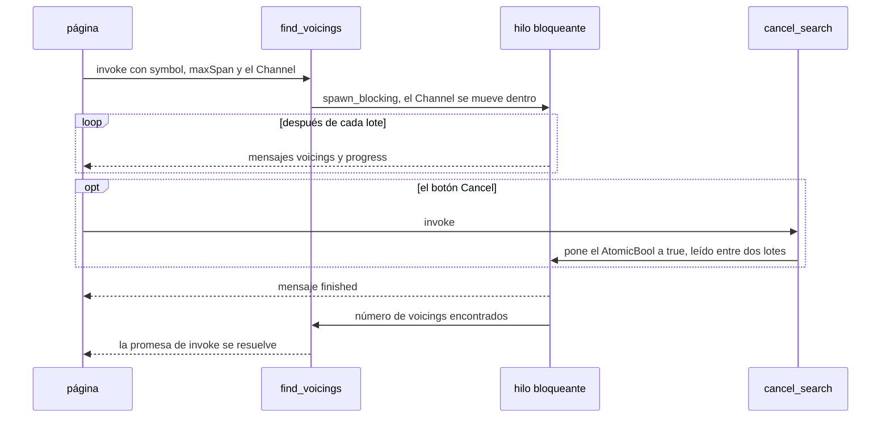

Ejemplo completo: [`l16-tauri/src-tauri/src/state.rs`](https://github.com/spareilleux/learn/blob/main/code/rust-for-csharp-java/l16-tauri/src-tauri/src/state.rs) y [`ui/main.js`](https://github.com/spareilleux/learn/blob/main/code/rust-for-csharp-java/l16-tauri/ui/main.js).

Los comandos de la lección 17 eran funciones de sus argumentos. Una aplicación real también necesita datos que vivan entre dos llamadas, y mensajes que Rust envía sin que se los pidan: una lista que ha cambiado, una búsqueda que avanza.

## Lo que ya conoces

| Necesidad | Tauri | .NET | Java | Electron |
|---|---|---|---|---|
| Un objeto compartido para la aplicación | [`Builder::manage`](https://docs.rs/tauri/2.11.5/tauri/struct.Builder.html#method.manage) + [`State<T>`](https://docs.rs/tauri/2.11.5/tauri/struct.State.html) | un singleton en la [inyección de dependencias](https://learn.microsoft.com/dotnet/core/extensions/dependency-injection) | un bean singleton de Spring | una variable en el proceso principal |
| Avisar a todas las ventanas de que algo ha pasado | [`Emitter::emit`](https://docs.rs/tauri/2.11.5/tauri/trait.Emitter.html#method.emit) + [`listen`](https://v2.tauri.app/reference/javascript/api/namespaceevent/#listen) | [`WeakReferenceMessenger`](https://learn.microsoft.com/dotnet/communitytoolkit/mvvm/messenger) | [`ApplicationEventPublisher`](https://docs.spring.io/spring-framework/docs/current/javadoc-api/org/springframework/context/ApplicationEventPublisher.html) | [`webContents.send`](https://www.electronjs.org/docs/latest/api/web-contents#contentssendchannel-args) |
| Enviar en flujo los resultados de una llamada | [`ipc::Channel<T>`](https://docs.rs/tauri/2.11.5/tauri/ipc/struct.Channel.html) | [`IProgress<T>`](https://learn.microsoft.com/dotnet/api/system.iprogress-1), [`IAsyncEnumerable<T>`](https://learn.microsoft.com/dotnet/api/system.collections.generic.iasyncenumerable-1) | [`Flow.Publisher`](https://docs.oracle.com/en/java/javase/25/docs/api/java.base/java/util/concurrent/Flow.Publisher.html), el `Flux` de Reactor | un [`MessagePort`](https://www.electronjs.org/docs/latest/tutorial/message-ports) |

## Estado gestionado

El explorador guarda en memoria los acordes favoritos. El estado es un tipo corriente (de [`src-tauri/src/state.rs`, líneas 14-16](https://github.com/spareilleux/learn/blob/373237a/code/rust-for-csharp-java/l16-tauri/src-tauri/src/state.rs#L14-L16)):

```rust
/// Los símbolos de los acordes favoritos, compartidos por todas las ventanas.
#[derive(Default)]
pub struct Favorites(Mutex<Vec<String>>);
```

Se registra una sola vez, al construir la aplicación (el `setup` de la lección 17):

```rust
builder
    .manage(state::Favorites::default())
    .manage(state::SearchControl::default())
```

y un comando lo pide añadiendo un parámetro `State<'_, Favorites>`, que Tauri rellena en lugar de leerlo del JSON (de [`src-tauri/src/state.rs`, líneas 24-27](https://github.com/spareilleux/learn/blob/373237a/code/rust-for-csharp-java/l16-tauri/src-tauri/src/state.rs#L24-L27)):

```rust
#[tauri::command]
pub fn favorites(favorites: State<'_, Favorites>) -> Vec<String> {
    favorites.0.lock().unwrap().clone()
}
```

De su funcionamiento se derivan cuatro reglas ([gestión del estado](https://v2.tauri.app/develop/state-management/)):

- **El estado se busca por tipo**, como un servicio registrado por su tipo en .NET. Dos listas de cadenas necesitan dos tipos: `Favorites` y `RecentChords`, no dos `Mutex<Vec<String>>`. Registrar dos veces el mismo tipo detiene la aplicación al arrancar; la aserción de `Builder::manage`:

```rust
assert!(
  self.state.set(state),
  "state for type '{type_name}' is already being managed",
);
```

- **Los comandos se ejecutan en varios hilos** (lección 17), así que el estado debe ser `Send + Sync` y todo lo mutable va detrás de un [`Mutex`](https://doc.rust-lang.org/std/sync/struct.Mutex.html), un [`RwLock`](https://doc.rust-lang.org/std/sync/struct.RwLock.html) o un atómico (lección 12). No hay dispatcher que lo oculte, igual que no lo hay en un singleton de ASP.NET Core. Tauri envuelve él mismo el estado en un `Arc`.
- **Olvidar `manage` no es un error de compilación.** El tipo solo se busca cuando se llama al comando, y la llamada se rechaza (del test `state_that_was_never_managed_rejects_the_call` en [`src-tauri/tests/ipc.rs`](https://github.com/spareilleux/learn/blob/373237a/code/rust-for-csharp-java/l16-tauri/src-tauri/tests/ipc.rs)):

```text
recent_chords -> "state not managed for field `recent` on command `recent_chords`. You must call `.manage()` before using this command"
```

  La guía de Tauri, en su sección sobre tipos que no coinciden, dice que el tipo equivocado provoca un panic en ejecución. Para un comando, en Tauri 2.11.5, la promesa se rechaza y la aplicación sigue funcionando; fuera de los comandos, `Manager::state` sí hace panic, y `try_state` devuelve en su lugar un `Option`.
- **Fuera de un comando**, [`Manager::state`](https://docs.rs/tauri/2.11.5/tauri/trait.Manager.html#method.state) o [`try_state`](https://docs.rs/tauri/2.11.5/tauri/trait.Manager.html#method.try_state) lo leen desde la `App` o un `AppHandle`, por ejemplo en `setup` o en un hilo.

### Un `MutexGuard` a través de `.await`

En un comando `async` se aplican las reglas de la lección 13: un [`std::sync::MutexGuard`](https://doc.rust-lang.org/std/sync/struct.MutexGuard.html) no es `Send`, y Tauri necesita que el future sea `Send` para ejecutarlo en su runtime ([doctest `compile_fail`](https://github.com/spareilleux/learn/blob/373237a/code/rust-for-csharp-java/l16-tauri/src-tauri/src/compile_fail.rs)):

```rust
use std::sync::Mutex;

async fn save(_list: &[String]) {}

#[tauri::command]
async fn add_favorite(
    favorites: tauri::State<'_, Mutex<Vec<String>>>,
    symbol: String,
) -> Result<(), String> {
    let mut list = favorites.lock().unwrap();
    list.push(symbol);
    save(&list).await;
    Ok(())
}
```

```text
error: future cannot be sent between threads safely
   --> examples\e18_guard_across_await.rs:5:1
    |
  5 | #[tauri::command]
    | ^^^^^^^^^^^^^^^^^ future returned by `add_favorite` is not `Send`
...
    = help: within `impl Future<Output = Result<(), std::string::String>>`, the trait `std::marker::Send` is not implemented for `std::sync::MutexGuard<'_, Vec<std::string::String>>`
note: future is not `Send` as this value is used across an await
   --> examples\e18_guard_across_await.rs:12:17
    |
 10 |     let mut list = favorites.lock().unwrap();
    |         -------- has type `std::sync::MutexGuard<'_, Vec<std::string::String>>` which is not `Send`
 11 |     list.push(symbol);
 12 |     save(&list).await;
    |                 ^^^^^ await occurs here, with `mut list` maybe used later
```

La solución habitual es copiar lo que necesitas y liberar el lock antes del `.await`, en un bloque. La guía de Tauri, citando la de tokio, mantiene el `Mutex` estándar como opción por defecto y reserva [`tokio::sync::Mutex`](https://docs.rs/tokio/latest/tokio/sync/struct.Mutex.html) para un guard que de verdad deba vivir a través de un `.await`.

Y como `State<'_, T>` es un préstamo, un comando `async` que lo recibe debe devolver un `Result`, la regla vista en la lección 17 para `&str`:

```rust
use std::sync::Mutex;

#[tauri::command]
async fn favorites(favorites: tauri::State<'_, Mutex<Vec<String>>>) -> Vec<String> {
    favorites.lock().unwrap().clone()
}
```

```text
error[E0277]: async commands that contain references as inputs must return a `Result`
 --> examples\e18_async_state.rs:4:72
  |
4 | async fn favorites(favorites: tauri::State<'_, Mutex<Vec<String>>>) -> Vec<String> {
  |                                                                        ^^^ the trait `AsyncCommandMustReturnResult` is not implemented for `Vec<std::string::String>`
```

## Eventos: Rust avisa a la página

Cuando se añade un favorito, todas las ventanas que muestran la lista deben actualizarse, incluidas las que no pidieron nada. El comando emite un **evento** después de cambiar el estado (de [`src-tauri/src/state.rs`, líneas 29-49](https://github.com/spareilleux/learn/blob/373237a/code/rust-for-csharp-java/l16-tauri/src-tauri/src/state.rs#L29-L49)):

```rust
/// Añade o quita un favorito y luego avisa a todas las ventanas con un evento `favorites-changed`.
#[tauri::command]
pub fn toggle_favorite<R: Runtime>(
    app: AppHandle<R>,
    favorites: State<'_, Favorites>,
    symbol: &str,
) -> Result<Vec<String>, CommandError> {
    let symbol = symbol.parse::<Chord>()?.to_string();
    let snapshot = {
        let mut list = favorites.0.lock().unwrap();
        match list.iter().position(|favorite| *favorite == symbol) {
            Some(index) => {
                list.remove(index);
            }
            None => list.push(symbol),
        }
        list.clone()
    }; // el lock se libera aquí, antes de hablar con los webviews
    app.emit("favorites-changed", &snapshot)?;
    Ok(snapshot)
}
```

- Tauri proporciona un parámetro [`AppHandle`](https://docs.rs/tauri/2.11.5/tauri/struct.AppHandle.html), igual que `State`. Es genérico sobre el runtime para que los tests simulados puedan llamar al mismo comando.
- `emit` envía a todos los webviews; [`emit_to`](https://docs.rs/tauri/2.11.5/tauri/trait.Emitter.html#method.emit_to) apunta a una ventana por su etiqueta.
- El payload es una instantánea tomada bajo el lock y emitida una vez liberado: nunca mantengas un lock mientras llamas hacia fuera, la regla que conoces de `lock` en C# y `synchronized` en Java.
- `?` funciona sobre `emit` porque `CommandError` implementa `From<tauri::Error>` (lección 17).

La página se suscribe una vez, al arrancar, con [`listen`](https://v2.tauri.app/reference/javascript/api/namespaceevent/#listen) (de [`ui/main.js`, líneas 168-170](https://github.com/spareilleux/learn/blob/373237a/code/rust-for-csharp-java/l16-tauri/ui/main.js#L168-L170)):

```js
// Todas las ventanas reciben favorites-changed, sea cual sea la ventana que cambió la lista
await listen("favorites-changed", (event) => showFavorites(event.payload));
showFavorites(await invoke("favorites"));
```

y `toggleFavorite` ignora el resultado del comando: el evento actualiza la lista, en esta ventana y en las demás. Lo que recibió la página, capturado en la ventana:

```text
toggle_favorite returned ["Am"]; listener got {"event":"favorites-changed","id":2,"payload":["Am"]}
```

El código Rust también puede escuchar, mediante el trait [`Listener`](https://docs.rs/tauri/2.11.5/tauri/trait.Listener.html), y así es como el test simulado comprueba el evento sin webview (de [`src-tauri/tests/ipc.rs`, líneas 124-135](https://github.com/spareilleux/learn/blob/373237a/code/rust-for-csharp-java/l16-tauri/src-tauri/tests/ipc.rs#L124-L135)):

```rust
#[test]
fn toggle_favorite_emits_an_event() {
    let (app, webview) = app();
    let (sender, received) = mpsc::channel();
    app.listen("favorites-changed", move |event| {
        sender.send(event.payload().to_string()).unwrap();
    });
    invoke(&webview, "toggle_favorite", json!({ "symbol": "Bb7" })).unwrap();
    let payload = received.recv_timeout(Duration::from_secs(5)).unwrap();
    println!("favorites-changed payload: {payload}");
    assert_eq!(payload, r#"["Bb7"]"#);
}
```

```text
favorites-changed payload: ["Bb7"]
```

El payload debe ser `Serialize` **y** `Clone`, porque puede ir a varios destinos; pasar una referencia, `&snapshot`, cumple `Clone` sin copiar la lista. Un tipo de payload sin `Clone`:

```rust
use tauri::{AppHandle, Emitter};

#[derive(serde::Serialize)]
struct Favorites {
    symbols: Vec<String>,
}

#[tauri::command]
fn announce(app: AppHandle) -> Result<(), String> {
    let payload = Favorites { symbols: vec!["Am".into()] };
    app.emit("favorites-changed", payload).map_err(|e| e.to_string())
}
```

```text
error[E0277]: the trait bound `Favorites: Clone` is not satisfied
   --> examples\e18_emit_not_clone.rs:11:35
    |
 11 |     app.emit("favorites-changed", payload).map_err(|e| e.to_string())
    |         ----                      ^^^^^^^ the trait `Clone` is not implemented for `Favorites`
    |         |
    |         required by a bound introduced by this call
    |
note: required by a bound in `emit`
   --> C:\Users\spare\.cargo\registry\src\index.crates.io-1949cf8c6b5b557f\tauri-2.11.5\src\lib.rs:946:26
    |
946 |   fn emit<S: Serialize + Clone>(&self, event: &str, payload: S) -> Result<()> {
    |                          ^^^^^ required by this bound in `Emitter::emit`
help: consider annotating `Favorites` with `#[derive(Clone)]`
```

Los nombres de eventos son cadenas, y nada comprueba que la página escuche el nombre que emite Rust: una errata pasa en silencio, como con un messenger indexado por cadena. La [guía de Tauri](https://v2.tauri.app/develop/calling-frontend/) añade dos límites: los eventos no están diseñados "for low latency or high throughput situations", y sus payloads son siempre cadenas JSON.

## Canales: un flujo para una llamada

La búsqueda de posiciones del explorador prueba 7,5 millones de digitaciones y encuentra sus resultados a lo largo de un segundo. La página los quiere según van llegando, con una barra de progreso y un botón *Cancel*. Un evento llegaría a todas las ventanas, y necesitaría un identificador para distinguir dos búsquedas; un **canal** pertenece a una sola llamada. La página lo crea y lo pasa como argumento (de [`ui/main.js`, líneas 99-128](https://github.com/spareilleux/learn/blob/373237a/code/rust-for-csharp-java/l16-tauri/ui/main.js#L99-L128)):

```js
const onEvent = new Channel();
onEvent.onmessage = (message) => {
  switch (message.event) {
    case "voicings":
      for (const frets of message.data.frets) {
        if (list.children.length < MAX_LISTED) {
          const item = document.createElement("li");
          item.textContent = frets;
          list.append(item);
        }
      }
      break;
    case "progress":
      $("progress").value = message.data.done / message.data.total;
      break;
    case "finished": {
      const { found, elapsedMs, cancelled } = message.data;
      const shown = Math.min(found, MAX_LISTED);
      status.textContent = `${found} voicings in ${elapsedMs} ms${cancelled ? " (cancelled)" : ""}, ${shown} shown`;
      break;
    }
  }
};

try {
  await invoke("find_voicings", {
    symbol: $("chord-input").value,
    maxSpan: Number($("span-select").value),
    onEvent,
  });
```

El comando lo recibe como un [`Channel<SearchEvent>`](https://docs.rs/tauri/2.11.5/tauri/ipc/struct.Channel.html). Los mensajes son un único enum Rust, serializado con una [etiqueta adyacente](https://serde.rs/enum-representations.html#adjacently-tagged) para que JavaScript pueda hacer `switch` sobre `event` (de [`src-tauri/src/state.rs`, líneas 51-72](https://github.com/spareilleux/learn/blob/373237a/code/rust-for-csharp-java/l16-tauri/src-tauri/src/state.rs#L51-L72)):

```rust
/// Lo que `find_voicings` envía en flujo al frontend, en orden.
#[derive(Clone, Serialize)]
#[serde(
    tag = "event",
    content = "data",
    rename_all = "camelCase",
    rename_all_fields = "camelCase"
)]
pub enum SearchEvent {
    Voicings {
        frets: Vec<String>,
    },
    Progress {
        done: usize,
        total: usize,
    },
    Finished {
        found: usize,
        elapsed_ms: u128,
        cancelled: bool,
    },
}
```

```rust
/// Busca todas las posiciones de un acorde en un hilo bloqueante y envía los resultados en flujo.
#[tauri::command]
pub async fn find_voicings(
    symbol: String,
    max_span: u8,
    control: State<'_, SearchControl>,
    on_event: Channel<SearchEvent>,
) -> Result<usize, CommandError> {
    let chord: Chord = symbol.parse()?;
    let options = SearchOptions {
        max_span,
        ..SearchOptions::default()
    };
    let cancel = Arc::clone(&control.cancel);
    cancel.store(false, Ordering::Relaxed);

    let found = tauri::async_runtime::spawn_blocking(move || {
        let started = Instant::now();
        let voicings = theory::find_voicings(&chord, &options, &cancel, |progress, batch| {
            if !batch.is_empty() {
                let frets = batch.iter().map(Voicing::to_string).collect();
                // Un envío solo falla si el webview ya no existe: no queda nadie a quien avisar
                let _ = on_event.send(SearchEvent::Voicings { frets });
            }
            let _ = on_event.send(SearchEvent::Progress {
                done: progress.done,
                total: progress.total,
            });
        });
        let _ = on_event.send(SearchEvent::Finished {
            found: voicings.len(),
            elapsed_ms: started.elapsed().as_millis(),
            cancelled: cancel.load(Ordering::Relaxed),
        });
        voicings.len()
    })
    .await?;
    Ok(found)
}
```

- El canal es un parámetro como cualquier otro, y `Channel` es `Send`: se mueve dentro del closure de `spawn_blocking`, y la búsqueda envía desde su hilo bloqueante.
- `theory::find_voicings` no sabe nada de Tauri: recibe un closure llamado después de cada lote (las posiciones de traste de la cuerda Mi grave, 14 en total), la misma forma que un `IProgress<T>` pasado a un método .NET.
- La promesa de `invoke` se resuelve cuando el comando retorna, después del último mensaje.

Los mensajes que recibió la página para `Bbm7` con una extensión de 3 trastes, en una compilación debug, con el tiempo transcurrido desde la llamada (abreviado: se han quitado los mensajes entre 379 ms y 1032 ms):

```text
invoke resolved with 16 after 1114 ms, 17 messages
77 ms {"event":"voicings","data":{"frets":["x-1-3-1-2-1","x-1-3-1-2-4","x-1-3-3-2-4","x-x-8-10-9-9"]}}
78 ms {"event":"progress","data":{"done":1,"total":14}}
152 ms {"event":"progress","data":{"done":2,"total":14}}
227 ms {"event":"progress","data":{"done":3,"total":14}}
305 ms {"event":"progress","data":{"done":4,"total":14}}
379 ms {"event":"progress","data":{"done":5,"total":14}}
1032 ms {"event":"progress","data":{"done":13,"total":14}}
1113 ms {"event":"progress","data":{"done":14,"total":14}}
1114 ms {"event":"finished","data":{"found":16,"elapsedMs":1110,"cancelled":false}}
```

Los mensajes llegan en orden, cada 75 ms más o menos, mientras la búsqueda avanza: "designed to be fast and deliver ordered data", en palabras de la [guía](https://v2.tauri.app/develop/calling-frontend/#channels).

### Cancelar

*Cancel* llama a otro comando, que activa un indicador en el estado gestionado (de [`src-tauri/src/state.rs`, líneas 18-22](https://github.com/spareilleux/learn/blob/373237a/code/rust-for-csharp-java/l16-tauri/src-tauri/src/state.rs#L18-L22)):

```rust
/// Permite que `cancel_search` detenga la búsqueda iniciada por `find_voicings`.
#[derive(Default)]
pub struct SearchControl {
    cancel: Arc<AtomicBool>,
}
```

```rust
#[tauri::command]
pub fn cancel_search(control: State<'_, SearchControl>) {
    control.cancel.store(true, Ordering::Relaxed);
}
```

La búsqueda comprueba el [`AtomicBool`](https://doc.rust-lang.org/std/sync/atomic/type.AtomicBool.html) entre dos lotes: es el `CancellationToken` de .NET, o el `Thread.interrupt` de Java comprobado a mano, sin el soporte de ninguno de los dos en las bibliotecas. El `Arc` permite que el hilo bloqueante conserve el indicador, porque un `State` no puede salir del comando. Una búsqueda de `C` con una extensión de 4, cancelada 300 ms después de empezar:

```text
cancelled search resolved with 19 after 381 ms
{"event":"progress","data":{"done":5,"total":14}}
{"event":"finished","data":{"found":19,"elapsedMs":378,"cancelled":true}}
```

La búsqueda se detuvo tras su quinto lote, el que se estaba ejecutando cuando se activó el indicador, y devolvió las 19 posiciones encontradas hasta entonces. Un indicador para toda la aplicación basta para una búsqueda a la vez; el ejercicio 2 gestiona varias.

La llamada completa como secuencia, desde el invoke de la página hasta la promesa resuelta, con el botón Cancel como opción.



## ¿Evento o canal?

| | Evento | Canal |
|---|---|---|
| Destinatarios | todos los listeners, en todas las ventanas (o un destino con `emit_to`) | la llamada que lo creó |
| Lo crea | Rust, en cualquier momento | la página, para un `invoke` |
| Se identifica por | un nombre de tipo cadena | el propio argumento |
| Adecuado para | "algo ha cambiado": favoritos, ajustes, un archivo guardado | "aquí va la siguiente parte": progreso, resultados de búsqueda, una descarga |
| Advertencia de la guía | no para baja latencia ni alto rendimiento | pensado para flujos ordenados y rápidos |

## Puntos clave

- `manage` registra un valor por tipo; los comandos lo reciben con `State<'_, T>`. El estado mutable necesita un `Mutex`, un `RwLock` o atómicos, porque los comandos se ejecutan en varios hilos.
- Un `manage` olvidado se descubre en ejecución, al llamar al comando: la promesa se rechaza con `state not managed`.
- Libera los locks antes de emitir o de esperar: un `std::sync::MutexGuard` a través de `.await` no compila en un comando.
- Los eventos difunden mensajes JSON con nombre a todas las ventanas; los payloads deben ser `Serialize + Clone`, y los nombres no se comprueban.
- Un canal envía mensajes ordenados a la única llamada que lo creó; muévelo al hilo de trabajo y cancela con un `AtomicBool` compartido.

## Ejercicios

1. Recuerda los cinco últimos acordes deletreados, el más reciente primero, sin duplicados: tras `C`, `Am`, `F`, `G`, `Am`, `Dm`, `E7` y un `Hm` inválido, un comando `recent_chords` devuelve `["E7", "Dm", "Am", "G", "F"]`.

<details>
<summary>Solución</summary>

Un nuevo tipo de estado, para que no choque con `Favorites`, y un comando que deletrea y recuerda (de [`src-tauri/tests/l18_solutions.rs`, líneas 17-39](https://github.com/spareilleux/learn/blob/373237a/code/rust-for-csharp-java/l16-tauri/src-tauri/tests/l18_solutions.rs#L17-L39)):

```rust
#[derive(Default)]
struct RecentChords(Mutex<VecDeque<String>>);

const RECENT: usize = 5;

#[tauri::command]
fn spell_and_remember(
    recent: State<'_, RecentChords>,
    symbol: &str,
) -> Result<ChordView, CommandError> {
    let chord: Chord = symbol.parse()?;
    let symbol = chord.to_string();
    let mut list = recent.0.lock().unwrap();
    list.retain(|previous| *previous != symbol);
    list.push_front(symbol);
    list.truncate(RECENT);
    Ok(chord.into())
}

#[tauri::command]
fn recent_chords(recent: State<'_, RecentChords>) -> Vec<String> {
    recent.0.lock().unwrap().iter().cloned().collect()
}
```

Un [`VecDeque`](https://doc.rust-lang.org/std/collections/struct.VecDeque.html) añade por delante sin coste. `Hm` nunca llega a la lista, porque `?` retorna antes de tomar el lock. Registrarlo requiere `.manage(RecentChords::default())`; el test comprueba la lista esperada con el runtime simulado.

</details>

2. Con un solo `SearchControl`, *Cancel* detiene la búsqueda que esté en curso, y empezar una segunda búsqueda reinicia el indicador de la primera. Cambia el estado para que cada búsqueda tenga su propio indicador y `cancel_search` reciba el identificador de la búsqueda.

<details>
<summary>Solución</summary>

Un mapa de identificador a indicador (de [`src-tauri/tests/l18_solutions.rs`, líneas 58-86](https://github.com/spareilleux/learn/blob/373237a/code/rust-for-csharp-java/l16-tauri/src-tauri/tests/l18_solutions.rs#L58-L86)):

```rust
#[derive(Default)]
struct Searches {
    next_id: AtomicU32,
    running: Mutex<HashMap<u32, Arc<AtomicBool>>>,
}

impl Searches {
    fn start(&self) -> (u32, Arc<AtomicBool>) {
        let id = self.next_id.fetch_add(1, Ordering::Relaxed);
        let flag = Arc::new(AtomicBool::new(false));
        self.running.lock().unwrap().insert(id, Arc::clone(&flag));
        (id, flag)
    }

    fn finish(&self, id: u32) {
        self.running.lock().unwrap().remove(&id);
    }
}

#[tauri::command]
fn cancel_search(searches: State<'_, Searches>, id: u32) -> bool {
    match searches.running.lock().unwrap().get(&id) {
        Some(flag) => {
            flag.store(true, Ordering::Relaxed);
            true
        }
        None => false,
    }
}
```

`find_voicings` llamaría a `start` antes de `spawn_blocking`, enviaría el identificador como primer mensaje del canal (una variante `Started { id }`) para que la página sepa qué cancelar, y llamaría a `finish` al terminar la búsqueda, cancelada o no. El test inicia dos búsquedas, cancela la segunda, comprueba que solo su indicador está activado, y que cancelar una búsqueda terminada devuelve `false`.

</details>

3. Para cada necesidad, elige un evento o un canal y di por qué: una ventana de ajustes cambia el tema de todas las demás ventanas; un comando copia una carpeta e informa de cada archivo copiado; el backend detecta que un archivo abierto en la aplicación ha cambiado en disco.

<details>
<summary>Solución</summary>

- **Tema**: un evento. Todas las ventanas deben reaccionar, incluidas las que no iniciaron nada, y es un único mensaje pequeño.
- **Copia de carpeta**: un canal. El progreso pertenece a la llamada que inició la copia, llega en orden y puede ser frecuente; dos copias a la vez tendrían cada una su propio canal.
- **Archivo cambiado en disco**: un evento. Nadie llamó a un comando, así que no hay canal por el que enviar: Rust inicia la conversación, desde un hilo que vigila los archivos y guarda un `AppHandle`.

</details>

## Fuentes

- [Tauri 2 — State management](https://v2.tauri.app/develop/state-management/)
- [Tauri 2 — Calling the frontend from Rust](https://v2.tauri.app/develop/calling-frontend/): eventos y canales
- [docs.rs — `Emitter`](https://docs.rs/tauri/2.11.5/tauri/trait.Emitter.html), [`Listener`](https://docs.rs/tauri/2.11.5/tauri/trait.Listener.html), [`ipc::Channel`](https://docs.rs/tauri/2.11.5/tauri/ipc/struct.Channel.html)
- [API JavaScript de Tauri — `event`](https://v2.tauri.app/reference/javascript/api/namespaceevent/) y [`core.Channel`](https://v2.tauri.app/reference/javascript/api/namespacecore/#channelt)
- [serde — Enum representations](https://serde.rs/enum-representations.html)
- [tokio — Which kind of mutex should you use?](https://docs.rs/tokio/latest/tokio/sync/struct.Mutex.html#which-kind-of-mutex-should-you-use)
