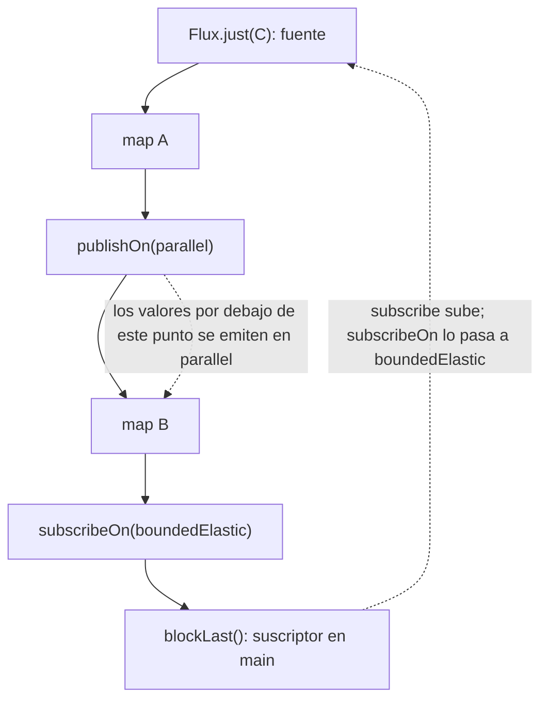

Ejemplo completo: [`code/spring-cloud-reactor/l03-reactor`](https://github.com/spareilleux/learn/tree/main/code/spring-cloud-reactor/l03-reactor). Sus pruebas se ejecutan con BlockHound cargado como agente Java, como en la [lección 11 del curso de Java](../../java-for-csharp/11-testing/), y comparan cada salida con [`expected`](https://github.com/spareilleux/learn/tree/main/code/spring-cloud-reactor/l03-reactor/expected). El lado .NET es [`csharp/l03-polly-channels.cs`](https://github.com/spareilleux/learn/blob/main/code/spring-cloud-reactor/csharp/l03-polly-channels.cs).

## Hilos: nadie te mueve si no lo pides

En C#, el hilo que ejecuta el código que sigue a un `await` se elige por ti: el contexto de sincronización si lo hay, si no el thread pool. Reactor hace lo contrario. Un pipeline se ejecuta en el hilo que se suscribe a él, y solo pasa a otro hilo allí donde un operador o un **scheduler** lo indica. Por eso todos los ejemplos de la lección 2 se ejecutaron en `main`.

| Scheduler | Hilos | Para | Equivalente .NET |
|---|---|---|---|
| `Schedulers.immediate()` | el actual | pruebas, valores por defecto | ejecución síncrona |
| `Schedulers.single()` | un hilo reutilizable | trabajo sensible al orden | un hilo dedicado con una cola |
| `Schedulers.parallel()` | uno por núcleo de CPU | trabajo corto y no bloqueante | los worker threads del thread pool |
| `Schedulers.boundedElastic()` | hasta 10 por núcleo, creados bajo demanda, liberados tras 60 s inactivos | llamadas bloqueantes | `Task.Factory.StartNew(..., TaskCreationOptions.LongRunning)` |
| `Schedulers.fromExecutorService(...)` | los que le pases | integrar un pool existente | un `TaskScheduler` personalizado |

Los tamaños vienen de la [guía de referencia de Reactor](https://projectreactor.io/docs/core/release/reference/coreFeatures/schedulers.html): `boundedElastic()` además encola hasta 100.000 tareas cuando todos sus hilos están ocupados. Dos operadores sitúan un scheduler en un pipeline:

```java
/** El nombre del hilo sin su número: parallel-3 y parallel-7 son el mismo pool. */
static String thread() {
    return Thread.currentThread().getName().replaceAll("-\\d+$", "");
}

static <T> T step(String name, T value) {
    System.out.println("  " + name + " on " + thread());
    return value;
}

public static void main(String[] args) {
    System.out.println("no scheduler:");
    Flux.just("C").map(root -> step("map", root)).subscribe(root -> step("subscriber", root));

    // publishOn mueve todo lo que tiene debajo a otro scheduler, como ConfigureAwait con un contexto personalizado.
    System.out.println("publishOn(parallel):");
    Flux.just("C")
            .map(root -> step("map above publishOn", root))
            .publishOn(Schedulers.parallel())
            .map(root -> step("map below publishOn", root))
            .blockLast();

    // subscribeOn mueve la suscripción, y por tanto la fuente y todo lo que hay hasta el primer publishOn.
    System.out.println("subscribeOn(boundedElastic):");
    Mono.fromCallable(() -> step("callable", Scale.of("D", "dorian")))
            .map(scale -> step("map", scale))
            .subscribeOn(Schedulers.boundedElastic())
            .block();

    // Dónde se escribe subscribeOn da igual; dónde se escribe publishOn, no.
    System.out.println("both, subscribeOn written last:");
    Flux.just("C")
            .map(root -> step("map A", root))
            .publishOn(Schedulers.parallel())
            .map(root -> step("map B", root))
            .subscribeOn(Schedulers.boundedElastic())
            .blockLast();

    // Los operadores basados en tiempo eligen un scheduler por ti: Mono.delay emite en parallel().
    System.out.println("Mono.delay:");
    Mono.delay(Duration.ofMillis(1)).map(tick -> step("map after delay", tick)).block();
    step("block() returned", "");
}
```

```text
no scheduler:
  map on main
  subscriber on main
publishOn(parallel):
  map above publishOn on main
  map below publishOn on parallel
subscribeOn(boundedElastic):
  callable on boundedElastic
  map on boundedElastic
both, subscribeOn written last:
  map A on boundedElastic
  map B on parallel
Mono.delay:
  map after delay on parallel
  block() returned on main
```

Los números de hilo se eliminan porque dependen de lo que se ejecutó antes. La regla detrás de la salida se deduce de las señales de la lección 2: una suscripción **sube** por el pipeline, del suscriptor a la fuente, y los valores vuelven **bajando**.



- **`publishOn`** cambia el hilo de las señales que pasan por él, y por tanto de todos los operadores situados *debajo*. Su posición importa, y un pipeline puede tener varios.
- **`subscribeOn`** cambia el hilo por el que sube la suscripción, y por tanto el hilo en el que la fuente empieza a emitir. Su posición da igual; si hay varios, gana el más cercano a la fuente. Ponlo justo después de la fuente, que es donde los lectores lo buscan.
- **Los operadores basados en tiempo cambian de hilo sin avisar.** `Mono.delay`, `Flux.interval`, `timeout` y `delayElements` emiten en `parallel()` salvo que se les dé otro scheduler. El código que va detrás ya no se ejecuta en el hilo de quien llama, que es la sorpresa más habitual cuando un pipeline de repente se comporta de otra manera en una prueba.

`block()` retornó en `main` porque bloquear es un hilo esperando un resultado, no una continuación: `.GetAwaiter().GetResult()` se comporta igual.

## Backpressure

El `log()` de la lección 2 mostraba un `request(2)`. Eso es la **backpressure** («contrapresión»): el suscriptor indica cuántos valores puede aceptar, y un publisher que se porta bien nunca envía más.

```java
/** Un suscriptor que pide {@code batch} elementos, y luego más solo si {@code askForMore}. */
static final class Batches<T> extends BaseSubscriber<T> {
    private final int batch;
    private final boolean askForMore;
    private int received;

    Batches(int batch, boolean askForMore) {
        this.batch = batch;
        this.askForMore = askForMore;
    }

    @Override
    protected void hookOnSubscribe(Subscription subscription) {
        request(batch);
    }

    @Override
    protected void hookOnNext(T value) {
        System.out.println("  got " + value);
        received++;
        if (askForMore && received % batch == 0) {
            request(batch);
        }
    }

    @Override
    protected void hookOnError(Throwable error) {
        System.out.println("  error " + error.getClass().getSimpleName() + ": " + error.getMessage());
    }
}
```

`BaseSubscriber` es la clase que hay que extender cuando necesitas controlar la demanda a mano. El ejemplo la usa de cinco maneras:

```java
List<String> progression = List.of("Dm7", "G7", "Cmaj7", "A7", "Dm7", "G7");

// El suscriptor tira: la fuente nunca envía más de lo que se pidió.
System.out.println("a subscriber that requests 2 at a time:");
Flux.fromIterable(progression)
        .doOnRequest(n -> System.out.println("  source asked for " + n))
        .subscribe(new Batches<>(2, true));

// limitRate divide una demanda grande en lotes, y vuelve a pedir cuando ha llegado el 75 % de un lote.
System.out.println("limitRate(10) under an unbounded subscriber, first 25 elements:");
Flux.range(1, 1_000)
        .doOnRequest(n -> System.out.println("  source asked for " + n))
        .limitRate(10)
        .take(25, false)
        .blockLast();

// publishOn mantiene una cola entre dos hilos, y la llena pidiendo 256 elementos.
System.out.println("publishOn:");
Flux.range(1, 3)
        .doOnRequest(n -> System.out.println("  source asked for " + n))
        .publishOn(Schedulers.single())
        .blockLast();

// Una fuente que ignora la demanda necesita una estrategia: buffer (hasta un tamaño), descartar o quedarse con el último.
System.out.println("onBackpressureDrop, subscriber requests 3:");
var dropped = new ArrayList<Integer>();
Flux.range(1, 10)
        .onBackpressureDrop(dropped::add)
        .subscribe(new Batches<>(3, false));
System.out.println("  dropped " + dropped);

// El error de desbordamiento espera detrás de los elementos en el buffer: el suscriptor lo ve tras vaciarlos.
System.out.println("onBackpressureBuffer(3), subscriber requests 1:");
var slow = new Batches<Integer>(1, false);
Flux.range(1, 10)
        .onBackpressureBuffer(3)
        .subscribe(slow);
System.out.println("  subscriber now requests 10 more");
slow.request(10);
```

```text
a subscriber that requests 2 at a time:
  source asked for 2
  got Dm7
  got G7
  source asked for 2
  got Cmaj7
  got A7
  source asked for 2
  got Dm7
  got G7
  source asked for 2
limitRate(10) under an unbounded subscriber, first 25 elements:
  source asked for 10
  source asked for 8
  source asked for 8
  source asked for 8
publishOn:
  source asked for 256
onBackpressureDrop, subscriber requests 3:
  got 1
  got 2
  got 3
  dropped [4, 5, 6, 7, 8, 9, 10]
onBackpressureBuffer(3), subscriber requests 1:
  got 1
  subscriber now requests 10 more
  got 2
  got 3
  got 4
  error OverflowException: The receiver is overrun by more signals than expected (bounded queue...)
```

- **La demanda es un número, y se acumula.** El último `source asked for 2` encontró la fuente agotada, así que la secuencia terminó. `take(25, false)` pasa hacia arriba la demanda ilimitada del suscriptor, y por eso se ve `limitRate`; `take(25)` a secas ya limitaría la petición a 25.
- **`limitRate(10)` repone al 75 %.** Después de 10, pidió 8 cada vez: en cuanto se habían consumido 8 de los 10. Un driver de base de datos o un consumidor de mensajes pagina así sus lecturas.
- **`publishOn` es una cola.** Pide 256 elementos, su prefetch por defecto, para llenar la cola entre el hilo de la fuente y el suyo. `flatMap` y `concatMap` también tienen valores de prefetch, y por eso un downstream lento sigue viendo una primera ráfaga.
- **Las fuentes que no pueden frenar necesitan una estrategia.** Un temporizador, un ratón, un broker de mensajes que empuja sin control de flujo: los operadores `onBackpressure…` piden todo hacia arriba y deciden qué hacer con el excedente. `onBackpressureDrop` descartó del 4 al 10. `onBackpressureBuffer(3)` mantuvo una cola acotada y señaló una `OverflowException` cuando se desbordó; el error esperó detrás de los valores del buffer, así que el suscriptor solo lo vio al pedir más. `onBackpressureLatest` conserva solo el valor más reciente.

`IAsyncEnumerable` tiene backpressure gratis, elemento a elemento, porque el consumidor tira con `MoveNextAsync`. El código .NET basado en push la obtiene de un [channel](https://learn.microsoft.com/dotnet/core/extensions/channels) acotado, cuyo `BoundedChannelFullMode` hace el papel de los operadores `onBackpressure…`. El lado C# encontró ahí una trampa:

```text
bounded channel (3, DropWrite): TryWrite returned true 10 times, reader gets 1, 2, 3
```

Con `DropWrite`, `TryWrite` indica éxito para los elementos que descarta, como dice la [documentación de `BoundedChannelFullMode`](https://learn.microsoft.com/dotnet/api/system.threading.channels.boundedchannelfullmode). El `onBackpressureDrop` de Reactor al menos te da un callback con cada valor descartado.

## Errores y reintentos

Una excepción lanzada dentro de un operador se convierte en una señal `onError`, y la lección 2 mostró que termina la secuencia. Los operadores de error son el `try`/`catch` reactivo:

```java
/** Un servicio de escalas que falla hasta su tercera llamada. */
static Mono<String> flakyLookup(AtomicInteger calls) {
    return Mono.fromCallable(() -> {
        int call = calls.incrementAndGet();
        System.out.println("  call " + call);
        if (call < 3) {
            throw new IllegalStateException("scale service unavailable");
        }
        return "D dorian";
    });
}

public static void main(String[] args) {
    // retry(n) se vuelve a suscribir: el Mono es una receta, así que la llamada también se repite.
    System.out.println("retry(2):");
    System.out.println("  result: " + flakyLookup(new AtomicInteger()).retry(2).block());

    System.out.println("retry(1):");
    try {
        flakyLookup(new AtomicInteger()).retry(1).block();
    } catch (IllegalStateException e) {
        System.out.println("  block() threw " + e.getMessage());
    }

    // onErrorReturn es un catch que devuelve un valor; onErrorResume cambia a otro publisher.
    System.out.println("fallbacks:");
    Mono<String> failing = Mono.error(new IllegalStateException("scale service unavailable"));
    System.out.println("  onErrorReturn: " + failing.onErrorReturn("C ionian").block());
    System.out.println("  onErrorResume: " + failing.onErrorResume(e -> Mono.just("cached: " + e.getMessage())).block());

    // onErrorMap es capturar y envolver; doOnError solo mira.
    try {
        failing.doOnError(e -> System.out.println("  doOnError saw: " + e.getMessage()))
                .onErrorMap(e -> new RuntimeException("lookup failed", e))
                .block();
    } catch (RuntimeException e) {
        System.out.println("  onErrorMap: " + e.getMessage() + ", caused by " + e.getCause().getMessage());
    }

    // timeout también es una señal: aquí una llamada de 5 segundos se corta a los 50 ms y se sustituye.
    System.out.println("timeout:");
    String answer = Mono.delay(Duration.ofSeconds(5)).map(tick -> "too late")
            .timeout(Duration.ofMillis(50), Mono.just("timed out, default scale"))
            .block();
    System.out.println("  " + answer);
}
```

```text
retry(2):
  call 1
  call 2
  call 3
  result: D dorian
retry(1):
  call 1
  call 2
  block() threw scale service unavailable
fallbacks:
  onErrorReturn: C ionian
  onErrorResume: cached: scale service unavailable
  doOnError saw: scale service unavailable
  onErrorMap: lookup failed, caused by scale service unavailable
timeout:
  timed out, default scale
```

`retry` solo funciona porque se cumple la primera regla de la lección 2: un `Mono` es una receta, así que volver a suscribirse vuelve a llamar al servicio. Un reintento alrededor de `Mono.just(callService())` repetiría para siempre el mismo valor fallido. `block()` relanzó la `IllegalStateException` original sin envolver, porque es unchecked; una excepción checked habría vuelto envuelta en una `ReactiveException`.

Los reintentos reales esperan entre intentos. [`Retry.backoff`](https://projectreactor.io/docs/core/release/api/reactor/util/retry/Retry.html) es el reintento exponencial de Polly, probado aquí en tiempo virtual:

```java
@Test
void backoffWaitsLongerEachTime() {
    var calls = new AtomicInteger();
    // AddRetry de Polly con MaxRetryAttempts = 3, Delay = 100 ms, BackoffType = Exponential, UseJitter = false.
    StepVerifier.withVirtualTime(() -> Mono.error(new IllegalStateException("scale service unavailable"))
                    .doOnSubscribe(subscription -> calls.incrementAndGet())
                    .retryWhen(Retry.backoff(3, Duration.ofMillis(100)).jitter(0)))
            .expectSubscription()
            .expectNoEvent(Duration.ofMillis(100 + 200 + 400))
            .consumeErrorWith(error -> Expected.check("retries-exhausted",
                    error.getClass().getName() + ": " + error.getMessage() + "\ncaused by " + error.getCause()
                            + "\nsubscriptions: " + calls.get()))
            .verify();
}
```

```text
reactor.core.Exceptions$RetryExhaustedException: Retries exhausted: 3/3
caused by java.lang.IllegalStateException: scale service unavailable
subscriptions: 4
```

Los reintentos esperaron 100, 200 y 400 ms de tiempo virtual, y después el error cambió de tipo: `Retry.backoff` envuelve el último fallo en `RetryExhaustedException`. Polly no envuelve. El lado C#, con dos reintentos:

```text
Polly, 2 retries:
  call 1
  retry 1 after 10 ms
  call 2
  retry 2 after 20 ms
  call 3
  result: D dorian
Polly, retries exhausted:
  retry 1 after 10 ms
  retry 2 after 20 ms
  InvalidOperationException: scale service still unavailable
```

| Polly | Reactor |
|---|---|
| `AddRetry`, `MaxRetryAttempts` | `retry(n)`, `retryWhen(Retry.max(n))` |
| `BackoffType.Exponential`, `Delay` | `Retry.backoff(n, firstBackoff)` |
| `UseJitter` | `.jitter(0.5)` por defecto; `.jitter(0)` lo desactiva |
| `ShouldHandle = new PredicateBuilder().Handle<T>()` | `.filter(error -> error instanceof T)` |
| `AddTimeout` | `timeout(Duration)` |
| `AddFallback` | `onErrorResume`, `onErrorReturn` |
| se relanza la última excepción | `RetryExhaustedException` la envuelve, salvo que `onRetryExhaustedThrow` indique otra cosa |
| `AddCircuitBreaker` | no está en Reactor: Resilience4j, en la lección 9 |

El jitter está activado por defecto en `Retry.backoff`: sin `.jitter(0)`, las esperas varían y una prueba no puede esperar duraciones exactas.

## El contexto: `AsyncLocal` para pipelines

Un ID de petición, el usuario actual o un span de traza suelen viajar como contexto ambiental. La [lección 9 del curso de Java](../../java-for-csharp/09-concurrency-and-virtual-threads/) mostró que `ThreadLocal` no sigue a una tarea a otro hilo. En un pipeline de Reactor, que cambia de hilo en cada `publishOn`, no sirve de nada. El **contexto** de Reactor es un map inmutable asociado a la suscripción:

```java
static final ThreadLocal<String> CURRENT_USER = new ThreadLocal<>();

/** Lee el usuario del contexto del suscriptor en el momento en que alguien se suscribe. */
static Mono<String> greeting() {
    return Mono.deferContextual(context -> Mono.just("hello " + context.getOrDefault("user", "anonymous")));
}

public static void main(String[] args) {
    // contextWrite se escribe debajo de los operadores que lo leen: el contexto sube con la suscripción.
    System.out.println("context below the reader: " + greeting().contextWrite(Context.of("user", "ada")).block());

    // Escrito encima, solo llega a lo que está por encima de él.
    System.out.println("context above the reader: " + Mono.just("ignored")
            .contextWrite(Context.of("user", "ada"))
            .flatMap(value -> greeting())
            .block());

    // Dos escrituras: gana la más cercana al lector.
    System.out.println("two writes: " + greeting()
            .contextWrite(Context.of("user", "grace"))
            .contextWrite(Context.of("user", "ada"))
            .block());

    // Un ThreadLocal se queda en su hilo; el contexto sigue al pipeline hasta otro.
    CURRENT_USER.set("ada");
    try {
        String seen = Mono.just("scale")
                .publishOn(Schedulers.parallel())
                .flatMap(value -> Mono.deferContextual(context ->
                        Mono.just("ThreadLocal=" + CURRENT_USER.get() + ", context=" + context.get("user"))))
                .contextWrite(Context.of("user", "ada"))
                .block();
        System.out.println("after publishOn: " + seen);
    } finally {
        CURRENT_USER.remove();
    }
}
```

```text
context below the reader: hello ada
context above the reader: hello anonymous
two writes: hello grace
after publishOn: ThreadLocal=null, context=ada
```

La dirección es la única sorpresa. `AsyncLocal` fluye de quien llama a lo que llama, de arriba abajo en el código fuente. El contexto de Reactor fluye con la suscripción, del suscriptor hacia la fuente, así que `contextWrite` va **en la parte de abajo** del pipeline, debajo de los operadores que lo leen; un framework como WebFlux lo escribe al final del todo, donde se suscribe. Una escritura situada encima de un lector es invisible para él, y de dos escrituras gana la más cercana. El lado C# muestra `AsyncLocal` cruzando hilos, como hace el contexto:

```text
in a new thread: AsyncLocal=ada, ThreadLocal=null
```

Las bibliotecas que todavía leen `ThreadLocal`, como los frameworks de logging con un MDC, necesitan un puente entre los dos mundos: la biblioteca de [context propagation](https://docs.micrometer.io/context-propagation/reference/) de Micrometer, que la lección 11 usará para el tracing.

## Llamadas bloqueantes

Un hilo de `parallel()` que se bloquea durante 20 ms no puede atender nada más durante 20 ms, y solo hay tantos como núcleos. WebFlux atiende todas las peticiones en un conjunto igual de pequeño de hilos event loop de Netty. Bloquear uno de ellos es la versión reactiva del sync-over-async de C#, con el mismo síntoma: el rendimiento se hunde bajo carga mientras la CPU está ociosa. Reactor rechaza el caso más visible, un `block()` en un hilo no bloqueante:

```java
/** Representa una consulta JDBC o un cliente HTTP bloqueante: 20 ms de espera. */
static Scale slowLookup(String root, String mode) {
    try {
        Thread.sleep(20);
    } catch (InterruptedException e) {
        Thread.currentThread().interrupt();
        throw new IllegalStateException(e);
    }
    return Scale.of(root, mode);
}

public static void main(String[] args) {
    // block() dentro de un pipeline que se ejecuta en parallel(): Reactor se niega a esperar ahí.
    try {
        Mono.delay(Duration.ofMillis(1))
                .map(tick -> Mono.fromCallable(() -> slowLookup("D", "dorian")).subscribeOn(Schedulers.boundedElastic()).block())
                .block();
    } catch (IllegalStateException e) {
        System.out.println("nested block(): " + e.getMessage().replaceAll("parallel-\\d+", "parallel-N"));
    }

    // La solución: flatMap hacia un publisher propio, suscrito en boundedElastic(), el scheduler para el trabajo bloqueante.
    Scale scale = Mono.delay(Duration.ofMillis(1))
            .flatMap(tick -> Mono.fromCallable(() -> slowLookup("D", "dorian")).subscribeOn(Schedulers.boundedElastic()))
            .block();
    System.out.println("flatMap and boundedElastic: " + scale.notes());
}
```

```text
nested block(): block()/blockFirst()/blockLast() are blocking, which is not supported in thread parallel-N
flatMap and boundedElastic: [D, E, F, G, A, B, C]
```

La solución es el patrón que hay que recordar: envolver la llamada bloqueante en `Mono.fromCallable`, suscribirla en `boundedElastic()` y unirla al pipeline con `flatMap` en lugar de esperarla.

La comprobación de Reactor solo cubre `block()`, y no todos los `block()`. [`HiddenBlocking`](https://github.com/spareilleux/learn/blob/main/code/spring-cloud-reactor/l03-reactor/src/main/java/dev/learn/reactor/l03/HiddenBlocking.java) duerme directamente en un `map` y luego llama a `block()` sobre un `Mono.fromCallable` sin `subscribeOn`, ambos en un hilo de `parallel()`. La prueba lo ejecuta en una JVM nueva, primero sin BlockHound y después con su agente:

```text
without BlockHound:
sleep in map: no error, [E, F, G, A, B, C, D]
nested block() of Mono.fromCallable: no error, ran on parallel
with BlockHound:
sleep in map: reactor.core.Exceptions$ReactiveException: reactor.blockhound.BlockingOperationError: Blocking call! java.lang.Thread.sleepNanos0
nested block() of Mono.fromCallable: reactor.core.Exceptions$ReactiveException: reactor.blockhound.BlockingOperationError: Blocking call! java.lang.Thread.sleepNanos0
```

El segundo caso me sorprendió. `block()` sobre un `Mono.fromCallable` no se suscribe en absoluto: el `MonoCallable` de Reactor sobrescribe `block()` para llamar al callable directamente en el hilo actual, y ese atajo se salta la comprobación que detectó el primer ejemplo. [BlockHound](https://github.com/reactor/BlockHound) instrumenta en cambio los métodos bloqueantes del JDK, así que ve ambos, sea cual sea el camino. La lección 11 del curso de Java lo configura, con la opción `-XX:+AllowRedefinitionToAddDeleteMethods` que sigue necesitando en JDK 25; el POM de este módulo hace lo mismo, y el ejercicio 2 cuenta con ello.

## ¿Hilos virtuales o reactivo?

Los [hilos virtuales](../../java-for-csharp/09-concurrency-and-virtual-threads/) abaratan el bloqueo, lo que elimina la razón principal de que exista Reactor: no desperdiciar hilos mientras se espera. Los dos se encuentran en el propio Reactor. Con una propiedad de sistema, `boundedElastic()` ejecuta cada tarea en un hilo virtual nuevo; la prueba ejecuta el mismo programa en dos JVM:

```java
String where = Mono.fromCallable(() -> {
            Thread thread = Thread.currentThread();
            return thread.getName().replaceAll("-\\d+$", "") + ", virtual=" + thread.isVirtual();
        })
        .subscribeOn(Schedulers.boundedElastic())
        .block();
System.out.println("boundedElastic() ran the call on " + where);
```

```text
default:
boundedElastic() ran the call on boundedElastic, virtual=false
with the property:
boundedElastic() ran the call on loomBoundedElastic, virtual=true
```

La propiedad es `reactor.schedulers.defaultBoundedElasticOnVirtualThreads=true`, documentada en la [guía de referencia de Reactor](https://projectreactor.io/docs/core/release/reference/coreFeatures/schedulers.html) para Java 21 y posteriores. Del lado de Spring, `spring.threads.virtual.enabled=true` hace que el Tomcat de Spring MVC atienda cada petición en un hilo virtual, según la [documentación de Spring Boot](https://docs.spring.io/spring-boot/reference/features/spring-application.html#features.spring-application.virtual-threads).

Entonces, ¿cuál elegir para un servicio nuevo? El compromiso, tal como lo entiendo después de estas cuatro lecciones:

| | Spring MVC sobre hilos virtuales | WebFlux y Reactor |
|---|---|---|
| Estilo de código | Java bloqueante normal, como C# síncrono | pipelines de operadores |
| Trazas de pila y depuración | normales | fragmentadas; `checkpoint()` y `Hooks.onOperatorDebug()` ayudan |
| Bibliotecas | todas, incluido JDBC | solo drivers reactivos (R2DBC, clientes reactivos) o `boundedElastic()` |
| Backpressure y streaming | a mano | integrados: `Flux`, `limitRate`, server-sent events |
| Cancelación | la interrupción, que según mostró la lección 9 del curso de Java es fácil de perder | una señal `cancel()` que llega hasta la fuente |
| Composición de muchas llamadas concurrentes | la concurrencia estructurada sigue en preview en Java 25 | `zip`, `merge`, `flatMap` con límite de concurrencia, `timeout`, `retry` |
| Spring Cloud Gateway | existe una variante Web MVC | la implementación original, reactiva |

Para un servicio CRUD sobre una base de datos relacional, los hilos virtuales son la opción más sencilla. Para un gateway, un servicio que hace streaming, o uno que reparte llamadas a muchos otros servicios con timeouts y límites, los operadores de Reactor justifican su complejidad. Es también el reparto del mundo C#, donde `IAsyncEnumerable` y los channels cubren el streaming y Rx.NET sigue siendo una herramienta de especialistas. Cómo se comparan los dos en rendimiento en esta máquina está *por verificar*: no lo he medido, y la lección 11 es el lugar para hacerlo con Micrometer.

## Puntos clave

- Un pipeline se ejecuta en el hilo que se suscribe hasta que `publishOn`, `subscribeOn` o un operador basado en tiempo lo mueven. `publishOn` afecta a lo que tiene debajo; `subscribeOn` afecta a la fuente, esté donde esté escrito.
- Usa `parallel()` para el trabajo corto no bloqueante y `boundedElastic()` para las llamadas bloqueantes, envueltas en `Mono.fromCallable(...).subscribeOn(boundedElastic())` y unidas con `flatMap`.
- La backpressure es un contador de demanda que sube hacia la fuente. `limitRate` la pagina, `publishOn` hace un prefetch de 256, y `onBackpressureBuffer`, `Drop` y `Latest` gestionan las fuentes que no pueden frenar.
- `retry` vuelve a suscribirse, así que necesita una fuente perezosa. `Retry.backoff` añade esperas exponenciales con jitter activado por defecto, y envuelve el último error en `RetryExhaustedException`.
- El contexto de Reactor fluye del suscriptor hacia la fuente: `contextWrite` va abajo. Sobrevive a los cambios de hilo; `ThreadLocal`, no.
- Reactor rechaza algunas llamadas `block()` anidadas, pero no un `Thread.sleep` dentro de un `map` ni un `block()` sobre `Mono.fromCallable`. Ejecuta BlockHound en las pruebas.
- Los hilos virtuales hacen escalar el código bloqueante; Reactor merece la pena para el streaming, la backpressure y la composición de muchas llamadas concurrentes.

## Ejercicios

1. Una búsqueda puede fallar de dos maneras: `IllegalStateException` cuando el servicio está caído, que puede funcionar más tarde, e `IllegalArgumentException` para una nota desconocida, que nunca funcionará. Escribe `resilientLookup(Mono<Scale> lookup)`, que reintente el primer tipo hasta tres veces con un backoff exponencial a partir de 100 ms y falle de inmediato con el segundo. Prueba los dos caminos, contando las llamadas.

<details>
<summary>Solución</summary>

```java
static Mono<Scale> resilientLookup(Mono<Scale> lookup) {
    return lookup.retryWhen(Retry.backoff(3, Duration.ofMillis(100))
            .jitter(0)
            .filter(error -> error instanceof IllegalStateException));
}

@Test
void exercise1TransientFailuresAreRetried() {
    var calls = new AtomicInteger();
    StepVerifier.withVirtualTime(() -> resilientLookup(lookupThatFailsTwice(calls)))
            .expectSubscription()
            .expectNoEvent(Duration.ofMillis(300))
            .expectNextMatches(scale -> scale.notes().getFirst().sharpName().equals("A"))
            .verifyComplete();
    assertEquals(3, calls.get());
}

@Test
void exercise1PermanentFailuresAreNot() {
    var calls = new AtomicInteger();
    StepVerifier.create(resilientLookup(Mono.fromCallable(() -> {
                calls.incrementAndGet();
                return Scale.of("H", "minor");
            })))
            .expectErrorMessage("unknown note: H")
            .verify(Duration.ofSeconds(1));
    assertEquals(1, calls.get());
}
```

`filter` es el `ShouldHandle` de Polly: un error que no coincide se transmite sin cambios, sin envolver y sin esperar. La primera prueba tiene éxito en la tercera llamada tras 100 + 200 ms de tiempo virtual. `verify(Duration.ofSeconds(1))` en la segunda prueba acota el tiempo de espera real, así que un error que reintentara para siempre haría fallar la prueba en lugar de colgarla.

</details>

2. Busca las escalas mayores de C, G, D, A, E, B, F# y C# con el `slowLookup` bloqueante, como mucho cuatro a la vez, desde un pipeline que se ejecuta en `parallel()`, y devuelve sus acordes de tónica en el orden de la entrada. BlockHound está activo en las pruebas del módulo: la solución no debe bloquear un hilo de `parallel()`.

<details>
<summary>Solución</summary>

```java
static Flux<String> tonics(Flux<String> roots, Function<String, Scale> blockingLookup) {
    return roots
            .publishOn(Schedulers.parallel())
            .flatMapSequential(root -> Mono.fromCallable(() -> blockingLookup.apply(root))
                    .subscribeOn(Schedulers.boundedElastic()), 4)
            .map(scale -> scale.triads().getFirst().symbol());
}
```

`flatMapSequential` se suscribe a hasta cuatro publishers internos a la vez, su segundo argumento, y reordena sus resultados según la entrada: `flatMap` emitiría en orden de finalización, `concatMap` ejecutaría una búsqueda cada vez. Cada búsqueda se ejecuta en `boundedElastic()`, así que BlockHound no pone objeciones. La prueba envuelve `slowLookup` para contar las llamadas que se ejecutan al mismo tiempo, y comprueba que el máximo es mayor que 1 y como mucho 4. No mide la duración, lo que la haría inestable en un runner de CI cargado.

</details>

3. Escribe `handle(String root)`, que busca una escala mayor, pasa a `parallel()` y devuelve una línea de log como `[req-42] looked up D#` construida por `logLine(message)`. `logLine` debe leer el ID de petición del contexto e imprimir `no-request` cuando no lo haya. ¿Dónde hay que escribir el ID de petición?

<details>
<summary>Solución</summary>

```java
static Mono<String> logLine(String message) {
    return Mono.deferContextual(context -> Mono.just("[" + context.getOrDefault("requestId", "no-request") + "] " + message));
}

static Mono<String> handle(String root) {
    return Mono.fromCallable(() -> Scale.of(root, "major"))
            .publishOn(Schedulers.parallel())
            .flatMap(scale -> logLine("looked up " + scale.root()));
}

@Test
void exercise3RequestIdInTheContext() {
    StepVerifier.create(handle("Eb").contextWrite(Context.of("requestId", "req-42")))
            .expectNext("[req-42] looked up D#")
            .verifyComplete();
    StepVerifier.create(handle("Eb"))
            .expectNext("[no-request] looked up D#")
            .verifyComplete();
}
```

Lo escribe quien llama, debajo de `handle(...)`, exactamente donde WebFlux lo pondría para una petición: `handle` ni recibe el ID como parámetro ni sabe que existe, como con `AsyncLocal`. El `publishOn` intermedio no lo pierde. `Eb` se imprime como `D#` porque el módulo `music` nombra las notas con sostenidos.

</details>

## Fuentes

- Guía de referencia de Reactor: [hilos y schedulers](https://projectreactor.io/docs/core/release/reference/coreFeatures/schedulers.html), [gestión de errores](https://projectreactor.io/docs/core/release/reference/coreFeatures/error-handling.html), [añadir un contexto a una secuencia reactiva](https://projectreactor.io/docs/core/release/reference/advancedFeatures/context.html), [depurar Reactor](https://projectreactor.io/docs/core/release/reference/debugging.html)
- Javadoc de [`Retry`](https://projectreactor.io/docs/core/release/api/reactor/util/retry/Retry.html) y de [`BaseSubscriber`](https://projectreactor.io/docs/core/release/api/reactor/core/publisher/BaseSubscriber.html); [BlockHound](https://github.com/reactor/BlockHound)
- [Spring Boot: hilos virtuales](https://docs.spring.io/spring-boot/reference/features/spring-application.html#features.spring-application.virtual-threads), [JEP 444 — Virtual Threads](https://openjdk.org/jeps/444)
- .NET: [channels](https://learn.microsoft.com/dotnet/core/extensions/channels), [`BoundedChannelFullMode`](https://learn.microsoft.com/dotnet/api/system.threading.channels.boundedchannelfullmode), [estrategia de reintento de Polly](https://www.pollydocs.org/strategies/retry.html), [`AsyncLocal<T>`](https://learn.microsoft.com/dotnet/api/system.threading.asynclocal-1)
