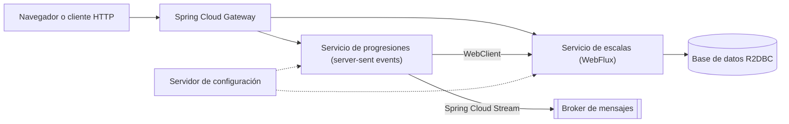

:::note[Versiones estudiadas]
[Spring Boot](https://docs.spring.io/spring-boot/) **4.1.1** con [Spring Framework](https://docs.spring.io/spring-framework/reference/) 7.0.9, [Project Reactor](https://projectreactor.io/docs/core/release/reference/) 3.8.7 y el release train de [Spring Cloud](https://spring.io/projects/spring-cloud) **2025.1.3** ("Oakwood"), sobre Java **25**. Son las versiones que [start.spring.io](https://start.spring.io/) ofrecía por defecto el 2026-09-14. Se comparan con ASP.NET Core sobre .NET **10**. Todos los ejemplos están en [`code/spring-cloud-reactor`](https://github.com/spareilleux/learn/tree/main/code/spring-cloud-reactor): [`spring-cloud-reactor-examples.yml`](https://github.com/spareilleux/learn/blob/main/.github/workflows/spring-cloud-reactor-examples.yml) ejecuta sus pruebas en Windows, Linux y macOS, compara cada salida citada en las lecciones y ejecuta el lado C# de cada comparación.
:::

## Por qué aprendo esto

El [curso de Java](../java-for-csharp/) me enseñó el lenguaje. Sin embargo, el código Java que encuentro en la práctica rara vez es Java a secas: es un servicio Spring Boot, a menudo reactivo, detrás de un gateway de Spring Cloud. Sus anotaciones hacen el trabajo que `Program.cs` hace de forma explícita en ASP.NET Core, y sus `Mono` y `Flux` se parecen a `Task` y a `IAsyncEnumerable` sin comportarse como ellos.

Quiero leer y escribir esos servicios con la misma seguridad que una aplicación ASP.NET Core: saber de dónde viene cada bean, predecir en qué hilo se ejecuta un pipeline y distinguir una verdadera decisión de diseño de una simple costumbre.

## Para quién es este curso

Eres un desarrollador C# con experiencia. Conoces ASP.NET Core, su inyección de dependencias, `IOptions`, `IHostedService`, los health checks, `HttpClient`, `IAsyncEnumerable` y probablemente [Polly](https://www.pollydocs.org/) y [YARP](https://learn.microsoft.com/aspnet/core/fundamentals/servers/yarp/getting-started). Has seguido [Java para desarrolladores C#](../java-for-csharp/), o te sientes cómodo con Java 25, Maven y JUnit. Este curso te remite a las lecciones de aquel curso en lugar de repetirlas: la [lección 9](../java-for-csharp/09-concurrency-and-virtual-threads/) para los hilos virtuales, la [lección 10](../java-for-csharp/10-maven-and-gradle-in-depth/) para Maven, la [lección 11](../java-for-csharp/11-testing/) para JUnit, Mockito y BlockHound.

## El ejemplo conductor

Las lecciones construyen pequeños servicios en torno a la teoría musical: un servicio de escalas que devuelve las notas y los acordes de un modo, un flujo de progresiones, un cliente de cifrados de acordes. El dominio es un módulo Java sencillo, [`music`](https://github.com/spareilleux/learn/tree/main/code/spring-cloud-reactor/music), sin Spring ni Reactor. Al final del curso, las piezas encajan así:

Las lecciones 1 a 4 construyen las dos primeras cajas de la derecha; las lecciones siguientes añaden las demás. Todo se ejecuta en `localhost`, arrancado por las pruebas, sin Docker.

## Al final de este curso, seré capaz de

- crear una aplicación Spring Boot y explicar de dónde vienen cada uno de sus beans, propiedades y endpoints;
- trasladar la inyección de dependencias, la configuración, las opciones y los health checks de ASP.NET Core a los de Spring;
- escribir, probar y depurar pipelines de Reactor, y decir en qué hilo se ejecuta cada paso;
- elegir entre Spring MVC sobre hilos virtuales y WebFlux para un servicio dado;
- construir APIs y clientes HTTP reactivos con WebFlux y `WebClient`;
- poner delante de esos servicios un gateway, configuración centralizada, descubrimiento de servicios y resiliencia con Spring Cloud;
- observar y probar un conjunto de servicios Spring como lo haría con un conjunto de servicios ASP.NET Core.

## Plan

| # | Lección | Ya conoces |
|---|---|---|
| 1 | [Spring Boot visto desde ASP.NET Core](01-spring-boot-from-aspnet-core/) | `Program.cs`, `IServiceCollection`, `appsettings.json`, `IOptions`, health checks |
| 2 | [Reactor: `Mono` y `Flux`](02-reactor-mono-and-flux/) | `Task`, `IAsyncEnumerable`, LINQ, Rx.NET |
| 3 | [Reactor por dentro](03-reactor-under-the-hood/) | el thread pool, `ConfigureAwait`, los channels, Polly, `AsyncLocal` |
| 4 | [WebFlux](04-webflux/) | minimal APIs, `HttpClient`, server-sent events |
| 5 | [Acceso reactivo a datos con R2DBC y Spring Data](05-r2dbc-and-spring-data/) | Entity Framework Core, `IAsyncEnumerable` desde un `DbContext` |
| 6 | [Spring Cloud Gateway](06-spring-cloud-gateway/) | YARP |
| 7 | Configuración centralizada con Spring Cloud Config | proveedores de configuración, Azure App Configuration |
| 8 | Descubrimiento de servicios y balanceo de carga del lado del cliente | descubrimiento de servicios de .NET Aspire, `IHttpClientFactory` |
| 9 | Resiliencia con Resilience4j y Spring Cloud Circuit Breaker | Polly, `Microsoft.Extensions.Http.Resilience` |
| 10 | Mensajería con Spring Cloud Stream | MassTransit, clientes de Azure Service Bus |
| 11 | Observabilidad con Micrometer | OpenTelemetry para .NET, `dotnet-counters` |
| 12 | Probar un conjunto de servicios Spring | `WebApplicationFactory`, pruebas de integración |

[Diario](journal/): lo que probé, lo que me sorprendió, lo que aún tengo que verificar.

## Recursos

- [Documentación de referencia de Spring Boot](https://docs.spring.io/spring-boot/reference/) y la [guía de migración a Spring Boot 4.0](https://github.com/spring-projects/spring-boot/wiki/Spring-Boot-4.0-Migration-Guide)
- [Referencia de Spring Framework](https://docs.spring.io/spring-framework/reference/): el contenedor IoC, Web MVC y WebFlux
- [Guía de referencia de Reactor 3](https://projectreactor.io/docs/core/release/reference/) y el [Javadoc de `Flux`](https://projectreactor.io/docs/core/release/api/reactor/core/publisher/Flux.html), cuyos diagramas de canicas vale la pena leer
- [Spring Cloud](https://spring.io/projects/spring-cloud): release trains y proyectos
- [Especificación Reactive Streams](https://github.com/reactive-streams/reactive-streams-jvm/blob/a625d3aba756e9842ad1291a5b73f5db280b6168/README.md), las cuatro interfaces sobre las que se apoya Reactor
- Del lado .NET: [fundamentos de ASP.NET Core](https://learn.microsoft.com/aspnet/core/fundamentals/), [Reactive Extensions para .NET](https://github.com/dotnet/reactive)
