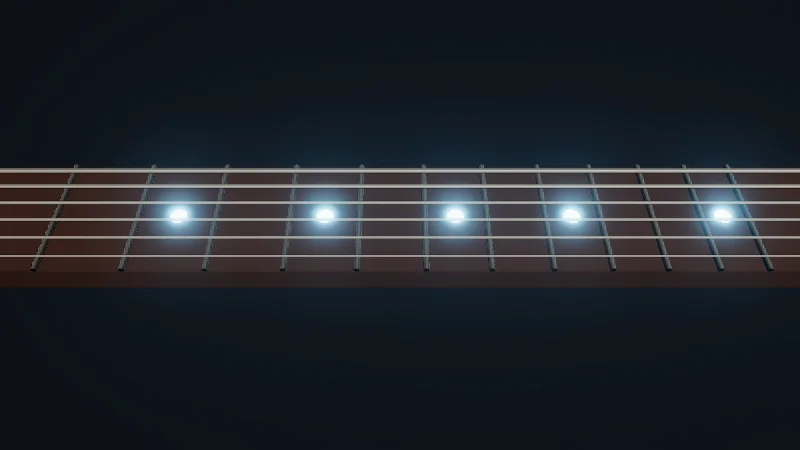

Código: la página en [`src/07-post/main.ts`](https://github.com/spareilleux/learn/blob/8bf126b/code/threejs/src/07-post/main.ts), que reutiliza el diapasón de la lección 5.

## Posprocesado, en tres herramientas

El posprocesado dibuja la escena en una textura en lugar de en la pantalla, y luego ejecuta pixel shaders sobre esa textura: bloom, antialiasing, profundidad de campo, corrección de color. En MonoGame, lo haces a mano: `GraphicsDevice.SetRenderTarget` con un [`RenderTarget2D`](https://docs.monogame.net/api/Microsoft.Xna.Framework.Graphics.RenderTarget2D.html), dibujas la escena, y luego dibujas la textura sobre un quad a pantalla completa a través de un `Effect`. WPF aplica un [`ShaderEffect`](https://learn.microsoft.com/dotnet/api/system.windows.media.effects.shadereffect) a los píxeles renderizados de un elemento, incluidos los de un `Viewport3D`.

three.js tenía `EffectComposer` para `WebGLRenderer`: una lista de pasadas, cada una un `ShaderMaterial` dibujado sobre un quad. `WebGPURenderer` lo reemplaza por [`RenderPipeline`](https://threejs.org/docs/pages/RenderPipeline.html), donde los efectos son nodos TSL de la lección 6, conectados en un grafo.

| | MonoGame | three.js, `WebGLRenderer` | three.js, `WebGPURenderer` |
|---|---|---|---|
| La cadena | tu código, target a target | `EffectComposer`, una lista de pasadas | `RenderPipeline`, un grafo de nodos |
| Renderizar la escena | `SetRenderTarget`, y luego dibujar | `RenderPass` | `pass(scene, camera)` |
| Un efecto | un `Effect` sobre un quad | `UnrealBloomPass`, `ShaderPass(shader)` | `bloom(node)`, `fxaa(node)`, cualquier nodo TSL |
| Mapeo de tonos y sRGB | tu último shader | `OutputPass`, añadido a mano | aplicados por el pipeline, salvo con `outputColorTransform = false` |
| Cada fotograma | `Draw` | `composer.render()` | `pipeline.render()`, en lugar de `renderer.render()` |

`RenderPipeline` se llamaba `PostProcessing` hasta r183. El nombre antiguo sigue funcionando, con un aviso: "PostProcessing: "PostProcessing" has been renamed to "RenderPipeline". Please update your code to use "THREE.RenderPipeline" instead." ([`PostProcessing.js`, líneas 5-20](https://github.com/mrdoob/three.js/blob/r186/src/renderers/common/PostProcessing.js#L5-L20)).

## Bloom sobre las incrustaciones

El diapasón recibe cinco incrustaciones que emiten luz, con una intensidad emisiva de 6: muy por encima de 1, lo más brillante que un píxel puede mostrar después del mapeo de tonos. El bloom toma los píxeles por encima de un umbral, los desenfoca a varios tamaños y suma el desenfoque a la imagen, de modo que lo brillante resplandece como a través del objetivo de una cámara ([líneas 46-62](https://github.com/spareilleux/learn/blob/8bf126b/code/threejs/src/07-post/main.ts#L46-L62)):

```ts
// La cadena, como grafo de nodos: la textura de color de la pasada de escena, el bloom sumado encima, y luego la transformación de salida
let pipeline: THREE.RenderPipeline | null = null;
let direct: THREE.DirectRenderPipeline | null = null;
const disposables: { dispose(): void }[] = [];
if (mode === 'bloom' || mode === 'bloom-fxaa') {
  pipeline = new THREE.RenderPipeline(renderer);
  const scenePass = pass(scene, camera);
  const sceneColor = scenePass.getTextureNode('output');
  const glow = bloom(sceneColor, 1.2, 0.4, threshold);
  disposables.push(scenePass, glow);
  if (mode === 'bloom') {
    pipeline.outputNode = sceneColor.add(glow);
  } else {
    // FXAA espera valores sRGB con mapeo de tonos: se desactiva la transformación de salida propia del pipeline y se aplica antes de FXAA
    pipeline.outputColorTransform = false;
    pipeline.outputNode = fxaa(renderOutput(sceneColor.add(glow)));
  }
}
```

`pass(scene, camera)` renderiza la escena en un render target, y `getTextureNode('output')` es su color, como nodo. [`bloom(node, strength, radius, threshold)`](https://github.com/mrdoob/three.js/blob/r186/examples/jsm/tsl/display/BloomNode.js#L585-L597) viene de `three/addons/tsl/display/BloomNode.js`; los addons tienen unos cincuenta nodos de este tipo en la misma carpeta, desde `fxaa` y `smaa` hasta `ssao`, `ssr`, `dof` y `outline`. `sceneColor.add(glow)` es TSL: la imagen final es la escena más su resplandor. El pipeline renderiza ese grafo sobre un quad a pantalla completa, y luego aplica el mapeo de tonos y la conversión a sRGB del renderer, ya que `outputColorTransform` vale `true` por defecto.

El bucle de la página llama a `pipeline.render()` en lugar de `renderer.render(scene, camera)`: la escena la renderiza la pasada, dentro del pipeline.

## Lo que cuesta cada cadena

La página acepta `?pipeline=none`, `bloom`, `bloom-fxaa` o `direct`. Para cada uno, la sonda lee cuatro píxeles: la incrustación del traste 5, el mástil a 0.06 unidades de ella, donde debería estar el halo, el mástil a 0.15 unidades, y el fondo en una esquina.

```text
$ node scripts/probe.mjs 07-post --query pipeline=none
{
  "frame": 4,
  "render": {
    "calls": 6,
    "drawCalls": 25,
    "triangles": 941
  },
  "memory": {
    "geometries": 10,
    "textures": 3,
    "programs": 4
  },
  "pipeline": "none",
  "threshold": 1,
  "renderTargets": 1,
  "pixels": {
    "inlay at fret 5": "rgb(242, 250, 252)",
    "halo, 0.06 beside it": "rgb(53, 28, 20)",
    "neck, 0.15 beside it": "rgb(53, 28, 20)",
    "background": "rgb(12, 15, 20)"
  }
}
```

```text
$ node scripts/probe.mjs 07-post --query pipeline=bloom
{
  "frame": 4,
  "render": {
    "calls": 42,
    "drawCalls": 37,
    "triangles": 953
  },
  "memory": {
    "geometries": 10,
    "textures": 14,
    "programs": 13
  },
  "pipeline": "bloom",
  "threshold": 1,
  "renderTargets": 12,
  "pixels": {
    "inlay at fret 5": "rgb(247, 252, 254)",
    "halo, 0.06 beside it": "rgb(127, 168, 190)",
    "neck, 0.15 beside it": "rgb(74, 81, 94)",
    "background": "rgb(13, 17, 23)"
  }
}
```



<details>
<summary>Página en vivo: ejecutarla aquí</summary>

<iframe src="../../../threejs-demos/07-post.html" title="Lección 7, en vivo" loading="lazy" width="100%" height="420" allow="fullscreen; autoplay; xr-spatial-tracking" style={{ border: 0, display: "block", height: "min(420px, 70vh)" }}></iframe>

</details>

[Abrir a pantalla completa](../../../threejs-demos/07-post.html). **Pruébalo**: pon *bloom threshold* en 0, la escena del ejercicio 1; *pipeline* cambia entre las cadenas de la sección siguiente.

| `?pipeline=` | llamadas, 3 fotogramas | llamadas de dibujo | render targets | programas | halo, a 0.06 | mástil, a 0.15 | fondo |
|---|---|---|---|---|---|---|---|
| `none` | 6 | 25 | 1 | 4 | 53, 28, 20 | 53, 28, 20 | 12, 15, 20 |
| `bloom` | 42 | 37 | 12 | 13 | 127, 168, 190 | 74, 81, 94 | 13, 17, 23 |
| `bloom-fxaa` | 45 | 38 | 13 | 15 | 132, 174, 195 | 74, 82, 96 | 13, 17, 23 |
| `direct` | 3 | 25 | 0 | 4 | 53, 28, 20 | 53, 28, 20 | 12, 15, 20 |

Sin bloom, el mástil junto a la incrustación tiene el mismo marrón que en cualquier otro sitio. Con él, el halo vuelve el mástil azul claro a 0.06 unidades, todavía lo tiñe a 0.15, e incluso aclara el fondo unos pocos niveles. El precio está en las demás columnas:

- **Llamadas de dibujo: 37 en lugar de 25.** Los 24 objetos se dibujan una vez, en la pasada de escena. Luego vienen 13 quads a pantalla completa: uno para quedarse con los píxeles brillantes, cinco desenfocados en horizontal y cinco en vertical a tamaños que se reducen a la mitad, uno para combinarlos, y el quad de salida del pipeline. Por fotograma, `calls` cuenta 14 renders en lugar de 2.
- **Render targets: 12 en lugar de 1.** La pasada de escena tiene uno; `BloomNode` crea once, uno para los píxeles brillantes y uno horizontal y otro vertical para cada uno de sus cinco tamaños ([`BloomNode.js`, líneas 156-180](https://github.com/mrdoob/three.js/blob/r186/examples/jsm/tsl/display/BloomNode.js#L156-L180)). Son texturas half-float, dimensionadas a partir del canvas: memoria que crece con la pantalla.
- **Programas: 13 en lugar de 4.** Cada paso es un shader.

FXAA añade una pasada, un render target y dos programas. La tabla viene de WebGPU. En el backend WebGL 2, las cadenas con bloom cuentan un programa más, 14 y 16, y en los runners de CI sin GPU, que renderizan con SwiftShader en la CPU, el píxel del halo con FXAA da 135, 176, 197: 3 más que aquí, por encima de la diferencia de 2 por canal que acepta `compare.mjs`. `check.sh` guarda esas salidas de WebGL 2 en `expected/*.webgl.txt`.

### FXAA, después de la transformación de salida

FXAA suaviza los bordes dentados mirando el contraste entre píxeles vecinos, y "requires sRGB input", dice su código fuente: el mapeo de tonos y la conversión a sRGB deben ir antes ([`FXAANode.js`, líneas 5-6](https://github.com/mrdoob/three.js/blob/r186/examples/jsm/tsl/display/FXAANode.js#L5-L6)). Así que la página desactiva la transformación de salida propia del pipeline, y la aplica dentro del grafo con `renderOutput`, antes de `fxaa`. En ese modo el renderer se crea con `antialias: false`: MSAA en la pasada de escena y FXAA después harían el trabajo dos veces.

## DirectRenderPipeline: sin pasada de salida

Incluso sin efectos, `WebGPURenderer` renderiza en un render target, y luego lo copia a la pantalla con una pasada de salida que hace el mapeo de tonos y la conversión a sRGB: la fila `none` tiene 1 render target y 2 llamadas por fotograma. r186 añade [`DirectRenderPipeline`](https://github.com/mrdoob/three.js/blob/r186/src/renderers/common/DirectRenderPipeline.js), que "applies output processing directly in material shaders", evitando "the intermediate framebuffer and output pass", pero "changes blending and is not compatible with materials that sample the framebuffer, such as transmissive materials" ([líneas 6-20](https://github.com/mrdoob/three.js/blob/r186/src/renderers/common/DirectRenderPipeline.js#L6-L20)). Su `render` recibe la escena y la cámara, a diferencia del de `RenderPipeline`:

```text
$ node scripts/probe.mjs 07-post --query pipeline=direct
{
  "frame": 4,
  "render": {
    "calls": 3,
    "drawCalls": 25,
    "triangles": 2924
  },
  "memory": {
    "geometries": 10,
    "textures": 1,
    "programs": 4
  },
  "pipeline": "direct",
  "threshold": 1,
  "renderTargets": 0,
  "pixels": {
    "inlay at fret 5": "rgb(242, 250, 252)",
    "halo, 0.06 beside it": "rgb(53, 28, 20)",
    "neck, 0.15 beside it": "rgb(53, 28, 20)",
    "background": "rgb(12, 15, 20)"
  }
}
```

Los mismos cuatro píxeles que con `none`, con 0 render targets y una llamada por fotograma. Las llamadas de dibujo siguen en 25, pero la 25.ª ya no es un quad: un `scene.background` de color sólido se convierte en una esfera de 1 984 triángulos dibujada detrás de la escena ([`DirectRenderPipeline.js`, líneas 156-175](https://github.com/mrdoob/three.js/blob/r186/src/renderers/common/DirectRenderPipeline.js#L156-L175), y [`Background.js`, línea 131](https://github.com/mrdoob/three.js/blob/r186/src/renderers/common/Background.js#L131)), de ahí 2 924 triángulos en lugar de 941. En un teléfono, una copia a pantalla completa menos por fotograma puede importar; mídelo en el dispositivo (*por verificar*).

## Lo que libera dispose()

Un componente que crea un pipeline debe liberarlo cuando desaparece. El modo `?dispose=` de la página libera después de tres fotogramas y cuenta los render targets:

```text
$ node scripts/probe.mjs 07-post --query dispose=pipeline
{
  "frame": 4,
  "render": {
    "calls": 42,
    "drawCalls": 37,
    "triangles": 953
  },
  "memory": {
    "geometries": 10,
    "textures": 14,
    "programs": 12
  },
  "pipeline": "bloom",
  "renderTargets": {
    "before": 12,
    "afterPipelineDispose": 12
  }
}
```

```text
$ node scripts/probe.mjs 07-post --query dispose=all
{
  "frame": 4,
  "render": {
    "calls": 42,
    "drawCalls": 37,
    "triangles": 953
  },
  "memory": {
    "geometries": 10,
    "textures": 1,
    "programs": 2
  },
  "pipeline": "bloom",
  "renderTargets": {
    "before": 12,
    "afterPipelineDispose": 12,
    "afterNodesDispose": 0
  }
}
```

`pipeline.dispose()` libera un programa, el material de su quad de salida, y ninguno de los 12 render targets: solo libera ese material ([`RenderPipeline.js`, líneas 162-169](https://github.com/mrdoob/three.js/blob/r186/src/renderers/common/RenderPipeline.js#L162-L169)). Los render targets pertenecen a los nodos, y solo desaparecen cuando también se liberan la pasada de escena y el nodo de bloom: quedan 0 render targets, 1 textura y 2 programas. Así que guarda una referencia a cada nodo que posea un render target, y libéralos junto con el pipeline.

## En GuitarAlchemist/ga

- **El nombre antiguo, y un pipeline que nunca se libera.** `Ocean/Ocean.tsx` importa `PostProcessing` desde `three/webgpu` ([línea 10](https://github.com/GuitarAlchemist/ga/blob/05c8eda013f2a4d11efaa52c4ca94674521ee684/ReactComponents/ga-react-components/src/components/Ocean/Ocean.tsx#L10)) y construye la misma cadena que esta lección ([líneas 534-541](https://github.com/GuitarAlchemist/ga/blob/05c8eda013f2a4d11efaa52c4ca94674521ee684/ReactComponents/ga-react-components/src/components/Ocean/Ocean.tsx#L534-L541)):

  ```tsx
  let postProcessing: PostProcessing | null = null;
  if (quality.enableBloom) {
    postProcessing = new PostProcessing(renderer);
    const scenePass = pass(scene, camera);
    const scenePassColor = scenePass.getTextureNode('output');
    const bloomPass = bloom(scenePassColor, quality.bloomStrength, quality.bloomRadius, quality.bloomThreshold);
    postProcessing.outputNode = scenePassColor.add(bloomPass);
  }
  ```

  Con el three.js 0.180 de GA, el nombre es correcto; a partir de r183, registra el aviso de arriba. La limpieza libera los controles, las geometrías, los materiales, las texturas, el cargador Draco y el renderer, pero ni el pipeline, ni `scenePass`, ni `bloomPass` ([líneas 641-673](https://github.com/GuitarAlchemist/ga/blob/05c8eda013f2a4d11efaa52c4ca94674521ee684/ReactComponents/ga-react-components/src/components/Ocean/Ocean.tsx#L641-L673)). Si `renderer.dispose()` libera sus render targets junto con el renderer está *por verificar*; con un renderer conservado entre montajes, seguirían ahí. `PrimeRadiant/LunarLanderEngine.ts` tiene la misma cadena con el mismo nombre ([líneas 420-424](https://github.com/GuitarAlchemist/ga/blob/05c8eda013f2a4d11efaa52c4ca94674521ee684/ReactComponents/ga-react-components/src/components/PrimeRadiant/LunarLanderEngine.ts#L420-L424)).
- **Efectos abandonados en la ruta WebGPU.** `PrimeRadiant/ForceRadiant.tsx` pasó a `WebGPURenderer` con `const USE_WEBGPU = true` ([líneas 1672-1676](https://github.com/GuitarAlchemist/ga/blob/05c8eda013f2a4d11efaa52c4ca94674521ee684/ReactComponents/ga-react-components/src/components/PrimeRadiant/ForceRadiant.tsx#L1672-L1676)), y su comentario explica el coste: "The old EffectComposer + UnrealBloomPass + ShaderPass chain is disabled when useWebGPU is on", con el reemplazo en TSL como "a follow-up task". El bloom solo se crea `if (!USE_WEBGPU)` ([líneas 1883-1898](https://github.com/GuitarAlchemist/ga/blob/05c8eda013f2a4d11efaa52c4ca94674521ee684/ReactComponents/ga-react-components/src/components/PrimeRadiant/ForceRadiant.tsx#L1883-L1898)): hoy, el grafo se renderiza sin bloom. El nodo `bloom` de esta lección es esa tarea pendiente; los efectos `ShaderPass` que vienen después habría que portarlos a nodos TSL, como en la lección 6.
- **`EffectComposer` bien hecho, para WebGL.** Los 10 archivos que usan `EffectComposer` terminan todos con un `OutputPass`, redimensionan el composer y lo liberan; `CheeseAvalanche/CheeseAvalanche.tsx` es un ejemplo compacto ([líneas 496-501](https://github.com/GuitarAlchemist/ga/blob/05c8eda013f2a4d11efaa52c4ca94674521ee684/ReactComponents/ga-react-components/src/components/CheeseAvalanche/CheeseAvalanche.tsx#L496-L501), [línea 673](https://github.com/GuitarAlchemist/ga/blob/05c8eda013f2a4d11efaa52c4ca94674521ee684/ReactComponents/ga-react-components/src/components/CheeseAvalanche/CheeseAvalanche.tsx#L673) y [línea 682](https://github.com/GuitarAlchemist/ga/blob/05c8eda013f2a4d11efaa52c4ca94674521ee684/ReactComponents/ga-react-components/src/components/CheeseAvalanche/CheeseAvalanche.tsx#L682)). Pasar uno de ellos a `WebGPURenderer` significa reescribir la cadena, no adaptarla.

## Demo en vivo: un estudio

Las lecciones 2, 3 y 7 juntas: una guitarra en un soporte, un foco con un shadow map de 2048 × 2048 y un radio suave, el `studio.hdr` de la lección 3 como entorno, tone mapping ACES y un anillo de neón cuyo color se multiplica por 6, muy por encima de 1, para que el bloom de un `RenderPipeline` lo recoja. Su sonda lee 62 renders, 91 draw calls y 15 render targets tras tres fotogramas. El [código](https://github.com/spareilleux/learn/tree/f68e710/code/threejs/demos/studio) está en `code/threejs/demos/studio`.


<details>
<summary>Página en vivo: ejecutarla aquí</summary>

<iframe src="../../../threejs-demos/demos/studio.html" title="Una guitarra en un estudio" loading="lazy" width="100%" height="420" allow="fullscreen; autoplay; xr-spatial-tracking" style={{ border: 0, display: "block", height: "min(420px, 70vh)" }}></iframe>

</details>

[Abrir a pantalla completa](../../../threejs-demos/demos/studio.html). **Pruébalo**: el panel cambia la exposición, la intensidad de la luz principal y la del entorno, la fuerza y el umbral del bloom, y el color del neón. Pon *bloom threshold* en 0, como en el ejercicio 1, para ver qué más supera el umbral. Un clic en el mástil toca una nota, como en la guitarra de la lección 5.

## Puntos clave

- Con `WebGPURenderer`, el posprocesado es `RenderPipeline`: un grafo de nodos TSL que empieza con `pass(scene, camera)`, renderizado por `pipeline.render()`. `PostProcessing` es su nombre anterior a r183.
- Cada efecto cuesta llamadas de dibujo, programas y render targets que crecen con el canvas: aquí el bloom supuso 13 quads y 11 render targets más.
- Los efectos que esperan sRGB, como FXAA, van después de `renderOutput`, con `outputColorTransform = false`.
- `DirectRenderPipeline` elimina la pasada de salida cuando no hace falta ningún efecto, con límites en la mezcla y la transmisión.
- `pipeline.dispose()` no libera los render targets de las pasadas: libera cada nodo que posea uno.

## Ejercicios

1. Sondea la página con `?threshold=0`. ¿Cuáles de los cuatro píxeles cambian respecto al umbral por defecto de 1, y por qué cambia tanto el fondo?
2. Los render targets del bloom se dimensionan a partir del canvas. Estima, a partir de su código fuente, la memoria del primer target horizontal del bloom en una pantalla de 3840 × 2160, y luego di qué le hace `renderer.setPixelRatio`.
3. El `ForceRadiant.tsx` de GA necesita bloom y una aberración cromática en la ruta WebGPU. Esboza el `outputNode`, con el nodo que proporcionan los addons.

<details>
<summary>Solución 1</summary>

```text
$ node scripts/probe.mjs 07-post --query threshold=0
{
  "frame": 4,
  "render": {
    "calls": 42,
    "drawCalls": 37,
    "triangles": 953
  },
  "memory": {
    "geometries": 10,
    "textures": 14,
    "programs": 13
  },
  "pipeline": "bloom",
  "threshold": 0,
  "renderTargets": 12,
  "pixels": {
    "inlay at fret 5": "rgb(248, 252, 254)",
    "halo, 0.06 beside it": "rgb(183, 196, 207)",
    "neck, 0.15 beside it": "rgb(161, 146, 146)",
    "background": "rgb(66, 71, 84)"
  }
}
```

La incrustación apenas cambia: ya estaba casi blanca. Todo lo demás sí: el halo pasa de 127, 168, 190 a 183, 196, 207, el mástil a 0.15 de 74, 81, 94 a 161, 146, 146, y el fondo de 13, 17, 23 a 66, 71, 84. Con un umbral de 0, todos los píxeles son lo bastante brillantes para el bloom: el mástil marrón y el fondo oscuro se desenfocan y se suman sobre sí mismos, y toda la imagen se vuelve lechosa. El umbral compara la luminancia, así que una escena iluminada en el rango habitual de 0 a 1 necesita un umbral cercano a 1, y las incrustaciones, emisivas por encima de 1, son los únicos píxeles pensados para superarlo. Los contadores no cambian: se ejecutan las mismas pasadas sea cual sea el umbral.

</details>

<details>
<summary>Solución 2</summary>

`BloomNode` dimensiona sus targets a la mitad del drawing buffer (`_resolutionScale = 0.5`), y luego reduce el tamaño a la mitad en cada uno de sus cinco niveles ([`BloomNode.js`, líneas 322-341](https://github.com/mrdoob/three.js/blob/r186/examples/jsm/tsl/display/BloomNode.js#L322-L341)). Los targets son `HalfFloatType`, cuatro canales de 2 bytes cada uno, sin depth buffer ([líneas 164-180](https://github.com/mrdoob/three.js/blob/r186/examples/jsm/tsl/display/BloomNode.js#L164-L180)). A 3840 × 2160, el primer target horizontal mide 1920 × 1080 × 8 bytes: 16 588 800 bytes, unos 16.6 MB. El target de los píxeles brillantes tiene el mismo tamaño, y los targets horizontal y vertical de cada nivel son la cuarta parte de los del nivel anterior: 1 + 2 × (1 + 1/4 + 1/16 + 1/64 + 1/256) ≈ 3.66 veces 16.6 MB, unos 61 MB solo para el bloom, sin contar la pasada de escena. Son cifras calculadas a partir del código fuente, no medidas en la memoria de la GPU.

`setPixelRatio(2)` sobre un canvas CSS de 1920 × 1080 da el mismo drawing buffer de 3840 × 2160. Las páginas de la lección limitan la proporción a 2; el `ThreeFretboard.tsx` de GA permite hasta 6, lo que da 36 veces los píxeles de una proporción de 1, y 9 veces los de una proporción de 2.

</details>

<details>
<summary>Solución 3</summary>

```ts
import { pass } from 'three/tsl';
import { bloom } from 'three/addons/tsl/display/BloomNode.js';
import { chromaticAberration } from 'three/addons/tsl/display/ChromaticAberrationNode.js';

const pipeline = new THREE.RenderPipeline(renderer);
const scenePass = pass(scene, camera);
const color = scenePass.getTextureNode('output');
const glow = bloom(color, 0.6, 0.6, 0.5);
const aberrated = chromaticAberration(color.add(glow));
pipeline.outputNode = aberrated;
```

La intensidad, el radio y el umbral son los que ForceRadiant pasa a `UnrealBloomPass` en escritorio. `chromaticAberration(node, strength = 1.0, center = null, scale = 1.1)` está en `three/addons/tsl/display/ChromaticAberrationNode.js` ([líneas 152-163](https://github.com/mrdoob/three.js/blob/r186/examples/jsm/tsl/display/ChromaticAberrationNode.js#L152-L163)). Este esbozo pasa `tsc` con los tipos de r186, pero no se renderizó: la intensidad que corresponde al `ShaderPass` de ForceRadiant está *por verificar* en la página. Guarda `scenePass`, `glow` y `aberrated` para liberarlos junto con el pipeline.

</details>

## Fuentes

- Documentación de three.js: [`RenderPipeline`](https://threejs.org/docs/pages/RenderPipeline.html), [`PassNode`](https://threejs.org/docs/pages/PassNode.html), [`BloomNode`](https://threejs.org/docs/pages/BloomNode.html), [`FXAANode`](https://threejs.org/docs/pages/FXAANode.html), [`EffectComposer`](https://threejs.org/docs/pages/EffectComposer.html); la página de [post-processing](https://threejs.org/manual/pages/post-processing.html) del manual, escrita para `WebGLRenderer`
- Código fuente de three.js en r186: [`RenderPipeline.js`](https://github.com/mrdoob/three.js/blob/r186/src/renderers/common/RenderPipeline.js), [`DirectRenderPipeline.js`](https://github.com/mrdoob/three.js/blob/r186/src/renderers/common/DirectRenderPipeline.js), [`PostProcessing.js`](https://github.com/mrdoob/three.js/blob/r186/src/renderers/common/PostProcessing.js), [`BloomNode.js`](https://github.com/mrdoob/three.js/blob/r186/examples/jsm/tsl/display/BloomNode.js), [`FXAANode.js`](https://github.com/mrdoob/three.js/blob/r186/examples/jsm/tsl/display/FXAANode.js)
- MonoGame: [`RenderTarget2D`](https://docs.monogame.net/api/Microsoft.Xna.Framework.Graphics.RenderTarget2D.html); WPF: [`ShaderEffect`](https://learn.microsoft.com/dotnet/api/system.windows.media.effects.shadereffect)
