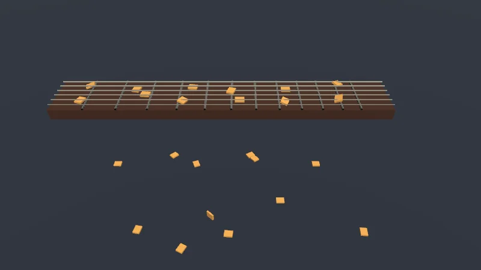
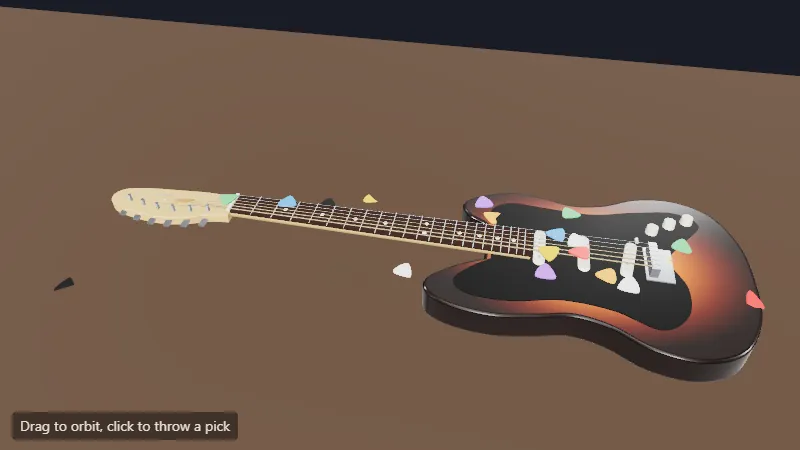

Código: el mundo que comparten la página y el script en [`src/10-physics/world.ts`](https://github.com/spareilleux/learn/blob/eeca669/code/threejs/src/10-physics/world.ts), la página en [`src/10-physics/main.ts`](https://github.com/spareilleux/learn/blob/eeca669/code/threejs/src/10-physics/main.ts), y las mediciones sin navegador en [`scripts/l10-rapier.ts`](https://github.com/spareilleux/learn/blob/eeca669/code/threejs/scripts/l10-rapier.ts).

## Un motor de física junto al renderizador

three.js dibuja; no simula. Un motor de física mantiene su propio mundo de cuerpos rígidos y colliders, lo hace avanzar un paso de tiempo, y tu bucle copia la posición y la rotación de cada cuerpo a la malla que lo muestra. [Rapier](https://rapier.rs/) está escrito en Rust por Dimforge, y publicado en npm compilado a WebAssembly. En .NET, lo más parecido es [BEPUphysics v2](https://github.com/bepu/bepuphysics2), también un mundo aparte que haces avanzar y del que lees los resultados.

| | BEPUphysics v2 | Rapier (JavaScript) | three.js |
|---|---|---|---|
| Mundo | `Simulation` | `World` | ninguno: `Scene` solo contiene lo que se dibuja |
| Objeto en movimiento | un cuerpo en `Bodies`, con un `BodyHandle` | `RigidBody`: dinámico, fijo o cinemático | `Mesh`, cuya transformación copias del cuerpo |
| Forma | `Box`, `Sphere`, `Capsule`, envolventes convexas, mallas | `Collider`: `cuboid`, `ball`, `capsule`, `convexHull`, `trimesh`, `heightfield` | su propia `BufferGeometry`, sin relación con el collider |
| Paso | `Simulation.Timestep(dt)` | `world.step()`, con `world.timestep` | — |
| Unidades | las tuyas | metros, kilogramos y segundos, por convención | las tuyas |

## Versiones y builds

[`@dimforge/rapier3d-compat`](https://www.npmjs.com/package/@dimforge/rapier3d-compat) 0.20.0, publicado el 8 de agosto de 2026, es la versión actual. Los paquetes "compat" incrustan el módulo WebAssembly en su JavaScript, en base64, así que se cargan en cualquier bundler y en Node.js sin un archivo `.wasm` aparte; los paquetes no compat necesitan un bundler que gestione las importaciones de WebAssembly.

El README de Rapier enumera tres builds: el estándar es "locally deterministic, on the same machine", pero no garantiza el determinismo entre plataformas; un build SIMD es más rápido donde el navegador admite WebAssembly SIMD; y [`@dimforge/rapier3d-deterministic-compat`](https://www.npmjs.com/package/@dimforge/rapier3d-deterministic-compat) es "less optimized", con "a guarantee of a cross-platform deterministic execution", que necesitan el networking lockstep y las repeticiones. El curso carga el build estándar y el determinista.

Otras dos formas de usar Rapier con three.js fijan versiones más antiguas:

- El propio addon [`RapierPhysics`](https://github.com/mrdoob/three.js/blob/r186/examples/jsm/physics/RapierPhysics.js) de three.js importa `rapier3d-compat@0.17.3` desde skypack.dev en tiempo de ejecución ([línea 3](https://github.com/mrdoob/three.js/blob/r186/examples/jsm/physics/RapierPhysics.js#L3)), hace avanzar el mundo desde `setInterval` a 60 Hz, y asigna cada vez a `world.timestep` el delta medido ([líneas 318-325](https://github.com/mrdoob/three.js/blob/r186/examples/jsm/physics/RapierPhysics.js#L318-L325) y [línea 367](https://github.com/mrdoob/three.js/blob/r186/examples/jsm/physics/RapierPhysics.js#L367)): un paso variable, cuyo coste muestran las mediciones de abajo. Sirve a los ejemplos; un proyecto controla su propia versión y su propio bucle.
- [`@react-three/rapier`](https://github.com/pmndrs/react-three-rapier) 2.2.0, los componentes para R3F, depende exactamente de `rapier3d-compat` 0.19.2.

## El mundo: púas sobre un diapasón

[`world.ts`](https://github.com/spareilleux/learn/blob/eeca669/code/threejs/src/10-physics/world.ts) no importa nada del DOM ni de three.js, así que la página y un script de Node.js lo comparten. El diapasón son colliders fijos: el mástil, y 12 trastes que sobresalen 1.2 cm por encima, como cajas finas en las que una púa puede engancharse, y luego un suelo ([líneas 22-32](https://github.com/spareilleux/learn/blob/eeca669/code/threejs/src/10-physics/world.ts#L22-L32)). Un collider sin cuerpo rígido nunca se mueve. Las 24 púas son cuerpos dinámicos con un collider de caja cada una, colocadas en una cuadrícula cuyas filas primera y última sobresalen de los bordes del mástil ([líneas 34-48](https://github.com/spareilleux/learn/blob/eeca669/code/threejs/src/10-physics/world.ts#L34-L48)):

```ts
const body = world.createRigidBody(
  RAPIER.RigidBodyDesc.dynamic()
    .setTranslation(NUT_X + 0.3 + column * 0.55, NECK_TOP + 0.6 + row * 0.25, -0.33 + row * 0.22)
    .setRotation(axisAngle(0.6, 0, 0.8, angle)),
);
world.createCollider(RAPIER.ColliderDesc.cuboid(PICK_SIZE.x / 2, PICK_SIZE.y / 2, PICK_SIZE.z / 2).setDensity(1400).setFriction(0.4), body);
```

`cuboid` recibe semiextensiones, no tamaños. La densidad, 1 400 kg/m³, es la del celuloide; el collider da al cuerpo su masa a partir de su volumen. Las unidades de Rapier son las que tú decidas; una gravedad de 9.81 las convierte en metros, así que este diapasón, de 3.6 unidades de largo, es de un gigante.

## Tres segundos, medidos sin navegador

`l10-rapier.ts` carga ambos builds, hace avanzar el mundo 180 veces a 1/60 s, e imprime dónde están las púas cada segundo:

```text
$ node scripts/l10-rapier.ts
@dimforge/rapier3d-deterministic-compat 0.20.0: rapier.mjs is 2,893,506 bytes, loaded and initialized in N ms
@dimforge/rapier3d-compat 0.20.0: rapier.mjs is 2,857,590 bytes, loaded and initialized in N ms

fixed step of 0.01667 s, 24 picks, 38 colliders
t = 1.0 s: 12 on the neck, 12 on the floor, 1 asleep, lowest y -0.99
t = 2.0 s: 12 on the neck, 12 on the floor, 24 asleep, lowest y -0.99
t = 3.0 s: 12 on the neck, 12 on the floor, 24 asleep, lowest y -0.99
pick 0 at [-1.7, -0.99, -0.33]
deterministic build, state hash after 180 steps: 68235a2bdba192f1
```

(`N ms` es como `check.sh` normaliza los tiempos; en la máquina del autor, el build determinista se cargó en 51 ms y el estándar en 30 ms.)

38 colliders: el mástil, 12 trastes, el suelo y 24 púas. Tras un segundo, la mitad de las púas descansan sobre el mástil y la otra mitad cayeron por sus bordes al suelo, cuya cara superior está en −1: una púa de 2 cm de grosor descansa en −0.99. Tras dos segundos, las 24 están **dormidas**: Rapier deja de simular un cuerpo cuya velocidad se ha mantenido por debajo de un umbral durante un tiempo, hasta que algo lo toca. Una pila en reposo no cuesta casi nada por paso.

El hash es un SHA-256 sobre la posición y la rotación de cada púa, como floats de 32 bits ([`stateBytes`, líneas 58-67](https://github.com/spareilleux/learn/blob/eeca669/code/threejs/src/10-physics/world.ts#L58-L67)), recortado a 16 dígitos hexadecimales. `check.sh` lo compara en los tres sistemas operativos. La línea del build estándar se imprime, no se compara:

```text
standard build, state hash after 180 steps: 68235a2bdba192f1
largest distance between a pick in the two builds: under 1 µm
```

En Windows x64, ambos builds dieron los mismos bytes. En la ejecución de CI [35175914560](https://github.com/spareilleux/learn/actions/runs/35175914560), el hash del build estándar también fue `68235a2bdba192f1` en Linux x64 y macOS arm64, en Node.js y en el navegador. Es una escena en tres máquinas, no una garantía: el hash del build determinista es aquel en el que se apoya el curso.

## Paso de tiempo fijo o variable

Un bucle de juego recibe fotogramas de duración desigual. Pasar la duración de cada fotograma al motor parece natural, y es lo que hace `RapierPhysics`. El script ejecuta los mismos tres segundos con pasos elegidos al azar entre 1/144 s y 1/30 s, a partir de una semilla fija ([líneas 51-67](https://github.com/spareilleux/learn/blob/eeca669/code/threejs/scripts/l10-rapier.ts#L51-L67)):

```text
variable step, 157 steps for the same 3 s: 16 picks more than 1 cm away from the fixed-step run, the farthest 42.15 m, at y = -43.14
```

Dos tercios de las púas acabaron en otro sitio, y una atravesó el suelo: en y = −43, sigue cayendo. El resultado de un solver depende de su paso: los contactos, la fricción y la resolución de las penetraciones se calculan por paso, y un paso largo deja que un objeto fino penetre mucho en otro antes de que el solver lo vea. Así que las mismas entradas dan una pila distinta con cada frecuencia de fotogramas, el resultado no se puede reproducir, y un solo fotograma largo puede hacer que un objeto atraviese un suelo de 20 cm.

La página avanza con un paso fijo de 1/60 s sea cual sea la frecuencia de fotogramas, con un **acumulador** ([`main.ts`, líneas 88-102](https://github.com/spareilleux/learn/blob/eeca669/code/threejs/src/10-physics/main.ts#L88-L102)):

```ts
// El acumulador: entra tiempo real, salen pasos enteros de 1/60 s, y lo que sobra decide la interpolación.
// Como máximo 5 pasos por fotograma, para que una pausa larga (una pestaña en segundo plano) no congele la página con cientos de pasos.
const timer = new THREE.Timer();
let accumulator = 0;
renderer.setAnimationLoop((time) => {
  if (probing) return;
  timer.update(time);
  accumulator = Math.min(accumulator + timer.getDelta(), 5 * STEP);
  while (accumulator >= STEP) {
    step();
    accumulator -= STEP;
  }
  draw(accumulator / STEP);
  renderer.render(scene, camera);
});
```

En una pantalla de 144 Hz, la mayoría de los fotogramas no ejecutan ningún paso, y algunos ejecutan uno; en una pantalla de 30 Hz, cada fotograma ejecuta dos. Dibujar el último estado daría tirones, así que `draw` coloca cada púa entre su estado anterior y posterior al último paso, según la fracción de paso que queda en el acumulador: `lerp` para las posiciones, `slerp` para las rotaciones ([líneas 65-75](https://github.com/spareilleux/learn/blob/eeca669/code/threejs/src/10-physics/main.ts#L65-L75)). La imagen va como mucho un paso por detrás de la simulación. Es el bucle de ["Fix Your Timestep!"](https://gafferongames.com/post/fix_your_timestep/) de Glenn Fiedler, y lo que hace el `Game` de MonoGame con `IsFixedTimeStep`, sin la interpolación.

## De los cuerpos a un InstancedMesh

Las 24 púas son un único `InstancedMesh`, como recomienda la lección 8: un draw call, y una matriz por púa compuesta a partir de la traslación y la rotación de su cuerpo. `frustumCulled = false`, ya que la esfera envolvente calculada a partir de las primeras matrices no sigue a las púas ([líneas 41-48](https://github.com/spareilleux/learn/blob/eeca669/code/threejs/src/10-physics/main.ts#L41-L48)); la alternativa de la lección 8, `computeBoundingSphere()` después de cada actualización, cuesta un recorrido de las matrices por fotograma.

Cuando se sondea, la página avanza 180 pasos sin esperar al reloj, renderiza una vez, y calcula el hash del estado con el `crypto.subtle` del navegador:

```text
$ node scripts/probe.mjs 10-physics
{
  "frame": 1,
  "render": {
    "calls": 2,
    "drawCalls": 22,
    "triangles": 1071
  },
  "memory": {
    "geometries": 11,
    "textures": 3,
    "programs": 6
  },
  "rapier": "0.20.0",
  "build": "deterministic",
  "steps": 180,
  "asleep": 24,
  "stateHash": "68235a2bdba192f1",
}
```

El mismo hash que en Node.js: el mismo WebAssembly, alimentado con los mismos números, da los mismos bytes en V8 en la página y en V8 en Node.js. `?build=standard` también lo da en la máquina del autor. 22 draw calls: el diapasón de la lección 5 (19 mallas), el suelo, las púas y la pasada de salida.



<details>
<summary>Página en vivo: ejecutarla aquí</summary>

<iframe src="../../../threejs-demos/10-physics.html" title="Lección 10, en vivo" loading="lazy" width="100%" height="420" allow="fullscreen; autoplay; xr-spatial-tracking" style={{ border: 0, display: "block", height: "min(420px, 70vh)" }}></iframe>

</details>

[Abrir a pantalla completa](../../../threejs-demos/10-physics.html). **Pruébalo**: *Rapier build* recarga la página con el build estándar, el otro build del ejercicio 3. El ejercicio 1, lanzar púas con un clic, es la [demo en vivo](#demo-en-vivo-púas-sobre-una-guitarra) al final de la lección.

Carga y pasos, en la máquina del autor, tal como los informó la página (`check.sh` elimina estos campos de la salida comparada): el módulo determinista tardó 83 ms en importarse e inicializarse en la página, y un paso de las 24 púas 0.22 ms de media en los 180 pasos, un tercio de ellos con todas las púas dormidas. El módulo WebAssembly se carga con un `import()` dinámico, así que Vite lo pone en su propio chunk, descargado después del código de la página (el build de la lección 13 lo lista). Los objetos de Rapier viven en la memoria de WebAssembly: `world.free()` libera un mundo cuando una página ha terminado con él.

## Snapshots

`world.takeSnapshot()` serializa el mundo entero en bytes, y `World.restoreSnapshot(bytes)` lo reconstruye:

```text
snapshot at step 60: 55,186 bytes
step 180, continued: 68235a2bdba192f1; step 180, restored then stepped: 68235a2bdba192f1
```

El mundo restaurado, avanzado las mismas 120 veces, llegó al mismo estado que el original. Con un build determinista, un snapshot más las entradas desde entonces son una repetición, o un rollback para juegos en red.

## Objetos rápidos y finos

El script dispara una bola de 1 cm de diámetro a 60 m/s hacia una pared de 2.4 cm de grosor, desde 2.5 m de distancia: un paso de 1/60 s desplaza la bola 1 m.

```text
fixed 2.4 cm wall, 1 cm ball at 60 m/s, CCD off: x = -1.5, -0.5, -0.02, -0.01, -0.01
fixed 2.4 cm wall, 1 cm ball at 60 m/s, CCD on : x = -1.5, -0.5, -0.02, -0.01, -0.01
dynamic 2.4 cm wall, 1 cm ball at 60 m/s, CCD off: x = -1.5, -0.5, 0.5, 1.5, 2.5
dynamic 2.4 cm wall, 1 cm ball at 60 m/s, CCD on : x = -1.5, -0.5, -0.02, 0, -0.01
```

Contra una pared dinámica sin detección continua de colisiones (CCD), la bola pasa de x = −0.5 a 0.5 en un paso, y nunca está dentro de la pared al final de un paso: la **atraviesa** (tunneling). Con `setCcdEnabled(true)` en la bola, Rapier barre su movimiento durante el paso y la detiene en la pared. Contra una pared fija, se detuvo incluso sin CCD en esta ejecución; por qué el caso fijo es distinto está *por verificar* en el código fuente de Rapier. La CCD cuesta tiempo por paso: actívala en los cuerpos pequeños y rápidos, no en todo.

## En GuitarAlchemist/ga

GA no tiene biblioteca de física: ni Rapier, ni cannon-es, ni Ammo.

- **Cheese Avalanche** simula unos 300 cuerpos a mano, con gravedad, colisiones contra un heightfield, restitución y un giro aproximado: "intentionally hand-rolled (no cannon / rapier dep)" ([`CheeseAvalanche.tsx`, líneas 16-18](https://github.com/GuitarAlchemist/ga/blob/05c8eda013f2a4d11efaa52c4ca94674521ee684/ReactComponents/ga-react-components/src/components/CheeseAvalanche/CheeseAvalanche.tsx#L16-L18)). Para esa tarea, cuerpos contra el terreno y nunca entre sí, es una elección razonable. Su paso es el delta del fotograma, limitado a 1/30 s ([líneas 561-562](https://github.com/GuitarAlchemist/ga/blob/05c8eda013f2a4d11efaa52c4ca94674521ee684/ReactComponents/ga-react-components/src/components/CheeseAvalanche/CheeseAvalanche.tsx#L561-L562), llamado desde el bucle de animación en la [línea 649](https://github.com/GuitarAlchemist/ga/blob/05c8eda013f2a4d11efaa52c4ca94674521ee684/ReactComponents/ga-react-components/src/components/CheeseAvalanche/CheeseAvalanche.tsx#L649)): un paso variable, así que la avalancha se desarrolla de otra forma a 60 y a 144 Hz. Escribe los cuerpos en dos objetos `InstancedMesh` ([líneas 616-632](https://github.com/GuitarAlchemist/ga/blob/05c8eda013f2a4d11efaa52c4ca94674521ee684/ReactComponents/ga-react-components/src/components/CheeseAvalanche/CheeseAvalanche.tsx#L616-L632)), como hace esta lección, pero reserva un `Vector3` para cada cuerpo que rueda en cada paso, dentro de un bucle que por lo demás reutiliza variables temporales ([línea 595](https://github.com/GuitarAlchemist/ga/blob/05c8eda013f2a4d11efaa52c4ca94674521ee684/ReactComponents/ga-react-components/src/components/CheeseAvalanche/CheeseAvalanche.tsx#L595)).
- **El módulo lunar** lo hace con paso fijo: un acumulador de pasos de 1/120 s, como máximo 10 por fotograma, tras limitar el delta del fotograma a 0.1 s ([`LunarLanderEngine.ts`, líneas 3030-3040](https://github.com/GuitarAlchemist/ga/blob/05c8eda013f2a4d11efaa52c4ca94674521ee684/ReactComponents/ga-react-components/src/components/PrimeRadiant/LunarLanderEngine.ts#L3030-L3040), con `PHYSICS_DT` en la [línea 66](https://github.com/GuitarAlchemist/ga/blob/05c8eda013f2a4d11efaa52c4ca94674521ee684/ReactComponents/ga-react-components/src/components/PrimeRadiant/LunarLanderEngine.ts#L66)). Dibuja el último estado, sin interpolación, lo que a 1/120 s rara vez se nota.

## Demo en vivo: púas sobre una guitarra

El ejercicio 1 sobre una guitarra entera: un clic lanza una púa desde la cámara, a lo largo del rayo del puntero, a 3 m/s. Cada parte visible de la guitarra es un collider fijo de malla de triángulos, 47 404 triángulos tomados de las geometrías que dibuja three.js, una copia por instancia; las púas son envolventes convexas de 2.5 mm de grosor, dibujadas por una sola `InstancedMesh` con un color por instancia. Su sonda suelta 24 púas según una secuencia con semilla fija y avanza 240 pasos: 19 están dormidas, 15 descansan sobre la guitarra, 9 sobre la mesa y ninguna la atravesó. Dos cosas que encontró esta página: `body.handle` no sirve para elegir un color con `handle % n`, porque los handles de Rapier son flotantes que empaquetan un índice y una generación, y los colores escritos con `setColorAt` llegan a la GPU en la actualización por fotograma del renderer, así que la sonda los lee tras dos fotogramas de `setAnimationLoop`, no tras un `render()` propio. El [código](https://github.com/spareilleux/learn/tree/f68e710/code/threejs/demos/physics) está en `code/threejs/demos/physics`.



<details>
<summary>Página en vivo: ejecutarla aquí</summary>

<iframe src="../../../threejs-demos/demos/physics.html" title="Púas sobre una guitarra" loading="lazy" width="100%" height="420" allow="fullscreen; autoplay; xr-spatial-tracking" style={{ border: 0, display: "block", height: "min(420px, 70vh)" }}></iframe>

</details>

[Abrir a pantalla completa](../../../threejs-demos/demos/physics.html). **Pruébalo**: haz clic para lanzar púas al mástil, *drop 10* para un puñado, y desmarca *CCD for new picks* antes de lanzar más: si entonces atraviesan los trastes está *por verificar*.

## Puntos clave

- Un motor de física es un segundo mundo: hazlo avanzar, y luego copia la transformación de cada cuerpo a lo que dibuja three.js.
- Los paquetes "compat" de Rapier incrustan el módulo WebAssembly: 2.9 MB de JavaScript, que conviene cargar con un `import()` dinámico e `init()`.
- Avanza a un ritmo fijo con un acumulador, limita los pasos por fotograma, e interpola lo que dibujas. Un paso variable cambió dónde cayeron 16 de las 24 púas, e hizo que una atravesara el suelo.
- El build determinista da los mismos bytes en todas las plataformas; el estándar solo lo promete en la misma máquina.
- Los cuerpos dormidos no cuestan casi nada; los rápidos y finos necesitan CCD.
- Los snapshots serializan el mundo: con determinismo, son repeticiones.

## Ejercicios

1. Lanza una púa contra el mástil: al hacer clic, asigna a una púa una velocidad lineal hacia el diapasón con `setLinvel`, y despiértala con `wakeUp()`. ¿Por qué lo necesita un cuerpo dormido?
2. Quita el límite de 5 pasos por fotograma, y simula una pestaña en segundo plano: añade 3 segundos al acumulador en un fotograma. ¿Qué ocurre, y qué sacrifica el límite?
3. El build estándar dio el mismo hash que el determinista en Windows. Nombra dos cosas que pueden hacer que difiera en otra máquina, y lo que hace el build determinista al respecto.

<details>
<summary>Solución 1</summary>

```ts
renderer.domElement.addEventListener('click', () => {
  const body = picks[0];
  body.setTranslation({ x: 0, y: 1.5, z: 1.5 }, true);
  body.setLinvel({ x: 0, y: -2, z: -4 }, true);
});
```

El segundo argumento de `setTranslation` y `setLinvel`, `wakeUp`, despierta el cuerpo; `body.wakeUp()` hace lo mismo por separado. Un cuerpo dormido está fuera de la simulación: cambiar su velocidad sin despertarlo lo deja donde está hasta que algo choque con él. Tras dos segundos, las 24 púas estaban dormidas, así que cualquier cambio desde fuera lo necesita. Un esbozo, no ejecutado en la página del curso (*por verificar*).

</details>

<details>
<summary>Solución 2</summary>

3 segundos son 180 pasos, ejecutados en un fotograma antes de dibujar nada: la página se congela durante el tiempo que tardan esos pasos, y luego las púas saltan a donde habrían estado. Si los pasos de un fotograma tardan más que el fotograma, el siguiente fotograma tiene aún más tiempo que recuperar: la "espiral de la muerte", en la que la simulación nunca se pone al día. El límite descarta el tiempo sobrante: la simulación va más lenta que el tiempo real durante un momento, cosa que nadie ve en una pestaña en segundo plano. El `Timer` de three.js también tiene `connect(document)`, que usa la Page Visibility API "to avoid large time delta values" tras una pestaña oculta ([`Timer.js`, líneas 43-58](https://github.com/mrdoob/three.js/blob/r186/src/core/Timer.js#L43-L58)). Un razonamiento a partir del código del bucle, no una medición.

</details>

<details>
<summary>Solución 3</summary>

El README de Rapier solo dice que el build estándar es "locally deterministic, on the same machine", y que el build determinista es "less optimized" y garantiza "a cross-platform deterministic execution". No dice qué difiere. Las causas habituales en código de coma flotante son estas: un compilador que fusiona una multiplicación y una suma en una sola instrucción (FMA), que redondea de otra forma; funciones matemáticas como `sin` o `sqrt` implementadas de forma distinta en cada plataforma; y sumas cuyo orden cambia con SIMD o con código paralelo. La aritmética básica de WebAssembly está especificada bit a bit, así que lo que puede variar es lo que el módulo llama fuera de ella, y el relaxed SIMD, cuyos resultados pueden diferir según la plataforma. A cuáles de estas está expuesto el build estándar 0.20.0, y qué cambia el build determinista, está *por verificar* en los scripts de build de rapier.js. La CI del curso calcula el hash de ambos builds en tres sistemas operativos: en la ejecución 35175914560, coincidieron en los tres, para esta única escena.

</details>

## Fuentes

- Rapier: [guía de usuario de JavaScript](https://rapier.rs/docs/user_guides/javascript/getting_started_js/), [cuerpos rígidos](https://rapier.rs/docs/user_guides/javascript/rigid_bodies/), [colliders](https://rapier.rs/docs/user_guides/javascript/colliders/), [determinismo](https://rapier.rs/docs/user_guides/javascript/determinism/), [el repositorio dimforge/rapier.js](https://github.com/dimforge/rapier.js)
- Código fuente de three.js en r186: [`RapierPhysics.js`](https://github.com/mrdoob/three.js/blob/r186/examples/jsm/physics/RapierPhysics.js)
- [@react-three/rapier](https://github.com/pmndrs/react-three-rapier)
- Glenn Fiedler, ["Fix Your Timestep!"](https://gafferongames.com/post/fix_your_timestep/)
- MonoGame: [`Game.IsFixedTimeStep`](https://docs.monogame.net/api/Microsoft.Xna.Framework.Game.html)
- BEPUphysics v2: [repositorio y documentación](https://github.com/bepu/bepuphysics2)
