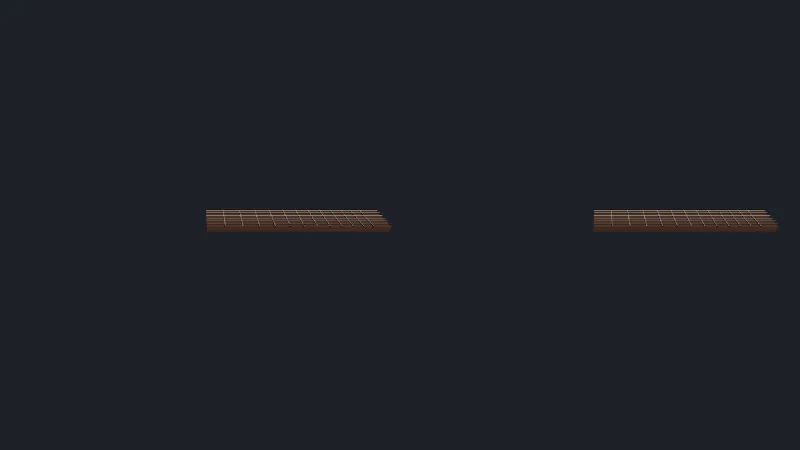

Código: la página en [`src/11-xr/main.ts`](https://github.com/spareilleux/learn/blob/eeca669/code/threejs/src/11-xr/main.ts).

:::caution[Sin visor]
Todo lo de esta lección se ejecutó en Chromium headless, con unas Meta Quest 3 emuladas por [IWER](https://github.com/meta-quest/immersive-web-emulation-runtime). Lo que comprueba es la parte de WebXR que corresponde a three.js: sesiones, ojos, poses, mandos y eventos. Lo que añade un visor real, el compositor, la frecuencia de fotogramas, las lentes y la GPU, está *por verificar* en un dispositivo.
:::

## WebXR en una tabla

La [WebXR Device API](https://www.w3.org/TR/webxr/) es el acceso del navegador a los visores y a los teléfonos en RA o RV. Si has usado [OpenXR](https://www.khronos.org/openxr/), la API de C que hay detrás de Windows Mixed Reality, SteamVR y las aplicaciones nativas de las Quest, los conceptos se corresponden de cerca; WebXR es su equivalente en el navegador, y Chromium la implementa sobre OpenXR en Windows.

| | OpenXR | WebXR | three.js |
|---|---|---|---|
| ¿Hay un dispositivo? | `xrGetSystem` | `navigator.xr.isSessionSupported('immersive-vr')` | `VRButton` lo comprueba y muestra el botón |
| Inicio | `xrCreateSession` | `navigator.xr.requestSession(mode, features)`, desde un gesto del usuario | `renderer.xr.setSession(session)` |
| Sistemas de coordenadas | espacios de referencia: `VIEW`, `LOCAL`, `STAGE` | `viewer`, `local`, `local-floor`, `bounded-floor`, `unbounded` | `renderer.xr.setReferenceSpaceType('local-floor')`, el valor por defecto |
| Bucle de fotogramas | `xrWaitFrame`, `xrBeginFrame`, `xrEndFrame` | `session.requestAnimationFrame` | `renderer.setAnimationLoop`, que cambia al bucle de la sesión |
| Ojos | vistas de `xrLocateViews` | `frame.getViewerPose(space).views` | un `ArrayCamera` con una cámara por ojo |
| Dónde dibujar | swapchains | `XRWebGLLayer` o WebXR Layers; `XRGPUBinding` para WebGPU, en desarrollo | el render target XR del renderizador |
| Mandos | acciones vinculadas a rutas | `session.inputSources`, eventos `select` y `squeeze`, un `Gamepad` | `renderer.xr.getController(i)`, un `Object3D` que sigue al mando |

`setAnimationLoop` es la razón por la que la lección 1 lo prefiere a `requestAnimationFrame`: en una sesión, el `requestAnimationFrame` de la ventana deja de dispararse, y el visor marca los fotogramas a su propio ritmo, 72, 90 o 120 Hz. Un bucle escrito con `setAnimationLoop` sigue funcionando, sin cambios.

## Emular unas Quest 3

Chromium headless tiene un `navigator.xr`, pero ningún dispositivo detrás: `isSessionSupported('immersive-vr')` responde `false`. [IWER](https://www.npmjs.com/package/iwer) 2.4.0, el Immersive Web Emulation Runtime de Meta, reemplaza `navigator.xr` por una implementación en JavaScript cuyo visor y cuyos mandos se mueven por código: el mismo runtime que la extensión de navegador [Immersive Web Emulator](https://github.com/meta-quest/immersive-web-emulator). La página lo instala antes de crear el renderizador ([líneas 25-38](https://github.com/spareilleux/learn/blob/eeca669/code/threejs/src/11-xr/main.ts#L25-L38)):

```ts
// El visor emulado debe instalarse antes que el renderizador: XRManager busca XRWebGLBinding en su constructor
let device: XRDevice | null = null;
if (params.get('device') !== 'none') {
  device = new XRDevice(metaQuest3);
  // Chromium ya tiene un navigator.xr, sin ningún dispositivo detrás: IWER no lo toca salvo que se le fuerce
  device.installRuntime({ forceInstall: true, polyfillLayers: params.has('layers') });
  // IWER dibuja una sola vista en la página salvo que el estéreo esté activado: entonces los ojos izquierdo y derecho comparten el canvas
  device.stereoEnabled = true;
  device.position.set(-0.2, 1.6, 0.9);
  // Mirando hacia abajo al diapasón, 40° por debajo del horizonte
  const look = new THREE.Quaternion().setFromAxisAngle(new THREE.Vector3(1, 0, 0), (-40 * Math.PI) / 180);
  device.quaternion.set(look.x, look.y, look.z, look.w);
  result.emulated = { device: device.name, immersiveVR: await navigator.xr!.isSessionSupported('immersive-vr') };
}
```

Dos cosas costaron una ejecución fallida cada una para descubrirlas. Sin `forceInstall`, IWER ve el `navigator.xr` de Chromium y lo deja en su sitio, y ninguna sesión arranca. Sin `stereoEnabled`, IWER renderiza una sola vista: el viewport del ojo derecho mide 0 píxeles de ancho.

## La sesión y los mandos

En una sesión, las unidades son metros y, con `local-floor`, y = 0 es el suelo. La página coloca el diapasón de la lección 5, a un cuarto de su escala, sobre una mesa virtual de 0.8 m de alto. Una página real pide la sesión desde un clic, a menudo mediante el [`VRButton`](https://github.com/mrdoob/three.js/blob/r186/examples/jsm/webxr/VRButton.js) de three.js, ya que los navegadores exigen un gesto del usuario; IWER no lo exige, así que el probe llama directamente a `requestSession` ([líneas 131-143](https://github.com/spareilleux/learn/blob/eeca669/code/threejs/src/11-xr/main.ts#L131-L143)).

`renderer.xr.getController(i)` devuelve un `Object3D` que three.js mueve a la pose de la *i*-ésima fuente de entrada de la sesión en cada fotograma. Su índice no es una mano: el evento `connected` dice cuál es. Un evento `select`, el gatillo, se convierte en un rayo desde el mando con `Raycaster.setFromXRController`, y en los `fretAt` y `stringAt` de la lección 5, en las coordenadas propias del diapasón ([líneas 85-99](https://github.com/spareilleux/learn/blob/eeca669/code/threejs/src/11-xr/main.ts#L85-L99)):

```ts
for (const index of [0, 1]) {
  const controller = renderer.xr.getController(index);
  scene.add(controller);
  controller.addEventListener('connected', (event) => (controller.userData.handedness = (event.data as XRInputSource).handedness));
  controller.addEventListener('select', () => {
    raycaster.setFromXRController(controller as THREE.XRTargetRaySpace);
    const [hit] = raycaster.intersectObject(board, true);
    const hand = controller.userData.handedness;
    if (!hit) return void picks.push({ controller: index, hand, hit: null });
    const local = board.worldToLocal(hit.point.clone());
    const fret = fretAt(local.x);
    const string = stringAt(local.z);
    picks.push({ controller: index, hand, object: hit.object.name, fret, string, note: fret === null ? null : noteName(string, fret) });
  });
}
```

A continuación, el probe apunta el mando derecho de IWER a la cuerda 3, traste 5, y aprieta su gatillo: `updateButtonValue('trigger', 1)`, luego `0`, que IWER convierte en los eventos `select` de la sesión ([líneas 161-178](https://github.com/spareilleux/learn/blob/eeca669/code/threejs/src/11-xr/main.ts#L161-L178)).

## Con el WebGLRenderer clásico

`?classic` dibuja con `WebGLRenderer` de `three`, el renderizador para el que se escribieron los ejemplos WebXR de three.js:

```text
$ node scripts/probe.mjs 11-xr --query classic
{
  "native": {
    "navigatorXR": true,
    "immersiveVR": false,
    "XRGPUBinding": false
  },
  "emulated": {
    "device": "Meta Quest 3",
    "immersiveVR": true
  },
  "rendererBeforeSession": "WebGLRenderer",
  "session": {
    "mode": "immersive-vr",
    "enabledFeatures": [
      "local-floor",
      "viewer",
      "local"
    ]
  },
  "presenting": true,
  "rendererInSession": "WebGLRenderer",
  "frames": [
    {
      "eyes": 2,
      "eyeDistanceMm": 63,
      "viewport": [
        [0, 0, 400, 450],
        [400, 0, 400, 450]
      ],
      "calls": 38,
      "triangles": 1560
    }
  ],
  "picks": [
    {
      "controller": 1,
      "hand": "right",
      "object": "neck",
      "fret": 5,
      "string": 3,
      "note": "C4"
    }
  ],
  "inputSources": 2,
  "errors": [],
  "after": {
    "in the session": {
      "presenting": true
    },
    "end the session": {
      "presenting": false
    }
  }
}
```

- La sesión se concedió con `local-floor`, y con `viewer` y `local`, que tiene toda sesión inmersiva.
- Dos ojos, separados 63 mm, la distancia interpupilar por defecto de IWER, cada uno dibujado en la mitad del canvas de 800 × 450.
- 38 draw calls y 1 560 triángulos: las 19 mallas y los 780 triángulos del diapasón, dibujados una vez por ojo. `WebGLRenderer` renderiza la escena dos veces; el multiview, que dibuja los dos ojos en una sola pasada, necesita la extensión `OVR_multiview2` y un navegador de visor que la ofrezca (*por verificar* en unas Quest).
- El gatillo del mando 1, la mano derecha, seleccionó la cuerda 3, traste 5: C4, la nota que la lección 5 encontró con el ratón.
- `session.end()` detuvo la presentación.

La captura, tomada durante la sesión, muestra lo que IWER compone en la página: el ojo izquierdo y luego el derecho, cada uno viendo el diapasón desde su propia posición.



## Con WebGPURenderer

La página por defecto usa `WebGPURenderer`:

```text
$ node scripts/probe.mjs 11-xr
{
  ...
  "rendererBeforeSession": "WebGPURenderer, WebGPU",
  "session": {
    "mode": "immersive-vr",
    "enabledFeatures": [
      "local-floor",
      "viewer",
      "local"
    ]
  },
  "errors": [
    "Error: THREE.XRManager: WebGPU XR sessions require the \"webgpu\" session feature. Use VRButtonGPU/XRButton with \"webgpu\" enabled or use a WebGL backend."
  ]
}
```

En r186, el backend WebGPU solo dibuja en una sesión WebXR mediante [`XRGPUBinding`](https://github.com/immersive-web/WebXR-WebGPU-Binding/blob/main/explainer.md), de la propuesta de binding WebXR/WebGPU, y solo en una sesión pedida con la funcionalidad `webgpu` ([`XRManager.js`, líneas 739-749](https://github.com/mrdoob/three.js/blob/r186/src/renderers/common/XRManager.js#L739-L749), llamado desde `setSession` en la [línea 1211](https://github.com/mrdoob/three.js/blob/r186/src/renderers/common/XRManager.js#L1211)). Chromium headless no tiene `XRGPUBinding`, e IWER no lo emula. Dos detalles del mensaje no coinciden con r186: no hay ningún `VRButtonGPU` en `examples/jsm/webxr/`, y `XRButton.js` no pide ninguna funcionalidad `webgpu`. Qué navegadores y visores ofrecen `XRGPUBinding` en septiembre de 2026 está *por verificar*.

### El backend WebGL 2

En una máquina sin WebGPU, o con `--webgl`, `WebGPURenderer` usa su backend WebGL 2, que el mensaje presenta como la salida. Con IWER, la sesión arranca, pero cada fotograma lanza una excepción:

```text
$ node scripts/probe.mjs 11-xr --webgl
  ...
  "rendererInSession": "WebGPURenderer, WebGL 2",
  "frames": [
    {
      "eyes": 2,
      "eyeDistanceMm": 63,
      "viewport": [
        [0, 0, 400, 450],
        [400, 0, 400, 450]
      ],
      "calls": 4,
      "triangles": 780
    }
  ],
  ...
  "errors": [
    "TypeError: Invalid value used as weak map key"
  ]
```

El `XRWebGLLayer.framebuffer` de IWER devuelve `null` ([`XRWebGLLayer.js`, líneas 44-46, en el paquete publicado](https://unpkg.com/iwer@2.4.0/lib/layers/XRWebGLLayer.js)): IWER dibuja en el propio canvas de la página, cuyo framebuffer WebGL representa como `null`, igual que la especificación WebXR para las sesiones inline, que dibujan en la página. El backend WebGL conserva ese valor como su destino XR ([`WebGLBackend.js`, líneas 365-367](https://github.com/mrdoob/three.js/blob/r186/src/renderers/webgl-fallback/WebGLBackend.js#L365-L367)), y `WebGLState.drawBuffers` usa el framebuffer como clave en un `WeakMap` ([`WebGLState.js`, líneas 1149-1164](https://github.com/mrdoob/three.js/blob/r186/src/renderers/webgl-fallback/utils/WebGLState.js#L1149-L1164)), que rechaza `null`. `WebGLRenderer` vincula `null` como el framebuffer por defecto, y funciona. En un visor real, el framebuffer de la capa es un framebuffer opaco, no `null`, así que este fallo pertenece a la combinación del emulador y el backend WebGL, no a los visores (*por verificar* en unas Quest).

La primera versión de esta página no capturaba la excepción: los fotogramas se detuvieron, el probe los esperó, y la ejecución se quedó colgada hasta que se detuvo a mano, reteniendo el bloqueo de GPU de la máquina durante diez minutos. La página ahora captura los errores de render, guarda cada mensaje una sola vez, y deja de esperar fotogramas al cabo de 5 segundos; [`probe.mjs`](https://github.com/spareilleux/learn/blob/eeca669/code/threejs/scripts/probe.mjs) también termina por sí solo tras el doble de su tiempo límite.

### El addon de fallback WebGL

r186 añade [`WebGLXRFallback.js`](https://github.com/mrdoob/three.js/blob/r186/examples/jsm/webxr/WebGLXRFallback.js): envuelve `renderer.xr.setSession`, y cuando una sesión arranca en el backend WebGPU sin `XRGPUBinding`, crea un segundo renderizador con un backend WebGL, le traslada el bucle de animación y los ajustes XR, y deja que la página intercambie los canvas ([líneas 21-69](https://github.com/mrdoob/three.js/blob/r186/examples/jsm/webxr/WebGLXRFallback.js#L21-L69)). `?fallback` lo instala:

```text
$ node scripts/probe.mjs 11-xr --query fallback
  ...
  "fallback": "switched to WebGPURenderer, WebGL 2",
  "presenting": true,
  "rendererInSession": "WebGPURenderer, WebGL 2",
  ...
  "picks": [],
  "inputSources": 2,
  "errors": [
    "TypeError: Invalid value used as weak map key"
  ],
```

El cambio funcionó, y se topó con el mismo framebuffer `null`. Muestra otra cosa: `picks` está vacío. Los mandos venían del `renderer.xr.getController` del primer renderizador, y el renderizador de fallback tiene su propio `XRManager`, que mueve sus propios mandos. El addon copia el bucle y los ajustes, no los objetos que la página ya tomó de `renderer.xr`: una página que lo use debe volver a obtener sus mandos en `onFallback`.

`check.sh` compara las cuatro ejecuciones. En los runners de Linux y Windows, que no tienen WebGPU, la página por defecto y `?fallback` arrancan directamente en el backend WebGL 2, y sus salidas vienen de `expected/l11_probe_webgpu.webgl.txt` y `expected/l11_probe_fallback.webgl.txt`, generadas con `chromium-headless-shell`.

## Lo que un navegador headless no puede comprobar

- **La frecuencia de fotogramas.** Unas Quest 3 funcionan a 72, 90 o 120 Hz, y un fotograma perdido se siente, no se ve. El tiempo de CPU por fotograma de la lección 8, duplicado para dos ojos, es por donde empezar; la superposición de rendimiento del propio visor es por donde terminar (*por verificar*).
- **El renderizado foveado y la escala del framebuffer.** `renderer.xr.setFoveation` y `setFramebufferScaleFactor` cambian lo que hace el compositor del visor; IWER los acepta y dibuja los mismos píxeles.
- **El seguimiento de manos**, que IWER emula con poses, y el passthrough de **RA**, las hit tests y los anchors, que el curso no trata.
- **La comodidad.** El diapasón a 0.8 m de alto, a 0.9 m de los ojos, a un cuarto de escala, se eligió sobre el papel.

## En GuitarAlchemist/ga

GA no tiene código WebXR en el commit `05c8eda`: ni `renderer.xr`, ni `VRButton`, ni `navigator.xr`. La única mención es un archivo de skill de Claude, `.claude/skills/three-best-practices/rules/webxr-setup.md`, escrito para agentes y no usado por la aplicación. Un modo RV para el diapasón partiría del `WebGPURenderer` de `ThreeFretboard.tsx`, que, como descubrió esta lección, no puede entrar en una sesión en r186 sin `XRGPUBinding`: el addon de fallback o un `WebGLRenderer` serían el primer paso.

## Puntos clave

- WebXR da a la página una sesión, espacios de referencia en metros, una cámara por ojo y fuentes de entrada; three.js los envuelve en `renderer.xr`, `setAnimationLoop` y `getController`.
- IWER emula unas Quest 3 en un navegador headless: las sesiones, las vistas estéreo, las poses de los mandos y los gatillos se pueden probar en CI.
- En r186, `WebGPURenderer` entra en una sesión WebXR sobre WebGPU solo con `XRGPUBinding` y la funcionalidad `webgpu`; si no, lanza una excepción.
- El addon de fallback WebGL intercambia los renderizadores, pero no los mandos que la página ya tiene.
- Con IWER, solo el `WebGLRenderer` clásico renderizó: el backend WebGL 2 no acepta un framebuffer de capa `null`.
- Pon un tiempo límite estricto a todo lo que espere fotogramas: una sesión XR que deja de producirlos espera para siempre.

## Ejercicios

1. Añade un `VRButton` a la página `?classic`, para que el navegador de un visor real pueda entrar en la sesión. ¿Qué no debe hacer la página, ahora que la sesión ya no la inicia el probe?
2. En la página `?fallback`, obtén los mandos del nuevo renderizador dentro de `onFallback`, y traslada allí sus listeners de `select`. ¿Qué debería mostrar entonces `picks`, y por qué seguiría fallando con IWER?
3. Haz que el gatillo toque la nota: enumera lo que necesita el handler de `select`, y lo que cambia el visor respecto a un clic de ratón.

<details>
<summary>Solución 1</summary>

```ts
import { VRButton } from 'three/addons/webxr/VRButton.js';

document.body.append(VRButton.createButton(renderer));
```

`VRButton` comprueba `isSessionSupported('immersive-vr')`, muestra "ENTER VR" o "VR NOT SUPPORTED", y pide la sesión con `local-floor`, `bounded-floor` y `layers` como funcionalidades opcionales al hacer clic ([`VRButton.js`, líneas 68-74](https://github.com/mrdoob/three.js/blob/r186/examples/jsm/webxr/VRButton.js#L68-L74)), que es el gesto del usuario que exigen los navegadores. La página ya no debe llamar a `requestSession` por su cuenta, o el clic fallaría con una sesión ya en marcha: reserva `startSession` para el probe. El bloque `if (probing)` de la página ya lo hace. No ejecutado en un visor (*por verificar*).

</details>

<details>
<summary>Solución 2</summary>

`onFallback(fallback, previous)` recibe el nuevo renderizador: llama allí a `fallback.xr.getController(0)` y `(1)`, añádelos a la escena, y conecta los listeners de `connected` y `select`, el mismo bucle que antes, convertido en una función que recibe el renderizador. Con IWER, `picks` debería contener entonces la selección de C4, ya que el rayo se calcula en la CPU a partir de la pose del mando, que actualiza el `XRManager` del renderizador de fallback. Pero cada fotograma sigue lanzando una excepción por el framebuffer `null` antes de dibujar la escena, y si las poses de los mandos se actualizan antes de esa excepción está *por verificar*: en `XRManager`, los mandos se actualizan en el fotograma de animación XR, antes del callback del bucle que lanza la excepción ([`XRManager.js`, líneas 1991-1997](https://github.com/mrdoob/three.js/blob/r186/src/renderers/common/XRManager.js#L1991-L1997)), así que probablemente sí.

</details>

<details>
<summary>Solución 3</summary>

El handler necesita la nota (ya la tiene), un sonido y una forma de reproducirlo: la Web Audio API con un `AudioContext` creado o reanudado desde un gesto del usuario, que la entrada en la sesión proporciona. Comparado con un clic: el gatillo es analógico, y `inputSource.gamepad.buttons[0].value` indica con qué fuerza se aprieta, una velocity natural; `inputSource.gamepad.hapticActuators` puede hacer vibrar el mando con la nota; y el sonido se puede posicionar en la cuerda con un `PannerNode`, o con el `PositionalAudio` de three.js, acoplado al diapasón, para que venga de donde está la cuerda. Un diseño, no código ejecutado (*por verificar*).

</details>

## Fuentes

- W3C: [WebXR Device API](https://www.w3.org/TR/webxr/), [WebXR Gamepads Module](https://www.w3.org/TR/webxr-gamepads-module-1/); Immersive Web Community Group: [explainer del binding WebXR/WebGPU](https://github.com/immersive-web/WebXR-WebGPU-Binding/blob/main/explainer.md)
- MDN: [WebXR Device API](https://developer.mozilla.org/docs/Web/API/WebXR_Device_API)
- Código fuente de three.js en r186: [`XRManager.js`](https://github.com/mrdoob/three.js/blob/r186/src/renderers/common/XRManager.js), [`WebGLXRFallback.js`](https://github.com/mrdoob/three.js/blob/r186/examples/jsm/webxr/WebGLXRFallback.js), [`VRButton.js`](https://github.com/mrdoob/three.js/blob/r186/examples/jsm/webxr/VRButton.js), [`WebGLBackend.js`](https://github.com/mrdoob/three.js/blob/r186/src/renderers/webgl-fallback/WebGLBackend.js), [`WebGLState.js`](https://github.com/mrdoob/three.js/blob/r186/src/renderers/webgl-fallback/utils/WebGLState.js)
- Meta: [IWER](https://github.com/meta-quest/immersive-web-emulation-runtime), [Immersive Web Emulator](https://github.com/meta-quest/immersive-web-emulator)
- Khronos: [OpenXR](https://www.khronos.org/openxr/)
