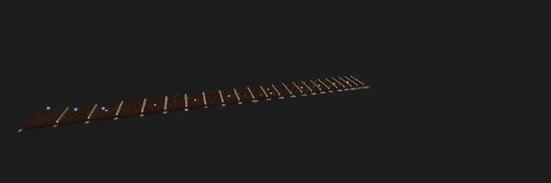

Código: las medidas de GA en [`src/13-fretboard/guitar.ts`](https://github.com/spareilleux/learn/blob/eeca669/code/threejs/src/13-fretboard/guitar.ts), la estructura de GA en [`GaFretboard.tsx`](https://github.com/spareilleux/learn/blob/eeca669/code/threejs/src/13-fretboard/GaFretboard.tsx), el port en [`Fretboard3D.tsx`](https://github.com/spareilleux/learn/blob/eeca669/code/threejs/src/13-fretboard/Fretboard3D.tsx), y la página que mide ambos en [`main.tsx`](https://github.com/spareilleux/learn/blob/eeca669/code/threejs/src/13-fretboard/main.tsx).

## El componente

[`ThreeFretboard.tsx`](https://github.com/GuitarAlchemist/ga/blob/05c8eda013f2a4d11efaa52c4ca94674521ee684/ReactComponents/ga-react-components/src/components/ThreeFretboard.tsx) es el mástil de guitarra 3D de GuitarAlchemist: 1 372 líneas de React y three.js en el commit `05c8eda`, sin React Three Fiber. Un `useEffect` crea un `WebGPURenderer`, construye una escena con un diapasón, trastes, incrustaciones, cuerdas, etiquetas en sprites y marcadores de notas, y ejecuta un bucle de animación; sus props son las posiciones que marcar y un objeto `config` con el número de trastes, la afinación, el modelo de guitarra, la cejilla y los tamaños. Las lecciones 1 a 8 lo citaron punto por punto. Esta lección lo reproduce entero, lo mide y lo porta.

La reproducción, [`GaFretboard.tsx`](https://github.com/spareilleux/learn/blob/eeca669/code/threejs/src/13-fretboard/GaFretboard.tsx), está condensada: los mismos objetos por traste, incrustación, cuerda, etiqueta y marcador, las mismas dependencias del efecto, la misma limpieza y el mismo pixel ratio, con comentarios que remiten a los números de línea de GA. Deja fuera las texturas de madera y de cuerda, la parte trasera del mástil, la cejuela, la cejilla, las etiquetas de los marcadores y la mayoría de las luces, así que sus recuentos son una cota inferior de los de GA. Ambas versiones comparten las medidas de GA de [`guitar.ts`](https://github.com/spareilleux/learn/blob/eeca669/code/threejs/src/13-fretboard/guitar.ts): un tiro de 648 mm, una cejuela de 42 mm, 22 trastes, una unidad por 10 mm, y la fórmula de trastes de GA. La página las renderiza en la misma área 3:1 que el canvas de 1800 × 600 de GA, con la cámara, las luces y el tone mapping ACES de GA con una exposición de 1.2 ([`ThreeFretboard.tsx`, líneas 238-239](https://github.com/GuitarAlchemist/ga/blob/05c8eda013f2a4d11efaa52c4ca94674521ee684/ReactComponents/ga-react-components/src/components/ThreeFretboard.tsx#L238-L239)).

## Medir ambos

[`main.tsx`](https://github.com/spareilleux/learn/blob/eeca669/code/threejs/src/13-fretboard/main.tsx) monta una versión, elegida con `?version=ga|port`, en un padre que pasa `positions` como lo hacen los llamadores de GA: un literal de array nuevo en cada render, con el mismo contenido ([línea 30](https://github.com/spareilleux/learn/blob/eeca669/code/threejs/src/13-fretboard/main.tsx#L30)). Cuando se sondea, informa de `renderer.info` tras los primeros fotogramas, tras 10 renders del padre, tras mostrar un acorde de do mayor, tras un clic real en la cuerda 3, traste 2, y tras desmontar el mástil.


La versión de GA:

```text
$ node scripts/probe.mjs 13-fretboard --query version=ga
{
  "version": "ga",
  "first": {
    "drawCalls": 69,
    "triangles": 19623,
    "geometries": 41,
    "textures": 32,
    "programs": 10,
    "drawingBuffer": "2400x801",
    "sceneBuilds": 1,
    "markerBuilds": 1
  },
  "afterTenRenders": {
    "drawCalls": 69,
    "triangles": 19623,
    "geometries": 41,
    "textures": 322,
    "programs": 10,
    "drawingBuffer": "2400x801",
    "sceneBuilds": 11,
    "markerBuilds": 11
  },
  "withChord": {
    "drawCalls": 72,
    "triangles": 25575,
    "geometries": 44,
    "textures": 351,
    "programs": 10,
    "drawingBuffer": "2400x801",
    "sceneBuilds": 12,
    "markerBuilds": 12
  },
  "after": {
    "click string 3, fret 2": {
      "clicks": [],
      "pluckedStrings": null,
      ...
    },
    "unmount": {
      "drawCalls": 0,
      "triangles": 0,
      "geometries": 0,
      "textures": 0,
      "programs": -4,
      ...
    }
  }
}
```

El port, [`Fretboard3D.tsx`](https://github.com/spareilleux/learn/blob/eeca669/code/threejs/src/13-fretboard/Fretboard3D.tsx):

```text
$ node scripts/probe.mjs 13-fretboard --query version=port
{
  "version": "port",
  "first": {
    "drawCalls": 6,
    "triangles": 10335,
    "geometries": 7,
    "textures": 4,
    "programs": 13,
    "drawingBuffer": "800x266",
    "sceneBuilds": 1,
    "markerBuilds": 1
  },
  "afterTenRenders": {
    "drawCalls": 6,
    "triangles": 10335,
    "geometries": 7,
    "textures": 4,
    "programs": 13,
    "drawingBuffer": "800x266",
    "sceneBuilds": 1,
    "markerBuilds": 1
  },
  "withChord": {
    "drawCalls": 7,
    "triangles": 11919,
    "geometries": 7,
    "textures": 4,
    "programs": 13,
    "drawingBuffer": "800x266",
    "sceneBuilds": 1,
    "markerBuilds": 2
  },
  "after": {
    "click string 3, fret 2": {
      "clicks": [
        {
          "string": 3,
          "fret": 2,
          "note": "E3"
        }
      ],
      "pluckedStrings": [3],
      ...
    },
    "unmount": {
      "drawCalls": 1,
      "triangles": 1,
      "geometries": 1,
      "textures": 3,
      "programs": 2,
      ...
    }
  }
}
```



| | Estructura de GA | Port | Qué cambió |
|---|---|---|---|
| Draw calls, sin marcadores | 69 | 6 | un `InstancedMesh` por tipo de objeto; 23 etiquetas en una textura |
| Geometrías en la GPU | 41 | 7 | geometrías compartidas |
| Texturas | 32 | 4 | un canvas para los números de traste, en lugar de uno por sprite |
| Píxeles dibujados | 2400 × 801 | 800 × 266 | pixel ratio limitado a 2, en lugar de 3 × el del dispositivo, hasta 6 |
| Tras 10 renders con las mismas notas | 11 construcciones de escena, 322 texturas | 1 construcción, 4 texturas | marcadores indexados por contenido; nada más depende de las props |
| Clic en la cuerda 3, traste 2 | nada | E3, la cuerda 3 vibra | un manejador de puntero en el diapasón |
| Tras desmontar | renderer liberado | vuelta a la pasada de salida | todos los recursos liberados, el canvas de R3F se queda |

## Lo que dicen los números sobre GA

**69 draw calls** son el diapasón, 22 trastes, 10 incrustaciones, 6 cuerdas, 29 sprites (23 números de traste y 6 nombres de afinación) y la pasada de salida. Cada traste tiene su propia `CapsuleGeometry` y su propio `MeshPhysicalMaterial` ([líneas 960-1016](https://github.com/GuitarAlchemist/ga/blob/05c8eda013f2a4d11efaa52c4ca94674521ee684/ReactComponents/ga-react-components/src/components/ThreeFretboard.tsx#L960-L1016)), cada etiqueta su propio canvas, `CanvasTexture`, `SpriteMaterial` y sprite ([líneas 1218-1300](https://github.com/GuitarAlchemist/ga/blob/05c8eda013f2a4d11efaa52c4ca94674521ee684/ReactComponents/ga-react-components/src/components/ThreeFretboard.tsx#L1218-L1300)), y cada marcador una `SphereGeometry(0.2, 32, 32)` de 1 984 triángulos: los 3 marcadores del acorde añaden 5 952 triángulos ([líneas 1303-1365](https://github.com/GuitarAlchemist/ga/blob/05c8eda013f2a4d11efaa52c4ca94674521ee684/ReactComponents/ga-react-components/src/components/ThreeFretboard.tsx#L1303-L1365)). A este tamaño es la fila `unshared` de la lección 8: sin problema en una GPU de escritorio, y lo primero que cambiar en un teléfono.

**La escena se reconstruye en cada render del padre.** El efecto que lo construye todo incluye `positions` y `tuning` entre sus dependencias ([línea 424](https://github.com/GuitarAlchemist/ga/blob/05c8eda013f2a4d11efaa52c4ca94674521ee684/ReactComponents/ga-react-components/src/components/ThreeFretboard.tsx#L424)). `positions` vale `[]` por defecto ([línea 58](https://github.com/GuitarAlchemist/ga/blob/05c8eda013f2a4d11efaa52c4ca94674521ee684/ReactComponents/ga-react-components/src/components/ThreeFretboard.tsx#L58)), y la página de demostración de GA pasa `config` como un literal de objeto, con la afinación como literal de array dentro ([`main.tsx`, líneas 147-160](https://github.com/GuitarAlchemist/ga/blob/05c8eda013f2a4d11efaa52c4ca94674521ee684/ReactComponents/ga-react-components/src/main.tsx#L147-L160)): arrays nuevos en cada render. La sonda midió la consecuencia: 10 renders del padre con las mismas notas, 10 construcciones de escena más. Con qué frecuencia se renderizan en la práctica los padres de GA está *por verificar* con el profiler de React; la lección 8 lo planteó, esta lección cuenta lo que cuesta cada uno.

**Cada reconstrucción pierde las etiquetas.** La limpieza recorre la escena y libera las mallas, sus geometrías, sus materiales y sus mapas ([líneas 383-423](https://github.com/GuitarAlchemist/ga/blob/05c8eda013f2a4d11efaa52c4ca94674521ee684/ReactComponents/ga-react-components/src/components/ThreeFretboard.tsx#L383-L423)). Los sprites no son mallas: sus 29 texturas de canvas se quedan en la GPU. 32 texturas pasaron a ser 322 tras 10 reconstrucciones, 29 más cada vez, y 351 con el acorde. El recuento de geometrías se queda en 41, ya que los sprites comparten una geometría y las mallas se liberan. En el componente completo de GA, los marcadores también reciben sprites de etiqueta ([líneas 1355-1363](https://github.com/GuitarAlchemist/ga/blob/05c8eda013f2a4d11efaa52c4ca94674521ee684/ReactComponents/ga-react-components/src/components/ThreeFretboard.tsx#L1355-L1363)), que se pierden de la misma forma.

**Nueve veces los píxeles.** `setPixelRatio(Math.min(window.devicePixelRatio * 3, 6))` ([línea 204](https://github.com/GuitarAlchemist/ga/blob/05c8eda013f2a4d11efaa52c4ca94674521ee684/ReactComponents/ga-react-components/src/components/ThreeFretboard.tsx#L204)) da un búfer de dibujo de 2400 × 801 para un canvas de 800 × 267 con un pixel ratio de 1, y hasta 6 × 6 = 36 veces los píxeles en una pantalla de alta densidad. Su comentario dice "for crisp rendering and smooth edges": supersampling, además de las 8 muestras MSAA que pide. Cada píxel se sombrea, y luego el navegador lo promedia al reducir.

**Sin selección con el puntero.** El componente recibe una prop `onPositionClick`, la renombra `_onPositionClick` ([línea 60](https://github.com/GuitarAlchemist/ga/blob/05c8eda013f2a4d11efaa52c4ca94674521ee684/ReactComponents/ga-react-components/src/components/ThreeFretboard.tsx#L60)), y nunca la llama; no hay ningún `Raycaster` en el archivo. El clic de la sonda no hizo nada.

**`programs: -4` tras desmontar.** El efecto de desmontaje de GA libera el renderer ([líneas 427-443](https://github.com/GuitarAlchemist/ga/blob/05c8eda013f2a4d11efaa52c4ca94674521ee684/ReactComponents/ga-react-components/src/components/ThreeFretboard.tsx#L427-L443)), lo cual es correcto para un componente que posee su renderer. `renderer.info` sigue siendo legible tras `dispose()`, y su recuento de programas se volvió negativo: los contadores de un renderer liberado no significan nada, algo que conviene saber antes de escribir una prueba de fugas basada en ellos.

### En una máquina sin WebGPU

En `chromium-headless-shell`, donde `WebGPURenderer` recurre a WebGL 2 sobre SwiftShader, la versión de GA produjo los mismos recuentos, y un canvas en blanco. La consola muestra por qué:

```text
console.warning: [.WebGL-0x2afc00409400] GL_INVALID_OPERATION: glRenderbufferStorageMultisample: Samples value is negative or greater than maximum supported value for the format.
console.warning: [.WebGL-0x2afc00409400] GL_INVALID_FRAMEBUFFER_OPERATION: glClearBufferfv: Framebuffer is incomplete: Attachment has zero size.
console.warning: [.WebGL-0x2afc00409400] GL_INVALID_FRAMEBUFFER_OPERATION: glDrawElements: Framebuffer is incomplete: Attachment has zero size.
...
```

`samples: 8` ([líneas 158-165](https://github.com/GuitarAlchemist/ga/blob/05c8eda013f2a4d11efaa52c4ca94674521ee684/ReactComponents/ga-react-components/src/components/ThreeFretboard.tsx#L158-L165)) pide al backend WebGL 2 un render target multimuestreado con 8 muestras. El máximo de SwiftShader es menor, el renderbuffer nunca se asigna, y cada draw call va a un framebuffer incompleto: 253 líneas de error de WebGL en una sonda, luego el "too many errors" de Chromium, y nada en pantalla. `renderer.info` contó los draw calls de todos modos, ya que cuenta lo que three.js pidió. El diario de la lección 1 dejó "qué hace r180 con 8 muestras en cada backend" *por verificar*; en r186, el WebGL 2 de SwiftShader no dibuja nada. Si el WebGL 2 de una GPU real acepta 8 depende de su `MAX_SAMPLES` (*por verificar* en cada GPU); el port pide `antialias: true`, que `WebGPURenderer` convierte en 4 muestras ([`Renderer.js`, línea 275](https://github.com/mrdoob/three.js/blob/r186/src/renderers/common/Renderer.js#L275)), el número que el propio WebGPU permite. `check.sh` elimina estas líneas de error de la salida comparada, ya que llevan una dirección de contexto, e imprime su recuento.

## El port, pieza a pieza

### Instancing y recursos compartidos

Todo lo que crea el port se hace una sola vez, en un único `useMemo`, y se libera junto cuando el componente se desmonta ([líneas 25-46](https://github.com/spareilleux/learn/blob/eeca669/code/threejs/src/13-fretboard/Fretboard3D.tsx#L25-L46)):

```tsx
// Todo se crea aquí una sola vez, y se libera junto
const assets = useMemo(() => {
  const fretGeometry = new THREE.CapsuleGeometry(0.15, NUT_WIDTH - 0.3, 4, 12).rotateX(Math.PI / 2);
  const fretMaterial = new THREE.MeshStandardMaterial({ color: 0xd8d0c0, metalness: 1, roughness: 0.28 });
  ...
}, [length, stringLength]);
useEffect(
  () => () => {
    for (const value of Object.values(assets)) if ('dispose' in value) value.dispose();
  },
  [assets],
);
```

Los 22 trastes, las 10 incrustaciones y hasta 24 marcadores son tres objetos `InstancedMesh`, como midió la lección 8, con las matrices escritas en un `useLayoutEffect`, antes del primer fotograma de R3F ([líneas 58-71](https://github.com/spareilleux/learn/blob/eeca669/code/threejs/src/13-fretboard/Fretboard3D.tsx#L58-L71)). Los trastes usan `MeshStandardMaterial` en lugar del `MeshPhysicalMaterial` con clearcoat y sheen de GA: a este tamaño, el segundo lóbulo especular del clearcoat sobre un alambre de traste de 3 mm no se ve, y cuesta un shader más pesado (un juicio a partir de las capturas, *por verificar* de cerca). Las cápsulas tienen 4 × 12 segmentos en lugar de 8 × 24: 10 335 triángulos para todo el mástil en lugar de 19 623.

Los marcadores reciben su color por instancia con `setColorAt`. La primera captura del port los mostraba blancos: la página monta el mástil sin marcadores, así que `setColorAt` creó el atributo `instanceColor` solo después de que el shader del material se hubiera construido sin él, y los colores se ignoraban. El port ahora reserva el atributo para los 24 huecos de antemano ([líneas 33-35](https://github.com/spareilleux/learn/blob/eeca669/code/threejs/src/13-fretboard/Fretboard3D.tsx#L33-L35)), y los programas pasaron de 12 a 13.

### Marcadores indexados por contenido

Los marcadores dependen de una cadena construida a partir del contenido de las posiciones, no del array ([líneas 73-89](https://github.com/spareilleux/learn/blob/eeca669/code/threejs/src/13-fretboard/Fretboard3D.tsx#L73-L89)):

```tsx
// Los marcadores dependen del contenido de las posiciones, no de la identidad del array: un [] nuevo con las mismas notas no cambia nada
const positionsKey = positions.map((p) => `${p.string}:${p.fret}:${p.color ?? ''}`).join(',');
```

Los 10 renders con un array nuevo no construyeron nada; mostrar el acorde construyó los marcadores una vez más, `markerBuilds: 2`, y cambió `count` en el mismo `InstancedMesh`: 7 draw calls, las mismas 7 geometrías. Nada más en el port depende de las props, así que ningún render del padre reconstruye el mástil.

### 23 etiquetas, una textura

Los números de traste se dibujan una sola vez en un canvas de 4 096 × 128, en la x de cada traste, y se muestran en un único plano a lo largo del mástil ([líneas 137-151](https://github.com/spareilleux/learn/blob/eeca669/code/threejs/src/13-fretboard/Fretboard3D.tsx#L137-L151)): una textura, un material, un draw call, en lugar de 23 de cada. A diferencia de los sprites, el plano no gira para mirar a la cámara; para un mástil visto desde arriba, se lee bien, y es lo que hace un marcador de traste impreso.

### Cuerdas que vibran en TSL

Las cuerdas de GA "respiran": en cada fotograma, cada malla de cuerda recibe una rotación diminuta alrededor de su propio eje, `Math.sin(t + i) * 0.02 * 0.05` radianes ([líneas 361-367](https://github.com/GuitarAlchemist/ga/blob/05c8eda013f2a4d11efaa52c4ca94674521ee684/ReactComponents/ga-react-components/src/components/ThreeFretboard.tsx#L361-L367)), una milésima de radián, en la CPU. Las seis cuerdas del port son un único `InstancedMesh` cuyos vértices se mueven en el vertex shader, como hizo la lección 6 con una cuerda. Lo que difiere por cuerda, su radio, su frecuencia y cuándo se pulsó, es un atributo instanciado ([líneas 119-135](https://github.com/spareilleux/learn/blob/eeca669/code/threejs/src/13-fretboard/Fretboard3D.tsx#L119-L135)):

```tsx
function vibratingStrings(stringLength: number) {
  // El calibre en pulgadas es un diámetro: GA lo usa como radio (línea 1079), lo que dibuja cuerdas el doble de gruesas
  const radii = new THREE.InstancedBufferAttribute(new Float32Array([0.01, 0.013, 0.017, 0.026, 0.036, 0.046].map((g) => (g * 2.54) / 20)), 1);
  const frequencies = new THREE.InstancedBufferAttribute(new Float32Array(Array.from({ length: STRINGS }, (_, s) => 60 - s * 6)), 1);
  const pluckedAt = new THREE.InstancedBufferAttribute(new Float32Array(STRINGS).fill(-100), 1);
  const now = uniform(0);
  const stringGeometry = new THREE.CylinderGeometry(1, 1, stringLength, 12, 32, true);
  const stringMaterial = new THREE.MeshStandardNodeMaterial({ color: 0xd0c8b8, metalness: 1, roughness: 0.3 });
  const age = max(now.sub(instancedDynamicBufferAttribute(pluckedAt, 'float')), float(0));
  // uv().y recorre la cuerda; el desplazamiento se divide por el radio, ya que la matriz de instancia escala la X local por él
  const amplitude = float(0.12).div(instancedBufferAttribute(radii, 'float'));
  const offset = amplitude.mul(sin(uv().y.mul(Math.PI))).mul(cos(age.mul(instancedBufferAttribute(frequencies, 'float')))).mul(exp(age.mul(-3)));
  stringMaterial.positionNode = positionLocal.add(vec3(offset, 0, 0));
  return { stringGeometry, stringMaterial, radii, pluckedAt, now };
}
```

Un clic asigna la hora actual a un elemento de `pluckedAt` y marca el búfer para subirlo; el shader hace el resto: medio seno a lo largo de la cuerda, oscilando, con un decaimiento exponencial. Las frecuencias son visuales, no las de las notas (un mi grave real vibra a 82 Hz, mucho más rápido de lo que puede mostrar una pantalla de 60 Hz). Una primera versión daba a cada cuerda su propio material y sus propios uniforms: 17 programas en lugar de 12, antes de que los colores de los marcadores añadieran uno. `instancedBufferAttribute` necesita su tipo, `'float'`, para `@types/three`, que no puede inferirlo del atributo.

Los calibres son los de GA, en pulgadas. GA los convierte con `g * 2.54 / 10` y usa el resultado como radio del cilindro ([líneas 1078-1079](https://github.com/GuitarAlchemist/ga/blob/05c8eda013f2a4d11efaa52c4ca94674521ee684/ReactComponents/ga-react-components/src/components/ThreeFretboard.tsx#L1078-L1079)); un calibre es un diámetro, así que las cuerdas de GA son el doble de gruesas que las de la guitarra. El port divide entre 20.

### Selección con el puntero

La malla del diapasón tiene un manejador `onPointerDown`: R3F lanza el rayo, `fretAtX` y `stringAtZ` convierten el punto de impacto en un traste y una cuerda, la cuerda se pulsa, y `onPositionClick` recibe la nota ([líneas 91-100](https://github.com/spareilleux/learn/blob/eeca669/code/threejs/src/13-fretboard/Fretboard3D.tsx#L91-L100)). Las cuerdas y las etiquetas tienen `raycast={() => null}`, así que el rayo llega al diapasón. El clic de la sonda en la cuerda 3, traste 2 dio E3, y `pluckedStrings: [3]`.

### Pixel ratio y liberación

`<Canvas dpr={[1, 2]}>` limita el pixel ratio a 2: 800 × 266 con un ratio de 1, y como mucho 4 veces los píxeles en una pantalla de alta densidad, en lugar de las 36 de GA. Tras desmontar, los recuentos vuelven a los del canvas vacío de R3F: una geometría y un par de programas para la pasada de salida, 3 texturas internas. No queda nada de lo que creó el port.

## El port en GA

El port está escrito para la página de este curso; llevarlo a GA es un cambio aparte, y no se ha propuesto nada a GA. Lo que haría falta:

- **React 19 y R3F 9.** Los componentes de GA usan R3F 8 y React 18 (lección 9). Como alternativa, las mismas ideas encajan en la estructura `useEffect` existente de GA: dividir el efecto para que el mástil se construya una sola vez, y los marcadores se actualicen en su propio efecto indexado por contenido; liberar las texturas de los sprites; limitar el pixel ratio; añadir un `Raycaster`.
- **`MeshPhysicalMaterial`, las texturas de madera, la cejilla y los modelos de guitarra** que la reproducción dejó fuera. Cada material compartido es una línea; el modelo de la cejilla se carga de forma asíncrona y puede llegar después de una limpieza ([líneas 1188-1201](https://github.com/GuitarAlchemist/ga/blob/05c8eda013f2a4d11efaa52c4ca94674521ee684/ReactComponents/ga-react-components/src/components/ThreeFretboard.tsx#L1188-L1201)): necesita la misma comprobación `isMounted` que el renderer.
- **Pruebas.** Las pruebas de componentes de la lección 12 se ejecutan sobre el port igual que sobre el mástil de la lección 9; el `fretboard.spec.ts` de GA tendría una condición que esperar en lugar de 3 segundos.

## Puntos clave

- Reproduce antes de portar: la línea base medida, 69 draw calls, 32 texturas y 11 construcciones de escena para 10 renders, es lo que da sentido a los números del port.
- La mayor parte de la ganancia vino de las lecciones 8 y 9: un `InstancedMesh` por tipo de objeto, recursos creados una sola vez, dependencias del contenido en lugar de la identidad.
- Las fugas aparecen como recuentos que crecen con los renders: aquí, 29 texturas por reconstrucción.
- Un pixel ratio de 3 es 9 veces el trabajo; limítalo a 2.
- Prueba en una máquina sin WebGPU: las 8 muestras de GA no dibujan nada en el WebGL 2 de SwiftShader.
- Los colores por instancia de un `InstancedMesh` deben existir antes de su primer render, o el shader los ignora.

## Ejercicios

1. Añade una cejilla al port: un parámetro `?capo=3` que dibuje una barra sobre el traste 3 y desplace las notas que informa `onPositionClick`. ¿Qué partes del componente dependen de ella?
2. Muestra una escala en lugar de un acorde: la escala de do mayor en las seis cuerdas, desde las cuerdas al aire hasta el traste 12. ¿Cuántos marcadores son, y qué debe cambiar en el port?
3. Sustituye el plano de los números de traste por sprites que miren a la cámara, sin volver a 23 texturas.

<details>
<summary>Solución 1</summary>

Una cejilla en el traste `c` se sitúa entre el traste `c − 1` y el traste `c`: una caja del ancho del mástil en `markerX(c)`, por encima de las cuerdas. Las notas cambian: un clic en un traste `f` por debajo de la cejilla suena como el traste de la cejilla; en ella o por encima, como el traste `f`. Así que `noteAt(string, Math.max(f, c))`, y un clic detrás de la cejilla no es una nota tocable. La cejilla es una prop nueva: la malla de la cejilla depende de ella, y el manejador de clic también; los trastes, las incrustaciones, las cuerdas y las etiquetas no, así que no debe ser una dependencia de `assets`. El `capoFret` de GA está en las dependencias de su único efecto, y lo reconstruye todo. Un diseño, no código ejecutado (*por verificar*).

</details>

<details>
<summary>Solución 2</summary>

Do mayor tiene 7 clases de altura. Del traste 0 al 12 en una cuerda, 13 trastes contienen 8 de ellas: las 7 notas, y la octava de la nota de la cuerda al aire, ya que el traste 12 repite el traste 0, cuando esa nota está en la escala. Contado cuerda por cuerda en afinación estándar: las cuerdas mi, si, sol, re, la y mi están todas en do mayor, así que cada cuerda contiene 8 notas de la escala en los trastes 0 a 12, y la escala son 48 marcadores (un bucle de Node.js de tres líneas sobre los números MIDI de las cuerdas al aire dio 48). El `MAX_MARKERS` del port es 24: súbelo a 48 o más, lo que es un búfer más grande, no más draw calls; los marcadores del traste 0 quedan antes de la cejuela, donde los pone `markerX(0)`. En la estructura de GA, 48 marcadores serían 48 geometrías de 1 984 triángulos, 95 232 triángulos, y 48 materiales.

</details>

<details>
<summary>Solución 3</summary>

Conserva una imagen, y da a cada etiqueta su propia región de ella. El canvas ya tiene los números uno al lado del otro, pero `offset` y `repeat` pertenecen a una textura, no a un material: 23 sprites que muestran regiones distintas necesitan 23 texturas, o 23 clones de una textura, que comparten su imagen (`texture.clone()` conserva la misma fuente; si el renderer sube entonces la imagen una sola vez está *por verificar* en `renderer.info.memory.textures`). La forma más barata es un único `InstancedMesh` de quads con un material de nodos: el vertex shader orienta cada quad hacia la cámara, como un sprite, y un atributo instanciado selecciona la región de la etiqueta en la textura en el fragment shader. Una textura, un material, un draw call. Un diseño, no código ejecutado (*por verificar*).

</details>

## Fuentes

- GuitarAlchemist/ga en `05c8eda`: [`ThreeFretboard.tsx`](https://github.com/GuitarAlchemist/ga/blob/05c8eda013f2a4d11efaa52c4ca94674521ee684/ReactComponents/ga-react-components/src/components/ThreeFretboard.tsx), [`main.tsx`](https://github.com/GuitarAlchemist/ga/blob/05c8eda013f2a4d11efaa52c4ca94674521ee684/ReactComponents/ga-react-components/src/main.tsx)
- Documentación de three.js: [`InstancedMesh`](https://threejs.org/docs/pages/InstancedMesh.html), [`CanvasTexture`](https://threejs.org/docs/pages/CanvasTexture.html), [`Sprite`](https://threejs.org/docs/pages/Sprite.html), [TSL](https://threejs.org/docs/pages/TSL.html)
- React Three Fiber: [`Canvas`](https://r3f.docs.pmnd.rs/api/canvas), [escalar el rendimiento](https://r3f.docs.pmnd.rs/advanced/scaling-performance)
- Khronos: [especificación de WebGL 2.0](https://registry.khronos.org/webgl/specs/latest/2.0/), `renderbufferStorageMultisample`; W3C: [WebGPU](https://gpuweb.github.io/gpuweb/), `GPUTextureDescriptor.sampleCount`
