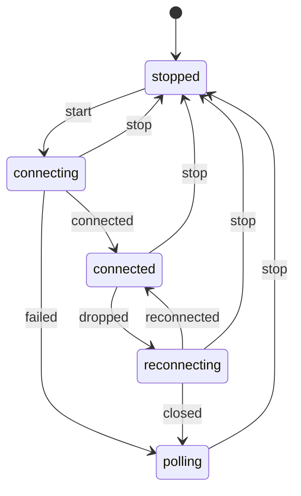

Código: los archivos [`examples/l03_*`](https://github.com/spareilleux/learn/tree/d039c6a49edd3fac4b6bf6003260282e3f77119d/code/typescript-advanced/examples) y [`errors/l03_*`](https://github.com/spareilleux/learn/tree/d039c6a49edd3fac4b6bf6003260282e3f77119d/code/typescript-advanced/errors), y los equivalentes en C# y Java en [`compare/`](https://github.com/spareilleux/learn/tree/d039c6a49edd3fac4b6bf6003260282e3f77119d/code/typescript-advanced/compare) (`l03_positions.cs`, `L03TypeState.java`) y [`compare_fail/`](https://github.com/spareilleux/learn/tree/d039c6a49edd3fac4b6bf6003260282e3f77119d/code/typescript-advanced/compare_fail) (`l03_positions_mixed.cs`, `L03TypeState.java`).

El tipado estructural es cómodo hasta que dos valores tienen la misma forma y significados distintos. Un índice de cuerda y un traste son los dos `number`, un id de nodo y un id de arista son los dos `string`, y un componente que registra si está cargando, qué cargó y qué salió mal en tres variables separadas puede contener combinaciones que no significan nada. Los desarrolladores C# y Java resuelven el primer problema con una pequeña clase o un record, y el segundo con una jerarquía de clases. TypeScript tiene sus propias herramientas para los dos, más baratas en tiempo de ejecución y más débiles en algunos puntos, y esta lección las usa en tres lugares del frontend de GA.

## Dos numeraciones para las mismas cuerdas

La biblioteca de componentes de GA numera las cuerdas de guitarra de dos maneras, y las dos tienen el tipo `number`:

- [`types/InstrumentConfig.ts`, línea 73](https://github.com/GuitarAlchemist/ga/blob/32f143c866c126338b332e384e4a615cd4b44381/ReactComponents/ga-react-components/src/types/InstrumentConfig.ts#L72-L78), y [`GuitarFretboard.tsx`, línea 8](https://github.com/GuitarAlchemist/ga/blob/32f143c866c126338b332e384e4a615cd4b44381/ReactComponents/ga-react-components/src/components/GuitarFretboard.tsx#L7-L11), cuentan desde 0: "0 = highest pitch", "0 = high E".
- [`VexTabViewer.tsx`, línea 86](https://github.com/GuitarAlchemist/ga/blob/32f143c866c126338b332e384e4a615cd4b44381/ReactComponents/ga-react-components/src/components/VexTabViewer.tsx#L84-L90), e [`InverseKinematics.tsx`, línea 141](https://github.com/GuitarAlchemist/ga/blob/32f143c866c126338b332e384e4a615cd4b44381/ReactComponents/ga-react-components/src/components/InverseKinematics/InverseKinematics.tsx#L140-L143), cuentan desde 1, como hace la tablatura: "1 = high E, 6 = low E".

Las dos convenciones son razonables, y cada archivo es coherente. El riesgo está entre archivos: cuatro interfaces de la biblioteca se llaman `FretboardPosition`, todas con `string: number; fret: number`, y el tipado estructural las hace intercambiables, así que una posición del diapasón pasada al código de tablatura se desplaza una cuerda, en silencio. No encontré ningún sitio donde GA las mezcle hoy; la gracia de un tipo es que nadie tenga que volver a comprobarlo.

## Marcas

```ts
// examples/l03_positions.ts
// Números con marca para las dos numeraciones de cuerdas encontradas en el frontend de GuitarAlchemist/ga:
// InstrumentConfig.ts cuenta desde 0 (0 = la cuerda más aguda), VexTabViewer.tsx e InverseKinematics.tsx desde 1 (1 = Mi agudo)

// Un unique symbol solo existe en las declaraciones de este módulo: nada de fuera puede nombrar la marca
declare const brand: unique symbol;
type Brand<T, B extends string> = T & { readonly [brand]: B };

export type StringIndex = Brand<number, 'StringIndex'>; // desde 0, 0 = la cuerda más aguda
export type StringNumber = Brand<number, 'StringNumber'>; // desde 1, 1 = la cuerda más aguda, como en la tablatura
export type Fret = Brand<number, 'Fret'>; // 0 = cuerda al aire

export const STRING_COUNT = 6;
export const MAX_FRET = 24;

// Constructores inteligentes: las únicas funciones que convierten un número en uno con marca, tras comprobarlo
export function stringIndex(value: number): StringIndex {
  if (!Number.isInteger(value) || value < 0 || value >= STRING_COUNT) throw new RangeError(`string index out of range: ${value}`);
  return value as StringIndex;
}
export function stringNumber(value: number): StringNumber {
  if (!Number.isInteger(value) || value < 1 || value > STRING_COUNT) throw new RangeError(`string number out of range: ${value}`);
  return value as StringNumber;
}
export function fret(value: number): Fret {
  if (!Number.isInteger(value) || value < 0 || value > MAX_FRET) throw new RangeError(`fret out of range: ${value}`);
  return value as Fret;
}

// Las conversiones son explícitas, y se escriben una sola vez
export const toStringNumber = (index: StringIndex): StringNumber => (index + 1) as StringNumber;
export const toStringIndex = (number: StringNumber): StringIndex => (number - 1) as StringIndex;
```

Una **marca** (*brand*) interseca el tipo base con un tipo objeto que ningún valor real tiene: `number & { readonly [brand]: 'StringIndex' }`. Un `number` normal no es asignable a él, ya que le falta la propiedad, y un `StringIndex` no es asignable a un `StringNumber`, ya que los tipos literales de la propiedad difieren. La propiedad nunca existe en tiempo de ejecución. `declare const brand: unique symbol` declara un símbolo solo para el verificador; Node.js elimina la línea, y no se asigna nada.

El módulo exporta los tipos y un **constructor inteligente** para cada uno: las únicas funciones que afirman una marca, tras comprobar el rango. Como `brand` no se exporta, ningún otro módulo puede escribir a mano el tipo de la marca; sí puede escribir `as StringNumber`, que es el límite de la técnica.

```ts
// examples/l03_brands.ts
import type { Equal, Expect } from './type-tests.ts';
import { attempt, show } from './show.ts';
import { fret, stringIndex, stringNumber, toStringIndex, toStringNumber, type Fret, type StringIndex, type StringNumber } from './l03_positions.ts';

// VexTabViewer.tsx de GA: getPitchFromTabPosition(string: number, fret: number), con 1 = Mi agudo
const openStrings = ['E/5', 'B/4', 'G/4', 'D/4', 'A/3', 'E/3'];
function openStringOf(string: StringNumber): string {
  return openStrings[string - 1] ?? 'E/3';
}
// InstrumentConfig.ts de GA: FretboardPosition { string: number; fret: number }, con 0 = la cuerda más aguda
interface FretboardPosition {
  string: StringIndex;
  fret: Fret;
}

const clicked: FretboardPosition = { string: stringIndex(1), fret: fret(3) }; // la cuerda Si, tercer traste
show('openStringOf(toStringNumber(…))', openStringOf(toStringNumber(clicked.string)));

// Una marca es un tipo, y nada más: en tiempo de ejecución el valor es un número normal
show('typeof clicked.string', typeof clicked.string);
show('JSON.stringify(clicked)', JSON.stringify(clicked));

// La aritmética devuelve un number: la marca dice lo que es el valor, y un valor nuevo hay que volver a comprobarlo
const next = clicked.fret + 1;
type _1 = Expect<Equal<typeof next, number>>;
show('fret(next)', fret(next));
attempt('fret(25)', () => fret(25));
attempt('stringNumber(0)', () => stringNumber(0));

// Un valor con marca sigue siendo un número allí donde se espera un número
show('Math.max(clicked.fret, 5)', Math.max(clicked.fret, 5));
show('toStringIndex(stringNumber(6))', toStringIndex(stringNumber(6)));

// Las clases con un campo #private se comparan nominalmente: dos formas idénticas no son intercambiables
class Semitones {
  #value: number;
  constructor(value: number) {
    this.#value = value;
  }
  get value(): number {
    return this.#value;
  }
}
class Cents {
  #value: number;
  constructor(value: number) {
    this.#value = value;
  }
  get value(): number {
    return this.#value;
  }
}
// @ts-expect-error: un Cents no es un Semitones, aunque los dos tengan un getter value
const wrong: Semitones = new Cents(700);
show('new Semitones(7).value', new Semitones(7).value);
show('wrong instanceof Semitones', wrong instanceof Semitones);
```

```text
openStringOf(toStringNumber(…))    'B/4'
typeof clicked.string              'number'
JSON.stringify(clicked)            '{"string":1,"fret":3}'
fret(next)                         4
fret(25)                           RangeError: fret out of range: 25
stringNumber(0)                    RangeError: string number out of range: 0
Math.max(clicked.fret, 5)          5
toStringIndex(stringNumber(6))     5
new Semitones(7).value             7
wrong instanceof Semitones         false
```

- **Una marca es un tipo y nada más**: `typeof` da `'number'`, y `JSON.stringify` escribe números normales, así que los valores con marca cruzan la red como cualquier otro.
- **La aritmética devuelve un `number`**: `clicked.fret + 1` no es un `Fret`, porque el resultado podría ser 25. La marca dice que el valor se comprobó, y un valor nuevo hay que volver a comprobarlo, aquí con `fret(next)`.
- **Un valor con marca sigue siendo un número** allí donde se espera un número, así que `Math.max` y la indexación de arrays funcionan sin conversión.
- **Los campos `#private` hacen nominales las clases.** Dos clases con el mismo campo privado y el mismo getter no son asignables entre sí, porque a un [campo privado](https://www.typescriptlang.org/docs/handbook/2/classes.html#caveats) solo se puede acceder a través de su propia clase. Eso da tipos nominales de verdad, con una comprobación en tiempo de ejecución mediante `instanceof`, al precio de un objeto por valor.

Los errores que detectan las marcas:

```text
> npx tsc -p out/tsconfig.l03_brands.json --pretty
errors/l03_brands.ts:11:14 - error TS2345: Argument of type 'StringIndex' is not assignable to parameter of type 'StringNumber'.
  Type 'StringIndex' is not assignable to type '{ readonly [brand]: "StringNumber"; }'.
    Types of property '[brand]' are incompatible.
      Type '"StringIndex"' is not assignable to type '"StringNumber"'.

11 openStringOf(clicked.string); // a 0-based index where a 1-based number is expected
                ~~~~~~~~~~~~~~

errors/l03_brands.ts:12:14 - error TS2345: Argument of type 'number' is not assignable to parameter of type 'StringNumber'.
  Type 'number' is not assignable to type '{ readonly [brand]: "StringNumber"; }'.

12 openStringOf(2); // a plain number
                ~

errors/l03_brands.ts:13:48 - error TS2322: Type 'number' is not assignable to type 'Fret'.
  Type 'number' is not assignable to type '{ readonly [brand]: "Fret"; }'.

13 const moved: FretboardPosition = { ...clicked, fret: clicked.fret + 1 }; // arithmetic loses the brand
                                                  ~~~~

  errors/l03_brands.ts:7:3 - The expected type comes from property 'fret' which is declared here on type 'FretboardPosition'
    7   fret: Fret;
        ~~~~

errors/l03_brands.ts:14:38 - error TS2322: Type 'Fret' is not assignable to type 'StringIndex'.
  Type 'Fret' is not assignable to type '{ readonly [brand]: "StringIndex"; }'.
    Types of property '[brand]' are incompatible.
      Type '"Fret"' is not assignable to type '"StringIndex"'.

14 const swapped: FretboardPosition = { string: clicked.fret, fret: clicked.string };
                                        ~~~~~~

  errors/l03_brands.ts:6:3 - The expected type comes from property 'string' which is declared here on type 'FretboardPosition'
    6   string: StringIndex;
        ~~~~~~

errors/l03_brands.ts:14:60 - error TS2322: Type 'StringIndex' is not assignable to type 'Fret'.
  Type 'StringIndex' is not assignable to type '{ readonly [brand]: "Fret"; }'.
    Types of property '[brand]' are incompatible.
      Type '"StringIndex"' is not assignable to type '"Fret"'.

14 const swapped: FretboardPosition = { string: clicked.fret, fret: clicked.string };
                                                              ~~~~

  errors/l03_brands.ts:7:3 - The expected type comes from property 'fret' which is declared here on type 'FretboardPosition'
    7   fret: Fret;
        ~~~~


Found 5 errors in the same file, starting at: errors/l03_brands.ts:11
```

El índice pasado donde se espera un número de tablatura, el número normal, la marca perdida tras la aritmética, y la cuerda y el traste intercambiados son todos errores de compilación. La última línea, `99 as StringNumber`, compila: una aserción falsifica una marca, y tiene que detectarlo una regla de lint o una revisión de código. Los mensajes mencionan `[brand]`, que es un motivo para dar a la marca un nombre legible.

C# expresa la misma idea con un tipo real. Un [`readonly record struct`](https://learn.microsoft.com/dotnet/csharp/language-reference/builtin-types/record) envuelve el `int` sin asignar memoria, lleva sus comprobaciones en el constructor, y la conversión entre numeraciones es un método:

```csharp
// compare/l03_positions.cs
// En C#, un envoltorio nominal es un tipo real: un readonly record struct no cuesta ninguna asignación y lleva sus comprobaciones
var clicked = new FretboardPosition(new StringIndex(1), new Fret(3));
Console.WriteLine(OpenStringOf(clicked.String.ToStringNumber()));
Console.WriteLine(clicked);
try
{
    _ = new Fret(25);
}
catch (ArgumentOutOfRangeException e)
{
    Console.WriteLine(e.Message);
}

static string OpenStringOf(StringNumber number) => new[] { "E/5", "B/4", "G/4", "D/4", "A/3", "E/3" }[number.Value - 1];

readonly record struct StringIndex
{
    public int Value { get; }
    public StringIndex(int value)
    {
        ArgumentOutOfRangeException.ThrowIfNegative(value);
        ArgumentOutOfRangeException.ThrowIfGreaterThan(value, 5);
        Value = value;
    }
    public StringNumber ToStringNumber() => new(Value + 1);
}

readonly record struct StringNumber
{
    public int Value { get; }
    public StringNumber(int value)
    {
        ArgumentOutOfRangeException.ThrowIfLessThan(value, 1);
        ArgumentOutOfRangeException.ThrowIfGreaterThan(value, 6);
        Value = value;
    }
}

readonly record struct Fret
{
    public int Value { get; }
    public Fret(int value)
    {
        ArgumentOutOfRangeException.ThrowIfNegative(value);
        ArgumentOutOfRangeException.ThrowIfGreaterThan(value, 24);
        Value = value;
    }
}

record FretboardPosition(StringIndex String, Fret Fret);
```

```text
> dotnet run l03_positions.cs
B/4
FretboardPosition { String = StringIndex { Value = 1 }, Fret = Fret { Value = 3 } }
value ('25') must be less than or equal to '24'. (Parameter 'value')
Actual value was 25.
```

```text
> dotnet run l03_positions_mixed.cs
compare_fail/l03_positions_mixed.cs(3,32): error CS1503: Argument 1: cannot convert from 'StringIndex' to 'StringNumber'
compare_fail/l03_positions_mixed.cs(4,32): error CS1503: Argument 1: cannot convert from 'int' to 'StringNumber'

The build failed. Fix the build errors and run again.
```

| | C# `readonly record struct` | Java `record` | Marca TypeScript | Clase TypeScript con `#private` |
|---|---|---|---|---|
| Distinto del tipo base | sí | sí | sí | sí |
| Coste en tiempo de ejecución | ninguno, un struct | un objeto | ninguno | un objeto |
| Comprobación en tiempo de ejecución | constructor | constructor | solo el constructor inteligente | constructor e `instanceof` |
| Se puede falsificar | no, sin código unsafe | no | sí, con `as` | no |
| Se serializa como el valor base | con un convertidor | con un serializador | sí | no |

## Estados imposibles

El widget de chat de GA registra la entrada de voz en [`ChatWidget.tsx`, líneas 763-764](https://github.com/GuitarAlchemist/ga/blob/32f143c866c126338b332e384e4a615cd4b44381/ReactComponents/ga-react-components/src/components/PrimeRadiant/ChatWidget.tsx#L763-L764), con dos piezas de estado:

```ts
const [isListening, setIsListening] = useState(false);
const [voiceState, setVoiceState] = useState<'idle' | 'listening' | 'processing' | 'understood'>('idle');
```

Las dos pueden contradecirse, y el código que las actualiza muestra cómo. En [`startListening`](https://github.com/GuitarAlchemist/ga/blob/32f143c866c126338b332e384e4a615cd4b44381/ReactComponents/ga-react-components/src/components/PrimeRadiant/ChatWidget.tsx#L971-L1025), los manejadores `onerror` y `onend` llaman a `setIsListening(false)`, y luego `if (voiceState === 'listening') setVoiceState('idle')`. `voiceState` ahí es el valor capturado cuando se creó el callback, y `voiceState` no está en su lista de dependencias, `[sendMessage, alwaysListen, locale]`; `setVoiceState('listening')` se llama al final de la misma función, después de la captura. Así que la comprobación probablemente es siempre falsa, y tras un error el widget puede mostrar `isListening` a falso con `voiceState` todavía en `'listening'` (*por verificar* en un navegador). La misma función llama a `sendMessage(transcript).then(() => setVoiceState('understood'))` sin `catch`, y `sendMessage` tiene un `try`/`finally` sin `catch`, así que una petición fallida deja el estado en `'processing'`. El cierre obsoleto es un problema de React, para el curso [React (Vite)](../../react-vite/); la pareja contradictoria es un problema de modelado, y un tipo puede eliminarla.

```ts
// examples/l03_states.ts
import type { Equal, Expect } from './type-tests.ts';
import { show } from './show.ts';

// ChatWidget.tsx de GA guarda la entrada de voz en dos piezas de estado que pueden contradecirse:
//   const [isListening, setIsListening] = useState(false);
//   const [voiceState, setVoiceState] = useState<'idle' | 'listening' | 'processing' | 'understood'>('idle');
interface LooseVoice {
  isListening: boolean;
  voiceState: 'idle' | 'listening' | 'processing' | 'understood';
  transcript?: string;
  error?: string;
}
// 2 × 4 × 2 × 2 = 32 combinaciones, y la mayoría no significan nada: escuchando e inactivo, un error estando entendido…
const contradictory: LooseVoice = { isListening: false, voiceState: 'listening', error: 'network' };
show('contradictory', contradictory);

// Una unión discriminada: cada estado lleva exactamente los datos que existen en ese estado
type Voice =
  | { status: 'idle' }
  | { status: 'listening'; startedAt: number }
  | { status: 'processing'; transcript: string }
  | { status: 'understood'; transcript: string }
  | { status: 'failed'; transcript: string; error: string };

// Los eventos que la hacen avanzar, también una unión
type VoiceEvent =
  | { type: 'start'; at: number }
  | { type: 'final-result'; transcript: string }
  | { type: 'sent' }
  | { type: 'send-failed'; error: string }
  | { type: 'stop' }
  | { type: 'reset' };

// Las transiciones, como un reducer: cada estado maneja cada evento, y un evento que no aplica conserva el estado
function transition(state: Voice, event: VoiceEvent): Voice {
  switch (state.status) {
    case 'idle':
      return event.type === 'start' ? { status: 'listening', startedAt: event.at } : state;
    case 'listening':
      if (event.type === 'final-result') return { status: 'processing', transcript: event.transcript };
      return event.type === 'stop' ? { status: 'idle' } : state;
    case 'processing':
      if (event.type === 'sent') return { status: 'understood', transcript: state.transcript };
      return event.type === 'send-failed' ? { status: 'failed', transcript: state.transcript, error: event.error } : state;
    case 'understood':
    case 'failed':
      return event.type === 'reset' ? { status: 'idle' } : state;
    default:
      return assertNever(state);
  }
}
function assertNever(value: never): never {
  throw new Error(`unexpected state: ${JSON.stringify(value)}`);
}

// El renderizado lee los datos que el estado garantiza, sin comprobaciones de opcionales
function label(state: Voice): string {
  switch (state.status) {
    case 'idle':
      return 'mic off';
    case 'listening':
      return `listening since ${state.startedAt} ms`;
    case 'processing':
      return `sending "${state.transcript}"`;
    case 'understood':
      return `understood "${state.transcript}"`;
    case 'failed':
      return `could not send "${state.transcript}": ${state.error}`;
  }
}

const events: VoiceEvent[] = [
  { type: 'start', at: 120 },
  { type: 'final-result', transcript: 'show me drop D voicings' },
  { type: 'send-failed', error: 'HTTP 503' },
  { type: 'sent' }, // ignorado: una petición fallida no puede tener éxito después
  { type: 'reset' },
];
let state: Voice = { status: 'idle' };
for (const event of events) {
  state = transition(state, event);
  console.log(`${event.type.padEnd(13)} → ${label(state)}`);
}

// El número de valores posibles es ahora el número de estados
type _1 = Expect<Equal<Voice['status'], 'idle' | 'listening' | 'processing' | 'understood' | 'failed'>>;
```

```text
contradictory                      { isListening: false, voiceState: 'listening', error: 'network' }
start         → listening since 120 ms
final-result  → sending "show me drop D voicings"
send-failed   → could not send "show me drop D voicings": HTTP 503
sent          → could not send "show me drop D voicings": HTTP 503
reset         → mic off
```

`LooseVoice` tiene 32 combinaciones, y el programa construye una que no significa nada sin error de compilación. `Voice` es una **unión discriminada**: cinco estados, y cada uno contiene los datos que existen en ese estado. No hay `transcript` mientras está inactivo, ni `error` salvo que la petición haya fallado, ni forma de estar escuchando y no escuchando a la vez. Los eventos también son una unión, y las transiciones son una función de un estado y un evento a un estado, la forma de reducer que usa `useReducer` de React.

- La rama `default` pasa `state` a `assertNever`, cuyo parámetro es `never`: si se añade un sexto estado y no se maneja, `state` no es `never` ahí, y la llamada es un error de compilación.
- `label` no tiene `default`, y no lo necesita: su tipo de retorno es `string`, y un caso que falta hace alcanzable el final de la función, lo que `tsc` señala.
- El cuarto evento, `sent`, llega después de `send-failed` y se ignora, porque el estado `failed` no lo maneja: el orden de los eventos asíncronos forma parte del modelo, y un éxito tardío no puede sobrescribir un fallo.

Los errores:

```text
> npx tsc -p out/tsconfig.l03_states.json --pretty
errors/l03_states.ts:8:31 - error TS2366: Function lacks ending return statement and return type does not include 'undefined'.

8 function label(state: Voice): string {
                                ~~~~~~

errors/l03_states.ts:9:62 - error TS2339: Property 'transcript' does not exist on type '{ status: "listening"; startedAt: number; }'.

9   if (state.status === 'listening') return `sending "${state.transcript}"`;
                                                               ~~~~~~~~~~

errors/l03_states.ts:29:42 - error TS2353: Object literal may only specify known properties, and 'transcript' does not exist in type '{ status: "idle"; }'.

29 const invalid: Voice = { status: 'idle', transcript: 'leftover' };
                                            ~~~~~~~~~~

errors/l03_states.ts:30:17 - error TS2345: Argument of type '"stop"' is not assignable to parameter of type '"start"'.

30 send('stopped', 'stop');
                   ~~~~~~

errors/l03_states.ts:31:7 - error TS2820: Type '"poling"' is not assignable to type '"connected" | "connecting" | "polling" | "stopped"'. Did you mean '"polling"'?

31 const next: LiveState = send('connecting', 'failed');
         ~~~~


Found 5 errors in the same file, starting at: errors/l03_states.ts:8
```

`TS2366` es el caso `'failed'` que falta. `TS2339` lee un `transcript` en el estado `listening`, que no tiene. `TS2353` construye un estado inactivo con datos sobrantes. Los dos últimos errores tienen que ver con la máquina de estados de la sección siguiente; la errata `'poling'` solo se detecta donde un destino se usa como estado, lo que mejora el tercer ejercicio.

La versión Java del mismo modelo usa una [interfaz sellada](https://docs.oracle.com/en/java/javase/25/language/sealed-classes-and-interfaces.html) y records. Va un paso más allá que el reducer de TypeScript: cada estado es una clase, y solo tiene los métodos de sus propias transiciones, así que una transición no válida ni siquiera es una llamada a método que se pueda escribir.

```java
// compare/L03TypeState.java
// Java 25: interfaces selladas y records, donde cada estado solo ofrece las transiciones que permite
public class L03TypeState {
    sealed interface Voice permits Idle, Listening, Processing, Failed {}

    record Idle() implements Voice {
        Listening start(long at) { return new Listening(at); }
    }

    record Listening(long startedAt) implements Voice {
        Processing finalResult(String transcript) { return new Processing(transcript); }
        Idle stop() { return new Idle(); }
    }

    record Processing(String transcript) implements Voice {
        Failed sendFailed(String error) { return new Failed(transcript, error); }
    }

    record Failed(String transcript, String error) implements Voice {}

    // El switch sobre una interfaz sellada debe cubrir cada tipo permitido
    static String label(Voice state) {
        return switch (state) {
            case Idle i -> "mic off";
            case Listening l -> "listening since " + l.startedAt() + " ms";
            case Processing p -> "sending \"" + p.transcript() + "\"";
            case Failed f -> "could not send \"" + f.transcript() + "\": " + f.error();
        };
    }

    public static void main(String[] args) {
        Voice state = new Idle().start(120).finalResult("show me drop D voicings").sendFailed("HTTP 503");
        System.out.println(label(state));
    }
}
```

```text
> java L03TypeState.java
could not send "show me drop D voicings": HTTP 503
```

```text
> javac L03TypeState.java
L03TypeState.java:13: error: cannot find symbol
        new Idle().stop();
                  ^
  symbol:   method stop()
  location: class Idle
1 error
```

## Una máquina de estados tipada

La conexión de datos en vivo de [`DataLoader.ts`](https://github.com/GuitarAlchemist/ga/blob/32f143c866c126338b332e384e4a615cd4b44381/ReactComponents/ga-react-components/src/components/PrimeRadiant/DataLoader.ts#L242-L441) intenta primero SignalR y recurre al sondeo HTTP. Su estado está repartido en tres variables mutables, `active`, `connection` y `pollInterval`, y se comunica al llamador como `'connected' | 'polling' | 'disconnected'`. Escritos como tabla, los estados y las transiciones son:



La tabla también es un valor, y su tipo basta para tipar la máquina:

```ts
// examples/l03_machine.ts
import type { Equal, Expect } from './type-tests.ts';
import { show } from './show.ts';

// La conexión en vivo de GA en DataLoader.ts: primero SignalR, el sondeo HTTP como alternativa, tres variables mutables
// (active, connection, pollInterval) y un estado comunicado como 'connected' | 'polling' | 'disconnected'.
// Una tabla de transiciones, comprobada por satisfies y mantenida literal por as const
const liveTransitions = {
  stopped: { start: 'connecting' },
  connecting: { connected: 'connected', failed: 'polling', stop: 'stopped' },
  connected: { dropped: 'reconnecting', stop: 'stopped' },
  reconnecting: { reconnected: 'connected', closed: 'polling', stop: 'stopped' },
  polling: { stop: 'stopped' },
} as const satisfies Record<string, Record<string, string>>;

type Transitions = typeof liveTransitions;
type LiveState = keyof Transitions;
type EventOf<S extends LiveState> = keyof Transitions[S];
type Next<S extends LiveState, E extends EventOf<S>> = Transitions[S][E];

// Cada destino de la tabla es un estado: una errata en un destino haría fallar esta prueba
type Targets = { [S in LiveState]: Transitions[S][keyof Transitions[S]] }[LiveState];
type _1 = Expect<Equal<[Targets] extends [LiveState] ? true : false, true>>;
type _2 = Expect<Equal<EventOf<'connected'>, 'dropped' | 'stop'>>;
type _3 = Expect<Equal<Next<'connecting', 'failed'>, 'polling'>>;

// send solo acepta los eventos del estado actual, y su tipo de resultado es el estado siguiente
function send<S extends LiveState, E extends EventOf<S>>(state: S, event: E): Next<S, E> {
  const targets: Record<string, string> = liveTransitions[state];
  return targets[event as string] as Next<S, E>; // una aserción: la búsqueda es la que describe el tipo
}

const s1 = send('stopped', 'start');
const s2 = send(s1, 'connected');
const s3 = send(s2, 'dropped');
const s4 = send(s3, 'closed');
type _4 = Expect<Equal<typeof s4, 'polling'>>;
show('stopped → … → s4', [s1, s2, s3, s4]);

// Un estado conocido solo en tiempo de ejecución es una unión: send acepta los eventos que permite cada miembro de la unión
type _5 = Expect<Equal<EventOf<LiveState>, never>>; // stopped no tiene evento stop
function stop(state: Exclude<LiveState, 'stopped'>) {
  return send(state, 'stop');
}
type _6 = Expect<Equal<ReturnType<typeof stop>, 'stopped'>>;
show("stop('reconnecting')", stop('reconnecting'));

// Lo que dice la tabla, listado en tiempo de ejecución
for (const [state, events] of Object.entries(liveTransitions)) {
  console.log(`${state.padEnd(13)} ${Object.entries(events).map(([event, next]) => `${event} → ${next}`).join(', ')}`);
}
```

```text
stopped → … → s4                   [ 'connecting', 'connected', 'reconnecting', 'polling' ]
stop('reconnecting')               'stopped'
stopped       start → connecting
connecting    connected → connected, failed → polling, stop → stopped
connected     dropped → reconnecting, stop → stopped
reconnecting  reconnected → connected, closed → polling, stop → stopped
polling       stop → stopped
```

- **`as const satisfies`**, de la [lección 2](../02-variance-and-assignability/#satisfies-anotaciones-y-aserciones), conserva cada destino como tipo literal y comprueba la forma de la tabla.
- **`EventOf<S>`** es `keyof Transitions[S]`, los eventos que acepta el estado `S`, y **`Next<S, E>`** es el acceso indexado `Transitions[S][E]`. `send('stopped', 'start')` tiene el tipo `'connecting'`, y el verificador sigue la cadena de `s1` a `s4` paso a paso.
- **Una unión de estados solo acepta sus eventos comunes.** El `keyof` de una unión es la intersección de las claves, así que `EventOf<LiveState>` es `never`: el estado `stopped` no tiene evento `stop`. `stop` toma los otros cuatro estados, y su tipo de retorno es `'stopped'`.
- **`Targets`** reúne cada destino de la tabla, y la prueba de tipos `_1` comprueba que cada uno es un estado. Aquí pasa; con la errata `'poling'` fallaría, lo que es una comprobación sobre la tabla que no depende de dónde se use la tabla.

La máquina comprueba las transiciones que escribe el código. No comprueba que el código envíe `dropped` cuando se dispara el `onreconnecting` de SignalR: esa parte sigue siendo una prueba en tiempo de ejecución. XState, la biblioteca de máquinas de estados más usada en TypeScript, construye sus máquinas tipadas sobre los mismos principios, con un [modelo de actores](https://stately.ai/docs/actors) encima.

## Puntos clave

- Una marca, `T & { readonly [brand]: 'Name' }`, hace incompatibles dos tipos estructuralmente idénticos, sin coste en tiempo de ejecución; los constructores inteligentes son el único sitio que la afirma.
- Las marcas desaparecen en la aritmética y pueden falsificarse con `as`; las clases con campos `#private` son nominales de verdad, al coste de un objeto.
- Una unión discriminada contiene exactamente los datos de cada estado, y elimina las combinaciones que permiten tres variables separadas.
- `never` en una rama `default`, o un tipo de retorno sin `undefined`, convierte un caso que falta en un error de compilación.
- Una tabla de transiciones mantenida literal con `as const satisfies` tipa una máquina de estados: los eventos permitidos vienen de `keyof`, los estados siguientes del acceso indexado.

## Ejercicios

1. El `GraphIndex` de GA, en `DataLoader.ts`, tiene cinco mapas con clave `string`, unos por id de nodo y otros por id de arista. Pon marca a `NodeId` y `EdgeId`, convierte los ids una sola vez al leer el grafo, y muestra que buscar un nodo por un id de arista ya no compila.

<details>
<summary>Solución</summary>

[`solutions/l03_ex1_graph_ids.ts`](https://github.com/spareilleux/learn/blob/d039c6a49edd3fac4b6bf6003260282e3f77119d/code/typescript-advanced/solutions/l03_ex1_graph_ids.ts):

```ts
// solutions/l03_ex1_graph_ids.ts
declare const brand: unique symbol;
type Brand<T, B extends string> = T & { readonly [brand]: B };
type NodeId = Brand<string, 'NodeId'>;
type EdgeId = Brand<string, 'EdgeId'>;

interface GovernanceNode {
  id: NodeId;
  name: string;
}
interface GovernanceEdge {
  id: EdgeId;
  source: NodeId;
  target: NodeId;
}

// El GraphIndex de GA en DataLoader.ts, con los ids diferenciados: en GA, los cinco mapas tienen clave string
interface GraphIndex {
  nodeMap: Map<NodeId, GovernanceNode>;
  outEdges: Map<NodeId, GovernanceEdge[]>;
  connectedEdges: Map<NodeId, Set<EdgeId>>;
}

// Los datos vienen de JSON: los ids reciben su marca una sola vez, donde se lee el grafo
function readGraph(raw: { nodes: { id: string; name: string }[]; edges: { id: string; source: string; target: string }[] }) {
  const nodes = raw.nodes.map((n): GovernanceNode => ({ id: n.id as NodeId, name: n.name }));
  const edges = raw.edges.map((e): GovernanceEdge => ({ id: e.id as EdgeId, source: e.source as NodeId, target: e.target as NodeId }));
  return { nodes, edges };
}

function buildGraphIndex(graph: { nodes: GovernanceNode[]; edges: GovernanceEdge[] }): GraphIndex {
  const index: GraphIndex = { nodeMap: new Map(), outEdges: new Map(), connectedEdges: new Map() };
  for (const node of graph.nodes) index.nodeMap.set(node.id, node);
  for (const edge of graph.edges) {
    index.outEdges.set(edge.source, [...(index.outEdges.get(edge.source) ?? []), edge]);
    for (const end of [edge.source, edge.target]) {
      index.connectedEdges.set(end, (index.connectedEdges.get(end) ?? new Set()).add(edge.id));
    }
  }
  return index;
}

const graph = readGraph({
  nodes: [{ id: 'constitution', name: 'Constitution' }, { id: 'policy-7', name: 'Alignment policy' }],
  edges: [{ id: 'e1', source: 'constitution', target: 'policy-7' }],
});
const index = buildGraphIndex(graph);
const edge = graph.edges[0]!;
console.log(index.nodeMap.get(edge.target)?.name, [...(index.connectedEdges.get(edge.source) ?? [])]);

function mistakes() {
  // @ts-expect-error: un id de arista no es un id de nodo
  index.nodeMap.get(edge.id);
  // @ts-expect-error: un string normal no es un id de nodo
  index.outEdges.get('constitution');
}
console.log(typeof mistakes);
```

```text
Alignment policy [ 'e1' ]
function
```

Las aserciones están todas en `readGraph`, donde las cadenas de JSON se convierten en ids; todo lo que viene después está comprobado. `Map<NodeId, …>` rechaza un `EdgeId` y una cadena normal en `get`, que es donde una confusión devolvería si no `undefined`. La lección 4 sustituye las aserciones de `readGraph` por un esquema que pone la marca a los ids tras comprobarlos.

</details>

2. Muchos componentes de GA tienen `[loading, setLoading]`, `[error, setError]` y `[data, setData]` uno al lado del otro. Escribe `RemoteData<T, E>` como una unión, y un `fold(state, handlers)` que exija un manejador por estado y pase a cada uno el miembro correcto de la unión.

<details>
<summary>Solución</summary>

[`solutions/l03_ex2_remote_data.ts`](https://github.com/spareilleux/learn/blob/d039c6a49edd3fac4b6bf6003260282e3f77119d/code/typescript-advanced/solutions/l03_ex2_remote_data.ts):

```ts
// solutions/l03_ex2_remote_data.ts
// Los componentes de GA tienen [loading, setLoading], [error, setError] y [data, setData] uno al lado del otro;
// una unión sustituye a los tres, y fold obliga a cada llamador a manejar cada estado
type RemoteData<T, E = string> =
  | { status: 'idle' }
  | { status: 'loading' }
  | { status: 'success'; data: T }
  | { status: 'failure'; error: E };

// Un manejador por estado, cada uno recibe su propio miembro de la unión: un tipo mapeado sobre el discriminante
type Handlers<T, E, R> = { [S in RemoteData<T, E>['status']]: (state: Extract<RemoteData<T, E>, { status: S }>) => R };

function fold<T, E, R>(state: RemoteData<T, E>, handlers: Handlers<T, E, R>): R {
  // Una aserción: tsc no puede correlacionar handlers[state.status] con state, un límite conocido de las uniones indexadas así
  const handler = handlers[state.status] as (state: RemoteData<T, E>) => R;
  return handler(state);
}

interface Voicing {
  name: string;
  frets: string;
}
const render = (state: RemoteData<Voicing[]>) =>
  fold(state, {
    idle: () => 'search for a chord',
    loading: () => 'searching…',
    success: ({ data }) => data.map((v) => `${v.name} ${v.frets}`).join(', '),
    failure: ({ error }) => `search failed: ${error}`,
  });

const states: RemoteData<Voicing[]>[] = [
  { status: 'idle' },
  { status: 'loading' },
  { status: 'success', data: [{ name: 'C', frets: 'x32010' }, { name: 'C/G', frets: '332010' }] },
  { status: 'failure', error: 'HTTP 503' },
];
for (const state of states) console.log(render(state));

function mistakes(state: RemoteData<Voicing[]>) {
  // @ts-expect-error: falta el manejador de failure
  fold(state, { idle: () => '', loading: () => '', success: () => '' });
}
console.log(typeof mistakes);
```

```text
search for a chord
searching…
C x32010, C/G 332010
search failed: HTTP 503
function
```

`Handlers` es un tipo mapeado sobre el discriminante, y `Extract` elige el miembro de la unión para cada estado, así que el manejador `success` puede desestructurar `data` y el manejador `failure` `error`. Dentro de `fold`, `handlers[state.status](state)` no compila sin la aserción: el tipo de `handlers[state.status]` es una unión de cuatro funciones, y llamar a una unión de funciones exige la intersección de sus parámetros, que aquí es `never`, la intersección contravariante de la [lección 1](../01-type-level-programming/#tipos-condicionales). `tsc` no sigue que la clave y el argumento vienen del mismo `state`, un límite conocido como uniones correlacionadas.

</details>

3. La errata `'poling'` en una tabla de transiciones solo se señala donde se usa el destino. Escribe `defineMachine(table)`, que rechaza una tabla cuyos destinos no son todos claves de la propia tabla.

<details>
<summary>Solución</summary>

[`solutions/l03_ex3_define_machine.ts`](https://github.com/spareilleux/learn/blob/d039c6a49edd3fac4b6bf6003260282e3f77119d/code/typescript-advanced/solutions/l03_ex3_define_machine.ts):

```ts
// solutions/l03_ex3_define_machine.ts
import type { Equal, Expect } from '../examples/type-tests.ts';

// La restricción se refiere al propio T: cada destino debe ser una de las claves de la tabla
function defineMachine<const T extends Record<string, Record<string, keyof T>>>(transitions: T): T {
  return transitions;
}

const live = defineMachine({
  stopped: { start: 'connecting' },
  connecting: { connected: 'connected', failed: 'polling', stop: 'stopped' },
  connected: { dropped: 'reconnecting', stop: 'stopped' },
  reconnecting: { reconnected: 'connected', closed: 'polling', stop: 'stopped' },
  polling: { stop: 'stopped' },
});
type _1 = Expect<Equal<(typeof live)['connecting']['failed'], 'polling'>>;

function mistakes() {
  defineMachine({
    stopped: { start: 'connecting' },
    // @ts-expect-error: 'poling' no es un estado
    connecting: { failed: 'poling' },
  });
}
console.log(Object.keys(live), typeof mistakes);
```

```text
[ 'stopped', 'connecting', 'connected', 'reconnecting', 'polling' ] function
```

La restricción `T extends Record<string, Record<string, keyof T>>` se refiere al propio `T`, lo que TypeScript permite, como el `<T extends Comparable<T>>` de Java. El modificador `const` mantiene literales los destinos, así que cada uno debe ser una de las claves literales. `satisfies` no puede hacer esto, porque el tipo que lo sigue no puede referirse al tipo de la expresión que se comprueba; una función genérica sí puede.

</details>

## Fuentes

- [TypeScript handbook — Narrowing: discriminated unions and exhaustiveness checking](https://www.typescriptlang.org/docs/handbook/2/narrowing.html#discriminated-unions), [Classes](https://www.typescriptlang.org/docs/handbook/2/classes.html), [Symbols — `unique symbol`](https://www.typescriptlang.org/docs/handbook/symbols.html#unique-symbol)
- [FAQ de TypeScript sobre el tipado nominal, en la wiki de TypeScript](https://github.com/microsoft/TypeScript/wiki/FAQ#can-i-make-a-type-alias-nominal)
- [Microsoft — Records](https://learn.microsoft.com/dotnet/csharp/language-reference/builtin-types/record), [ArgumentOutOfRangeException.ThrowIfGreaterThan](https://learn.microsoft.com/dotnet/api/system.argumentoutofrangeexception.throwifgreaterthan)
- [Java 25 — Sealed classes and interfaces](https://docs.oracle.com/en/java/javase/25/language/sealed-classes-and-interfaces.html), [Pattern matching for switch](https://docs.oracle.com/en/java/javase/25/language/pattern-matching-switch.html)
- [React — Extracting state logic into a reducer](https://react.dev/learn/extracting-state-logic-into-a-reducer)
