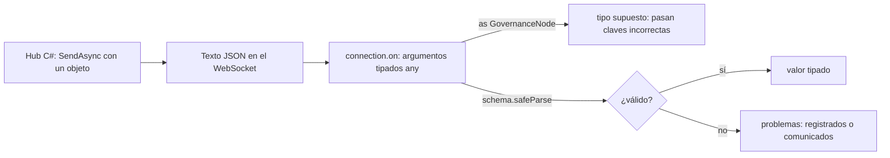

Código: los archivos [`examples/l04_*`](https://github.com/spareilleux/learn/tree/d039c6a49edd3fac4b6bf6003260282e3f77119d/code/typescript-advanced/examples) y [`errors/l04_*`](https://github.com/spareilleux/learn/tree/d039c6a49edd3fac4b6bf6003260282e3f77119d/code/typescript-advanced/errors), los bundles de [`bundle/`](https://github.com/spareilleux/learn/tree/d039c6a49edd3fac4b6bf6003260282e3f77119d/code/typescript-advanced/bundle) con [`bundle-size.mjs`](https://github.com/spareilleux/learn/blob/d039c6a49edd3fac4b6bf6003260282e3f77119d/code/typescript-advanced/bundle-size.mjs), y los equivalentes en C# y Java en [`compare/`](https://github.com/spareilleux/learn/tree/d039c6a49edd3fac4b6bf6003260282e3f77119d/code/typescript-advanced/compare) (`l04_hub_json.cs`, `l04_json_required.cs`) y [`compare_fail/`](https://github.com/spareilleux/learn/tree/d039c6a49edd3fac4b6bf6003260282e3f77119d/code/typescript-advanced/compare_fail) (`L04Checked.java`).

Las tres primeras lecciones hicieron que el verificador demostrara más cosas. Todo lo que demuestra descansa en una suposición: que cada valor tiene el tipo que se escribió para él. Dentro del programa, `tsc` lo comprueba. En la frontera, donde los valores vienen de `JSON.parse`, `response.json()`, un mensaje SignalR o `localStorage`, nada lo comprueba: esas APIs devuelven `any`, o un parámetro tipado a mano, y los tipos se borran antes de que el programa se ejecute. Los desarrolladores C# y Java están acostumbrados a un deserializador que al menos construye el tipo declarado y falla cuando no puede. En TypeScript, un tipo incorrecto en la frontera compila, se ejecuta, y falla en otro sitio, o no falla en absoluto.

## Una actualización perdida en GA

El hub C# de GA difunde el cambio de salud de un nodo en [`GovernanceHub.cs`, líneas 163-176](https://github.com/GuitarAlchemist/ga/blob/32f143c866c126338b332e384e4a615cd4b44381/Apps/ga-server/GaApi/Hubs/GovernanceHub.cs#L163-L176), como un objeto anónimo cuya primera propiedad es `nodeId`. El frontend lo recibe en [`DataLoader.ts`, líneas 276-279](https://github.com/GuitarAlchemist/ga/blob/32f143c866c126338b332e384e4a615cd4b44381/ReactComponents/ga-react-components/src/components/PrimeRadiant/DataLoader.ts#L276-L279):

```ts
connection.on('NodeChanged', (data: { nodeId: string; health: unknown; healthStatus: string; color: string }) => {
  // Actualización parcial — un solo nodo
  onUpdate({ nodes: [data as unknown as GovernanceNode], edges: [], globalHealth: { resilienceScore: 0, lolliCount: 0, ergolCount: 0 }, timestamp: new Date().toISOString() } as GovernanceGraph);
});
```

El tipo del parámetro es correcto: coincide con el servidor. La aserción `as unknown as GovernanceNode` dice luego que un objeto con `nodeId` es un nodo, cuya clave es `id`. [`ForceRadiant.tsx`, línea 3585](https://github.com/GuitarAlchemist/ga/blob/32f143c866c126338b332e384e4a615cd4b44381/ReactComponents/ga-react-components/src/components/PrimeRadiant/ForceRadiant.tsx#L3582-L3587), pasa los nodos de ese grafo a [`updateNodeHealth`](https://github.com/GuitarAlchemist/ga/blob/32f143c866c126338b332e384e4a615cd4b44381/ReactComponents/ga-react-components/src/components/PrimeRadiant/DataLoader.ts#L446-L471), que busca cada nodo de la escena por `id` entre los nodos nuevos. No encuentra nada, y la actualización se descarta sin error. Una búsqueda de código en GitHub no encuentra hoy ningún llamador de `BroadcastNodeChanged`, así que el camino está latente (*por verificar* en un servidor en marcha); es exactamente el tipo de bug que aparece el día en que alguien lo llama.

El ejemplo reduce el manejador y la función de actualización a lo esencial:

```ts
// examples/l04_border.ts
// El manejador NodeChanged de GuitarAlchemist/ga, reducido: se afirma que la carga útil es un nodo, y la actualización se pierde
import * as z from 'zod';
import { show } from './show.ts';

interface HealthMetrics {
  resilienceScore: number;
  lolliCount: number;
  ergolCount: number;
}
interface GovernanceNode {
  id: string;
  name: string;
  health?: HealthMetrics;
}

// DataLoader.ts, updateNodeHealth: busca cada nodo existente por id entre los nodos nuevos, y actualiza su salud
function updateNodeHealth(existingNodes: GovernanceNode[], freshNodes: GovernanceNode[]): string[] {
  const freshMap = new Map(freshNodes.map((n) => [n.id, n]));
  const updated: string[] = [];
  for (const node of existingNodes) {
    const fresh = freshMap.get(node.id);
    if (!fresh?.health) continue;
    node.health = fresh.health;
    updated.push(node.id);
  }
  return updated;
}

const scene: GovernanceNode[] = [{ id: 'policy-7', name: 'Alignment policy', health: { resilienceScore: 0.9, lolliCount: 0, ergolCount: 3 } }];

// El mensaje que envía GovernanceHub.BroadcastNodeChanged, tal como lo serializa SignalR (compare/l04_hub_json.cs)
const message = '{"nodeId":"policy-7","health":{"resilienceScore":0.4,"lolliCount":0,"ergolCount":3},"healthStatus":"warning","color":"#FFB300","timestamp":"2026-09-15T12:00:01Z"}';

// DataLoader.ts, líneas 276-279: el parámetro del manejador se anota, y luego se afirma que es un GovernanceNode
const data: { nodeId: string; health: unknown; healthStatus: string; color: string } = JSON.parse(message);
const asserted = updateNodeHealth(scene, [data as unknown as GovernanceNode]);
show('updated (asserted)', asserted);
show('scene[0].health.resilienceScore', scene[0]?.health?.resilienceScore);

// Un esquema comprueba la misma carga útil en la frontera, y dice qué está mal
const HealthMetricsSchema = z.object({
  resilienceScore: z.number().min(0).max(1),
  lolliCount: z.int().nonnegative(),
  ergolCount: z.int().nonnegative(),
});
const GovernanceNodeSchema = z.object({
  id: z.string().min(1),
  name: z.string(),
  health: HealthMetricsSchema.optional(),
});
const asNode = GovernanceNodeSchema.safeParse(JSON.parse(message));
if (!asNode.success) console.log(z.prettifyError(asNode.error));

// El esquema de lo que envía de verdad el hub, y la conversión a nodo escrita una sola vez
const NodeChangedSchema = z.object({
  nodeId: z.string().min(1),
  health: HealthMetricsSchema,
  healthStatus: z.enum(['error', 'warning', 'healthy', 'unknown', 'contradictory']),
  color: z.string().regex(/^#[0-9A-F]{6}$/i),
  timestamp: z.iso.datetime(),
});
const changed = NodeChangedSchema.parse(JSON.parse(message));
const updated = updateNodeHealth(scene, [{ id: changed.nodeId, name: '', health: changed.health }]);
show('updated (validated)', updated);
show('scene[0].health.resilienceScore', scene[0]?.health?.resilienceScore);
```

```text
updated (asserted)                 []
scene[0].health.resilienceScore    0.9
✖ Invalid input: expected string, received undefined
  → at id
✖ Invalid input: expected string, received undefined
  → at name
updated (validated)                [ 'policy-7' ]
scene[0].health.resilienceScore    0.4
```

Con la aserción, `updated` está vacío y la puntuación se queda en 0.9. El primer esquema, `GovernanceNodeSchema`, es el tipo que suponía el código, y dice de inmediato qué está mal en el mensaje: no hay `id`, no hay `name`. El segundo esquema describe lo que envía el hub, y la conversión de un mensaje a un nodo se escribe una sola vez, tras la comprobación; la actualización llega a su destino.

Qué envía exactamente el hub es una pregunta para el lado C#, y un programa C# la responde con el propio serializador de SignalR:

```csharp
// compare/l04_hub_json.cs
// Lo que GovernanceHub.cs pone en la red: el protocolo de hub JSON de SignalR, con sus opciones de serialización por defecto
#:sdk Microsoft.NET.Sdk.Web
// Las aplicaciones basadas en archivo están preparadas para AOT por defecto, lo que desactiva el JSON basado en reflexión: los tipos anónimos lo necesitan
#:property PublishAot=false
using System.Buffers;
using System.Text;
using Microsoft.AspNetCore.SignalR.Protocol;

var protocol = new JsonHubProtocol();

// BroadcastNodeChanged envía un objeto anónimo cuya primera propiedad es nodeId, no id
var nodeChanged = new
{
    nodeId = "policy-7",
    health = new HealthMetrics(0.4, 0, 3),
    healthStatus = "warning",
    color = "#FFB300",
    timestamp = new DateTime(2026, 9, 15, 12, 0, 1, DateTimeKind.Utc),
};
Console.WriteLine(Write(new InvocationMessage("NodeChanged", [nodeChanged])));

// ViewersChanged envía records ViewerInfo: las propiedades PascalCase pasan a camelCase, y null se escribe como null
var viewer = new ViewerInfo("c3", "#d2a8ff", "Firefox", new DateTime(2026, 9, 15, 12, 0, 0, DateTimeKind.Utc));
Console.WriteLine(Write(new InvocationMessage("ViewersChanged", [new List<ViewerInfo> { viewer }])));

string Write(HubMessage message)
{
    var buffer = new ArrayBufferWriter<byte>();
    protocol.WriteMessage(message, buffer);
    // Cada mensaje termina con el carácter separador de registros, 0x1E
    return Encoding.UTF8.GetString(buffer.WrittenSpan).TrimEnd((char)0x1E);
}

record HealthMetrics(double ResilienceScore, int LolliCount, int ErgolCount);
record ViewerInfo(string ConnectionId, string Color, string Browser, DateTime ConnectedAt, string? DisplayName = null, string? AvatarUrl = null);
```

```text
> dotnet run l04_hub_json.cs
{"type":1,"target":"NodeChanged","arguments":[{"nodeId":"policy-7","health":{"resilienceScore":0.4,"lolliCount":0,"ergolCount":3},"healthStatus":"warning","color":"#FFB300","timestamp":"2026-09-15T12:00:01Z"}]}
{"type":1,"target":"ViewersChanged","arguments":[[{"connectionId":"c3","color":"#d2a8ff","browser":"Firefox","connectedAt":"2026-09-15T12:00:00Z","displayName":null,"avatarUrl":null}]]}
```

El [protocolo de hub JSON](https://github.com/dotnet/aspnetcore/blob/a5383385245bdacc20ec19f30e46090a8154d8da/src/SignalR/docs/specs/HubProtocol.md) escribe los argumentos con `System.Text.Json` y [nombres de propiedad en camelCase por defecto](https://learn.microsoft.com/aspnet/core/signalr/configuration#jsonmessagepack-serialization-options). El objeto anónimo conserva `nodeId`. El segundo mensaje es el `ViewersChanged` de GA: el `string? DisplayName = null` del record se escribe como `"displayName":null`. El [`ViewerInfo`](https://github.com/GuitarAlchemist/ga/blob/32f143c866c126338b332e384e4a615cd4b44381/ReactComponents/ga-react-components/src/components/PrimeRadiant/DataLoader.ts#L218-L225) del frontend declara `displayName?: string`, que, como mostró la [lección 2](../02-variance-and-assignability/#opcional-undefined-y-null), es un tipo distinto de `string | null`. El código de GA funciona porque cada lectura usa `?.` o `??`, que tratan igual `null` y `undefined`.

Merece la pena conocer dos detalles del programa C#. Las [aplicaciones basadas en archivo](https://learn.microsoft.com/dotnet/core/sdk/file-based-apps) se publican con AOT nativo por defecto, lo que desactiva el JSON basado en reflexión; los tipos anónimos lo necesitan, de ahí `#:property PublishAot=false`. Y el [`on`](https://github.com/dotnet/aspnetcore/blob/a5383385245bdacc20ec19f30e46090a8154d8da/src/SignalR/clients/ts/signalr/src/HubConnection.ts#L508-L509) del cliente JavaScript se declara como `on(methodName: string, newMethod: (...args: any[]) => any)`: cada tipo de parámetro de un manejador es una afirmación que nada comprueba.



La biblioteca de componentes de GA tiene 42 llamadas a `JSON.parse`, 55 líneas que afirman el resultado de `response.json()` con `as`, y 34 `as unknown as` fuera de las pruebas, en el commit `32f143c`. No todas son fronteras, y no todas son incorrectas; cada una es un sitio donde se cree en un tipo en lugar de comprobarlo.

## Esquemas: una definición, dos comprobaciones

Una **biblioteca de esquemas** describe los datos con valores, comprueba contra ellos los datos desconocidos en tiempo de ejecución, y calcula el tipo TypeScript a partir de la misma descripción, con las técnicas de la lección 1. Este curso usa [Zod](https://zod.dev/) 4:

```ts
// examples/l04_schemas.ts
import * as z from 'zod';
import type { Equal, Expect } from './type-tests.ts';
import { show } from './show.ts';

// 1. El tipo derivado del esquema: una definición, comprobada en tiempo de ejecución y en tiempo de compilación
const ViewerInfoSchema = z.object({
  connectionId: z.string(),
  color: z.string(),
  browser: z.enum(['Edge', 'Chrome', 'Firefox', 'Safari', 'Unknown']),
  connectedAt: z.iso.datetime(),
  displayName: z.string().nullable(), // el string? DisplayName = null del record C# se envía como null
  avatarUrl: z.string().nullable(),
});
type ViewerInfo = z.infer<typeof ViewerInfoSchema>;
type _1 = Expect<Equal<ViewerInfo['displayName'], string | null>>;

// 2. O el esquema comprobado contra una interfaz escrita a mano: satisfies z.ZodType<T> falla si se desincronizan.
// El ViewerInfo de GA en DataLoader.ts declara displayName?: string, donde null no encaja (errors/l04_schemas.ts)
interface ViewerInfoFixed {
  connectionId: string;
  color: string;
  browser: 'Edge' | 'Chrome' | 'Firefox' | 'Safari' | 'Unknown';
  connectedAt: string;
  displayName: string | null;
  avatarUrl: string | null;
}
const CheckedViewerInfoSchema = ViewerInfoSchema satisfies z.ZodType<ViewerInfoFixed>;
type _2 = Expect<Equal<z.infer<typeof CheckedViewerInfoSchema>, ViewerInfoFixed>>;

// 3. Los tipos de entrada y de salida difieren en cuanto el esquema transforma: cadenas en el mensaje, un Date y un number en el programa
const CameraSyncSchema = z.object({
  px: z.number(),
  py: z.number(),
  pz: z.number(),
  sender: z.string(),
  sentAt: z.iso.datetime().transform((text) => new Date(text)),
  zoom: z.coerce.number().default(1),
});
type CameraSyncInput = z.input<typeof CameraSyncSchema>;
type CameraSync = z.output<typeof CameraSyncSchema>;
type _3 = Expect<Equal<CameraSyncInput['sentAt'], string>>;
type _4 = Expect<Equal<CameraSync['sentAt'], Date>>;
type _5 = Expect<Equal<CameraSync['zoom'], number>>;
const camera = CameraSyncSchema.parse({ px: 0, py: 2, pz: 10, sender: 'c3', sentAt: '2026-09-15T12:00:00Z', zoom: '1.5' });
show('camera.sentAt.getUTCHours()', camera.sentAt.getUTCHours());
show('camera.zoom', camera.zoom);

// 4. Una marca añadida por el esquema: la única forma de obtener un NodeId es pasar la comprobación (lección 3)
const NodeIdSchema = z.string().regex(/^[a-z0-9-]+$/).brand<'NodeId'>();
type NodeId = z.infer<typeof NodeIdSchema>;
const nodeId: NodeId = NodeIdSchema.parse('policy-7');
show('nodeId', nodeId);
show("safeParse('Policy 7').success", NodeIdSchema.safeParse('Policy 7').success);

// 5. Claves desconocidas: eliminadas por defecto, conservadas con z.looseObject, rechazadas con z.strictObject
const payload = { connectionId: 'c3', color: '#d2a8ff', browser: 'Firefox', connectedAt: '2026-09-15T12:00:00Z', displayName: null, avatarUrl: null, isAdmin: true };
show("'isAdmin' in parse(payload)", 'isAdmin' in ViewerInfoSchema.parse(payload));
const strict = z.strictObject(ViewerInfoSchema.shape).safeParse(payload);
show('strictObject issues', strict.error?.issues.map((issue) => `${issue.code}: ${issue.message}`));

// 6. El esquema como JSON Schema, el formato que usan los documentos OpenAPI y los generadores de C# o Java
show('z.toJSONSchema(NodeIdSchema)', z.toJSONSchema(NodeIdSchema));
```

```text
camera.sentAt.getUTCHours()        12
camera.zoom                        1.5
nodeId                             'policy-7'
safeParse('Policy 7').success      false
'isAdmin' in parse(payload)        false
strictObject issues                [ 'unrecognized_keys: Unrecognized key: "isAdmin"' ]
z.toJSONSchema(NodeIdSchema)       {
  '$schema': 'https://json-schema.org/draft/2020-12/schema',
  type: 'string',
  pattern: '^[a-z0-9-]+$'
}
```

1. **Tipos derivados.** [`z.infer`](https://zod.dev/basics#inferring-types) es el tipo de salida del esquema. La prueba de tipos comprueba que `displayName` es `string | null`, como lo envía el hub.
2. **Un esquema comprobado contra una interfaz.** Cuando la interfaz viene primero, por ejemplo generada a partir de un documento OpenAPI, `satisfies z.ZodType<ViewerInfoFixed>` falla en cuanto los dos se desincronizan. Con el propio `ViewerInfo` de GA, falla, que es la desincronización de la sección anterior encontrada por el compilador.
3. **Entrada y salida.** Un [`transform`](https://zod.dev/api#transforms) o un [`coerce`](https://zod.dev/api#coercion) hace que el tipo del mensaje difiera del tipo del programa: `sentAt` es un `string` en [`z.input`](https://zod.dev/basics#inferring-types) y un `Date` en `z.output`. Un esquema es un analizador, no solo un validador.
4. **Marcas.** [`.brand<'NodeId'>()`](https://zod.dev/api#branded-types) añade la marca de la lección 3 al tipo de salida, así que el constructor inteligente es el propio esquema.
5. **Claves desconocidas.** `z.object` las elimina, lo que protege el código que expande el resultado en una petición; [`z.strictObject`](https://zod.dev/api#objects) las rechaza.
6. **JSON Schema.** [`z.toJSONSchema`](https://zod.dev/json-schema) convierte el esquema al formato que leen OpenAPI y los generadores de C# y Java, así que el esquema puede ser el contrato en lugar de una copia de él.

Los errores:

```text
> npx tsc -p out/tsconfig.l04_schemas.json --pretty
errors/l04_schemas.ts:23:34 - error TS1360: Type 'ZodObject<{ connectionId: ZodString; color: ZodString; browser: ZodString; connectedAt: ZodISODateTime; displayName: ZodNullable<ZodString>; avatarUrl: ZodNullable<...>; }, $strip>' does not satisfy the expected type 'ZodType<ViewerInfo, unknown, $ZodTypeInternals<ViewerInfo, unknown>>'.
  The types of '_zod.output.displayName' are incompatible between these types.
    Type 'string | null' is not assignable to type 'string'.
      Type 'null' is not assignable to type 'string'.

23 const checked = ViewerInfoSchema satisfies z.ZodType<ViewerInfo>;
                                    ~~~~~~~~~

errors/l04_schemas.ts:27:22 - error TS18048: 'result.data' is possibly 'undefined'.

27 console.log(checked, result.data.color);
                        ~~~~~~~~~~~


Found 2 errors in the same file, starting at: errors/l04_schemas.ts:23
> node errors/l04_schemas.ts
errors/l04_schemas.ts:27
console.log(checked, result.data.color);
                                 ^

TypeError: Cannot read properties of undefined (reading 'color')

Node.js v24.21.0
```

`TS1360` es `satisfies` rechazando la interfaz de GA, con la ruta de propiedad `_zod.output.displayName` que explica por qué. `TS18048` es el resultado de [`safeParse`](https://zod.dev/basics#handling-errors), una unión de éxito y fallo, leído sin comprobar `success`; Node.js muestra lo que la comprobación evita.

En C#, los tipos existen en tiempo de ejecución, y desde .NET 9 `System.Text.Json` puede imponer dos de las reglas que TypeScript deja a un esquema, las [anotaciones de nulabilidad](https://learn.microsoft.com/dotnet/standard/serialization/system-text-json/nullable-annotations) y los [parámetros de constructor obligatorios](https://learn.microsoft.com/dotnet/api/system.text.json.jsonserializeroptions.respectrequiredconstructorparameters):

```csharp
// compare/l04_json_required.cs
// Los tipos de C# existen en tiempo de ejecución: System.Text.Json puede comprobar la carga útil contra el record en el que deserializa
// Las aplicaciones basadas en archivo están preparadas para AOT por defecto, lo que desactiva el JSON basado en reflexión
#:property PublishAot=false
using System.Text.Json;

var options = new JsonSerializerOptions(JsonSerializerDefaults.Web)
{
    RespectNullableAnnotations = true, // .NET 9: null en una propiedad no anulable es un error
    RespectRequiredConstructorParameters = true, // .NET 9: un parámetro de constructor que falta es un error
};

string[] messages =
[
    """{"id":"policy-7","name":"Alignment policy"}""",
    """{"nodeId":"policy-7","health":{"resilienceScore":0.4}}""",
    """{"id":"policy-7","name":null}""",
];
foreach (var message in messages)
{
    try
    {
        var node = JsonSerializer.Deserialize<GovernanceNode>(message, options);
        Console.WriteLine($"ok: {node}");
    }
    catch (JsonException e)
    {
        Console.WriteLine($"JsonException: {e.Message}");
    }
}

record GovernanceNode(string Id, string Name);
```

```text
> dotnet run l04_json_required.cs
ok: GovernanceNode { Id = policy-7, Name = Alignment policy }
JsonException: JSON deserialization for type 'GovernanceNode' was missing required properties including: 'id', 'name'.
JsonException: The constructor parameter 'Name' on type 'GovernanceNode' doesn't allow null values. Consider updating its nullability annotation. Path: $.name | LineNumber: 0 | BytePositionInLine: 28.
```

Las dos opciones están desactivadas por defecto, por compatibilidad, y las comprobaciones de rango o de formato siguen necesitando código de validación o atributos. [Jackson](https://github.com/FasterXML/jackson-databind), en Java, está en la misma situación, con [Bean Validation](https://jakarta.ee/specifications/bean-validation/3.0/) para las reglas.

## Zod, Valibot o ArkType

Tres bibliotecas dominan en 2026, y cada una está construida de forma distinta:

- [Zod](https://zod.dev/) tiene una API de encadenamiento de métodos, `z.string().min(1)`, y el ecosistema más grande: tRPC, React Hook Form, los generadores OpenAPI y los SDKs de IA lo aceptan. Su variante funcional, [`zod/mini`](https://zod.dev/packages/mini), escribe `z.string().check(z.minLength(1))` y está pensada para el tamaño del bundle.
- [Valibot](https://valibot.dev/) es funcional desde el principio, `v.pipe(v.string(), v.minLength(1))`: cada comprobación es una función, y un bundler solo conserva las que se usan.
- [ArkType](https://arktype.io/) escribe las definiciones como cadenas con la propia sintaxis de TypeScript, `'string > 0'`, analizadas por tipos de plantilla literal en tiempo de compilación y compiladas en un validador en tiempo de ejecución.

El mismo esquema de nodo, empaquetado para un navegador con esbuild 0.28.2, minificado, con cada biblioteca:

```text
library     minified   gzip
zod-named   442.7 kB   90.6 kB
zod          87.4 kB   25.5 kB
zod-mini     17.6 kB    6.1 kB
valibot       4.8 kB    1.7 kB
arktype     150.1 kB   46.0 kB
```

| | Zod 4.6.5 | `zod/mini` | Valibot 1.5.0 | ArkType 2.2.3 |
|---|---|---|---|---|
| Bundle, gzip | 25.5 kB | 6.1 kB | 1.7 kB | 46.0 kB |
| API | métodos | funciones | funciones | sintaxis TypeScript en cadenas |
| Descargas npm, semana del 7 de sept. de 2026 | 211,005,391, con `zod/mini` | | 13,793,124 | 1,431,002 |
| JSON Schema | integrado | integrado | `@valibot/to-json-schema` | integrado |
| Standard Schema | sí | sí | sí | sí |

La primera línea de la medición es un hallazgo: `import { z } from 'zod'` da un bundle cinco veces más grande que `import * as z from 'zod'`, 90.6 kB frente a 25.5 kB con gzip, con el mismo código en todo lo demás (compara [`bundle/zod-named.ts`](https://github.com/spareilleux/learn/blob/d039c6a49edd3fac4b6bf6003260282e3f77119d/code/typescript-advanced/bundle/zod-named.ts) y [`bundle/zod.ts`](https://github.com/spareilleux/learn/blob/d039c6a49edd3fac4b6bf6003260282e3f77119d/code/typescript-advanced/bundle/zod.ts)). La exportación con nombre es un objeto que contiene todas las funciones, así que esbuild no puede eliminar las que no se usan; la importación de espacio de nombres se lo permite. La documentación de Zod escribe `import * as z from "zod"`, y esa es la forma que hay que mantener.

El curso usa Zod, por tres motivos: es lo que un lector encontrará en otras bases de código, sus mensajes de error y su salida JSON Schema no necesitan ningún paquete extra, y en un servidor o en Node.js el tamaño del bundle no importa. Para un bundle de navegador donde cuenta cada kilobyte, `zod/mini` o Valibot son mejores opciones, y la sección siguiente muestra que la elección no tiene por qué filtrarse al código que usa los esquemas.

## Standard Schema

[Standard Schema](https://standardschema.dev/) es una pequeña interfaz, publicada como el paquete de solo tipos `@standard-schema/spec`, que implementan las tres bibliotecas: cada esquema tiene una propiedad `~standard` con una función `validate` y los tipos de entrada y de salida. Una biblioteca que acepta esquemas, una biblioteca de formularios o un router, se escribe contra la interfaz una sola vez:

```ts
// examples/l04_standard_schema.ts
// Standard Schema: una interfaz que implementan Zod, Valibot y ArkType, así que una función puede aceptar cualquiera de ellos
import type { StandardSchemaV1 } from '@standard-schema/spec';
import { type } from 'arktype';
import * as v from 'valibot';
import * as z from 'zod';
import type { Equal, Expect } from './type-tests.ts';

type Parsed<T> = { ok: true; value: T } | { ok: false; issues: string[] };

// Escrita una vez, contra la interfaz: el tipo de salida viene del esquema, sea cual sea la biblioteca que lo construyó
async function parseJson<S extends StandardSchemaV1>(schema: S, text: string): Promise<Parsed<StandardSchemaV1.InferOutput<S>>> {
  let json: unknown;
  try {
    json = JSON.parse(text);
  } catch (err) {
    return { ok: false, issues: [`not JSON: ${err instanceof Error ? err.message : String(err)}`] };
  }
  const result = await schema['~standard'].validate(json);
  if (result.issues) {
    return { ok: false, issues: result.issues.map((issue) => `${issue.path?.map((p) => (typeof p === 'object' ? p.key : p)).join('.') ?? ''}: ${issue.message}`) };
  }
  return { ok: true, value: result.value };
}

// El mismo tipo de carga útil, tres bibliotecas
const zodSchema = z.object({ target: z.string().min(1), timestamp: z.iso.datetime() });
const valibotSchema = v.object({ target: v.pipe(v.string(), v.minLength(1)), timestamp: v.pipe(v.string(), v.isoTimestamp()) });
const arktypeSchema = type({ target: 'string > 0', timestamp: 'string.date.iso' });

type NavigateToPlanet = { target: string; timestamp: string };
type _1 = Expect<Equal<StandardSchemaV1.InferOutput<typeof zodSchema>, NavigateToPlanet>>;
type _2 = Expect<Equal<StandardSchemaV1.InferOutput<typeof valibotSchema>, NavigateToPlanet>>;
type _3 = Expect<Equal<StandardSchemaV1.InferOutput<typeof arktypeSchema>, NavigateToPlanet>>;

const messages = ['{"target":"saturn","timestamp":"2026-09-15T12:00:00Z"}', '{"target":"","timestamp":"yesterday"}', '{"target":'];
for (const [name, schema] of [['zod', zodSchema], ['valibot', valibotSchema], ['arktype', arktypeSchema]] as const) {
  for (const message of messages) {
    const parsed = await parseJson(schema, message);
    console.log(`${name.padEnd(8)} ${parsed.ok ? `ok: ${parsed.value.target}` : parsed.issues.join(' | ')}`);
  }
}
```

```text
zod      ok: saturn
zod      target: Too small: expected string to have >=1 characters | timestamp: Invalid ISO datetime
zod      not JSON: Unexpected end of JSON input
valibot  ok: saturn
valibot  target: Invalid length: Expected >=1 but received 0 | timestamp: Invalid timestamp: Received "yesterday"
valibot  not JSON: Unexpected end of JSON input
arktype  ok: saturn
arktype  target: target must be non-empty | timestamp: timestamp must be an ISO 8601 (YYYY-MM-DDTHH:mm:ss.sssZ) date (was "yesterday")
arktype  not JSON: Unexpected end of JSON input
```

`parseJson` no sabe nada de Zod, Valibot ni ArkType, y aun así su tipo de retorno es el tipo de salida del esquema que reciba, a través de `StandardSchemaV1.InferOutput`; las tres pruebas de tipos comprueban que las tres bibliotecas infieren el mismo tipo. `validate` puede devolver una `Promise`, para esquemas con comprobaciones asíncronas, por eso la función es `async`. Los mensajes difieren: cada biblioteca tiene su propia redacción, y los fallos de `JSON.parse` llegan antes que cualquier esquema.

## Errores tipados

Una comprobación fallida es un fallo esperado: el programa debería manejarlo, no romperse. TypeScript no tiene excepciones comprobadas, y un `catch` recibe `unknown` con `strict` ([`useUnknownInCatchVariables`](https://www.typescriptlang.org/tsconfig/#useUnknownInCatchVariables)), así que el tipo de lo que lanza una función no forma parte de su firma. Un **tipo resultado** pone en cambio los fallos esperados en el tipo de retorno:

```ts
// examples/l04_result.ts
import * as z from 'zod';
import { show } from './show.ts';

// Un resultado: éxito o fallo, distinguidos por ok, con un tipo para cada lado
type Result<T, E> = { ok: true; value: T } | { ok: false; error: E };
const ok = <T>(value: T): Result<T, never> => ({ ok: true, value });
const err = <E>(error: E): Result<never, E> => ({ ok: false, error });

// Los fallos con los que un llamador puede hacer algo, como una unión discriminada
type LoadError =
  | { kind: 'network'; cause: unknown }
  | { kind: 'http'; status: number }
  | { kind: 'invalid-json'; message: string }
  | { kind: 'invalid-data'; issues: string[] };

const GraphSchema = z.object({
  nodes: z.array(z.object({ id: z.string(), name: z.string() })),
  timestamp: z.iso.datetime(),
});
type GovernanceGraph = z.infer<typeof GraphSchema>;

// Un fetch falso, para que el ejemplo se ejecute sin servidor: cada URL responde de forma distinta
type Fetch = (url: string) => Promise<{ ok: boolean; status: number; text(): Promise<string> }>;
const fakeFetch: Fetch = async (url) => {
  if (url.endsWith('/offline')) throw new TypeError('fetch failed');
  const bodies: Record<string, [number, string]> = {
    '/api/governance': [200, '{"nodes":[{"id":"policy-7","name":"Alignment policy"}],"timestamp":"2026-09-15T12:00:00Z"}'],
    '/api/governance/stale': [200, '{"nodes":[{"id":"policy-7"}],"timestamp":"yesterday"}'],
    '/api/governance/html': [200, '<!doctype html>'],
    '/api/governance/missing': [404, 'Not Found'],
  };
  const [status, body] = bodies[url] ?? [500, ''];
  return { ok: status < 400, status, text: async () => body };
};

// Cada fallo esperado se devuelve; un bug en esta función seguiría lanzando una excepción
async function loadGraph(fetch: Fetch, url: string): Promise<Result<GovernanceGraph, LoadError>> {
  let response;
  try {
    response = await fetch(url);
  } catch (cause) {
    return err({ kind: 'network', cause });
  }
  if (!response.ok) return err({ kind: 'http', status: response.status });
  let json: unknown;
  try {
    json = JSON.parse(await response.text());
  } catch (e) {
    return err({ kind: 'invalid-json', message: e instanceof Error ? e.message : String(e) });
  }
  const parsed = GraphSchema.safeParse(json);
  if (!parsed.success) return err({ kind: 'invalid-data', issues: parsed.error.issues.map((i) => `${i.path.join('.')}: ${i.message}`) });
  return ok(parsed.data);
}

// El llamador tiene que mirar ok antes de poder llegar al valor, y un switch sobre kind cubre cada fallo
function describe(result: Result<GovernanceGraph, LoadError>): string {
  if (result.ok) return `${result.value.nodes.length} node(s) at ${result.value.timestamp}`;
  const error = result.error;
  switch (error.kind) {
    case 'network':
      return `offline (${error.cause instanceof Error ? error.cause.message : 'unknown cause'}), keeping the static graph`;
    case 'http':
      return `HTTP ${error.status}, keeping the static graph`;
    case 'invalid-json':
      return `not JSON: ${error.message}`;
    case 'invalid-data':
      return `unexpected graph: ${error.issues.join('; ')}`;
    default:
      return error satisfies never;
  }
}

for (const url of ['/api/governance', '/api/governance/offline', '/api/governance/missing', '/api/governance/html', '/api/governance/stale']) {
  console.log(`${url.padEnd(26)} ${describe(await loadGraph(fakeFetch, url))}`);
}

// Donde una excepción sigue siendo la herramienta adecuada: un error que el llamador no puede manejar, con el error original como causa
function requireGraph(result: Result<GovernanceGraph, LoadError>): GovernanceGraph {
  if (result.ok) return result.value;
  throw new Error(`governance graph unavailable: ${result.error.kind}`, { cause: result.error });
}
try {
  requireGraph(await loadGraph(fakeFetch, '/api/governance/missing'));
} catch (e) {
  show('caught', e instanceof Error ? [e.message, e.cause] : e);
}
```

```text
/api/governance            1 node(s) at 2026-09-15T12:00:00Z
/api/governance/offline    offline (fetch failed), keeping the static graph
/api/governance/missing    HTTP 404, keeping the static graph
/api/governance/html       not JSON: Unexpected token '<', "<!doctype html>" is not valid JSON
/api/governance/stale      unexpected graph: nodes.0.name: Invalid input: expected string, received undefined; timestamp: Invalid ISO datetime
caught                             [ 'governance graph unavailable: http', { kind: 'http', status: 404 } ]
```

- **`Result<T, E>`** es una unión discriminada sobre `ok`. `ok` devuelve `Result<T, never>` y `err` devuelve `Result<never, E>`, y los dos son asignables a `Result<GovernanceGraph, LoadError>` por la covarianza de la lección 2.
- **`LoadError`** lista los fallos con los que un llamador puede hacer algo, cada uno con sus datos: el código de estado de un error HTTP, los problemas de unos datos no válidos.
- **`error satisfies never`** en la rama `default` es la comprobación de exhaustividad de la lección 3, sin función auxiliar.
- **`loadGraph` sigue lanzando excepciones para los bugs.** Solo se capturan y devuelven los fallos esperados; un `TypeError` dentro de la propia función se propagaría, como debe ser.
- **Las excepciones siguen siendo la herramienta para los fallos que nadie puede manejar**, y [`Error`, con su opción `cause`](https://tc39.es/ecma262/#sec-installerrorcause), mantiene adjunto el error original.

Los errores:

```text
> npx tsc -p out/tsconfig.l04_result.json --pretty
errors/l04_result.ts:7:20 - error TS2339: Property 'value' does not exist on type 'Result<{ nodes: string[]; }, LoadError>'.
  Property 'value' does not exist on type '{ ok: false; error: LoadError; }'.

7 console.log(result.value.nodes); // the value exists only when ok is true
                     ~~~~~

errors/l04_result.ts:16:7 - error TS2322: Type '{ kind: "invalid-json"; message: string; }' is not assignable to type 'string'.

16       return error satisfies never; // invalid-json is not handled
         ~~~~~~

errors/l04_result.ts:16:20 - error TS1360: Type '{ kind: "invalid-json"; message: string; }' does not satisfy the expected type 'never'.

16       return error satisfies never; // invalid-json is not handled
                      ~~~~~~~~~

errors/l04_result.ts:23:15 - error TS18046: 'e' is of type 'unknown'.

23   console.log(e.message, describe({ kind: 'http', status: 500 }));
                 ~


Found 4 errors in the same file, starting at: errors/l04_result.ts:7
```

`TS2339` lee `value` sin comprobar `ok`. Los dos errores de la línea 16 son el caso `'invalid-json'` que falta: lo señala `satisfies never`, y también el tipo de retorno. `TS18046` es una variable de `catch` usada como un `Error`.

La respuesta de Java también está en la firma, con las excepciones comprobadas:

```java
// compare_fail/L04Checked.java
// Las excepciones comprobadas de Java forman parte de la firma: el llamador debe capturarlas o declararlas
import java.io.IOException;

public class L04Checked {
    static String loadGraph(String url) throws IOException {
        throw new IOException("fetch failed: " + url);
    }

    public static void main(String[] args) {
        System.out.println(loadGraph("/api/governance"));
    }
}
```

```text
> javac L04Checked.java
L04Checked.java:11: error: unreported exception IOException; must be caught or declared to be thrown
        System.out.println(loadGraph("/api/governance"));
                                    ^
1 error
```

| | C# | Java | TypeScript |
|---|---|---|---|
| Fallo esperado en la firma | no; un tipo resultado por convención, o `bool TryParse(…, out T)` | excepciones comprobadas | una unión resultado |
| Tipo de un valor capturado | `Exception` o una subclase | `Throwable` o una subclase | `unknown` |
| Exhaustividad sobre los fallos | advertencia `CS8509` de la expresión switch | no | `never` |
| Encadenar una causa | `innerException` | `cause` | `{ cause }` desde ES2022 |

## Puntos clave

- `JSON.parse`, `response.json()` y el `on` de SignalR devuelven `any`: un tipo escrito ahí es una afirmación, y `as` convierte una afirmación errónea en un bug silencioso, como la actualización `NodeChanged` de GA.
- Un esquema comprueba los datos en tiempo de ejecución y da el tipo en tiempo de compilación a partir de una sola definición; `satisfies z.ZodType<T>` mantiene sincronizados un esquema y una interfaz escrita a mano.
- Un esquema es un analizador: sus tipos de entrada y de salida difieren en cuanto transforma o convierte.
- Zod es la opción por defecto por su ecosistema; Valibot y `zod/mini` son mucho más pequeños en un navegador; importa Zod como espacio de nombres, o el bundle se multiplica por cinco.
- Standard Schema permite que el código acepte un esquema de cualquiera de las tres bibliotecas con el tipo inferido.
- Devuelve los fallos esperados como una unión resultado con un error tipado, y reserva las excepciones para los bugs y los fallos que nadie puede manejar.

## Ejercicios

1. El `GovernanceHealthStatus` de GA tiene cinco valores, y [`ForceRadiant.tsx`](https://github.com/GuitarAlchemist/ga/blob/32f143c866c126338b332e384e4a615cd4b44381/ReactComponents/ga-react-components/src/components/PrimeRadiant/ForceRadiant.tsx#L721-L725) también compara el estado con `'ok'` y `'critical'`. Escribe tres esquemas para un nodo: uno que rechace un estado desconocido, uno que lo sustituya por `'unknown'`, y uno que lo sustituya y registre el valor que sustituyó.

<details>
<summary>Solución</summary>

[`solutions/l04_ex1_health_status.ts`](https://github.com/spareilleux/learn/blob/d039c6a49edd3fac4b6bf6003260282e3f77119d/code/typescript-advanced/solutions/l04_ex1_health_status.ts):

```ts
// solutions/l04_ex1_health_status.ts
import * as z from 'zod';

// Los cinco estados del GovernanceHealthStatus de GA; ForceRadiant.tsx también compara con 'ok' y 'critical'
const HealthStatus = z.enum(['error', 'warning', 'healthy', 'unknown', 'contradictory']);

// Estricto: un estado desconocido rechaza todo el nodo
const StrictNode = z.object({ id: z.string(), healthStatus: HealthStatus });
// Tolerante: un estado desconocido pasa a ser 'unknown', y se conserva el resto del nodo
const TolerantNode = z.object({ id: z.string(), healthStatus: HealthStatus.catch('unknown') });

// Tolerante y visible: se informa del valor sustituido, para que un estado nuevo en el servidor no pase desapercibido
const replaced: string[] = [];
const ReportingNode = z.object({
  id: z.string(),
  healthStatus: HealthStatus.catch((ctx) => {
    replaced.push(String(ctx.value));
    return 'unknown';
  }),
});

const nodes = JSON.parse('[{"id":"policy-7","healthStatus":"healthy"},{"id":"policy-8","healthStatus":"critical"},{"id":"policy-9","healthStatus":"ok"}]');
console.log('strict:  ', z.array(StrictNode).safeParse(nodes).error?.issues.map((i) => `${i.path.join('.')}: ${i.message}`));
console.log('tolerant:', z.array(TolerantNode).parse(nodes).map((n) => n.healthStatus));
console.log('reported:', z.array(ReportingNode).parse(nodes).map((n) => n.healthStatus), 'replaced', replaced);
```

```text
strict:   [
  '1.healthStatus: Invalid option: expected one of "error"|"warning"|"healthy"|"unknown"|"contradictory"',
  '2.healthStatus: Invalid option: expected one of "error"|"warning"|"healthy"|"unknown"|"contradictory"'
]
tolerant: [ 'healthy', 'unknown', 'unknown' ]
reported: [ 'healthy', 'unknown', 'unknown' ] replaced [ 'critical', 'ok' ]
```

El esquema estricto rechaza todo el array por un único valor desconocido, lo que es correcto para un comando y duro para una visualización. [`.catch`](https://zod.dev/api#catch) conserva el resto del nodo, y su forma de función recibe el valor no válido, así que un estado nuevo en el servidor aparece en un log en lugar de desaparecer.

</details>

2. Reescribe el hub tipado de la lección 1 para que la tabla contenga esquemas en lugar de tipos: `on` deriva el tipo de la carga útil a partir del esquema, valida cada mensaje, y llama a un callback `onInvalid` con los problemas en lugar de al manejador. Acepta cualquier Standard Schema.

<details>
<summary>Solución</summary>

[`solutions/l04_ex2_validated_hub.ts`](https://github.com/spareilleux/learn/blob/d039c6a49edd3fac4b6bf6003260282e3f77119d/code/typescript-advanced/solutions/l04_ex2_validated_hub.ts):

```ts
// solutions/l04_ex2_validated_hub.ts
import type { StandardSchemaV1 } from '@standard-schema/spec';
import * as z from 'zod';

interface HubConnection {
  on(methodName: string, newMethod: (...args: any[]) => any): void;
}

// La tabla de la lección 1 contiene ahora esquemas, y los tipos de las cargas útiles se derivan de ellos
const governanceHubEvents = {
  NavigateToPlanet: z.object({ target: z.string().min(1), timestamp: z.iso.datetime() }),
  NodeChanged: z.object({ nodeId: z.string().min(1), healthStatus: z.string(), color: z.string() }),
} satisfies Record<string, StandardSchemaV1>;
type Events = typeof governanceHubEvents;
type Payload<K extends keyof Events> = StandardSchemaV1.InferOutput<Events[K]>;

// El manejador solo recibe datos validados; un mensaje no válido va a onInvalid, con los problemas
function on<K extends keyof Events & string>(connection: HubConnection, name: K, handler: (data: Payload<K>) => void, onInvalid: (name: string, issues: readonly StandardSchemaV1.Issue[]) => void): void {
  const schema: StandardSchemaV1<unknown, Payload<K>> = governanceHubEvents[name];
  connection.on(name, (data: unknown) => {
    const result = schema['~standard'].validate(data);
    if (result instanceof Promise) throw new TypeError(`${name}: asynchronous schemas are not supported here`);
    if (result.issues) onInvalid(name, result.issues);
    else handler(result.value);
  });
}

const handlers = new Map<string, (data: unknown) => void>();
const connection: HubConnection = { on: (name, handler) => void handlers.set(name, handler) };
const reportInvalid = (name: string, issues: readonly StandardSchemaV1.Issue[]) => console.log(`invalid ${name}: ${issues.map((i) => i.message).join('; ')}`);

on(connection, 'NavigateToPlanet', (data) => console.log(`navigate to ${data.target}`), reportInvalid);
on(connection, 'NodeChanged', (data) => console.log(`node ${data.nodeId} is ${data.healthStatus}`), reportInvalid);

handlers.get('NavigateToPlanet')?.({ target: 'saturn', timestamp: '2026-09-15T12:00:00Z' });
handlers.get('NavigateToPlanet')?.({ planet: 'saturn' });
handlers.get('NodeChanged')?.({ nodeId: 'policy-7', healthStatus: 'warning', color: '#FFB300' });
```

```text
navigate to saturn
invalid NavigateToPlanet: Invalid input: expected string, received undefined; Invalid input: expected string, received undefined
node policy-7 is warning
```

La tabla se comprueba con `satisfies Record<string, StandardSchemaV1>`, y `Payload<K>` es la salida inferida de cada esquema. El cliente no espera a un manejador, así que un esquema asíncrono se rechaza con un error claro en lugar de dejarse ejecutando en segundo plano. El esquema de `NodeChanged` describe lo que envía de verdad el hub: el manejador recibe `nodeId`, y no tiene ningún motivo para afirmar que es un nodo.

</details>

3. Escribe `map`, `andThen` y `all` para `Result`. `all` toma una tupla de resultados y devuelve un resultado de una tupla, cuyo tipo de error es la unión de los tipos de error.

<details>
<summary>Solución</summary>

[`solutions/l04_ex3_result_helpers.ts`](https://github.com/spareilleux/learn/blob/d039c6a49edd3fac4b6bf6003260282e3f77119d/code/typescript-advanced/solutions/l04_ex3_result_helpers.ts):

```ts
// solutions/l04_ex3_result_helpers.ts
import type { Equal, Expect } from '../examples/type-tests.ts';

type Result<T, E> = { ok: true; value: T } | { ok: false; error: E };
const ok = <T>(value: T): Result<T, never> => ({ ok: true, value });
const err = <E>(error: E): Result<never, E> => ({ ok: false, error });

const map = <T, U, E>(result: Result<T, E>, f: (value: T) => U): Result<U, E> => (result.ok ? ok(f(result.value)) : result);
const andThen = <T, U, E, F>(result: Result<T, E>, f: (value: T) => Result<U, F>): Result<U, E | F> => (result.ok ? f(result.value) : result);

// all: una tupla de resultados se convierte en un resultado de una tupla, y el tipo de error es la unión de los errores
type Values<R extends readonly Result<unknown, unknown>[]> = { -readonly [K in keyof R]: R[K] extends Result<infer T, unknown> ? T : never };
type Errors<R extends readonly Result<unknown, unknown>[]> = R[number] extends infer U ? (U extends { ok: false; error: infer E } ? E : never) : never;
function all<const R extends readonly Result<unknown, unknown>[]>(results: R): Result<Values<R>, Errors<R>> {
  const values: unknown[] = [];
  for (const result of results) {
    if (!result.ok) return result as Result<never, Errors<R>>;
    values.push(result.value);
  }
  return ok(values as Values<R>); // una aserción: un valor por resultado, en orden
}

type FretError = { kind: 'fret-out-of-range'; fret: number };
type NoteError = { kind: 'unknown-note'; text: string };
const parseFret = (text: string): Result<number, FretError> => {
  const fret = Number(text);
  return Number.isInteger(fret) && fret >= 0 && fret <= 24 ? ok(fret) : err({ kind: 'fret-out-of-range', fret });
};
const parseNote = (text: string): Result<string, NoteError> => (/^[A-G][#b]?$/.test(text) ? ok(text) : err({ kind: 'unknown-note', text }));

const position = all([parseNote('E'), parseFret('7')]);
type _1 = Expect<Equal<typeof position, Result<[string, number], NoteError | FretError>>>;
console.log(map(position, ([note, fret]) => `${note} string, fret ${fret}`));
console.log(all([parseNote('H'), parseFret('7')]));
console.log(andThen(parseFret('30'), (fret) => parseNote(fret > 12 ? 'E' : 'A')));
```

```text
{ ok: true, value: 'E string, fret 7' }
{ ok: false, error: { kind: 'unknown-note', text: 'H' } }
{ ok: false, error: { kind: 'fret-out-of-range', fret: 30 } }
```

`andThen` ensancha el tipo de error a `E | F`, ya que cualquiera de los dos pasos puede fallar. En `all`, el parámetro de tipo `const` mantiene el argumento como tupla, `Values` es un tipo mapeado homomórfico sobre ella que quita `readonly` y extrae cada tipo de valor con `infer`, y `Errors` se distribuye sobre los elementos para reunir los tipos de error; la prueba de tipos comprueba `Result<[string, number], NoteError | FretError>`. El bucle no puede demostrar que añade un valor por elemento, así que el resultado se afirma, como en el `fold` de la lección 3.

</details>

## Fuentes

- [TypeScript handbook — Narrowing](https://www.typescriptlang.org/docs/handbook/2/narrowing.html), [TSConfig — `useUnknownInCatchVariables`](https://www.typescriptlang.org/tsconfig/#useUnknownInCatchVariables)
- [ECMAScript — `JSON.parse`](https://tc39.es/ecma262/#sec-json.parse), [InstallErrorCause](https://tc39.es/ecma262/#sec-installerrorcause)
- [Documentación de Zod](https://zod.dev/), [guías de Valibot](https://valibot.dev/guides/introduction/), [documentación de ArkType](https://arktype.io/docs/intro/setup), [Standard Schema](https://standardschema.dev/)
- [API de esbuild](https://esbuild.github.io/api/), y los recuentos de descargas de npm de [api.npmjs.org](https://github.com/npm/registry/blob/main/docs/download-counts.md)
- [Protocolo de hub de SignalR](https://github.com/dotnet/aspnetcore/blob/a5383385245bdacc20ec19f30e46090a8154d8da/src/SignalR/docs/specs/HubProtocol.md) y el [`HubConnection.ts` del cliente TypeScript](https://github.com/dotnet/aspnetcore/blob/a5383385245bdacc20ec19f30e46090a8154d8da/src/SignalR/clients/ts/signalr/src/HubConnection.ts), ASP.NET Core v10.0.11
- [Microsoft — Configuración de SignalR](https://learn.microsoft.com/aspnet/core/signalr/configuration), [Hubs fuertemente tipados](https://learn.microsoft.com/aspnet/core/signalr/hubs#strongly-typed-hubs), [Respetar las anotaciones de nulabilidad](https://learn.microsoft.com/dotnet/standard/serialization/system-text-json/nullable-annotations), [Aplicaciones basadas en archivo](https://learn.microsoft.com/dotnet/core/sdk/file-based-apps)
- [Java Language Specification, capítulo 11 — Exceptions](https://docs.oracle.com/javase/specs/jls/se25/html/jls-11.html)
