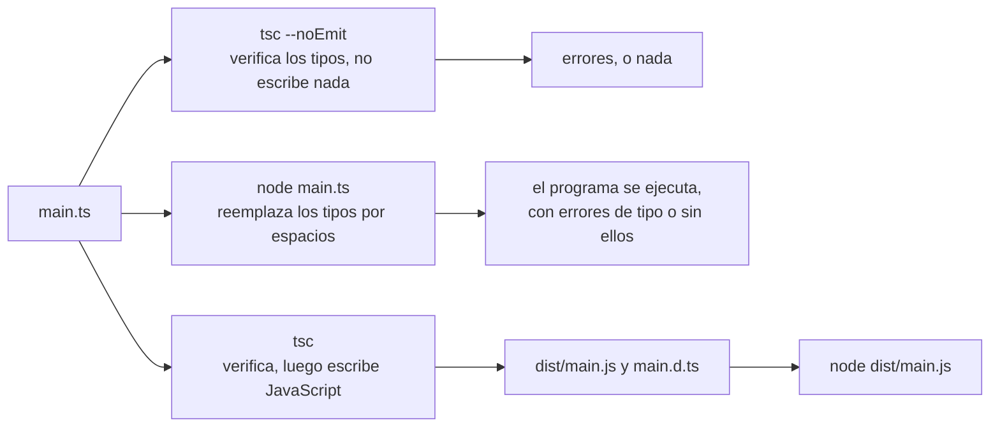

import { Tabs, TabItem } from '@astrojs/starlight/components';

Código: los archivos [`examples/l01_*`](https://github.com/spareilleux/learn/tree/a504f1c0571aa8ed15a8d9ca81616b5f050bf8cc/code/typescript-for-csharp-java/examples) y [`errors/l01_*`](https://github.com/spareilleux/learn/tree/a504f1c0571aa8ed15a8d9ca81616b5f050bf8cc/code/typescript-for-csharp-java/errors), el proyecto [`l01-emit`](https://github.com/spareilleux/learn/tree/a504f1c0571aa8ed15a8d9ca81616b5f050bf8cc/code/typescript-for-csharp-java/l01-emit), el [`tsconfig.json`](https://github.com/spareilleux/learn/blob/a504f1c0571aa8ed15a8d9ca81616b5f050bf8cc/code/typescript-for-csharp-java/tsconfig.json) del curso, y los equivalentes en C# y Java en [`compare_fail/l01_types.cs`](https://github.com/spareilleux/learn/blob/a504f1c0571aa8ed15a8d9ca81616b5f050bf8cc/code/typescript-for-csharp-java/compare_fail/l01_types.cs) y [`compare_fail/L01Types.java`](https://github.com/spareilleux/learn/blob/a504f1c0571aa8ed15a8d9ca81616b5f050bf8cc/code/typescript-for-csharp-java/compare_fail/L01Types.java).

## Tipos que desaparecen

En C# y Java, el compilador y el runtime están de acuerdo sobre los tipos. `csc` rechaza un programa cuyos tipos no son correctos, y los tipos que verificó siguen ahí en el IL, donde el CLR comprueba los casts y `typeof(T)` devuelve un tipo real. [TypeScript](https://www.typescriptlang.org/) funciona de otra manera: es JavaScript con anotaciones de tipo, el compilador las verifica, y nada de ellas llega al programa que se ejecuta.

| | C# | Java | TypeScript |
|---|---|---|---|
| Compilador | `csc`, a través de `dotnet build` | `javac` | `tsc` |
| Lo que produce | IL, con los tipos | bytecode, con la mayoría de los tipos | JavaScript, sin los tipos, o nada en absoluto |
| Un error de tipo | ningún ensamblado | ningún archivo de clase | un mensaje; el JavaScript se escribe igualmente, y Node.js ejecuta el archivo `.ts` igualmente |
| Tipos en tiempo de ejecución | todos, genéricos incluidos | las clases, no los argumentos genéricos | ninguno |
| Un cast al tipo equivocado | `InvalidCastException` | `ClassCastException` | nada: `as` no comprueba nada ([lección 3](../03-unions-and-narrowing/)) |

Así que un proyecto TypeScript tiene dos pasos separados donde un proyecto .NET tiene uno: *verificar* los tipos, que hace `tsc`, y *ejecutar* el código, que hace un motor JavaScript después de que se hayan eliminado los tipos, ya sea el propio `tsc` o, desde Node.js 23.6, Node.js.



Nada obliga a seguir el primer camino antes que los otros. Es la diferencia más importante con C#, y esta lección la muestra sobre salidas reales antes que nada.

## TypeScript 5, 6 y 7

El compilador cambió más en el último año que en los diez anteriores:

| Versión | Publicada | Qué cambió |
|---|---|---|
| [5.9](https://devblogs.microsoft.com/typescript/announcing-typescript-5-9/) | agosto de 2025 | la última versión de la línea 5.x, el compilador escrito en TypeScript |
| [6.0](https://devblogs.microsoft.com/typescript/announcing-typescript-6-0/) | marzo de 2026 | el último compilador escrito en TypeScript: nuevos valores por defecto (`strict` activado, `module` `esnext`, `types` vacío) y opciones antiguas marcadas como obsoletas |
| [7.0](https://devblogs.microsoft.com/typescript/announcing-typescript-7-0/) | julio de 2026 | el compilador [portado a Go](https://github.com/microsoft/typescript-go), un ejecutable nativo, con los valores por defecto de 6.0 y las opciones obsoletas eliminadas |

TypeScript 7 está hecho para informar de los mismos errores que TypeScript 6.0 sobre el mismo código, y su anuncio mide builds completas de 8 a 12 veces más rápidas. En mi máquina, verificar el proyecto de aplicación de la biblioteca de componentes de GA tardó 14.7 segundos con TypeScript 5.9.3 y 1.9 segundos con 7.0.2. Lo que 7.0 aún no tiene es una API programática: las herramientas que cargan el compilador como biblioteca, como typescript-eslint o las herramientas de lenguaje de Astro, Vue y Svelte, siguen necesitando TypeScript 6, que el equipo publica como `@typescript/typescript6` con un comando `tsc6`, para instalar junto a 7. Este curso usa **TypeScript 7.0.2**, la última versión a 14 de septiembre de 2026.

## Instalar el compilador

TypeScript es un paquete npm, instalado en cada proyecto como dependencia de desarrollo, como una [herramienta local de .NET](https://learn.microsoft.com/dotnet/core/tools/local-tools-how-to-use) fijada en un manifiesto. No hay instalación global que mantener sincronizada: la versión de `package-lock.json` es la versión que obtiene todo el mundo.

<Tabs syncKey="os">
<TabItem label="Windows">

```powershell
New-Item -ItemType Directory typescript-course | Set-Location
npm init -y
npm install --save-dev --save-exact typescript@7.0.2 @types/node@24.13.4
npx tsc --version
Get-ChildItem node_modules\@typescript -Name
```

```text
Version 7.0.2
typescript-win32-x64
```

</TabItem>
<TabItem label="Linux / WSL">

```bash
mkdir typescript-course && cd typescript-course
npm init -y
npm install --save-dev --save-exact typescript@7.0.2 @types/node@24.13.4
npx tsc --version
ls node_modules/@typescript
```

```text
Version 7.0.2
typescript-linux-x64
```

</TabItem>
<TabItem label="macOS">

```bash
mkdir typescript-course && cd typescript-course
npm init -y
npm install --save-dev --save-exact typescript@7.0.2 @types/node@24.13.4
npx tsc --version
ls node_modules/@typescript
```

```text
Version 7.0.2
typescript-darwin-arm64
```

</TabItem>
</Tabs>

La última línea difiere, y es la parte nueva. El paquete `typescript` declara un paquete por plataforma como dependencias opcionales, y npm instala solo el que corresponde a la máquina: el ejecutable Go para Windows x64, Linux x64 o macOS en Apple silicon. La CI del curso imprime esa línea en sus tres runners. `@types/node` contiene las declaraciones de tipos de la API de Node.js, `process`, `node:fs` y el resto, versionadas como Node.js 24; `--save-exact` escribe `7.0.2` en lugar de `^7.0.2` en `package.json` (la [lección 1 de JavaScript](../../javascript-for-csharp-java/01-node-npm-modules/#npm-y-packagejson) explica la diferencia).

`npx tsc` ejecuta el compilador desde `node_modules/.bin`; también lo hace `"typecheck": "tsc"` en los `scripts` de `package.json`, que es como lo ejecuta el [`package.json`](https://github.com/spareilleux/learn/blob/a504f1c0571aa8ed15a8d9ca81616b5f050bf8cc/code/typescript-for-csharp-java/package.json) del curso.

## tsconfig.json

Un `tsconfig.json` es para `tsc` lo que un `.csproj` es para `dotnet build`: los archivos del proyecto y las opciones del compilador. `npx tsc --init` escribe uno comentado:

```text
> npx tsc --init

Created a new tsconfig.json

You can learn more at https://aka.ms/tsconfig
```

```jsonc
{
  // Visit https://aka.ms/tsconfig to read more about this file
  "compilerOptions": {
    // File Layout
    // "rootDir": "./src",
    // "outDir": "./dist",

    // Environment Settings
    // See also https://aka.ms/tsconfig/module
    "module": "nodenext",
    "target": "esnext",
    "types": [],
    // For nodejs:
    // "lib": ["esnext"],
    // "types": ["node"],
    // and npm install -D @types/node

    // Other Outputs
    "sourceMap": true,
    "declaration": true,
    "declarationMap": true,

    // Stricter Typechecking Options
    "noUncheckedIndexedAccess": true,
    "exactOptionalPropertyTypes": true,

    // Style Options
    // "noImplicitReturns": true,
    // "noImplicitOverride": true,
    // "noUnusedLocals": true,
    // "noUnusedParameters": true,
    // "noFallthroughCasesInSwitch": true,
    // "noPropertyAccessFromIndexSignature": true,

    // Recommended Options
    "strict": true,
    "jsx": "react-jsx",
    "verbatimModuleSyntax": true,
    "isolatedModules": true,
    "noUncheckedSideEffectImports": true,
    "moduleDetection": "force",
    "skipLibCheck": true,
  }
}
```

Es un punto de partida para una biblioteca publicada en npm, con archivos de declaración y source maps. El curso ejecuta sus archivos con Node.js y solo le pide a `tsc` que los verifique, así que su [`tsconfig.json`](https://github.com/spareilleux/learn/blob/a504f1c0571aa8ed15a8d9ca81616b5f050bf8cc/code/typescript-for-csharp-java/tsconfig.json) sigue la configuración que [Node.js recomienda](https://nodejs.org/docs/latest-v24.x/api/typescript.html#type-stripping) para la eliminación de tipos (*type stripping*):

```jsonc
{
  // Las opciones del compilador del curso: Node.js 24 ejecuta él mismo los archivos .ts, tsc solo los verifica
  "compilerOptions": {
    "noEmit": true,
    "target": "esnext",
    "lib": ["esnext"],
    "types": ["node"],
    "module": "nodenext",
    "rewriteRelativeImportExtensions": true,
    "erasableSyntaxOnly": true,
    "verbatimModuleSyntax": true,
    "strict": true,
    "skipLibCheck": true
  },
  "include": ["examples", "solutions"]
}
```

| Opción | Qué hace | Lo más parecido en .NET |
|---|---|---|
| [`noEmit`](https://www.typescriptlang.org/tsconfig/#noEmit) | solo verificar, no escribir JavaScript | una build que se detiene tras los analizadores |
| [`target`](https://www.typescriptlang.org/tsconfig/#target) | la versión de JavaScript de la salida; `esnext` conserva la sintaxis tal como está escrita | — |
| [`lib`](https://www.typescriptlang.org/tsconfig/#lib) | las API integradas que existen, aquí solo ECMAScript, sin el DOM del navegador | la biblioteca de clases base del framework de destino |
| [`types`](https://www.typescriptlang.org/tsconfig/#types) | las declaraciones globales que cargar desde los paquetes `@types`; vacío por defecto desde 6.0 | referencias de paquete que añaden global usings |
| [`module`](https://www.typescriptlang.org/tsconfig/#module) `nodenext` | resolver y verificar los imports exactamente como lo hace Node.js, `"type"` de `package.json` incluido | — |
| [`rewriteRelativeImportExtensions`](https://www.typescriptlang.org/tsconfig/#rewriteRelativeImportExtensions) | permitir `import './money.ts'`, y escribir `./money.js` en el código emitido | — |
| [`erasableSyntaxOnly`](https://www.typescriptlang.org/tsconfig/#erasableSyntaxOnly) | rechazar la sintaxis que Node.js no puede eliminar (más abajo) | — |
| [`verbatimModuleSyntax`](https://www.typescriptlang.org/tsconfig/#verbatimModuleSyntax) | exigir `import type` para los tipos, de modo que eliminar los tipos nunca cambie un import | — |
| [`strict`](https://www.typescriptlang.org/tsconfig/#strict) | una familia de comprobaciones, entre ellas `strictNullChecks`; activado por defecto desde 6.0 | `<Nullable>enable</Nullable>`, y más |
| [`skipLibCheck`](https://www.typescriptlang.org/tsconfig/#skipLibCheck) | no verificar los archivos `.d.ts` de los paquetes | — |

`strict` se escribe explícitamente aunque sea el valor por defecto: el código copiado a un proyecto que aún define `"strict": false` debería fallar de forma visible en lugar de perder sus comprobaciones en silencio. La [lección 2](../02-structural-typing/) abre la familia.

## Un error de tipo no detiene nada

Un pedido procedente de un archivo CSV, donde cada precio llega como texto:

```ts
// errors/l01_order.ts
interface Line {
  product: string;
  price: number;
  quantity: number;
}

function withTax(line: Line): number {
  return line.price + line.price * 0.15;
}

// Los precios vienen de un archivo CSV, donde todo es texto
const lines: Line[] = [
  { product: 'capo', price: '9.99', quantity: 2 },
  { product: 'strings', price: 12.5, quantity: 1 },
];
for (const line of lines) {
  console.log(line.product, withTax(line) * line.quantity);
}
```

`tsc` ve el problema:

```text
> npx tsc -p out/tsconfig.l01_order.json --pretty
errors/l01_order.ts:14:22 - error TS2322: Type 'string' is not assignable to type 'number'.

14   { product: 'capo', price: '9.99', quantity: 2 },
                        ~~~~~

  errors/l01_order.ts:4:3 - The expected type comes from property 'price' which is declared here on type 'Line'
    4   price: number;
        ~~~~~


Found 1 error in errors/l01_order.ts:14
```

La misma línea en C#, donde `Line` es un record con un precio `decimal`, y en Java:

```text
> dotnet run l01_types.cs
compare_fail/l01_types.cs(4,22): error CS1503: Argument 2: cannot convert from 'string' to 'decimal'

The build failed. Fix the build errors and run again.
```

```text
> javac L01Types.java
L01Types.java:6: error: incompatible types: String cannot be converted to double
        var lines = new Line[] { new Line("capo", "9.99", 2), new Line("strings", 12.5, 1) };
                                                  ^
Note: Some messages have been simplified; recompile with -Xdiags:verbose to get full output
1 error
```

Hasta aquí los tres lenguajes coinciden. Ahora ejecuta el archivo:

```text
> node errors/l01_order.ts
capo NaN
strings 14.375
```

Node.js lo ejecutó, y el programa imprimió `NaN` para el capo sin ninguna excepción. `line.price` contiene la cadena `'9.99'`, así que `line.price + line.price * 0.15` concatena `'9.99'` y `1.4985` en `'9.991.4985'`, y multiplicar esa cadena por la cantidad da `NaN` (la [lección 2 de JavaScript](../../javascript-for-csharp-java/02-values-and-types/#conversiones----análisis-de-texto-y-valores-truthy) explica los dos significados de `+`). La anotación de tipo `price: number` era una promesa hecha a `tsc`, y Node.js nunca la lee.

En una solución .NET, un error de tipo significa que no hay programa que ejecutar. En un proyecto TypeScript, significa que hay un mensaje, y el proyecto decide qué detiene ese mensaje: un script `typecheck` en CI, un hook de pre-commit, el editor. Un proyecto que se construye con una herramienta que solo elimina los tipos, como hace Vite, puede publicar código que `tsc` rechaza, y la última sección de esta lección encuentra código así en GA.

### tsc escribe JavaScript incluso cuando informa de errores

Sin `noEmit`, `tsc` también escribe JavaScript. El proyecto [`l01-emit`](https://github.com/spareilleux/learn/tree/a504f1c0571aa8ed15a8d9ca81616b5f050bf8cc/code/typescript-for-csharp-java/l01-emit) extiende las opciones del curso y escribe en `dist`:

```ts
// l01-emit/src/money.ts
export type Currency = 'CAD' | 'EUR';

export interface Money {
  readonly cents: number;
  readonly currency: Currency;
}

export function add(a: Money, b: Money): Money {
  if (a.currency !== b.currency) throw new Error(`${a.currency} + ${b.currency}`);
  return { cents: a.cents + b.cents, currency: a.currency };
}

export function formatMoney(money: Money): string {
  return `${(money.cents / 100).toFixed(2)} ${money.currency}`;
}
```

```ts
// l01-emit/src/main.ts
import { add, formatMoney, type Money } from './money.ts';

const capo: Money = { cents: 999, currency: 'CAD' };
const strings = { cents: 1250, currency: 'CAD' } satisfies Money;
const shipping: Money = { cents: '500', currency: 'CAD' }; // un error de tipo: tsc lo informa, y escribe los archivos igualmente

console.log(formatMoney(add(add(capo, strings), shipping)));
```

```text
> npx tsc
src/main.ts(6,27): error TS2322: Type 'string' is not assignable to type 'number'.
> ls dist
dist/main.d.ts
dist/main.js
dist/money.d.ts
dist/money.js
```

`tsc` terminó con el código 2, que significa «errores, y los archivos se escribieron igualmente», y `dist/main.js` se ejecuta:

```js
// l01-emit/src/main.ts
import { add, formatMoney } from './money.js';
const capo = { cents: 999, currency: 'CAD' };
const strings = { cents: 1250, currency: 'CAD' };
const shipping = { cents: '500', currency: 'CAD' }; // un error de tipo: tsc lo informa, y escribe los archivos igualmente
console.log(formatMoney(add(add(capo, strings), shipping)));
```

```text
> node dist/main.js
22495.00 CAD
```

Los tipos han desaparecido, el `import` perdió `type Money` y ahora nombra `./money.js`, y el coste de envío `'500'` se concatenó a la suma: 2,249 céntimos seguidos del texto `500` dan `2249500` céntimos. La opción [`noEmitOnError`](https://www.typescriptlang.org/tsconfig/#noEmitOnError) hace que `tsc` no escriba nada cuando encuentra un error (ejercicio 3). `dist/money.d.ts` conserva lo que el JavaScript perdió, los tipos de lo que exporta el módulo, para los proyectos que lo importan; cumple el papel de los metadatos de un ensamblado .NET:

```ts
export type Currency = 'CAD' | 'EUR';
export interface Money {
    readonly cents: number;
    readonly currency: Currency;
}
export declare function add(a: Money, b: Money): Money;
export declare function formatMoney(money: Money): string;
```

## Leer un diagnóstico

Un mensaje de `tsc` indica el archivo, la línea y la columna, la gravedad, un código y un texto, y después, con `--pretty`, la propia línea con `~~~` bajo el problema. La parte sangrada es información relacionada: `The expected type comes from property 'price'` señala la declaración que fijó la expectativa, donde C# solo diría lo que no pudo convertir.

`--pretty` es el valor por defecto en una terminal, y `--pretty false` imprime una línea por error, en el formato `file(line,col): error CODE: text` de MSBuild y `csc`, que leen los editores y las anotaciones de CI:

```text
> npx tsc --pretty false
src/main.ts(6,27): error TS2322: Type 'string' is not assignable to type 'number'.
```

Los códigos se agrupan por número, de forma aproximada, en el [catálogo de mensajes](https://github.com/microsoft/TypeScript/blob/v6.0.3/src/compiler/diagnosticMessages.json) del compilador: los 1000 son sobre todo sintaxis, los 2000 verificación de tipos, los 5000 opciones y configuración, los 6000 los textos de la línea de comandos, los 7000 el `any` implícito, y los 18000 comprobaciones más recientes. `TS2322`, «Type … is not assignable to type …», es el que más te encontrarás.

Un error de configuración sorprende a todo el que escribe `tsc file.ts`, como escribiría `javac File.java`:

```text
> npx tsc errors/l01_order.ts
error TS5112: tsconfig.json is present but will not be loaded if files are specified on commandline. Use '--ignoreConfig' to skip this error.
```

Desde TypeScript 6.0, un nombre de archivo en la línea de comandos en una carpeta que tiene un `tsconfig.json` es un error, porque el archivo se habría verificado con las opciones por defecto en lugar de las del proyecto. `npx tsc` verifica el proyecto; `npx tsc --ignoreConfig file.ts` verifica un archivo con los valores por defecto. El `check.sh` del curso verifica cada fragmento de error por separado dándole un `tsconfig.json` de dos líneas que extiende el del curso, que es el `-p out/tsconfig.l01_order.json` de arriba.

:::note[Salidas en este curso]
Las salidas son las de Node.js 24.21.0, TypeScript 7.0.2, .NET 10 y Java 25. Las rutas se muestran relativas a la carpeta del curso, se eliminan los marcos de pila y los colores, y un identificador de proceso se muestra como `PID`; [`normalize.mjs`](https://github.com/spareilleux/learn/blob/a504f1c0571aa8ed15a8d9ca81616b5f050bf8cc/code/typescript-for-csharp-java/normalize.mjs) hace los mismos cambios antes de que la CI compare las salidas en Windows, Linux y macOS, donde son idénticas.
:::

## Ejecutar TypeScript con Node.js

Node.js 24 ejecuta un archivo `.ts` directamente. No lo compila: reemplaza las anotaciones de tipo por espacios, una funcionalidad llamada [eliminación de tipos](https://nodejs.org/docs/latest-v24.x/api/typescript.html#type-stripping), activada por defecto desde Node.js 23.6 y marcada como estable en 24.12. La función que lo hace es pública, como [`module.stripTypeScriptTypes`](https://nodejs.org/docs/latest-v24.x/api/module.html#modulestriptypescripttypescode-options):

```ts
// examples/l01_strip.ts
import { stripTypeScriptTypes } from 'node:module';

// Lo que ejecuta Node.js: el mismo texto, con los tipos reemplazados por espacios
const source = `interface Line {
  price: number;
  quantity: number;
}
export function total(lines: readonly Line[]): number {
  let sum: number = 0;
  for (const line of lines) sum += line.price * line.quantity;
  return sum;
}
const empty = [] as Line[];`;
console.log(stripTypeScriptTypes(source));
```

```text
                
                
                   
 
export function total(lines                 )         {
  let sum         = 0;
  for (const line of lines) sum += line.price * line.quantity;
  return sum;
}
const empty = []          ;
(node:PID) ExperimentalWarning: stripTypeScriptTypes is an experimental feature and might change at any time
(Use `node --trace-warnings ...` to show where the warning was created)
```

La interfaz se convirtió en líneas en blanco y cada anotación en tantos espacios como caracteres tenía, así que cada carácter restante conserva su línea y su columna. Por eso un error en un archivo `.ts` apunta al lugar correcto sin source map. La advertencia viene de la función, todavía marcada como *release candidate* en la documentación; ejecutar un archivo `.ts` no imprime ninguna.

Node.js lee un archivo `.ts` como lee un archivo `.js`: el `package.json` más cercano decide entre ES module y CommonJS, y `.mts` y `.cts` fuerzan la elección, como `.mjs` y `.cjs`. Node.js ignora `tsconfig.json` por completo y no verifica ningún tipo.

### Lo que Node.js rechaza

La eliminación solo funciona con la sintaxis que desaparece sin dejar un hueco. Algunas funcionalidades de TypeScript generan JavaScript en su lugar, y Node.js las rechaza:

```ts
// errors/l01_not_erasable.ts
class Price {
  constructor(private readonly cents: number) {} // una propiedad de parámetro declara y asigna un campo
  toString() {
    return (this.cents / 100).toFixed(2);
  }
}

namespace Tax {
  export const rate = 0.15;
}

const price = <Price>new Price(999); // la antigua sintaxis de cast
console.log(`${price}`, Tax.rate);
```

```text
> node errors/l01_not_erasable.ts
node:internal/modules/run_main:107
    triggerUncaughtException(
    ^

errors/l01_not_erasable.ts:3
class Price {
  constructor(private readonly cents: number) {} // a parameter property declares and assigns a field
                               ^^^^^^^^^^^^^
  toString() {

SyntaxError [ERR_UNSUPPORTED_TYPESCRIPT_SYNTAX]: TypeScript parameter property is not supported in strip-only mode
{
  code: 'ERR_UNSUPPORTED_TYPESCRIPT_SYNTAX'
}

Node.js v24.21.0
```

Node.js se detiene en la primera. Con `erasableSyntaxOnly`, `tsc` informa de las tres antes de que se ejecute nada:

```text
> npx tsc -p out/tsconfig.l01_not_erasable.json --pretty
errors/l01_not_erasable.ts:3:15 - error TS1294: This syntax is not allowed when 'erasableSyntaxOnly' is enabled.

3   constructor(private readonly cents: number) {} // a parameter property declares and assigns a field
                ~~~~~~~~~~~~~~~~~~~~~~~~~~~~~~

errors/l01_not_erasable.ts:9:11 - error TS1294: This syntax is not allowed when 'erasableSyntaxOnly' is enabled.

9 namespace Tax {
            ~~~

errors/l01_not_erasable.ts:13:15 - error TS1294: This syntax is not allowed when 'erasableSyntaxOnly' is enabled.

13 const price = <Price>new Price(999); // the old cast syntax
                 ~~~~~~~


Found 3 errors in the same file, starting at: errors/l01_not_erasable.ts:3
```

| Rechazado | Lo que genera | Qué escribir en su lugar |
|---|---|---|
| una propiedad de parámetro, `constructor(private readonly cents: number)` | un campo y una asignación | el campo, y la asignación en el constructor |
| un `namespace` que contiene valores | un objeto rellenado por una función | un módulo, uno por archivo |
| un `enum` | un objeto con un mapeo inverso | un objeto con `as const`, y un tipo unión (ejercicio 2) |
| `<Price>value`, la antigua sintaxis de aserción | nada, y Node.js rechaza la sintaxis | `value as Price` |

Un namespace que solo contiene tipos se acepta, ya que desaparece. Los desarrolladores C# recurren primero a `enum`, y es el que hay que desaprender:

```ts
// errors/l01_enum.ts
enum Currency {
  CAD,
  EUR,
}

console.log(Currency.EUR, Currency[1]);
```

```text
> node errors/l01_enum.ts
node:internal/modules/run_main:107
    triggerUncaughtException(
    ^

errors/l01_enum.ts:2
    // errors/l01_enum.ts
  > enum Currency {
      CAD,
      EUR,
  > }

SyntaxError [ERR_UNSUPPORTED_TYPESCRIPT_SYNTAX]: TypeScript enum is not supported in strip-only mode
{
  code: 'ERR_UNSUPPORTED_TYPESCRIPT_SYNTAX'
}

Node.js v24.21.0
```

Dos herramientas lo ejecutan igualmente. El flag [`--experimental-transform-types`](https://nodejs.org/docs/latest-v24.x/api/cli.html#--experimental-transform-types) de Node.js genera el JavaScript, con una advertencia, y [tsx](https://tsx.hirok.io/), un paquete construido sobre esbuild, ejecuta cualquier archivo TypeScript sin verificarlo tampoco:

```text
> node --experimental-transform-types errors/l01_enum.ts
(node:PID) ExperimentalWarning: Transform Types is an experimental feature and might change at any time
(Use `node --trace-warnings ...` to show where the warning was created)
1 EUR
> npx tsx errors/l01_enum.ts
1 EUR
```

Ambos imprimen `1 EUR`: `Currency.EUR` es `1`, y `Currency[1]` es el mapeo inverso de vuelta al nombre. El curso se limita a la sintaxis eliminable, que se ejecuta con `node` a secas, no necesita ningún paquete adicional, y se lee igual antes y después de la eliminación.

### Imports: la extensión, y type

Node.js necesita el nombre real del archivo en un import, `.ts` incluido (la [lección 1 de JavaScript](../../javascript-for-csharp-java/01-node-npm-modules/#mezclarlos) mostró la misma regla para `.js`). Un import escrito como lo escriben muchos proyectos TypeScript:

```ts
// errors/l01_imports.ts
import { formatMoney, Money } from '../examples/l01_money';

const price: Money = { cents: 999, currency: 'CAD' };
console.log(formatMoney(price));
```

```text
> npx tsc -p out/tsconfig.l01_imports.json --pretty
errors/l01_imports.ts:2:36 - error TS2835: Relative import paths need explicit file extensions in ECMAScript imports when '--moduleResolution' is 'node16' or 'nodenext'. Did you mean '../examples/l01_money.js'?

2 import { formatMoney, Money } from '../examples/l01_money';
                                     ~~~~~~~~~~~~~~~~~~~~~~~


Found 1 error in errors/l01_imports.ts:2
> node errors/l01_imports.ts
node:internal/modules/esm/resolve:272
    throw new ERR_MODULE_NOT_FOUND(
          ^

Error [ERR_MODULE_NOT_FOUND]: Cannot find module 'examples/l01_money' imported from errors/l01_imports.ts
{
  code: 'ERR_MODULE_NOT_FOUND',
  url: 'examples/l01_money'
}

Node.js v24.21.0
```

Con `module` en `nodenext`, `tsc` informa del error que lanzará Node.js, y sugiere `.js`, la extensión que importaría un proyecto compilado a JavaScript; para la eliminación de tipos de Node.js, la extensión correcta es `.ts`. Con la extensión, aparece un segundo error:

```ts
// errors/l01_type_import.ts
import { formatMoney, Money } from '../examples/l01_money.ts';

const price: Money = { cents: 999, currency: 'CAD' };
console.log(formatMoney(price));
```

```text
> npx tsc -p out/tsconfig.l01_type_import.json --pretty
errors/l01_type_import.ts:2:23 - error TS1484: 'Money' is a type and must be imported using a type-only import when 'verbatimModuleSyntax' is enabled.

2 import { formatMoney, Money } from '../examples/l01_money.ts';
                        ~~~~~


Found 1 error in errors/l01_type_import.ts:2
> node errors/l01_type_import.ts
errors/l01_type_import.ts:2
import { formatMoney, Money } from '../examples/l01_money.ts';
                      ^^^^^
SyntaxError: The requested module '../examples/l01_money.ts' does not provide an export named 'Money'

Node.js v24.21.0
```

La eliminación trabaja archivo por archivo, así que Node.js no puede saber que `Money` es un tipo en el otro archivo: conserva el nombre en el `import`, y el módulo que lo exporta no tiene ningún valor con ese nombre. `import { formatMoney, type Money }` marca el nombre como tipo, y lo elimina junto con las demás anotaciones. `verbatimModuleSyntax` hace que `tsc` exija esa marca. El archivo corregido, [`examples/l01_imports.ts`](https://github.com/spareilleux/learn/blob/a504f1c0571aa8ed15a8d9ca81616b5f050bf8cc/code/typescript-for-csharp-java/examples/l01_imports.ts):

```ts
// examples/l01_imports.ts
import { formatMoney, type Money } from './l01_money.ts';

const price: Money = { cents: 999, currency: 'CAD' };
console.log(formatMoney(price));
```

```text
> node examples/l01_imports.ts
9.99 CAD
```

## En proyectos reales

**GuitarAlchemist/ga** tiene dos frontends React en TypeScript, en el commit [`a826864`](https://github.com/GuitarAlchemist/ga/commit/a826864f3a012cad88e415954bf57eca0ce12aa6). Sus archivos `package.json` piden `typescript` `^5.5.3`, y su script `build` es `vite build` ([`ga-client/package.json`, línea 13](https://github.com/GuitarAlchemist/ga/blob/a826864f3a012cad88e415954bf57eca0ce12aa6/Apps/ga-client/package.json#L13)). [Vite](https://vite.dev/guide/features.html#typescript) elimina los tipos con esbuild y, como dice su documentación, no los verifica; la verificación es un script aparte, `build:with-types`, `tsc -b && vite build`. Cloné el repositorio en una carpeta temporal, instalé las dependencias y ejecuté `tsc -b` con TypeScript 5.9.3:

- [`Apps/ga-client`](https://github.com/GuitarAlchemist/ga/tree/a826864f3a012cad88e415954bf57eca0ce12aa6/Apps/ga-client) informa de 346 errores, 165 de ellos `TS6133` por variables sin usar. Entre el resto, [`ChatInterface.tsx`](https://github.com/GuitarAlchemist/ga/blob/a826864f3a012cad88e415954bf57eca0ce12aa6/Apps/ga-client/src/components/Chat/ChatInterface.tsx#L219) usa `VIRTUALIZATION_THRESHOLD` y `VirtualizedMessageList` en las líneas 69, 219, 254 y 255, y nada los define ni los importa: `TS2304: Cannot find name 'VIRTUALIZATION_THRESHOLD'`. Los nombres faltan desde el primer commit del archivo. La línea 219 está en el JSX del componente, así que renderizar la página `/ai-copilot` debería lanzar un `ReferenceError` (*por verificar* en un navegador).
- [`ReactComponents/ga-react-components`](https://github.com/GuitarAlchemist/ga/tree/a826864f3a012cad88e415954bf57eca0ce12aa6/ReactComponents/ga-react-components) informa de 186 errores. Su archivo de bloqueo ya no corresponde a su `package.json` (`pnpm install --frozen-lockfile` lo rechaza: se añadieron 21 dependencias sin actualizar el archivo de bloqueo), así que instalé sin él, y algunos de esos errores pueden depender de las versiones que obtuve.

Su proyecto de aplicación por sí solo, `tsc -p tsconfig.app.json`, informa de 180 errores en 14.7 segundos con TypeScript 5.9.3, y de 197 en 1.9 segundos con TypeScript 7.0.2. La mayor parte de la diferencia es el nuevo valor por defecto de `types`: un script que usa `process`, `fs` y `__dirname` obtiene `TS2591: Cannot find name 'process'. Do you need to install type definitions for node?`, y `"types": ["node"]` en las opciones de ese proyecto los recupera, como predicen las [notas de versión de 6.0](https://www.typescriptlang.org/docs/handbook/release-notes/typescript-6-0.html).

**Este sitio** tiene un [`tsconfig.json`](https://github.com/spareilleux/learn/blob/8ba378e7ea22a64a57b3e45b45afa4c85afa85a3/tsconfig.json) que extiende el preset `strict` de Astro, y ninguna dependencia `typescript`: Astro elimina los tipos con Vite, y solo el editor lee el archivo. Verificado con `npx -p typescript@7.0.2 tsc --noEmit` en el commit [`8ba378e`](https://github.com/spareilleux/learn/commit/8ba378e7ea22a64a57b3e45b45afa4c85afa85a3), informa de tres errores, y ninguno rompe el sitio: `astro:content` es un módulo que solo existe después de que `astro sync` genere sus declaraciones, el fragmento de error del curso de JavaScript sobre los campos privados lo recoge el patrón `**/*`, y la barra lateral que `astro.config.mjs` importa de `src/streeling-sidebar.json` no corresponde al tipo de Starlight para los elementos de la barra lateral, lo que explica la [lección 3](../03-unions-and-narrowing/). El anuncio de TypeScript 7 dice que las propias herramientas de Astro siguen necesitando TypeScript 6.

## Puntos clave

- Los tipos de TypeScript solo existen para `tsc`: Node.js, Vite y esbuild los eliminan sin leerlos, y nada los comprueba en tiempo de ejecución.
- Un error de tipo no impide que un programa se ejecute, ni que `tsc` escriba JavaScript. Haz de `tsc --noEmit` un paso de tu build y de tu CI, o activa `noEmitOnError`.
- TypeScript 7 es el mismo verificador de tipos que 6.0, portado a Go y varias veces más rápido; las herramientas que necesitan la API del compilador se quedan en 6.0 por ahora.
- Instala TypeScript por proyecto con npm; `tsconfig.json` es el archivo de proyecto, y `tsc file.ts` junto a uno es un error desde 6.0.
- Node.js 24 elimina los tipos de los archivos `.ts`; rechaza `enum`, las propiedades de parámetro, los namespaces con valores y las aserciones `<T>`. `erasableSyntaxOnly` y `verbatimModuleSyntax` hacen que `tsc` los rechace antes.
- Para Node.js, importa `./file.ts` con su extensión, e importa los tipos con `import type`.

## Ejercicios

1. Corrige [`errors/l01_order.ts`](https://github.com/spareilleux/learn/blob/a504f1c0571aa8ed15a8d9ca81616b5f050bf8cc/code/typescript-for-csharp-java/errors/l01_order.ts) para que `tsc` lo acepte e imprima los totales correctos, con las filas del CSV como arrays de cadenas. ¿Dónde debería hacerse la conversión?

<details>
<summary>Solución</summary>

En la frontera, una sola vez: el resto del programa trabaja entonces con un `Line` cuyo `price` es de verdad un número. [`solutions/l01_ex1_order.ts`](https://github.com/spareilleux/learn/blob/a504f1c0571aa8ed15a8d9ca81616b5f050bf8cc/code/typescript-for-csharp-java/solutions/l01_ex1_order.ts):

```ts
// solutions/l01_ex1_order.ts
interface Line {
  product: string;
  price: number;
  quantity: number;
}

function withTax(line: Line): number {
  return line.price + line.price * 0.15;
}

// El CSV da texto: convertirlo una vez, en la frontera, y rechazar lo que no sea un precio
function parsePrice(text: string): number {
  if (!/^\d+(\.\d{1,2})?$/.test(text)) throw new TypeError(`not a price: ${JSON.stringify(text)}`);
  return Number(text);
}

const rows = [
  ['capo', '9.99', '2'],
  ['strings', '12.5', '1'],
] as const;
const lines: Line[] = rows.map(([product, price, quantity]) => ({
  product,
  price: parsePrice(price),
  quantity: Number.parseInt(quantity, 10),
}));
for (const line of lines) {
  console.log(line.product, (withTax(line) * line.quantity).toFixed(2));
}
```

```text
capo 22.98
strings 14.38
```

`as const` convierte cada fila en una tupla de tres cadenas, así que la desestructuración en `map` obtiene `product`, `price` y `quantity` como cadenas, y `tsc` rechazaría `price` en un campo de tipo `number` hasta que pase por `parsePrice`. La [lección 2 de JavaScript](../../javascript-for-csharp-java/02-values-and-types/#conversiones----análisis-de-texto-y-valores-truthy) explica por qué la expresión regular va antes de `Number`. `tsc` verifica que la conversión se hace; no puede verificar que sea correcta.

</details>

2. Reescribe [`errors/l01_not_erasable.ts`](https://github.com/spareilleux/learn/blob/a504f1c0571aa8ed15a8d9ca81616b5f050bf8cc/code/typescript-for-csharp-java/errors/l01_not_erasable.ts) solo con sintaxis eliminable, y añade un `Currency` que habría sido un `enum`, para que `node` lo ejecute sin flag.

<details>
<summary>Solución</summary>

[`solutions/l01_ex2_erasable.ts`](https://github.com/spareilleux/learn/blob/a504f1c0571aa8ed15a8d9ca81616b5f050bf8cc/code/typescript-for-csharp-java/solutions/l01_ex2_erasable.ts):

```ts
// solutions/l01_ex2_erasable.ts
// Un enum se convierte en un objeto marcado as const, y en un tipo unión de sus valores
const Currency = { CAD: 'CAD', EUR: 'EUR' } as const;
type Currency = (typeof Currency)[keyof typeof Currency];

// Una propiedad de parámetro se convierte en un campo y una asignación
class Price {
  readonly #cents: number;
  readonly currency: Currency;
  constructor(cents: number, currency: Currency) {
    this.#cents = cents;
    this.currency = currency;
  }
  toString() {
    return `${(this.#cents / 100).toFixed(2)} ${this.currency}`;
  }
}

// Un namespace se convierte en un módulo, o aquí en un objeto congelado
const Tax = Object.freeze({ rate: 0.15 });

const price = new Price(999, Currency.EUR); // no hace falta aserción: new Price ya tiene el tipo Price
console.log(`${price}`, Tax.rate, Object.values(Currency));
```

```text
9.99 EUR 0.15 [ 'CAD', 'EUR' ]
```

El nombre `Currency` se usa dos veces, una como valor y otra como tipo, lo que TypeScript permite porque los valores y los tipos viven en espacios separados. `(typeof Currency)[keyof typeof Currency]` se lee «el tipo de cualquier propiedad del objeto», aquí `'CAD' | 'EUR'`; la lección 4 explica `keyof` y los tipos indexados. A diferencia del `enum`, el objeto no tiene mapeo inverso y sus valores son las propias cadenas, que es también lo que contiene un payload JSON. El campo privado `#cents` reemplaza a `private`: lo impone el motor, como muestra la [lección 4 de JavaScript](../../javascript-for-csharp-java/04-objects-prototypes-classes/#clases), mientras que `private` solo lo comprueba `tsc`.

</details>

3. Copia la configuración de `l01-emit` con `"noEmitOnError": true`, borra `dist` y ejecuta `tsc`. ¿Qué escribe, y qué código de salida devuelve?

<details>
<summary>Solución</summary>

[`solutions/l01-ex3/tsconfig.json`](https://github.com/spareilleux/learn/blob/a504f1c0571aa8ed15a8d9ca81616b5f050bf8cc/code/typescript-for-csharp-java/solutions/l01-ex3/tsconfig.json) extiende la configuración de `l01-emit`:

```jsonc
{
  // Ejercicio 3: el proyecto de l01-emit, con noEmitOnError
  "extends": "../../l01-emit/tsconfig.json",
  "compilerOptions": {
    "noEmitOnError": true,
    "rootDir": "../../l01-emit/src",
    "outDir": "dist"
  },
  "include": ["../../l01-emit/src"]
}
```

```text
> npx tsc --pretty false
../../l01-emit/src/main.ts(6,27): error TS2322: Type 'string' is not assignable to type 'number'.
> node -e "console.log('dist exists:', require('node:fs').existsSync('dist'))"
dist exists: false
```

El mismo error, ninguna carpeta `dist`, y el código de salida 1 en lugar de 2: 1 significa que los errores impidieron la salida, 2 que la salida se escribió a pesar de los errores. Es el comportamiento de `dotnet build`, y la opción que conviene usar cuando `tsc` produce lo que despliegas. `extends` hereda las opciones de otro archivo; las rutas relativas de una configuración se resuelven desde el archivo que las contiene, por eso `rootDir` e `include` se repiten aquí.

</details>

## Fuentes

- [TypeScript — Announcing TypeScript 7.0](https://devblogs.microsoft.com/typescript/announcing-typescript-7-0/), [notas de versión de TypeScript 6.0](https://www.typescriptlang.org/docs/handbook/release-notes/typescript-6-0.html), [referencia de TSConfig](https://www.typescriptlang.org/tsconfig/), [Modules — Theory](https://www.typescriptlang.org/docs/handbook/modules/theory.html)
- [Node.js — Módulos: TypeScript](https://nodejs.org/docs/latest-v24.x/api/typescript.html), [`module.stripTypeScriptTypes`](https://nodejs.org/docs/latest-v24.x/api/module.html#modulestriptypescripttypescode-options), [`--experimental-transform-types`](https://nodejs.org/docs/latest-v24.x/api/cli.html#--experimental-transform-types)
- [microsoft/typescript-go](https://github.com/microsoft/typescript-go), el port a Go; [tsx](https://tsx.hirok.io/); [Vite — TypeScript](https://vite.dev/guide/features.html#typescript)
- [Microsoft — Herramientas locales de .NET](https://learn.microsoft.com/dotnet/core/tools/local-tools-how-to-use)
