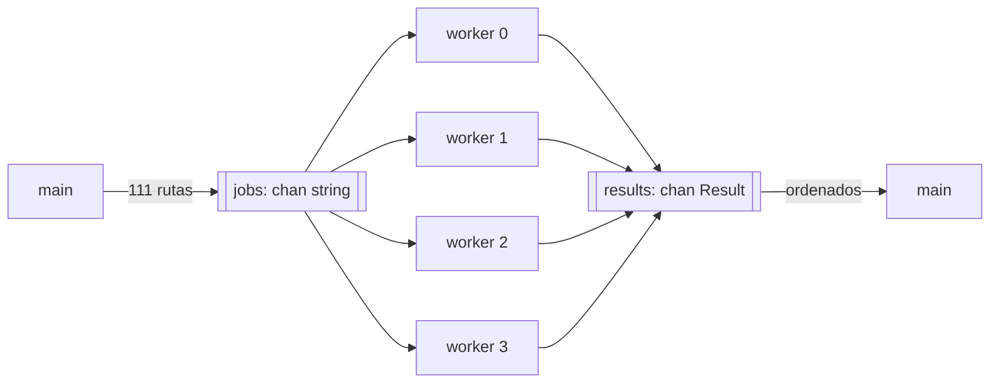

Código: [`examples/l07_spawn.v`](https://github.com/spareilleux/learn/blob/bb5c13f2e8e9b85d3a3613d2df53726465afb4ab/code/v-for-csharp-java/examples/l07_spawn.v), [`examples/l07_channels.v`](https://github.com/spareilleux/learn/blob/bb5c13f2e8e9b85d3a3613d2df53726465afb4ab/code/v-for-csharp-java/examples/l07_channels.v) y [`examples/l07_shared.v`](https://github.com/spareilleux/learn/blob/bb5c13f2e8e9b85d3a3613d2df53726465afb4ab/code/v-for-csharp-java/examples/l07_shared.v) — `v run examples/l07_channels.v` desde `code/v-for-csharp-java`.

## Tres herramientas

| | C# | Java | V |
|---|---|---|---|
| Ejecutar una función de forma concurrente | [`Task.Run`](https://learn.microsoft.com/dotnet/api/system.threading.tasks.task.run), en el thread pool | [`CompletableFuture.supplyAsync`](https://docs.oracle.com/en/java/javase/25/docs/api/java.base/java/util/concurrent/CompletableFuture.html), [hilos virtuales](https://docs.oracle.com/en/java/javase/25/core/virtual-threads.html) | `spawn f()`, un hilo del sistema operativo |
| Esperar un resultado | `await task`, `Task.WhenAll` | `future.join()` | `h.wait()`, `threads.wait()` |
| Pasar mensajes | [`System.Threading.Channels`](https://learn.microsoft.com/dotnet/core/extensions/channels) | [`BlockingQueue`](https://docs.oracle.com/en/java/javase/25/docs/api/java.base/java/util/concurrent/BlockingQueue.html) | `chan T`, `select` |
| Compartir memoria | [`lock`](https://learn.microsoft.com/dotnet/csharp/language-reference/statements/lock), [`ReaderWriterLockSlim`](https://learn.microsoft.com/dotnet/api/system.threading.readerwriterlockslim) | `synchronized`, `ReentrantReadWriteLock` | `shared`, `lock`, `rlock` |
| Olvidar el lock | compila | compila | rechazado para `shared`, compila para una referencia `mut` |

Fuente: [Concurrency](https://docs.vlang.io/concurrency.html).

Los ejemplos calculan, para cada uno de los 111 proyectos de ga, cuántos proyectos referencia directamente o a través de otros proyectos. [`reachable`](https://github.com/spareilleux/learn/blob/bb5c13f2e8e9b85d3a3613d2df53726465afb4ab/code/v-for-csharp-java/examples/l07_spawn.v#L20-L34) recorre las referencias con una pila y un conjunto, así que un proyecto referenciado dos veces, como `GA.Domain.Core` en el árbol de la lección 6, cuenta una sola vez:

```v
fn (g Graph) reachable(from string) int {
	mut seen := map[string]bool{}
	mut stack := [from]
	for stack.len > 0 {
		p := stack.pop()
		for to in g.refs[p] {
			if to !in seen {
				seen[to] = true
				stack << to
			}
		}
	}
	return seen.len
}
```

:::note[Salidas que dependen del tiempo]
Un programa concurrente no siempre imprime lo mismo. Los ejemplos imprimen lo que depende de la máquina o del tiempo en líneas que empiezan por `# `: el [`check.sh`](https://github.com/spareilleux/learn/blob/f6c34f637df430c031060cb89fb903e7c15be266/code/v-for-csharp-java/check.sh#L35-L45) del curso imprime esas líneas sin compararlas, y compara las demás en los tres sistemas operativos. Los valores `# ` citados más abajo vienen de mi máquina (24 CPU lógicas) o de los runners de la CI.
:::

## `spawn` y `wait`

`spawn` ejecuta una llamada en un nuevo hilo (*thread*), y devuelve un handle cuyo `wait()` devuelve el resultado de la llamada ([`l07_spawn.v`, líneas 46-72](https://github.com/spareilleux/learn/blob/bb5c13f2e8e9b85d3a3613d2df53726465afb4ab/code/v-for-csharp-java/examples/l07_spawn.v#L46-L72)):

```v
// Un hilo, un resultado
h := spawn g.reachable('Apps/GaCli/GaCli.fsproj')
println('GaCli: ${h.wait()} projects')

// Un hilo por proyecto: wait() devuelve los resultados en el orden de los hilos
mut sw := time.new_stopwatch()
mut threads := []thread int{}
for p in projects {
	threads << spawn g.reachable(p)
}
counts := threads.wait()
parallel := sw.elapsed()
```

```text
111 projects, 87 with references
GaCli: 7 projects
111 results, the most: GA.Business.Core.Tests with 23
same results: true
```

`thread int` es el tipo de un handle cuya función devuelve un `int`, como `Task<int>`. `wait()` sobre un array de handles espera a todos y devuelve los resultados en el orden del array, como `await Task.WhenAll(tasks)`: `counts[i]` corresponde a `projects[i]`, sea cual sea el orden en que terminen los hilos. La función en sí es ordinaria: nada parecido a `async` la marca.

`GA.Business.Core.Tests` referencia 23 de los 111 proyectos, directamente o no. Sin embargo, la versión paralela es más lenta:

```text
# 111 threads: 5212 us, one thread: 439 us
```

En los runners de la CI, 5709 µs frente a 776 µs en Linux, 11707 µs frente a 939 µs en Windows. `spawn` crea un hilo del sistema operativo cada vez, y 111 hilos cuestan más que 111 recorridos de un grafo pequeño. `Task.Run` habría encolado las 111 llamadas en el thread pool de .NET, y los hilos virtuales de Java son baratos de crear. Con `spawn`, crea unos pocos hilos para trabajo que dura, como hace la sección siguiente.

Un hilo al que nadie espera puede no terminar: `main` no lo espera antes de salir. En un programa pequeño que hace spawn de `report('GaCli')` y luego imprime `main: done`, la línea del hilo apareció una vez de cada cinco ejecuciones en mi máquina.

Una función que devuelve un result da un `thread !int`; `wait()` sobre el array devuelve entonces `![]int`, y el primer error acaba en `or`:

```v
mut checks := []thread !int{}
for p in ['GaCli/GaCli.fsproj', 'Apps/GaCli/GaCli.fsproj'] {
	checks << spawn find(g, p)
}
found := checks.wait() or {
	println('wait: ${err.msg()}')
	[]int{}
}
println('found: ${found}')
```

```text
wait: no references from GaCli/GaCli.fsproj
found: []
```

El error de un hilo descarta los resultados de los demás, igual que `await Task.WhenAll` lanza una excepción cuando una tarea falla.

### `go` es `spawn`

La documentación dice que `go foo()` ejecuta `foo()` «en un hilo ligero gestionado por el runtime de V». En V 0.5.2, el parser convierte `go` en `spawn` salvo que el programa se compile con `-use-coroutines` ([`parser.v`, líneas 1391-1405](https://github.com/vlang/v/blob/7647ce1c6fad63b5578bc07883139906de74b2f8/vlib/v/parser/parser.v#L1391-L1405)), una opción experimental. Sin ella, `go` también crea un hilo del sistema operativo.

## Canales

Un `chan T` pasa valores de un hilo a otro, como un `Channel<T>` en .NET o una `BlockingQueue<T>` en Java. `chan string{cap: 111}` contiene hasta 111 valores; `chan string{}` no contiene ninguno, y un envío espera a un receptor.

[`l07_channels.v`](https://github.com/spareilleux/learn/blob/bb5c13f2e8e9b85d3a3613d2df53726465afb4ab/code/v-for-csharp-java/examples/l07_channels.v#L40-L83) arranca cuatro workers. `main` envía las rutas de los proyectos por `jobs` y lo cierra; cada worker recibe hasta que el canal (*channel*) está cerrado y vacío, y envía un `Result` por `results`:



```v
fn worker(id int, g Graph, jobs chan string, results chan Result) {
	for {
		project := <-jobs or { break }
		results <- Result{id, project, g.reachable(project)}
	}
}
```

```v
jobs := chan string{cap: projects.len}
results := chan Result{cap: projects.len}
mut workers := []thread{}
for id in 0 .. 4 {
	workers << spawn worker(id, g, jobs, results)
}
for p in projects {
	jobs <- p
}
jobs.close()
workers.wait()
results.close()
```

`<-jobs or { break }` es la recepción de un canal cerrado y vacío: se ejecuta el bloque `or`, como cuando termina `await foreach (var p in reader.ReadAllAsync())` en C#. Un canal no necesita `mut` para pasarse a un hilo.

Los resultados llegan sin un orden particular, y cada worker procesa una parte distinta de los trabajos:

```text
# results per worker: [32, 24, 28, 27]
111 results
# same order as the jobs: false
```

Así que `main` los ordena, por número y luego por ruta, antes de imprimir:

```text
23 GA.Business.Core.Tests.csproj
21 AllProjects.AppHost.csproj
21 VectorSearchBenchmark.csproj
```

Esta salida es la misma en cada ejecución y en cada sistema operativo. Con cuatro workers o con uno, lo que lo garantiza es ordenar después de recoger.

### `select`

`select` espera a la primera de varias operaciones sobre canales, con un timeout opcional, como el `select` de Go. .NET y Java no tienen un equivalente directo; lo más parecido es `Task.WhenAny` sobre varias lecturas.

```v
slow := chan int{}
fast := chan int{}
spawn fn (c chan int) {
	time.sleep(500 * time.millisecond)
	c <- 1
}(slow)
spawn fn (c chan int) {
	c <- 2
}(fast)
select {
	n := <-slow {
		println('# slow ${n}')
	}
	n := <-fast {
		println('select: fast ${n}')
	}
	2 * time.second {
		println('select: timeout')
	}
}
```

```text
select: fast 2
```

Las funciones anónimas reciben los canales como parámetros: una closure solo ve las variables enumeradas en `[…]`, como muestran los snippets rechazados más abajo.

### Un canal cerrado

La documentación dice que enviar a un canal cerrado provoca «un panic en tiempo de ejecución». V 0.5.2 no hace panic:

```v
closed := chan string{cap: 2}
closed <- 'GaApi'
closed.close()
closed <- 'GaCli'
closed <- 'GaCli' or { println('send with or: ${err.msg()}') }
println('buffered after close: ${<-closed}')
empty := <-closed
println('receive without or: "${empty}"')
println('receive with or: ${<-closed or { 'closed' }}')
```

```text
send with or: channel closed
buffered after close: GaApi
receive without or: ""
receive with or: closed
```

El primer envío después de `close()` pierde `GaCli` sin decir nada: el C generado llama a `try_push_priv` e ignora su resultado ([`cgen.v`, líneas 2498-2501](https://github.com/vlang/v/blob/7647ce1c6fad63b5578bc07883139906de74b2f8/vlib/v/gen/c/cgen.v#L2498-L2501); [`channels.c.v`, líneas 203-206](https://github.com/vlang/v/blob/7647ce1c6fad63b5578bc07883139906de74b2f8/vlib/sync/channels.c.v#L203-L206) devuelve `.closed`). El valor que sigue en el búfer se recibe, y luego una recepción sin `or` devuelve el valor cero, una cadena vacía. Con `or`, ambas operaciones informan del cierre. En .NET, `TryWrite` devuelve `false` después de `Complete()`, y `WriteAsync` lanza una `ChannelClosedException`, lo que comprobé con .NET 11. Usa `or` en las operaciones de un canal que pueda estar cerrado.

## `shared`, `lock` y `rlock`

Una variable declarada `shared` lleva su propio lock de lectura-escritura. El compilador rechaza cualquier acceso fuera de `lock` (lectura y escritura) o `rlock` (solo lectura). [`count_packages`](https://github.com/spareilleux/learn/blob/bb5c13f2e8e9b85d3a3613d2df53726465afb4ab/code/v-for-csharp-java/examples/l07_shared.v#L6-L18) cuenta las referencias a paquetes de una porción de `package_refs.csv` en un map compartido por cuatro hilos:

```v
struct Usage {
mut:
	by_package map[string]int
}

fn count_packages(shared usage Usage, lines []string) {
	for line in lines {
		package := line.split(',')[1]
		lock usage {
			usage.by_package[package]++
		}
	}
}
```

```v
shared usage := Usage{}
mut threads := []thread{}
chunk := (lines.len + 3) / 4
for start := 0; start < lines.len; start += chunk {
	end := if start + chunk < lines.len { start + chunk } else { lines.len }
	threads << spawn count_packages(shared usage, lines[start..end])
}
threads.wait()
rlock usage {
	println('${usage.by_package.len} packages, ${usage.by_package['Spectre.Console']} references to Spectre.Console')
}
// rlock y lock también son expresiones
counts := rlock usage {
	usage.by_package.values()
}
println('references: ${arrays.sum(counts)!}')
```

```text
136 packages, 20 references to Spectre.Console
references: 478
```

`shared` se escribe en la declaración, en el parámetro y en la llamada. Solo se pueden compartir structs, arrays y maps. Sin el lock, la función no compila:

```v
fn count(shared usage Usage, package string) {
	usage.by_package[package]++
}
```

```text
e07_shared_without_lock.v:7:2: error: `usage` is `shared` and needs explicit lock for `v.ast.SelectorExpr`
    5 | 
    6 | fn count(shared usage Usage, package string) {
    7 |     usage.by_package[package]++
      |     ~~~~~
    8 | }
    9 |
```

El `lock (usage) { … }` de C# y el `synchronized` de Java protegen lo que el programador pone dentro; un lock olvidado compila. El mensaje deja escapar un nombre interno del compilador (`v.ast.SelectorExpr`), pero la comprobación es real. Una escritura bajo `rlock` también se rechaza:

```v
shared usage := Usage{}
rlock usage {
	usage.by_package['Spectre.Console']++
}
```

```text
e07_rlock_write.v:9:3: error: usage has an `rlock` but needs a `lock`
    7 |     shared usage := Usage{}
    8 |     rlock usage {
    9 |         usage.by_package['Spectre.Console']++
      |         ~~~~~
   10 |     }
   11 | }
e07_rlock_write.v:9:3: error: `usage` is `shared` and needs explicit lock for `v.ast.SelectorExpr`
    7 |     shared usage := Usage{}
    8 |     rlock usage {
    9 |         usage.by_package['Spectre.Console']++
      |         ~~~~~
   10 |     }
   11 | }
```

### Lo que el compilador no comprueba

`spawn` rechaza un argumento `mut` que sea un valor:

```v
fn count(mut by_package map[string]int, package string) {
	by_package[package]++
}

fn main() {
	mut by_package := map[string]int{}
	h := spawn count(mut by_package, 'Spectre.Console')
	h.wait()
	println(by_package)
}
```

```text
e07_spawn_mut_value.v:7:23: error: function in `spawn` statement cannot contain mutable non-reference arguments
    5 | fn main() {
    6 |     mut by_package := map[string]int{}
    7 |     h := spawn count(mut by_package, 'Spectre.Console')
      |                          ~~~~~~~~~~
    8 |     h.wait()
    9 |     println(by_package)
```

Una referencia `mut`, en cambio, pasa, y ocho hilos pueden entonces escribir el mismo contador sin lock ([`l07_shared.v`, líneas 20-30 y 61-68](https://github.com/spareilleux/learn/blob/bb5c13f2e8e9b85d3a3613d2df53726465afb4ab/code/v-for-csharp-java/examples/l07_shared.v#L61-L68)):

```v
fn add_unsafely(mut c Counter, times int) {
	for _ in 0 .. times {
		c.n++
	}
}
```

```v
mut racy := &Counter{}
mut racers := []thread{}
for _ in 0 .. 8 {
	racers << spawn add_unsafely(mut racy, 100_000)
}
racers.wait()
println('# without a lock: ${racy.n} of 800000')
```

```text
# without a lock: 281217 of 800000
```

Una data race: los incrementos de distintos hilos se sobrescriben entre sí, y el total cambia en cada ejecución (475721 en el runner Linux, 409095 en Windows, 352627 en macOS). C# y Java compilan el mismo error. El mismo bucle sobre un contador `shared`, con `lock c { c.n++ }`, siempre da 800000:

```text
with lock: 800000 of 800000
```

V comprueba las variables `shared`, no la memoria compartida de otra manera: una referencia pasada a varios hilos queda a tu cargo, como en C# y Java.

### Las closures capturan copias

Una closure enumera entre corchetes las variables que usa. Olvida una, y el compilador la rechaza:

```v
fn main() {
	project := 'Apps/GaCli/GaCli.fsproj'
	h := spawn fn () {
		println(project)
	}()
	h.wait()
}
```

```text
e07_closure_capture.v:2:2: warning: unused variable: `project`
    1 | fn main() {
    2 |     project := 'Apps/GaCli/GaCli.fsproj'
      |     ~~~~~~~
    3 |     h := spawn fn () {
    4 |         println(project)
e07_closure_capture.v:4:11: error: `project` must be explicitly listed as inherited variable to be used inside a closure
    2 |     project := 'Apps/GaCli/GaCli.fsproj'
    3 |     h := spawn fn () {
    4 |         println(project)
      |                 ~~~~~~~
    5 |     }()
    6 |     h.wait()
Details: use `fn [project] () {` instead of `fn () {`
e07_closure_capture.v:4:3: error: `println` can not print void expressions
    2 |     project := 'Apps/GaCli/GaCli.fsproj'
    3 |     h := spawn fn () {
    4 |         println(project)
      |         ~~~~~~~~~~~~~~~~
    5 |     }()
    6 |     h.wait()
e07_closure_capture.v:4:11: error: undefined ident: `project`
    2 |     project := 'Apps/GaCli/GaCli.fsproj'
    3 |     h := spawn fn () {
    4 |         println(project)
      |                 ~~~~~~~
    5 |     }()
    6 |     h.wait()
```

Una captura que falta, cuatro mensajes. La variable enumerada se copia cuando se crea la closure, incluso con `mut`:

```v
mut captured := 0
h := spawn fn [mut captured] () int {
	captured += 42
	return captured
}()
println('in the thread: ${h.wait()}, in main: ${captured}')
```

```text
in the thread: 42, in main: 0
```

Una lambda de C# captura la propia variable: el mismo código con `Task.Run(() => { captured += 42; })` imprime `in main: 42`. Java lo rechaza: `local variables referenced from a lambda expression must be final or effectively final`. V lo compila y modifica una copia; para compartir un valor con un hilo, pasa una referencia o una variable `shared`.

:::caution[Un bug del compilador: una función anónima dentro de `lock`]
V 0.5.2 acepta una función anónima con un `return` dentro de un bloque `lock` o `rlock`, y luego genera C que no compila: el `return` de la función anónima libera el lock de la función que la contiene, cuya variable no existe ahí. [`compiler_bugs/b07_return_in_lock.v`](https://github.com/spareilleux/learn/blob/bb5c13f2e8e9b85d3a3613d2df53726465afb4ab/code/v-for-csharp-java/compiler_bugs/b07_return_in_lock.v) lo reproduce, y la CI comprueba que sigue fallando con `C error found while compiling generated C code.` Declara la función antes del bloque `lock`. Por defecto, V 0.5.2 envía esos errores de C, con el código C generado, a `bugs.vlang.io` (consulta el [diario](../journal/)).
:::

## Puntos clave

- `spawn f()` arranca un hilo del sistema operativo y devuelve un handle; `wait()` devuelve el resultado, y sobre un array de handles, los resultados en orden. `go` es lo mismo que `spawn` sin `-use-coroutines`.
- Los hilos son caros de crear: un pool de workers alimentado por un canal conviene para muchos trabajos pequeños.
- `<-ch or { }` termina un bucle cuando el canal está cerrado y vacío; sin `or`, un envío a un canal cerrado se pierde y una recepción devuelve el valor cero.
- Una variable `shared` solo se puede usar dentro de `lock` o `rlock`, y el compilador lo comprueba; una referencia `mut` pasada a hilos no se comprueba.
- Las closures capturan copias de las variables enumeradas, incluso con `mut`.
- Para una salida comparable, ordena lo que producen los hilos; imprime el resto aparte.

## Ejercicios

1. Cuenta las referencias a paquetes de cada proyecto de `package_refs.csv` con un pool de `runtime.nr_cpus()` workers que reciben líneas de un canal y cuentan en un map `shared`, y luego imprime los tres proyectos con más referencias.

<details>
<summary>Solución</summary>

[`examples/s07_packages.v`](https://github.com/spareilleux/learn/blob/bb5c13f2e8e9b85d3a3613d2df53726465afb4ab/code/v-for-csharp-java/examples/s07_packages.v#L10-L44):

```v
fn worker(jobs chan string, shared counts Counts) {
	for {
		line := <-jobs or { break }
		project := line.all_before(',')
		lock counts {
			counts.by_project[project]++
		}
	}
}
```

```v
// Una copia del map, para que la ordenación no necesite lock
by_project := rlock counts {
	counts.by_project.clone()
}
mut sorted := by_project.keys()
sorted.sort_with_compare(fn [by_project] (a &string, b &string) int {
	if by_project[*a] != by_project[*b] {
		return by_project[*b] - by_project[*a]
	}
	return compare_strings(*a, *b)
})
```

```text
96 projects with packages, 478 references
29 GaApi.csproj
29 GA.Business.ML.csproj
23 GA.Domain.Services.csproj
```

`rlock … { counts.by_project.clone() }` copia el map bajo el lock, y la ordenación ocurre fuera de él. Ordenar dentro del `rlock` con una closure que captura `counts` choca con el bug del compilador de arriba. `jobs` tiene una capacidad de solo 16: cuando está lleno, `main` espera a que un worker reciba, lo que mantiene la memoria acotada, como un `Channel.CreateBounded<string>(16)` acotado.

</details>

2. En `l07_spawn.v`, `threads.wait()` devuelve los recuentos en el orden de los proyectos, mientras que los resultados de `l07_channels.v` llegan en cualquier orden. ¿Por qué?

<details>
<summary>Solución</summary>

`wait()` sobre un array de handles no devuelve los resultados a medida que terminan los hilos: espera a cada handle en el orden del array y guarda su resultado en el mismo índice. Un canal entrega los valores en el orden en que se envían, y cuatro workers envían a medida que terminan, en un orden que depende del planificador. `Task.WhenAll` se comporta como `wait()`; leer un `Channel<T>` alimentado por varios productores se comporta como el canal.

</details>

3. Un colega reemplaza `shared usage := Usage{}` por `mut usage := &Usage{}`, el parámetro `shared` por `mut usage Usage`, y elimina el bloque `lock`. ¿Compila, y qué imprime?

<details>
<summary>Solución</summary>

Compila: `spawn` acepta una referencia `mut`, como en `add_unsafely`. Cuatro hilos escriben entonces el mismo map sin lock, y un map hace algo peor que perder incrementos. Ejecuté esta variante 20 veces en mi máquina: 8 ejecuciones imprimieron números erróneos, desde `136 packages, references: 474` hasta `197 packages, references: 472` (más paquetes de los que existen); 4 se detuvieron con `V panic: array.get: index out of range (i,a.len):1, 1`; 8 se estrellaron con `Unhandled Exception`, código de salida 139 en Git Bash. Ninguna imprimió `136 packages, references: 478`. Con `shared`, el compilador prohíbe exactamente esto.

</details>

## Fuentes

- [Documentación de V — Concurrency](https://docs.vlang.io/concurrency.html): [Spawning concurrent tasks](https://docs.vlang.io/concurrency.html#spawning-concurrent-tasks), [Channels](https://docs.vlang.io/concurrency.html#channels), [Channel select](https://docs.vlang.io/concurrency.html#channel-select), [Shared objects](https://docs.vlang.io/concurrency.html#shared-objects); la documentación de 0.5.2: [`doc/docs.md`](https://github.com/vlang/v/blob/0.5.2/doc/docs.md)
- [Biblioteca estándar de V — `sync`](https://modules.vlang.io/sync.html), [`runtime`](https://modules.vlang.io/runtime.html)
- [.NET — Programación asincrónica basada en tareas](https://learn.microsoft.com/dotnet/standard/parallel-programming/task-based-asynchronous-programming), [Canales](https://learn.microsoft.com/dotnet/core/extensions/channels), [La instrucción `lock`](https://learn.microsoft.com/dotnet/csharp/language-reference/statements/lock)
- [Java — Hilos virtuales](https://docs.oracle.com/en/java/javase/25/core/virtual-threads.html), [`CompletableFuture`](https://docs.oracle.com/en/java/javase/25/docs/api/java.base/java/util/concurrent/CompletableFuture.html), [Intrinsic locks and synchronization](https://docs.oracle.com/javase/tutorial/essential/concurrency/locksync.html)
