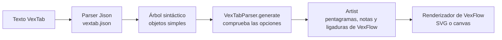

import FirstNotes from '../../../../assets/vexflow-vextab/l01-first-notes.svg';
import Notation from '../../../../assets/vexflow-vextab/l01-notation.svg';
import Durations from '../../../../assets/vexflow-vextab/l01-durations.svg';
import Overfull from '../../../../assets/vexflow-vextab/l01-overfull.svg';

[VexTab](https://github.com/0xfe/vextab) es un lenguaje de texto para tablatura de guitarra y notación estándar. Escribes unas líneas, VexTab las analiza y le pide a [VexFlow](https://www.vexflow.com/) que dibuje el resultado. Esta lección escribe las primeras líneas, las sigue del texto al dibujo y termina con los errores que emite VexTab cuando una línea está mal.

Cada dibujo de esta página es el SVG que VexFlow escribió para el ejemplo de encima, renderizado con Node por el código del curso, no una captura de pantalla. Cada mensaje de error es el que emitió VexTab.

## Ejecutar los ejemplos

El código del curso está en [`code/vexflow-vextab`](https://github.com/spareilleux/learn/tree/20497783691a7e4f4134be79c5531ea7754934e3/code/vexflow-vextab). Necesitas [Node.js](https://nodejs.org/) 24 y Git; la lección 4 necesita además el [SDK de .NET 10](https://dotnet.microsoft.com/download/dotnet/10.0). En Windows, ejecuta los comandos desde Git Bash.

```bash
cd code/vexflow-vextab
npm ci                                            # las versiones exactas de package-lock.json
bash check.sh                                     # cada ejemplo, comparado con expected/
node render.cjs --out out/mine my-file.vextab     # un archivo propio: out/mine/my-file.svg y .txt
```

`render.cjs` escribe el dibujo en `<name>.svg` y un informe de una línea en `<name>.txt`: `ok` y el tamaño del dibujo, o el error. Con `--ast` escribe también el árbol sintáctico, que esta lección examina más abajo.

## El primer pentagrama

El texto VexTab más pequeño es una palabra, `tabstave`: un pentagrama de tablatura vacío de seis líneas con la clave `TAB`. Las notas van en una línea `notes` debajo.

```vextab
tabstave
notes 5/5 7/5 5/4 7/4
```

<FirstNotes role="img" aria-label="Un pentagrama de tablatura con cuatro notas: traste 5 y luego 7 en la cuerda 5, traste 5 y luego 7 en la cuerda 4." />

Cada nota se escribe **`fret/string`**, traste/cuerda: `5/5` es el traste 5 en la cuerda 5, la cuerda de La. Las cuerdas se numeran como lo hacen los guitarristas, 1 para el Mi agudo, 6 para el Mi grave. Ten presente este orden: la lección 4 trata de un programa que lo escribe al revés.

Las palabras `vexflow.com` bajo el dibujo son el logotipo de VexTab, dibujado por defecto bajo cada renderizado ([`ArtistRenderer.ts:261-266`](https://github.com/0xfe/vextab/blob/3a5e00d858ae98934ba545f9bef5eb923e17e402/src/artist/ArtistRenderer.ts#L261-L266)). `Artist.NOLOGO = true` lo quita; el curso lo conserva, porque es lo que obtienes.

## La notación estándar encima de la tablatura

`notation=true` añade un pentagrama de cinco líneas con clave de sol encima de la tablatura, y VexTab calcula la altura de cada traste a partir de la afinación.

```vextab
tabstave notation=true
notes :q 4/5 5/5 7/5 | :h 5/4 7/4
```

<Notation role="img" aria-label="Un pentagrama de notación encima de uno de tablatura. Primer compás: do sostenido, re y mi en negras, desde los trastes 4, 5 y 7 de la cuerda 5. Segundo compás: sol y la en blancas, desde los trastes 5 y 7 de la cuerda 4." />

El traste 4 de la cuerda de La es do♯, el traste 5 es re, el traste 7 es mi. Las notas quedan en el centro del pentagrama en clave de sol, una octava por encima de como suenan: la música para guitarra se escribe una octava por encima de su altura real para que quepa en la clave de sol (la [lección 1 de Teoría musical para GA](../../music-theory-ga/01-notes-and-the-fretboard/) repasa alturas y octavas). La afinación por defecto de VexTab lo dice a su manera: `E/5, B/4, G/4, D/4, A/3, E/3`, una octava por encima de las alturas reales, de Mi4 a Mi2.

`tablature=false` deja solo la notación. Las notas se escriben entonces **`name/octave`**, nombre/octava, y un guion encadena notas de la misma octava:

```vextab
tabstave notation=true tablature=false
notes :q C-D-E-F/4 | :h G/4 C/5
```

Las alteraciones son `#` para el sostenido, `##` para el doble sostenido, `n` para el becuadro, y `@` y `@@` para el bemol y el doble bemol ([`vextab.jison:432-437`](https://github.com/0xfe/vextab/blob/3a5e00d858ae98934ba545f9bef5eb923e17e402/src/vextab.jison#L432-L437)). No `b`: en una línea `notes`, `b` es un bend (lección 2). `B@/4` es si bemol; `Bb/4` es un error.

## Duraciones y barras de compás

Una duración empieza con dos puntos y sigue vigente hasta la siguiente: `:w` redonda, `:h` blanca, `:q` negra (la predeterminada), `:8`, `:16` y `:32`. Una `d` detrás añade un puntillo, `:qd`. Un `|` dibuja una barra de compás.

```vextab
tabstave notation=true
notes :w 5/5 | :h 5/5 7/5 | :q 5/5 7/5 5/4 7/4 | :8 5/5 7/5 5/4 7/4 :q 5/3 7/3
```

<Durations role="img" aria-label="Cuatro compases: una redonda, dos blancas, cuatro negras, y después cuatro corcheas unidas de dos en dos y dos negras." />

VexFlow une las corcheas por sí solo, de dos en dos, y reparte cada compás por el ancho del que dispone. Lo que no hace es contar. Cinco negras en un compás de 4/4 se dibujan sin decir nada:

```vextab
tabstave notation=true time=4/4
notes :q 5/5 7/5 5/4 7/4 5/3 | :h 7/3
```

<Overfull role="img" aria-label="Un compás de 4/4 que contiene cinco negras, seguido de un compás con una sola blanca. Nada señala el tiempo de más." />

VexTab construye sus voces en el modo `SOFT` de VexFlow ([`ArtistRenderer.ts:67`](https://github.com/0xfe/vextab/blob/3a5e00d858ae98934ba545f9bef5eb923e17e402/src/artist/ArtistRenderer.ts#L67)), que acepta cualquier número de tiempos. Una voz en modo `STRICT` lanzaría una excepción; la lección 5 construye una a mano.

Una serie de trastes en una misma cuerda se escribe con guiones, igual que las notas de una misma octava: `5-7-9/3` son los trastes 5, 7 y 9 de la cuerda 3. `##` es un silencio.

## Del texto al dibujo

VexTab es un pequeño compilador. Su gramática, [`src/vextab.jison`](https://github.com/0xfe/vextab/blob/3a5e00d858ae98934ba545f9bef5eb923e17e402/src/vextab.jison), es una gramática LALR(1) para [Jison](https://gerhobbelt.github.io/jison/), un generador de parsers para JavaScript de la familia de yacc y bison. El parser devuelve un árbol de objetos simples; el `VexTabParser` de VexTab lo recorre y llama a un **Artist**, que construye objetos VexFlow; después el Artist los dibuja con un renderizador de VexFlow.



Para un desarrollador de C# o Java, es un DSL compilado a llamadas sobre una API de objetos, como una vista Razor compilada a C# que escribe HTML, con una diferencia: no se genera código fuente; el árbol se interpreta directamente.

`node render.cjs --ast` guarda el árbol. Para el ejemplo de notación de más arriba ([`expected/ast/l01-notation.ast.json`](https://github.com/spareilleux/learn/blob/20497783691a7e4f4134be79c5531ea7754934e3/code/vexflow-vextab/expected/ast/l01-notation.ast.json)), abreviado:

```json
[
  {
    "element": "tabstave",
    "options": [{ "key": "notation", "value": "true", "_l": 1, "_c": 9 }],
    "notes": [
      { "time": "q", "dot": false },
      { "fret": "4", "_l": 2, "_c": 9, "decorator": null, "string": "5" },
      { "fret": "5", "_l": 2, "_c": 13, "decorator": null, "string": "5" },
      { "fret": "7", "_l": 2, "_c": 17, "decorator": null, "string": "5" },
      { "command": "bar", "type": "single", "_l": 2, "_c": 21 },
      { "time": "h", "dot": false },
      { "fret": "5", "_l": 2, "_c": 26, "decorator": null, "string": "4" },
      { "fret": "7", "_l": 2, "_c": 30, "decorator": null, "string": "4" }
    ],
    "text": [],
    "_l": 1,
    "_c": 0
  }
]
```

Tres cosas que observar. Una duración es un elemento de la lista, como una nota, y por eso se aplica a lo que viene después. Todos los valores son cadenas, `"4"`, `"true"`: nada se convierte antes de que `VexTabParser` lea las opciones, y la lección 3 encuentra un sitio donde nada se convierte en absoluto. `_l` y `_c` son la línea y la columna, guardadas para los mensajes de error.

El punto de entrada es corto ([`VexTab.ts:68-95`](https://github.com/0xfe/vextab/blob/3a5e00d858ae98934ba545f9bef5eb923e17e402/src/vextab/VexTab.ts#L68-L95)): recortar cada línea, analizar, y después `this.compiler.generate(this.elements)`. El [`render.cjs`](https://github.com/spareilleux/learn/blob/20497783691a7e4f4134be79c5531ea7754934e3/code/vexflow-vextab/render.cjs#L25-L34) del curso lo llama como lo haría una página web:

```js
const div = document.createElement('div');
const renderer = new Vex.Flow.Renderer(div, Vex.Flow.Renderer.Backends.SVG);
const artist = new Artist(10, 10, width);   // x, y, ancho del dibujo
const vextab = new VexTab(artist);
const elements = vextab.parse(code);        // el árbol de arriba; lanza una excepción si hay un error
artist.render(renderer);                    // VexFlow dibuja en el div
```

## ¿Qué VexFlow?

El paquete `vextab` de npm no es una capa fina sobre un VexFlow que instalas a su lado. Su `dist/main.prod.js`, de 1,2 MB, es un bundle de webpack que contiene su propio VexFlow; en la copia del curso, `Vex.Flow.BUILD` indica `VERSION: '5.0.0'` e `ID: '0ca6f889…'`, el commit de VexFlow a partir del cual se construyó. VexTab 4.0.5 recrea el espacio de nombres `Vex.Flow` de VexFlow 4 sobre VexFlow 5 para que su código antiguo siga funcionando ([`src/vexflow.ts`](https://github.com/0xfe/vextab/blob/3a5e00d858ae98934ba545f9bef5eb923e17e402/src/vexflow.ts#L1-L21)).

Dos consecuencias. Primera, `npm install vexflow@4` junto a `vextab@4.0.5` no hace que VexTab dibuje con VexFlow 4: el bundle lo ignora. Segunda, el `Vex` que exporta `vextab` es ese VexFlow incluido; el curso lo usa, e instala el paquete `vexflow` 5.0.0 por separado solo para la segunda tanda.

GA está al otro lado de esa línea: sus componentes React piden `vexflow ^4.2.5` ([`package.json:67`](https://github.com/GuitarAlchemist/ga/blob/17ccee6885851e4b460ebd14d7f4cfb838f5541e/ReactComponents/ga-react-components/package.json#L67)), y la raíz web del chatbot distribuye una copia cuya cabecera dice `VexFlow 4.2.5 2024-05-12` ([`vexflow.js:2`](https://github.com/GuitarAlchemist/ga/blob/17ccee6885851e4b460ebd14d7f4cfb838f5541e/Apps/GaChatbot.Api/wwwroot/vendor/vexflow/vexflow.js#L2)). La lección 8 trata de esa diferencia.

## Renderizar sin navegador

VexFlow dibuja en un elemento SVG, así que con Node necesita un DOM: [jsdom](https://github.com/jsdom/jsdom) lo proporciona. También necesita medir texto. VexFlow 5 dibuja cada símbolo musical como un carácter de la fuente [Bravura](https://github.com/steinbergmedia/bravura) (una clave es U+E050, una cabeza de nota negra U+E0A4, según [SMuFL](https://w3c.github.io/smufl/latest/)), y dispone un compás a partir del ancho y el alto de esos caracteres, que le pregunta a un `<canvas>` ([`element.ts:607-622`](https://github.com/vexflow/vexflow/blob/0ca6f889545c33cce851b420c24945f6eb685aeb/src/element.ts#L607-L622)). jsdom no tiene canvas. El paquete [`canvas`](https://www.npmjs.com/package/canvas), que usan con Node las propias herramientas de prueba de VexFlow, no conseguía cargar el archivo OpenType de Bravura en Windows: todos los glifos caían en una fuente del sistema.

VexFlow tiene un punto de enganche público para esto, `Element.setTextMeasurementCanvas()` ([`element.ts:96`](https://github.com/vexflow/vexflow/blob/0ca6f889545c33cce851b420c24945f6eb685aeb/src/element.ts#L96)). El curso le pasa un objeto cuyo `measureText()` lee los avances y los contornos de los glifos de Bravura y Academico con [opentype.js](https://opentype.js.org/) ([`lib/env.cjs`](https://github.com/spareilleux/learn/blob/20497783691a7e4f4134be79c5531ea7754934e3/code/vexflow-vextab/lib/env.cjs)). Es JavaScript puro, así que los tres sistemas operativos de la CI disponen cada ejemplo de forma idéntica, y `check.sh` puede comparar los SVG byte a byte tras redondear las coordenadas a dos decimales y renumerar los identificadores `vf-auto…` de VexFlow.

¿Es esa disposición la que dibuja el navegador de un lector? Escribí cuatro hipótesis antes de medir ([`results/hypotheses.md`](https://github.com/spareilleux/learn/blob/284eb7e/code/vexflow-vextab/results/hypotheses.md)), y después rendericé cinco ejemplos con el propio bundle de navegador de VexTab en Chrome 153. La mayor diferencia entre Chrome y el renderizado sin navegador, sobre 157 elementos de texto, es de 0,74 px en horizontal y 0,67 px en vertical ([`results/browser-2026-09-24.txt`](https://github.com/spareilleux/learn/blob/20497783691a7e4f4134be79c5531ea7754934e3/code/vexflow-vextab/results/browser-2026-09-24.txt)). La primera ejecución decía 204 px: mi página de prueba no tenía `<meta charset="utf-8">`, Chrome leyó el bundle como Windows-1252, y cada carácter de Bravura se convirtió en dos caracteres latinos. El [diario](../journal/) conserva las dos ejecuciones.

## Cuando VexTab dice que no

De `parse` salen dos tipos de error. Un error **sintáctico** viene de Jison y nombra los tokens que esperaba:

```vextab
tabstaff notation=true
notes 5/5
```

```text
error Error: Parse error on line 1:
tabstaff notation=tr
^
Expecting 'EOF', 'OPTIONS', 'TABSTAVE', 'STAVE', 'VOICE', got 'WORD'
```

```vextab
tabstave
notes 5/5 7
```

```text
error Error: Parse error on line 2:
...abstavenotes 5/5 7
---------------------^
Expecting '/', 'h', 'd', '-', 's', 't', 'T', 'b', 'p', 'v', 'V', 'u', got 'EOF'
```

El segundo mensaje muestra `...abstavenotes`: Jison imprime el texto anterior al error sin sus saltos de línea. Un traste sin cuerda todavía puede ir seguido de una técnica, y esa es la lista que esperaba.

Un error **semántico** viene de `VexTabParser`, que comprueba las opciones después del análisis, y da una línea y una columna ([`VexTabParser.ts:39-99`](https://github.com/0xfe/vextab/blob/3a5e00d858ae98934ba545f9bef5eb923e17e402/src/vextab/VexTabParser.ts#L39-L99)):

```vextab
tabstave notation=yes
notes 5/5
```

```text
error ParseError: [RuntimeError] ParseError: 'notation' must be 'true' or 'false' in line 1 column 9
```

```vextab
tabstave notation=false tablature=false
notes 5/5
```

```text
error ParseError: [RuntimeError] ParseError: Both 'notation' and 'tablature' can't be invisible in line 1 column 24
```

El primer `error …:` es el informe del curso, `e.code` o `e.name` seguido de `e.message`; el resto es el mensaje de VexTab. Los seis mensajes de la lección están en [`expected/ex/`](https://github.com/spareilleux/learn/tree/20497783691a7e4f4134be79c5531ea7754934e3/code/vexflow-vextab/expected/ex).

## Lo esencial

- Un texto VexTab es una lista de bloques `tabstave`, cada uno seguido de líneas `notes` y `text`. Las notas son `fret/string` en tablatura y `name/octave` en notación, y un bemol es `@`.
- Una duración es un elemento de la lista de notas: se aplica hasta la siguiente. Los compases no se cuentan.
- VexTab analiza con una gramática Jison hacia un árbol de cadenas, comprueba las opciones y después maneja VexFlow a través de su Artist.
- El paquete npm `vextab` lleva su propio VexFlow 5.0.0.
- Con Node, VexFlow necesita un DOM y una forma de medir Bravura; medida con opentype.js, la disposición queda a menos de 0,74 px de la de Chrome.

## Ejercicios

1. Escribe la escala pentatónica de la menor en quinta posición, ascendente desde el traste 5 de la cuerda 6 hasta el traste 5 de la cuerda 1, en corcheas, con notación, en dos compases de 4/4 que terminan en una blanca.

<details>
<summary>Solución</summary>

```vextab
tabstave notation=true time=4/4
notes :8 5-8/6 5-7/5 5-7/4 5-7/3 | :8 5-8/2 5-8/1 :h 5/1
```

Ocho corcheas llenan el primer compás; cuatro corcheas y una blanca llenan el segundo. `check.sh` lo renderiza como [`l01-ex-pentatonic`](https://github.com/spareilleux/learn/blob/20497783691a7e4f4134be79c5531ea7754934e3/code/vexflow-vextab/expected/ex/l01-ex-pentatonic.svg). VexTab lo habría dibujado igual de bien con un tiempo de menos: contar te toca a ti.

</details>

2. Predice qué dice VexTab de `notes 12/7` bajo un `tabstave` simple, y después compruébalo con `render.cjs`.

<details>
<summary>Solución</summary>

La gramática acepta cualquier número como cadena, así que el texto se analiza. El error llega más tarde, de la afinación de VexFlow, cuando el Artist pide la altura de la cuerda 7 en una guitarra de seis cuerdas:

```text
error BadArguments: [RuntimeError] BadArguments: String number must be between 1 and 6:7
```

</details>

3. En el árbol sintáctico de `notes :8 5-7-9/3`, la segunda y la tercera nota llevan `"articulation": "-"` y la primera no. ¿Por qué?

<details>
<summary>Solución</summary>

La gramática trata el guion como el más simple de los conectores entre dos trastes de una misma cuerda, junto a `h`, `p`, `s`, `b` y `t` ([`vextab.jison:383-392`](https://github.com/0xfe/vextab/blob/3a5e00d858ae98934ba545f9bef5eb923e17e402/src/vextab.jison#L383-L392)). Cada traste después del primero registra el conector que lleva hasta él; `-` significa «ninguna técnica». El árbol está en [`expected/ast/l01-fret-run.ast.json`](https://github.com/spareilleux/learn/blob/20497783691a7e4f4134be79c5531ea7754934e3/code/vexflow-vextab/expected/ast/l01-fret-run.ast.json).

</details>

## Fuentes

- Mohit Cheppudira, [The VexTab Tutorial](https://vexflow.com/vextab/tutorial.html), pasos 1 a 4 y 9.
- [`src/vextab.jison`](https://github.com/0xfe/vextab/blob/3a5e00d858ae98934ba545f9bef5eb923e17e402/src/vextab.jison) y [`src/vextab/VexTab.ts`](https://github.com/0xfe/vextab/blob/3a5e00d858ae98934ba545f9bef5eb923e17e402/src/vextab/VexTab.ts) en `3a5e00d`, idénticos a los archivos del paquete npm 4.0.5.
- VexFlow [`src/element.ts`](https://github.com/vexflow/vexflow/blob/0ca6f889545c33cce851b420c24945f6eb685aeb/src/element.ts) en `0ca6f88`, y su propio generador de imágenes con jsdom, [`tools/generate_images_jsdom.js`](https://github.com/vexflow/vexflow/blob/0ca6f889545c33cce851b420c24945f6eb685aeb/tools/generate_images_jsdom.js).
- [Jison](https://gerhobbelt.github.io/jison/docs/), el generador de parsers.
