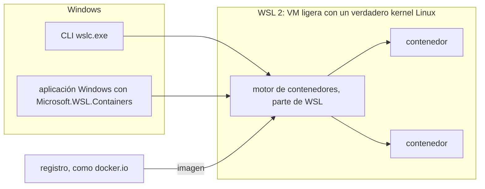

## Partir de lo que ya usas

Si escribes C# o Java en Windows, probablemente conociste los contenedores a través de Docker Desktop: un `docker run` para un PostgreSQL local, un `compose.yaml` junto a la solución, un Dockerfile que construye un pipeline de CI, quizá Testcontainers en tus pruebas de integración. Puede que nunca hayas necesitado saber que todo eso se ejecuta en una máquina virtual Linux que Docker Desktop gestiona por ti.

WSL containers es la propia versión de Microsoft para el mismo trabajo, integrada en el Subsistema de Windows para Linux. La mayor parte de tu vocabulario Docker sigue sirviendo; lo que cambia es quién proporciona la máquina Linux y qué herramientas la acompañan:

| Con Docker Desktop usas | Con WSL containers | Lección |
|---|---|---|
| `docker run`, `docker ps`, `docker exec` | `wslc run`, `wslc container list`, `wslc exec` | 3 |
| un `Dockerfile` y `docker build` | el mismo archivo, a menudo llamado `Containerfile`, y `wslc build` | 4 |
| Settings, Resources, o `.wslconfig` | `settings.yaml`, por sesión | 6 |
| `docker volume`, `-v` | `wslc volume`, `-v` | 7 |
| `docker compose up` | sin equivalente: un script | 8 |
| Docker.DotNet, Testcontainers | el paquete `Microsoft.WSL.Containers`, dentro del proceso | 9 |
| la casilla de Kubernetes, las extensiones, el panel | nada | 10 |

Las dos primeras lecciones fijan el vocabulario y la instalación; el resto del curso ejecuta cargas de trabajo .NET y Java reales con `wslc` y compara cada paso con Docker Desktop. Este curso trata de Windows por naturaleza, así que sus comandos son solo para PowerShell en Windows 11.

## Un contenedor, en una frase

Un **contenedor** empaqueta una aplicación con todo lo que necesita (bibliotecas, runtime, configuración) para que se ejecute de la misma manera en todas partes.
Se inicia a partir de una **imagen**, una plantilla de solo lectura que descargas de un registro ([Docker Hub](https://hub.docker.com/), por ejemplo) o que construyes tú mismo.

| Término | Analogía | Ejemplo |
|---|---|---|
| Imagen | Una receta fija | `nginx`, `ubuntu:latest` |
| Contenedor | Un plato preparado a partir de la receta | el servidor `web` iniciado a partir de `nginx` |
| Registro | La biblioteca de recetas | `docker.io` |
| Puerto publicado | La ventanilla entre Windows y el contenedor | `-p 8080:80` |

## Por qué hace falta Linux

Los contenedores Linux comparten el **kernel Linux** de la máquina anfitriona. Windows no tiene uno, así que hace falta una máquina virtual Linux en algún lugar.
Eso es exactamente lo que proporciona **[WSL 2](https://learn.microsoft.com/windows/wsl/about)**: una VM ligera, gestionada por Windows, con un verdadero kernel Linux.

## Tres formas de tener contenedores Linux en Windows

| Enfoque | Quién gestiona la VM Linux | Herramienta |
|---|---|---|
| [Docker Desktop](https://docs.docker.com/desktop/) | Docker, mediante su propia distro WSL `docker-desktop` | `docker` |
| [Podman](https://podman.io/) | Podman, mediante su distro WSL `podman-machine-default` | `podman` |
| **WSL containers** | **WSL mismo**, sin producto de terceros | `wslc` |

La novedad: con WSL containers, **el motor de contenedores forma parte de WSL**. No hay nada más que instalar, y `wslc.exe` viene con WSL.

## Los dos componentes

1. **La CLI `wslc.exe`** — para construir, ejecutar e inspeccionar contenedores desde una terminal. Sigue las convenciones de la CLI de Docker.
2. **La API de WSL container** — un paquete NuGet ([`Microsoft.WSL.Containers`](https://www.nuget.org/packages/Microsoft.WSL.Containers)) que permite a una **aplicación Windows** usar contenedores Linux en su propia lógica (C#, y C++/WinRT en versión preliminar).

Los dos componentes manejan contenedores Linux a través de WSL, cuya máquina virtual ligera proporciona el kernel Linux.



## Puntos clave

- Imagen = plantilla; contenedor = instancia en ejecución.
- Los contenedores Linux necesitan un kernel Linux → WSL 2 lo proporciona.
- `wslc` = contenedores integrados en WSL, sin Docker Desktop.
- Lo que sabes de Docker sirve para la CLI y el formato de imagen; no para Compose, Kubernetes ni la API de Docker Engine.

## Ejercicios

1. Lista las distribuciones WSL de tu máquina. ¿Cuáles pertenecen a una herramienta de contenedores?

<details>
<summary>Solución</summary>

```powershell
wsl -l -v
```

```text
  NAME                      STATE           VERSION
* podman-machine-default    Stopped         2
  Ubuntu                    Stopped         2
  docker-desktop            Stopped         2
```

En mi máquina: `docker-desktop` (Docker Desktop) y `podman-machine-default` (Podman). Son distros «técnicas» gestionadas por esas herramientas, no distros pensadas para usarse directamente; `Ubuntu` es una distro normal. `wslc` no añade ninguna: sus sesiones no aparecen en `wsl -l -v`.

</details>

2. ¿Por qué no puedes ejecutar una imagen `ubuntu` directamente sobre el kernel de Windows?

<details>
<summary>Solución</summary>

Una imagen Linux contiene binarios que hacen llamadas al sistema **Linux**. Un contenedor no virtualiza el kernel: comparte el del anfitrión. Así que hace falta un kernel Linux, proporcionado aquí por la VM de WSL 2.

</details>

3. Un colega usa Docker Desktop y Podman en la misma máquina Windows, y ahora instala WSL 2.9. ¿Cuántas VM Linux pueden acabar ejecutándose, y quién gestiona cada una?

<details>
<summary>Solución</summary>

Al menos tres. Docker Desktop gestiona la distro `docker-desktop`, Podman gestiona `podman-machine-default`, y `wslc` inicia una VM por sesión: `wslc-cli-<user>` para una terminal normal, otra para una terminal de administrador, y una por cada aplicación que crea su propia sesión. Cada VM toma memoria de Windows, algo que mide la [lección 6](../06-resources-and-limits/).

</details>

## Fuentes

- [¿Qué es WSL? — Microsoft Learn](https://learn.microsoft.com/windows/wsl/about)
- [WSL container — Microsoft Learn](https://learn.microsoft.com/windows/wsl/wsl-container)
- [Backend WSL 2 de Docker Desktop](https://docs.docker.com/desktop/features/wsl/) — documentación de Docker
