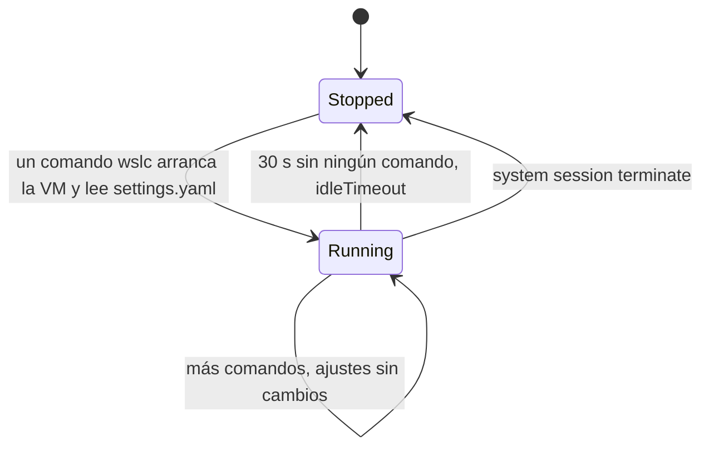

Un desarrollador Java sabe que `-Xmx` pone un techo al heap y que la JVM solo toma memoria a medida que la necesita. Un desarrollador .NET sabe que el recolector de basura lee el límite de memoria del contenedor. Quien usa Docker Desktop con el backend WSL 2 conoce el otro nivel: la memoria y los procesadores de toda la VM Linux, definidos en `.wslconfig`. En una máquina que también ejecuta un IDE, un navegador y algunos servicios, ese límite a nivel de VM es lo que mantiene Windows fluido.

`wslc` tiene los mismos dos niveles: un límite para la **VM de la sesión** y límites opcionales por **contenedor**. Esta lección fija ambos, mide lo que ven realmente un contenedor y Windows, y luego examina el tercer recurso que se olvida hasta que el disco se llena: el disco virtual de la sesión. Las mediciones vienen del [diario](../journal/), salvo los límites por contenedor, medidos para esta lección con `wslc` 2.9.11.

## Por qué importa en una máquina cargada

El diario empieza con un incidente. Con Docker Desktop y su Kubernetes, Podman, ollama y varios procesos rust-analyzer en ejecución al mismo tiempo, Docker Desktop se cayó tres veces en pocos minutos, y el propio `wsl -l -v` fallaba:

```text
Not enough memory resources are available to complete this operation.
Error code: Wsl/0x8007000e
```

La máquina tenía 97 GB de memoria comprometida de 132 GB. Cada herramienta de contenedores ejecuta su propia VM, y cada VM toma memoria de Windows. `wslc` añade una VM por sesión, así que sus límites merecen la misma atención.

## El `settings.yaml` de la sesión

`wslc settings` crea `%LocalAppData%\wslc\settings.yaml` la primera vez, con todos los ajustes comentados, y lo abre en el editor por defecto. La parte sobre recursos:

```yaml
session:
  # Number of virtual CPUs allocated to the session (e.g. 4 default: all available CPUs)
  # cpuCount: default

  # Memory limit for the session (e.g. 2GB default: half of available memory)
  # memorySize: default
```

El mismo archivo tiene algunos otros ajustes de sesión, descritos en el propio archivo y en [aka.ms/wslc-settings](https://aka.ms/wslc-settings):

| Ajuste | Valor por defecto | Función |
|---|---|---|
| `cpuCount` | todas las CPU lógicas | CPU virtuales de la VM de la sesión |
| `memorySize` | la mitad de la RAM | techo de memoria de la VM de la sesión |
| `maxStorageSize` | 1 TB | tamaño máximo del disco virtual de la sesión |
| `storagePath` | bajo `%LocalAppData%\wslc` | dónde se crea `wslc\sessions\<session>\storage.vhdx` |
| `defaultBindingAddress` | `127.0.0.1` | dirección que usa `-p` cuando no indicas ninguna |
| `hostLoopback` | ver el archivo | el nombre `host.wslc.internal`, para llegar a Windows desde un contenedor |
| `idleTimeout` | 30 s | cuánto tiempo sigue en marcha una VM de sesión inactiva |

Una aplicación Windows que controla contenedores mediante la API fija los mismos límites en código, con `SessionSettings.CpuCount` y `SessionSettings.MemorySizeInMB` ([lección 9](../09-csharp-api/)).

## Medir lo que ve un contenedor

El anfitrión tiene 24 CPU lógicas y 63.7 GB de RAM. Un contenedor Alpine desechable muestra el número de procesadores y la memoria:

```powershell
wslc run --rm alpine sh -c "echo nproc=`$(nproc); free -m"
```

La comilla invertida delante del signo de dólar impide que PowerShell evalúe él mismo la sustitución de comando dentro de una cadena entre comillas dobles, para que la reciba `sh`. Con comillas simples, como en los comandos más abajo, PowerShell no interpreta nada y no hace falta la comilla invertida.

| Ajustes | `nproc` | RAM (`free -m`) | Swap |
|---|---|---|---|
| valores por defecto | 24 | 31946 MB | 32617 MB |
| `cpuCount: 4`, `memorySize: 4GB` | 4 | 3919 MB | 4096 MB |

Con los valores por defecto, el contenedor ve todos los procesadores y la mitad de la RAM. Con los límites, ve exactamente lo que se le dio a la VM, y el swap sigue a `memorySize`.

## Trampa: una sesión en ejecución conserva sus ajustes antiguos

La primera medición tras editar el archivo seguía mostrando 24 CPU. Los ajustes se leen cuando arranca la VM de la sesión, así que hay que terminar la sesión; el siguiente comando `wslc` inicia una nueva con los nuevos valores:

```powershell
wslc --session wslc-cli-spare system session terminate
```

El nombre de la sesión va en la opción global `--session`, **antes** del subcomando. Pasado como argumento, como en `wslc system session terminate wslc-cli-spare`, falla con `Found a positional argument when none was expected`.

Cuatro gigabytes resultaron demasiado justos para el resto del curso, que ejecuta qdrant. El ajuste conservado en esta máquina es `cpuCount: 8` y `memorySize: 16GB`, y un contenedor muestra entonces `nproc=8`, 15996 MB de RAM y 16384 MB de swap. De ahí viene el límite de 15.62 GiB que muestra `wslc stats` en la [lección 3](../03-first-containers/).

La VM de la sesión pasa por unos pocos estados, y solo uno de ellos lee el archivo de ajustes.



### La sesión de administrador lee el mismo archivo

En una terminal de administrador, `wslc info` muestra el mismo `Settings file: C:\Users\spare\AppData\Local\wslc\settings.yaml`. Tras terminar la sesión admin, sus contenedores ven los mismos límites:

```text
> wslc --session wslc-cli-admin-spare system session terminate
> wslc run --rm alpine sh -c 'echo nproc=$(nproc); free -m'
nproc=8
Mem:          15996 ...
Swap:         16384 ...
```

Los límites se aplican **por sesión**: una sesión sin elevación y una sesión de administrador en ejecución al mismo tiempo pueden usar hasta 16 GB cada una.

## Límites por contenedor

`wslc run --help` lista las mismas opciones por contenedor que `docker run`, entre ellas `--cpus` («Number of CPUs (e.g. 0.5, 1, 2.5)») y `-m`, `--memory` («Memory limit (e.g. 512M, 1G)»). No modifican la VM: configuran el grupo de control de Linux del contenedor. Medido con la sesión a 8 CPU y 16 GB:

```powershell
wslc run --rm --memory 512M --cpus 1.5 alpine sh -c 'echo nproc=$(nproc); cat /sys/fs/cgroup/memory.max /sys/fs/cgroup/cpu.max; free -m'
```

```text
wsl: Your kernel does not support swap limit capabilities or the cgroup is not mounted. Memory limited without swap.
nproc=8
536870912
150000 100000
              total        used        free      shared  buff/cache   available
Mem:          15996         278       15439           3         280       15527
Swap:         16384           0       16384
```

- `memory.max` vale 536870912 bytes, exactamente 512 MiB, y `cpu.max` permite 150000 microsegundos de tiempo de CPU por cada 100000: 1.5 procesadores.
- `nproc` y `free` siguen mostrando las 8 CPU y los 16 GB **de la VM**. No leen el grupo de control. Un runtime que se dimensionara a partir de ellos sobrestimaría lo que puede usar; los runtimes recientes de .NET y Java leen en cambio los límites del grupo de control, *por verificar* para la versión del runtime que distribuyas.
- La advertencia indica que, en este kernel, el límite de memoria no cubre el swap.

## La VM del lado de Windows

En Windows, cada VM de sesión es un proceso llamado `vmmem` seguido del nombre de la sesión: `vmmemwslc-cli-spare` para la sesión sin elevación, `vmmemwslc-cli-admin-spare` para la de administrador. `hcsdiag list`, desde una terminal de administrador, la muestra como una VM `Running` con el nombre de la sesión. Sus cifras de memoria, el working set y la memoria privada que muestra `Get-Process`, solo se pueden leer desde una terminal elevada.

La prueba: un contenedor que retiene 6 GB durante dos minutos, en la sesión sin elevación.

```powershell
wslc run -d --name memtest alpine sh -c 'apk add -q stress-ng && stress-ng --vm 1 --vm-bytes 6G --vm-hang 0 --timeout 120s'
```

| Momento | Proceso de la VM | Working set | Memoria privada |
|---|---|---|---|
| sesión inactiva (admin, nada en ejecución) | `vmmemwslc-cli-admin-spare` | 921 MB | 970 MB |
| 6 GB retenidos en el contenedor | `vmmemwslc-cli-spare` | 7069 MB | 7083 MB |
| 10 s después de `container stop` + `remove` | `vmmemwslc-cli-spare` | 2776 MB | 7084 MB |
| un poco más tarde | `vmmemwslc-cli-spare` | 902 MB | 1902 MB |

- Una VM de sesión inactiva cuesta unos **0.9 GB**.
- La memoria que usa un contenedor aparece casi entera del lado de Windows: unos 6 GB más la VM base.
- Cuando el contenedor se detiene, la memoria **no se devuelve de inmediato**: disminuye progresivamente.
- `memorySize` es un techo, no una reserva, igual que `-Xmx`: la VM solo toma lo que usan sus contenedores.

## Cuándo se detiene la VM inactiva

Para ver cuándo desaparece la VM, ejecuta un contenedor y luego vigila el proceso **sin ejecutar ningún comando `wslc`**, ya que cualquier comando `wslc` despierta la sesión:

```powershell
wslc run --rm alpine true
# luego, cada 5 s:
Get-Process -Name 'vmmemwslc-cli-spare' -ErrorAction SilentlyContinue
```

```text
    0s  VM running: True
   35s  VM running: False
```

La VM se detiene **entre 30 y 35 segundos** después del último comando, medido con un sondeo cada 5 segundos: es `idleTimeout: 30`. La sesión sigue listada por `wslc system session list`; solo se apaga su VM, y el siguiente comando la vuelve a iniciar, con una nueva lectura de `settings.yaml`.

## El disco: `storage.vhdx` crece y no se reduce

Las imágenes, los contenedores y los volúmenes viven en `%LocalAppData%\wslc\sessions\<session>\storage.vhdx`, un disco virtual por sesión. Su tamaño del lado de Windows, paso a paso:

| Paso | Tamaño del archivo |
|---|---|
| inicio (`alpine`, `nginx`) | 814 MB |
| `wslc pull mcr.microsoft.com/dotnet/sdk:9.0` (869 MB) | 1070 MB |
| `wslc image remove` de esa imagen | 1070 MB |
| `wslc image prune --all` («Total reclaimed space: 178.5MB», no queda nada) | 1070 MB |
| `system session terminate` | 1070 MB |
| volver a descargar `dotnet/sdk:9.0` | 1070 MB |
| + `dotnet/aspnet:9.0` (224 MB) + `eclipse-temurin:21-jdk` (491 MB) | 1550 MB |

- El archivo **crece** cuando se añaden imágenes, y **nunca se reduce** por sí solo: ni con `image remove`, ni con `prune`, ni al terminar la sesión.
- El espacio liberado dentro se **reutiliza**: volver a descargar el SDK no hizo crecer el archivo.
- El crecimiento es menor que la columna `SIZE`, que muestra el tamaño sin comprimir, así que el tamaño del archivo no es un contador fiable de imágenes.

:::caution[`-f` no es `--force`]
En `wslc image prune`, `-f` significa `--filter`. No existe `--force`, y `wslc image prune --all` no pide confirmación.
:::

## Compactar `storage.vhdx`

Tras los builds de la [lección 4](../04-build-an-image/), el archivo había crecido hasta **3995 MB**, mientras que `df` dentro de la sesión solo mostraba **1.9 GB** usados. Compactar un VHDX es una operación de Hyper-V:

```powershell
# 1. Detener la VM de la sesión (sin elevación) y comprobar que ha desaparecido
wslc --session wslc-cli-spare system session terminate
Get-Process -Name 'vmmemwslc-cli-spare' -ErrorAction SilentlyContinue   # nada

# 2. PowerShell de administrador (módulo Hyper-V): copia de seguridad y luego compactación
$f = "$env:LOCALAPPDATA\wslc\sessions\wslc-cli-spare\storage.vhdx"
Copy-Item $f "$f.bak"
Optimize-VHD -Path $f -Mode Full
```

```text
before: 3,995 MB
Optimize-VHD -Mode Full: OK in 10s
after: 2,789 MB
```

Eso devolvió **1.2 GB** a Windows en 10 segundos. Antes de borrar la copia de seguridad, comprueba que no se ha perdido nada: `wslc image list` seguía listando `csharp-api`, `java-reactor-api` y `alpine`, y las dos API seguían respondiendo tras `wslc run`.

- [`Optimize-VHD`](https://learn.microsoft.com/powershell/module/hyper-v/optimize-vhd) necesita una terminal de **administrador** y el módulo PowerShell **Hyper-V**.
- La VM de la sesión debe estar detenida; si no, el VHDX está en uso.
- El archivo sigue siendo más grande que el espacio usado dentro, 2.8 GB frente a 1.9 GB, porque solo se recuperan los bloques totalmente libres.
- `fstrim`, que indicaría al disco virtual qué bloques están libres, no está disponible en la VM de la sesión: `wslc system session run fstrim -v /` falla con `Failed to launch command fstrim. Errno = 2`.

## Puntos clave

- `cpuCount` y `memorySize` en `%LocalAppData%\wslc\settings.yaml` limitan la VM de la sesión; los valores por defecto son todas las CPU y la mitad de la RAM.
- Los ajustes se leen cuando arranca la VM: termina la sesión con `wslc --session <name> system session terminate` después de editarlos.
- Las dos sesiones, sin elevación y de administrador, leen el mismo archivo, y cada una tiene su propia VM con esos límites.
- `--memory` y `--cpus` limitan un contenedor mediante su grupo de control, pero `nproc` y `free` dentro de él siguen mostrando la VM.
- La VM de la sesión es el proceso `vmmem<session>`: unos 0.9 GB en reposo, detenida 30 segundos después del último comando, y lenta en devolver la memoria.
- `storage.vhdx` nunca se reduce por sí solo. Termina la sesión, haz una copia de seguridad y luego ejecuta `Optimize-VHD -Mode Full` como administrador.

## Ejercicios

1. Pones `cpuCount: 4` en `settings.yaml`, pero `wslc run --rm alpine nproc` sigue mostrando 24. Explica por qué y corrígelo con un solo comando.

<details>
<summary>Solución</summary>

La VM de la sesión ya estaba en ejecución, y solo lee el archivo al arrancar. Termínala, y el siguiente comando inicia una VM nueva con cuatro procesadores:

```powershell
wslc --session wslc-cli-<user> system session terminate
```

Esperar más de 30 segundos sin ningún comando `wslc` también funciona, ya que la VM inactiva se detiene sola.

</details>

2. Un colega escribe `wslc run --rm alpine sh -c "echo nproc=$(nproc)"` en PowerShell, y la salida no tiene ningún número después de `nproc=`. ¿Por qué? Da dos correcciones.

<details>
<summary>Solución</summary>

Dentro de una cadena entre comillas dobles, PowerShell evalúa `$(nproc)` como su propia subexpresión antes de llamar a `wslc`, así que `sh` nunca la ve: la sustitución de comando ocurre en el lado equivocado, donde `nproc` normalmente no existe. O bien escapas el signo de dólar con una comilla invertida, como en `` "echo nproc=`$(nproc)" ``, o bien usas comillas simples, `'echo nproc=$(nproc)'`, que PowerShell pasa tal cual.

</details>

3. Un servicio Spring Boot se ejecuta con `--memory 512M` en una sesión limitada a 16 GB. Dentro del contenedor, `free -m` muestra 15996 MB. ¿Se aplica el límite? ¿Cómo lo compruebas?

<details>
<summary>Solución</summary>

Sí. `free` lee la memoria de la VM, no el grupo de control. Lee el límite allí donde el kernel lo aplica:

```powershell
wslc exec <container> cat /sys/fs/cgroup/memory.max
```

Mostró 536870912, es decir 512 MiB, en la medición de esta lección. Si el proceso lo supera, el kernel lo detiene por falta de memoria, diga lo que diga `free`.

</details>

4. En el Administrador de tareas ves un proceso `vmmemwslc-cli-spare` que usa 7 GB, pero `wslc container list` no muestra nada. ¿Qué ha pasado y qué pasará después?

<details>
<summary>Solución</summary>

Un contenedor usó esa memoria y se ha detenido, y la VM todavía no ha devuelto la memoria a Windows: tras la prueba de 6 GB, el working set seguía en 2.8 GB diez segundos después de eliminar el contenedor, y la memoria privada seguía en 7 GB. La memoria disminuye progresivamente, y toda la VM se detiene unos 30 segundos después del último comando `wslc`.

</details>

5. Tu `storage.vhdx` ocupa 4 GB y acabas de ejecutar `wslc image prune --all`. El archivo no ha cambiado. Enumera los pasos que devuelven el espacio a Windows e indica qué terminal necesita cada uno.

<details>
<summary>Solución</summary>

1. En una terminal **sin elevación**, termina la sesión con `wslc --session wslc-cli-<user> system session terminate` y comprueba que el proceso `vmmemwslc-cli-<user>` ha desaparecido.
2. En un PowerShell de **administrador** con el módulo Hyper-V, copia `storage.vhdx` como copia de seguridad y luego ejecuta `Optimize-VHD -Path <file> -Mode Full`.
3. De vuelta en la terminal normal, comprueba que `wslc image list` y tus contenedores siguen funcionando, y luego borra la copia de seguridad.

Ejecutar antes el prune sí fue útil: libera los bloques que `Optimize-VHD` puede recuperar después.

</details>

## Fuentes

- [WSL container — Microsoft Learn](https://learn.microsoft.com/windows/wsl/wsl-container): `SessionSettings`, CLI
- [Referencia de los ajustes de wslc](https://aka.ms/wslc-settings)
- [Configuración avanzada de WSL (`.wslconfig`) — Microsoft Learn](https://learn.microsoft.com/windows/wsl/wsl-config)
- [Ajustes de Docker Desktop: Resources](https://docs.docker.com/desktop/settings-and-maintenance/settings/#resources) — documentación de Docker
- [Resource constraints](https://docs.docker.com/engine/containers/resource_constraints/) — documentación de Docker (`--memory`, `--cpus`)
- [Control Group v2](https://docs.kernel.org/admin-guide/cgroup-v2.html) — documentación del kernel Linux (`memory.max`, `cpu.max`)
- [`Optimize-VHD` — Microsoft Learn](https://learn.microsoft.com/powershell/module/hyper-v/optimize-vhd)
