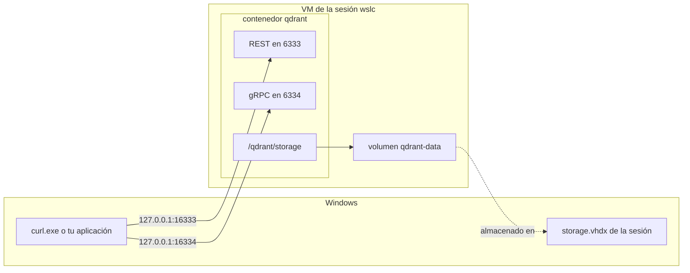

Si desarrollas en C# o en Java, probablemente ya has arrancado una base de datos para el trabajo local con un solo `docker run`: PostgreSQL para un proyecto Entity Framework Core o JPA, Redis para una caché, una base de datos vectorial para un experimento de recuperación. Siempre vuelven tres preguntas. ¿Qué puerto publico? ¿Qué versión acabo de descargar? ¿Dónde viven los datos cuando elimino el contenedor?

Esta lección las responde con `wslc` y un servicio real, [qdrant](https://qdrant.tech/), un motor de búsqueda vectorial con una API REST en el puerto 6333 y una API gRPC en el puerto 6334. La máquina ya ejecuta un qdrant en Docker Desktop, usado por otra aplicación, lo que hace el ejercicio realista: la copia de `wslc` no debe molestarlo. Todas las salidas de abajo son de `wslc` 2.9.11 y están registradas en el [diario](../journal/).

## Elegir los puertos de Windows

Antes de arrancar nada, mira lo que ya está publicado:

```text
> docker ps
ga-qdrant  qdrant/qdrant:latest  Up About an hour (healthy)  0.0.0.0:6333-6334->6333-6334/tcp, [::]:6333-6334->6333-6334/tcp
```

Docker Desktop publica el 6333 y el 6334 en todas las direcciones IPv4 e IPv6. Como muestra la [lección 5](../05-wslc-vs-docker/), `wslc` publicaría los mismos puertos **sin ningún error**, en `127.0.0.1`, y le quitaría en silencio esa dirección a la aplicación que usa `ga-qdrant`. Así que la copia de `wslc` usa **16333** y **16334** del lado de Windows. Dentro de su contenedor, qdrant sigue escuchando en el 6333 y el 6334: solo cambia el lado izquierdo de `-p`.

## Pull: misma etiqueta, versión distinta

```powershell
wslc pull qdrant/qdrant    # 21 s, 198 MB
```

La imagen de Docker ya estaba en el disco, pero `wslc` la vuelve a descargar, porque las dos herramientas tienen almacenes de imágenes separados. La sorpresa llega después, cuando las dos copias responden en su URL raíz:

```text
> curl.exe http://127.0.0.1:16333/     # wslc
{"title":"qdrant - vector search engine","version":"1.19.1","commit":"6ab21cac18ebb6f4ae29102c7f8f5cc11affd5de"}
> curl.exe http://127.0.0.1:6333/      # Docker (ga-qdrant, descargada el 2025-12-19)
{"title":"qdrant - vector search engine","version":"1.16.3","commit":"bd49f45a8a2d4e4774cac50fa29507c4e8375af2"}
```

Las dos imágenes se llaman `qdrant/qdrant:latest`, y las separan tres versiones menores. Una etiqueta es un rótulo móvil, un poco como una versión flotante de NuGet o un `LATEST` de Maven: `latest` significa lo que era lo último cuando *esta* herramienta lo descargó. Cuando dos entornos deben coincidir, fija la versión, como en `qdrant/qdrant:v1.19.1`.

## Un volumen con nombre

El sistema de archivos propio de un contenedor desaparece con el contenedor. Para una base de datos, los datos deben vivir en otro sitio: un **volumen con nombre**, creado por el motor de contenedores y montado en la ruta donde escribe el servicio.

```powershell
wslc volume create qdrant-data
wslc run -d --name qdrant -p 16333:6333 -p 16334:6334 -v qdrant-data:/qdrant/storage qdrant/qdrant
curl.exe http://127.0.0.1:16333/readyz    # all shards are ready (tras 1 s)
```

```text
CONTAINER ID   IMAGE           COMMAND             CREATED         STATUS        PORTS                                                  NAMES
da52872e3246   qdrant/qdrant   "./entrypoint.sh"   5 seconds ago   Up 1 second   127.0.0.1:16333->6333/tcp, 127.0.0.1:16334->6334/tcp   qdrant
```

| Opción | Efecto |
|---|---|
| `-p 16333:6333` | API REST: puerto 16333 de Windows hacia el puerto 6333 del contenedor |
| `-p 16334:6334` | API gRPC: puerto 16334 de Windows hacia el puerto 6334 del contenedor |
| `-v qdrant-data:/qdrant/storage` | monta el volumen con nombre donde qdrant guarda sus colecciones |

El endpoint `readyz` es la sonda de disponibilidad de qdrant: responde en cuanto el servicio puede atender peticiones, y eso es lo que debe esperar un script, en lugar de un retardo fijo.

El diagrama muestra los dos caminos hacia el contenedor: los puertos publicados desde Windows y el volumen que vive en el disco virtual de la sesión.



:::caution[La URL del dashboard en el log es la del contenedor]
qdrant registra `Access web UI at http://localhost:6333/dashboard`. Ese puerto es el de **dentro** del contenedor. Desde Windows, el dashboard de esta copia está en `http://127.0.0.1:16333/dashboard`, y `localhost:6333` abriría el de Docker.
:::

## Meter datos

Una colección de vectores de cuatro dimensiones, tres puntos con un pequeño payload y una consulta. Los cuerpos de las peticiones están en archivos JSON, lo que evita las reglas de PowerShell para las comillas dobles pasadas a un programa nativo:

```powershell
curl.exe -X PUT http://127.0.0.1:16333/collections/journal -H "Content-Type: application/json" --data-binary "@coll.json"
curl.exe -X PUT "http://127.0.0.1:16333/collections/journal/points?wait=true" -H "Content-Type: application/json" --data-binary "@points.json"
curl.exe -X POST http://127.0.0.1:16333/collections/journal/points/query -H "Content-Type: application/json" --data-binary "@query.json"
```

```text
coll.json    {"vectors":{"size":4,"distance":"Cosine"}}
points.json  {"points":[{"id":1,"vector":[0.9,0.1,0.1,0.1],"payload":{"note":"wslc sessions"}},{"id":2,"vector":[0.1,0.9,0.1,0.1],"payload":{"note":"ports and localhost"}},{"id":3,"vector":[0.1,0.1,0.9,0.1],"payload":{"note":"storage.vhdx"}}]}
query.json   {"query":[0.2,0.8,0.1,0.1],"limit":2,"with_payload":true}
```

```text
{"result":true,"status":"ok","time":0.24333272}
{"result":{"operation_id":1,"status":"completed"},"status":"ok","time":0.003567116}
{"result":{"points":[{"id":2,"version":1,"score":0.99111706,"payload":{"note":"ports and localhost"}},{"id":1,"version":1,"score":0.3651484,"payload":{"note":"wslc sessions"}}]},"status":"ok","time":0.00189502}
```

El vector de la consulta apunta sobre todo a lo largo del segundo eje, así que el punto 2 sale primero con una similitud coseno de unos 0.99, y el punto 1 le sigue muy por detrás. `wait=true` hace que el upsert solo responda cuando los puntos están indexados, para que la consulta siguiente los vea.

## Eliminar el contenedor, conservar los datos

```powershell
wslc container stop qdrant
wslc container remove qdrant
wslc run -d --name qdrant -p 16333:6333 -p 16334:6334 -v qdrant-data:/qdrant/storage qdrant/qdrant
curl.exe http://127.0.0.1:16333/collections
curl.exe -X POST http://127.0.0.1:16333/collections/journal/points/count -H "Content-Type: application/json" -d "{}"
```

```text
{"result":{"collections":[{"name":"journal"}]},"status":"ok","time":8.866e-6}
{"result":{"count":3},"status":"ok","time":0.007211133}
```

El nuevo contenedor encuentra la colección y sus tres puntos, porque viven en el volumen, no en el contenedor. `wslc volume inspect qdrant-data` muestra dónde: `"Driver": "guest"` y un punto de montaje dentro de la VM de la sesión, `/var/lib/docker/volumes/qdrant-data/_data`. Dicho de otro modo, los datos están en el `storage.vhdx` de la sesión del lado de Windows, lo que tiene dos consecuencias:

- el volumen pertenece a una sesión: una terminal de administrador, que usa otra sesión, no lo ve ([lección 3](../03-first-containers/));
- borrar datos del volumen libera espacio dentro del disco virtual, pero el archivo no se reduce por sí solo ([lección 6](../06-resources-and-limits/)).

## No montes una carpeta de Windows para una base de datos

Con Docker quizá estés acostumbrado a un **bind mount**, en el que `-v` recibe una carpeta del anfitrión en lugar de un nombre de volumen, para que los archivos de datos se vean en el Explorador. `wslc` acepta una ruta de Windows:

```powershell
wslc run -d --name qdrant-bind -p 16335:6333 -v "C:\...\qdrant-bind:/qdrant/storage" qdrant/qdrant
wslc exec qdrant-bind sh -c "mount | grep /qdrant/storage"
```

```text
drvfs on /qdrant/storage type virtiofs (rw,relatime)
```

La carpeta llega al lado Linux a través de [virtiofs](https://virtio-fs.gitlab.io/), un sistema de archivos compartido entre la VM y Windows. qdrant arranca igualmente y escribe sus archivos en la carpeta de Windows, pero comprueba el sistema de archivos al arrancar y registra un error:

```text
ERROR qdrant: Filesystem check failed for storage path ./storage. Details: FUSE filesystems may cause data corruption due to caching issues
```

La misma regla vale para PostgreSQL, SQL Server o cualquier motor que dependa de un bloqueo y un vaciado de archivos precisos: guarda sus archivos en un volumen, dentro de la VM, y usa un bind mount para el código fuente, los archivos de configuración o las exportaciones.

:::caution[Un origen de bind mount que no existe se crea por ti]
Si la ruta de Windows pasada a `-v` no existe, `wslc` la crea como una carpeta vacía, sin avisar. Una prueba de la [lección 8](../08-compose/) dejó así una carpeta vacía `C:\var\run\docker.sock\`. Comprueba la ruta cuando un contenedor arranque con un directorio inesperadamente vacío.
:::

## Lo que cuesta

```text
> wslc stats qdrant
CONTAINER ID   NAME     CPU %   MEM USAGE / LIMIT     MEM %   NET I/O           BLOCK I/O        PIDS
da52872e3246   qdrant   0.16%   47.21MiB / 15.62GiB   0.30%   10.1kB / 5.77kB   8.19kB / 184kB   35
> docker stats ga-qdrant --no-stream --format "CPU {{.CPUPerc}}  MEM {{.MemUsage}}"
CPU 0.41%  MEM 367.8MiB / 31.2GiB
```

- El límite de cada línea es el de la VM, no el del contenedor: **15.62 GiB** para `wslc`, porque esta máquina fija `memorySize: 16GB`, y **31.2 GiB** para Docker Desktop, la mitad de la RAM por defecto.
- 47 MiB para tres puntos frente a 368 MiB para `ga-qdrant` no es una comparación entre las herramientas: `ga-qdrant` contiene datos reales.
- Del lado de Windows, el proceso `vmmemwslc-cli-spare` de la VM de la sesión estaba en 1160 MB, de los cuales unos 0.9 GB son el coste de una sesión inactiva.
- qdrant registra `starting 7 workers`: ve las 8 CPU permitidas por `cpuCount: 8`.

La [lección 6](../06-resources-and-limits/) explica esos límites y cómo medir la VM.

## Limpieza

```powershell
wslc container stop qdrant qdrant-bind
wslc container remove qdrant qdrant-bind
wslc volume remove qdrant-data
```

Eliminar el contenedor conserva el volumen; eliminar el volumen borra las colecciones para siempre. `ga-qdrant`, en Docker, no se tocó en ningún momento.

## Puntos clave

- Cuando otra herramienta ya publica un puerto, elige otro puerto de Windows: solo cambia el lado del anfitrión de `-p`, y nada te avisa de un conflicto.
- `latest` no es una versión. La misma etiqueta descargada en dos fechas dio qdrant 1.16.3 en Docker y 1.19.1 en `wslc`; fija la etiqueta cuando los entornos deban coincidir.
- Un volumen con nombre sobrevive al contenedor. Vive en el `storage.vhdx` de la sesión y solo es visible desde esa sesión.
- Un servicio registra sus puertos del lado del contenedor; desde Windows, usa el puerto publicado en `127.0.0.1`.
- Para una base de datos, usa un volumen, no una carpeta de Windows: un bind mount pasa por virtiofs, y qdrant avisa de corrupción de datos.
- `wslc stats` muestra como límite la memoria de la VM, no un límite por contenedor.

## Ejercicios

1. Sin ejecutarla, predice qué punto sale primero para el vector de consulta `[0.1,0.1,0.9,0.1]`, y aproximadamente su puntuación. Luego ejecuta la consulta.

<details>
<summary>Solución</summary>

El punto 3, `storage.vhdx`, cuyo vector es exactamente el vector de la consulta. La similitud coseno de un vector consigo mismo es 1, así que la puntuación debería ser 1 o un valor en coma flotante muy cercano. Los puntos 1 y 2 son simétricos respecto a esta consulta y deberían obtener la misma puntuación, mucho más baja. El cuerpo de `query.json` pasa a ser:

```text
{"query":[0.1,0.1,0.9,0.1],"limit":2,"with_payload":true}
```

</details>

2. Docker Desktop publica qdrant en `0.0.0.0:6333` y `[::]:6333`, y nada más usa ese puerto. ¿A qué qdrant llegan `http://127.0.0.1:6333/` y `http://localhost:6333/`? ¿Qué cambia si ahora ejecutas `wslc run -d -p 6333:6333 qdrant/qdrant`?

<details>
<summary>Solución</summary>

Antes del contenedor de `wslc`, las dos direcciones llegan a Docker, que escucha en todas las direcciones. Después, `wslc` escucha en `127.0.0.1:6333`, la dirección más específica: `127.0.0.1` llega a `wslc`, mientras que `localhost`, que se resuelve primero a `::1`, sigue llegando a Docker. Ningún comando falla. La versión en la respuesta raíz te dice cuál respondió.

</details>

3. Un colega arranca qdrant con `wslc run -d --name qdrant -p 16333:6333 qdrant/qdrant`, crea una colección, luego detiene y elimina el contenedor y lo vuelve a arrancar con el mismo comando. ¿Sigue ahí la colección? ¿Por qué?

<details>
<summary>Solución</summary>

No. Sin `-v`, qdrant escribe en el sistema de archivos propio del contenedor, que se borra con el contenedor. La corrección es el volumen con nombre de esta lección: `-v qdrant-data:/qdrant/storage`. *Por verificar:* si la imagen de qdrant declara un volumen anónimo que conservaría una copia huérfana de los datos en la sesión.

</details>

4. Quieres que las dos copias de qdrant ejecuten la misma versión. Escribe el comando `wslc run` e indica qué cambiarías del lado de Docker.

<details>
<summary>Solución</summary>

```powershell
wslc run -d --name qdrant -p 16333:6333 -p 16334:6334 -v qdrant-data:/qdrant/storage qdrant/qdrant:v1.19.1
```

Del lado de Docker, usa la misma etiqueta, `qdrant/qdrant:v1.19.1`, en lugar de `latest`. Antes de actualizar un qdrant que contiene datos reales, lee las notas de versión de qdrant: el formato de almacenamiento puede cambiar entre versiones.

</details>

5. Desde una terminal de administrador, `wslc volume list` no muestra `qdrant-data`. ¿Se ha perdido el volumen?

<details>
<summary>Solución</summary>

No. La terminal de administrador usa la sesión `wslc-cli-admin-<user>`, cuyo motor y cuyo disco son independientes. El volumen está en la sesión sin elevación. Desde la terminal de administrador puedes verlo igualmente con `wslc --session wslc-cli-<user> volume list`; lo contrario, desde una terminal normal hacia la sesión admin, requiere elevación.

</details>

## Fuentes

- [Documentación de qdrant: instalación](https://qdrant.tech/documentation/guides/installation/) y [referencia de la API](https://api.qdrant.tech/)
- [qdrant/qdrant — Docker Hub](https://hub.docker.com/r/qdrant/qdrant)
- [WSL container — Microsoft Learn](https://learn.microsoft.com/windows/wsl/wsl-container)
- [Volumes](https://docs.docker.com/engine/storage/volumes/) y [bind mounts](https://docs.docker.com/engine/storage/bind-mounts/) — documentación de Docker (`wslc` sigue el mismo modelo)
- [virtiofs](https://virtio-fs.gitlab.io/)
