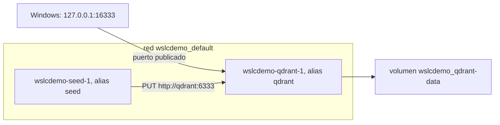

Para la mayoría de los desarrolladores C# y Java, los contenedores del día a día son un archivo `compose.yaml`: una base de datos, un broker de mensajes y a veces la propia aplicación, arrancados juntos con `docker compose up`. Spring Boot puede incluso arrancar ese archivo por ti cuando arranca la aplicación, y los desarrolladores .NET suelen tener uno junto a su solución. Así que la primera pregunta ante cualquier herramienta de contenedores nueva es si lee `compose.yaml`.

Para `wslc` 2.9.11, la respuesta es no. Esta lección muestra las comprobaciones que hay detrás de esa respuesta, un callejón sin salida que conviene conocer y lo que Compose hace realmente por debajo, para que puedas reproducir una pequeña stack con simples comandos `wslc`. Todas las salidas vienen del [diario](../journal/).

## Ningún comando `compose`

```text
> wslc compose --help
Unrecognized command: 'compose'
```

`wslc --help` tampoco lista ningún equivalente de Compose, y el [tutorial oficial](https://learn.microsoft.com/windows/wsl/tutorials/wsl-containers) no lo menciona. `wslc` 2.9.11 no admite Compose.

## Callejón sin salida: conectar `docker compose` al motor de la sesión

Con Docker Desktop, el comando `docker compose` es solo un cliente: habla con la API de Docker Engine a través de una named pipe o de un socket Unix. Así que la idea es tentadora: si la sesión `wslc` ejecuta un motor compatible, basta con apuntar Compose hacia él. La VM de la sesión sí ejecuta uno:

```text
> wslc system session run ps -eo pid,args
  131 /usr/bin/containerd --address /run/containerd/containerd.sock --root /var/lib/docker/containerd/daemon --state /run/docker/containerd/daemon
  132 /usr/bin/dockerd --containerd /run/containerd/containerd.sock
> wslc system session run ls -la /var/run/docker.sock
srw-rw---- 1 root docker 0 Sep 13 18:47 /var/run/docker.sock
```

`wslc system session run` ejecuta un comando en la propia VM de la sesión, no en un contenedor. Muestra `dockerd` y su socket. Pero hay tres puertas cerradas:

1. Nada expone ese socket a Windows: `wslc` no crea ninguna named pipe para él.
2. El propio cliente `docker` de la VM no funciona: `wslc system session run docker version` responde `The handle is invalid. Error code: ERROR_INVALID_HANDLE`.
3. No se puede montar en un contenedor que tenga la CLI de Docker y Compose, como `docker:cli`:

```powershell
wslc run --rm -e DOCKER_HOST=unix:///var/run/docker.sock -v /var/run/docker.sock:/var/run/docker.sock docker:cli docker ps
```

```text
Cannot connect to the Docker daemon at unix:///var/run/docker.sock. Is the docker daemon running?
```

La razón está en la tabla de montajes de ese contenedor. El origen de `-v` se lee como una ruta de **Windows**: `/var/run/docker.sock` se convirtió en `C:\var\run\docker.sock`, compartido mediante virtiofs, y no en el socket de la VM:

```text
drvfs on /run/docker.sock type virtiofs (rw,relatime)
```

:::caution[`wslc` crea un origen de bind mount que no existe]
Esta prueba dejó una carpeta vacía `C:\var\run\docker.sock\` en Windows: `wslc` crea el origen de un bind mount cuando no existe. Bórrala a mano después. La sintaxis larga tampoco ayuda: `--mount type=bind,source=/var/run/docker.sock,...` se rechaza con `The bind source path must be absolute.`
:::

El mismo muro detiene cualquier herramienta basada en la API de Docker Engine, como Testcontainers para .NET o Java: necesita un endpoint del lado de Windows. *Por verificar* en cada versión, ya que la superficie de la API de la versión preliminar puede cambiar.

## Lo que Compose hace realmente

Quita el YAML, y un proyecto Compose es un puñado de objetos con nombres predecibles. Toma este archivo de dos servicios, una base de datos qdrant y un contenedor `seed` de un solo uso que crea una colección en ella:

```yaml
services:
  qdrant:
    image: qdrant/qdrant:v1.19.1
    ports:
      - "127.0.0.1:16333:6333"
    volumes:
      - qdrant-data:/qdrant/storage

  seed:
    image: curlimages/curl:8.16.0
    depends_on:
      - qdrant
    command: >
      --silent --show-error --retry 10 --retry-connrefused --retry-delay 1
      -X PUT http://qdrant:6333/collections/demo
      -H "Content-Type: application/json"
      -d '{"vectors":{"size":4,"distance":"Cosine"}}'

volumes:
  qdrant-data:
```

`docker compose -p wslcdemo config` lo valida y muestra el modelo completamente resuelto, lo que hace visibles las partes implícitas:

- **una red por proyecto**, llamada `wslcdemo_default`, a la que se une cada servicio;
- **volúmenes con nombre** con el nombre del proyecto como prefijo, aquí `wslcdemo_qdrant-data`;
- **contenedores** llamados `<project>-<service>-<index>`, como `wslcdemo-qdrant-1`;
- **los nombres de servicio como nombres DNS** en la red del proyecto, por eso `seed` puede llamar a `http://qdrant:6333`;
- **el orden de arranque** a partir de `depends_on`, que solo ordena los arranques: no espera a que qdrant esté listo. Ese es el trabajo del `--retry-connrefused` de curl.

El diagrama muestra esos objetos para el proyecto `wslcdemo`.



## Nombres DNS en una red `wslc`

La pieza clave es la resolución de nombres entre contenedores. En una red creada con `wslc network create` funciona, incluidos los alias adicionales indicados con `--network-alias`. En la red por defecto, no:

```text
> wslc run --rm --network demo alpine wget -qO- http://qdrant:6333/
{"title":"qdrant - vector search engine","version":"1.19.1","commit":"6ab21cac18ebb6f4ae29102c7f8f5cc11affd5de"}
> wslc run --rm --network demo alpine wget -qO- http://vectors:6333/readyz      # --network-alias vectors
all shards are ready
> wslc run --rm alpine wget -qO- -T 5 http://qdrant:6333/                      # red por defecto
wget: bad address 'qdrant:6333'
```

En esa prueba, un contenedor qdrant llamado `qdrant` se ejecutaba en una red llamada `demo`, con el alias adicional `vectors`. Su nombre y cada uno de sus alias se resuelven para los demás contenedores de esa red. Es el mismo comportamiento que las redes definidas por el usuario de Docker, y la razón por la que Compose crea una por proyecto.

## La traducción, en PowerShell

Con esas piezas, el archivo se convierte en dos scripts. El código está en [`code/wsl-containers/compose`](https://github.com/spareilleux/learn/tree/main/code/wsl-containers/compose). `wslc-up.ps1`:

```powershell
# Equivalente de `docker compose -p wslcdemo up -d` para compose.yaml, con wslc
$project = 'wslcdemo'

# Lo que Compose crea implícitamente: una red por proyecto, volúmenes con nombre
wslc network create "${project}_default"
wslc volume create "${project}_qdrant-data"

# servicio qdrant (el nombre del servicio se convierte en un alias DNS en la red del proyecto)
wslc run -d --name "$project-qdrant-1" --network "${project}_default" --network-alias qdrant `
    -p 127.0.0.1:16333:6333 -v "${project}_qdrant-data:/qdrant/storage" qdrant/qdrant:v1.19.1

# servicio seed (depends_on solo ordena el arranque: curl reintenta hasta que qdrant responde)
wslc run --name "$project-seed-1" --network "${project}_default" --network-alias seed `
    curlimages/curl:8.16.0 --silent --show-error --retry 10 --retry-connrefused --retry-delay 1 `
    -X PUT http://qdrant:6333/collections/demo -H 'Content-Type: application/json' `
    -d '{"vectors":{"size":4,"distance":"Cosine"}}'
```

`wslc-down.ps1`:

```powershell
# Equivalente de `docker compose -p wslcdemo down --volumes`
$project = 'wslcdemo'
wslc container stop "$project-qdrant-1"
wslc container remove "$project-qdrant-1" "$project-seed-1"
wslc network remove "${project}_default"
wslc volume remove "${project}_qdrant-data"
```

| `compose.yaml` | `wslc` |
|---|---|
| el proyecto | un prefijo `$project` en cada nombre |
| la red por defecto implícita | `wslc network create "${project}_default"` |
| `volumes:` en el nivel superior | `wslc volume create` |
| un servicio | `wslc run --name <project>-<service>-1 --network … --network-alias <service>` |
| `ports:` | `-p 127.0.0.1:16333:6333` |
| `command:` | los argumentos después del nombre de la imagen |
| `depends_on:` | el orden de las líneas en el script |
| `down --volumes` | `stop`, `remove`, y luego `network remove` y `volume remove` |

:::note[Comillas de JSON en PowerShell]
El `-d '{"vectors":…}'` del seed pasa comillas dobles a un programa nativo. La ejecución de abajo funcionó; *por verificar* en Windows PowerShell 5.1, cuyo paso de argumentos a programas nativos es conocido por eliminar las comillas dobles incrustadas. Los archivos JSON de la [lección 7](../07-volumes-and-a-real-service/) evitan la cuestión por completo.
:::

## El resultado

Tras `wslc-up.ps1`, `wslc container list --all` muestra el seed ya terminado y qdrant en ejecución:

```text
CONTAINER ID   IMAGE                  COMMAND                  CREATED         STATUS                              PORTS                       NAMES
28be34e431f5   curlimages/curl:8.1…   "/entrypoint.sh --si…"   1 second ago    Exited (0) Less than a second ago                               wslcdemo-seed-1
c1f82d52d6ca   qdrant/qdrant:v1.19…   "./entrypoint.sh"        2 seconds ago   Up 1 second                         127.0.0.1:16333->6333/tcp   wslcdemo-qdrant-1
> wslc logs wslcdemo-seed-1
{"result":true,"status":"ok","time":0.409039704}
> curl.exe http://127.0.0.1:16333/collections
{"result":{"collections":[{"name":"demo"}]},"status":"ok","time":0.00004439}
```

El seed salió con el código 0, su log es la respuesta de qdrant al `PUT`, y la colección `demo` existe. Tras `wslc-down.ps1`, no queda ningún contenedor, solo las redes por defecto `bridge`, `host` y `none`, y ningún volumen.

En GitHub Actions, los runners alojados no tienen el servicio WSL containers, así que la CI no puede ejecutar estos scripts. En su lugar ejecuta el `compose.yaml` original con Docker Compose y comprueba que el seed crea la colección: eso demuestra que el archivo que traducen los scripts es correcto.

## Los health checks existen, `condition: service_healthy` no

Compose puede esperar a que un servicio esté **sano** antes de arrancar el siguiente, con `depends_on` y `condition: service_healthy`. La espera es cosa de Compose; el health check en sí es del motor, y `wslc run --help` lista las opciones: `--health-cmd`, `--health-interval`, `--health-retries`, `--health-start-period` y `--health-timeout`. Una prueba para esta lección, con un contenedor que solo está listo al cabo de seis segundos:

```powershell
wslc run -d --name hc --health-cmd 'test -f /tmp/ready' --health-interval 2s alpine sh -c 'sleep 6; touch /tmp/ready; sleep 60'
wslc container list
```

```text
CONTAINER ID   IMAGE    COMMAND                  CREATED         STATUS                            PORTS   NAMES
1f3750e9e55b   alpine   "sh -c 'sleep 6; tou…"   4 seconds ago   Up 3 seconds (health: starting)           hc
```

Ocho segundos después:

```text
CONTAINER ID   IMAGE    COMMAND                  CREATED          STATUS                    PORTS   NAMES
1f3750e9e55b   alpine   "sh -c 'sleep 6; tou…"   12 seconds ago   Up 11 seconds (healthy)           hc
```

`wslc container inspect hc` también tiene un objeto `"Health"`, con un contador `FailingStreak` y un `Log` de las últimas comprobaciones. Así que un script puede reproducir `service_healthy` consultando el estado hasta que diga `(healthy)` antes de ejecutar el siguiente servicio. El comando de salud se ejecuta dentro del contenedor, así que solo puede usar las herramientas de la imagen.

## Lo que el script no te da

Para una stack de dos o tres servicios, un script reproduce lo esencial: la red, los volúmenes, los nombres DNS y el orden de arranque. Lo que no reproduce:

- **la lectura de `compose.yaml`**: el archivo y el script pueden divergir, y nada lo comprueba;
- **`depends_on` con `condition: service_healthy`**: el health check se ejecuta, pero la espera es un bucle que escribes tú;
- **un `up` basado en diferencias**, que solo recrea los servicios cuya configuración cambió; el script vuelve a ejecutar todos los comandos, y queda *por verificar* cómo se comporta cada `create` y cada `run` cuando su objeto ya existe;
- **`logs -f` sobre todos los servicios**, intercalados y coloreados por servicio;
- **los perfiles, `extends`, la interpolación de `.env`** y el resto de la [especificación de Compose](https://compose-spec.io/).

Para un proyecto Compose real, Docker Desktop o Podman siguen siendo la herramienta. `wslc` encaja con un conjunto pequeño y estable de servicios, o con una aplicación Windows que arranca sus propios contenedores ([lección 9](../09-csharp-api/)).

## Puntos clave

- `wslc` 2.9.11 no tiene comando `compose` y no expone a Windows el motor Docker de su sesión, así que ni `docker compose` ni otros clientes de la API de Docker pueden usarlo.
- `-v /var/run/docker.sock:…` monta una ruta de Windows, no el socket de la VM, y `wslc` crea en silencio un origen de bind mount que no existe.
- Compose añade una red por proyecto, volúmenes con prefijo, nombres de contenedor predecibles, nombres DNS para los servicios y un orden de arranque.
- En una red creada con `wslc network create`, los nombres de contenedor y los valores de `--network-alias` se resuelven; en la red por defecto, no.
- `depends_on` solo ordena el arranque. La disponibilidad es trabajo del cliente, aquí con el `--retry-connrefused` de curl, o de un bucle que espera el estado `(healthy)` de un `--health-cmd`.
- Un script puede traducir una stack pequeña, pero no lee el YAML, no espera a los health checks salvo que escribas el bucle y no compara la stack en ejecución con el archivo.

## Ejercicios

1. Dentro del contenedor `seed`, la URL es `http://qdrant:6333`. Desde Windows, es `http://127.0.0.1:16333`. Explica cada parte de las dos URL.

<details>
<summary>Solución</summary>

`qdrant` es el alias DNS del contenedor qdrant en la red del proyecto, que solo pueden resolver los demás contenedores de esa red, y 6333 es el puerto en el que qdrant escucha dentro de su contenedor. Desde Windows, la red de contenedores no es accesible: pasas por el puerto publicado, `127.0.0.1:16333`, que `wslc` reenvía al puerto 6333 del contenedor.

</details>

2. Quitas `--retry 10 --retry-connrefused --retry-delay 1` del comando del seed, porque `depends_on` ya está ahí. ¿Qué puede salir mal y por qué?

<details>
<summary>Solución</summary>

`depends_on`, igual que el orden de las líneas del script, solo garantiza que el contenedor qdrant **arrancó** primero, no que qdrant esté **escuchando**. Si curl se ejecuta en el intervalo entre ambos, la conexión se rechaza, curl sale con un error y la colección nunca se crea. En la prueba de arriba, el seed arrancó un segundo después de qdrant: una carrera que por casualidad se gana no es una garantía. Los reintentos convierten la carrera en una espera.

</details>

3. Modifica los scripts para que `down` conserve los datos, como `docker compose down` sin `--volumes`. ¿Qué pasa en el siguiente `up`?

<details>
<summary>Solución</summary>

Quita la última línea de `wslc-down.ps1`, `wslc volume remove`, y actualiza su comentario. En el siguiente `up`, `wslc volume create "${project}_qdrant-data"` se encuentra con un volumen existente: queda *por verificar* si `wslc` informa de un error o lo reutiliza. El contenedor qdrant monta entonces el volumen antiguo, y el `PUT` del seed apunta a una colección que ya existe, que qdrant puede rechazar. En cualquier caso los datos siguen ahí, lo que puedes comprobar con `curl.exe http://127.0.0.1:16333/collections`.

</details>

4. Un contenedor en la red por defecto ejecuta `wget http://qdrant:6333/` y obtiene `bad address`. Da dos correcciones.

<details>
<summary>Solución</summary>

La resolución de nombres solo funciona en una red definida por el usuario. O bien ejecutas el cliente en la misma red que qdrant, con `--network demo`, o bien, para un contenedor que ya está en ejecución, lo conectas con `wslc network connect demo <container>`. El segundo comando aparece en `wslc network --help`; *por verificar:* su efecto sobre un contenedor en ejecución en la 2.9.11.

</details>

5. Escribe la línea `wslc run` de un tercer servicio, una caché `redis:8` accesible desde los demás contenedores como `cache`, sin ningún puerto publicado hacia Windows.

<details>
<summary>Solución</summary>

```powershell
wslc run -d --name "$project-redis-1" --network "${project}_default" --network-alias cache redis:8
```

Sin `-p`, porque solo la necesitan los contenedores de la red del proyecto. Añade `wslc container stop` y `remove` de `$project-redis-1` al script `down`. *Por verificar:* esta línea no se ejecutó; la etiqueta `redis:8` tiene que existir en Docker Hub cuando la pruebes.

</details>

## Fuentes

- [Introducción a los contenedores en WSL — Microsoft Learn](https://learn.microsoft.com/windows/wsl/tutorials/wsl-containers)
- [WSL container — Microsoft Learn](https://learn.microsoft.com/windows/wsl/wsl-container)
- [Especificación de Compose](https://compose-spec.io/) y [Networking in Compose](https://docs.docker.com/compose/how-tos/networking/) — documentación de Docker
- [Referencia de Dockerfile: `HEALTHCHECK`](https://docs.docker.com/reference/dockerfile/#healthcheck) — documentación de Docker (las opciones `--health-*` de `run` lo sustituyen)
- [Control startup order in Compose](https://docs.docker.com/compose/how-tos/startup-order/) — documentación de Docker
- [Página de manual de curl: `--retry-connrefused`](https://curl.se/docs/manpage.html#--retry-connrefused)
- [Documentación de qdrant](https://qdrant.tech/documentation/)
