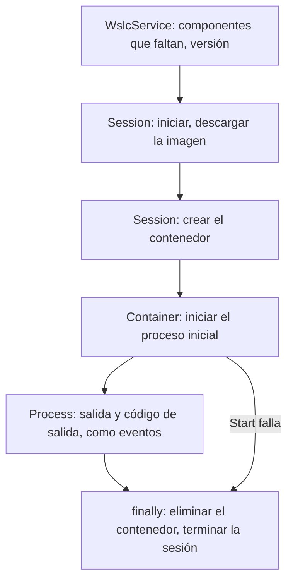
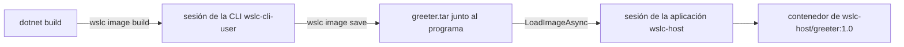

Si ya has arrancado contenedores desde código .NET o Java, seguramente lo hiciste mediante un cliente de Docker: [Testcontainers](https://testcontainers.com/) para las pruebas de integración, o las bibliotecas Docker.DotNet y docker-java. Todos hablan HTTP con la Docker Engine API, a través de una named pipe o de un socket, y comparten un único motor con todas las demás herramientas de la máquina.

La API de WSL container funciona de otra manera. [`Microsoft.WSL.Containers`](https://www.nuget.org/packages/Microsoft.WSL.Containers) es un paquete NuGet al que una **aplicación Windows** llama dentro de su propio proceso. La aplicación crea su propia **sesión**, con su propia VM, su propio disco y sus propios límites, y luego descarga imágenes y ejecuta contenedores en ella. No hay ningún demonio que instalar ni ningún socket que encontrar: si WSL 2.9 o posterior está presente, la aplicación puede usar contenedores Linux como parte de su propia lógica.

Esta lección construye el programa útil más pequeño posible, tropieza con lo que la documentación preliminar dice mal y luego va un paso más allá: una imagen construida durante `dotnet build` y distribuida como un archivo junto al programa. El código está en [`code/wsl-containers/wslc-host`](https://github.com/spareilleux/learn/tree/main/code/wsl-containers/wslc-host); las salidas vienen del [diario](../journal/), con el paquete 2.9.9 en WSL 2.9.11.

## Los objetos

La API sigue el ciclo de vida de un contenedor:

| Objeto | Función |
|---|---|
| `WslcService` | comprobar que los componentes de WSL están instalados, versión del servicio |
| `Session` | host WSL que gestiona las imágenes y crea los contenedores |
| `Container` | iniciar, detener, inspeccionar, eliminar; lanzar procesos |
| `Process` | leer `stdout`/`stderr`, escribir en `stdin`, enviar señales |

Si conoces la CLI de Docker, una `Session` hace el papel del motor, `Container` el de `docker create`, `start`, `inspect` y `rm`, y `Process` el de la salida adjunta de `docker run` o `docker exec`.

## Un proyecto que compila

Parte del extracto de la [página de Microsoft Learn](https://learn.microsoft.com/windows/wsl/wsl-container), pégalo en un proyecto de consola que referencie el paquete, y el build falla con cinco errores:

```text
error CS0103: The name 'ComponentFlags' does not exist in the current context
error CS0117: 'SessionSettings' does not contain a definition for 'MemoryMB'
error CS0117: 'ProcessSettings' does not contain a definition for 'CmdLine'
error CS0103: The name 'DeleteContainerFlags' does not exist in the current context
error CS1705: Assembly 'wslcsdkcs' with identity 'wslcsdkcs, Version=1.0.0.0, Culture=neutral, PublicKeyToken=null' uses 'Microsoft.Windows.SDK.NET, Version=10.0.26100.79, Culture=neutral, PublicKeyToken=31bf3856ad364e35' which has a higher version than referenced assembly 'Microsoft.Windows.SDK.NET' with identity 'Microsoft.Windows.SDK.NET, Version=10.0.19041.38, Culture=neutral, PublicKeyToken=31bf3856ad364e35'
```

### Cuatro nombres han cambiado

La página describe un estado anterior de la API. Los nombres reales se obtienen leyendo los tipos públicos de `wslcsdkcs.dll`, el ensamblado administrado del paquete, con [`MetadataLoadContext`](https://learn.microsoft.com/dotnet/standard/assembly/inspect-contents-using-metadataloadcontext), que carga un ensamblado para inspeccionarlo sin ejecutarlo:

| Microsoft Learn | Paquete 2.9.9 |
|---|---|
| `ComponentFlags GetMissingComponents()` | `IReadOnlyList<Component> GetMissingComponents()` (`VirtualMachinePlatform`, `WslPackage`, `SdkNeedsUpdate`) |
| `SessionSettings.MemoryMB` | `SessionSettings.MemorySizeInMB` |
| `ProcessSettings.CmdLine` | `ProcessSettings.CommandLine` (`IList<string>`) |
| `DeleteContainerFlags.None` | `DeleteContainerOption.None` / `Force` |

En un IDE, el examinador de objetos o Ir a definición muestran lo mismo. Con un paquete en versión preliminar, fíate más del compilador que de la página.

### `CS1705`: la proyección del SDK de Windows

El paquete es una proyección [C#/WinRT](https://learn.microsoft.com/windows/apps/develop/platform/csharp-winrt/), con una DLL nativa solo para x64 y arm64. Declara el destino `net8.0-windows10.0.19041.0`, pero su `wslcsdkcs.dll` está compilado con `Microsoft.Windows.SDK.NET` 10.0.26100.79, una proyección más reciente que la que aporta ese destino.

Pasar el proyecto a `net10.0-windows10.0.26100.0` no basta: el SDK de .NET elige entonces la proyección 10.0.26100.38, y el error persiste. Hay que forzar la versión con `WindowsSdkPackageVersion`, y la propia `10.0.26100.79` no existe en nuget.org: `NU1102`, y la más cercana es `10.0.26100.80`. El archivo de proyecto que funciona:

```xml
<PropertyGroup>
  <OutputType>Exe</OutputType>
  <TargetFramework>net10.0-windows10.0.26100.0</TargetFramework>
  <WindowsSdkPackageVersion>10.0.26100.80</WindowsSdkPackageVersion>
  <RuntimeIdentifier>win-x64</RuntimeIdentifier>
</PropertyGroup>
<ItemGroup>
  <PackageReference Include="Microsoft.WSL.Containers" Version="2.9.9" />
</ItemGroup>
```

`RuntimeIdentifier` elige la DLL nativa; usa `win-arm64` en una máquina Arm.

## El programa

```csharp
using System.Runtime.InteropServices;
using System.Text;
using Microsoft.WSL.Containers;

const string ContainerName = "wslc-host-hello";

var missing = WslcService.GetMissingComponents();
if (missing.Count > 0)
{
    Console.WriteLine($"Missing WSL components: {string.Join(", ", missing)} (run wsl --install)");
    return 1;
}
var version = WslcService.GetVersion();
Console.WriteLine($"WSL container service {version.Major}.{version.Minor}.{version.Revision}");

// La sesión guarda sus imágenes y contenedores en su propio storage.vhdx.
var storage = Path.Combine(Environment.GetFolderPath(Environment.SpecialFolder.LocalApplicationData), "WslcHost");
using var session = new Session(new SessionSettings("wslc-host", storage)
{
    CpuCount = 2,
    MemorySizeInMB = 2048
});
session.Start();
Console.WriteLine($"Session started, storage in {storage}");

// Un contenedor dejado por una ejecución que falló sobrevive en storage.vhdx y bloquea el nombre.
try
{
    using var leftover = session.OpenContainer(ContainerName, ProcessOutputMode.Discard);
    leftover.Delete(DeleteContainerOption.Force);
    Console.WriteLine($"Removed leftover container {ContainerName}");
}
catch (COMException) { }

await session.PullImageAsync(new PullImageOptions("docker.io/library/alpine:latest"));
foreach (var image in session.GetImages())
    Console.WriteLine($"Image {image.Name} ({image.Size / 1024 / 1024} MB)");

using var container = session.CreateContainer(new ContainerSettings("alpine:latest")
{
    Name = ContainerName,
    InitProcess = new ProcessSettings
    {
        CommandLine = args.Length > 0 ? [.. args] : ["/bin/sh", "-c", "echo Hello from $(cat /etc/alpine-release) on $(uname -r)"],
        OutputMode = ProcessOutputMode.Event
    }
});

try
{
    var exited = new TaskCompletionSource<int>();
    container.InitProcess.OutputReceived += data => Console.Write(Encoding.UTF8.GetString(data));
    container.InitProcess.Exited += code => exited.TrySetResult(code);
    container.Start();

    var exitCode = await exited.Task.WaitAsync(TimeSpan.FromMinutes(2));
    Console.WriteLine($"Container {container.Id[..12]} exited with code {exitCode}");
    return exitCode;
}
finally
{
    container.Delete(DeleteContainerOption.Force);
    session.Terminate();
}
```

Algunas cosas que un lector de C# reconocerá:

- La `Session` y el `Container` son `IDisposable`, así que `using var` libera sus handles nativos al final del método.
- La salida llega como **eventos**: `OutputReceived` con los bytes en bruto y `Exited` con el código de salida. Un [`TaskCompletionSource<int>`](https://learn.microsoft.com/dotnet/api/system.threading.tasks.taskcompletionsource-1) convierte el evento de salida en una tarea, y `WaitAsync` le pone un tiempo límite.
- Los errores del lado nativo aparecen como [`COMException`](https://learn.microsoft.com/dotnet/api/system.runtime.interopservices.comexception), o como `ArgumentException` para un parámetro no válido.
- Los argumentos de la línea de comandos, si se dan, sustituyen al comando por defecto: `dotnet run -- /bin/cat /etc/os-release` ejecuta ese comando en su lugar.

```text
WSL container service 2.9.11
Session started, storage in C:\Users\spare\AppData\Local\WslcHost
Image alpine:latest (8 MB)
Hello from 3.24.1 on 6.18.40.1-microsoft-standard-WSL2
Container b27dd2f80927 exited with code 0
```

La ejecución completa tardó 7 segundos, incluida la descarga de `alpine` en una sesión nueva y vacía. El contenedor ve los límites de la sesión, no los de `settings.yaml`: `nproc` mostró `2`, y `free -m` un total de `1907` MB para `MemorySizeInMB = 2048`.

El programa usa los cuatro objetos en orden, y su bloque finally limpia incluso cuando el contenedor no arranca.



## Dónde aparece la sesión de la aplicación

Mientras se ejecutaba un contenedor de 20 segundos, la CLI veía la sesión de la aplicación junto a sus dos propias sesiones:

```text
> wslc system session list
ID   Creator PID   Display Name
6    350476        wslc-cli-admin-spare
8    275812        wslc-cli-spare
16   110952        wslc-host
> Get-Process vmmem*
vmmemCmZygote     0
vmmemWSL       3307
vmmemwslc-host  510
> wslc --session wslc-host container list
CONTAINER ID   IMAGE           COMMAND                  CREATED         STATUS         PORTS   NAMES
2e75803c92a9   alpine:latest   "/bin/sh -c 'echo st…"   4 seconds ago   Up 3 seconds           wslc-host-hello
```

- La sesión de la aplicación es una sesión `wslc` normal: el mismo tipo de VM `vmmem<session>`, visible y controlable desde la CLI con `--session`. Es la primera herramienta a la que recurrir cuando el programa se comporta mal.
- Su disco está donde lo eligió la aplicación, `%LocalAppData%\WslcHost\storage.vhdx`, 67 MB tras la descarga, no bajo `%LocalAppData%\wslc\sessions`.
- Sus límites vienen de `SessionSettings`: las sesiones de la CLI tienen 8 CPU en esta máquina, y los contenedores de la aplicación ven 2.
- Tras `session.Terminate()`, la sesión y su proceso `vmmem` desaparecen de inmediato, sin el retardo de inactividad de 30 segundos de las sesiones de la CLI ([lección 6](../06-resources-and-limits/)).

## Trampa: un arranque fallido deja el contenedor atrás

La primera versión del programa no limpiaba contenedores sobrantes ni tenía `Delete` en un `finally`. Una ejecución lanzada desde Git Bash con `/bin/sh` como argumento falló: MSYS, la capa que ejecuta Bash en Windows, convirtió la ruta con aspecto de Linux en `C:/Program Files/Git/usr/bin/sh`, y `container.Start()` lanzó:

```text
Unhandled exception. System.ArgumentException: The parameter is incorrect.

failed to create task for container: failed to create shim task: OCI runtime create failed: runc create failed: unable to start container process: error during container init: exec: "C:/Program Files/Git/usr/bin/sh": stat C:/Program Files/Git/usr/bin/sh: no such file or directory: unknown
```

La siguiente ejecución, con un comando correcto, falló antes, en `CreateContainer`:

```text
Unhandled exception. System.Runtime.InteropServices.COMException (0x800700B7): Cannot create a file when that file already exists.

Conflict. The container name "/wslc-host-hello" is already in use by container "176a59b772bebfb974a8404150407157d49cc279cbe2f66c2d6e2788f9bfbadc". You have to remove (or rename) that container to be able to reuse that name.
```

El contenedor se había creado, nunca se inició, y sobrevivió al proceso en `storage.vhdx`. El programa de arriba tiene las dos correcciones: `Delete(DeleteContainerOption.Force)` en un `finally` y, al arrancar, `OpenContainer` seguido de `Delete` de un contenedor sobrante con el mismo nombre, donde una `COMException` simplemente significa que no hay ninguno. Verificado: el contenedor sobrante se eliminó (`Removed leftover container wslc-host-hello`), y un comando que no existe, `/nope`, ya no deja nada atrás.

Es la misma disciplina que con cualquier recurso no administrado: un objeto nativo creado por tu proceso no desaparece con el proceso.

## Construir la imagen durante `dotnet build`

Descargar `alpine` de Docker Hub está bien para una prueba. Una aplicación real distribuye su propia imagen, y el paquete tiene una forma de construirla junto con el programa. Sus targets MSBuild, en `build\Microsoft.WSL.Containers.common.targets`, añaden un elemento `WslcImage`: después de `Build`, ejecutan `wslc image build` y luego `wslc image save` hacia un `.tar` junto al programa. Un proyecto de prueba:

```xml
<ItemGroup>
  <PackageReference Include="Microsoft.WSL.Containers" Version="2.9.9" />
  <WslcImage Include="greeter" Image="wslc-host/greeter:1.0" Dockerfile="container/Containerfile" Context="container/" />
</ItemGroup>
```

```dockerfile
FROM docker.io/library/alpine:3.24
COPY greet.sh /usr/local/bin/greet
RUN chmod +x /usr/local/bin/greet
ENTRYPOINT ["/usr/local/bin/greet"]
```

La primera trampa es la de la [lección 2](../02-installation/): los targets llaman a `wslc` sin ruta, así que una terminal o un IDE abiertos antes de actualizar WSL no lo encuentran:

```text
error WSLC0001: The wslc CLI check failed: 'wslc --version' returned exit code 9009. Install WSL by running 'wsl --install --no-distribution', or set the WslcCliPath property to a specific wslc.exe path.
```

Con `-p:WslcCliPath="C:\Program Files\WSL\wslc.exe"`, o desde una terminal nueva:

```text
  WSLC: Building image 'wslc-host/greeter:1.0'...
    | naming to docker.io/wslc-host/greeter:1.0
  WSLC: Saving image 'wslc-host/greeter:1.0' to 'bin\Debug\net10.0-windows10.0.26100.0\win-x64\greeter.tar'...
Build succeeded.
```

Tardó 9 segundos y produjo un `greeter.tar` de 8,3 MB. La imagen se construye en la sesión de la CLI, `wslc-cli-spare`, donde se queda.

La construcción es incremental. El target compara los archivos de `Context`, y un archivo `wslc.greeter.options` que guarda las opciones, con el `.tar`:

| Cambio | `dotnet build` | `.tar` |
|---|---|---|
| ninguno | 1 s, ninguna línea `WSLC:` | sin cambios |
| `greet.sh` tocado | 2 s, reconstruida (caché de capas) | reescrito |
| `echo edited` añadido a `greet.sh` | 3 s, reconstruida | reescrito |
| ninguno | 2 s, ninguna línea `WSLC:` | sin cambios |

Cada cambio real deja la imagen anterior sin etiqueta, como `<none>`, en la sesión de la CLI. Para eso sirve la propiedad `WslcPruneAfterBuild`.

### Cargar el `.tar` en la sesión de la aplicación

[`LoadImageAsync`](https://wsl.dev/api-reference/), el equivalente de `wslc load`, conserva la etiqueta y el `ENTRYPOINT`. `CommandLine` pasa entonces argumentos al entrypoint, como `docker run image args`:

```csharp
await session.LoadImageAsync(Path.Combine(AppContext.BaseDirectory, "greeter.tar"));
// ... new ContainerSettings("wslc-host/greeter:1.0") con CommandLine = ["Claude"]
```

```text
before: 
load 427 ms
after: wslc-host/greeter:1.0
Hello Claude from an image built by dotnet build (alpine 3.24.1)
edited
exit 0
```

La sesión no tenía ninguna imagen antes, y la carga tardó 427 ms. La cadena completa funciona sin registro: `dotnet build` produce la imagen, el `.tar` se distribuye con el programa y el programa lo carga en su propia sesión.



### `ImportImageAsync` es otra cosa

`ImportImageAsync`, el equivalente de `wslc import`, espera un **sistema de archivos plano**, como el que produce `wslc export` a partir de un contenedor. Con el `.tar` de `image save`, un layout OCI que empieza por `blobs/sha256/…`, acepta el archivo, pero la imagen resultante no tiene entrypoint, así que `CommandLine = ["Claude"]` falla con `exec: "Claude": executable file not found in $PATH`, y tampoco tiene `/bin/sh`:

```text
failed to create task for container: failed to create shim task: OCI runtime create failed: runc create failed: unable to start container process: error during container init: exec: "/bin/sh": stat /bin/sh: no such file or directory: unknown
```

Comprobado con la CLI: `wslc export` de un contenedor Alpine, luego `wslc import`, y después `wslc run --rm exptest/rootfs:1 /bin/cat /etc/alpine-release` mostró `3.24.1`, e `image inspect` mostró `"Cmd": null` y `"Entrypoint": null`. `save` y `load` transportan una imagen; `export` e `import` transportan un sistema de archivos.

:::caution[Sin red por defecto]
Un contenedor creado por la API recibe `NetworkMode: none`: ninguna interfaz aparte de `lo`, y sin acceso a internet, a diferencia de `wslc run`. Define `NetworkingMode = ContainerNetworkingMode.Bridged` en `ContainerSettings` para un servicio que llame al exterior o publique puertos. La medición está en la [lección 10](../10-networking-kubernetes-gui/).
:::

## Integración continua

En GitHub Actions, los runners Windows alojados no tienen el servicio WSL containers. El [workflow](https://github.com/spareilleux/learn/blob/main/.github/workflows/wsl-containers-examples.yml) de este curso solo **compila** `wslc-host`, lo que al menos detecta los errores del tipo `CS0117` y `CS1705` cuando el paquete cambia. Ejecutarlo requiere una máquina Windows con WSL 2.9 o posterior.

## Puntos clave

- `Microsoft.WSL.Containers` se ejecuta en el proceso de la aplicación: sin demonio, sin socket, y con una sesión propia, con su propia VM, su propio disco y sus propios límites.
- El paquete 2.9.9 necesita `net10.0-windows10.0.26100.0`, `WindowsSdkPackageVersion` 10.0.26100.80 y un identificador de runtime; si no, el build falla con `CS1705`.
- El extracto de Microsoft Learn usa nombres antiguos: `GetMissingComponents` devuelve una lista, y las propiedades son `MemorySizeInMB`, `CommandLine` y `DeleteContainerOption`.
- La sesión de la aplicación es una sesión normal: `wslc --session <name>` lista e inspecciona sus contenedores.
- Un contenedor que no arranca sobrevive al proceso. Elimínalo en un `finally`, y elimina los sobrantes al arrancar.
- Un elemento `WslcImage` construye y guarda una imagen durante `dotnet build`; carga el `.tar` con `LoadImageAsync`, no con `ImportImageAsync`.
- Los contenedores de la API no tienen red a menos que `NetworkingMode` sea `Bridged`.

## Ejercicios

1. Reescribe estas tres líneas de la página de Microsoft Learn para que compilen con el paquete 2.9.9:

```csharp
if (WslcService.GetMissingComponents() != ComponentFlags.None) return 1;
var settings = new SessionSettings("demo", storage) { MemoryMB = 1024 };
container.Delete(DeleteContainerFlags.None);
```

<details>
<summary>Solución</summary>

```csharp
if (WslcService.GetMissingComponents().Count > 0) return 1;
var settings = new SessionSettings("demo", storage) { MemorySizeInMB = 1024 };
container.Delete(DeleteContainerOption.None);
```

`GetMissingComponents` devuelve un `IReadOnlyList<Component>`, vacío cuando todo está instalado. *Por verificar:* estas tres líneas se comprobaron con los nombres leídos del ensamblado, no se compilaron por separado.

</details>

2. Tu programa se cerró de golpe durante una ejecución. La siguiente ejecución lanza `COMException (0x800700B7)` con `Conflict. The container name … is already in use`. ¿Cómo sales de este estado desde la línea de comandos, sin cambiar el código?

<details>
<summary>Solución</summary>

El contenedor sobrante está en la sesión de la aplicación, no en la sesión de la CLI. Indica la sesión con la opción global:

```powershell
wslc --session wslc-host container list --all
wslc --session wslc-host container remove wslc-host-hello
```

Esto solo funciona mientras la sesión de la aplicación está en marcha; queda *por verificar* si la CLI puede abrir por su nombre una sesión de aplicación detenida. La corrección duradera está en el código: `Delete` en un `finally`, y eliminar el contenedor sobrante al arrancar.

</details>

3. ¿Por qué el programa pasa `ProcessOutputMode.Event` para el proceso inicial, y qué perderías con `ProcessOutputMode.Discard`, el modo usado para abrir el contenedor sobrante?

<details>
<summary>Solución</summary>

Con `Event`, el proceso emite `OutputReceived` por cada fragmento de salida, que el programa escribe en la consola. Con `Discard`, la salida se descarta: está bien para un contenedor que solo abres para eliminarlo, pero ya no verías `Hello from 3.24.1 …`. El código de salida sigue llegando por `Exited` en los dos casos, *por verificar* con `Discard`.

</details>

4. Una persona de tu equipo compila el proyecto en Visual Studio y obtiene `WSLC0001` con el código de salida 9009, mientras que `wslc --version` funciona en su terminal. Explícalo y da dos soluciones.

<details>
<summary>Solución</summary>

El código de salida 9009 significa «comando no encontrado». Visual Studio se inició antes de instalar WSL 2.9 y conservó el `PATH` antiguo, así que el target MSBuild no encuentra `wslc` sin ruta. O bien reinicia Visual Studio, para que herede el nuevo `PATH`, o bien define la propiedad en el proyecto o en la línea de comandos: `-p:WslcCliPath="C:\Program Files\WSL\wslc.exe"`.

</details>

5. Recibes dos archivos: `app.tar`, hecho con `wslc save`, y `rootfs.tar`, hecho con `wslc export`. ¿Qué método de la API carga cada uno, y qué tienes que añadir cuando ejecutas el segundo?

<details>
<summary>Solución</summary>

`app.tar` es una imagen con sus capas y su configuración: cárgala con `LoadImageAsync`, y conserva su etiqueta y su `ENTRYPOINT`. `rootfs.tar` es solo un sistema de archivos: cárgalo con `ImportImageAsync`. La imagen resultante no tiene `Cmd` ni `Entrypoint`, así que debes dar el comando completo en `CommandLine`, empezando por un ejecutable que exista en ese sistema de archivos, como `/bin/cat`.

</details>

## Fuentes

- [WSL container — Microsoft Learn](https://learn.microsoft.com/windows/wsl/wsl-container): presentación y ejemplo de la API
- [Referencia de la API de WSL container](https://wsl.dev/api-reference/), y los ejemplos completos en [aka.ms/wslc-samples](https://aka.ms/wslc-samples)
- [`Microsoft.WSL.Containers` — NuGet](https://www.nuget.org/packages/Microsoft.WSL.Containers)
- [C#/WinRT — Microsoft Learn](https://learn.microsoft.com/windows/apps/develop/platform/csharp-winrt/)
- [Inspect assembly contents using MetadataLoadContext — Microsoft Learn](https://learn.microsoft.com/dotnet/standard/assembly/inspect-contents-using-metadataloadcontext)
- [Target frameworks: OS version in TFMs — Microsoft Learn](https://learn.microsoft.com/dotnet/standard/frameworks#support-older-os-versions)
- [Testcontainers](https://testcontainers.com/)
