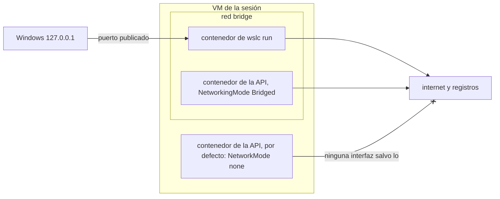

Docker Desktop es más que un motor. Tiene un panel, una casilla de Kubernetes, un mercado de extensiones y una configuración de red en la que la mayoría de los desarrolladores nunca tienen que pensar: publicas un puerto, abres `localhost` y listo. Esta última lección compara esas partes una a una con `wslc` 2.9.11, desde la más útil en el día a día, la red, hasta lo que simplemente no existe.

Las salidas vienen del [diario](../journal/), salvo la comprobación de las capacidades del contenedor de la CLI, que se volvió a ejecutar para esta lección.

## Dónde escucha un puerto publicado

Por defecto, `wslc` publica solo en `127.0.0.1`, como has visto en cada columna `PORTS` desde la [lección 3](../03-first-containers/):

```text
CONTAINER ID   IMAGE   COMMAND                  CREATED         STATUS         PORTS                    NAMES
1796028d1f6a   nginx   "/docker-entrypoint.…"   3 seconds ago   Up 2 seconds   127.0.0.1:8080->80/tcp   web
```

Docker Desktop, en cambio, publica en todas las direcciones, IPv4 e IPv6, salvo que indiques una. En Windows, el listener del contenedor de `wslc` pertenece a un proceso `dllhost`:

```text
TCP  0.0.0.0:8080     LISTENING  com.docker.backend
TCP  [::]:8080        LISTENING  com.docker.backend
TCP  127.0.0.1:8080   LISTENING  dllhost      ← wslc
TCP  [::1]:8080       LISTENING  wslrelay
```

Esa tabla viene de la prueba de conflicto de puertos de la [lección 5](../05-wslc-vs-docker/), con Docker Desktop y `wslc` en el mismo puerto. Dos opciones de `settings.yaml` cambian este comportamiento ([lección 6](../06-resources-and-limits/)):

- `defaultBindingAddress`, `127.0.0.1` por defecto, es la dirección que usa `-p` cuando no indicas ninguna;
- `hostLoopback` se refiere a la otra dirección del tráfico: el nombre `host.wslc.internal`, para un contenedor que necesita llegar a un servicio que se ejecuta en Windows. *Por verificar:* el nombre se leyó en el archivo de configuración, no se probó desde un contenedor.

Se acepta una dirección explícita en `-p`: `wslc run -d -p 0.0.0.0:8082:80 nginx` arrancó sin ningún error, y `127.0.0.1:8082` llegó a él. *Por verificar:* si ese puerto es entonces accesible desde otra máquina de la red, lo que también depende del firewall de Windows.

Es un valor por defecto seguro para una máquina de desarrollo: una base de datos o un broker de mensajes en un contenedor no tiene ninguna razón para ser accesible desde la red local.

## Las redes de una sesión

Cada sesión ejecuta su propio motor, así que cada una tiene sus propias redes. El mismo `wslc network list`, desde la sesión de administrador:

```text
> wslc network list
d9c6879f7df3   bridge    bridge    local
0dd65e6d15ec   host      host      local
34ad73ecd806   none      null      local
```

Las tres redes por defecto son las de Docker: `bridge`, a la que `wslc run` conecta un contenedor por defecto; `host`, la pila de red de la propia VM; y `none`, sin ninguna red. En la sesión sin elevación, las mismas tres redes tienen **ID distintos**. Una red creada con `wslc network create` en una sesión no existe en la otra.

`wslc network --help` lista `create`, `remove`, `inspect`, `list`, `prune`, `connect` y `disconnect`. La [lección 8](../08-compose/) mostró la propiedad más importante de una red creada: los nombres de los contenedores y los valores de `--network-alias` se resuelven como nombres DNS en ella, mientras que en la red `bridge` por defecto no.

## Los contenedores de la API arrancan sin red

La CLI y la API no tienen el mismo valor por defecto. `container.Inspect()` muestra `"NetworkMode":"none"` cuando `ContainerSettings.NetworkingMode` no está definido. El mismo contenedor Alpine, creado dos veces desde C#, muestra `ip -4 addr` y luego intenta un `wget` hacia internet:

```text
--- NetworkingMode=default
NetworkMode in inspect: none
    inet 127.0.0.1/8 scope host lo
no internet
--- NetworkingMode=Bridged
NetworkMode in inspect: bridge
    inet 127.0.0.1/8 scope host lo
    inet 172.17.0.2/16 brd 172.17.255.255 scope global eth0
internet ok
```

Sin la opción, el contenedor solo tiene la interfaz de loopback. Con `Bridged`, obtiene una dirección `eth0` en la red `bridge`, `172.17.0.2`, y llega a internet.

La descarga de la imagen funciona en los dos casos, porque es la sesión la que descarga las imágenes, no el contenedor. Así, un programa puede descargar una imagen, arrancar un contenedor y obtener su salida, y solo descubrir que falta la red cuando el servicio de dentro intenta llamar al exterior, o cuando un puerto publicado no responde.

```csharp
new ContainerSettings("alpine:latest")
{
    NetworkingMode = ContainerNetworkingMode.Bridged,
    // ...
}
```

El diagrama resume los tres casos de esta lección.



## Kubernetes: no, ni siquiera k3s

`wslc` no tiene ningún comando de Kubernetes, y la aplicación WSL Settings no tiene página de Kubernetes. Con Docker, un rodeo habitual es ejecutar una distribución pequeña como [k3s](https://k3s.io/) dentro de un contenedor privilegiado. Necesita `--privileged`, porque Kubernetes tiene que gestionar los grupos de control y los montajes, justo lo que normalmente se le niega a un contenedor.

### Desde la CLI

`wslc run --help` no tiene opción `--privileged` ni `--cap-add`. Sin ellas, k3s se detiene de inmediato:

```powershell
wslc run -d --name k3s-cli --tmpfs /run --tmpfs /var/run rancher/k3s:v1.36.4-k3s1 server
```

```text
time="2026-09-14T02:17:38Z" level=fatal msg="Error: failed to evacuate root cgroup: mkdir /sys/fs/cgroup/init: read-only file system"
```

El sistema de archivos de los grupos de control está montado en solo lectura en el contenedor, así que k3s no puede crear su propio grupo. Puedes ver los límites de un contenedor de la CLI con tres comandos, ejecutados de nuevo para esta lección:

```powershell
wslc run --rm alpine sh -c 'grep cgroup /proc/mounts; grep CapEff /proc/self/status; ls /dev | wc -l'
```

```text
cgroup /sys/fs/cgroup cgroup2 ro,nosuid,nodev,noexec,relatime 0 0
CapEff:	00000000a80425fb
15
```

- El `ro` de las opciones de montaje es el sistema de archivos de grupos de control en solo lectura que detuvo a k3s.
- `CapEff` es la máscara de bits de las **capacidades** efectivas del contenedor, los fragmentos del poder de root que Linux reparte uno a uno. `a80425fb` es el conjunto por defecto de Docker, sin `CAP_SYS_ADMIN`, la capacidad que necesita `mount`, entre otras cosas.
- `/dev` tiene 15 entradas: solo los dispositivos básicos, no los del host.

### Desde la API: `Privileged` no tiene efecto

La API tiene lo que le falta a la CLI: `ContainerSettings.Privileged`. Dos contenedores Alpine en la misma sesión, uno con cada valor, muestran los mismos tres datos:

```text
--- Privileged=False
cgroup /sys/fs/cgroup cgroup2 ro,nosuid,nodev,noexec,relatime 0 0
CapEff:	00000000a80425fb
15
--- Privileged=True
cgroup /sys/fs/cgroup cgroup2 ro,nosuid,nodev,noexec,relatime 0 0
CapEff:	00000000a80425fb
15
```

No cambia nada: mismas capacidades, mismos grupos de control en solo lectura, las mismas 15 entradas en `/dev`. Y k3s falla con el mismo error. El sospechoso evidente es la sesión: quizá los privilegios requieren una sesión elevada. La misma prueba **como administrador**, en una sesión limitada a 1 CPU y 1 GB, con una comprobación más, `mount -t tmpfs none /mnt`:

```text
elevated: True
--- Privileged=False  HostConfig={"Memory":0,"NanoCpus":0,"NetworkMode":"none","Ulimits":[]}
cgroup /sys/fs/cgroup cgroup2 ro,nosuid,nodev,noexec,relatime 0 0
CapEff:	00000000a80425fb
dev=15
mount: permission denied (are you root?)
mount denied
--- Privileged=True  HostConfig={"Memory":0,"NanoCpus":0,"NetworkMode":"none","Ulimits":[]}
cgroup /sys/fs/cgroup cgroup2 ro,nosuid,nodev,noexec,relatime 0 0
CapEff:	00000000a80425fb
dev=15
mount: permission denied (are you root?)
mount denied
```

Tampoco hay diferencia, y el `HostConfig` que devuelve `Inspect()` ni siquiera tiene un campo `Privileged`. Sin embargo, el flag existe en la cabecera C del SDK, como `WSLC_CONTAINER_FLAG_PRIVILEGED = 0x00000004` en `wslcsdk.h`: declarado, pero no aplicado en la 2.9.11. No se volvió a intentar k3s.

:::note[Kubernetes en esta máquina]
Para un clúster local, usa una herramienta pensada para ello sobre Docker Desktop o Podman, como [kind](https://kind.sigs.k8s.io/), que ejecuta cada nodo en un contenedor. El [curso de Kubernetes](../../kubernetes/) de este sitio hace exactamente eso, con las imágenes de la [lección 4](../04-build-an-image/). Consulta las notas de versión de WSL para ver si `Privileged` llega en una versión posterior.
:::

## Extensiones e interfaz gráfica: ninguna

- `wslc --help` lista `container`, `image`, `network`, `registry`, `settings`, `system`, `volume` y los atajos al estilo Docker. No hay ningún mecanismo de extensiones ni de plugins.
- `wslc settings` solo abre `settings.yaml` en el editor por defecto.
- La aplicación **WSL Settings**, la única aplicación de WSL en el menú Inicio además del propio `WSL`, no tiene página de contenedores. Sus páginas son `About`, `Developer`, `DistroManagement`, `DockerDesktopIntegration`, `FileSystem`, `General`, `GPUAcceleration`, `GUIApps`, `MemAndProc`, `Networking`, `NetworkingIntegration`, `OptionalFeatures`, `VSCodeIntegration`, `VSIntegration` y `WorkingAcrossFileSystems`.

Así que las vistas diarias del panel de Docker Desktop solo tienen equivalentes en la línea de comandos: `wslc container list --all` para los contenedores, `wslc logs` para su salida, `wslc stats` para los recursos, y `wslc image list` y `wslc volume list` para el almacenamiento.

## Lo que ha encontrado el curso

`wslc` 2.9.11 es un **motor de ejecución**, no una plataforma. Ejecuta, construye, publica y limita contenedores Linux sin ningún producto de terceros, y su API permite que una aplicación Windows tenga sus propios contenedores, con una imagen construida por `dotnet build` y cargada sin registro. Alrededor de ese núcleo, no hay Compose, ni Kubernetes, ni contenedores privilegiados, ni extensiones, ni interfaz gráfica. Para un único servicio, una herramienta o una aplicación que integra contenedores, es suficiente. Para un proyecto con Compose, un clúster local o un equipo que comparte una configuración de Docker, Docker Desktop o Podman siguen siendo la herramienta, y los dos pueden convivir en una misma máquina si mantienes sus puertos separados ([lección 5](../05-wslc-vs-docker/)).

## Puntos clave

- `wslc` publica en `127.0.0.1` por defecto, según `defaultBindingAddress`; Docker Desktop publica en todas las direcciones.
- Cada sesión tiene sus propias redes `bridge`, `host` y `none`, con ID distintos, y sus propias redes definidas por el usuario.
- Los contenedores creados por la API tienen `NetworkMode: none` a menos que `NetworkingMode` sea `Bridged`, aunque la descarga de la imagen funcione.
- La CLI no tiene `--privileged` ni `--cap-add`, y k3s se detiene ante un sistema de archivos de grupos de control en solo lectura.
- `ContainerSettings.Privileged` está declarado pero no tiene efecto en la 2.9.11, ni en una sesión normal ni en una elevada.
- No hay extensiones ni página de contenedores en WSL Settings: `wslc` es un motor de ejecución, y la CLI es su única interfaz.

## Ejercicios

1. Un programa C# arranca un contenedor nginx con un mapeo de puertos, pero `curl.exe http://127.0.0.1:8080/` no obtiene respuesta, mientras que `wslc run -d -p 8080:80 nginx` funciona. ¿Qué compruebas primero?

<details>
<summary>Solución</summary>

El modo de red. Un contenedor de la API sin `NetworkingMode` tiene `NetworkMode: none`, solo la interfaz de loopback, así que un mapeo de puertos no tiene adónde reenviar el tráfico. Compruébalo con `container.Inspect()` o con `wslc --session <name> container inspect <container>`, y luego define `NetworkingMode = ContainerNetworkingMode.Bridged`. *Por verificar:* el comportamiento exacto de `PortMappings` en un contenedor sin red, que el diario no probó.

</details>

2. Lee `CapEff: 00000000a80425fb` con la herramienta que prefieras, y di si el contenedor tiene `CAP_NET_ADMIN`, el bit 12, y `CAP_SYS_ADMIN`, el bit 21.

<details>
<summary>Solución</summary>

`capsh --decode=00000000a80425fb`, de las herramientas libcap de una distribución Linux, lista las capacidades por su nombre. A mano, en PowerShell:

```powershell
$caps = 0xa80425fb
(($caps -shr 12) -band 1), (($caps -shr 21) -band 1)
```

Las dos líneas muestran `0`. La máscara tiene activados los bits 0, 1, 3 a 8, 10, 13, 18, 27, 29 y 31. El bit 12 no está activado, así que no hay `CAP_NET_ADMIN`: el contenedor no puede cambiar su propia configuración de red. El bit 21 tampoco está activado, así que no hay `CAP_SYS_ADMIN`, lo que explica `mount: permission denied` como root.

</details>

3. Quieres saber si una versión posterior de WSL aplica `Privileged`. Escribe la comprobación más pequeña que te lo diría, sin instalar k3s.

<details>
<summary>Solución</summary>

Crea dos contenedores desde la API, uno con `Privileged = false` y otro con `true`, que ejecuten el mismo comando que en esta lección:

```text
grep cgroup /proc/mounts; grep CapEff /proc/self/status; ls /dev | wc -l
```

Un contenedor privilegiado debería mostrar un `CapEff` distinto, con todas las capacidades, más entradas en `/dev`, y un `mount -t tmpfs none /mnt` que funcione. Si las tres líneas son idénticas, el flag se sigue ignorando.

</details>

4. Desde la terminal sin elevación, creaste una red `demo` y ejecutaste un contenedor en ella. En una terminal de administrador, `wslc network list` no muestra `demo`, y el ID de `bridge` es distinto. ¿Hay algo roto?

<details>
<summary>Solución</summary>

No. La terminal de administrador usa otra sesión, `wslc-cli-admin-<user>`, con su propia VM y su propio motor, así que sus redes por defecto tienen sus propios ID y no ve las redes de la otra sesión. Usa el mismo tipo de terminal para todo, o indica la sesión con `--session`.

</details>

5. Elabora, a partir de las diez lecciones, la lista de lo que te haría elegir Docker Desktop en lugar de `wslc` para un proyecto nuevo, y la lista de lo que te haría elegir `wslc`.

<details>
<summary>Solución</summary>

Docker Desktop, o Podman: un `compose.yaml` que ejecutar, `depends_on` con condiciones de salud, un clúster de Kubernetes local, contenedores privilegiados, herramientas que necesitan la Docker Engine API, como Testcontainers, un equipo ya configurado con Docker, un panel gráfico.

`wslc`: nada que instalar aparte de WSL, servicios sencillos arrancados por un script, límites y discos por sesión fáciles de medir y de eliminar, y sobre todo una aplicación Windows que ejecuta sus propios contenedores Linux mediante `Microsoft.WSL.Containers`, con una imagen construida por `dotnet build`. Las dos listas valen para la 2.9.11, una versión preliminar: vuelve a comprobarlas en cada versión.

</details>

## Fuentes

- [WSL container — Microsoft Learn](https://learn.microsoft.com/windows/wsl/wsl-container)
- [Referencia de la API de WSL container](https://wsl.dev/api-reference/)
- [Networking overview](https://docs.docker.com/engine/network/) y [Runtime privilege and Linux capabilities](https://docs.docker.com/engine/containers/run/#runtime-privilege-and-linux-capabilities) — documentación de Docker
- [capabilities(7)](https://man7.org/linux/man-pages/man7/capabilities.7.html) — página del manual de Linux
- [k3s](https://docs.k3s.io/) y [kind](https://kind.sigs.k8s.io/)
- [Notas de versión de WSL — GitHub](https://github.com/microsoft/WSL/releases)
