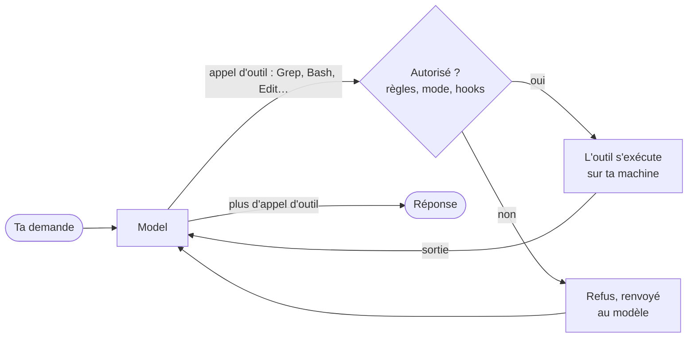

import { Tabs, TabItem } from '@astrojs/starlight/components';

Un refactoring de l'IDE est un programme figé : *Rename symbol* fait toujours la même chose, et tu peux lire son code source. Un agent de code est un programme qui demande à un modèle de langage **quoi faire ensuite**, le fait, montre le résultat au modèle, et redemande. Cette leçon examine cette boucle, installe les deux agents du cours, et lance une première tâche qui ne fait que lire.

## La boucle

Le modèle ne touche jamais à tes fichiers. Il ne produit que du texte, et une partie de ce texte peut être un **appel d'outil** : « lis `AGENTS.md` », « lance `git status` ». Le programme de l'agent, que la documentation de Claude Code appelle le [*harness* agentique](https://code.claude.com/docs/en/how-claude-code-works) (*agentic harness*), décide si l'appel peut s'exécuter, l'exécute, et renvoie la sortie au modèle comme message suivant :



La documentation décrit trois phases qui se mélangent : rassembler le contexte, agir, vérifier les résultats. Chaque aller-retour est un **tour** (*turn*), et tout ce que le modèle a vu jusque-là, ta demande, les fichiers qu'il a lus et les sorties des commandes, se trouve dans sa **fenêtre de contexte**, que la leçon 2 examine.

Deux conséquences pour un développeur C# ou Java :

- **La vérification des permissions est du code, pas une demande faite au modèle.** « Les règles de permission sont appliquées par Claude Code, pas par le modèle » ([permissions](https://code.claude.com/docs/en/permissions)). Une règle qui dit non est un `false` dans le *harness* ; une instruction dans un fichier Markdown qui dit « ne pousse jamais » est une phrase que le modèle suivra ou non.
- **Les outils sont des programmes ordinaires.** `Bash` lance un shell, `Edit` remplace une chaîne dans un fichier, `Grep` est ripgrep. Ce que l'agent peut casser, c'est ce que ces programmes peuvent casser avec ton compte utilisateur.

Les outils intégrés de Claude Code sont listés dans la [référence des outils](https://code.claude.com/docs/en/tools-reference) : `Read`, `Glob` et `Grep` ne demandent aucune permission dans le répertoire de travail ; `Edit`, `Write`, `Bash`, `PowerShell`, `WebFetch` et `Skill`, si. `Glob` et `Grep` sont absents par défaut sous macOS, Linux et WSL, où le modèle cherche plutôt avec des commandes shell en lecture seule. Codex a des outils équivalents sous d'autres noms ; ses hooks voient le shell comme `Bash` et les modifications de fichiers comme `apply_patch` ([hooks de Codex](https://learn.chatgpt.com/docs/hooks)).

## Installation

Claude Code nécessite un compte Pro, Max, Team, Enterprise ou Console ; « l'offre gratuite de Claude.ai n'inclut pas l'accès à Claude Code » ([installation](https://code.claude.com/docs/en/setup)). La CLI Codex se connecte avec un compte ChatGPT ou une clé d'API ([authentification de Codex](https://learn.chatgpt.com/docs/auth)).

<Tabs syncKey="os">
<TabItem label="Windows">

Dans PowerShell, les installeurs natifs de la [page d'installation de Claude Code](https://code.claude.com/docs/en/setup) et de la [page de la CLI Codex](https://learn.chatgpt.com/docs/codex/cli) :

```powershell
irm https://claude.ai/install.ps1 | iex
powershell -ExecutionPolicy ByPass -c "irm https://chatgpt.com/codex/install.ps1 | iex"
```

Claude Code s'installe aussi avec `winget install Anthropic.ClaudeCode`, qui ne se met pas à jour tout seul. Sur ma machine, Claude Code vient de l'installeur natif (`C:\Users\<you>\.local\bin\claude.exe`) et Codex de npm (`npm install -g @openai/codex`), qui nécessite Node.js. L'installeur PowerShell de Codex est *à vérifier* : je ne l'ai pas lancé.

[Git for Windows](https://git-scm.com/downloads/win) est recommandé mais plus obligatoire : « si Git for Windows n'est pas installé, Claude Code utilise PowerShell comme outil shell à la place » ([installation](https://code.claude.com/docs/en/setup)). Le bac à sable de Claude Code n'est pas disponible sous Windows natif ; Codex a son propre bac à sable Windows ([bac à sable Windows](https://learn.chatgpt.com/docs/windows/windows-sandbox)).

</TabItem>
<TabItem label="Linux / WSL">

```bash
curl -fsSL https://claude.ai/install.sh | bash
curl -fsSL https://chatgpt.com/codex/install.sh | sh
```

Les deux commandes sont *à vérifier* : je n'ai installé aucun des deux agents sous Linux pour ce cours. Codex ne prend pas en charge WSL 1 ([Codex sous WSL](https://learn.chatgpt.com/docs/windows/wsl)).

</TabItem>
<TabItem label="macOS">

```bash
curl -fsSL https://claude.ai/install.sh | bash
curl -fsSL https://chatgpt.com/codex/install.sh | sh
```

Ou avec Homebrew, `brew install --cask claude-code` et `brew install --cask codex`. Tout cela est *à vérifier* : je n'ai installé aucun des deux agents sous macOS pour ce cours.

</TabItem>
</Tabs>

Puis, dans n'importe quel terminal :

```text
> claude --version
2.1.271 (Claude Code)
> codex --version
codex-cli 0.154.0
```

`claude doctor` affiche un diagnostic sans démarrer de session. Capturé le 2026-09-14 vers 22:25 UTC, raccourci :

```text
Claude Code doctor
…

Running: native (2.1.271)
Platform: win32-x64
Config install method: native
Auto-updates: enabled
Auto-update channel: latest
Last update attempt: success → 2.1.271 (2026-09-14)

No installation issues found.
```

J'ai commencé cette leçon sur la 2.1.270 ; l'installation native s'est mise à jour toute seule en 2.1.271, en arrière-plan, vers 22:14 UTC ([mises à jour automatiques](https://code.claude.com/docs/en/setup)). Une installation par npm ou Homebrew ne le fait pas. Un comportement observé le lundi peut changer le mardi sans que tu aies rien lancé ; le [journal](../journal/) note quelle capture a tourné sur quelle version.

:::caution[Une clé d'API l'emporte sur ton abonnement]
Si `ANTHROPIC_API_KEY` est définie dans ton environnement, une session interactive demande une fois s'il faut l'utiliser à la place de ton abonnement, et `claude -p` l'utilise sans demander ([authentification](https://code.claude.com/docs/en/authentication)) : un script peut facturer au token sans que tu t'en aperçoives. `/status` dans une session indique lequel est utilisé. Ce cours n'utilise jamais de clé d'API.
:::

## Une première tâche qui ne fait que lire

Place-toi dans le dépôt, et pose une question dont tu peux vérifier la réponse. `claude -p` exécute une seule requête sans l'interface interactive ([mode *headless*](https://code.claude.com/docs/en/headless)) ; `--allowedTools` laisse les outils listés s'exécuter sans demande (il ne retire pas les autres : c'est le rôle de `--tools`), et `--output-format json` ajoute les métadonnées. Lancé depuis la racine de ce dépôt le 2026-09-14 à 22:10 UTC, Claude Code 2.1.270 :

```bash
claude -p "Which course folders under src/content/docs have a journal.md with unchecked progress items (lines starting with '- [ ]')? For each, give the folder and the number of unchecked items, as a Markdown table. Don't modify any file." --allowedTools "Read,Grep,Glob" --output-format json
```

Le champ `result`, tel que le modèle l'a écrit :

```text
Seven of the 22 `journal.md` files under `src/content/docs` have lines starting with `- [ ]`, 100 in all. Nothing was modified.

| Folder | Unchecked items |
|---|---:|
| `streeling/` | 31 |
| `fr/streeling/` | 31 |
| `es/streeling/` | 31 |
| `java-for-csharp/` | 2 |
| `fr/java-for-csharp/` | 2 |
| `es/java-for-csharp/` | 2 |
| `v-for-csharp-java/` | 1 |

- **Streeling:** `journal.md` is the one file in that section written by hand; the sync script generates the rest.
- **V course:** it only has an English journal so far, with no `fr/` or `es/` copy.
- **Fully checked:** `rust-for-csharp-java`, `wsl-containers`, `github-actions`, `duckdb` and `ladybugdb` have no unchecked items in any language.
- **Indented items:** only lines that start with `- [ ]` were counted, so an unchecked item nested under another item wouldn't show up.
```

Et quelques autres champs : `"num_turns": 3`, `"duration_ms": 12087`, `"permission_denials": []`. Trois tours : le modèle a cherché avec `Grep`, obtenu les nombres, et répondu. **Vérifie la réponse** : `grep -c '\- \[ \]' src/content/docs/*/journal.md` donne les mêmes nombres. La remarque sur le journal de Streeling ne figure dans aucun fichier de journal : elle vient de l'`AGENTS.md` de ce dépôt, que l'agent a chargé avant son premier tour. La leçon 2 explique comment.

La même requête avec Codex, `codex exec "…"`, le même soir, raccourcie :

```text
OpenAI Codex v0.154.0
--------
workdir: C:\Users\spare\source\repos\learn
model: gpt-6-astra
provider: openai
approval: on-request
sandbox: read-only
…
--------
…
ERROR: You've hit your usage limit. Visit https://chatgpt.com/codex/settings/usage to purchase more credits or try again at Sep 19th, 2026 9:42 AM.
```

Un abonnement a des limites, et un script qui appelle un agent doit prévoir cet échec comme n'importe quel autre. Les sessions Codex de ce lot sont *à vérifier* après cette date ; les commandes qui n'appellent pas le modèle (`codex mcp add`, `codex mcp list`) fonctionnent, et la leçon 4 les utilise.

## Les modes de permission

Claude Code demande avant une action selon son **mode de permission** ([modes de permission](https://code.claude.com/docs/en/permission-modes)) :

| Mode | S'exécute sans demander | À utiliser pour |
|---|---|---|
| `default` (affiché comme *Manual*) | les lectures seulement | apprendre l'outil, les dépôts sensibles |
| `acceptEdits` | les lectures, les modifications de fichiers, et `mkdir`, `touch`, `mv`, `cp` dans les répertoires de travail | une tâche que tu reliras sous forme de diff |
| `plan` | les lectures, plus les commandes que les vérifications du mode auto approuvent quand le mode auto est disponible ; aucune modification tant que tu n'as pas approuvé un plan | explorer avant de changer |
| `auto` | tout, avec des vérifications de sécurité en arrière-plan par un second modèle, le classifieur | les longues tâches, avec les vérifications comme filet de sécurité, pas comme garantie |
| `dontAsk` | seulement ce que les règles autorisent ; tout le reste est refusé | la CI |
| `bypassPermissions` | tout | « uniquement les conteneurs et VM isolés » |

`Shift+Tab` fait défiler les modes dans une session, et `--permission-mode` en fixe un pour une exécution. Le mode de départ dépend de l'offre et de tes paramètres : les sessions interactives des offres Pro, Max et Team démarrent en `auto` ; les offres Enterprise et les clés d'API démarrent en `default` ; `claude -p` démarre en `default`, **sauf si un fichier de paramètres dit autre chose** : `--permission-mode` l'emporte, puis `permissions.defaultMode` dans un fichier de paramètres, puis la valeur par défaut intégrée.

Cette exception m'a piégé. Les paramètres utilisateur de cette machine contiennent `"defaultMode": "auto"`, et `claude -p "Create a file named hello.txt containing the word hi…"` a créé le fichier sans demander. La même requête avec `--permission-mode default`, le 2026-09-14 à 22:22 UTC, dans un dépôt vide :

```json
{
 "num_turns": 2,
 "is_error": false,
 "permission_denials": [
  {
   "tool_name": "Write",
   "tool_input": {
    "file_path": "C:\\Users\\spare\\…\\ctxA\\hello.txt",
    "content": "hi"
   }
  }
 ],
 "result": "It didn't work: the request for permission to write `hello.txt` wasn't approved, so no file was created. If you approve the write, I can try again."
}
```

En mode `-p`, personne n'est là pour répondre à la demande : l'appel est donc refusé, le refus retourne au modèle, et le modèle le signale. `is_error` reste à `false` : l'exécution a réussi, la tâche non. Un script doit lire `permission_denials`, pas seulement le code de sortie.

Les écritures dans quelques **chemins protégés** ne sont jamais approuvées automatiquement, sauf en `bypassPermissions`, et les règles d'autorisation n'y changent rien : `.git`, `.vscode`, `.idea`, `.claude`, `.mvn`, `.devcontainer`, `.mcp.json`, les profils de shell comme `.bashrc`, et d'autres listés dans [chemins protégés](https://code.claude.com/docs/en/permission-modes#protected-paths). `default` et `acceptEdits` demandent, `auto` les envoie au classifieur, `dontAsk` refuse.

## Les règles de permission

Les règles affinent le mode, dans `.claude/settings.json` (commité, partagé avec l'équipe), `.claude/settings.local.json` (pour toi seul) ou `~/.claude/settings.json` (tous tes projets) ([paramètres](https://code.claude.com/docs/en/settings)) :

```json
{
  "permissions": {
    "allow": ["Bash(dotnet build *)", "Bash(dotnet test *)"],
    "ask": ["Bash(git push *)"],
    "deny": ["Read(./.env)", "Read(./**/appsettings.Development.json)"]
  }
}
```

« Les règles sont évaluées dans l'ordre : deny, puis ask, puis allow. La première correspondance dans cet ordre détermine le résultat » ([permissions](https://code.claude.com/docs/en/permissions)). `Bash(dotnet test *)` correspond à `dotnet test` seul ou suivi de n'importe quoi ; l'espace compte, donc `Bash(ls *)` ne correspond pas à `lsof`. Une commande composée comme `dotnet build && git push` doit correspondre règle par règle, sous-commande par sous-commande.

La documentation est explicite sur la limite : une règle Bash « n'est pas une frontière de sécurité autour du programme ». `Bash(curl *)` dans `deny` arrête `curl https://example.com`, pas `/usr/bin/curl https://example.com` ni `sh -c 'curl https://example.com'` ; `Bash(git push *)` n'arrête pas `git -C . push origin main`. Un ensemble intégré de commandes en lecture seule, `ls`, `cat`, `grep`, `find`, `git` en lecture seule et quelques autres, s'exécute sans demande dans tous les modes. Pour une vraie frontière, utilise un bac à sable ou un conteneur ; pour une vérification qui lit la commande comme tu le souhaites, un hook (leçon 3).

## Codex : un bac à sable et une politique d'approbation

Codex sépare **ce qu'une commande peut toucher**, le bac à sable (*sandbox*), de **quand te demander**, la politique d'approbation ([approbations et sécurité](https://learn.chatgpt.com/docs/agent-approvals-security)) :

| | Valeurs en 0.154.0 |
|---|---|
| `--sandbox` | `read-only`, `workspace-write`, `danger-full-access` |
| `--ask-for-approval` (`codex` interactif) | `on-request` : le modèle demande quand il a besoin de sortir du bac à sable ; `never` : les échecs retournent directement au modèle |

Dans un dépôt Git, le préréglage interactif est *Auto*, `workspace-write` avec `on-request` ; « par défaut, `codex exec` s'exécute dans un bac à sable en lecture seule » ([mode non interactif](https://learn.chatgpt.com/docs/non-interactive-mode)), ce que montre l'en-tête de la capture ci-dessus. Le bac à sable est imposé par le système d'exploitation (Seatbelt sous macOS, bubblewrap et seccomp sous Linux et WSL 2, un bac à sable dédié sous Windows natif) : une commande en `read-only` ne peut donc pas écrire, quelle que soit l'allure de sa ligne de commande. L'accès réseau est désactivé par défaut en `workspace-write`. Des tutoriels plus anciens utilisent `--full-auto` et `--ask-for-approval untrusted` : `codex exec` 0.154.0 rejette le premier (`unexpected argument '--full-auto'`), et la politique `untrusted` est retirée. La nouvelle option `--approve-for-me` envoie les demandes d'approbation à une revue automatique, en `workspace-write`.

L'équivalent chez Claude Code est son [bac à sable](https://code.claude.com/docs/en/sandboxing), `/sandbox`, qui isole le système de fichiers et le réseau de l'outil Bash sous macOS, Linux et WSL 2, pas sous Windows natif.

## À retenir

- Le modèle ne fait que proposer des appels d'outils ; le *harness* les vérifie, les exécute et renvoie leur sortie. Un tour est un aller-retour.
- Les modes et les règles de permission sont appliqués par le programme de l'agent. Les instructions des fichiers Markdown, non.
- `claude -p` et `codex exec` exécutent une tâche depuis un script. Vérifie `permission_denials` et la réponse elle-même, pas seulement le code de sortie.
- Tes fichiers de paramètres changent les valeurs par défaut : `claude -p` a suivi le `defaultMode: auto` de cette machine.
- Les règles de permission Bash comparent du texte. Les bacs à sable restreignent ce que le processus peut faire.
- Les agents se mettent à jour tout seuls, et les abonnements s'épuisent : date chaque capture.

## Exercices

1. La première tâche autorisait `Read,Grep,Glob`. En mode `-p` avec `--permission-mode default`, que se passe-t-il si le modèle lance `grep -c` via `Bash` à la place ? Et s'il lance `sed -i` pour « corriger » un journal ?

<details>
<summary>Solution</summary>

`--allowedTools` ne restreint pas la liste des outils, il ne fait qu'approuver les outils listés. `Bash` reste disponible, et `grep` fait partie des commandes intégrées en lecture seule qui s'exécutent sans demande dans tous les modes : la commande s'exécute, et sous macOS, Linux et WSL, où l'outil `Grep` est absent par défaut, c'est exactement ce que fait le modèle. `sed -i` n'est pas en lecture seule : en mode `-p`, personne ne peut l'approuver, donc le *harness* le refuse avant toute exécution, envoie le refus au modèle, et le liste dans `permission_denials`, comme le refus de `Write` ci-dessus. L'exécution se termine quand même avec 0 et `is_error: false`. Pour retirer complètement `Bash`, passe `--tools "Read,Grep,Glob"`. Sur cette machine, où les paramètres utilisateur disent `defaultMode: auto`, `sed -i` serait plutôt parti au classifieur : passe `--permission-mode` explicitement dans les scripts.

</details>

2. Écris le bloc `permissions` d'un `.claude/settings.json` pour une solution .NET : l'agent peut compiler et tester sans demander, doit demander avant tout `git push`, et ne peut jamais lire les fichiers `appsettings.Development.json` ni quoi que ce soit sous `secrets/`.

<details>
<summary>Solution</summary>

```json
{
  "permissions": {
    "allow": ["Bash(dotnet build *)", "Bash(dotnet test *)"],
    "ask": ["Bash(git push *)"],
    "deny": ["Read(./**/appsettings.Development.json)", "Read(./secrets/**)"]
  }
}
```

Les règles `Read` et `Edit` utilisent des motifs gitignore relatifs au répertoire courant quand elles commencent par `./` ([permissions](https://code.claude.com/docs/en/permissions)). `deny` l'emporte sur `allow` : une règle `allow` large ajoutée plus tard ne rouvre donc pas les secrets. `Bash(dotnet build *)` correspond aussi à un `dotnet build` seul. La règle `ask` est une commodité, pas une garantie : la documentation elle-même montre que `git -C . push origin main` n'est pas arrêté par `Bash(git push *)`. La leçon 3 écrit à la place un hook qui analyse la commande.

</details>

3. Une tâche de CI nocturne doit demander à Codex de résumer les commits de la semaine dans un fichier, et rien d'autre. Quelles options passes-tu à `codex exec`, et que peut-il encore mal se passer ?

<details>
<summary>Solution</summary>

`codex exec --sandbox read-only -o summary.md "Summarize the commits of the last 7 days"` : la lecture seule est déjà le mode par défaut de `codex exec`, mais l'écrire rend l'intention visible, et `-o` (`--output-last-message`) écrit le message final dans un fichier tout en l'affichant ([mode non interactif](https://learn.chatgpt.com/docs/non-interactive-mode)) ; le fichier est écrit par la CLI Codex, pas par une commande dans le bac à sable, donc l'agent lui-même n'a besoin d'aucun accès en écriture (*à vérifier* : je n'ai pas pu le lancer à cause de la limite d'utilisation). En CI, il te faut aussi des identifiants (`CODEX_API_KEY` pour `codex exec`), et un dépôt Git ou `--skip-git-repo-check`. Ce qui peut encore mal se passer : la limite d'utilisation de la capture ci-dessus, un résumé plausible mais faux, et un modèle qui suit des instructions trouvées dans des messages de commit. La sortie est du texte écrit par un modèle : relis-la ou traite-la comme non fiable.

</details>

## Sources

- Claude Code : [comment il fonctionne](https://code.claude.com/docs/en/how-claude-code-works), [installation](https://code.claude.com/docs/en/setup), [authentification](https://code.claude.com/docs/en/authentication), [référence des outils](https://code.claude.com/docs/en/tools-reference), [mode *headless*](https://code.claude.com/docs/en/headless), [modes de permission](https://code.claude.com/docs/en/permission-modes), [permissions](https://code.claude.com/docs/en/permissions), [paramètres](https://code.claude.com/docs/en/settings), [bac à sable](https://code.claude.com/docs/en/sandboxing)
- Codex : [CLI](https://learn.chatgpt.com/docs/codex/cli), [authentification](https://learn.chatgpt.com/docs/auth), [mode non interactif](https://learn.chatgpt.com/docs/non-interactive-mode), [approbations et sécurité](https://learn.chatgpt.com/docs/agent-approvals-security), [bac à sable Windows](https://learn.chatgpt.com/docs/windows/windows-sandbox)
