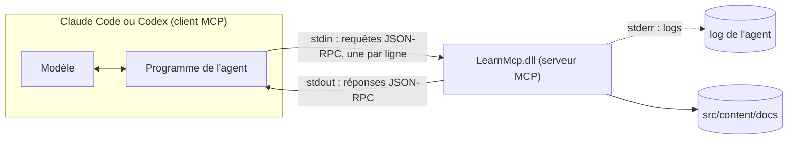

Les hooks et les skills changent la façon dont un agent utilise les outils qu'il a. Le [Model Context Protocol](https://modelcontextprotocol.io/) (MCP) lui en donne de nouveaux : un serveur expose des outils, l'agent les liste, le modèle les appelle. Si tu as écrit un service gRPC ou un point d'accès JSON-RPC, tu en connais déjà l'essentiel. Le serveur de cette leçon fait environ 120 lignes de C# avec le [SDK C# officiel](https://github.com/modelcontextprotocol/csharp-sdk), et la CI le teste sur trois systèmes d'exploitation sans aucun agent.

## L'architecture



L'agent démarre le serveur comme processus enfant et parle [JSON-RPC 2.0](https://www.jsonrpc.org/specification) sur ses flux standard. Le [transport stdio](https://modelcontextprotocol.io/specification/2026-07-28/basic/transports/stdio) a une règle que les développeurs .NET enfreignent dès leur premier essai : « Le serveur **NE DOIT PAS** écrire sur son `stdout` quoi que ce soit qui ne soit pas un message MCP valide. » Un `Console.WriteLine` de débogage, ou un logger qui écrit dans la console, corrompt le flux. Les logs vont sur stderr. MCP a aussi un transport HTTP, pour les serveurs distants ; cette leçon reste en local.

## Le serveur

[`mcp/LearnMcp/Program.cs`](https://github.com/spareilleux/learn/blob/13143d3a4d1d7d7b97fd087d4ad89c00e42fe788/code/agentic-coding/mcp/LearnMcp/Program.cs#L5-L15) est un [hôte générique](https://learn.microsoft.com/dotnet/core/extensions/generic-host), comme n'importe quel worker service .NET :

```csharp
var builder = Host.CreateApplicationBuilder(args);

// stdout transporte le protocole : chaque ligne de log part sur stderr
builder.Logging.AddConsole(options => options.LogToStandardErrorThreshold = LogLevel.Trace);

builder.Services
    .AddMcpServer()
    .WithStdioServerTransport()
    .WithToolsFromAssembly();

await builder.Build().RunAsync();
```

`WithToolsFromAssembly` trouve les classes statiques marquées `[McpServerToolType]` et expose leurs méthodes `[McpServerTool]`. [`ScaleTools.cs`](https://github.com/spareilleux/learn/blob/13143d3a4d1d7d7b97fd087d4ad89c00e42fe788/code/agentic-coding/mcp/LearnMcp/ScaleTools.cs#L15-L19) déclare le premier outil :

```csharp
[McpServerTool(Name = "scale_notes", ReadOnly = true, Idempotent = true)]
[Description("Spells the seven notes of a diatonic scale, one letter per degree: 'F major' gives Bb, not A#.")]
public static string[] ScaleNotes(
    [Description("Root note: a letter A to G, optionally followed by # or b, for example C, F# or Bb")] string root,
    [Description("major, minor, or a mode name: ionian, dorian, phrygian, lydian, mixolydian, aeolian, locrian")] string mode = "major")
```

Le SDK transforme la signature en JSON Schema et les attributs `[Description]` en texte que lit le modèle ; ces descriptions sont toute la documentation de l'outil, pour un lecteur qui ne peut pas ouvrir ton code source. Une entrée invalide lève une [`McpException`](https://github.com/spareilleux/learn/blob/13143d3a4d1d7d7b97fd087d4ad89c00e42fe788/code/agentic-coding/mcp/LearnMcp/ScaleTools.cs#L54), que le SDK renvoie comme erreur d'outil.

Le second outil, [`course_outline`](https://github.com/spareilleux/learn/blob/13143d3a4d1d7d7b97fd087d4ad89c00e42fe788/code/agentic-coding/mcp/LearnMcp/CourseTools.cs#L11-L37), montre deux choses de plus : un paramètre de type `IConfiguration` est injecté par l'hôte, pas exposé au modèle, et il lit l'argument de ligne de commande `--docs` ; et le nom du cours est validé par rapport à `[a-z0-9-]` avant de devenir un chemin, parce que le modèle passera tout ce qu'on lui donne, `../..` compris.

## Parler MCP à la main

Avant de faire confiance à un SDK, regarde ce qui passe sur le fil. `LearnMcp.Check raw` démarre le serveur et envoie les lignes d'un fichier `.jsonl` une à une, en affichant chaque réponse. La CI le lance pour les deux époques du protocole.

### L'ancienne poignée de main, jusqu'à 2025-11-25

Jusqu'à la révision [2025-11-25](https://modelcontextprotocol.io/specification/2025-11-25/basic/lifecycle), une session commence par `initialize`. [`expected-legacy.txt`](https://github.com/spareilleux/learn/blob/13143d3a4d1d7d7b97fd087d4ad89c00e42fe788/code/agentic-coding/mcp/expected-legacy.txt), lignes raccourcies avec `…` :

```text
--> {"jsonrpc":"2.0","id":1,"method":"initialize","params":{"protocolVersion":"2025-11-25","capabilities":{},"clientInfo":{"name":"by-hand","version":"1.0"}}}
<-- {"result":{"protocolVersion":"2025-11-25","capabilities":{"logging":{},"tools":{"listChanged":true}},"serverInfo":{"name":"LearnMcp","version":"1.0.0.0"}},"id":1,"jsonrpc":"2.0"}
--> {"jsonrpc":"2.0","method":"notifications/initialized"}
--> {"jsonrpc":"2.0","id":2,"method":"tools/list"}
<-- {"result":{"tools":[{"name":"course_outline",…,"annotations":{"readOnlyHint":true}},{"name":"scale_notes",…,"annotations":{"idempotentHint":true,"readOnlyHint":true}}]},"id":2,"jsonrpc":"2.0"}
--> {"jsonrpc":"2.0","id":3,"method":"tools/call","params":{"name":"scale_notes","arguments":{"root":"F","mode":"major"}}}
<-- {"result":{"content":[{"type":"text","text":"[\u0022F\u0022,\u0022G\u0022,\u0022A\u0022,\u0022Bb\u0022,\u0022C\u0022,\u0022D\u0022,\u0022E\u0022]"}]},"id":3,"jsonrpc":"2.0"}
--> {"jsonrpc":"2.0","id":4,"method":"tools/call","params":{"name":"scale_notes","arguments":{"root":"H"}}}
<-- {"result":{"content":[{"type":"text","text":"An error occurred invoking \u0027scale_notes\u0027: \u0027H\u0027 is not a note: use a letter A to G, optionally followed by # or b."}],"isError":true},"id":4,"jsonrpc":"2.0"}
exit code: 0
```

Trois détails. Le `string[]` est revenu en JSON à l'intérieur d'un bloc de texte, avec `"` échappé en `"` par l'encodeur par défaut de System.Text.Json. `ReadOnly = true` est devenu `readOnlyHint`, une indication que, selon la spécification, les clients « **DOIVENT** considérer … comme non fiable, sauf si elle vient de serveurs de confiance ». Et `H` a produit un **résultat** avec `isError: true`, pas une erreur JSON-RPC.

### La révision sans état, 2026-07-28

La [révision actuelle](https://modelcontextprotocol.io/specification/2026-07-28/changelog) supprime la poignée de main : « Chaque requête porte désormais sa version de protocole et les capacités du client dans `_meta` », et les serveurs « DOIVENT implémenter » [`server/discover`](https://modelcontextprotocol.io/specification/2026-07-28/server/discover). [`expected-stateless.txt`](https://github.com/spareilleux/learn/blob/13143d3a4d1d7d7b97fd087d4ad89c00e42fe788/code/agentic-coding/mcp/expected-stateless.txt) :

```text
--> {"jsonrpc":"2.0","id":1,"method":"server/discover","params":{"_meta":{"io.modelcontextprotocol/protocolVersion":"2026-07-28","io.modelcontextprotocol/clientCapabilities":{},"io.modelcontextprotocol/clientInfo":{"name":"by-hand","version":"1.0"}}}}
<-- {"result":{"supportedVersions":["2026-07-28"],"capabilities":{"logging":{},"tools":{"listChanged":true}},"ttlMs":0,"cacheScope":"private","resultType":"complete","_meta":{"io.modelcontextprotocol/serverInfo":{"name":"LearnMcp","version":"1.0.0.0"}}},"id":1,"jsonrpc":"2.0"}
--> {"jsonrpc":"2.0","id":2,"method":"tools/call","params":{"name":"scale_notes","arguments":{"root":"Bb","mode":"minor"},"_meta":{…}}}
<-- {"result":{"content":[{"type":"text","text":"[\u0022Bb\u0022,\u0022C\u0022,\u0022Db\u0022,\u0022Eb\u0022,\u0022F\u0022,\u0022Gb\u0022,\u0022Ab\u0022]"}],"resultType":"complete","_meta":{"io.modelcontextprotocol/serverInfo":{"name":"LearnMcp","version":"1.0.0.0"}}},"id":2,"jsonrpc":"2.0"}
exit code: 0
```

Le même serveur, SDK 2.2.0, répond aux deux époques. Sans le bloc `_meta`, `server/discover` a répondu par l'erreur JSON-RPC `-32602` : la requête « requires per-request metadata declaring a supported protocol version ». Deux pièges d'un pipe brut, découverts en écrivant l'outil : le serveur peut répondre aux requêtes dans le désordre, donc le mode brut attend chaque réponse avant d'envoyer la ligne suivante ; et il ne répond pas du tout aux notifications.

## Tester avec le client du SDK

Le mode par défaut de [`LearnMcp.Check`](https://github.com/spareilleux/learn/blob/13143d3a4d1d7d7b97fd087d4ad89c00e42fe788/code/agentic-coding/mcp/LearnMcp.Check/Program.cs#L19-L25) démarre le serveur comme le fait un agent :

```csharp
var transport = new StdioClientTransport(new StdioClientTransportOptions
{
    Name = "learn",
    Command = "dotnet",
    Arguments = [server, "--docs", docs],
});
await using var client = await McpClient.CreateAsync(transport);
```

puis liste les outils et les appelle avec de bons et de mauvais arguments. Extrait de [`expected.txt`](https://github.com/spareilleux/learn/blob/13143d3a4d1d7d7b97fd087d4ad89c00e42fe788/code/agentic-coding/mcp/expected.txt) :

```text
server: LearnMcp, protocol 2026-07-28
…
scale_notes {"root":"Eb","mode":"dorian"}
  isError: False
  ["Eb","F","Gb","Ab","Bb","C","Db"]
scale_notes {"root":"C","mode":"blues"}
  isError: True
  An error occurred invoking 'scale_notes': Unknown mode 'blues'. Use major, minor or one of: ionian, dorian, phrygian, lydian, mixolydian, aeolian, locrian.
course_outline {"course":"../.."}
  isError: True
  An error occurred invoking 'course_outline': '../..' is not a course folder name.
does_not_exist {}
  McpProtocolException: Request failed (remote): Unknown tool: 'does_not_exist'
```

Le client a négocié 2026-07-28. Les deux sortes d'échec suivent la [spécification des outils](https://modelcontextprotocol.io/specification/2026-07-28/server/tools) : un outil inconnu est une **erreur de protocole**, que le client C# lève sous forme d'exception ; de mauvais arguments sont une **erreur d'exécution d'outil**, `isError: true`, que « les clients **DEVRAIENT** fournir … aux modèles de langage pour permettre l'autocorrection ». Écris tes messages d'erreur pour le modèle : dis ce qui n'allait pas et ce qui est valide.

C'est la partie d'un serveur MCP que tu peux tester comme n'importe quel autre code, et c'est là que se trouvent la plupart des bugs. Ce que le modèle fait des outils est la partie que tu ne peux pas tester.

## L'enregistrer dans Claude Code

`claude mcp add` écrit la configuration ; `--scope project` la met dans `.mcp.json`, commité avec le dépôt ([MCP dans Claude Code](https://code.claude.com/docs/en/mcp)). Le 2026-09-14 à 22:56 UTC, dans un dépôt Git vide :

```text
> claude mcp add --scope project learn -- dotnet code/agentic-coding/mcp/LearnMcp/bin/Release/net10.0/LearnMcp.dll --docs src/content/docs
Added stdio MCP server learn with command: dotnet code/agentic-coding/mcp/LearnMcp/bin/Release/net10.0/LearnMcp.dll --docs src/content/docs to project config
File modified: C:\…\mcpadd\.mcp.json
> claude mcp get learn
learn:
  Scope: Project config (shared via .mcp.json)
  Status: ⏸ Pending approval (run `claude` to approve)
  Type: stdio
  Command: dotnet
  Args: code/agentic-coding/mcp/LearnMcp/bin/Release/net10.0/LearnMcp.dll --docs src/content/docs
  Environment:

To remove this server, run: claude mcp remove learn -s project
```

Tout ce qui suit `--` est passé au serveur tel quel. Un serveur de projet attend l'approbation de chaque développeur dans une session interactive ; `claude -p` ne demande pas, et « connecte les serveurs de son `.mcp.json`, même dans un dossier que tu n'as jamais approuvé » ([mode *headless*](https://code.claude.com/docs/en/headless)), la même précaution que pour les hooks de la leçon 3.

Les outils apparaissent au modèle sous les noms `mcp__learn__scale_notes` et `mcp__learn__course_outline`, et les règles de permission utilisent ces noms ([les paramètres d'exemple](https://github.com/spareilleux/learn/blob/13143d3a4d1d7d7b97fd087d4ad89c00e42fe788/code/agentic-coding/config/claude/settings.json) autorisent les deux). Une capture du 2026-09-14 à 22:11 UTC, Claude Code 2.1.270, dans un dépôt jetable avec une copie du serveur et de la documentation :

```bash
claude -p "Spell the D dorian scale and the notes of Gb major with the scale_notes tool of the learn MCP server, then list the pages of the ladybugdb course with course_outline. Answer briefly." --allowedTools "mcp__learn__scale_notes,mcp__learn__course_outline" --output-format stream-json --verbose
```

La transcription, raccourcie :

```text
init          mcp_servers: … {"name": "learn", "status": "pending"} …
ToolSearch    {"query": "+learn scale_notes course_outline", "max_results": 5}
  result      tool_reference mcp__learn__course_outline, tool_reference mcp__learn__scale_notes, …
mcp__learn__scale_notes {"root": "D", "mode": "dorian"}    → ["D","E","F","G","A","B","C"]
mcp__learn__scale_notes {"root": "Gb", "mode": "major"}    → ["Gb","Ab","Bb","Cb","Db","Eb","F"]
mcp__learn__course_outline {"course": "ladybugdb"}         → index.md: LadybugDB — Mission …
```

Cinq tours, et le modèle a appelé les deux `scale_notes` en parallèle. Il a découpé « D dorian » en deux paramètres de lui-même, à partir du schéma. Remarque le premier appel : les outils MCP ne sont pas dans le contexte du modèle au démarrage. Avec la [recherche d'outils](https://code.claude.com/docs/en/mcp#scale-with-mcp-tool-search) (*tool search*), activée par défaut, le modèle ne connaît que les noms des outils et cherche le schéma d'un outil quand il en a besoin, ce qui évite que des dizaines de serveurs remplissent le contexte. `Gb major` est revenu avec `Cb`, l'orthographe correcte ; une implémentation par classes de hauteur aurait dit `B`.

### Un chemin qui ne se développe pas

Le [`.mcp.json`](https://github.com/spareilleux/learn/blob/13143d3a4d1d7d7b97fd087d4ad89c00e42fe788/code/agentic-coding/config/claude/.mcp.json) d'exemple utilise des chemins relatifs à la racine du dépôt. L'alternative évidente, `${CLAUDE_PROJECT_DIR}` comme dans les hooks, échoue. Trois variantes du même serveur, le 2026-09-14 à 22:54 UTC :

```json
{
  "mcpServers": {
    "expanded":  { "command": "dotnet", "args": ["${CLAUDE_PROJECT_DIR}/server/LearnMcp.dll", "--docs", "${CLAUDE_PROJECT_DIR}/docs"] },
    "defaulted": { "command": "dotnet", "args": ["${CLAUDE_PROJECT_DIR:-.}/server/LearnMcp.dll", "--docs", "${CLAUDE_PROJECT_DIR:-.}/docs"] },
    "relative":  { "command": "dotnet", "args": ["server/LearnMcp.dll", "--docs", "docs"] }
  }
}
```

`claude mcp list` a averti : « [expanded] mcpServers.expanded: Missing environment variables: CLAUDE_PROJECT_DIR ». Dans une session `claude -p`, `expanded` a échoué avec `CONNECTION_CLOSED` et les deux autres se sont connectés. La documentation l'explique : `CLAUDE_PROJECT_DIR` « est définie dans l'environnement du serveur, pas dans l'environnement de Claude Code lui-même : y faire référence via l'expansion `${VAR}` dans `command` ou `args` … demande une valeur par défaut comme `${CLAUDE_PROJECT_DIR:-.}` ». Un serveur peut aussi lire la variable lui-même au démarrage. Les hooks et les serveurs MCP se ressemblent dans la configuration, et la même variable y suit des règles différentes.

## L'enregistrer dans Codex

Codex garde les serveurs MCP dans `config.toml`, `~/.codex/config.toml` par défaut ou `.codex/config.toml` dans un projet approuvé ([MCP dans Codex](https://learn.chatgpt.com/docs/extend/mcp)). Avec `CODEX_HOME` pointant vers un dossier vide, le 2026-09-14 à 22:57 UTC, CLI Codex 0.154.0, depuis la racine de ce dépôt (un avertissement sur les alias PATH dans un dossier temporaire a été retiré) :

```text
> codex mcp add learn -- dotnet code/agentic-coding/mcp/LearnMcp/bin/Release/net10.0/LearnMcp.dll --docs src/content/docs
Added global MCP server 'learn'.
> codex mcp list
Name   Command  Args                                                                                       Env  Cwd  Status   Auth
learn  dotnet   code/agentic-coding/mcp/LearnMcp/bin/Release/net10.0/LearnMcp.dll --docs src/content/docs  -    -    enabled  Unsupported
```

et le fichier qu'elle a écrit :

```toml
[mcp_servers.learn]
command = "dotnet"
args = ["code/agentic-coding/mcp/LearnMcp/bin/Release/net10.0/LearnMcp.dll", "--docs", "src/content/docs"]
```

`codex mcp list` ne démarre pas le serveur : « enabled » signifie configuré, pas connecté. [Le `config.toml` d'exemple](https://github.com/spareilleux/learn/blob/13143d3a4d1d7d7b97fd087d4ad89c00e42fe788/code/agentic-coding/config/codex/config.toml) ajoute deux clés : `startup_timeout_sec = 30`, parce que la valeur par défaut est de 10 secondes et qu'un premier démarrage de `dotnet` peut être plus lent ; et `default_tools_approval_mode = "approve"`, parmi `auto`, `prompt`, `writes` et `approve`, où « le mode `writes` demande une confirmation pour les outils qui ne sont pas marqués en lecture seule ». Codex a aussi `cwd`, `enabled_tools` et `disabled_tools` par serveur. Une session qui appelle réellement les outils est *à vérifier*, après la limite d'utilisation de la leçon 1 ; de même que le répertoire de travail par rapport auquel les chemins relatifs sont résolus quand `cwd` n'est pas défini.

Des articles plus anciens montrent Codex lui-même comme serveur MCP, `codex mcp-server` : « La commande `codex mcp-server` et le binaire autonome `codex-mcp-server` ont été supprimés » ([suppression du serveur MCP de Codex](https://learn.chatgpt.com/docs/mcp-server)).

## Le cas de GA : la conception des outils compte plus que le protocole

[GuitarAlchemist/ga](https://github.com/GuitarAlchemist/ga/tree/a826864f3a012cad88e415954bf57eca0ce12aa6/GaMcpServer) a un vrai serveur MCP, `GaMcpServer`, avec la même configuration d'hôte que `LearnMcp`, logs sur stderr compris, ModelContextProtocol 1.3.0 au lieu de 2.2.0, et un middleware de gouvernance issu de `Microsoft.AgentGovernance`. Il expose des dizaines d'outils de théorie musicale. L'un d'eux, [`GetScaleNotes`](https://github.com/GuitarAlchemist/ga/blob/a826864f3a012cad88e415954bf57eca0ce12aa6/GaMcpServer/Tools/ScaleTool.cs#L50-L80), fait le même travail que `scale_notes` :

```csharp
[McpServerTool]
[Description(
    "Get the 7 scale notes for a key string such as 'G major' or 'A minor'. " +
    "Returns a JSON array of {degree, note, pitchClass} objects suitable for fretboard overlays or theory analysis. " +
    "pitchClass is 0-11 (C=0, C#=1 … B=11). Supports major and natural minor only.")]
public static string GetScaleNotes(
    [Description("Key string in 'Root mode' format, e.g. 'G major', 'A minor', 'Bb major'")] string key)
{
    …
    string[] noteNames = ["C", "C#", "D", "D#", "E", "F", "F#", "G", "G#", "A", "A#", "B"];
    …
    var rootIndex = Array.IndexOf(noteNames, root);
    if (rootIndex < 0)
        return $"Unknown root note '{root}'. Use sharps (e.g. C#, F#) not flats for black keys.";

    var offsets = mode.StartsWith("minor") ? minor : major;
```

Le même serveur, appelé depuis la session qui a écrit cette leçon le 2026-09-14 vers 22:57 UTC, à partir d'un build local de ga dont `GetScaleNotes` a le même code :

| Appel | Résultat |
|---|---|
| `get_scale_notes("F major")` | F G A **A#** C D E |
| `get_scale_notes("Bb major")` | "Unknown root note 'Bb'. Use sharps (e.g. C#, F#) not flats for black keys." |
| `get_scale_notes("D dorian")` | D E **F#** G A B **C#**, les notes de ré majeur |
| `get_key_notes("Key of F")` | F G A **Bb** C D E |

Chaque ligne est une leçon de conception d'outils, et aucune ne porte sur MCP :

- **La description promet ce que le code refuse.** L'exemple du paramètre est `'Bb major'`, que l'outil rejette. Le modèle lit la description, pas le code.
- **Les erreurs sont renvoyées comme des résultats ordinaires.** Le rejet est une chaîne normale, sans `isError`, donc un client ne peut pas le distinguer d'une donnée. `LearnMcp` lève plutôt une `McpException`.
- **Les solutions de repli silencieuses produisent des réponses fausses plausibles.** Tout mode qui ne commence pas par « minor » est traité comme majeur. La description dit « major and natural minor only », mais un modèle qui demande ré dorien reçoit sept notes d'apparence valide, et n'a aucune raison d'en douter.
- **Deux outils d'un même serveur se contredisent.** `get_key_notes` écrit fa majeur avec `Bb`, `get_scale_notes` avec `A#`. Le modèle peut appeler l'un ou l'autre, selon les mots de la demande.
- **Les classes de hauteur ne sont pas des noms de notes.** `A#` et `Bb` sont la même touche sur un piano et des notes différentes en fa majeur : l'orthographe fait partie de la réponse pour un guitariste qui lit le résultat, et c'est pourquoi `scale_notes` travaille à partir des lettres.

Ce sont des constats sur un dépôt public à un commit figé ; ce cours ne modifie pas ga, et ils sont listés dans le [journal](../journal/) à l'intention de son auteur.

## À retenir

- Un serveur MCP est un processus qui parle JSON-RPC sur stdin et stdout ; stdout est réservé au protocole, les logs vont sur stderr.
- Avec le SDK C#, un serveur est un hôte générique, `AddMcpServer().WithStdioServerTransport().WithToolsFromAssembly()`, et les outils sont des méthodes statiques munies d'attributs ; les descriptions sont la documentation que lit le modèle.
- La révision 2026-07-28 est sans état : pas d'`initialize`, `_meta` sur chaque requête, `server/discover`. Le SDK 2.2.0 sert les deux époques.
- De mauvais arguments donnent un résultat d'outil avec `isError: true`, un outil inconnu est une erreur de protocole ; écris des messages d'erreur qui disent au modèle ce qui est valide.
- Teste le serveur avec un client MCP en CI ; c'est déterministe. Ce qu'un modèle fait des outils ne l'est pas.
- `.mcp.json` et `claude mcp add --scope project` pour Claude Code, `[mcp_servers.x]` et `codex mcp add` pour Codex. N'utilise pas `${CLAUDE_PROJECT_DIR}` dans `.mcp.json` sans valeur par défaut.
- La plupart des bugs MCP sont des bugs de conception d'outils : des descriptions qui mentent, des erreurs qui ressemblent à des données, des solutions de repli silencieuses.

## Exercices

1. Ajoute `Console.WriteLine($"Spelling {root} {mode}");` au début de `ScaleNotes`, recompile, et lance les deux modes de `LearnMcp.Check`. Prédis ce qui casse avant de le lancer.

<details>
<summary>Solution</summary>

Je l'ai essayé le 2026-09-14 dans une copie de `code/agentic-coding/mcp`. La session brute de l'ancien protocole montre le flux corrompu :

```text
--> {"jsonrpc":"2.0","id":3,"method":"tools/call","params":{"name":"scale_notes","arguments":{"root":"F","mode":"major"}}}
<-- Spelling F major
--> {"jsonrpc":"2.0","id":4,"method":"tools/call","params":{"name":"scale_notes","arguments":{"root":"H"}}}
<-- Spelling H major
exit code: 0
```

La ligne que le client lit comme réponse n'est pas du JSON, et `check.sh` échouerait sur cette comparaison. La surprise vient du client du SDK : sa sortie était **identique** à `expected.txt`, donc `check.sh` aurait réussi. Il ignore les lignes qui ne sont pas des messages JSON-RPC. Un test qui ne passe que par un client tolérant ne prouve pas que le serveur respecte la spécification, et c'est pourquoi la CI lance aussi les sessions brutes ; savoir si Claude Code et Codex sont aussi tolérants est *à vérifier*. Dans une méthode d'outil, journalise avec un `ILogger` injecté, que `Program.cs` envoie sur stderr, ou avec `Console.Error`.

</details>

2. Réécris le contrat de `GetScaleNotes` de ga, sans changer son code, pour qu'un modèle ne puisse pas être induit en erreur : que changerais-tu dans les descriptions, et que changerais-tu dans la gestion des erreurs ?

<details>
<summary>Solution</summary>

Descriptions : retire `'Bb major'` des exemples, et indique dans la description de l'outil que les fondamentales n'utilisent que des dièses et que les modes autres que majeur et mineur sont **rejetés**, ce qui implique de changer le repli : `mode.StartsWith("minor") ? minor : major` accepte `dorian` comme majeur. Gestion des erreurs : lève une `McpException` (ou renvoie un résultat avec `isError: true`) pour une fondamentale inconnue et pour un mode inconnu, avec la liste des valeurs valides, pour que le client et le modèle voient un échec. Mieux encore, épelle par lettre comme `scale_notes`, et accepte les bémols : la description devient alors vraie. Et fais partager une seule implémentation à `get_scale_notes` et `get_key_notes`, avec un test qui vérifie qu'ils concordent.

</details>

3. Ton équipe veut le serveur `learn` dans les deux agents pour tous ceux qui clonent le dépôt, sans que personne ne lance `claude mcp add` ou `codex mcp add`. Quels fichiers commites-tu, et que doit encore faire chaque développeur ?

<details>
<summary>Solution</summary>

Commite `.mcp.json` à la racine pour Claude Code et `.codex/config.toml` avec `[mcp_servers.learn]` pour Codex, avec des chemins relatifs à la racine du dépôt, et une ligne de README qui dit de compiler d'abord le serveur (`dotnet build code/agentic-coding/mcp/LearnMcp -c Release`), puisque les deux fichiers pointent vers la sortie du build. Chaque développeur doit encore approuver le serveur de projet dans une session `claude` interactive, et approuver le projet dans Codex, ce qui active la couche `.codex/` du projet. Les deux sont délibérés : un dépôt cloné ne devrait pas démarrer de processus sur ta machine sans ton accord, même si `claude -p` le fait. Savoir si Codex résout les `args` relatifs par rapport à la racine du dépôt quand il est démarré dans un sous-répertoire est *à vérifier*. Un serveur qui trouve ses données à partir de l'emplacement de son propre assembly, ou à partir de `CLAUDE_PROJECT_DIR` dans son environnement, évite la question.

</details>

## Sources

- Spécification MCP 2026-07-28 : [transport stdio](https://modelcontextprotocol.io/specification/2026-07-28/basic/transports/stdio), [versionnement](https://modelcontextprotocol.io/specification/2026-07-28/basic/versioning), [server/discover](https://modelcontextprotocol.io/specification/2026-07-28/server/discover), [outils](https://modelcontextprotocol.io/specification/2026-07-28/server/tools), [changements depuis 2025-11-25](https://modelcontextprotocol.io/specification/2026-07-28/changelog) ; [cycle de vie 2025-11-25](https://modelcontextprotocol.io/specification/2025-11-25/basic/lifecycle)
- [SDK C#](https://github.com/modelcontextprotocol/csharp-sdk), [ModelContextProtocol 2.2.0 sur NuGet](https://www.nuget.org/packages/ModelContextProtocol/2.2.0)
- Claude Code : [MCP](https://code.claude.com/docs/en/mcp), [mode *headless*](https://code.claude.com/docs/en/headless)
- Codex : [MCP](https://learn.chatgpt.com/docs/extend/mcp), [suppression du serveur MCP de Codex](https://learn.chatgpt.com/docs/mcp-server)
