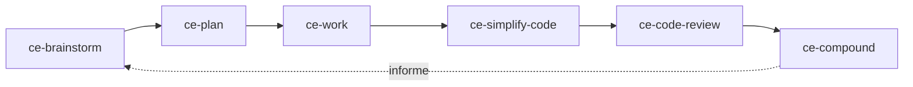

Le [plugin Compound Engineering d’Every](https://github.com/EveryInc/compound-engineering-plugin/tree/6be0932b91dc369508da19e6e2bc753b4c038830) fournit une boucle d’ingénierie complète. Cette leçon est épinglée au commit `6be0932b` et à la version 3.27.0, vérifiés le 20 septembre 2026.

Son idée distinctive est le compounding : un problème non évident et résolu devient un artefact durable dans `docs/solutions/`, que les plans futurs peuvent retrouver. Le but n’est pas d’exécuter plus d’agents, mais de rendre la prochaine modification similaire plus simple et plus sûre.

## Installer et configurer

Pour Claude Code :

```text
/plugin marketplace add EveryInc/compound-engineering-plugin
/plugin install compound-engineering
```

Pour le CLI Codex :

```bash
codex plugin marketplace add EveryInc/compound-engineering-plugin
codex plugin add compound-engineering@compound-engineering-plugin
```

Redémarre le host si nécessaire, puis invoque `ce-setup` avec la syntaxe du host. Les hosts de type Claude utilisent `/ce-setup` ; Codex utilise `$ce-setup`. Relis le `.compound-engineering/config.yaml` proposé avant de l’accepter. La configuration d’équipe est versionnée ; les préférences du checkout vont dans `config.local.yaml`. Ne mets jamais d’identifiants ou de secrets de ligne de commande dans ces fichiers.

## La boucle explicite



Fais passer une petite fonctionnalité ou un bug par chaque étape :

```text
ce-brainstorm <problème et résultat utilisateur>
ce-plan
ce-work
ce-simplify-code
ce-code-review
ce-compound
```

À chaque frontière, inspecte l’artefact :

| Étape | Preuve à conserver |
|---|---|
| Brainstorm / plan | besoins, alternatives, portée et commande de vérification |
| Work | commits et sortie de tests contrôlée par le host |
| Simplify | diff préservant le comportement |
| Review | constats par rapport au fixed point nommé |
| Compound | solution réutilisable contenant l’échec, la cause et la réparation vérifiée |

`lfg` automatise une grande partie du pipeline et peut push ou ouvrir une pull request lorsqu’un remote existe. Apprends d’abord la boucle explicite. Le merge est une autorité distincte, jamais implicite dans un mode autonome.

## Comment les trois systèmes s’articulent

| Système | Rôle principal | Premier exercice conseillé |
|---|---|---|
| Skills de Matt Pocock | Petites procédures d’ingénierie composables | Un tracer bullet, des besoins à la revue à deux axes |
| Sandcastle | Exécution isolée et gestion des branches/commits | Une exécution Docker, une branche nommée, une itération |
| Compound Engineering | Cycle complet avec apprentissage durable | Une petite modification, du brainstorm à `ce-compound` |

N’installe pas plusieurs suites de workflow dans le même premier fixture. Apprends le vocabulaire et les artefacts natifs de chacune. Ne les compose ensuite qu’après avoir écrit qui peut modifier, commit, push, merge, utiliser des identifiants, dépenser et déclarer la fin.

## Exercice

Choisis un bug déjà résolu dont la cause manque dans la documentation du dépôt. Rejoue la boucle explicite dans une branche jetable, puis inspecte l’entrée `docs/solutions/`. Un second plan doit retrouver cet apprentissage et éviter de redécouvrir la même cause. Sinon, la boucle n’a rien composé.

Les commandes ci-dessus ont été vérifiées dans le source upstream, mais aucun plugin n’a été installé et aucune exécution avec modèle n’a eu lieu pendant la rédaction. Consigne une telle expérience dans le [journal](../journal/) avant de prétendre qu’elle fonctionne dans ce dépôt.

