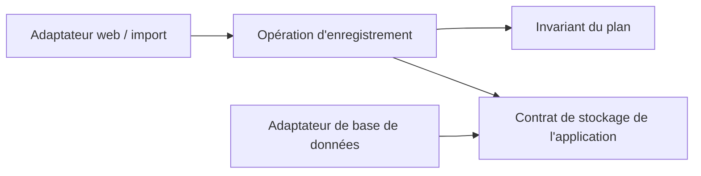

## Comparer les décisions, pas les formes

Les patterns se recoupent. Un monolithe modulaire peut contenir des modules en couches ; un module peut suivre les dépendances onion et employer des adaptateurs hexagonaux. Un diagramme concentrique ne révèle pas la topologie de déploiement.

Les définitions primaires viennent du [guide de Microsoft](https://learn.microsoft.com/dotnet/architecture/modern-web-apps-azure/common-web-application-architectures), de [Palermo pour onion](https://jeffreypalermo.com/2008/07/the-onion-architecture-part-1/), de [Martin pour clean](https://blog.cleancoder.com/uncle-bob/2012/08/13/the-clean-architecture.html), de [Cockburn pour les ports et adaptateurs](https://alistair.cockburn.us/hexagonal-architecture) et du modèle concret de [Spring Modulith](https://docs.spring.io/spring-modulith/reference/fundamentals.html). Nous appliquons leurs idées à notre plan de pratique fictif.

| Pattern | Question principale | Organisation du plan de pratique | Coût caché / meilleur contre-argument |
|---|---|---|---|
| En couches | Quelles responsabilités appellent lesquelles ? | Gestionnaire → application → accès aux données ; règle séparée | Le couplage descendant peut propager les types de stockage ; un petit CRUD peut néanmoins s'en contenter |
| Onion | Quelles dépendances peuvent pointer vers le domaine ? | Règle au centre ; contrat d'enregistrement interne, implémentation externe | Un domaine pauvre en comportement peut gagner des anneaux et conversions sans bénéfice |
| Clean | Quelle politique possède la frontière ? | Invariant, cas d'utilisation, modèles d'entrée/sortie, contrôleur et persistance externes | Un présentateur et plusieurs modèles pour une petite réponse peuvent masquer le travail |
| Hexagonal | Quelles conversations utiles traversent intérieur/extérieur ? | Web et import pilotent `SavePlan` ; stockage implémente la conversation sortante | Une interface par classe ajoute des détours ; les ports doivent correspondre aux conversations réelles |
| Monolithe modulaire | Qui possède données et comportement dans un déploiement ? | Practice possède les plans ; Catalog les positions ; Practice utilise le contrat public de Catalog | Tables partagées et imports internes peuvent effacer la frontière ; la faire respecter coûte du travail |

Les couches n'interdisent pas l'inversion des dépendances. Onion n'impose pas quatre anneaux. La direction des politiques de clean n'exige pas quatre projets. L'architecture hexagonale ne demande pas six ports. Spring Modulith est une implémentation de règles de modules, pas la définition de tous les monolithes modulaires.

## Distinguer dépendances du code et appels à l'exécution

Dans une conception aux dépendances tournées vers l'intérieur, l'application possède `PlanStore`, que l'adaptateur de base de données implémente. À l'exécution, l'application appelle toujours l'adaptateur. À cette frontière, dépendance du code et flux de contrôle vont donc dans des sens différents.

Les flèches représentent les **dépendances du code**, pas des requêtes réseau. Le point de composition choisit l'adaptateur de stockage. Aucun framework d'injection n'est nécessaire pour démontrer la règle.

Dans la candidate modulaire, Catalog peut retourner un résumé immuable d'une position et sa révision. Practice ne peut pas lire les tables internes de Catalog au seul motif que les deux vivent dans le même processus. Décider explicitement si une transaction couvre les deux modules ; partager une base ne crée pas automatiquement des responsabilités indépendantes.

## Choisir avec un changement témoin

Ajouter l'import par lot, puis simuler un changement d'API du stockage. La candidate en couches réussit si la validation est réutilisée et le changement de stockage reste contenu. Ajouter un port si une dépendance externe concrète empêche ce résultat. Ajouter une frontière de module si une responsabilité distincte et un contrat public stable le justifient.

Rejeter l'abstraction supplémentaire si elle ne protège aucun invariant et ne réduit pas les responsabilités touchées. La garder quand une vérification d'architecture détecte une violation autrement facile. Les [règles de vérification de Spring Modulith](https://docs.spring.io/spring-modulith/reference/verification.html) illustrent la détection de cycles et d'accès aux éléments internes ; les vérifications équivalentes doivent correspondre au langage et au dépôt utilisés.

## Exercice — Deux conceptions valides

Dessiner l'enregistrement avec (A) trois couches dans un projet et (B) un module Practice aux dépendances tournées vers l'intérieur. Pour chaque option, nommer une dépendance légale et une interdite. Que devrait choisir aujourd'hui une équipe de deux personnes ?

Corrigé

A : le gestionnaire peut appeler l'opération applicative ; une règle de validation qui importe un type de requête web viole la frontière choisie. B : l'adaptateur de base peut implémenter le contrat de Practice ; Catalog ne peut pas importer son modèle interne de persistance. Les deux peuvent passer les mêmes tests de comportement. Selon nos hypothèses, commencer par A, sauf si l'équipe démontre une violation de responsabilité que B empêche. La taille de l'équipe ne suffit pas : deux personnes sur un domaine complexe et durable peuvent justifier B. Documenter cette preuve plutôt que compter les anneaux.

