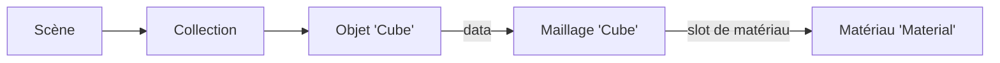

import { Tabs, TabItem } from '@astrojs/starlight/components';

Code : le script de la leçon, [`scripts/l01_datablocks.py`](https://github.com/spareilleux/learn/blob/ced9808/code/blender/scripts/l01_datablocks.py), son rapport [`expected/l01_datablocks.txt`](https://github.com/spareilleux/learn/blob/ced9808/code/blender/expected/l01_datablocks.txt), et le lanceur [`check.sh`](https://github.com/spareilleux/learn/blob/ced9808/code/blender/check.sh).

## La version

[Blender](https://www.blender.org/) a deux sortes de versions : une version régulière tous les quelques mois, et une version **à support long terme (LTS)**, qui continue de recevoir des correctifs longtemps après les versions régulières suivantes. Le 16 septembre 2026, la [page LTS](https://www.blender.org/download/lts/) liste deux séries LTS maintenues, 5.2 et 4.5, toutes deux mises à jour pour la dernière fois le 15 septembre 2026, en 5.2.2 et 4.5.14.

Le cours épingle **Blender 5.2.2 LTS**, commit [`d13f752e3b9c`](https://projects.blender.org/blender/blender/src/commit/d13f752e3b9c4f8c261cda552b1021f8bcc0382c) de la branche `blender-v5.2-release`. Blender est un logiciel libre sous [licence publique générale GNU](https://www.blender.org/about/license/) : la licence couvre le programme, pas ce que tu crées avec.

## Installer Blender

Blender publie une archive par plateforme sur [download.blender.org](https://download.blender.org/release/Blender5.2/), avec un fichier `blender-5.2.2.sha256` qui liste la somme de contrôle de chacune. Une archive n'a besoin d'aucun installateur et ne change rien au système, donc tu peux garder plusieurs versions côte à côte ; c'est ainsi que ce cours l'installe.

<Tabs syncKey="os">
<TabItem label="Windows">

Télécharge `blender-5.2.2-windows-x64.zip` (404 453 484 octets), vérifie-le et extrais-le :

```powershell
Invoke-WebRequest https://download.blender.org/release/Blender5.2/blender-5.2.2-windows-x64.zip -OutFile blender-5.2.2-windows-x64.zip
(Get-FileHash blender-5.2.2-windows-x64.zip -Algorithm SHA256).Hash.ToLower()
# 3849d17a682cba006075aaa3f3597ecb5c9c30ec31035b2e092c53e40679b535
Expand-Archive blender-5.2.2-windows-x64.zip -DestinationPath G:\learn-lab\blender
G:\learn-lab\blender\blender-5.2.2-windows-x64\blender.exe --version
```

Sur la machine de l'auteur, `Get-FileHash` a donné l'empreinte ci-dessus ; les commandes de téléchargement et d'extraction sont *à vérifier* telles qu'écrites, puisque l'archive a été téléchargée et extraite autrement. Le site propose aussi des installateurs `.msi` et `.msix`, et un build pour Windows sur Arm. [winget](https://learn.microsoft.com/windows/package-manager/winget/) a le paquet `BlenderFoundation.Blender`, mais le 16 septembre 2026, `winget show` listait encore 5.2.1, une version en retard : vérifie la version avant de t'y fier (*à vérifier* : l'installation avec winget).

</TabItem>
<TabItem label="Linux / WSL">

Télécharge `blender-5.2.2-linux-x64.tar.xz` (383 295 504 octets), vérifie-le et extrais-le :

```bash
curl -LO https://download.blender.org/release/Blender5.2/blender-5.2.2-linux-x64.tar.xz
curl -L https://download.blender.org/release/Blender5.2/blender-5.2.2.sha256 | grep linux-x64 | sha256sum -c
tar -xJf blender-5.2.2-linux-x64.tar.xz
./blender-5.2.2-linux-x64/blender --version
```

Ce sont les commandes du job de CI du cours sous Ubuntu. Blender est aussi publié en [Snap](https://snapcraft.io/blender) et sur [Flathub](https://flathub.org/apps/org.blender.Blender) (*à vérifier* : les deux, et la version qu'ils proposent). Sous WSL, les exécutions avec `--background` fonctionnent comme sous Linux ; l'interface a besoin de WSLg (*à vérifier*).

</TabItem>
<TabItem label="macOS">

Blender 5.2.2 n'est publié que pour Apple Silicon : le fichier de sommes de contrôle liste `blender-5.2.2-macos-arm64.dmg` (346 286 611 octets) et aucun build Intel. Télécharge-le, vérifie-le, et copie l'application hors de l'image disque :

```bash
curl -LO https://download.blender.org/release/Blender5.2/blender-5.2.2-macos-arm64.dmg
curl -L https://download.blender.org/release/Blender5.2/blender-5.2.2.sha256 | grep macos-arm64 | shasum -a 256 -c
hdiutil attach -nobrowse -mountpoint /tmp/blender-dmg blender-5.2.2-macos-arm64.dmg
cp -R /tmp/blender-dmg/Blender.app ~/Applications/
hdiutil detach /tmp/blender-dmg
~/Applications/Blender.app/Contents/MacOS/Blender --version
```

Ce sont les commandes du job de CI du cours sous macOS. Ouvrir le `.dmg` dans le Finder et faire glisser Blender dans Applications revient au même.

</TabItem>
</Tabs>

Sur la machine de l'auteur :

```text
$ blender --version
Blender 5.2.2 LTS
	build date: 2026-09-15
	build time: 01:37:04
	build commit date: 2026-09-14
	build commit time: 15:14
	build hash: d13f752e3b9c
	build branch: blender-v5.2-release
	build platform: Windows
	build type: Release
```

La sortie complète continue avec les options du compilateur et de l'éditeur de liens.

## Blender sans fenêtre

Blender est une application, mais son exécutable est aussi un outil en ligne de commande. Les [arguments de ligne de commande](https://docs.blender.org/manual/en/5.2/advanced/command_line/arguments.html) qui comptent pour ce cours sont :

- `--background` (`-b`) : pas de fenêtre. Les scripts Python s'exécutent, puis Blender se ferme.
- `--factory-startup` : ignore tes préférences et ton fichier de démarrage, et part de la scène d'usine. Deux machines partent alors du même état.
- `--python <file>` et `--python-expr <code>` : exécutent un script.
- `--python-exit-code 1` : quitte avec le code 1 si le script lève une exception. Sans cette option, Blender affiche la trace de pile et quitte avec 0, et la CI ne peut pas s'en rendre compte.
- `--` : tout ce qui suit est laissé au script, dans `sys.argv`.

```text
$ blender --background --factory-startup --python-expr "import bpy; print([o.name for o in bpy.data.objects])"
['Camera', 'Cube', 'Light']
Blender 5.2.2 LTS (hash d13f752e3b9c built 2026-09-15 01:37:04)

Blender quit
```

Dans cette exécution, la sortie du script est arrivée avant la bannière de Blender. Chaque script de ce cours s'exécute ainsi, depuis `check.sh` :

```bash
blender --background --factory-startup --python-exit-code 1 --python scripts/l01_datablocks.py -- out
```

## L'interface

Démarre Blender sans `--background`. La première fois, une boîte de dialogue Quick Setup demande la langue, le thème et le keymap ; garde les valeurs par défaut, que le manuel et ce cours utilisent.


La fenêtre est divisée en **zones** (areas), et chaque zone affiche un **éditeur** : le [3D Viewport](https://docs.blender.org/manual/en/5.2/editors/3dview/index.html) au milieu, l'[Outliner](https://docs.blender.org/manual/en/5.2/editors/outliner/interface.html) en haut à droite (l'arbre de la scène), le [Properties editor](https://docs.blender.org/manual/en/5.2/editors/properties_editor.html) en dessous, et la Timeline en bas. Le menu en haut à gauche de chaque zone change son type d'éditeur. Les onglets en haut (Layout, Modeling, Sculpting, UV Editing, Shading…) sont des [workspaces](https://docs.blender.org/manual/en/5.2/interface/window_system/workspaces.html) : des dispositions de zones enregistrées pour une tâche, comme les perspectives d'un IDE.

Quelques raccourcis du keymap par défaut ([`blender_default.py`](https://projects.blender.org/blender/blender/src/commit/d13f752e3b9c4f8c261cda552b1021f8bcc0382c/scripts/presets/keyconfig/keymap_data/blender_default.py)) couvrent l'essentiel de la navigation. Les raccourcis agissent sur la zone sous le pointeur de la souris, pas sur la dernière zone où tu as cliqué :

| Action | Raccourci |
|---|---|
| Orbiter, déplacer, zoomer la vue | glisser avec le bouton du milieu, Shift + glisser avec le bouton du milieu, molette |
| Cadrer la sélection | `.` du pavé numérique |
| Vues de face, de droite, de dessus | `1`, `3`, `7` du pavé numérique (Ctrl pour le côté opposé) |
| Déplacer, tourner, mettre à l'échelle la sélection | `G`, `R`, `S`, puis éventuellement `X`, `Y` ou `Z` pour bloquer un axe |
| Passer d'Object Mode à Edit Mode | `Tab` |
| Chercher n'importe quelle commande | `F3` |
| Agrandir la zone sous le pointeur | `Ctrl` + `Space` |
| Dupliquer, dupliquer en lien | `Shift` + `D`, `Alt` + `D` |

L'Object Mode travaille sur des objets entiers ; l'Edit Mode travaille sur les sommets, arêtes et faces d'un maillage (leçon 2). La [page sur la navigation](https://docs.blender.org/manual/en/5.2/editors/3dview/navigate/index.html) du manuel couvre le reste, y compris les ordinateurs portables sans pavé numérique ni bouton du milieu.

Deux choses aident un développeur. Dans **Edit › Preferences › Interface**, active [**Python Tooltips**](https://docs.blender.org/manual/en/5.2/editors/preferences/interface.html) : l'infobulle d'un champ affiche alors ses informations Python, comme `bpy.data.objects["Cube"].location`. Et le workspace **Scripting** a une console Python, à côté d'un [Info editor](https://docs.blender.org/manual/en/5.2/editors/info_editor.html) qui journalise les opérateurs que tu exécutes.

## Le fichier .blend est une base de données

Enregistre la scène et tu obtiens un fichier `.blend`. Ce n'est pas un document à la structure fixe : il ressemble plutôt à une base de données, avec une table par type de **bloc de données** (data-block). Le [manuel](https://docs.blender.org/manual/en/5.2/files/data_blocks.html) les appelle data-blocks, l'API Python les appelle des [`ID`](https://docs.blender.org/api/5.2/bpy.types.ID.html), et `bpy.data` donne accès à toutes les tables. Le script affiche celles qui ne sont pas vides dans la scène d'usine :

```text
== What bpy.data holds (non-empty collections)
bpy.data.cameras: ['Camera']
bpy.data.scenes: ['Scene']
bpy.data.objects: ['Camera', 'Cube', 'Light']
bpy.data.materials: ['Dots Stroke', 'Material']
bpy.data.meshes: ['Cube']
bpy.data.lights: ['Light']
bpy.data.screens: ['Animation', 'Compositing', 'Geometry Nodes', 'Layout', 'Modeling', 'Rendering', 'Scripting', 'Sculpting', 'Shading', 'Texture Paint', 'UV Editing']
bpy.data.window_managers: ['WinMan']
bpy.data.images: ['Render Result', 'Viewer Node']
bpy.data.worlds: ['World']
bpy.data.collections: ['Collection']
bpy.data.palettes: ['Palette']
bpy.data.linestyles: ['LineStyle']
bpy.data.workspaces: ['Animation', 'Compositing', 'Geometry Nodes', 'Layout', 'Modeling', 'Rendering', 'Scripting', 'Sculpting', 'Shading', 'Texture Paint', 'UV Editing']
```

Les workspaces et les screens sont dans la liste : la disposition de l'interface est enregistrée dans le fichier, à côté de la scène. `Dots Stroke` est le matériau par défaut de Grease Pencil, les objets de dessin 2D de Blender.

### Les objets et leurs données

Un **objet** contient où se trouve quelque chose (position, rotation, échelle, parent) et pointe vers ses **données**, qui contiennent ce qu'il est : un maillage, une caméra, une lumière. Le matériau est un troisième bloc de données, vers lequel pointe le maillage :

```text
== The factory startup scene
scene 'Scene' engine BLENDER_EEVEE frames 1 - 250
collection 'Scene Collection' objects []
  collection 'Collection' objects ['Camera', 'Cube', 'Light']
object 'Camera' type CAMERA data Camera 'Camera' location (7.359, -6.926, 4.958)
object 'Cube' type MESH data Mesh 'Cube' location (0.000, 0.000, 0.000)
object 'Light' type LIGHT data PointLight 'Light' location (4.076, 1.005, 5.904)

== An object points to its data
cube.data is bpy.data.meshes['Cube']: True
mesh 'Cube' vertices 8 edges 12 faces 6 loops 24
material slots [('DATA', 'Material')]
users: object 1 mesh 1 material 1
```



En termes de C# ou de Java, un objet et son maillage sont deux instances, et l'objet détient une référence vers le maillage. La différence, c'est que Blender compte les références : chaque bloc de données a un compteur `users`, comme le compteur de références d'un objet COM ou le compteur d'utilisation d'un `shared_ptr`.

### Duplications liées et complètes

**Shift + D** duplique un objet et, par défaut, son maillage. **Alt + D** fait une *duplication liée* (linked duplicate) : un nouvel objet qui pointe vers le même maillage. Les données que copie Shift + D sont une préférence (Edit › Preferences › Editing › Duplicate Data) : les maillages et les lumières oui, les matériaux non. Le script fait les deux à la main :

```python
linked = cube.copy()  # a new object, the same mesh
full = cube.copy()
full.data = mesh.copy()  # a new object and a new mesh
```

```text
== Linked duplicate (Alt+D) and full duplicate (Shift+D)
after the linked duplicate: objects 4 meshes 1 mesh users 2
after the full duplicate: meshes [('Cube', 2), ('Cube.001', 1)]
the material is shared by both meshes: material users 2
```

Modifier en Edit Mode le maillage d'une duplication liée change chaque objet qui l'utilise. La touche du cours (leçon 2) s'en sert pour ses 22 frettes : un maillage, 22 objets.

### Orphelins, faux utilisateurs, et ce que garde l'enregistrement

Supprimer un objet ne supprime pas son maillage. Le maillage reste dans `bpy.data` avec zéro utilisateur : c'est un **orphelin**. Blender ne le libère pas tant que le fichier est ouvert, mais **l'enregistrement ignore les blocs de données sans utilisateurs**. Pour garder un bloc de données sans utilisateurs, donne-lui un **faux utilisateur** (fake user, l'icône de bouclier à côté de son nom), qui compte pour un utilisateur :

```text
== Orphans and fake users
after removing the object 'Full': meshes [('Cube', 2), ('Cube.001', 0)]
a new mesh with a fake user: users 1 use_fake_user True
meshes written to the file: ['Cube', 'Kept']
objects written to the file: ['Camera', 'Cube', 'Light', 'Linked']
orphans_purge: {'FINISHED'} meshes left [('Cube', 2), ('Kept', 1)]
```

`bpy.data.libraries.load` ouvre un fichier `.blend` et liste ce qu'il contient sans le charger : l'orphelin `Cube.001` n'a pas été écrit. **File › Clean Up › Purge Unused Data** (`bpy.ops.outliner.orphans_purge`) supprime les orphelins du fichier ouvert.

C'est un ramasse-miettes qui s'exécute à l'enregistrement, avec des compteurs de références au lieu de l'accessibilité. Il surprend ceux qui s'attendent à ce qu'un fichier enregistré contienne ce qu'ils voient dans la vue *Blender File* de l'outliner : un matériau que tu as créé et pas encore assigné a disparu après avoir enregistré et rouvert le fichier.

### Les noms

Le nom d'un bloc de données est sa clé dans sa table, donc les noms sont uniques par type, pas entre types. Blender ajoute `.001`, `.002` pour résoudre un conflit. Les noms sont limités à 255 octets : [`DNA_ID.h`](https://projects.blender.org/blender/blender/src/commit/d13f752e3b9c4f8c261cda552b1021f8bcc0382c/source/blender/makesdna/DNA_ID.h#L366-L367) réserve 2 caractères pour le code de type et 256 pour le nom, avec son zéro final.

```text
== Names are unique per type
D.meshes.new('Cube').name: 'Cube.001'
a material may also be called 'Cube': 'Cube'
a 300-character name is cut to 255 characters
```

Les scripts devraient garder l'objet que renvoie `new`, et non le rechercher de nouveau par le nom qu'ils ont demandé.

## RNA : des propriétés qui se décrivent elles-mêmes

Chaque champ que tu vois dans l'interface est une **propriété RNA**, la couche de réflexion de Blender. L'API Python, l'interface, l'animation et les drivers passent tous par elle. Chaque propriété porte des métadonnées, comme un `PropertyInfo` de C# avec des attributs, ou un `PropertyDescriptor` JavaBeans :

```text
== RNA: properties describe themselves
Object.location: type FLOAT subtype TRANSLATION unit LENGTH array_length 3
default [0.0, 0.0, 0.0]
repr(cube): bpy.data.objects['Cube']
repr(cube.location): Vector((0.0, 0.0, 0.0))
path_from_id('location'): location
path_resolve('location'): Vector((0.0, 0.0, 0.0))
Object has 141 RNA properties; Mesh has 71
an ID's own properties: ['rna_type', 'name', 'name_full', 'id_type', 'session_uid', 'is_evaluated', 'original', 'users']
```

Le sous-type `TRANSLATION` et l'unité `LENGTH` expliquent pourquoi l'interface affiche `location` sous forme de trois distances en mètres. Le `repr` d'un bloc de données est l'expression Python qui le retrouve, et `path_from_id` donne le *data path* (chemin de données) d'une propriété depuis son bloc de données : la leçon 7 anime des propriétés par ces chemins. L'[aperçu de l'API](https://docs.blender.org/api/5.2/info_overview.html) et sa [page des pièges](https://docs.blender.org/api/5.2/info_gotcha.html) valent la peine d'être lus une fois.

| Blender | C# ou Java |
|---|---|
| `bpy.data.meshes`, `bpy.data.objects`… | une table ou un `DbSet` par type |
| bloc de données (`ID`) avec `users` | un objet à comptage de références |
| objet → données → matériau | des objets qui détiennent des références vers des instances partagées |
| orphelins ignorés à l'enregistrement | un ramasse-miettes au moment de la sérialisation |
| faux utilisateur | une racine du GC |
| propriété RNA avec sous-type et unité | `PropertyInfo` avec attributs, `PropertyDescriptor` |

## Points clés

- Blender 5.2.2 LTS s'installe depuis une archive vérifiée avec `blender-5.2.2.sha256` ; `--background --factory-startup --python-exit-code 1` exécute un script de façon reproductible et échoue quand le script échoue.
- La fenêtre est faite de zones qui affichent des éditeurs ; les workspaces sont des dispositions enregistrées, et elles sont stockées dans le fichier `.blend`, elles aussi.
- Un fichier `.blend` est une base de données de blocs de données, une table par type, avec des noms uniques par type.
- Les objets pointent vers des données, et les données vers des matériaux ; chaque bloc de données compte ses utilisateurs.
- L'enregistrement ignore les blocs de données sans utilisateurs, sauf s'ils ont un faux utilisateur.
- RNA décrit chaque propriété, et c'est ce que partagent l'API Python, l'interface et l'animation.

## Exercices

1. Dans la scène d'usine, supprime l'objet `Cube`, enregistre et rouvre le fichier. Quels maillages et quels matériaux le fichier contient-il, et avec combien d'utilisateurs ?
2. Fais une duplication liée du cube. Quelle API liste, pour le maillage et le matériau, les blocs de données qui les utilisent ?
3. Avant de l'exécuter, prédis ce qu'affiche `blender --background --factory-startup --python-expr "import bpy; bpy.data.objects.remove(bpy.data.objects['Cube']); print(len(bpy.data.meshes))"`, et pourquoi.

<details>
<summary>Solution 1</summary>

```text
== Exercise 1: remove the Cube object, save, and reload
before saving: mesh 'Cube' users 0 | material 'Material' users 1
after reloading: meshes [] | materials [('Material', 0)]
```

Le maillage orphelin n'est pas écrit. Le matériau l'est : au moment de l'enregistrement, le maillage orphelin comptait encore comme un utilisateur. Après le rechargement, le maillage a disparu, donc le matériau n'a plus d'utilisateurs ; il sera abandonné au prochain enregistrement.

</details>

<details>
<summary>Solution 2</summary>

[`bpy.data.user_map`](https://docs.blender.org/api/5.2/bpy.types.BlendData.html#bpy.types.BlendData.user_map) renvoie, pour chaque bloc de données, l'ensemble des blocs de données qui l'utilisent :

```python
users = bpy.data.user_map(subset=[bpy.data.meshes["Cube"], bpy.data.materials["Material"]])
```

```text
== Exercise 2: who uses a data-block?
bpy.data.meshes['Cube'] is used by ["bpy.data.objects['Cube']", "bpy.data.objects['Twin']"]
bpy.data.materials['Material'] is used by ["bpy.data.meshes['Cube']"]
```

</details>

<details>
<summary>Solution 3</summary>

Il affiche `1`. Supprimer l'objet laisse le maillage dans `bpy.data.meshes`, avec zéro utilisateur ; seul un enregistrement, ou une purge, l'abandonnerait.

</details>

## Sources

- Blender, [versions LTS](https://www.blender.org/download/lts/), [licence](https://www.blender.org/about/license/), et les [téléchargements de 5.2.2](https://download.blender.org/release/Blender5.2/).
- Manuel de Blender 5.2 : [installation](https://docs.blender.org/manual/en/5.2/getting_started/installing/index.html), [arguments de ligne de commande](https://docs.blender.org/manual/en/5.2/advanced/command_line/arguments.html), [interface](https://docs.blender.org/manual/en/5.2/interface/index.html), [keymap](https://docs.blender.org/manual/en/5.2/interface/keymap/index.html), [data-blocks](https://docs.blender.org/manual/en/5.2/files/data_blocks.html), [duplications liées](https://docs.blender.org/manual/en/5.2/scene_layout/object/editing/duplicate_linked.html).
- API Python de Blender 5.2 : [`ID`](https://docs.blender.org/api/5.2/bpy.types.ID.html), [`BlendDataLibraries`](https://docs.blender.org/api/5.2/bpy.types.BlendDataLibraries.html), [aperçu](https://docs.blender.org/api/5.2/info_overview.html), [pièges](https://docs.blender.org/api/5.2/info_gotcha.html).
- Code source de Blender à 5.2.2 : [`DNA_ID.h`](https://projects.blender.org/blender/blender/src/commit/d13f752e3b9c4f8c261cda552b1021f8bcc0382c/source/blender/makesdna/DNA_ID.h), [`blender_default.py`](https://projects.blender.org/blender/blender/src/commit/d13f752e3b9c4f8c261cda552b1021f8bcc0382c/scripts/presets/keyconfig/keymap_data/blender_default.py).
