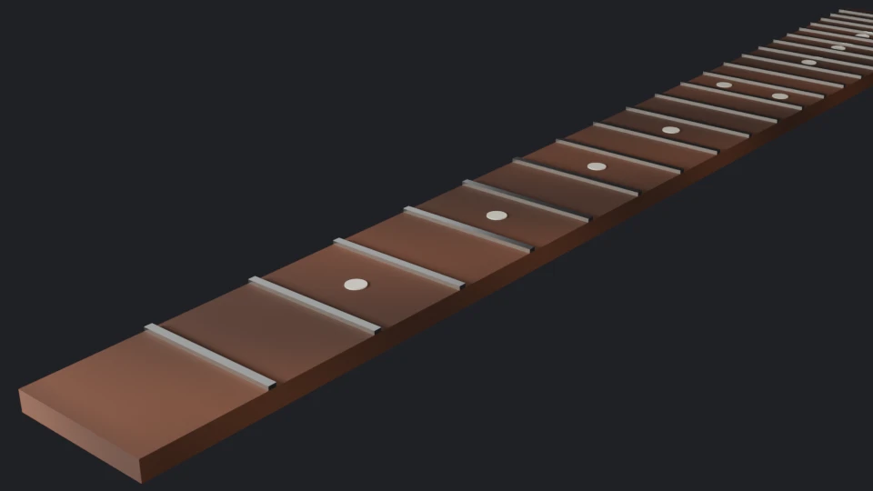

:::note[Comment ce cours est testé]
Le code du cours est dans [`code/blender`](https://github.com/spareilleux/learn/tree/main/code/blender) : des scripts Python pour [Blender](https://www.blender.org/) **5.2.2 LTS**, exécutés avec `blender --background --factory-startup`. `check.sh` exécute le script de chaque leçon et compare son rapport (listes d'objets, nombres de sommets et de faces, valeurs des matériaux, contenu d'un export glTF, mesures de bruit et empreinte d'une image rendue) avec les fichiers de `expected/`. Un workflow, `blender-examples.yml`, télécharge Blender depuis download.blender.org et l'exécute sous Linux, Windows et macOS, avec Cycles sur le CPU. Les captures d'écran, les durées sur GPU et les rendus EEVEE viennent d'une seule machine : Windows 11, une NVIDIA GeForce RTX 5080, en septembre 2026.
:::

## Pourquoi j'apprends ça

Le [cours three.js](../threejs/) du site charge des modèles glTF, et GuitarAlchemist dessine un manche de guitare en 3D dans le navigateur. Jusqu'ici, ces modèles sont écrits par du code, primitive par primitive. C'est dans Blender que les modèles 3D sont d'habitude créés, et il est gratuit, open source et scriptable en Python de bout en bout.

Je veux comprendre comment Blender stocke une scène, comment modéliser, texturer et éclairer quelque chose de simple mais réel, et comment l'exporter pour le web. Je veux aussi le piloter par des scripts, parce que c'est là qu'un développeur apporte le plus à une chaîne de production 3D : exports par lots, scènes générées et vérifications en CI.

## À qui s'adresse ce cours

Tu écris du C# ou du Java, et tu n'as jamais fait de 3D. Tu n'as pas besoin de bien connaître Python : les scripts sont courts, et le [cours Python](../python-for-csharp-java/) couvre le langage. Il te faut une souris avec une molette ; une carte graphique aide pour EEVEE et le viewport, mais chaque script du cours tourne sur le CPU, comme en CI.

## Un ordre différent : des scripts dès la leçon 1

La plupart des tutoriels Blender gardent les scripts pour la fin. Ce cours fait entrer `bpy`, l'API Python de Blender, dans chaque leçon dès la première, pour deux raisons. Un développeur comprend plus vite un modèle de données en l'affichant qu'en cliquant dedans. Et un script qui construit une scène donne un résultat vérifiable : les mêmes nombres de sommets, les mêmes valeurs de matériaux et, comme le montre la leçon 4, les mêmes pixels rendus sur trois systèmes d'exploitation.

Chaque leçon a donc deux moitiés : ce que tu fais dans l'interface, et à quoi ressemble la même chose en `bpy`. La leçon 5 va ensuite plus loin dans l'API elle-même.

## À la fin de ce cours, je saurai

- m'orienter dans l'interface de Blender, et expliquer ce que contient un fichier `.blend` ;
- modéliser avec des maillages et des modificateurs, et lire la topologie d'un maillage ;
- construire des matériaux à nœuds avec le Principled BSDF, déplier des UV et utiliser des textures images ;
- éclairer une scène, et choisir entre EEVEE et Cycles, le nombre d'échantillons et le débruitage ;
- écrire des scripts `bpy` qui construisent, vérifient et rendent des scènes sans fenêtre ;
- construire de la géométrie procédurale avec Geometry Nodes ;
- animer avec des images clés, des armatures et des contraintes ;
- exporter en glTF 2.0 pour three.js, et savoir ce que l'exporteur garde et abandonne ;
- écrire un add-on et le packager en extension ;
- exécuter des rendus et des exports en CI.

## Plan

| # | Leçon | En termes de C# ou de Java |
|---|---|---|
| 1 | [L'interface, et le fichier .blend comme base de données](01-interface-data-blocks/) | un modèle objet avec comptage de références, et la réflexion |
| 2 | [Modélisation polygonale et modificateurs](02-modeling-modifiers/) | une chaîne de décorateurs, évaluée paresseusement |
| 3 | [Matériaux, UV, et ce que glTF en garde](03-materials-uv-gltf/) | un graphe de flux de données, et un sérialiseur avec perte |
| 4 | [Lumières, caméras, et rendu avec EEVEE et Cycles](04-lighting-rendering/) | une estimation de Monte-Carlo, et un `Random` initialisé par une graine |
| 5 | Scripter avec `bpy` : données, opérateurs, contexte et ligne de commande | l'API derrière l'interface |
| 6 | Geometry Nodes : la modélisation procédurale comme programme de flux de données | du LINQ sur des sommets |
| 7 | Animation : images clés, courbes, armatures et contraintes | — |
| 8 | Exporter pour le web : glTF 2.0, Draco, meshopt et KTX2, chargés dans three.js | — |
| 9 | Add-ons : opérateurs, panneaux et propriétés, packagés en extension | une API de plugins, et un registre de paquets |
| 10 | Une chaîne automatisée : rendus et exports par lots, et tests des scripts `bpy` en CI | — |
| 11 | Sculpture et retopologie (aperçu) | — |
| 12 | Simulation : physique, particules et fluides (aperçu, avec leurs coûts de calcul) | — |
| 13 | Projet : un manche de guitare pour GuitarAlchemist, exporté en glTF et affiché dans three.js | — |
| — | [Journal](journal/) | |

Les leçons 5 à 13 sont le plan ; elles changeront à mesure que les premières m'apprendront ce qui compte.

## Le modèle du cours

Chaque leçon travaille sur le même objet : une touche de guitare de 22 frettes, avec un diapason de 648 mm (25,5 pouces), construite par [`scripts/fretboard.py`](https://github.com/spareilleux/learn/blob/ced9808/code/blender/scripts/fretboard.py). Les frettes sont placées là où le tempérament égal les met, ce qu'un modificateur ne sait pas faire et qu'un script fait en une ligne. Aucun fichier `.blend` n'est dans le dépôt : les scripts reconstruisent la scène à chaque fois.

## Ressources

- [Manuel de Blender 5.2](https://docs.blender.org/manual/en/5.2/) et [référence de l'API Python](https://docs.blender.org/api/5.2/).
- [Le code source de Blender](https://projects.blender.org/blender/blender), au [tag v5.2.2](https://projects.blender.org/blender/blender/src/tag/v5.2.2) (commit `d13f752e3b9c`).
- [Les versions LTS de Blender](https://www.blender.org/download/lts/), avec leurs périodes de support.
- Khronos, [spécification glTF 2.0](https://registry.khronos.org/glTF/specs/2.0/glTF-2.0.html), et le [dépôt de l'exporteur glTF](https://github.com/KhronosGroup/glTF-Blender-IO).
