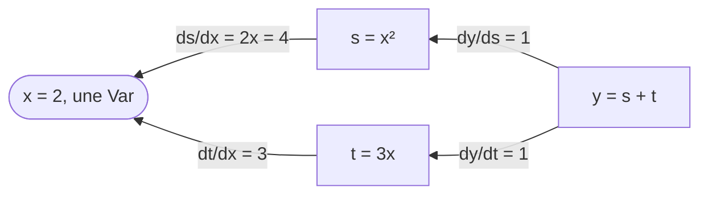

Entraîner un modèle, c'est suivre la pente d'une perte vers le bas, et le [cours IX, leçon 2](../../machine-learning-ix/02-linear-regression/) a calculé ce gradient à la main pour une droite. Les frameworks le calculent pour toute expression construite à partir de leurs opérations : c'est la différentiation automatique, dans son mode inverse, la *rétropropagation* des réseaux de neurones. Cette leçon utilise celle de Candle, la vérifie de trois façons, puis entraîne avec elle la droite du cours IX et fait passer le même gradient par l'implémentation d'IX lui-même.

Le code est [`examples/l04_autodiff.rs`](https://github.com/spareilleux/learn/blob/c45b150/code/candle/course/examples/l04_autodiff.rs), [`examples/l04_linear_regression.rs`](https://github.com/spareilleux/learn/blob/c45b150/code/candle/course/examples/l04_linear_regression.rs) et [`examples/l04_exercises.rs`](https://github.com/spareilleux/learn/blob/c45b150/code/candle/course/examples/l04_exercises.rs).

## Trois noms

| Candle | Ce que c'est | PyTorch |
|---|---|---|
| [`Var`](https://docs.rs/candle-core/0.11.0/candle_core/struct.Var.html) | un tenseur marqué comme variable : les opérations qui l'utilisent sont enregistrées | un tenseur avec `requires_grad=True` |
| [`Tensor::backward`](https://docs.rs/candle-core/0.11.0/candle_core/struct.Tensor.html#method.backward) | parcourt le graphe enregistré d'un résultat jusqu'à ses variables | `loss.backward()` |
| [`GradStore`](https://docs.rs/candle-core/0.11.0/candle_core/backprop/struct.GradStore.html) | les gradients, retrouvés par tenseur | le champ `.grad` de chaque tenseur |

La différence de la dernière ligne façonne tout le reste. PyTorch écrit chaque gradient dans le tenseur, et y ajoute au `backward` suivant jusqu'à ce que tu appelles `zero_grad`. Candle renvoie une nouvelle table à chaque appel de `backward` et ne modifie aucun tenseur.

## Une première dérivée

`y = x² + 3x` en `x = 2`, dont la dérivée `2x + 3` vaut 7 ([lignes 10-18](https://github.com/spareilleux/learn/blob/c45b150/code/candle/course/examples/l04_autodiff.rs#L10-L18)) :

```rust
let x = Var::new(2f64, &dev)?;
let y = (x.sqr()? + x.affine(3., 0.)?)?;
let grads = y.backward()?;
println!("y {}", y.to_scalar::<f64>()?);
println!(
    "dy/dx {}",
    grads.get(&x).expect("x is a Var").to_scalar::<f64>()?
);
```

```text
== y = x^2 + 3x at x = 2, so dy/dx = 2x + 3 = 7
y 10
dy/dx 7
```

Une `Var` se déréférence en `Tensor`, donc `x.sqr()` fonctionne comme sur n'importe quel tenseur. `affine(3., 0.)` calcule `3x + 0` ; `x * 3.0` ferait la même chose. `grads.get(&x)` renvoie une `Option` : `None` quand le résultat ne dépend pas de `x`.

[`backward`](https://github.com/huggingface/candle/blob/31f35b147389700ed2a178ee66a91c3cc25cc80d/candle-core/src/backprop.rs#L165-L200) trie les nœuds derrière `y` pour que chacun vienne avant ses entrées, amorce le gradient de `y` lui-même avec des uns, puis pour chaque nœud applique la règle de dérivation en chaîne et ajoute le résultat au gradient de chaque entrée :

```rust
pub fn backward(&self) -> Result<GradStore> {
    let sorted_nodes = self.sorted_nodes();
    let mut grads = GradStore::new();
    grads.insert(self, self.ones_like()?.contiguous()?);
    for node in sorted_nodes.iter() {
        if node.is_variable() {
            continue;
        }
        let grad = grads
            .remove(node)
            .expect("candle internal error - grad not populated");
```



`x` reçoit 4 par `s` et 3 par `t`, et les deux s'additionnent pour donner 7.

## Quels tenseurs reçoivent un gradient

[Lignes 20-39](https://github.com/spareilleux/learn/blob/c45b150/code/candle/course/examples/l04_autodiff.rs#L20-L39) mélangent une `Var` et des tenseurs simples :

```rust
let w = Var::new(&[1f32, -2., 3.], &dev)?;
let c = Tensor::new(&[4f32, 5., 6.], &dev)?;
let loss = w.mul(&c)?.sqr()?.sum_all()?; // sum((w * c)^2), d/dw = 2 * w * c^2
let grads = loss.backward()?;
```

```text
== which tensors get a gradient
d loss / dw: shape [3], F32, [32, -100, 216]
2 * w * c^2 by hand: shape [3], F32, [32, -100, 216]
d loss / dc, c a plain tensor: shape [3], F32, [8, 40, 108]
tensors in the GradStore: 2
loss = sum(w * exp(c)): gradient for e true, for c false
```

Le gradient de `w` correspond à la dérivée calculée à la main. La surprise, c'est `c` : un tenseur simple, jamais marqué, qui a lui aussi un gradient, `2 · w² · c`. La lecture de [`backprop.rs`](https://github.com/huggingface/candle/blob/31f35b147389700ed2a178ee66a91c3cc25cc80d/candle-core/src/backprop.rs#L165-L200) l'explique. Le parcours ne visite que les nœuds qui mènent à une `Var`, mais chaque nœud visité transmet un gradient à **toutes** ses entrées, et rien ne retire les gradients des entrées qui ne sont pas des nœuds. Un tenseur simple qui est l'entrée directe d'une opération enregistrée en reçoit donc un ; un tenseur simple un cran plus loin, comme `c` derrière `e = c.exp()`, n'en reçoit pas, parce que l'`exp` d'un tenseur simple n'a jamais été enregistré.

C'est sans conséquence pour le résultat, mais cela coûte du travail : pour la régression linéaire plus bas, Candle calcule aussi un gradient pour les 52 nombres de pages et les 52 temps de build. Le `GradStore` de cet exemple contient 4 tenseurs, `w`, `b`, `x` et `y`, ce qu'un programme jetable affichant l'identifiant de chaque tenseur a confirmé.

## Additions, amorces, et pas d'accumulation

[Lignes 41-63](https://github.com/spareilleux/learn/blob/c45b150/code/candle/course/examples/l04_autodiff.rs#L41-L63) vérifient trois règles :

```rust
let h = w.affine(1., 1.)?; // h = w + 1
let twice = h.mul(&h)?.sum_all()?; // sum(h * h), d/dw = 2h
let v = w.sqr()?; // [w0^2, w1^2, w2^2]
let first = loss.backward()?;
let second = loss.backward()?;
```

```text
== a tensor used twice adds up its gradients
d sum(h*h) / dw: shape [3], F32, [4, -2, 8]

== backward on a tensor that isn't a scalar starts from ones
d v / dw, seeded with ones: shape [3], F32, [2, -4, 6]
d sum(v) / dw: shape [3], F32, [2, -4, 6]

== each backward returns a new GradStore: nothing accumulates between calls
first: shape [3], F32, [32, -100, 216]
second: shape [3], F32, [32, -100, 216]
```

- **Un tenseur utilisé deux fois** reçoit les deux contributions : le produit de `h` par lui-même donne à `h` un gradient de `h` de chaque côté, donc le gradient vaut **deux fois** `h`, `[4, -2, 8]`, pour `w = [1, -2, 3]`.
- **Un résultat qui n'est pas un scalaire** est amorcé avec des uns, ce qui est le gradient de sa somme. PyTorch refuse `backward()` sur un non-scalaire sans argument `gradient` explicite ; Candle l'accepte en silence, donc une perte que tu as oublié de réduire « marche » quand même.
- **Deux appels donnent les mêmes gradients.** Il n'y a pas de `zero_grad` à oublier. Le revers : pour additionner des gradients sur plusieurs lots, tu additionnes les `GradStore` toi-même.

## Ce qui arrête un gradient

[Lignes 65-81](https://github.com/spareilleux/learn/blob/c45b150/code/candle/course/examples/l04_autodiff.rs#L65-L81) :

```rust
let stopped = w.detach().mul(&c)?.sum_all()?;
let rounded = w.affine(0.5, 0.)?.round()?.sum_all()?;
let through_max = w.max_keepdim(D::Minus1)?.sum_all()?;
```

```text
== detach and operations without a gradient
through detach: gradient for w None
through round: gradient for w None
through max: d max(w) / dw: shape [3], F32, [0, 0, 1]
```

- `detach` coupe le graphe, comme à la leçon 3.
- `round`, `floor`, `ceil` et `sign` ont une dérivée nulle presque partout, et le parcours les saute ([`backprop.rs`, lignes 114-117](https://github.com/huggingface/candle/blob/31f35b147389700ed2a178ee66a91c3cc25cc80d/candle-core/src/backprop.rs#L114-L117)). Le résultat est `None`, pas un tenseur de zéros, donc un code qui fait `unwrap` sur le gradient panique. Les tenseurs entiers n'ont pas de gradient non plus : une `Var` de `u32` reçoit `None` (plus bas).
- `max` envoie tout le gradient au plus grand élément, `3` à l'indice 2.

Les gradients eux-mêmes sont détachés du graphe ([lignes 176-182](https://github.com/huggingface/candle/blob/31f35b147389700ed2a178ee66a91c3cc25cc80d/candle-core/src/backprop.rs#L176-L182)), donc le gradient d'un gradient, une dérivée seconde, n'est pas disponible : le commentaire à cet endroit déclare les dérivées d'ordre deux hors du périmètre. Une variable d'environnement lue à la ligne suivante, `CANDLE_GRAD_DO_NOT_DETACH`, les garde attachés (*à vérifier*, le cours ne l'a pas essayée).

## Vérifier par différences finies

Une dérivée à la main marche pour de petites expressions. Pour n'importe quelle fonction, la **différence centrée** `(f(a + ε) − f(a − ε)) / 2ε` approche chaque dérivée partielle, un élément à la fois. [Lignes 83-106](https://github.com/spareilleux/learn/blob/c45b150/code/candle/course/examples/l04_autodiff.rs#L83-L106) la comparent avec `backward` pour `sum(tanh(a · b))`, un produit matriciel suivi d'une non-linéarité, en `f64` :

```rust
let f = |a: &Tensor| -> candle_core::Result<Tensor> { a.matmul(&b)?.tanh()?.sum_all() };
let analytic = f(a.as_tensor())?.backward()?.get(&a).unwrap().clone();
let eps = 1e-6;
```

```text
== matmul against finite differences, f64
backward: shape [2, 3], F64, [0.007283, 0.001819, -0.007278, 0.420743, -0.419782, 1.259154]
finite differences: shape [2, 3], F64, [0.007283, 0.001819, -0.007278, 0.420743, -0.419782, 1.259154]
largest gap below 1e-8: true
```

Utilise `f64` pour cette vérification : en `f32`, `ε = 1e-6` se perd dans les arrondis, et un `ε` plus grand dégrade l'approximation elle-même. C'est la vérification à faire quand tu écris une opération personnalisée avec sa propre passe arrière.

## `Var::set`

Pour mettre à jour un paramètre, [`Var::set`](https://github.com/huggingface/candle/blob/31f35b147389700ed2a178ee66a91c3cc25cc80d/candle-core/src/variable.rs#L130-L151) copie de nouvelles valeurs dans le tampon de la variable ([lignes 108-125](https://github.com/spareilleux/learn/blob/c45b150/code/candle/course/examples/l04_autodiff.rs#L108-L125)) :

```text
== Var::set changes the value in place
p after set: shape [2], F32, [10, 20]
a clone taken before set sees it: shape [2], F32, [10, 20]
p.set(&p.detach()): error: cannot set variable cannot set a variable to a tensor that is derived from its value
p.set(3 values): error: shape mismatch in set, lhs: [2], rhs: [3]
p.set(f64 values): error: dtype mismatch in copy_strided, lhs: F64, rhs: F32
gradient for a u32 Var: None
```

- **La mise à jour se fait en place**, la seule modification d'un tenseur que ce cours ait rencontrée : un clone pris avant `set` partage le tampon (leçon 3) et voit les nouvelles valeurs.
- **Une valeur qui partage le tampon de la variable est refusée**, et `detach` le partage. `w - lr · grad` est un nouveau tenseur, donc un pas de descente passe.
- **La forme et le type des éléments doivent correspondre** ; l'erreur de type nomme `copy_strided`, l'opération interne, avec `lhs` et `rhs` dans l'ordre inverse de `set`.

[Les optimiseurs de `candle-nn`](https://docs.rs/candle-nn/0.11.0/candle_nn/optim/index.html) font ce même `set` pour toi (leçon 5). Cette leçon écrit le pas à la main, pour le comparer au cours IX.

## La régression linéaire du cours IX

Le cours IX ajuste `seconds = w · pages + b` aux temps de build de ce site, sur les 52 premiers des 65 builds dans l'ordre des commits, avec l'erreur quadratique moyenne comme perte. [`data/builds.csv`](https://github.com/spareilleux/learn/blob/c45b150/code/candle/data/builds.csv) est une copie de ses données, et [lignes 25-32](https://github.com/spareilleux/learn/blob/c45b150/code/candle/course/examples/l04_linear_regression.rs#L25-L32) écrivent la perte avec des opérations sur les tenseurs :

```rust
fn mse(x: &Tensor, y: &Tensor, w: &Tensor, b: &Tensor) -> candle_core::Result<Tensor> {
    x.broadcast_mul(w)?
        .broadcast_add(b)?
        .sub(y)?
        .sqr()?
        .mean_all()
}
```

`w` et `b` sont des tenseurs scalaires, de forme `[]`, et les pages un vecteur de 52, d'où les opérations `broadcast_` (leçon 2).

### Le gradient, de trois façons

En `w = 0, b = 0`, par Candle, par les formules du cours IX, et par [`ix-autograd`](https://github.com/GuitarAlchemist/ix/tree/490c39533627d296bf9f8f050e6fafc14d7a20c2/crates/ix-autograd), la différentiation automatique d'IX lui-même, épinglée au commit `490c395` dans [`Cargo.toml`](https://github.com/spareilleux/learn/blob/c45b150/code/candle/Cargo.toml) ([lignes 52-115](https://github.com/spareilleux/learn/blob/c45b150/code/candle/course/examples/l04_linear_regression.rs#L52-L115)) :

```rust
let w = Var::new(0f64, &dev)?;
let b = Var::new(0f64, &dev)?;
let loss = mse(&x, &y, &w, &b)?;
let grads = loss.backward()?;
// ix-autograd : le même graphe sur sa bande, avec x en matrice (n, 1) et w, b en (1, 1)
let mut ctx = DiffContext::new(ExecutionMode::Train);
let state = LinearRegressionTool::build_graph(
    &mut ctx,
    IxTensor::from_array(column(&pages)),
    IxTensor::from_array_with_grad(scalar(0.0)),
    IxTensor::from_array_with_grad(scalar(0.0)),
    IxTensor::from_array(column(&seconds)),
)?;
let ix_grads = ctx.backward(state.loss, ArrayD::from_elem(IxDyn(&[]), 1.0))?;
```

```text
== closed form in plain Rust, f64, 52 builds
seconds = 0.041707 * pages + 9.708880

== gradient of the loss at w = 0, b = 0, raw pages
candle:  loss 314.923077, dw -6724.461538, db -34.769231
by hand:              dw -6724.461538, db -34.769231
ix:      loss 314.923077, dw -6724.461538, db -34.769231
candle and ix agree to 1e-9: true
tape nodes in ix: 10, nodes behind candle's loss: 11
gradients ix computed: 10, gradients candle kept: 4
```

La forme close est la droite du cours IX, à six décimales. Les trois gradients concordent. Les deux implémentations sont construites différemment :

| | Candle | ix-autograd à `490c395` |
|---|---|---|
| Où vit le graphe | dans les tenseurs : chacun garde l'opération qui l'a produit | sur une bande, une liste dans un `DiffContext` à laquelle les opérations s'ajoutent |
| Ce qui est enregistré | seulement les opérations qui mènent à une `Var` | chaque opération sur le contexte, entrées comprises |
| Le parcours | un tri topologique depuis le résultat | la bande dans l'ordre inverse des indices, puisqu'une entrée a toujours un indice plus petit ([`ops.rs`, lignes 382-440](https://github.com/GuitarAlchemist/ix/blob/490c39533627d296bf9f8f050e6fafc14d7a20c2/crates/ix-autograd/src/ops.rs#L382-L440)) |
| Gradients renvoyés | les variables et les entrées simples voisines du graphe (4 ici) | chaque nœud du chemin (10) |
| Types d'éléments, périphériques | de `f16` à `f64`, entiers, CPU, CUDA, Metal | `f64` sur le CPU, au-dessus de `ndarray` |
| Opérations avec une passe arrière | la plupart de ses opérations, de `matmul` aux convolutions | `add`, `sub`, `mul`, `sum`, `matmul`, `div_scalar`, et une magnitude de FFT derrière une feature |

Les deux additionnent les contributions d'un nœud utilisé deux fois (IX avec `+=` sur sa table), et les deux renvoient une table neuve à chaque appel. La bande d'IX est la [liste de Wengert](https://en.wikipedia.org/wiki/Automatic_differentiation) des manuels, assez petite pour se lire d'une traite ; la leçon 1 a cité sa note selon laquelle un backend Candle pourrait venir plus tard.

### Descente avec `Var::set`

[Lignes 117-139](https://github.com/spareilleux/learn/blob/c45b150/code/candle/course/examples/l04_linear_regression.rs#L117-L139) reprennent la descente du cours IX sur les nombres de pages bruts, avec ses deux taux d'apprentissage, en affichant la perte après le pas comme le fait le cours IX :

```rust
for step in 1..=1000 {
    let grads = mse(&x, &y, &w, &b)?.backward()?;
    w.set(&(w.as_tensor() - (grads.get(&w).unwrap() * lr)?)?)?;
    b.set(&(b.as_tensor() - (grads.get(&b).unwrap() * lr)?)?)?;
```

```text
== gradient descent with Var::set, raw pages
learning rate 3e-5: step 1 loss 4.957e2 step 10 loss 3.373e4 step 1000 loss 4.538e207 -> w -3.4661e101, b -1.6887e99
learning rate 1e-5: step 1 loss 3.354e1 step 10 loss 1.565e1 step 1000 loss 1.561e1 -> w 8.8911e-2, b 2.0477e-2
```

Les pertes aux pas 1, 10 et 1000 sont celles du cours IX, chiffre pour chiffre : `3e-5` diverge, `1e-5` se traîne, et l'explication du cours (la courbure de la perte est environ 360 000 fois plus forte dans sa direction la plus raide que dans la plus plate) vaut pour n'importe quel framework. `w - lr · grad` a besoin de ses parenthèses et de `?` : `Tensor - Tensor` donne un `Result`, et `Result<Tensor> - f64` ne compile pas (leçon 2).

### Standardisé, en `f64` et en `f32`

Sur les pages standardisées `z = (pages − mean) / sd`, un taux d'apprentissage de 0.1 converge en 100 pas. [Lignes 141-162](https://github.com/spareilleux/learn/blob/c45b150/code/candle/course/examples/l04_linear_regression.rs#L141-L162) l'exécutent dans les deux types flottants et reconvertissent le résultat en pages brutes :

```rust
for dtype in [DType::F64, DType::F32] {
    let z = x.affine(1.0 / sd_x, -mean_x / sd_x)?.to_dtype(dtype)?;
    let yt = y.to_dtype(dtype)?;
    let ws = Var::zeros((), dtype, &dev)?;
    let bs = Var::zeros((), dtype, &dev)?;
```

```text
== gradient descent with Var::set, standardized pages, learning rate 0.1, 100 steps
F64: ws 2.605694, bs 17.384615 -> w 0.041707, b 9.708880, gap to the closed form 2.0e-9
F32: ws 2.605694, bs 17.384611 -> w 0.041707, b 9.708877, gap to the closed form 2.8e-6
```

`f64` tombe sur les `ws 2.605694, bs 17.384615` du cours IX. `f32` rate `b` à la sixième décimale : ses quelque sept chiffres significatifs ne suffisent pas à `17.384615` plus l'arrondi de 52 erreurs au carré. Pour un modèle de temps de build, cela ne compte pas ; pour comparer deux implémentations à `1e-9`, comme plus haut, utilise `f64`. La somme en `f32` des mêmes nombres peut aussi s'arrondir différemment sur un autre processeur (*à vérifier* sur macOS ARM, où la CI du cours n'a pas encore tourné).

## À retenir

- Une `Var` est enregistrée, `backward` renvoie un `GradStore`, et `grads.get(&tensor)` donne une `Option`. Rien n'est écrit dans les tenseurs et rien ne s'accumule entre les appels.
- Les gradients vont aussi aux tenseurs simples qui sont des entrées directes d'opérations enregistrées : correct, mais du travail en plus.
- `backward` sur un non-scalaire est amorcé avec des uns, en silence. `round`, `floor`, `ceil`, `sign` et les tenseurs entiers donnent `None`, pas des zéros. Les dérivées secondes ne sont pas prises en charge par défaut.
- Vérifie un gradient par différences finies centrées, en `f64`.
- `Var::set` met à jour en place, refuse une valeur qui partage son tampon, et exige la même forme et le même type.
- Candle et ix-autograd donnent le gradient et la descente du cours IX au chiffre près ; ils diffèrent par l'endroit où vit le graphe et par ce qu'ils renvoient.

## Exercices

1. Pour la régression logistique, `p = sigmoid(x · w + b)` et la perte est la moyenne de `−(y log p + (1 − y) log(1 − p))`. Calcule le gradient avec Candle pour `x = [[1, 2], [2, −1], [−1, −3], [0.5, 0.5]]`, `y = [1, 0, 0, 1]`, `w = [0.3, −0.2]`, `b = 0.1`, sans fonction sigmoïde toute faite, et vérifie-le avec la formule `x^T (p − y) / n`.

<details>
<summary>Solution</summary>

[Lignes 9-32](https://github.com/spareilleux/learn/blob/c45b150/code/candle/course/examples/l04_exercises.rs#L9-L32) :

```rust
let z = x.matmul(&w.unsqueeze(1)?)?.squeeze(1)?.broadcast_add(&b)?;
let p = z.neg()?.exp()?.affine(1., 1.)?.recip()?;
let one_minus_y = y.affine(-1., 1.)?;
let loss = (y.mul(&p.log()?)? + one_minus_y.mul(&p.affine(-1., 1.)?.log()?)?)?
    .mean_all()?
    .neg()?;
let grads = loss.backward()?;
// À la main : dL/dw = x^T (p - y) / n, dL/db = mean(p - y)
let err = p.detach().sub(&y)?;
```

```text
== exercise 1: gradient of the logistic loss
loss 0.867068
candle dw: shape [2], F64, [0.022982, -0.934574]
candle db: shape [], F64, [0.086767]
by hand dw: shape [2], F64, [0.022982, -0.934574]
by hand db: shape [], F64, [0.086767]
```

`sigmoid(z) = 1 / (1 + exp(−z))` s'écrit avec `neg`, `exp`, `affine` et `recip`, et `backward` passe par chacune. La formule à la main est courte parce que la dérivée de la perte logarithmique à travers une sigmoïde se simplifie en `p − y` ; la version automatique ne le sait pas et multiplie chaque dérivée locale, avec le même résultat. `p.detach()` garde la vérification hors du graphe. Candle a aussi [`candle_nn::ops::sigmoid`](https://docs.rs/candle-nn/0.11.0/candle_nn/ops/fn.sigmoid.html) et [`candle_nn::loss::binary_cross_entropy_with_logit`](https://docs.rs/candle-nn/0.11.0/candle_nn/loss/fn.binary_cross_entropy_with_logit.html), pour la leçon 5.

</details>

2. Ajuste `seconds = a · z² + b · z + c` sur les mêmes 52 builds, avec `z` les pages standardisées, par descente de gradient à partir de zéros avec un taux d'apprentissage de 0.05. Affiche la perte aux pas 1, 100 et 2000. La courbe fait-elle mieux que la droite, dont la perte vaut 5.908583 dans le cours IX ?

<details>
<summary>Solution</summary>

[Lignes 34-81](https://github.com/spareilleux/learn/blob/c45b150/code/candle/course/examples/l04_exercises.rs#L34-L81) :

```rust
let loss_of = |a: &Tensor, b: &Tensor, c: &Tensor| -> candle_core::Result<Tensor> {
    zz.broadcast_mul(a)?
        .add(&z.broadcast_mul(b)?)?
        .broadcast_add(c)?
        .sub(&y)?
        .sqr()?
        .mean_all()
};
for step in 1..=2000 {
    let grads = loss_of(&qa, &qb, &qc)?.backward()?;
    for v in [&qa, &qb, &qc] {
        v.set(&(v.as_tensor() - (grads.get(v).unwrap() * 0.05)?)?)?;
    }
```

```text
== exercise 2: seconds = a z^2 + b z + c on the standardized pages
step 1: loss 208.415392
step 100: loss 5.952060
step 2000: loss 5.899971
a -0.096816, b 2.603830, c 17.481431
```

La courbe atteint 5.899971 contre 5.908583 pour la droite : 0,15 % de mieux sur les données d'entraînement, ce qui ne dit encore rien des builds qu'elle n'a pas vus, et un troisième paramètre peut toujours ajuster l'ensemble d'entraînement au moins aussi bien. `a` est petit et négatif, un léger aplatissement pour les grands nombres de pages. `z²` est calculé une fois, hors de la boucle, comme tenseur simple, et `loss_of` prend les trois `Var` en `&Tensor` grâce à `Deref`. `z²` s'étend plus loin que `z`, d'où un taux d'apprentissage de 0.05 au lieu de 0.1 : un premier choix raisonnable (*à vérifier* à quel point 0.1 frôle la divergence). Pour juger la courbe correctement, découpe les builds comme le fait la leçon 1 du cours IX.

</details>

## Sources

- Candle à `31f35b1` : [`backprop.rs`](https://github.com/huggingface/candle/blob/31f35b147389700ed2a178ee66a91c3cc25cc80d/candle-core/src/backprop.rs), [`variable.rs`](https://github.com/huggingface/candle/blob/31f35b147389700ed2a178ee66a91c3cc25cc80d/candle-core/src/variable.rs) ; [`Var`](https://docs.rs/candle-core/0.11.0/candle_core/struct.Var.html) et [`GradStore`](https://docs.rs/candle-core/0.11.0/candle_core/backprop/struct.GradStore.html) sur docs.rs
- IX à `490c395` : [`ix-autograd`](https://github.com/GuitarAlchemist/ix/tree/490c39533627d296bf9f8f050e6fafc14d7a20c2/crates/ix-autograd), son [`ops.rs`](https://github.com/GuitarAlchemist/ix/blob/490c39533627d296bf9f8f050e6fafc14d7a20c2/crates/ix-autograd/src/ops.rs) et [`tools/linear_regression.rs`](https://github.com/GuitarAlchemist/ix/blob/490c39533627d296bf9f8f050e6fafc14d7a20c2/crates/ix-autograd/src/tools/linear_regression.rs)
- [PyTorch : mécanique d'autograd](https://docs.pytorch.org/docs/stable/notes/autograd.html)
- Baydin, Pearlmutter, Radul et Siskind, [Automatic differentiation in machine learning: a survey](https://jmlr.org/papers/v18/17-468.html), JMLR 18, 2018
