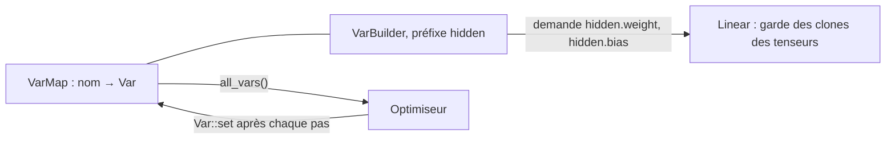

La leçon 4 écrivait chaque pas de gradient à la main avec `Var::set`. [`candle-nn`](https://docs.rs/candle-nn/0.11.0/candle_nn/) regroupe les pièces qu'une boucle d'entraînement répète : des couches, un magasin pour leurs variables, des pertes et des optimiseurs. Cette leçon les prend une par une et confronte chacune à ce qu'elle doit calculer, puis entraîne un classifieur sur un jeu de données public, [Iris](https://archive.ics.uci.edu/dataset/53/iris). Les neuf prédictions sur les résultats ont été écrites dans le [journal](../journal/#2026-09-30--leçon-5--prédictions-avant-la-première-exécution) avant que ce code existe ; le journal les compare avec ce que les programmes affichent.

Le code est dans [`examples/l05_modules.rs`](https://github.com/spareilleux/learn/blob/40470dc/code/candle/course/examples/l05_modules.rs), [`l05_losses.rs`](https://github.com/spareilleux/learn/blob/40470dc/code/candle/course/examples/l05_losses.rs), [`l05_optimizers.rs`](https://github.com/spareilleux/learn/blob/40470dc/code/candle/course/examples/l05_optimizers.rs), [`l05_iris.rs`](https://github.com/spareilleux/learn/blob/40470dc/code/candle/course/examples/l05_iris.rs) et [`l05_exercises.rs`](https://github.com/spareilleux/learn/blob/40470dc/code/candle/course/examples/l05_exercises.rs), avec des fonctions utilitaires dans [`src/lib.rs`](https://github.com/spareilleux/learn/blob/40470dc/code/candle/course/src/lib.rs).

## Six noms

| Candle | Ce que c'est | PyTorch |
|---|---|---|
| [`Module`](https://docs.rs/candle-core/0.11.0/candle_core/trait.Module.html) | un trait à une seule méthode, `forward(&self, &Tensor) -> Result<Tensor>` | `nn.Module` |
| [`Linear`](https://docs.rs/candle-nn/0.11.0/candle_nn/linear/struct.Linear.html), [`linear`](https://docs.rs/candle-nn/0.11.0/candle_nn/linear/fn.linear.html) | un poids et un biais optionnel ; la fonction les crée dans une `VarMap` | `nn.Linear` |
| [`seq`](https://docs.rs/candle-nn/0.11.0/candle_nn/sequential/fn.seq.html), [`Sequential`](https://docs.rs/candle-nn/0.11.0/candle_nn/sequential/struct.Sequential.html) | des modules appliqués l'un après l'autre | `nn.Sequential` |
| [`VarMap`](https://docs.rs/candle-nn/0.11.0/candle_nn/var_map/struct.VarMap.html), [`VarBuilder`](https://docs.rs/candle-nn/0.11.0/candle_nn/var_builder/type.VarBuilder.html) | les variables par nom, et la poignée que les couches utilisent pour les créer ou les retrouver | les paramètres qu'un module enregistre, son `state_dict` |
| [`loss`](https://docs.rs/candle-nn/0.11.0/candle_nn/loss/index.html) | `cross_entropy`, `nll`, `mse`, `binary_cross_entropy_with_logit`, `huber` | `torch.nn.functional` |
| [`Optimizer`](https://docs.rs/candle-nn/0.11.0/candle_nn/optim/trait.Optimizer.html), [`SGD`](https://docs.rs/candle-nn/0.11.0/candle_nn/optim/struct.SGD.html), [`AdamW`](https://docs.rs/candle-nn/0.11.0/candle_nn/optim/struct.AdamW.html) | un trait et ses deux implémentations | `torch.optim` |

## Une couche est une struct avec `forward`

[`Linear`](https://github.com/huggingface/candle/blob/31f35b147389700ed2a178ee66a91c3cc25cc80d/candle-nn/src/linear.rs#L42-L79) calcule `x · wᵀ + b`, avec `w` de forme `(out, in)` comme dans PyTorch. On peut la construire à partir de deux tenseurs quelconques ([lignes 31-43](https://github.com/spareilleux/learn/blob/40470dc/code/candle/course/examples/l05_modules.rs#L31-L43)) :

```rust
let w = Tensor::new(&[[1f64, 2.], [3., 4.], [5., 6.]], &dev)?;
let b = Tensor::new(&[0.5f64, -0.5, 0.], &dev)?;
let layer = Linear::new(w, Some(b));
let x = Tensor::new(&[[10f64, 100.], [1., 1.]], &dev)?;
show("layer.forward(&x)", &layer.forward(&x)?, 1)?;
```

```text
== a Linear layer from given tensors: y = x · wᵀ + b
x: shape [2, 2], F64, [10.0, 100.0, 1.0, 1.0]
layer.forward(&x): shape [2, 3], F64, [210.5, 429.5, 650.0, 3.5, 6.5, 11.0]
x.matmul(&w.t()) + b: shape [2, 3], F64, [210.5, 429.5, 650.0, 3.5, 6.5, 11.0]
```

`forward` est une méthode du trait `Module`, défini dans `candle-core` et réexporté par `candle-nn`. Sans le trait dans la portée, l'appel ne compile pas ([`lib.rs`, lignes 303-313](https://github.com/spareilleux/learn/blob/40470dc/code/candle/course/src/lib.rs#L303-L313)), et rustc dit quel import manque :

```text
error[E0599]: no method named `forward` found for struct `candle_nn::Linear` in the current scope
help: trait `Module` which provides `forward` is implemented but not in scope; perhaps you want to import it
    |
  1 + use candle_core::Module;
```

`use candle_nn::Module` marche aussi : c'est le même trait.

`seq()` enchaîne des modules, et [`Activation::Relu`](https://docs.rs/candle-nn/0.11.0/candle_nn/activation/enum.Activation.html) en est un aussi ([lignes 45-56](https://github.com/spareilleux/learn/blob/40470dc/code/candle/course/examples/l05_modules.rs#L45-L56)). `forward_all` renvoie la sortie de chaque couche, ce qui aide quand un réseau donne un résultat surprenant :

```rust
let model = seq()
    .add(Linear::new(Tensor::new(&[[1f64, -1.], [-1., 1.]], &dev)?, None))
    .add(Activation::Relu)
    .add(Linear::new(Tensor::new(&[[1f64, 1.]], &dev)?, None));
for (i, t) in model.forward_all(&x)?.iter().enumerate() {
    show(&format!("after layer {i}"), t, 1)?;
}
```

```text
== a Sequential: Linear, ReLU, Linear
model.len(): 3
after layer 0: shape [2, 2], F64, [-90.0, 90.0, 0.0, 0.0]
after layer 1: shape [2, 2], F64, [0.0, 90.0, 0.0, 0.0]
after layer 2: shape [2, 1], F64, [90.0, 0.0]
```

La ReLU met le `-90` à zéro. Une petite bizarrerie : [`Sequential::len`](https://github.com/huggingface/candle/blob/31f35b147389700ed2a178ee66a91c3cc25cc80d/candle-nn/src/sequential.rs#L16-L26) renvoie un `i64`, pas un `usize`.

## Où vivent les poids : `VarMap` et `VarBuilder`

Une couche construite par `linear(in, out, vb)` ne possède pas ses poids. Elle demande au `VarBuilder` un tenseur nommé `weight` de forme `(out, in)`, et le builder le demande à la `VarMap` derrière lui, qui crée la variable la première fois et renvoie la même ensuite ([lignes 58-92](https://github.com/spareilleux/learn/blob/40470dc/code/candle/course/examples/l05_modules.rs#L58-L92)) :

```rust
let varmap = VarMap::new();
let vb = VarBuilder::from_varmap(&varmap, DType::F64, &dev);
let hidden = linear(4, 16, vb.pp("hidden"))?;
let _out = linear(16, 3, vb.pp("out"))?;
```

```text
== a VarMap behind a VarBuilder: linear(4, 16) and linear(16, 3)
hidden.bias: [16]
hidden.weight: [16, 4]
out.bias: [3]
out.weight: [3, 16]
parameters: 131, all_vars(): 4 variables
hidden.weight asked again with Init::Const(0.): same tensor true, values still nonzero true
hidden.weight asked with the shape (4, 16): error: shape mismatch on hidden.weight: [4, 16] <> [16, 4]
```



- **`pp` ajoute un préfixe**, et les noms sont des chemins : `hidden.weight`, `out.bias`. Ce sont les noms qu'utilisent les fichiers `safetensors`, et c'est ainsi que la leçon 6 chargera des poids publiés dans les mêmes couches.
- **La couche et la map partagent le stockage.** `Linear` garde un clone du tenseur de la variable, et un clone partage le tampon (leçon 3) : quand l'optimiseur appelle `Var::set` sur les variables de la map, la couche voit les nouvelles valeurs.
- **Redemander renvoie ce que la map contient**, quelle que soit l'initialisation passée ([`var_map.rs`, lignes 94-116](https://github.com/huggingface/candle/blob/31f35b147389700ed2a178ee66a91c3cc25cc80d/candle-nn/src/var_map.rs#L94-L116)) ; seule la forme est vérifiée.
- **Une `VarMap` est une `HashMap` derrière un mutex** : `all_vars()` renvoie les variables dans un ordre quelconque. Les optimiseurs s'en moquent, mais tout ce qui les affiche ou les compare doit trier les noms, comme le font les fonctions utilitaires de cette leçon.

## Comment `linear` initialise

[`linear`](https://github.com/huggingface/candle/blob/31f35b147389700ed2a178ee66a91c3cc25cc80d/candle-nn/src/linear.rs#L84-L94) tire les poids de `DEFAULT_KAIMING_NORMAL` ([`init.rs`, lignes 105-109](https://github.com/huggingface/candle/blob/31f35b147389700ed2a178ee66a91c3cc25cc80d/candle-nn/src/init.rs#L105-L109)) : une loi normale d'écart-type `gain / √in`, avec le gain de ReLU `√2` ([He et al., 2015](https://arxiv.org/abs/1502.01852)). Les biais sont uniformes dans `±1/√in`. Le [`nn.Linear` de PyTorch](https://docs.pytorch.org/docs/2.14/generated/torch.nn.Linear.html) tire les deux uniformément dans `±1/√in`, donc ses poids ont un écart-type de `1/√(3 · in)`. Les [lignes 94-125](https://github.com/spareilleux/learn/blob/40470dc/code/candle/course/examples/l05_modules.rs#L94-L125) mesurent un `linear(512, 512)` ; les valeurs sont aléatoires, donc le programme affiche des vérifications plutôt que des chiffres :

```text
== the initialization of linear(512, 512), f64
weights: 262144 values, |mean| < 0.001 true, sd within 1% of √(2 / 512) = 0.0625 true
share beyond 2 sd within half a point of 4.55%, as a normal distribution: true
PyTorch's nn.Linear: sd 1/√(3 · 512) = 0.0255; candle's is 2.449 times larger
biases: 512 values, all within ±1/√512 = ±0.0442 true, sd within 10% of 0.0255 true
```

Les seuils sont assez larges pour tenir à chaque exécution : avec 262 144 poids, l'écart-type mesuré varie d'environ 0,14 %, et 1 % en fait sept fois plus. La part au-delà de deux écarts-types distingue la loi normale d'une loi uniforme, qui n'en a aucune.

Le rapport est `√6 ≈ 2.449`. Il ne compte pas quand tu charges des poids entraînés, qui remplacent les poids initiaux. Il compte quand tu portes un modèle de PyTorch et l'entraînes depuis zéro : la même architecture part de poids environ 2,45 fois plus grands, ce qui peut changer le taux d'apprentissage qui marche. Le choix de Candle suit le conseil de l'article pour les réseaux ReLU, et `init.rs` cite le `init.py` de PyTorch comme source ; le `nn.Linear` de PyTorch utilise simplement un autre défaut.

## Des poids à graine

La leçon 2 a montré que le générateur du CPU ne peut pas recevoir de graine : `Device::Cpu.set_seed(42)` renvoie une erreur. Deux `VarMap` remplies par les mêmes appels diffèrent donc, et il en irait de même de chaque sortie de cette leçon qui dépend de l'entraînement. [`reseed`](https://github.com/spareilleux/learn/blob/40470dc/code/candle/course/src/lib.rs#L78-L104) écrase chaque variable avec des valeurs de [SplitMix64](https://prng.di.unimi.it/splitmix64.c), un générateur 64 bits de dix lignes ([`lib.rs`, lignes 53-76](https://github.com/spareilleux/learn/blob/40470dc/code/candle/course/src/lib.rs#L53-L76)), en parcourant les noms dans l'ordre trié :

```rust
let bound = if name.ends_with(".weight") {
    (6.0 / var.dims()[1] as f64).sqrt()
} else if let Some(layer) = name.strip_suffix(".bias") {
    match data.get(&format!("{layer}.weight")) {
        Some(weight) => 1.0 / (weight.dims()[1] as f64).sqrt(),
        None => candle_core::bail!("{name} has no matching weight"),
    }
}
```

Les poids sont uniformes dans `±√(6 / in)`, dont l'écart-type est `√(2 / in)`, le même que le tirage normal de `linear` ; les biais gardent l'intervalle de `linear`. Un tirage uniforme demande une multiplication et une addition par valeur, qu'IEEE 754 arrondit de la même façon sur tous les processeurs, alors qu'un tirage normal demande `ln` et `cos`, qui viennent de la bibliothèque mathématique de chaque système et peuvent différer au dernier bit. [Lignes 127-152](https://github.com/spareilleux/learn/blob/40470dc/code/candle/course/examples/l05_modules.rs#L127-L152) :

```text
== two VarMaps filled by the same calls
same values: false
after reseed(&varmap, 5) on both: same values true
hidden.weight, first row: shape [4], F64, [0.811031, -0.095405, -0.839404, -0.109659]
all 64 weights within ±√(6 / 4) = ±1.2247: true
```

## Les pertes

### `cross_entropy`

[`cross_entropy`](https://github.com/huggingface/candle/blob/31f35b147389700ed2a178ee66a91c3cc25cc80d/candle-nn/src/loss.rs#L41-L47) prend des scores bruts (logits) de forme `(n, classes)` et les classes en entiers, calcule [`log_softmax`](https://github.com/huggingface/candle/blob/31f35b147389700ed2a178ee66a91c3cc25cc80d/candle-nn/src/ops.rs#L31-L38), puis [`nll`](https://github.com/huggingface/candle/blob/31f35b147389700ed2a178ee66a91c3cc25cc80d/candle-nn/src/loss.rs#L14-L30), qui prend la valeur de chaque ligne à sa cible avec `gather` et fait la moyenne des opposés. Les [lignes 32-68](https://github.com/spareilleux/learn/blob/40470dc/code/candle/course/examples/l05_losses.rs#L32-L68) la comparent avec la formule écrite en Rust simple, puis lui donnent des logits de 1000 :

```rust
// −log softmax à la cible, soit log Σ exp(z − max) − (z_cible − max), en moyenne sur les lignes
let by_hand = logits
    .iter()
    .zip(targets)
    .map(|(row, t)| {
        let max = row.iter().copied().fold(f64::MIN, f64::max);
        row.iter().map(|v| (v - max).exp()).sum::<f64>().ln() - (row[t as usize] - max)
    })
    .sum::<f64>()
    / 3.0;
```

```text
== cross_entropy against the formula, f64
candle 0.2458859914, by hand 0.2458859914, agree to 1e-12: true

== logits of 1000, 0 and -1000, f64
target 0: cross_entropy 0.0
target 1: cross_entropy 1000.0
target 2: cross_entropy 2000.0
ops::log_softmax: shape [1, 3], F64, [0.0, -1000.0, -2000.0]
log(exp(z) / sum(exp(z))), written naively: shape [1, 3], F64, [NaN, -inf, -inf]
```

`log_softmax` soustrait le maximum de chaque ligne avant `exp`, donc le plus grand exposant est `exp(0) = 1` et rien ne déborde. Écrit naïvement, `exp(1000)` est infini en `f64` (la limite est vers `exp(709.8)`), et `∞ / ∞` vaut NaN. Préfère `cross_entropy` sur des logits à une softmax suivie d'un logarithme.

### Les cibles qu'accepte `nll`

[Lignes 70-91](https://github.com/spareilleux/learn/blob/40470dc/code/candle/course/examples/l05_losses.rs#L70-L91) :

```text
== the targets nll accepts
i64 targets: ok
f32 targets: error: unsupported dtype F64 for op gather
a target out of range, 4 of 4 classes: error: gather invalid index 4 with dim size 4
target u32::MAX in the second row: loss 0.1725049744, (row 1 + row 3) / 3 = 0.1725049744, / 2 = 0.2587574616
```

- **Les cibles doivent être des entiers** (`u8`, `u32` ou `i64`). L'erreur pour des cibles `f32` nomme le mauvais type : `F64` est le type des logits. [`gather` sur le CPU](https://github.com/huggingface/candle/blob/31f35b147389700ed2a178ee66a91c3cc25cc80d/candle-core/src/cpu_backend/mod.rs#L2883-L2890) indique `self.dtype()`, le type de la source, alors que le type non pris en charge est celui des indices ; `index_select`, `scatter`, `scatter_add` et `index_add` font de même (lu dans les sources, lignes 2879 à 2973, pas exécuté), et `main` à [`5ba5d5b`](https://github.com/huggingface/candle/tree/5ba5d5b468b5b1df40e82dd3d556987bedeea041) aussi.
- **Un indice hors limites est une erreur**, pas une lecture silencieuse.
- **`u32::MAX` est sauté** : `gather` écrit 0 pour un indice égal au maximum de son type ([lignes 623-626](https://github.com/huggingface/candle/blob/31f35b147389700ed2a178ee66a91c3cc25cc80d/candle-core/src/cpu_backend/mod.rs#L623-L626)), une règle voulue depuis la [pull request #2940](https://github.com/huggingface/candle/pull/2940). Dans une perte, cette ligne n'apporte rien, mais `nll` divise toujours par la taille du lot : le résultat est la somme des deux autres lignes divisée par **3**. Le [`CrossEntropyLoss`](https://docs.pytorch.org/docs/2.14/generated/torch.nn.CrossEntropyLoss.html) de PyTorch a un `ignore_index` qui fait la moyenne « over non-ignored targets », ce qui diviserait par 2. Ni la documentation de `nll` ni celle de `gather` ne mentionne la règle.

### Entropie croisée binaire avec logits : NaN pour une bonne réponse

Pour une sortie oui ou non, la perte est `−(y · log p + (1 − y) · log(1 − p))` avec `p = sigmoid(x)`. [`binary_cross_entropy_with_logit`](https://github.com/huggingface/candle/blob/31f35b147389700ed2a178ee66a91c3cc25cc80d/candle-nn/src/loss.rs#L64-L74) calcule exactement cela : la sigmoïde d'abord, puis les deux logarithmes. Les [lignes 93-137](https://github.com/spareilleux/learn/blob/40470dc/code/candle/course/examples/l05_losses.rs#L93-L137) la comparent, un logit à la fois, avec la forme stable `max(x, 0) − x · y + log(1 + exp(−|x|))` ([lignes 23-27](https://github.com/spareilleux/learn/blob/40470dc/code/candle/course/examples/l05_losses.rs#L23-L27)) :

```rust
fn stable_bce(x: &Tensor, y: &Tensor) -> candle_core::Result<Tensor> {
    let log_term = (x.abs()?.neg()?.exp()? + 1.0)?.log()?;
    (x.relu()? - (x * y)?)?.add(&log_term)?.mean_all()
}
```

```text
== binary_cross_entropy_with_logit, one logit at a time
type, logit, target: candle's loss and gradient | the stable form's loss and gradient
F32, 16, 1: 1.192e-7 -1.192e-7 | 1.192e-7 -1.192e-7
F32, 17, 1: NaN NaN | 0.000e0 0.000e0
F32, -100, 0: NaN NaN | 0.000e0 4e-44
F32, 17, 0: inf NaN | 1.700e1 1.000e0
F32, -100, 1: inf NaN | 1.000e2 -1.000e0
F64, 36, 1: 2.220e-16 -2.220e-16 | 2.220e-16 -2.220e-16
F64, 37, 1: NaN NaN | 0.000e0 0.000e0
F64, -800, 0: NaN NaN | 0.000e0 0.000e0
a batch of the logits 16 and 17, targets 1, F32: mean loss NaN
binary_cross_entropy_with_logit with U32 targets: error: dtype mismatch in mul, lhs: U32, rhs: F32
```

- **Une prédiction sûre et juste donne NaN.** En `f32`, `exp(−17) ≈ 4.1e−8` est inférieur à la moitié de l'écart entre 1 et le `f32` suivant (`2⁻²⁴ ≈ 6.0e−8`), donc `1 + exp(−17)` s'arrondit à 1 et la sigmoïde renvoie exactement 1. Alors `1 − p = 0`, `log 0 = −∞`, et le terme `(1 − y) · log(1 − p)` vaut `0 · (−∞)`, soit NaN. `exp(−16) ≈ 1.1e−7` survit à l'arrondi. En `f64`, la même limite tombe entre 36 et 37 (`2⁻⁵³ ≈ 1.1e−16`). Pour la cible 0, cela arrive quand `exp(−x)` déborde : sous `x ≈ −88.7` en `f32` et `−709.8` en `f64`.
- **Une prédiction sûre et fausse donne l'infini** au lieu de la bonne valeur, 17 ou 100 : `log 0` de l'autre côté.
- **Le gradient est NaN dans les six cas en échec** : une seule ligne de ce genre dans un lot rend la moyenne NaN, et l'optimiseur écrirait NaN dans chaque poids.
- **La forme stable reste finie** et son gradient est `sigmoid(x) − y` ; le `4e-44` est ce gradient en `−100`, `exp(−100)`, un `f32` sous-normal affiché avec un chiffre. C'est la formule sur laquelle s'appuie le [`BCEWithLogitsLoss`](https://docs.pytorch.org/docs/2.14/generated/torch.nn.BCEWithLogitsLoss.html) de PyTorch, « the log-sum-exp trick ». Faute de `log1p` dans Candle 0.11.0, `log(1 + exp(−16))` s'arrondit encore : les deux formes affichent `1.192e-7` là où la perte exacte est `1.125e-7`. Finie, pas exacte.
- **La documentation dit que la cible est « a tensor of u32 »** ; elle doit être un tenseur flottant du type des logits.

Le [ticket #2561](https://github.com/huggingface/candle/issues/2561) signale cette instabilité depuis octobre 2024 et reste ouvert ; `main` à `5ba5d5b` calcule la perte de la même façon. Pour entraîner un classifieur binaire avec Candle 0.11.0, écris la forme stable, cinq lignes plus haut.

## Les optimiseurs

`Optimizer` est un trait, et `new` est l'une de ses fonctions : `SGD::new` ne compile pas sans `use candle_nn::Optimizer` (`E0599`, « no function or associated item named `new` found for struct `SGD` », [`lib.rs`, lignes 315-325](https://github.com/spareilleux/learn/blob/40470dc/code/candle/course/src/lib.rs#L315-L325)) ; là aussi, rustc suggère l'import. Son `backward_step(&loss)` appelle `backward`, puis `step`, qui met à jour avec `Var::set` chaque variable qui a un gradient.

### SGD et AdamW, face aux algorithmes

[`SGD`](https://github.com/huggingface/candle/blob/31f35b147389700ed2a178ee66a91c3cc25cc80d/candle-nn/src/optim.rs#L31-L70) n'a pas de momentum, comme le dit son commentaire : un pas vaut `θ − lr · g`. [`AdamW`](https://github.com/huggingface/candle/blob/31f35b147389700ed2a178ee66a91c3cc25cc80d/candle-nn/src/optim.rs#L117-L183) est Adam avec une décroissance des poids découplée ([Loshchilov et Hutter, 2019](https://arxiv.org/abs/1711.05101)), avec les valeurs par défaut de PyTorch : taux d'apprentissage 0,001, betas 0,9 et 0,999, ε `1e-8`, décroissance 0,01. Les [lignes 34-72](https://github.com/spareilleux/learn/blob/40470dc/code/candle/course/examples/l05_optimizers.rs#L34-L72) font trois pas sur `Σ (θ − 1)²` à côté de [l'algorithme de PyTorch](https://docs.pytorch.org/docs/2.14/generated/torch.optim.AdamW.html), écrit à la main :

```rust
for i in 0..3 {
    let g = 2.0 * (p[i] - target[i]);
    m[i] = m[i] * beta1 + g * (1.0 - beta1);
    v[i] = v[i] * beta2 + g * g * (1.0 - beta2);
    let m_hat = m[i] * (1.0 / (1.0 - beta1.powi(step)));
    let v_hat = v[i] * (1.0 / (1.0 - beta2.powi(step)));
    p[i] = p[i] * (1.0 - lr * weight_decay) - m_hat / (v_hat.sqrt() + eps) * lr;
}
```

```text
== one SGD step, learning rate 0.1, f64
candle  [0.6, -0.8, 1.8]
by hand [0.6, -0.8, 1.8]
bit for bit: true

== three AdamW steps, learning rate 0.1, the other parameters at their defaults
ParamsAdamW { lr: 0.1, beta1: 0.9, beta2: 0.999, eps: 1e-8, weight_decay: 0.01 }
step 1: candle [0.599499999000, -1.148750000222, 1.898000000500], by hand [0.599499999000, -1.148750000222, 1.898000000500], within 1e-12 true, bit for bit true
step 2: candle [0.697722949537, -1.047747696713, 1.796525861893], by hand [0.697722949537, -1.047747696713, 1.796525861893], within 1e-12 true, bit for bit true
step 3: candle [0.793378661636, -0.947100267638, 1.695937627111], by hand [0.793378661636, -0.947100267638, 1.695937627111], within 1e-12 true, bit for bit true
```

Bit pour bit, parce que la transcription fait les mêmes opérations dans le même ordre qu'`optim.rs`, et qu'IEEE 754 arrondit chaque addition, multiplication, division et racine carrée de la même façon partout. Le premier pas d'AdamW déplace chaque paramètre du taux d'apprentissage, plus la petite décroissance, quelle que soit la taille de son gradient : au pas 1, `m̂ / √v̂` vaut `g / |g|`. L'implémentation de PyTorch 2.14 ordonne les opérations autrement : elle divise `√v` par `√(1 − β₂ᵗ)` et intègre `1 / (1 − β₁ᵗ)` dans la taille du pas ([`adam.py`, lignes 533-546](https://github.com/pytorch/pytorch/blob/v2.14.0/torch/optim/adam.py#L533-L546)). Elle devrait concorder avec ces nombres à l'arrondi près, pas au bit près (*à vérifier*, le cours n'exécute pas PyTorch).

### Ce qu'un optimiseur garde

[Lignes 74-95](https://github.com/spareilleux/learn/blob/40470dc/code/candle/course/examples/l05_optimizers.rs#L74-L95) :

```text
== the variables an optimizer keeps
SGD::new with a U32 and an F32 variable: ok, it keeps 1
AdamW::new with the same two variables: ok
a step on a loss of `used` only: used changed true, unused changed false
```

Les deux constructeurs écartent les variables dont le type n'est pas flottant ([`optim.rs`, lignes 44-47](https://github.com/huggingface/candle/blob/31f35b147389700ed2a178ee66a91c3cc25cc80d/candle-nn/src/optim.rs#L44-L47) et [ligne 123](https://github.com/huggingface/candle/blob/31f35b147389700ed2a178ee66a91c3cc25cc80d/candle-nn/src/optim.rs#L123)), sans erreur. Et `step` saute une variable qui n'a pas de gradient, sans un mot non plus. Les deux sont raisonnables, et les deux cachent la même erreur : une couche dont les variables n'arrivent jamais à l'optimiseur, ou ne participent pas à la perte, n'apprend tout simplement pas. Passer `varmap.all_vars()` évite le premier cas.

## Iris

Le jeu de données Iris de Fisher (1936) mesure 150 fleurs, 50 de chacune de trois espèces, en quatre nombres : la longueur et la largeur du sépale et du pétale, en centimètres. Setosa se sépare facilement des deux autres ; versicolor et virginica se chevauchent. Le cours commite les deux fichiers du UCI Machine Learning Repository, inchangés, sous CC BY 4.0 : [`data/README.md`](https://github.com/spareilleux/learn/blob/40470dc/code/candle/data/README.md) donne leur source et leur SHA-256. Il entraîne sur `bezdekIris.data`, le fichier corrigé (exercice 1).

### Partage, modèle et entraînement

[`iris::split`](https://github.com/spareilleux/learn/blob/40470dc/code/candle/course/src/lib.rs#L139-L179) met de côté une fleur sur cinq de chaque espèce, 10 par espèce, et standardise les quatre mesures avec les moyennes et écarts-types des 120 fleurs d'entraînement seulement, pour que rien du jeu de test ne fuie dans l'entraînement. [`iris::model`](https://github.com/spareilleux/learn/blob/40470dc/code/candle/course/src/lib.rs#L187-L193) est un 4 → 16 → 3 avec une ReLU, 131 paramètres, et [`iris::train`](https://github.com/spareilleux/learn/blob/40470dc/code/candle/course/src/lib.rs#L195-L211) est toute la boucle :

```rust
pub fn train<O: Optimizer>(
    model: &Sequential,
    opt: &mut O,
    x: &Tensor,
    y: &Tensor,
    epochs: usize,
) -> Result<Vec<f64>> {
    let mut losses = Vec::with_capacity(epochs);
    for _ in 0..epochs {
        let loss = loss::cross_entropy(&model.forward(x)?, y)?;
        losses.push(loss.to_dtype(DType::F64)?.to_scalar::<f64>()?);
        opt.backward_step(&loss)?;
    }
    Ok(losses)
}
```

Avec 120 lignes, chaque époque est un pas sur tout le jeu d'entraînement : pas de lots, pas de mélange, rien d'aléatoire une fois les poids fixés par la graine. [`l05_iris.rs`, lignes 52-98](https://github.com/spareilleux/learn/blob/40470dc/code/candle/course/examples/l05_iris.rs#L52-L98) entraînent avec `AdamW` à un taux de 0,01 pendant 300 époques :

```text
== data: bezdekIris.data
150 rows; training 120, test 30; per species in the test set: [10, 10, 10]
training means (cm): [5.8658, 3.0550, 3.7700, 1.2050]
training sds (cm):   [0.8484, 0.4378, 1.7796, 0.7555]

== AdamW, learning rate 0.01, 300 full-batch epochs, F64
F64, loss at epoch 1: 2.1380, 10: 0.9078, 50: 0.2556, 100: 0.1139, 200: 0.0484, 300: 0.0356
after training: loss 0.0355, training 118/120, test 29/30
test confusion matrix (rows: species, columns: prediction)
  setosa     [10, 0, 0]
  versicolor [0, 10, 0]
  virginica  [0, 1, 9]
  test row 23: ["6.0", "2.2", "5.0", "1.5"] cm, a virginica taken for a versicolor
```

La perte des poids initiaux, 2,138, dépasse `ln 3 ≈ 1.099`, la perte d'un modèle qui répond un tiers pour chaque espèce : en moyenne, le réseau initial donne à la bonne espèce une probabilité de `exp(−2.138) ≈ 0.12` (une moyenne géométrique), moins d'un tiers. Le réseau classe correctement 29 des 30 fleurs de test. La seule erreur est la ligne 120 du fichier, une virginica aux pétales courts (5,0 cm) et larges de 1,5 cm, des mesures dans la plage de versicolor ; aucune setosa n'est mal classée. Avec trente fleurs de test, chaque erreur vaut 3,3 points de précision, et il s'agit d'un seul partage avec une seule graine : l'exécution montre que les pièces fonctionnent ensemble, pas à quel point ce réseau classe bien les iris en général.

### `f32`, et le SGD simple

Les [lignes 100-126](https://github.com/spareilleux/learn/blob/40470dc/code/candle/course/examples/l05_iris.rs#L100-L126) refont l'entraînement à partir des mêmes poids, en `f32`, puis avec `SGD` à un taux de 0,1 :

```text
== the same training in F32, from the same weights
F32, loss at epoch 1: 2.1380, 10: 0.9078, 50: 0.2556, 100: 0.1139, 200: 0.0484, 300: 0.0356
final loss within 1e-4 of F64 true, same 30 test predictions true

== plain SGD, learning rate 0.1, from the same weights, F64
SGD, loss at epoch 1: 2.1380, 10: 0.6089, 50: 0.2990, 100: 0.2027, 200: 0.1189, 300: 0.0848
after training: loss 0.0846, test 29/30, higher than AdamW's: true
```

`f32` suit `f64` à quatre décimales à chaque époque affichée et fait les mêmes 30 prédictions : pour un réseau aussi petit, la moitié de la mémoire ne coûte rien de visible. `SGD` est devant à l'époque 10 et derrière à partir de l'époque 50, et finit avec une perte d'entraînement plus de deux fois celle d'AdamW, pour le même score de test. L'explication habituelle, non mesurée ici : un seul taux d'apprentissage pour toutes les directions est trop petit là où la perte est plate, ce que la leçon 4 a vu à l'extrême, et la division d'AdamW par `√v̂` donne à chaque paramètre sa propre taille de pas.

## À retenir

- Une couche est une struct qui implémente `Module` ; `linear` crée ses variables dans une `VarMap` à travers un `VarBuilder`, nommées par chemin (`hidden.weight`), et la couche partage leur stockage avec la map, si bien que les pas de l'optimiseur l'atteignent.
- `linear` initialise les poids avec une loi normale de Kaiming, `√6 ≈ 2.45` fois le `nn.Linear` de PyTorch en écart-type. Le générateur du CPU de Candle ne peut pas recevoir de graine : pour un entraînement reproductible, écrase toi-même les variables.
- `cross_entropy` est stable pour les grands logits. Ses cibles sont des entiers ; `u32::MAX` saute une ligne en silence mais la compte dans la moyenne.
- `binary_cross_entropy_with_logit` renvoie NaN pour les prédictions sûres et justes et l'infini pour les sûres et fausses, dès `|x| ≈ 17` en `f32`. Écris la forme stable.
- `SGD` (sans momentum) et `AdamW` égalent leurs algorithmes au bit près. Les deux écartent les variables non flottantes et sautent les variables sans gradient, en silence.
- Sur Iris, 131 paramètres et 300 pas d'AdamW sur le lot complet classent 29 des 30 fleurs mises de côté ; `f32` donne les mêmes prédictions.

## Exercices

1. L'archive de l'UCI contient deux versions d'Iris, `iris.data` et `bezdekIris.data`. Trouve les lignes où elles diffèrent, et dis quelle version correspond à l'article de Fisher.

<details>
<summary>Solution</summary>

[Lignes 23-35](https://github.com/spareilleux/learn/blob/40470dc/code/candle/course/examples/l05_exercises.rs#L23-L35) :

```rust
let old = include_str!("../../data/iris.data");
let new = include_str!("../../data/bezdekIris.data");
for (i, (a, b)) in old.lines().zip(new.lines()).enumerate() {
    if a != b {
        println!("row {}: iris.data {a}, bezdekIris.data {b}", i + 1);
    }
}
```

```text
== exercise 1: iris.data against bezdekIris.data
row 35: iris.data 4.9,3.1,1.5,0.1,Iris-setosa, bezdekIris.data 4.9,3.1,1.5,0.2,Iris-setosa
row 38: iris.data 4.9,3.1,1.5,0.1,Iris-setosa, bezdekIris.data 4.9,3.6,1.4,0.1,Iris-setosa
rows 35 and 38 of iris.data are identical: true
```

Dans `iris.data`, les lignes 35 et 38 portent les mêmes quatre mesures, et toutes deux diffèrent de l'article ; le `iris.names` de l'archive liste les corrections, que porte `bezdekIris.data`. Le fichier corrigé porte le nom de James Bezdek, premier des cinq auteurs d'une note de 1999 sur ces écarts, [*Will the real iris data please stand up?*](https://doi.org/10.1109/91.771092). Dans le partage de cette leçon, la ligne 35 est une fleur de test (position 34 parmi les setosas) et la ligne 38 une fleur d'entraînement ; ce sont deux setosas, l'espèce facile, donc les résultats ne changeraient probablement pas avec `iris.data` (*à vérifier*). Épingle le fichier et son empreinte, comme le fait `data/README.md` : un jeu de données célèbre n'est pas un jeu de données figé.

</details>

2. Écris toi-même SGD avec momentum, avec la règle de PyTorch tirée de sa [documentation de SGD](https://docs.pytorch.org/docs/2.14/generated/torch.optim.SGD.html) : le tampon `b` commence au premier gradient, puis `b = μ · b + g`, et le pas est `θ − lr · b`. Entraîne le réseau Iris pendant 300 époques à un taux de 0,01, avec `μ = 0` et `μ = 0.9`, à partir des poids à graine. Vérifie que `μ = 0` égale le `SGD` de Candle.

<details>
<summary>Solution</summary>

[Lignes 41-75](https://github.com/spareilleux/learn/blob/40470dc/code/candle/course/examples/l05_exercises.rs#L41-L75) :

```rust
for _ in 0..300 {
    let grads = loss::cross_entropy(&model.forward(&x)?, &y)?.backward()?;
    for (var, buffer) in vars.iter().zip(buffers.iter_mut()) {
        let g = grads.get(var).unwrap();
        // La règle de PyTorch : le tampon commence au premier gradient, puis b = μ b + g ; θ = θ − lr b
        let b = match buffer.take() {
            None => g.clone(),
            Some(b) => ((b * momentum)? + g)?,
        };
        var.set(&var.sub(&(&b * 0.01)?)?)?;
        *buffer = Some(b);
    }
}
```

```text
== exercise 2: SGD with momentum 0.9, written with Var::set, learning rate 0.01
momentum 0: loss after 300 epochs 0.3730
momentum 0.9: loss after 300 epochs 0.0843
candle's SGD, same learning rate: 0.3730
```

Avec `μ = 0.9`, un gradient qui garde la même direction s'accumule jusqu'à `1 / (1 − μ) = 10` fois sa taille, donc l'exécution se comporte à peu près comme le SGD simple à un taux de 0,1 : 0,0843 ici contre 0,0846 dans la leçon. Les tampons vivent hors des variables, un par variable, dans un `Vec<Option<Tensor>>` ; c'est tout ce qu'est l'état d'un optimiseur, et c'est pourquoi l'`AdamW` de Candle garde deux `Var` par paramètre. `μ = 0` donne le `SGD` de Candle aux quatre décimales affichées, et devrait l'égaler au bit près, puisque `0 · b + g` vaut exactement `g`.

</details>

3. Enregistre une `VarMap` entraînée avec `save`, puis charge-la dans une nouvelle `VarMap` dans deux ordres : après avoir construit les couches du modèle, et avant. Les couches finissent-elles avec les poids entraînés les deux fois ?

<details>
<summary>Solution</summary>

[Lignes 77-105](https://github.com/spareilleux/learn/blob/40470dc/code/candle/course/examples/l05_exercises.rs#L77-L105) :

```rust
let mut first = VarMap::new();
let _model = iris::model(VarBuilder::from_varmap(&first, DType::F64, &dev))?;
first.load(&path)?;
let mut second = VarMap::new();
second.load(&path)?;
let _model = iris::model(VarBuilder::from_varmap(&second, DType::F64, &dev))?;
```

```text
== exercise 3: save, then load in the two possible orders
layers built, then load: same values true
load into an empty VarMap: ok, 0 variables
then the layers: same values false
```

[`VarMap::load`](https://github.com/huggingface/candle/blob/31f35b147389700ed2a178ee66a91c3cc25cc80d/candle-nn/src/var_map.rs#L39-L54) n'écrase que les variables que la map contient déjà ; sa documentation dit que les valeurs des autres variables « are not kept ». Charger dans une map vide réussit et ne garde rien, et les couches construites ensuite reçoivent de nouveaux poids aléatoires, sans erreur à aucun moment. Construis le modèle d'abord, puis charge. Pour des poids publiés, la leçon 6 utilisera un `VarBuilder` qui lit le fichier lui-même, [`from_mmaped_safetensors`](https://github.com/huggingface/candle/blob/31f35b147389700ed2a178ee66a91c3cc25cc80d/candle-nn/src/var_builder.rs#L642), sans `VarMap`.

</details>

## Sources

- Candle à `31f35b1` : [`linear.rs`](https://github.com/huggingface/candle/blob/31f35b147389700ed2a178ee66a91c3cc25cc80d/candle-nn/src/linear.rs), [`init.rs`](https://github.com/huggingface/candle/blob/31f35b147389700ed2a178ee66a91c3cc25cc80d/candle-nn/src/init.rs), [`var_map.rs`](https://github.com/huggingface/candle/blob/31f35b147389700ed2a178ee66a91c3cc25cc80d/candle-nn/src/var_map.rs), [`loss.rs`](https://github.com/huggingface/candle/blob/31f35b147389700ed2a178ee66a91c3cc25cc80d/candle-nn/src/loss.rs), [`optim.rs`](https://github.com/huggingface/candle/blob/31f35b147389700ed2a178ee66a91c3cc25cc80d/candle-nn/src/optim.rs), [`ops.rs`](https://github.com/huggingface/candle/blob/31f35b147389700ed2a178ee66a91c3cc25cc80d/candle-nn/src/ops.rs), [`cpu_backend/mod.rs`](https://github.com/huggingface/candle/blob/31f35b147389700ed2a178ee66a91c3cc25cc80d/candle-core/src/cpu_backend/mod.rs) ; [`candle-nn` sur docs.rs](https://docs.rs/candle-nn/0.11.0/candle_nn/)
- Documentation de PyTorch 2.14 : [`nn.Linear`](https://docs.pytorch.org/docs/2.14/generated/torch.nn.Linear.html), [`CrossEntropyLoss`](https://docs.pytorch.org/docs/2.14/generated/torch.nn.CrossEntropyLoss.html), [`BCEWithLogitsLoss`](https://docs.pytorch.org/docs/2.14/generated/torch.nn.BCEWithLogitsLoss.html), [`SGD`](https://docs.pytorch.org/docs/2.14/generated/torch.optim.SGD.html), [`AdamW`](https://docs.pytorch.org/docs/2.14/generated/torch.optim.AdamW.html)
- Fisher, [The use of multiple measurements in taxonomic problems](https://doi.org/10.1111/j.1469-1809.1936.tb02137.x), Annals of Eugenics 7(2), 1936 ; le jeu de données : Fisher, R. (1936). Iris [Dataset]. UCI Machine Learning Repository, [doi:10.24432/C56C76](https://doi.org/10.24432/C56C76), CC BY 4.0
- Bezdek, Keller, Krishnapuram, Kuncheva et Pal, [Will the real iris data please stand up?](https://doi.org/10.1109/91.771092), IEEE Transactions on Fuzzy Systems 7(3), 1999
- He, Zhang, Ren et Sun, [Delving deep into rectifiers](https://arxiv.org/abs/1502.01852), 2015 ; Kingma et Ba, [Adam](https://arxiv.org/abs/1412.6980), 2014 ; Loshchilov et Hutter, [Decoupled weight decay regularization](https://arxiv.org/abs/1711.05101), 2019
- Steele, Lea et Flood, [Fast splittable pseudorandom number generators](https://doi.org/10.1145/2660193.2660195), OOPSLA 2014 ; le [`splitmix64.c`](https://prng.di.unimi.it/splitmix64.c) de Vigna
