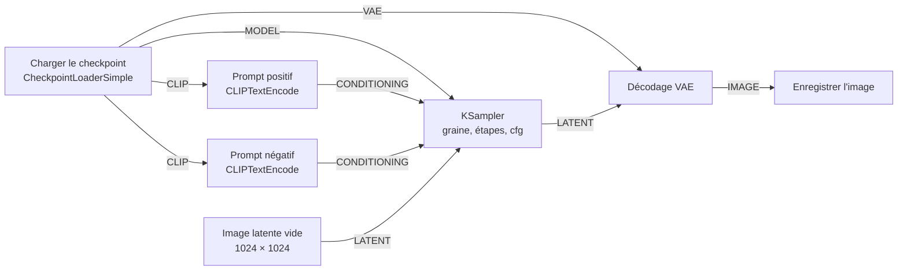

import { Tabs, TabItem } from '@astrojs/starlight/components';

Code : le workflow de cette leçon, [`workflows/01-txt2img.api.json`](https://github.com/spareilleux/learn/blob/a1a9bffadaa7156b91ca9c2c2b8885e9e9862dd5/code/comfyui/workflows/01-txt2img.api.json), et l'outil C# du cours, dont la commande `png-info` est dans [`csharp/Png.cs`](https://github.com/spareilleux/learn/blob/a1a9bffadaa7156b91ca9c2c2b8885e9e9862dd5/code/comfyui/csharp/Png.cs).

## Ce qu'est ComfyUI, pour un développeur C# ou Java

[ComfyUI](https://github.com/Comfy-Org/ComfyUI) génère des images, et depuis peu de la vidéo, de l'audio et des modèles 3D, avec des modèles de diffusion. Tu n'écris pas de script : tu construis un graphe de nœuds dans le navigateur, et un serveur Python l'exécute. Chaque nœud fait une seule chose, comme charger un fichier de modèle, encoder un prompt ou échantillonner, et transmet ses résultats aux nœuds suivants par des connexions typées.

Deux pièces travaillent ensemble :

- **Le serveur** est un programme Python, `main.py`, construit sur [PyTorch](https://pytorch.org/) et [aiohttp](https://docs.aiohttp.org/). Il contient les définitions des nœuds, une file d'attente de prompts et un cache des résultats des nœuds, et il sert une API HTTP et WebSocket sur le port 8188.
- **Le frontend** est une application web, publiée sous forme du paquet Python `comfyui-frontend-package` et servie par le même serveur. Il dessine le graphe, et quand tu appuies sur Run, il convertit le graphe en *prompt* et l'envoie à l'API. La leçon 3 examine les deux formats JSON, et la leçon 4 appelle l'API depuis C# et Java.

Si tu as utilisé [TPL Dataflow](https://learn.microsoft.com/dotnet/standard/parallel-programming/dataflow-task-parallel-library) ou un système de build, le modèle t'est familier. Les nœuds sont des blocs avec des entrées et des sorties typées. Le serveur n'exécute que les nœuds dont un nœud de sortie a besoin, dans l'ordre des dépendances. Et comme un build incrémental, il saute un nœud dont les entrées n'ont pas changé depuis la dernière exécution et réutilise son résultat en cache.

Un nœud est une classe Python. Voici `EmptyImage`, l'un des plus simples, dans [`nodes.py`](https://github.com/Comfy-Org/ComfyUI/blob/ee71d5c4993f29086b27fde1629a945ae48425bf/nodes.py#L1979-L2001) à la v0.36.0 :

```python
class EmptyImage:
    @classmethod
    def INPUT_TYPES(s):
        return {"required": { "width": ("INT", {"default": 512, "min": 1, "max": MAX_RESOLUTION, "step": 1}),
                              "height": ("INT", {"default": 512, "min": 1, "max": MAX_RESOLUTION, "step": 1}),
                              "batch_size": ("INT", {"default": 1, "min": 1, "max": 4096}),
                              "color": ("INT", {"default": 0, "min": 0, "max": 0xFFFFFF, "step": 1, "display": "color"}),
                              }}
    RETURN_TYPES = ("IMAGE",)
    FUNCTION = "generate"
```

`INPUT_TYPES` déclare les entrées et leurs contraintes, `RETURN_TYPES` les sorties, et `FUNCTION` nomme la méthode que le serveur appelle. En termes de C#, c'est une classe dont les attributs décrivent les paramètres, découverte par réflexion. Le serveur publie ces déclarations en JSON à `/object_info`, et le frontend construit ses widgets à partir d'elles. Tu n'as pas besoin d'écrire du Python dans ce cours avant la leçon 11, qui traite des nœuds personnalisés.

## Les versions

| Pièce | Version |
|---|---|
| ComfyUI | [**v0.36.0**](https://github.com/Comfy-Org/ComfyUI/releases/tag/v0.36.0), commit [`ee71d5c`](https://github.com/Comfy-Org/ComfyUI/commit/ee71d5c4993f29086b27fde1629a945ae48425bf), publiée le 15 septembre 2026 |
| Frontend | `comfyui-frontend-package` 1.52.7, la version qu'épingle `requirements.txt` |
| Python et PyTorch | Python 3.13.14 et PyTorch 2.13.0 pour CUDA 13.0, tels que fournis dans la version portable Windows |
| Modèle | [Stable Diffusion XL base 1.0](https://huggingface.co/stabilityai/stable-diffusion-xl-base-1.0), révision `4621659` |
| Machine | Windows 11, une NVIDIA GeForce RTX 5080 de 16 Go, pilote 610.88, 64 Go de RAM |

ComfyUI publie une version environ chaque semaine, et son [README](https://github.com/Comfy-Org/ComfyUI/blob/ee71d5c4993f29086b27fde1629a945ae48425bf/README.md) prévient que les commits entre deux tags de version « may be very unstable and break many custom nodes », c'est-à-dire peuvent être très instables et casser de nombreux nœuds personnalisés. Chaque lien vers le code de ComfyUI dans ce cours pointe vers le commit de la v0.36.0, pour que les numéros de ligne restent justes.

## Installer ComfyUI

<Tabs syncKey="os">
<TabItem label="Windows">

La [version portable](https://docs.comfy.org/installation/comfyui_portable_windows) regroupe son propre Python, PyTorch et ComfyUI dans une seule archive. Pour une carte NVIDIA récente, télécharge `ComfyUI_windows_portable_nvidia.7z` depuis la [version v0.36.0](https://github.com/Comfy-Org/ComfyUI/releases/tag/v0.36.0) : 1 917 442 353 octets, environ 1,8 Go. Extrais-la avec 7-Zip ou avec l'Explorateur, puis démarre-la :

```powershell
cd ComfyUI_windows_portable
.\run_nvidia_gpu.bat
```

Le fichier batch exécute `.\python_embeded\python.exe -s ComfyUI\main.py --windows-standalone-build`. La version publiée contient aussi des builds pour les cartes NVIDIA plus anciennes (CUDA 12.6), pour les GPU AMD et pour les GPU Intel ; ce cours n'a exécuté que celui pour NVIDIA.

</TabItem>
<TabItem label="Linux / WSL">

Il n'y a ni installateur officiel ni image de conteneur, donc tu installes ComfyUI comme une application Python, dans un environnement virtuel. La [page d'installation manuelle](https://docs.comfy.org/installation/manual_install) utilise conda ; un `venv` fonctionne de la même façon :

```bash
git clone --depth 1 --branch v0.36.0 https://github.com/Comfy-Org/ComfyUI.git
cd ComfyUI
python3.13 -m venv .venv
source .venv/bin/activate
# NVIDIA GPU (CUDA 13.0)
pip install torch torchvision torchaudio --extra-index-url https://download.pytorch.org/whl/cu130
# or, without a GPU:
# pip install torch==2.13.0 torchvision==0.28.0 torchaudio --index-url https://download.pytorch.org/whl/cpu
pip install -r requirements.txt
python main.py
```

La variante CPU est celle qu'exécute la CI du cours sous Ubuntu. La variante CUDA est *à vérifier* : la machine GPU du cours tourne sous Windows.

</TabItem>
<TabItem label="macOS">

Sur Apple Silicon, PyTorch s'exécute sur le GPU grâce à [MPS](https://docs.pytorch.org/docs/stable/notes/mps.html), le backend Metal d'Apple. L'installation est la même que sous Linux, avec PyTorch depuis PyPI :

```bash
git clone --depth 1 --branch v0.36.0 https://github.com/Comfy-Org/ComfyUI.git
cd ComfyUI
python3.13 -m venv .venv
source .venv/bin/activate
pip install torch==2.13.0 torchvision==0.28.0 torchaudio
pip install -r requirements.txt
python main.py
```

La CI du cours exécute ces commandes sur un runner macOS et n'utilise que le CPU. Le rendu de SDXL sur un GPU de série M est *à vérifier* : le [README](https://github.com/Comfy-Org/ComfyUI/blob/ee71d5c4993f29086b27fde1629a945ae48425bf/README.md) recommande une version nightly de PyTorch pour Apple Silicon.

</TabItem>
</Tabs>

Quand le serveur est prêt, son log se termine par `To see the GUI go to: http://127.0.0.1:8188`. Il n'écoute que sur 127.0.0.1. L'option `--listen` l'ouvre au réseau, mais le serveur n'a aucune authentification parmi ses [options de démarrage](https://docs.comfy.org/development/comfyui-server/startup-flags) : quiconque atteint le port peut mettre du travail en file d'attente, téléverser des fichiers et lire tes sorties.

Le cours réutilise une version portable qui était déjà sur la machine, sans la modifier. Il démarre donc le serveur avec son propre répertoire de base, qui contient les dossiers d'entrée, de sortie, temporaire, utilisateur et des nœuds personnalisés, et il garde le dossier des modèles de l'installation :

```powershell
.\python_embeded\python.exe -s ComfyUI\main.py --base-directory D:\comfy-course `
  --models-directory .\ComfyUI\models --database-url sqlite:///:memory: --disable-auto-launch
```

`--database-url sqlite:///:memory:` garde la petite base de données d'assets du serveur en mémoire au lieu du dossier utilisateur. Deux surprises sont apparues avec `--base-directory` à la v0.36.0 :

- Le serveur s'est arrêté au démarrage avec `FileNotFoundError` quand le répertoire de base n'avait pas de dossier `custom_nodes`, parce qu'il liste ce dossier avant de charger quoi que ce soit ([`main.py`, lignes 198 à 201](https://github.com/Comfy-Org/ComfyUI/blob/ee71d5c4993f29086b27fde1629a945ae48425bf/main.py#L198-L201)). Créer le dossier vide suffit.
- L'option déplace aussi le dossier des modèles, sauf si `--models-directory` pointe ailleurs.

Sur cette machine, le serveur a répondu en environ 10 secondes. Le début de son log dit ce qu'il a trouvé :

```text
Total VRAM 16303 MB, total RAM 65235 MB
pytorch version: 2.13.0+cu130
Set vram state to: NORMAL_VRAM
Device: cuda:0 NVIDIA GeForce RTX 5080 : cudaMallocAsync
DynamicVRAM support detected and enabled
Python version: 3.13.14 (tags/v3.13.14:fd17997, Jun 10 2026, 13:03:48) [MSC v.1944 64 bit (AMD64)]
ComfyUI version: 0.36.0
comfyui-frontend-package version: 1.52.7
Starting server

To see the GUI go to: http://127.0.0.1:8188
```

## Un modèle, et sa licence

ComfyUI ne fournit aucun modèle. Un *checkpoint* de diffusion est un fichier qui contient trois réseaux, que la leçon 2 explique : un réseau de débruitage, un ou plusieurs encodeurs de texte, et un VAE. Ce cours commence avec [Stable Diffusion XL base 1.0](https://huggingface.co/stabilityai/stable-diffusion-xl-base-1.0), publié par Stability AI en juillet 2023. Il est ancien selon les critères de 2026, mais il tient dans 16 Go, se télécharge sans compte, et c'est pour lui que la plupart des tutoriels et des nœuds personnalisés ont d'abord été écrits. La leçon 8 le compare aux modèles récents.

| Fichier | Taille | SHA-256 |
|---|---|---|
| [`sd_xl_base_1.0.safetensors`](https://huggingface.co/stabilityai/stable-diffusion-xl-base-1.0/blob/main/sd_xl_base_1.0.safetensors) | 6 938 078 334 octets | `31e35c80fc4829d14f90153f4c74cd59c90b779f6afe05a74cd6120b893f7e5b` |

Place-le dans `models/checkpoints/`, et vérifie son empreinte avec `certutil -hashfile <file> SHA256` sous Windows, `sha256sum` sous Linux, ou `shasum -a 256` sous macOS ; le fichier sur la machine du cours correspondait. Le format [`safetensors`](https://huggingface.co/docs/safetensors/index) contient des tenseurs et un en-tête JSON, et aucun code, contrairement aux anciens fichiers `.ckpt`, qui sont des pickles Python capables d'exécuter du code au chargement. Le log du serveur dit `Checkpoint files will always be loaded safely.`

Le modèle est sous la [licence CreativeML Open RAIL++-M](https://huggingface.co/stabilityai/stable-diffusion-xl-base-1.0/blob/main/LICENSE.md). Une licence RAIL donne de larges droits d'utiliser et de partager le modèle et ses sorties, et ajoute des restrictions d'usage listées dans une annexe. Lis-la avant d'utiliser le modèle dans un produit : ce cours ne l'interprète pas. La fiche du modèle ajoute ses propres limites : « The model does not achieve perfect photorealism » (le modèle n'atteint pas un photoréalisme parfait), « The model cannot render legible text » (il ne sait pas rendre du texte lisible), et « Faces and people in general may not be generated properly. » (les visages et les personnes en général peuvent être mal générés). Les images du cours ne contiennent ni personnes réelles ni marques.

Aucun fichier de modèle n'est dans le dépôt : la CI du cours utilise des workflows qui n'en ont pas besoin.

## Le graphe texte-vers-image

Le graphe le plus simple qui produit une image a sept nœuds :



| Nœud | Ce qu'il fait | Sorties |
|---|---|---|
| `CheckpointLoaderSimple` | lit le fichier du checkpoint et le sépare en ses trois réseaux | `MODEL`, `CLIP`, `VAE` |
| `CLIPTextEncode`, deux fois | transforme un prompt en vecteurs qui conditionnent le modèle : ce que tu veux, et ce que tu ne veux pas | `CONDITIONING` |
| `EmptyLatentImage` | crée une image latente vierge, un tenseur de zéros d'un huitième de la taille de l'image | `LATENT` |
| `KSampler` | ajoute du bruit à partir de la graine, puis le retire étape par étape, guidé par les prompts | `LATENT` |
| `VAEDecode` | décode le latent en pixels | `IMAGE` |
| `SaveImage` | écrit un PNG dans le dossier de sortie | aucune : c'est un *nœud de sortie* |

Les types en majuscules permettent au frontend de savoir ce qui peut se connecter à quoi. Une sortie `LATENT` ne se branche que sur une entrée `LATENT`, comme un compilateur vérifie les types des arguments. `SaveImage` est un nœud de sortie : quand tu mets le graphe en file d'attente, le serveur part des nœuds de sortie et remonte par leurs entrées. Un nœud dont aucune sortie n'a besoin ne s'exécute pas.

## Une première image, avec curl

Dans le navigateur, tu chargerais ce graphe depuis les modèles de workflows, tu taperais un prompt, et tu appuierais sur Run. L'API fait la même chose sans le navigateur. Le fichier du cours [`workflows/01-txt2img.api.json`](https://github.com/spareilleux/learn/blob/a1a9bffadaa7156b91ca9c2c2b8885e9e9862dd5/code/comfyui/workflows/01-txt2img.api.json) décrit les sept nœuds dans le *format de l'API* : une entrée par nœud, indexée par un identifiant, avec son type et ses entrées. Une entrée est soit une valeur, soit un lien écrit `["4", 1]`, qui désigne la sortie 1 du nœud 4 :

```json
  "3": {
    "class_type": "KSampler",
    "inputs": {
      "seed": 42,
      "steps": 25,
      "cfg": 7.0,
      "sampler_name": "euler",
      "scheduler": "normal",
      "denoise": 1.0,
      "model": ["4", 0],
      "positive": ["6", 0],
      "negative": ["7", 0],
      "latent_image": ["5", 0]
    }
  },
```

Pour le mettre en file d'attente, envoie-le sous une clé `prompt` :

<Tabs syncKey="os">
<TabItem label="Windows">

```powershell
$workflow = Get-Content code\comfyui\workflows\01-txt2img.api.json -Raw
$body = '{"prompt": ' + $workflow + '}'
Invoke-RestMethod -Method Post -Uri http://127.0.0.1:8188/prompt -ContentType application/json -Body $body
```

</TabItem>
<TabItem label="Linux / WSL">

```bash
curl -s -X POST http://127.0.0.1:8188/prompt -H 'Content-Type: application/json' \
  -d "{\"prompt\": $(cat code/comfyui/workflows/01-txt2img.api.json)}"
```

</TabItem>
<TabItem label="macOS">

```bash
curl -s -X POST http://127.0.0.1:8188/prompt -H 'Content-Type: application/json' \
  -d "{\"prompt\": $(cat code/comfyui/workflows/01-txt2img.api.json)}"
```

</TabItem>
</Tabs>

Le serveur vérifie le graphe, le place dans sa file d'attente, et répond immédiatement, avant que quoi que ce soit ne s'exécute :

```json
{"prompt_id": "fbbda761-f93f-4d80-9403-0a5d47fc3306", "number": 0, "node_errors": {}}
```

`number` est la position dans la file d'attente. Quand le prompt s'est exécuté, `GET /history/<prompt_id>` renvoie ce qu'il a produit ; ici, abrégé :

```json
"outputs": {"9": {"images": [{"filename": "metronome_00001_.png", "subfolder": "l01", "type": "output"}]}},
"status": {"status_str": "success", "completed": true, "messages": [
  ["execution_start", {"prompt_id": "fbbda761-…", "timestamp": 1789575897123}],
  ["execution_cached", {"nodes": [], "prompt_id": "fbbda761-…", "timestamp": 1789575897124}],
  ["execution_success", {"prompt_id": "fbbda761-…", "timestamp": 1789575911832}]]}
```


*Rendu par ComfyUI v0.36.0 : Stable Diffusion XL base 1.0, graine 42, 25 étapes, sampler `euler`, scheduler `normal`, CFG 7, 1024 × 1024, workflow [`01-txt2img.api.json`](https://github.com/spareilleux/learn/blob/a1a9bffadaa7156b91ca9c2c2b8885e9e9862dd5/code/comfyui/workflows/01-txt2img.api.json), réduit à 768 × 768 pour cette page.*

Le prompt demandait « a brass metronome on an old wooden workbench », un métronome en laiton sur un vieil établi en bois. SDXL a dessiné quelque chose de plus proche d'un sablier. L'image reste un résultat correct : le modèle produit ce que ses données d'entraînement associent aux mots, et un métronome est un objet rare. La leçon 2 change la graine et les réglages : avec la graine 43, l'objet se rapproche d'un métronome.

## Où passe le temps

Le log montre comment le serveur a employé les 14,71 secondes de cette première exécution :

```text
Requested to load SDXLClipModel
Model SDXLClipModel prepared for dynamic VRAM loading. 1560MB Staged. 0 patches attached. Force pre-loaded 180 weights: 400 KB.
Requested to load SDXL
Model SDXL prepared for dynamic VRAM loading. 4896MB Staged. 0 patches attached. Force pre-loaded 512 weights: 1197 KB.
100%|##########| 25/25 [00:03<00:00,  6.39it/s]
Requested to load AutoencoderKL
Model AutoencoderKL prepared for dynamic VRAM loading. 159MB Staged. 0 patches attached. Force pre-loaded 112 weights: 91 KB.
Prompt executed in 14.71 seconds
```

Les deux encodeurs de texte prennent 1,5 Go, le réseau de débruitage 4,9 Go, et le VAE 159 Mo. Les 25 étapes elles-mêmes ont pris environ 4 secondes, à 6,4 étapes par seconde, après une première étape de 6,5 secondes pendant laquelle le modèle a été initialisé. Le reste est allé à la lecture du fichier de 6,9 Go et au transfert des poids vers le GPU.

| Exécution | Durée |
|---|---|
| Première exécution après le démarrage du serveur | 14,71 s, puis 12,99 s et 13,30 s après deux redémarrages |
| Même graphe, nouvelle graine : seuls le sampler, le décodeur et l'enregistrement s'exécutent de nouveau | 4,53 à 4,89 s |
| Même graphe, seul le préfixe du nom de fichier a changé : seul `SaveImage` s'exécute | 0,07 à 0,09 s |

La dernière ligne montre le cache à l'œuvre : l'historique indique `"execution_cached": {"nodes": ["4", "5", "6", "7", "3", "8"]}`, et `SaveImage` écrit l'image en cache sous son nouveau nom. Quand rien du tout n'a changé, même `SaveImage` est dans la liste, et aucun nouveau fichier n'est écrit.

## Où est allée l'image

`SaveImage` a écrit `output/l01/metronome_00001_.png` : le préfixe `l01/metronome` donne un sous-dossier et un nom, et le serveur ajoute un compteur à cinq chiffres. Le PNG contient aussi le prompt qui l'a produit. L'outil C# du cours liste les chunks du fichier :

```text
> dotnet out/csharp/comfy.dll png-info output/l01/metronome_00001_.png
chunk IHDR: 1 x, 13 bytes
chunk tEXt: 1 x, 921 bytes
chunk IDAT: 23 x, 3146752 bytes once inflated
chunk IEND: 1 x, 0 bytes
text prompt: 914 characters: {"4": {"class_type": "CheckpointLoaderSimple", "inputs": {"c...
image: 1024 x 1024, 3 channels, pixel SHA-256 698e7867e7fc04fb
```

Le chunk `tEXt` nommé `prompt` contient le graphe au format de l'API, en JSON : ouvre le PNG dans le frontend de ComfyUI, et il reconstruit le graphe. La leçon 3 lit les deux chunks, et explique pourquoi un PNG enregistré depuis le navigateur en a un second.

## Points clés

- ComfyUI est un serveur Python qui exécute des graphes de nœuds typés, et un frontend dans le navigateur qui les édite. L'API accepte les mêmes graphes que le navigateur.
- Le serveur n'exécute que ce dont un nœud de sortie a besoin, et met en cache les résultats des nœuds : un graphe inchangé s'exécute en un dixième de seconde.
- La version portable Windows tient en une archive. Sous Linux et macOS, ComfyUI est une application Python dans un environnement virtuel.
- Un checkpoint contient un réseau de débruitage, des encodeurs de texte et un VAE. SDXL base 1.0 fait 6,9 Go, est sous la licence CreativeML Open RAIL++-M, et dessine ce que suggèrent ses données d'entraînement, pas toujours ce que tu as demandé.
- Le serveur n'a pas d'authentification : garde-le sur 127.0.0.1.

## À toi de jouer

Amène ta machine au même point, puis fais-lui dire où elle en est. Démarre le serveur, mets le graphe de la leçon en file avec `curl`, et relève les trois nombres que cette leçon a relevés : le temps de la première image, celui de la deuxième avec les modèles déjà chargés, et la mémoire qu'affichait `nvidia-smi` pendant l'échantillonnage. Change ensuite l'invite pour quelque chose qui te tient à cœur — un objet sur ton bureau — et garde la première image obtenue, si fausse soit-elle. La leçon 2 explique pourquoi elle est fausse, et la comparaison n'a de sens que si tu as ton propre avant.

## Exercices

1. Mets le workflow de la leçon en file d'attente deux fois avec les mêmes entrées, puis une fois avec `"seed": 43`. Compare les trois entrées de `/history` : quels nœuds se sont exécutés à chaque fois ?
2. `GET /object_info/EmptyLatentImage` renvoie la déclaration d'un nœud. Quels sont la taille minimale et le pas de `width`, et pourquoi une image latente aurait-elle besoin d'un pas ?
3. Remplace le prompt négatif par une chaîne vide et mets le workflow en file d'attente. Quels nœuds s'exécutent de nouveau, et pourquoi le nœud 6, `CLIPTextEncode`, ne le fait-il pas ?

<details>
<summary>Solution 1</summary>

La première exécution a `"execution_cached": {"nodes": []}` : chaque nœud s'est exécuté. La deuxième liste les sept nœuds, `SaveImage` compris, et n'écrit aucun nouveau fichier : ses `outputs` nomment le même `metronome_00001_.png` que la première exécution. La troisième liste les nœuds 4, 5, 6 et 7 : le checkpoint, le latent vide et les deux prompts sont réutilisés, et `KSampler`, `VAEDecode` et `SaveImage` s'exécutent, parce que la graine est une entrée de `KSampler` et que les deux autres viennent après lui dans le graphe.

</details>

<details>
<summary>Solution 2</summary>

```json
"width": ["INT", {"default": 512, "min": 16, "max": 16384, "step": 8, "tooltip": "The width of the latent images in pixels."}]
```

Le minimum est 16 et le pas 8. Le nœud crée un tenseur de `width // 8` par `height // 8` ([`nodes.py`, ligne 1265](https://github.com/Comfy-Org/ComfyUI/blob/ee71d5c4993f29086b27fde1629a945ae48425bf/nodes.py#L1265)) : le VAE encode 8 pixels en une position latente, donc une largeur qui n'est pas un multiple de 8 serait tronquée. Le `max` propre au serveur, 16384, est `MAX_RESOLUTION` ; la réponse de `/object_info` donne le nombre, pas le nom.

</details>

<details>
<summary>Solution 3</summary>

Le nœud 7, le prompt négatif, s'exécute de nouveau parce que son entrée `text` a changé, tout comme `KSampler`, `VAEDecode` et `SaveImage`, qui dépendent de lui. Le nœud 6 a les mêmes entrées qu'avant, le même `text` et le même lien vers la sortie `CLIP` du nœud 4, donc le serveur réutilise sa sortie en cache. Le résultat en cache d'un nœud est réutilisé quand ses propres entrées, et celles des nœuds dont il dépend, n'ont pas changé.

</details>

## Sources

- ComfyUI à la v0.36.0 : [`nodes.py`](https://github.com/Comfy-Org/ComfyUI/blob/ee71d5c4993f29086b27fde1629a945ae48425bf/nodes.py), [`main.py`](https://github.com/Comfy-Org/ComfyUI/blob/ee71d5c4993f29086b27fde1629a945ae48425bf/main.py), [`comfy/cli_args.py`](https://github.com/Comfy-Org/ComfyUI/blob/ee71d5c4993f29086b27fde1629a945ae48425bf/comfy/cli_args.py), [README](https://github.com/Comfy-Org/ComfyUI/blob/ee71d5c4993f29086b27fde1629a945ae48425bf/README.md), [version v0.36.0](https://github.com/Comfy-Org/ComfyUI/releases/tag/v0.36.0).
- Documentation de ComfyUI : [version portable Windows](https://docs.comfy.org/installation/comfyui_portable_windows), [installation manuelle](https://docs.comfy.org/installation/manual_install), [configuration requise](https://docs.comfy.org/installation/system_requirements), [texte vers image](https://docs.comfy.org/tutorials/basic/text-to-image), [routes du serveur](https://docs.comfy.org/development/comfyui-server/comms_routes).
- [Fiche du modèle Stable Diffusion XL base 1.0](https://huggingface.co/stabilityai/stable-diffusion-xl-base-1.0) et sa [licence](https://huggingface.co/stabilityai/stable-diffusion-xl-base-1.0/blob/main/LICENSE.md) ; D. Podell et al., [SDXL: Improving Latent Diffusion Models for High-Resolution Image Synthesis](https://arxiv.org/abs/2307.01952), 2023.
