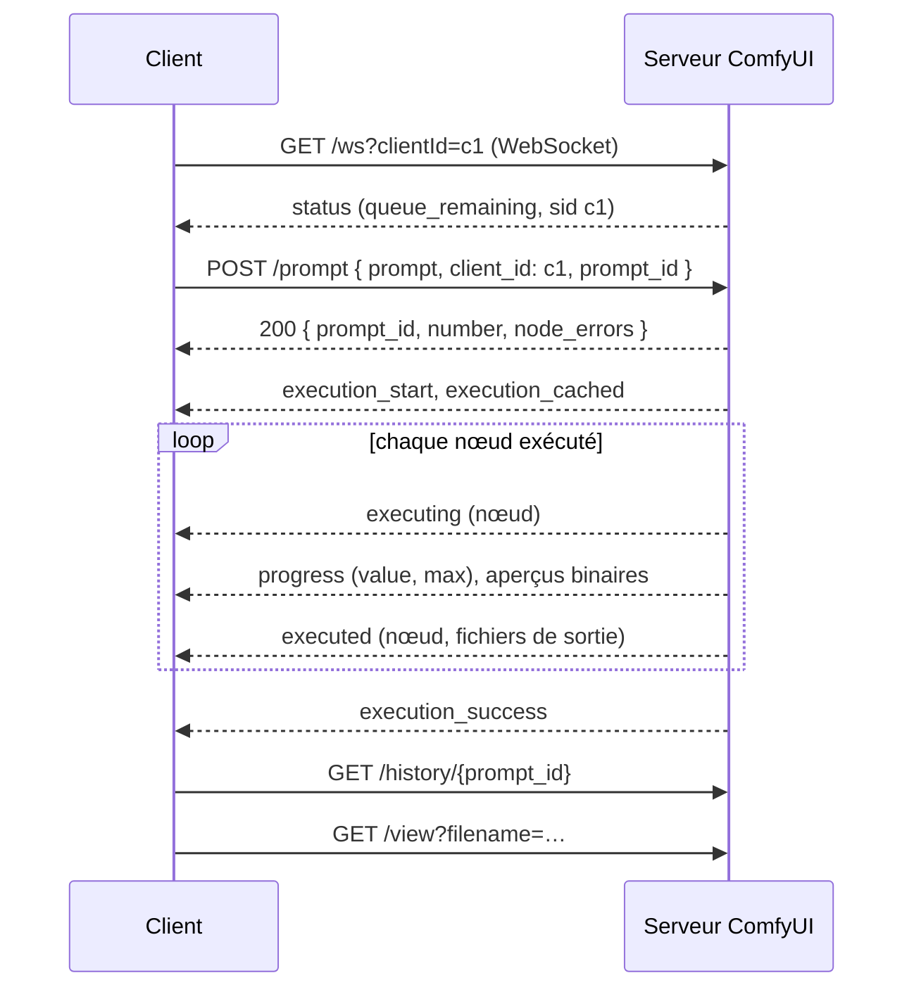

Code : le client C# dans [`csharp/ComfyClient.cs`](https://github.com/spareilleux/learn/blob/a1a9bffadaa7156b91ca9c2c2b8885e9e9862dd5/code/comfyui/csharp/ComfyClient.cs), le client Java dans [`java/src/main/java/dev/learn/comfy/Main.java`](https://github.com/spareilleux/learn/blob/a1a9bffadaa7156b91ca9c2c2b8885e9e9862dd5/code/comfyui/java/src/main/java/dev/learn/comfy/Main.java), le workflow que la CI exécute sans modèle dans [`workflows/solid-color.api.json`](https://github.com/spareilleux/learn/blob/a1a9bffadaa7156b91ca9c2c2b8885e9e9862dd5/code/comfyui/workflows/solid-color.api.json), et le script de serveur de la CI dans [`server.sh`](https://github.com/spareilleux/learn/blob/a1a9bffadaa7156b91ca9c2c2b8885e9e9862dd5/code/comfyui/server.sh).

## Les routes dont un client a besoin

L'API du serveur est celle qu'utilise le navigateur ; il n'y a pas d'API publique séparée. La [page des routes](https://docs.comfy.org/development/comfyui-server/comms_routes) les liste, et [`server.py`](https://github.com/Comfy-Org/ComfyUI/blob/ee71d5c4993f29086b27fde1629a945ae48425bf/server.py) à la v0.36.0 en a quelques-unes de plus. Chaque route est aussi servie sous un préfixe `/api`, et c'est celui qu'appelle le frontend.

| Route | Ce qu'un client en fait |
|---|---|
| `GET /ws?clientId=…` | ouvre le WebSocket qui transporte la progression des prompts du client |
| `POST /prompt` | valide un prompt et le met en file d'attente ; répond avec son identifiant, ou avec `error` et `node_errors` |
| `GET /history/{prompt_id}` | les sorties et l'état d'un prompt terminé |
| `GET /view?filename=…&subfolder=…&type=output` | les octets d'un fichier de sortie |
| `GET /object_info`, `/object_info/{class}` | les définitions des nœuds, telles qu'utilisées dans la leçon 3 |
| `GET /queue`, `POST /queue` | les prompts en cours et en attente ; supprime ceux en attente |
| `POST /interrupt` | arrête le prompt en cours d'exécution |
| `POST /free` | décharge les modèles, et libère la mémoire |
| `GET /system_stats` | les versions, la RAM et la VRAM |
| `POST /upload/image` | envoie une image d'entrée, pour la leçon 5 |

Le code de la v0.36.0 a aussi des routes `/api/jobs`, pour lister, lire et annuler des tâches, que la documentation ne mentionne pas encore. Ce cours ne les utilise pas.

## Un prompt, étape par étape



Trois détails décident si un client fonctionne :

- **Connecte-toi d'abord, et transmets le même identifiant de client.** Le serveur n'envoie la progression d'un prompt qu'au WebSocket dont le `clientId` correspond au `client_id` du prompt. Il ne rejoue pas les événements : quand un client se reconnecte avec le même identifiant, le gestionnaire n'envoie que le nœud en cours d'exécution à ce moment-là, s'il y en a un ([`server.py`, lignes 269 à 290](https://github.com/Comfy-Org/ComfyUI/blob/ee71d5c4993f29086b27fde1629a945ae48425bf/server.py#L269-L290)). Un client qui se connecte après l'envoi peut tout manquer ; `/history` est la solution de repli.
- **Le client peut choisir l'identifiant du prompt.** `POST /prompt` accepte un `prompt_id`, qui doit être un UUID « in the canonical lowercase hyphenated form », c'est-à-dire sous la forme canonique en minuscules avec des tirets ([`comfy_execution/jobs.py`](https://github.com/Comfy-Org/ComfyUI/blob/ee71d5c4993f29086b27fde1629a945ae48425bf/comfy_execution/jobs.py#L34-L44)). Le choisir avant l'envoi évite une situation de concurrence : le client sait quels événements sont les siens avant que la réponse au POST n'arrive. `Guid.NewGuid().ToString()` en C# et `UUID.randomUUID().toString()` en Java donnent tous deux cette forme.
- **Arrête-toi sur `execution_success`, `execution_error` ou `execution_interrupted`.** L'exemple Python du dépôt de ComfyUI attend un message `executing` dont `node` vaut `null` ([`script_examples/websockets_api_example.py`, lignes 37 à 39](https://github.com/Comfy-Org/ComfyUI/blob/ee71d5c4993f29086b27fde1629a945ae48425bf/script_examples/websockets_api_example.py#L37-L39)). Le serveur en envoie toujours un, après avoir écrit l'historique ([`main.py`, ligne 374](https://github.com/Comfy-Org/ComfyUI/blob/ee71d5c4993f29086b27fde1629a945ae48425bf/main.py#L373-L374)), mais les trois messages explicites disent comment le prompt s'est terminé.

## Le client C#

Le client est une commande de l'outil du cours : `comfy run <server> <workflow> [--set node.input=value]... [--out dir]`. Il utilise [`HttpClient`](https://learn.microsoft.com/dotnet/api/system.net.http.httpclient) et [`ClientWebSocket`](https://learn.microsoft.com/dotnet/api/system.net.websockets.clientwebsocket), sans aucun paquet. La connexion et l'envoi :

```csharp
string clientId = Guid.NewGuid().ToString("N");
using var socket = new ClientWebSocket();
var wsUri = new UriBuilder(server) { Scheme = server.Scheme == "https" ? "wss" : "ws", Path = "/ws", Query = $"clientId={clientId}" }.Uri;
await socket.ConnectAsync(wsUri, cancel.Token);

// The client can choose the prompt id: a lowercase UUID.
string promptId = Guid.NewGuid().ToString();
var request = new JsonObject { ["prompt"] = workflow, ["client_id"] = clientId, ["prompt_id"] = promptId };
using var response = await http.PostAsJsonAsync("prompt", request, cancel.Token);
```

Un message WebSocket peut arriver en plusieurs trames, donc la boucle de réception lit jusqu'à `EndOfMessage` avant d'analyser. Les messages texte sont du JSON avec un `type` et un objet `data` ; les messages binaires sont des aperçus :

```csharp
using var message = new MemoryStream();
WebSocketReceiveResult result;
do
{
    result = await socket.ReceiveAsync(buffer, cancel);
    if (result.MessageType == WebSocketMessageType.Close) throw new IOException("the server closed the WebSocket");
    message.Write(buffer, 0, result.Count);
} while (!result.EndOfMessage);
```

Quand le prompt a réussi, le client lit `/history/{prompt_id}`, télécharge chaque image avec `/view`, et la décode avec le lecteur de PNG de la leçon 3 pour afficher l'empreinte de ses pixels.

Contre le serveur GPU des leçons 1 et 2, démarré avec `--preview-method taesd`, sur le workflow de la leçon 1 :

```text
> dotnet out/csharp/comfy.dll run http://127.0.0.1:8188 workflows/01-txt2img.api.json
POST /prompt: 200
status: connected, queue_remaining 0
execution_start
execution_cached: []
executing: node 4
executing: node 5
executing: node 7
executing: node 6
executing: node 3
progress: node 3, 1/25
binary message: type 1, 29080 bytes
progress: node 3, 2/25
binary message: type 1, 42113 bytes
…
progress: node 3, 25/25
binary message: type 1, 73406 bytes
executing: node 8
executing: node 9
executed: node 9, l01/metronome_00002_.png
execution_success
GET /view node 9: l01/metronome_00002_.png, 1024 x 1024, pixel SHA-256 698e7867e7fc04fb
```

L'empreinte des pixels est celle de la leçon 1, sur un serveur fraîchement démarré. Les messages binaires sont les aperçus que le navigateur affiche pendant l'échantillonnage : un type d'événement sur 4 octets en big-endian, 1 pour une image d'aperçu, puis un format d'image sur 4 octets, 1 pour JPEG, puis l'image, tels que les écrit [`server.py`](https://github.com/Comfy-Org/ComfyUI/blob/ee71d5c4993f29086b27fde1629a945ae48425bf/server.py#L1305-L1336). Avec la valeur par défaut `--preview-method none`, il n'y en a aucun. `taesd` décode le latent de chaque étape avec un petit VAE approximatif, donc les aperçus coûtent du temps : l'échantillonnage a tourné à 4,9 étapes par seconde au lieu de 6,4.

## Le client Java

Le client Java fait la même chose avec [`java.net.http.HttpClient`](https://docs.oracle.com/en/java/javase/25/docs/api/java.net.http/java/net/http/HttpClient.html), son [`WebSocket`](https://docs.oracle.com/en/java/javase/25/docs/api/java.net.http/java/net/http/WebSocket.html), et [Jackson](https://github.com/FasterXML/jackson) 3.2.2 pour le JSON. Le WebSocket de Java fonctionne par callbacks : un [`WebSocket.Listener`](https://docs.oracle.com/en/java/javase/25/docs/api/java.net.http/java/net/http/WebSocket.Listener.html) reçoit des morceaux de messages, et demande le suivant avec `request(1)`. Le client rassemble chaque message complet et le place dans une `BlockingQueue`, pour que le thread principal puisse lire les événements dans l'ordre, comme la boucle C# :

```java
@Override
public CompletionStage<?> onText(WebSocket socket, CharSequence data, boolean last) {
    text.append(data);
    if (last) {
        messages.add(new Message(text.toString(), null));
        text.setLength(0);
    }
    socket.request(1);
    return null;
}
```

Le client Java calcule la même empreinte de pixels avec [`ImageIO`](https://docs.oracle.com/en/java/javase/25/docs/api/java.desktop/javax/imageio/ImageIO.html), à partir des octets rouge, vert et bleu de chaque pixel. Sur le même serveur GPU, avec la graine 43 :

```text
> java -jar java/target/comfy.jar run http://127.0.0.1:8188 workflows/01-txt2img.api.json --set 3.seed=43
POST /prompt: 200
status: connected, queue_remaining 0
execution_start
execution_cached: [4, 5, 6, 7]
executing: node 3
progress: node 3, 1/25
binary message: type 1, 36289 bytes
…
executing: node 8
executing: node 9
executed: node 9, l01/metronome_00003_.png
execution_success
GET /view node 9: l01/metronome_00003_.png, 1024 x 1024, pixel SHA-256 3dd47bf04931ccaa
```

`3dd47bf04931ccaa` est l'empreinte du rendu de graine 43 de la leçon 2, fait vingt minutes plus tôt sur un autre démarrage du serveur : mêmes pixels. Le checkpoint et les deux prompts venaient du cache de l'exécution du client C#, puisque le cache appartient au serveur, pas à un client.

## Ce que vérifie la CI

Les runners de GitHub n'ont pas de GPU, et le cours ne met aucun modèle dans le dépôt. [`solid-color.api.json`](https://github.com/spareilleux/learn/blob/a1a9bffadaa7156b91ca9c2c2b8885e9e9862dd5/code/comfyui/workflows/solid-color.api.json) n'a besoin ni de l'un ni de l'autre : un nœud `EmptyImage` crée une image de 64 × 48 d'une seule couleur, `ImageInvert` l'inverse, et deux nœuds `SaveImage` enregistrent les deux. [`comfyui-examples.yml`](https://github.com/spareilleux/learn/blob/a1a9bffadaa7156b91ca9c2c2b8885e9e9862dd5/.github/workflows/comfyui-examples.yml) clone ComfyUI à la v0.36.0, installe PyTorch pour le CPU sous Ubuntu, Windows et macOS, et exécute `check.sh`, qui démarre le serveur avec `--cpu` et exécute les deux clients. Le client C#, deux fois, puis sur le workflow cassé de la leçon 3 :

```text
--- C#, first run
POST /prompt: 200
status: connected, queue_remaining 0
execution_start
execution_cached: []
executing: node 1
executing: node 3
executed: node 3, ci/solid_00001_.png
executing: node 2
executing: node 4
executed: node 4, ci/inverted_00001_.png
execution_success
GET /view node 3: ci/solid_00001_.png, 64 x 48, pixel SHA-256 da28b3b4fc5883a2
GET /view node 4: ci/inverted_00001_.png, 64 x 48, pixel SHA-256 252fab8d4cbe179f
--- C#, same workflow again
POST /prompt: 200
status: connected, queue_remaining 0
execution_start
execution_cached: [1, 2, 3, 4]
executed: node 4, ci/inverted_00001_.png
executed: node 3, ci/solid_00001_.png
execution_success
GET /view node 4: ci/inverted_00001_.png, 64 x 48, pixel SHA-256 252fab8d4cbe179f
GET /view node 3: ci/solid_00001_.png, 64 x 48, pixel SHA-256 da28b3b4fc5883a2
--- C#, a broken workflow
POST /prompt: 400
error prompt_outputs_failed_validation: Prompt outputs failed validation
  node 4 (CheckpointLoaderSimple): value_not_in_list: ckpt_name: 'sd_xl_base_1.0.safetensors' not in []
  node 3 (KSampler): exception_during_inner_validation: '12'
exit code 1
```

Trois choses de cette sortie ont été apprises à la dure :

- **Une exécution en cache envoie quand même `executed`.** La deuxième exécution n'exécute rien, mais le serveur rejoue le résultat de chaque nœud de sortie, avec les noms de fichiers de la première exécution, et n'écrit aucun nouveau fichier.
- **L'ordre des nœuds de sortie change d'un démarrage du serveur à l'autre.** La première version de `check.sh` a échoué à son deuxième essai : `executed: node 3` et `executed: node 4` avaient échangé leurs places. Le serveur garde les nœuds de sortie qu'il a validés dans un ensemble Python ([`execution.py`, lignes 1186 à 1282](https://github.com/Comfy-Org/ComfyUI/blob/ee71d5c4993f29086b27fde1629a945ae48425bf/execution.py#L1186-L1282)), et Python rend aléatoire le hachage des chaînes à chaque démarrage, donc l'ordre d'itération d'un ensemble d'identifiants de nœuds change. [`server.sh`](https://github.com/spareilleux/learn/blob/a1a9bffadaa7156b91ca9c2c2b8885e9e9862dd5/code/comfyui/server.sh) fixe `PYTHONHASHSEED=0` pour que la sortie de la CI puisse être comparée. Un vrai client ne doit pas dépendre de cet ordre.
- **Seul le premier message `status` est affiché.** Il répond à la connexion et porte l'identifiant de session. Le serveur en envoie d'autres quand sa file d'attente change, deux par prompt dans chaque exécution de ce cours, mais rien ne documente combien, donc les clients ne les affichent pas.

Le client Java exécute le même workflow avec `--set 1.color=65280`, un vert pur, pour que le serveur ne réponde pas depuis son cache, ainsi que le workflow cassé ; sa sortie est dans [`expected/04-run-java.txt`](https://github.com/spareilleux/learn/blob/a1a9bffadaa7156b91ca9c2c2b8885e9e9862dd5/code/comfyui/expected/04-run-java.txt). Les deux clients affichent les mêmes empreintes de pixels pour les mêmes images, et les deux empreintes sont les mêmes sur les trois systèmes d'exploitation.

Ce que la CI ne vérifie pas : les aperçus, les messages `progress`, que les nœuds de couleur unie n'envoient pas, et `execution_error`. Les clients affichent le nœud, le type et le message d'une erreur d'exécution à partir des champs du code du serveur, mais aucune exécution de ce cours n'en a encore produit, donc ce chemin est *à vérifier*.

## Autour du cas nominal

- **Délais d'attente.** Une première exécution de SDXL a pris 15 secondes ici, et un gros workflow vidéo peut prendre de nombreuses minutes. Les clients abandonnent après 20 minutes sans message. Un service de longue durée devrait plutôt garder le WebSocket ouvert, se reconnecter avec le même identifiant de client quand la connexion tombe, et lire `/history/{prompt_id}` pour rattraper son retard.
- **Interrompre.** `POST /interrupt` sans corps arrête ce qui s'exécute, quel que soit celui qui l'a mis en file d'attente ; avec `{"prompt_id": …}`, le code de la v0.36.0 ne l'arrête que si ce prompt est celui en cours ([`server.py`, lignes 1163 à 1193](https://github.com/Comfy-Org/ComfyUI/blob/ee71d5c4993f29086b27fde1629a945ae48425bf/server.py#L1163-L1193)). Un prompt qui n'a pas démarré se retire de la file d'attente avec `POST /queue` et `{"delete": [prompt_id]}`. Les deux répondent `200` quand il n'y a rien à arrêter et quand l'identifiant n'est pas dans la file : le code de statut dit que l'appel a été accepté, pas qu'il a fait quelque chose. Pour le savoir, relire `/queue` et `/history` ensuite. [`check.sh`](https://github.com/spareilleux/learn/blob/main/code/comfyui/check.sh) exécute les deux sur les trois systèmes.
- **Les erreurs pendant l'exécution.** La validation a lieu avant le rendu, donc un prompt peut être accepté et échouer quand même. Le contrôle téléverse un fichier qui n'est pas une image sous un nom en `.png` : `LoadImage` le liste, `POST /prompt` répond `200`, et le rendu se termine par `execution_error: node 1 (LoadImage): cannot identify image file …`. Les deux clients affichent le nœud fautif et sortent avec le code 1. Un worker doit distinguer cela d'une panne réseau — l'échec se reproduira à l'identique, donc le réessayer gaspille la file. La leçon 12 trie les échecs.
- **Un serveur, une file d'attente.** Les prompts s'exécutent un par un, dans l'ordre de la file, quel que soit le client qui les a envoyés. Deux clients partagent le cache du serveur, c'est pourquoi l'exécution Java ci-dessus a réutilisé les encodages de texte de l'exécution C#.
- **Pas d'authentification.** Tout ce qui précède fonctionne pour quiconque peut atteindre le port. La leçon 12, sur la production, place le serveur derrière quelque chose qui vérifie qui appelle.

## Points clés

- Un client ouvre le WebSocket avec son identifiant de client, envoie le prompt avec le même identifiant de client et, idéalement, un identifiant de prompt qu'il a choisi, suit les messages jusqu'à `execution_success`, `execution_error` ou `execution_interrupted`, puis lit `/history` et télécharge les fichiers avec `/view`.
- En C#, `HttpClient` et `ClientWebSocket` suffisent ; en Java, `java.net.http` et une bibliothèque JSON. Les deux doivent réassembler les messages qui arrivent en plusieurs trames.
- Les messages WebSocket binaires sont des aperçus : un type d'événement, un format d'image, et un JPEG ou un PNG.
- Ne compte ni sur l'ordre des nœuds de sortie, ni sur le nombre de messages `status`, ni sur l'obtention de nouveaux fichiers lors d'une exécution en cache.

## À toi de jouer

Ajoute au client C# ou au client Java ce que cette leçon a laissé de côté : un affichage de progression alimenté par les messages `progress`, ou un `POST /interrupt` déclenché au clavier. Débranche ensuite le câble réseau — ou arrête le serveur — au milieu d'un rendu, et regarde ce que fait ton client. Un client qui attend indéfiniment sur une socket fermée est le bogue le plus courant de ce genre de code.

## Exercices

1. Exécute le client C# deux fois sur le workflow de la leçon 1, avec `--set 9.filename_prefix="l04/again"` la seconde fois. Quels messages la seconde exécution affiche-t-elle, et écrit-elle un fichier ?
2. Ajoute une option `--timeout` au client C#, et fais-lui appeler `POST /interrupt` quand le temps est écoulé. Que dit ensuite le WebSocket ?
3. Le `onBinary` du client Java copie le tampon qu'il reçoit dans un nouveau. Pourquoi ne pas garder le `ByteBuffer` que reçoit le listener ?

<details>
<summary>Solution 1</summary>

La seconde exécution affiche `execution_cached: [4, 5, 6, 7, 3, 8]`, puis `executing: node 9`, `executed: node 9, l04/again_00001_.png`, et `execution_success`. Seul `SaveImage` s'exécute, parce que son entrée `filename_prefix` a changé, et il écrit un nouveau fichier à partir de l'image en cache. La leçon 1 a mesuré ce cas entre 0,07 et 0,09 seconde.

</details>

<details>
<summary>Solution 2</summary>

```csharp
using var cancel = new CancellationTokenSource(timeout);
try
{
    string outcome = await FollowEvents(socket, promptId, cancel.Token);
}
catch (OperationCanceledException)
{
    await http.PostAsJsonAsync("interrupt", new JsonObject { ["prompt_id"] = promptId });
    // ...then keep reading, with a new token, until execution_interrupted
}
```

Annuler un `ReceiveAsync` en attente devrait laisser le `ClientWebSocket` dans l'état interrompu, donc le client se reconnecterait avec le même identifiant de client pour lire la suite ; le serveur devrait alors envoyer `execution_interrupted`, avec le nœud qui s'exécutait. Rien de cette solution n'a été exécuté : c'est *à vérifier*, y compris l'état du socket après l'annulation, et si la reconnexion arrive à temps pour voir le message ou si `/history` est le seul endroit qui reste pour lire l'issue.

</details>

<details>
<summary>Solution 3</summary>

La documentation de [`WebSocket.Listener`](https://docs.oracle.com/en/java/javase/25/docs/api/java.net.http/java/net/http/WebSocket.Listener.html) dit, pour `onBinary` : « Do not access the ByteBuffer after this CompletionStage has completed. », c'est-à-dire de ne plus accéder au ByteBuffer une fois ce CompletionStage terminé. Le client renvoie `null`, ce qui compte comme une étape déjà terminée. Garder le tampon et le lire plus tard sur le thread principal enfreindrait cette règle, et pourrait lire des octets que l'implémentation a réutilisés. Le copier, comme le fait le client, évite cela ; tout comme convertir les morceaux de texte en `String` avant de sortir de `onText`.

</details>

## Sources

- Documentation de ComfyUI : [routes du serveur](https://docs.comfy.org/development/comfyui-server/comms_routes), [messages](https://docs.comfy.org/development/comfyui-server/comms_messages), [exemples d'API](https://docs.comfy.org/development/comfyui-server/api-examples).
- ComfyUI à la v0.36.0 : [`server.py`](https://github.com/Comfy-Org/ComfyUI/blob/ee71d5c4993f29086b27fde1629a945ae48425bf/server.py), [`protocol.py`](https://github.com/Comfy-Org/ComfyUI/blob/ee71d5c4993f29086b27fde1629a945ae48425bf/protocol.py), [`main.py`](https://github.com/Comfy-Org/ComfyUI/blob/ee71d5c4993f29086b27fde1629a945ae48425bf/main.py), [`execution.py`](https://github.com/Comfy-Org/ComfyUI/blob/ee71d5c4993f29086b27fde1629a945ae48425bf/execution.py), [`comfy_execution/jobs.py`](https://github.com/Comfy-Org/ComfyUI/blob/ee71d5c4993f29086b27fde1629a945ae48425bf/comfy_execution/jobs.py).
- .NET : [`ClientWebSocket`](https://learn.microsoft.com/dotnet/api/system.net.websockets.clientwebsocket), [`HttpClient`](https://learn.microsoft.com/dotnet/api/system.net.http.httpclient), [WebSockets dans .NET](https://learn.microsoft.com/dotnet/fundamentals/networking/websockets).
- Java 25 : [`HttpClient`](https://docs.oracle.com/en/java/javase/25/docs/api/java.net.http/java/net/http/HttpClient.html), [`WebSocket`](https://docs.oracle.com/en/java/javase/25/docs/api/java.net.http/java/net/http/WebSocket.html), [`WebSocket.Listener`](https://docs.oracle.com/en/java/javase/25/docs/api/java.net.http/java/net/http/WebSocket.Listener.html).
