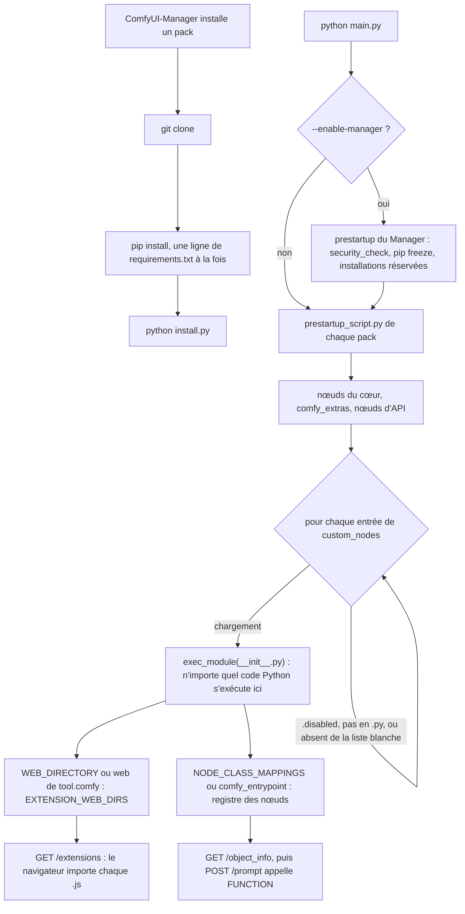

Code : le pack de nœuds Guitar Alchemist dans [`custom-nodes/ga/`](https://github.com/spareilleux/learn/tree/22f2bf71c21d2cc4f426c0e917e7e19dbfca5bc3/code/comfyui/custom-nodes/ga), avec ses tests et ses workflows, et le script d'audit, sa fixture et la démonstration pickle dans [`custom-nodes/audit/`](https://github.com/spareilleux/learn/tree/22f2bf71c21d2cc4f426c0e917e7e19dbfca5bc3/code/comfyui/custom-nodes/audit).

Tous les nœuds des dix premières leçons étaient fournis avec ComfyUI. La leçon 6 avait besoin d'un préprocesseur de pose que le cœur n'a pas, et la leçon 8 a rencontré des fichiers GGUF que seul un nœud personnalisé sait charger. Un nœud personnalisé est un dossier de code Python que ComfyUI importe dans son propre processus au démarrage, avec les droits de l'utilisateur qui l'a lancé. Il n'y a ni bac à sable, ni permission, ni signature. Cette leçon lit comment se passe le chargement, écrit un petit pack, puis examine les risques : ce que vérifie l'installateur, ce qui a déjà mal tourné, comment lire un pack avant de l'installer, et comment limiter les dégâts si tu en installes un mauvais.

## Comment ComfyUI charge un pack

### Le dossier et l'import

Au démarrage, [`init_external_custom_nodes`](https://github.com/Comfy-Org/ComfyUI/blob/ee71d5c4993f29086b27fde1629a945ae48425bf/nodes.py#L2344-L2389) liste chaque dossier enregistré comme `custom_nodes`, par défaut `ComfyUI/custom_nodes/`, ou `custom_nodes/` sous `--base-directory`, et essaie chaque entrée :

- un fichier qui ne se termine pas par `.py` est ignoré, tout comme un nom qui se termine par `.disabled` ;
- avec `--disable-all-custom-nodes`, seuls les noms passés à `--whitelist-custom-nodes` sont chargés ;
- avec `--enable-manager`, ComfyUI-Manager peut bloquer une entrée, avec le message « Blocked by policy », c'est-à-dire bloquée par la politique ; dans la version 4.2.2, sa fonction [`should_be_disabled`](https://github.com/Comfy-Org/ComfyUI-Manager/blob/bd4ede2237c97b3a71569a0301a0be9db226c7e9/comfyui_manager/__init__.py#L68-L80) ne bloque qu'une ancienne copie du Manager lui-même, installée comme nœud personnalisé.

Ensuite, [`load_custom_node`](https://github.com/Comfy-Org/ComfyUI/blob/ee71d5c4993f29086b27fde1629a945ae48425bf/nodes.py#L2246-L2342) importe le pack avec [`importlib`](https://docs.python.org/3/library/importlib.html) : un fichier `.py` seul, ou le `__init__.py` du dossier. La ligne qui compte est `module_spec.loader.exec_module(module)`, à la ligne 2266. Elle exécute tout le module, de haut en bas, avant que ComfyUI n'ait regardé quoi que ce soit de son contenu. Tout ce que `__init__.py` importe, démarre ou télécharge se produit ici, même si le pack ne définit finalement aucun nœud.

Après l'import, ComfyUI lit trois noms dans le module :

- `NODE_CLASS_MAPPINGS`, un dictionnaire qui associe le nom unique d'un nœud à sa classe ; sans lui, un pack V3 exporte plutôt `comfy_entrypoint`, et sans aucun des deux, le journal dit « Skip … due to the lack of NODE_CLASS_MAPPINGS or comfy_entrypoint (need one) », c'est-à-dire que le module est ignoré faute de l'un ou de l'autre ;
- `NODE_DISPLAY_NAME_MAPPINGS`, les noms affichés dans l'interface ;
- `WEB_DIRECTORY`, un dossier de JavaScript, ou la clé `web` sous `[tool.comfy]` dans le `pyproject.toml` du pack.

Un nom de nœud qui existe déjà dans le cœur de ComfyUI est ignoré (c'est l'ensemble `ignore` des noms intégrés), donc un pack ne peut pas remplacer `KSampler` par la table de correspondance. Il peut quand même tout remplacer par d'autres moyens : le pack est du Python ordinaire, dans le même processus. ComfyUI le sait, et [`hook_breaker_ac10a0.py`](https://github.com/Comfy-Org/ComfyUI/blob/ee71d5c4993f29086b27fde1629a945ae48425bf/hook_breaker_ac10a0.py#L1-L17) commence par « Prevent custom nodes from hooking anything important », c'est-à-dire empêcher les nœuds personnalisés d'intercepter quoi que ce soit d'important. Il enregistre `comfy.model_management.cast_to` avant le chargement des packs et le remet en place ensuite. Il protège une seule fonction, pour la stabilité. Ce n'est pas une frontière de sécurité, et il n'essaie pas d'en être une.

Si l'import lève une exception, ComfyUI journalise la trace, « Cannot import … module for custom nodes », c'est-à-dire que le module n'a pas pu être importé, et continue. La [page sur le cycle de vie](https://docs.comfy.org/custom-nodes/backend/lifecycle) le dit : « If there is an error in your code, Comfy will continue, but will report the module as having failed to load. So check the Python console! », c'est-à-dire qu'en cas d'erreur, Comfy continue mais signale l'échec du chargement, et qu'il faut donc regarder la console Python.

### Avant l'import : `prestartup_script.py`

Plus tôt encore, [`execute_prestartup_script`](https://github.com/Comfy-Org/ComfyUI/blob/ee71d5c4993f29086b27fde1629a945ae48425bf/main.py#L183-L237) exécute le `prestartup_script.py` de chaque dossier de pack qui en a un, bien avant le chargement des nœuds. Les packs s'en servent pour modifier tôt des chemins ou des réglages. rgthree-comfy en a un ; ComfyUI-Manager aussi, et il s'en sert pour lancer sa propre fonction `security_check()`.

### Du côté du navigateur : `WEB_DIRECTORY`

Chaque dossier enregistré dans `EXTENSION_WEB_DIRS` est servi sous `/extensions/<pack>/` ([server.py, ligne 1246](https://github.com/Comfy-Org/ComfyUI/blob/ee71d5c4993f29086b27fde1629a945ae48425bf/server.py#L1246-L1247)), et [`GET /extensions`](https://github.com/Comfy-Org/ComfyUI/blob/ee71d5c4993f29086b27fde1629a945ae48425bf/server.py#L356-L370) renvoie la liste de tous leurs fichiers `.js`. Le frontend importe chacun d'eux dans la page. Le JavaScript d'un pack s'exécute donc dans l'onglet de navigateur de toute personne qui ouvre l'interface, avec accès à la page, à l'API de la file d'attente et à tout ce que la page peut atteindre. La [présentation du JavaScript de ComfyUI](https://docs.comfy.org/custom-nodes/js/javascript_overview) décrit les points d'extension.

`WEB_DIRECTORY` est une convention, pas un contrôle. Le [`__init__.py` de ComfyUI-Impact-Pack](https://github.com/ltdrdata/ComfyUI-Impact-Pack/blob/429d0159ad429e64d2b3916e6e7be9c22d025c3c/__init__.py#L449-L453) écrit directement dans le dictionnaire de ComfyUI : `nodes.EXTENSION_WEB_DIRS["ComfyUI-Impact-Pack"] = os.path.join(...)`, avec le commentaire « Inject directly into EXTENSION_WEB_DIRS instead of WEB_DIRECTORY », c'est-à-dire injecter directement dans EXTENSION_WEB_DIRS au lieu de passer par WEB_DIRECTORY. Ça fonctionne, parce que le Python du pack peut modifier n'importe quel objet du serveur.

### À l'installation : `requirements.txt` et `install.py`

ComfyUI lui-même n'installe jamais rien. ComfyUI-Manager, si, dans [`execute_install_script`](https://github.com/Comfy-Org/ComfyUI-Manager/blob/bd4ede2237c97b3a71569a0301a0be9db226c7e9/comfyui_manager/glob/manager_core.py#L1997-L2039) : après avoir cloné un pack, il lance `pip install` pour chaque ligne de son `requirements.txt`, puis `python install.py` si le fichier existe. Sous Windows, [`try_install_script`](https://github.com/Comfy-Org/ComfyUI-Manager/blob/bd4ede2237c97b3a71569a0301a0be9db226c7e9/comfyui_manager/glob/manager_core.py#L1903-L1925) ne les exécute pas tout de suite : il les réserve, et le prestartup du Manager les exécute au démarrage suivant. Dans les deux cas, le code du pack et celui de ses dépendances s'exécutent avant même que tu ajoutes un de ses nœuds à un graphe.



## Un pack de nœuds Guitar Alchemist

Le pack du cours dessine ce que [Guitar Alchemist](https://github.com/GuitarAlchemist/ga) (GA) sait du manche, sous forme d'images qu'un graphe ComfyUI peut utiliser. Il a trois nœuds :

| Nœud | Entrées | Sorties |
|---|---|---|
| `GAChordDiagram` (GA Chord Diagram) | `chord` : un voicing écrit depuis le mi grave, comme `x32010` ou `x-10-12-12-12-10`, ou un symbole comme `C`, `Am`, `G7`, `Bm7b5` ; `size` : de 128 à 2048 pixels | `image` : un diagramme d'accord noir sur blanc, de size × size ; `ga_diagram` : le même voicing dans l'ordre de GA |
| `GAFretboardControlMap` (GA Fretboard Control Map) | `source` : `chord` ou `scale` ; `chord` ; `key` et `mode` ; `fret_start` de 0 à 23 et `fret_end` de 1 à 24 ; `width` et `height`, de 256 à 2048 par pas de 8, 1024 par défaut ; `line_width` ; en option, `note_style`, `ring` (un disque noir cerclé de blanc, par défaut) ou `filled` (un disque blanc), et `inlays`, `show` ou `hide` ; l'accord `xxxxxx` dessine un manche vide | `lines` : des contours blancs sur noir, comme une carte Canny ; `depth` : une carte façon profondeur, plus clair signifie plus proche ; `layout` : du JSON avec le manche, les frettes et les cordes, et le centre et le rayon de chaque note et de chaque repère, en pixels |
| `GAScalePrompt` (GA Scale Prompt) | `key`, `mode`, `subject` | `prompt` : un fragment de texte, identique à chaque fois |

### La théorie, calculée localement

Les nœuds n'appellent pas de serveur GA. Ils calculent à partir de tables copiées du code source de GA, figé sur un commit, et [`theory.py`](https://github.com/spareilleux/learn/blob/22f2bf71c21d2cc4f426c0e917e7e19dbfca5bc3/code/comfyui/custom-nodes/ga/theory.py#L1-L18) cite chacune d'elles :

- l'accordage est le `Tuning.Default` de GA, [« E2 A2 D3 G3 B3 E4 »](https://github.com/GuitarAlchemist/ga/blob/a826864f3a012cad88e415954bf57eca0ce12aa6/Common/GA.Domain.Core/Instruments/Tuning.cs#L23), que GA [stocke en commençant par la corde la plus aiguë](https://github.com/GuitarAlchemist/ga/blob/a826864f3a012cad88e415954bf57eca0ce12aa6/Common/GA.Domain.Core/Instruments/Tuning.cs#L86-L109) ;
- les modes sont les rotations du [`Scale.Major`](https://github.com/GuitarAlchemist/ga/blob/a826864f3a012cad88e415954bf57eca0ce12aa6/Common/GA.Domain.Core/Theory/Tonal/Scales/Scale.cs#L53) de GA, avec les noms de [`MajorScaleDegree.ToName`](https://github.com/GuitarAlchemist/ga/blob/a826864f3a012cad88e415954bf57eca0ce12aa6/Common/GA.Domain.Core/Theory/Tonal/Primitives/Diatonic/MajorScaleDegree.cs#L52-L62).

L'ordre des cordes demande de l'attention. Les diagrammes d'accords écrivent un voicing à partir de la corde 6, le mi grave : le do majeur ouvert s'écrit `x32010`. GA numérote les cordes à partir de la [corde 1, « the first string (Highest pitch) »](https://github.com/GuitarAlchemist/ga/blob/a826864f3a012cad88e415954bf57eca0ce12aa6/Common/GA.Domain.Core/Instruments/Primitives/Str.cs#L35-L43), c'est-à-dire la première corde, la plus aiguë, et ses diagrammes se lisent `0-1-0-2-3-x`, comme l'a constaté la [leçon 3 du cours de théorie musicale](../../music-theory-ga/03-chords-and-voicings/). Les nœuds prennent l'ordre des diagrammes, celui que tape un guitariste, et renvoient l'ordre de GA dans `ga_diagram`, pour qu'un workflow puisse le transmettre à GA.

Les modes sont épelés avec une lettre par degré, suivie d'une altération : do dorien s'écrit `C D Eb F G A Bb`. La méthode `Note.Chromatic.ToAccidented` de GA donne un nom en dièse à chaque touche noire, donc la même gamme sortirait avec `D#` et `A#` ; le [cours de théorie musicale](../../music-theory-ga/03-chords-and-voicings/) décrit ce problème d'orthographe.

### Une classe de nœud

Un nœud V1 est une simple classe. Voici le diagramme d'accord, tiré de [`nodes.py`](https://github.com/spareilleux/learn/blob/22f2bf71c21d2cc4f426c0e917e7e19dbfca5bc3/code/comfyui/custom-nodes/ga/nodes.py#L25-L45) :

```python
class GAChordDiagram:
    """A chord chart for a voicing (x32010, low E first) or a known symbol (C, Am, G7, Bm7b5...)."""

    @classmethod
    def INPUT_TYPES(cls):
        return {
            "required": {
                "chord": ("STRING", {"default": "x32010", "multiline": False}),
                "size": ("INT", {"default": 512, "min": 128, "max": 2048, "step": 8}),
            }
        }

    RETURN_TYPES = ("IMAGE", "STRING")
    RETURN_NAMES = ("image", "ga_diagram")
    FUNCTION = "draw"
    CATEGORY = CATEGORY
    DESCRIPTION = "Draws a chord diagram. ga_diagram is the same voicing in GA's order, high E first."

    def draw(self, chord, size):
        _, frets = theory.resolve_chord(chord)
        return (to_image(drawing.chord_diagram(frets, size)), theory.ga_diagram(frets))
```

`INPUT_TYPES` est ce que publie `/object_info`, et ce contre quoi la leçon 3 a validé les workflows. `FUNCTION` nomme la méthode qu'appelle l'exécuteur, avec un argument nommé par entrée, et la méthode renvoie un tuple avec une valeur par entrée de `RETURN_TYPES`. Une `IMAGE` est un tenseur float32 de forme `[batch, height, width, channels]`, avec des valeurs de 0 à 1, tel que [`LoadImage` le construit](https://github.com/Comfy-Org/ComfyUI/blob/ee71d5c4993f29086b27fde1629a945ae48425bf/nodes.py#L1784-L1785). La fonction `to_image` du pack empile des images [Pillow](https://pillow.readthedocs.io/en/stable/) dans cette forme, et renvoie un tableau [NumPy](https://numpy.org/doc/stable/) quand PyTorch est absent, ce qu'utilisent les tests.

Le `__init__.py` du pack contient une seule ligne de code, `from .nodes import NODE_CLASS_MAPPINGS, NODE_DISPLAY_NAME_MAPPINGS`. Il n'y a ni `WEB_DIRECTORY`, ni `requirements.txt`, ni `install.py`, ni `prestartup_script.py` : NumPy et Pillow font déjà partie des dépendances de ComfyUI.

Les dessins n'utilisent aucune police. Les seuls chiffres, le numéro de case à côté d'un diagramme qui commence au-dessus de la case 5, viennent d'une grille de 3 × 5 dans [`drawing.py`](https://github.com/spareilleux/learn/blob/22f2bf71c21d2cc4f426c0e917e7e19dbfca5bc3/code/comfyui/custom-nodes/ga/drawing.py#L11-L36), et le module [`ImageDraw`](https://pillow.readthedocs.io/en/stable/reference/ImageDraw.html) de Pillow trace les lignes et les ellipses sans anticrénelage. Les pixels dépendent alors des entrées et de la version de Pillow, pas des polices d'une machine. Les frettes de la carte de contrôle sont espacées comme sur un vrai manche, où la frette *n* se trouve à 1 − 2<sup>−n/12</sup> du diapason.

![Six diagrammes d'accords alignés, noir sur blanc, la corde de mi grave à gauche et le sillet en haut. Do : une croix au-dessus de la corde 6, des points sur la case 3 de la corde 5, la case 2 de la corde 4 et la case 1 de la corde 2, des cercles au-dessus des cordes 3 et 1. Sol : des points sur la case 3 des cordes 6 et 1 et sur la case 2 de la corde 5, trois cordes à vide. La mineur : une croix, puis des points sur la case 2 des cordes 4 et 3 et sur la case 1 de la corde 2. Fa : des points sur la case 1 des cordes 6, 2 et 1, sur la case 3 des cordes 5 et 4, et sur la case 2 de la corde 3. Mi sept : des points sur la case 2 de la corde 5 et sur la case 1 de la corde 3, quatre cordes à vide. Si mineur sept bémol cinq : des croix au-dessus des cordes 6 et 1, des points sur les cases 2, 3, 2 et 3 des cordes 5 à 2.](../../../../assets/comfyui/l11-chord-diagrams.webp)

*Dessinés par le nœud GA Chord Diagram avec Pillow, pas par un modèle de diffusion : `C`, `G`, `Am`, `F`, `E7` et `Bm7b5`, 256 pixels chacun, les images de [`expected/`](https://github.com/spareilleux/learn/tree/22f2bf71c21d2cc4f426c0e917e7e19dbfca5bc3/code/comfyui/custom-nodes/ga/expected).*

![Deux cartes du manche, l'une au-dessus de l'autre. En haut, des lignes blanches sur fond noir : le manche du sillet à la case 5, six cordes, un sillet épais à gauche, deux petits repères ronds, et l'accord de do majeur sous forme d'anneaux blancs : case 3 sur la corde de la, case 2 sur la corde de ré, case 1 sur la corde de si, et deux anneaux à gauche du sillet pour les cordes de sol et de mi aigu à vide. En bas, la version en profondeur de la éolien de la case 5 à la case 12 : une touche grise, des cordes et des frettes plus claires, et des points blancs sur chaque note de la gamme de la mineur.](../../../../assets/comfyui/l11-control-maps.webp)

*Dessinées par le nœud GA Fretboard Control Map avec Pillow : la sortie `lines` pour l'accord `C`, cases 0 à 5, et la sortie `depth` pour la éolien, cases 5 à 12 ; toutes deux en 1024 × 1024, recadrées autour du manche et réduites.*

### Tester un nœud sans ComfyUI

Comme un nœud est une classe, les tests importent le pack comme le fait ComfyUI, en tant que paquet nommé d'après son dossier, et appellent les méthodes. Ils ont besoin de NumPy et de Pillow, pas de ComfyUI, de PyTorch ni d'un GPU. [`test_ga.py`](https://github.com/spareilleux/learn/blob/22f2bf71c21d2cc4f426c0e917e7e19dbfca5bc3/code/comfyui/custom-nodes/ga/tests/test_ga.py) vérifie que chaque forme d'accord joue exactement les classes de hauteurs de son symbole, que `x32010` devient `0-1-0-2-3-x`, comment six modes sont épelés, et compare chaque image, pixel par pixel, avec un PNG de `expected/` :

```text
$ python -m unittest discover -s code/comfyui/custom-nodes/ga/tests -v
test_bad_fret_range (test_ga.NodesTest.test_bad_fret_range) ... ok
test_chord_diagrams (test_ga.NodesTest.test_chord_diagrams) ... ok
test_control_map_options (test_ga.NodesTest.test_control_map_options) ... ok
test_control_maps (test_ga.NodesTest.test_control_maps) ... ok
test_empty_neck (test_ga.NodesTest.test_empty_neck) ... ok
test_layout_matches_pixels (test_ga.NodesTest.test_layout_matches_pixels) ... ok
test_mappings (test_ga.NodesTest.test_mappings) ... ok
test_scale_prompt (test_ga.NodesTest.test_scale_prompt) ... ok
test_unknown_chord (test_ga.NodesTest.test_unknown_chord) ... ok
test_every_shape_plays_its_symbol (test_ga.TheoryTest.test_every_shape_plays_its_symbol) ... ok
test_ga_order_is_high_e_first (test_ga.TheoryTest.test_ga_order_is_high_e_first) ... ok
test_modes_are_spelled_with_one_letter_per_degree (test_ga.TheoryTest.test_modes_are_spelled_with_one_letter_per_degree) ... ok
test_scale_positions (test_ga.TheoryTest.test_scale_positions) ... ok
test_voicing_formats (test_ga.TheoryTest.test_voicing_formats) ... ok

----------------------------------------------------------------------
Ran 14 tests in 4.113s

OK
```

Ceci a tourné sous Windows 11 avec Python 3.14.2, NumPy 2.4.2 et Pillow 12.1.1. Que d'autres versions de Pillow dessinent les mêmes pixels est *à vérifier* ; `UPDATE=1` réécrit les PNG.

### Le charger dans un vrai ComfyUI

Pour voir tout le chemin de chargement, le cours a copié le pack dans un répertoire de base jetable sur un autre disque, et a démarré ComfyUI v0.36.0 sur le CPU, avec le Python de la version portable et les options du `server.sh` de la leçon 4 :

```bash
mkdir -p "$BASE/custom_nodes"
cp -r code/comfyui/custom-nodes/ga "$BASE/custom_nodes/ga"
PYTHONHASHSEED=0 "$COMFYUI_PYTHON" -s "$COMFYUI_DIR/main.py" --cpu --port 8199 \
  --base-directory "$BASE" --database-url sqlite:///:memory: --disable-auto-launch
```

Le journal liste le pack avec son temps d'import :

```text
[INFO] Import times for custom nodes:
[INFO]    0.0 seconds: G:\learn-33\comfyui-base\custom_nodes\ga
```

`GET /object_info/GAChordDiagram` a ensuite renvoyé la classe telle que la voit l'interface, avec notamment `"display_name": "GA Chord Diagram"`, `"category": "Guitar Alchemist"` et `"python_module": "custom_nodes.ga"`. L'envoi de [`ga-nodes-cpu.api.json`](https://github.com/spareilleux/learn/blob/22f2bf71c21d2cc4f426c0e917e7e19dbfca5bc3/code/comfyui/custom-nodes/ga/workflows/ga-nodes-cpu.api.json), qui branche les trois nœuds sur `SaveImage` et `PreviewAny`, a donné `"node_errors": {}`, « Prompt executed in 0.06 seconds », c'est-à-dire un prompt exécuté en 0,06 seconde, et ces sorties dans l'historique :

```json
{"5": {"images": [{"filename": "map-E-Phrygian_00001_.png", "subfolder": "ga", "type": "output"}]},
 "7": {"text": ["flamenco poster, inspired by the E Phrygian mode (E F G A B C D), minor with a lowered second, dark and tense mood"]},
 "2": {"images": [{"filename": "chord-Cmaj7_00001_.png", "subfolder": "ga", "type": "output"}]},
 "3": {"text": ["0-0-0-2-3-x"]}}
```

Le PNG `chord-Cmaj7` qu'a écrit `SaveImage` a les mêmes pixels que `expected/chord-Cmaj7.png`. Trois démarrages de plus ont montré les interrupteurs du chargeur. Avec `--disable-all-custom-nodes`, le journal dit « Skipping loading of custom nodes », c'est-à-dire que le chargement des nœuds personnalisés est sauté, et `/object_info/GAChordDiagram` renvoie `{}`. Avec `--disable-all-custom-nodes --whitelist-custom-nodes ga`, le pack se charge de nouveau. Avec le dossier renommé en `ga.disabled`, il ne se charge pas.

Pour le ControlNet de la leçon 6, [`ga-chord-controlnet.api.json`](https://github.com/spareilleux/learn/blob/22f2bf71c21d2cc4f426c0e917e7e19dbfca5bc3/code/comfyui/custom-nodes/ga/workflows/ga-chord-controlnet.api.json) est `06-canny.api.json`, où `LoadImage` et `Canny` sont remplacés par la carte du manche. Il n'a pas encore été rendu : *à vérifier*.

## Ce que ComfyUI-Manager vérifie, et ce qu'il ne vérifie pas

Dans la v0.36.0, le Manager n'est plus un nœud personnalisé que l'on clone : c'est un paquet pip, figé dans le [`manager_requirements.txt`](https://github.com/Comfy-Org/ComfyUI/blob/ee71d5c4993f29086b27fde1629a945ae48425bf/manager_requirements.txt) de ComfyUI sous la forme `comfyui_manager==4.2.2`, et activé avec [`--enable-manager`](https://github.com/Comfy-Org/ComfyUI/blob/ee71d5c4993f29086b27fde1629a945ae48425bf/comfy/cli_args.py#L161-L164). Le cours a comparé les 42 fichiers `.py`, `.json` et `.md` de la wheel 4.2.2 sur [PyPI](https://pypi.org/project/comfyui-manager/4.2.2/) avec le tag `4.2.2` du dépôt, au commit `bd4ede22` : tous identiques.

Il installe depuis deux sources : le [Comfy Registry](https://registry.comfy.org/), où les éditeurs publient des packs versionnés, et une liste choisie de dépôts git, le « default channel », c'est-à-dire le canal par défaut. Ses garde-fous sont de trois sortes.

**D'où vient la requête.** La [politique de sécurité](https://github.com/Comfy-Org/ComfyUI-Manager/blob/bd4ede2237c97b3a71569a0301a0be9db226c7e9/README.md#L317-L359) classe les fonctionnalités par risque, et les autorise selon le `security_level` (`strong`, `normal`, `normal-`, `weak`) et selon l'adresse d'écoute du serveur. Le code est court, c'est [`is_allowed_security_level`](https://github.com/Comfy-Org/ComfyUI-Manager/blob/bd4ede2237c97b3a71569a0301a0be9db226c7e9/comfyui_manager/glob/utils/security_utils.py#L22-L48) :

- installer un pack depuis le canal par défaut, mettre à jour, désinstaller et installer un modèle sont de niveau `middle+` : autorisés en `normal` quand le serveur écoute sur une adresse de boucle locale (loopback) ou que `network_mode` vaut `personal_cloud`, refusés sinon ;
- changer de version de ComfyUI et « Fix nodepack », c'est-à-dire réparer un pack, sont de niveau `high+` : ils demandent `weak` ou `normal-` sur la boucle locale ;
- installer depuis une URL git quelconque, et faire un `pip install` de paquets quelconques, ne dépendent plus de `security_level` : il faut `allow_git_url_install` ou `allow_pip_install` à `true` dans `config.ini`, tous deux à `False` par défaut, et une écoute sur la boucle locale ([`is_dedicated_install_allowed`](https://github.com/Comfy-Org/ComfyUI-Manager/blob/bd4ede2237c97b3a71569a0301a0be9db226c7e9/comfyui_manager/common/manager_security.py#L86-L102)).

La boucle locale est déterminée par `ipaddress.ip_address(args.listen).is_loopback`. Une valeur qui n'est pas une adresse unique, comme le `0.0.0.0,::` que donne un `--listen` sans valeur, lève `ValueError` et compte comme hors boucle locale : en cas de doute, l'accès est refusé.

**Ce dont dépend le pack.** Pour une installation groupée, [`get_risky_level`](https://github.com/Comfy-Org/ComfyUI-Manager/blob/bd4ede2237c97b3a71569a0301a0be9db226c7e9/comfyui_manager/glob/utils/security_utils.py#L51-L75) compare les fichiers et les paquets pip demandés avec ceux que déclarent les listes du Manager. Une URL inconnue est de niveau `high+`, un paquet pip inconnu est bloqué.

**Les noms connus comme malveillants.** À chaque démarrage, le prestartup du Manager exécute [`security_check()`](https://github.com/Comfy-Org/ComfyUI-Manager/blob/bd4ede2237c97b3a71569a0301a0be9db226c7e9/comfyui_manager/common/security_check.py#L93-L106). Cette fonction lance `pip freeze`, et cherche un dossier `ComfyUI_LLMVISION`, les versions pip `ultralytics==8.3.41`, `ultralytics==8.3.42`, `litellm==1.82.7` et `litellm==1.82.8`, un paquet nommé `AppleBotzz`, et quelques fichiers comme `%LocalAppData%\rundll64.exe`. Si l'un d'eux est présent, elle affiche les étapes pour le supprimer.

Ce qu'il ne vérifie pas compte tout autant :

- **le code.** Rien, dans le chemin d'installation, ne lit le Python ou le JavaScript d'un pack. [`execute_install_script`](https://github.com/Comfy-Org/ComfyUI-Manager/blob/bd4ede2237c97b3a71569a0301a0be9db226c7e9/comfyui_manager/glob/manager_core.py#L1997-L2039) lance pip et `install.py` tels quels. Les [règles](https://docs.comfy.org/registry/standards) du Comfy Registry interdisent `eval` et `exec`, le `pip install` à l'exécution par `subprocess`, et l'obfuscation, et la [mise à jour de sécurité de janvier 2025](https://blog.comfy.org/p/comfyui-2025-jan-security-update) de Comfy dit « We use AI and static analysis tools to scan potential mechanisms that custom nodes might be a security threat and alert a private channel. », c'est-à-dire que des outils d'IA et d'analyse statique cherchent les mécanismes par lesquels des nœuds personnalisés pourraient être une menace, et alertent un canal privé. Comment fonctionne cette analyse et ce qu'elle détecte n'est pas publié : *à vérifier* ;
- **le code des dépendances.** Un paquet pip que déclarent les listes est accepté sur son nom. Une nouvelle version de ce nom n'est pas examinée, et c'est exactement ainsi qu'est arrivé le mineur d'ultralytics ;
- **les mises à jour.** Une mise à jour récupère ce que contient désormais le dépôt du pack ou son entrée dans le registre ;
- **les lignes de dépendances elles-mêmes.** Le Manager passe chaque ligne à `pip install`, donc un `git+https://…` ou une URL de wheel dans `requirements.txt` s'installe comme un nom.

## Le même problème en C# et en Java

Un développeur .NET connaît la forme de ce risque. Un paquet NuGet peut livrer des fichiers `build/<package_id>.props` et `.targets`. Avec `PackageReference`, la restauration les inscrit dans `{projectName}.nuget.g.props` et `.targets`, que MSBuild importe ([les props et targets MSBuild dans un paquet](https://learn.microsoft.com/nuget/concepts/msbuild-props-and-targets)). Une cible peut lancer une tâche `Exec`, donc ajouter un paquet peut exécuter du code au build suivant, sur un poste de développeur ou sur un agent de CI. Java a la même chose avec les [plugins Maven](https://maven.apache.org/guides/introduction/introduction-to-plugins.html) : « Maven consists of a core engine which provides basic project-processing capabilities and build-process management, and a host of plugins which are used to execute the actual build tasks. », c'est-à-dire un moteur central qui gère le projet et le build, et une foule de plugins qui exécutent les vraies tâches de build. Un plugin est du code Java, et en ajouter un au POM l'exécute au moment du build.

Python a trois moments où un paquet exécute du code :

| Moment | Python | .NET | Java |
|---|---|---|---|
| Installation | construire une distribution source exécute son backend de build, par exemple `setup.py` ([PEP 517](https://peps.python.org/pep-0517/)) ; une wheel n'exécute rien à l'installation | rien : « With PackageReference, install.ps1 and uninstall.ps1 PowerShell scripts are not executed », c'est-à-dire que les scripts PowerShell ne sont pas exécutés ([migrer vers PackageReference](https://learn.microsoft.com/nuget/consume-packages/migrate-packages-config-to-package-reference)) | rien au téléchargement |
| Build | — | les `.props` et `.targets` du paquet | les plugins du POM |
| Démarrage | un fichier `.pth` dans `site-packages` : « Lines starting with `import` (followed by space or tab) are executed », c'est-à-dire que les lignes qui commencent par import sont exécutées ([site](https://docs.python.org/3/library/site.html)) | les [initialiseurs de module](https://learn.microsoft.com/dotnet/api/system.runtime.compilerservices.moduleinitializerattribute) au chargement de l'assembly | les initialiseurs statiques à l'initialisation d'une classe |
| Import | le code de haut niveau du module | — | — |

ComfyUI ajoute ses propres moments par-dessus : `install.py` après une installation, `prestartup_script.py` et `__init__.py` à chaque démarrage, et le JavaScript dans le navigateur. `pip install --only-binary :all:` ([pip install](https://pip.pypa.io/en/stable/cli/pip_install/)) refuse les distributions source, et supprime donc le moment de l'installation, mais pas les autres. La ligne du `.pth` n'a rien de théorique, comme le montre la section suivante.

## Incidents

**ComfyUI_LLMVISION, juin 2024.** Un pack présenté comme apportant GPT-4 et Claude 3 dans ComfyUI volait les mots de passe du navigateur, les données de carte bancaire et l'historique de navigation, et les envoyait à un serveur Discord, selon le [rapport de vpnMentor du 9 juin 2024](https://www.vpnmentor.com/news/comfyui-malicious-custom-node/), qui attribue la découverte à l'utilisateur de Reddit qui l'a trouvé après des tentatives de connexion à ses comptes. Le code malveillant n'était pas dans le nœud lui-même, mais dans ce qu'il installait : des versions modifiées des bibliothèques `openai` et `anthropic`. Le [guide de suppression](https://github.com/Comfy-Org/ComfyUI-Manager/blob/bd4ede2237c97b3a71569a0301a0be9db226c7e9/comfyui_manager/common/security_check.py#L14-L28) de ComfyUI-Manager, toujours présent dans la version 4.2.2, liste les versions de paquets à supprimer (`openai-1.16.3.dist-info`, `anthropic-0.21.4.dist-info` et d'autres), un `%LocalAppData%\rundll64.exe`, et se termine par « Change all of your passwords, everywhere. », c'est-à-dire changer tous ses mots de passe, partout. Sa détection signale un `anthropic` installé dont les métadonnées exigent `pycrypto`, une dépendance que la vraie bibliothèque ne déclare pas.

**ultralytics, décembre 2024.** Des versions de la bibliothèque YOLO d'[Ultralytics](https://github.com/ultralytics/ultralytics) sur PyPI lançaient le mineur XMRig. [La fiche PYSEC-2024-154 d'OSV](https://osv.dev/vulnerability/PYSEC-2024-154) liste les versions 8.3.41 à 8.3.46 et dit « This code was injected into the PyPI release artifacts and was not present in the public GitHub repository. », c'est-à-dire que le code a été injecté dans les artefacts publiés sur PyPI et n'était pas dans le dépôt GitHub public. Le point d'entrée était une injection de script dans GitHub Actions par un nom de branche, décrite par [William Woodruff](https://blog.yossarian.net/2024/12/06/zizmor-ultralytics-injection). Le ticket qui a donné l'alerte, [ultralytics#18027](https://github.com/ultralytics/ultralytics/issues/18027), s'intitule « Discrepancy between what's in GitHub and what's been published to PyPI for v8.3.41 », c'est-à-dire un écart entre GitHub et ce qui a été publié sur PyPI. La [déclaration de ComfyUI du 5 décembre 2024](https://blog.comfy.org/p/comfyui-statement-on-the-ultralytics-crypto-miner-situation) explique le lien avec ComfyUI : « Ultralytics is not a core ComfyUI dependency but it is a dependency of some very popular custom nodes like the ComfyUI-Impact-Pack. », c'est-à-dire qu'Ultralytics n'est pas une dépendance du cœur, mais de nœuds personnalisés très populaires comme ComfyUI-Impact-Pack. Elle cite les versions 8.3.41 et 8.3.42, sur Mac et Linux, et dit que le Manager « will also automatically pin the ultralytics version to 8.3.40 », c'est-à-dire qu'il figera automatiquement ultralytics en 8.3.40. Le code du pack lui-même était sain, et c'est exactement ce que la lecture du pack ne peut pas détecter.

**Nœuds vulnérables, décembre 2024.** [Snyk Labs](https://labs.snyk.io/resources/hacking-comfyui-through-custom-nodes/) a publié quatre CVE : [CVE-2024-21574](https://nvd.nist.gov/vuln/detail/CVE-2024-21574) dans ComfyUI-Manager, dont le point d'accès `/customnode/install` ne validait pas le champ `pip`, si bien qu'une requête pouvait « trigger a pip install on a user controlled package or URL, resulting in remote code execution (RCE) on the server », c'est-à-dire déclencher l'installation d'un paquet ou d'une URL choisis par l'attaquant, et donc une exécution de code à distance sur le serveur ([GHSA-7p9r-9x76-5h9r](https://github.com/advisories/GHSA-7p9r-9x76-5h9r)) ; CVE-2024-21575, une traversée de répertoires dans le `/upload/temp` de ComfyUI-Impact-Pack ([GHSA-6mx8-m8xp-f2vc](https://github.com/advisories/GHSA-6mx8-m8xp-f2vc)) ; CVE-2024-21576 et CVE-2024-21577, un `eval` sur des entrées dans ComfyUI-Bmad-Nodes et ComfyUI_AceNodes. Ce sont des erreurs, pas des logiciels malveillants, mais avec un ComfyUI joignable depuis un réseau, le résultat est le même. L'article note qu'une écriture de fichier suffit : « attackers to drop malicious .py files into the ./custom_nodes directory. These files are automatically loaded when the server restarts », c'est-à-dire que des attaquants peuvent déposer des fichiers .py malveillants dans le dossier custom_nodes, chargés automatiquement au redémarrage du serveur.

**La configuration de ComfyUI-Manager, CVE-2025-67303.** Avant la version 3.38, le Manager gardait `config.ini` sous `user/default/ComfyUI-Manager/`, un dossier que l'API `/userdata` de ComfyUI lit et écrit. L'avis de sécurité, [GHSA-95pq-hr8p-f5g7](https://github.com/advisories/GHSA-95pq-hr8p-f5g7), liste ce qu'un attaquant pouvait faire par ce biais, à commencer par « Lower the security level from "strong" to "weak" », c'est-à-dire abaisser le niveau de sécurité de strong à weak. Dans la v0.36.0, les dossiers dont le nom commence par `__` sont des « System Users », des utilisateurs système que [`get_public_user_directory`](https://github.com/Comfy-Org/ComfyUI/blob/ee71d5c4993f29086b27fde1629a945ae48425bf/folder_paths.py#L154-L215) refuse de servir en HTTP, et le Manager garde ses fichiers dans `user/__manager/`.

**litellm, mars 2026.** [La fiche PYSEC-2026-2 d'OSV](https://osv.dev/vulnerability/PYSEC-2026-2) décrit deux versions de la bibliothèque [litellm](https://docs.litellm.ai/), 1.82.7 et 1.82.8, publiées sur PyPI « After an API Token exposure from an exploited Trivy dependency », c'est-à-dire après la fuite d'un jeton d'API par une dépendance Trivy exploitée, et qui collectaient des clés SSH, des identifiants cloud et des jetons. La version 1.82.8 livrait un fichier `litellm_init.pth`, et la vérification du Manager explique la conséquence : il « executes malware on ANY Python startup, even without importing litellm », c'est-à-dire qu'il exécute le logiciel malveillant à chaque démarrage de Python, même sans importer litellm. Le Manager a ajouté les deux versions à sa vérification le 26 mars 2026, deux jours après l'avis. litellm n'est pas une dépendance de ComfyUI ; la vérification existe parce que n'importe quel pack peut l'installer.

## Auditer un pack avant de l'installer

Lire un pack est la seule vérification qui regarde son code, et un script peut indiquer par où commencer. [`audit.py`](https://github.com/spareilleux/learn/blob/22f2bf71c21d2cc4f426c0e917e7e19dbfca5bc3/code/comfyui/custom-nodes/audit/audit.py) n'utilise que la bibliothèque standard et n'importe jamais le pack. Il analyse chaque fichier Python avec [`ast`](https://docs.python.org/3/library/ast.html), résout les alias d'import (`import subprocess as sp`, `from urllib.request import urlopen`), et signale :

- les fichiers qui s'exécutent d'eux-mêmes : `__init__.py`, `prestartup_script.py`, `install.py`, `requirements.txt` ;
- les processus, le `pip install` depuis le code, `eval`, `exec` et `compile`, le décodage base64 ou zlib, pickle, `torch.load`, les appels réseau et les téléchargements ;
- lesquels de ces appels se trouvent hors de toute fonction, et s'exécutent donc dès que le fichier est importé (un appel sous `if __name__ == "__main__":` ne compte pas) ;
- les lignes de dépendances qui installent depuis une URL, un dépôt git, une wheel ou un autre index ;
- en JavaScript, `fetch`, `WebSocket` ou `EventSource` sur une URL absolue, `XMLHttpRequest`, `eval` et `new Function`.

Ses tests l'exécutent sur une [fixture](https://github.com/spareilleux/learn/tree/22f2bf71c21d2cc4f426c0e917e7e19dbfca5bc3/code/comfyui/custom-nodes/audit/fixtures/suspicious_pack) qui rassemble ces motifs sous une forme inoffensive, avec des URL en `.invalid` et des commandes qui ne font qu'un echo, ainsi que sur le pack GA :

```text
$ python code/comfyui/custom-nodes/audit/audit.py code/comfyui/custom-nodes/ga
== ga: 27 files, 5 Python, 0 JavaScript, web folder: no
   autorun            1  file that runs without being asked
```

Le cours a ensuite cloné six packs populaires dans un dossier hors du dépôt, et les a figés sur leurs commits du 16 septembre 2026. [ComfyUI-GGUF](https://github.com/city96/ComfyUI-GGUF/tree/6ea2651e7df66d7585f6ffee804b20e92fb38b8a) est le chargeur que mentionne la leçon 8 ; [comfyui_controlnet_aux](https://github.com/Fannovel16/comfyui_controlnet_aux/tree/59b1fc411ede8623b2997855b8018f0b3b6cf49f) contient les préprocesseurs de pose qui manquaient à la leçon 6 ; les autres sont [ComfyUI-Impact-Pack](https://github.com/ltdrdata/ComfyUI-Impact-Pack/tree/429d0159ad429e64d2b3916e6e7be9c22d025c3c), [ComfyUI-VideoHelperSuite](https://github.com/Kosinkadink/ComfyUI-VideoHelperSuite/tree/4d907bee61e92c2e65af3bd6383a4e4d356126d1), [rgthree-comfy](https://github.com/rgthree/rgthree-comfy/tree/2c5342a8cb0eaecaabf61435a5f37dd594c510ba) et [ComfyUI_essentials](https://github.com/cubiq/ComfyUI_essentials/tree/9d9f4bedfc9f0321c19faf71855e228c93bd0dc9). Chacun avait entre 1 187 et 4 185 étoiles sur GitHub ce jour-là.

```text
$ python audit.py ComfyUI-GGUF comfyui_controlnet_aux ComfyUI-Impact-Pack ComfyUI-VideoHelperSuite rgthree-comfy ComfyUI_essentials
== ComfyUI-GGUF: 16 files, 9 Python, 0 JavaScript, web folder: no
   autorun            2  file that runs without being asked
== comfyui_controlnet_aux: 746 files, 667 Python, 0 JavaScript, web folder: no
   autorun            2  file that runs without being asked
   subprocess        19  starts a process (subprocess, os.system, os.popen, os.exec*)
   eval-exec          3  evaluates code from a string (eval, exec, compile)
   obfuscation        3  decodes data that may be code (base64, zlib, marshal)
   pickle            12  unpickles data (pickle, dill, joblib, torch.load with weights_only=False, numpy allow_pickle=True)
   torch-load        72  torch.load without weights_only: restricted by default since PyTorch 2.6, full pickle before
   network            8  network call (urllib, requests, httpx, aiohttp client, socket)
   download           2  downloads files or models (hf_hub_download, snapshot_download, torch.hub, wget)
== ComfyUI-Impact-Pack: 105 files, 31 Python, 7 JavaScript, web folder: yes
   autorun            3  file that runs without being asked
   subprocess         4  starts a process (subprocess, os.system, os.popen, os.exec*)
   pip-runtime        2  installs packages at run time (pip install from code)
   obfuscation        1  decodes data that may be code (base64, zlib, marshal)
   network            2  network call (urllib, requests, httpx, aiohttp client, socket)
   download           1  downloads files or models (hf_hub_download, snapshot_download, torch.hub, wget)
   requirement-url    1  requirement installed from a URL, a git repository, a local wheel or another index
== ComfyUI-VideoHelperSuite: 45 files, 13 Python, 3 JavaScript, web folder: yes
   autorun            2  file that runs without being asked
   subprocess        20  starts a process (subprocess, os.system, os.popen, os.exec*)
   js-network         1  browser code calling fetch, WebSocket or EventSource on an absolute URL, or XMLHttpRequest
== rgthree-comfy: 259 files, 45 Python, 160 JavaScript, web folder: yes
   autorun            3  file that runs without being asked
   subprocess         8  starts a process (subprocess, os.system, os.popen, os.exec*)
   network            2  network call (urllib, requests, httpx, aiohttp client, socket)
   import-time        2  one of the calls above sits outside any function: it runs as soon as the file is imported or run
   js-network         4  browser code calling fetch, WebSocket or EventSource on an absolute URL, or XMLHttpRequest
   js-eval            4  browser code evaluating a string as code (eval, new Function)
== ComfyUI_essentials: 23 files, 11 Python, 2 JavaScript, web folder: yes
   autorun            2  file that runs without being asked
```

Un compte, c'est là où la lecture commence. Avec `--details 40`, le script affiche chaque emplacement, et leur lecture donne une image qu'aucun compte ne donne. Rien de ce qui suit ne suggère une mauvaise intention ; ce sont des façons ordinaires de construire un pack, et chacune est une raison de savoir ce que tu installes.

- **ComfyUI-GGUF et ComfyUI_essentials** n'ont rien d'autre que leur `__init__.py` et un `requirements.txt` fait de noms de paquets.
- **comfyui_controlnet_aux** embarque de gros codes de recherche (mmcv, mmseg, MeshGraphormer), et c'est là que se trouvent la plupart de ses résultats : `eval(nms_type)` dans la copie de mmcv, `os.system` dans des outils d'entraînement de maillages de mains, et 72 appels à `torch.load` sans `weights_only`. Ses préprocesseurs téléchargent leurs poids depuis Hugging Face à la première utilisation, avec [`hf_hub_download`](https://huggingface.co/docs/huggingface_hub/guides/download) dans `src/custom_controlnet_aux/util.py`, à la ligne 331. Le seul appel au niveau du module, un `torch.load` dans `pidi/model.py`, se trouve sous `if __name__ == '__main__':` et ne compte pas.
- **ComfyUI-Impact-Pack** a un [`install.py`](https://github.com/ltdrdata/ComfyUI-Impact-Pack/blob/429d0159ad429e64d2b3916e6e7be9c22d025c3c/install.py#L85-L90) qui télécharge le modèle SAM `sam_vit_b_01ec64.pth` depuis `dl.fbaipublicfiles.com`, un `requirements.txt` avec `git+https://github.com/facebookresearch/sam2`, et [`additional_dependencies.py`](https://github.com/ltdrdata/ComfyUI-Impact-Pack/blob/429d0159ad429e64d2b3916e6e7be9c22d025c3c/modules/impact/additional_dependencies.py#L5-L12), qui lance `pip install onnxruntime` quand l'import échoue. Le script ne sait pas suivre les appels d'un fichier à l'autre ; la lecture montre que `impact_onnx.py` l'appelle à l'import, et que `ONNXDetector.detect` importe `impact_onnx` à l'intérieur de la méthode, donc le pip install a lieu la première fois qu'un détecteur ONNX s'exécute.
- **ComfyUI-VideoHelperSuite** démarre `ffmpeg`, `gifski` et `yt-dlp` avec `subprocess`, et c'est sa raison d'être. Son unique `XMLHttpRequest` envoie vers le propre `/upload/image` de ComfyUI, construit avec `api.apiURL`.
- **rgthree-comfy** a un `prestartup_script.py`, et un `requests.get` dans `py/server/utils_info.py` qui demande à `https://civitai.com/api/v1/model-versions/by-hash/<sha256>` les informations d'un modèle quand l'interface les réclame, ce qui envoie à Civitai l'empreinte d'un fichier de modèle local. Ses deux résultats à l'import sont dans `__commit__.py`, un script de mainteneur que le `__init__.py` du pack n'importe pas. Ses résultats `js-eval` sont dans une copie embarquée de `tree-sitter.js`.

Les limites sont claires : un script qui compare des noms ne voit pas une URL construite à partir d'une variable, du code récupéré à l'exécution, un appel passé par `getattr`, ni rien de ce qui se trouve dans une dépendance. Il n'a rien trouvé chez les utilisateurs d'ultralytics, parce que le problème n'était pas chez eux. Sers-t'en pour choisir quoi lire, jamais comme d'un verdict.

## Pickle, `safetensors` et `weights_only`

Un fichier `.ckpt`, `.pt` ou `.pth` enregistré par PyTorch est un zip qui contient un [pickle](https://docs.python.org/3/library/pickle.html), et la documentation de pickle commence par un avertissement : « The pickle module is not secure. Only unpickle data you trust. », c'est-à-dire que le module pickle n'est pas sûr, et qu'il ne faut désérialiser que des données de confiance. Un pickle ne stocke pas seulement des données ; il stocke la façon de reconstruire des objets, et cela peut être n'importe quel appelable. [`pickle_demo.py`](https://github.com/spareilleux/learn/blob/22f2bf71c21d2cc4f426c0e917e7e19dbfca5bc3/code/comfyui/custom-nodes/audit/pickle_demo.py) en fabrique un dont la « charge utile » ne fait qu'appeler `print`, puis le charge de trois façons. Avec le Python et le PyTorch de la version portable :

```text
pickle: 151 bytes; the opcodes name a callable to run:
  contains builtins and print
pickle.loads:
  -> this line was printed by the unpickler, while loading the data
  result: {'weights': [0.1, 0.2], 'extra': None}
torch 2.13.0+cu130, torch.save: 1705 bytes
torch.load(weights_only=True):
  UnpicklingError: Weights only load failed. This file can still be loaded, to do so you have two options, do those steps only if you trust the source of the checkpoint.
  WeightsUnpickler error: Unsupported global: GLOBAL print was not an allowed global by default. Please use `torch.serialization.add_safe_globals([print])` or the `torch.serialization.safe_globals([print])` context manager to allowlist this global if you trust this class/function.
torch.load(weights_only=False):
  -> this line was printed by the unpickler, while loading the data
  result keys: ['extra', 'weights']
```

`weights_only=True` ne laisse passer que les tenseurs, les conteneurs et les types autorisés explicitement. C'est devenu la valeur par défaut dans [PyTorch 2.6](https://github.com/pytorch/pytorch/releases/tag/v2.6.0), sorti en janvier 2025 : « we have changed the default value for `weights_only` parameter of `torch.load`. », c'est-à-dire que la valeur par défaut du paramètre a changé. C'est pourquoi l'audit signale à part un `torch.load` sans l'argument : avec PyTorch 2.6 ou plus récent, il est restreint ; avec un PyTorch plus ancien, il exécute n'importe quoi. ComfyUI lui-même passe l'argument explicitement : [`load_torch_file`](https://github.com/Comfy-Org/ComfyUI/blob/ee71d5c4993f29086b27fde1629a945ae48425bf/comfy/utils.py#L158-L191) lit les `.safetensors` avec la bibliothèque `safetensors`, et tout le reste avec `torch.load(ckpt, map_location=device, weights_only=True, **torch_args)`, et le journal de démarrage dit « Checkpoint files will always be loaded safely. », c'est-à-dire que les checkpoints seront toujours chargés de façon sûre. Un nœud personnalisé qui appelle `torch.load(..., weights_only=False)`, ou directement `pickle.load`, contourne cette protection.

[safetensors](https://huggingface.co/docs/safetensors/index) évite la question : un en-tête JSON suivi des octets bruts des tenseurs, sans rien à exécuter. La [leçon 7](../07-lora/#lire-len-tête-dun-lora) lit un tel en-tête sans charger les poids. Préfère les fichiers `.safetensors`, et traite tout autre format comme du code. L'ancienne interface du Manager applique la même règle aux modèles : dans [`legacy/manager_server.py`](https://github.com/Comfy-Org/ComfyUI-Manager/blob/bd4ede2237c97b3a71569a0301a0be9db226c7e9/comfyui_manager/legacy/manager_server.py#L1713-L1724), un fichier de modèle qui n'est pas en `.safetensors` et ne figure pas dans sa liste par défaut demande le niveau `high+`.

## Isoler ComfyUI

Aucune vérification ne rend un pack sûr, alors limite ce qu'un mauvais pack peut atteindre. Du moins coûteux au plus solide :

- **Garde l'écoute sur la boucle locale.** ComfyUI n'a pas d'authentification. `--listen` vaut `127.0.0.1` par défaut ([cli_args.py](https://github.com/Comfy-Org/ComfyUI/blob/ee71d5c4993f29086b27fde1629a945ae48425bf/comfy/cli_args.py#L63)) ; quiconque atteint le port peut mettre un workflow en file d'attente, et avec un nœud qui appelle `eval` sur une entrée, cela veut dire exécuter du code. Les règles du Manager se durcissent d'elles-mêmes quand l'écoute n'est pas locale.
- **Un environnement par installation.** La version portable a son propre `python_embeded`, et une installation manuelle devrait avoir son propre venv. Les paquets qu'installe un pack restent alors hors de tes autres projets Python, et supprimer le dossier les supprime. Cela protège tes autres environnements, pas tes fichiers.
- **Un utilisateur sans droits.** Lance ComfyUI avec un utilisateur standard qui ne peut pas écrire hors de ses dossiers, jamais en administrateur. Un vol d'identifiants comme celui de ComfyUI_LLMVISION lit quand même tout ce que cet utilisateur peut lire, donc n'utilise pas ton compte de tous les jours.
- **Un conteneur.** Un conteneur ne voit que ce que tu y montes. Le [cours sur les conteneurs dans WSL](../../wsl-containers/) couvre les éléments : les [limites](../../wsl-containers/06-resources-and-limits/) de mémoire et de CPU, les [volumes](../../wsl-containers/07-volumes-and-a-real-service/) qui ne montent qu'un dossier de modèles et un dossier de sorties, et le [réseau](../../wsl-containers/10-networking-kubernetes-gui/#les-conteneurs-de-lapi-démarrent-sans-réseau), y compris les conteneurs démarrés sans réseau. L'accès au GPU depuis un conteneur est le sujet de la leçon 12.
- **Bloque le trafic sortant.** Une fois les modèles et les packs installés, un ComfyUI en marche n'a besoin d'aucun accès à Internet pour les modèles locaux. Une règle de pare-feu qui bloque son trafic sortant arrête une exfiltration comme l'envoi vers Discord de LLMVISION, et casse aussi les préprocesseurs qui téléchargent à la première utilisation : télécharge-les d'abord. `--disable-api-nodes` « Also prevents the frontend from communicating with the internet », c'est-à-dire empêche aussi le frontend de communiquer avec Internet ([cli_args.py](https://github.com/Comfy-Org/ComfyUI/blob/ee71d5c4993f29086b27fde1629a945ae48425bf/comfy/cli_args.py#L216)).
- **Désactive des packs.** `--disable-all-custom-nodes` avec `--whitelist-custom-nodes` ne laisse passer que les packs que tu nommes, et renommer un dossier en `*.disabled` en retire un. Les deux ont été vérifiés plus haut.
- **Lis le diff avant de mettre à jour.** Fige chaque pack sur un commit, et avant `git pull`, lis `git log -p <old>..<new>`, en particulier `__init__.py`, `install.py`, `prestartup_script.py`, `requirements.txt` et le JavaScript. Lance l'audit sur les deux commits et compare. Les [instantanés](https://github.com/Comfy-Org/ComfyUI-Manager/blob/bd4ede2237c97b3a71569a0301a0be9db226c7e9/README.md#L116-L125) du Manager enregistrent l'état d'une installation avant un « Update All », c'est-à-dire une mise à jour de tout, pour que tu puisses y revenir.

## Expérience GA

Le pack GA est l'exemple du cours pour tout ce qui précède. Son `__init__.py` importe deux dictionnaires ; rien ne s'exécute à l'import à part des définitions ; il ne déclare ni dépendance, ni JavaScript, ni script d'installation ; l'audit ne signale que le `__init__.py` que tout pack possède ; et il a tourné dans un répertoire de base jetable sur le CPU, chargé puis écarté par les trois interrupteurs. Ses tests tournent sans ComfyUI, et ses images sont comparées pixel par pixel.

Sa prochaine étape est un vrai rendu. La carte du manche entre dans le ControlNet de la leçon 6 avec `ga-chord-controlnet.api.json`, une série d'accords de C à Bm7b5 donne des manches avec les bons doigtés, et `GAScalePrompt` donne une pochette par mode. La leçon 14, le laboratoire Guitar Alchemist (à venir), exécutera ces séries et mesurera si le ControlNet garde les points là où GA les a placés.

## Points clés

- Un pack de nœuds personnalisés est du Python que ComfyUI importe dans son propre processus : `exec_module` exécute `__init__.py` avant que ComfyUI lise `NODE_CLASS_MAPPINGS`, `prestartup_script.py` s'exécute encore plus tôt, et le code de `WEB_DIRECTORY` s'exécute dans chaque navigateur qui ouvre l'interface.
- ComfyUI-Manager ajoute, à l'installation, le `pip install` de `requirements.txt` et `python install.py`. Ses vérifications décident qui peut installer quoi et depuis où, et signalent une liste de noms connus comme malveillants ; rien ne lit le code.
- Un nœud est une simple classe : teste-le en l'important et en appelant sa `FUNCTION`, sans ComfyUI ni GPU.
- Les incidents sont venus des dépendances et des versions publiées plus que du code des nœuds : des versions modifiées d'`openai` et d'`anthropic`, une version d'ultralytics absente de son dépôt, un fichier `.pth` dans litellm.
- Un script d'audit te dit où lire ; il ne peut pas te dire qu'un pack est sûr.
- Préfère `.safetensors` ; tout `torch.load` sans `weights_only=True`, ou sur un PyTorch antérieur à 2.6, peut exécuter du code.
- Limite les dégâts : boucle locale uniquement, un environnement, un utilisateur sans droits, un conteneur, pas de trafic sortant, une liste blanche de packs, et un diff lu avant chaque mise à jour.

## À toi de jouer

Prends un pack que tu veux vraiment installer et audite-le avant qu'il n'approche ton ComfyUI. Lance le script du cours sur un clone, puis lis, de tes propres yeux, les trois fichiers qu'il désigne en premier : `__init__.py`, tout ce qui s'appelle `install`, et ce que sert le `WEB_DIRECTORY`. Note ce que le pack fait à l'import, ce qu'il télécharge et d'où. Si tu ne sais pas répondre à ces trois questions après lecture, c'est une réponse aussi.

## Exercices

1. Écris un quatrième nœud GA, `GAVoicingNotes`, qui prend un voicing et renvoie une `STRING` avec les noms des notes depuis le mi grave, comme `C3 E3 G3 C4 E4` pour `x32010`. Écris son test d'abord.
2. Ajoute une ligne `import subprocess; subprocess.run(["echo", "hello"])` en haut d'une copie du `__init__.py` du pack GA, et lance `audit.py` sur la copie. Quelles règles se déclenchent ? Déplace ensuite l'appel dans une fonction, et relance.
3. Le `requirements.txt` d'un pack contient `torch==2.1.0` et `numpy<2`. L'audit ne signale rien pour ce fichier à part `autorun`. Que fait ComfyUI-Manager 4.2.2 de chaque ligne, sur une version portable qui a PyTorch 2.13 et NumPy 2 ? Lis `is_blacklisted` dans `manager_core.py` et `pip_downgrade_blacklist` dans `prestartup_script.py`.
4. Avec ComfyUI démarré avec `--listen 0.0.0.0` et `security_level = normal` dans le `config.ini` du Manager, un client du réseau local peut-il installer un pack depuis le canal par défaut ? Depuis une URL git, avec `allow_git_url_install = true` ? Réponds à partir de `is_allowed_security_level` et de `is_dedicated_install_allowed`.
5. Lance `pickle_demo.py --torch` avec un Python qui a un PyTorch antérieur à 2.6, ou lis les notes de version : que fait `torch.load(buffer)` sans `weights_only` dans ce cas, et que fait-il sur 2.13 ?
6. Choisis un pack que tu utilises, fige-le sur son commit actuel, et compare `audit.py --details 20` sur ce commit et sur celui d'un an plus tôt. Qu'est-ce qui est apparu ?

<details>
<summary>Solution 1</summary>

```python
NOTE_NAMES = ("C", "C#", "D", "D#", "E", "F", "F#", "G", "G#", "A", "A#", "B")


def voicing_notes(frets, tuning=STANDARD_TUNING):
    """x32010 -> 'C3 E3 G3 C4 E4': MIDI 60 is C4."""
    names = []
    for open_note, fret in zip(tuning, frets):
        if fret is not None:
            midi = open_note + fret
            names.append(f"{NOTE_NAMES[midi % 12]}{midi // 12 - 1}")
    return " ".join(names)
```

Le test : `self.assertEqual(theory.voicing_notes(theory.parse_voicing("x32010")), "C3 E3 G3 C4 E4")`, et `"E2 C3 E3 G3 C4 E4"` pour `032010`, les valeurs de la leçon 3 du cours de théorie musicale. La classe du nœud a `RETURN_TYPES = ("STRING",)`, `FUNCTION = "notes"`, et une nouvelle entrée dans les deux tables de correspondance. Les noms utilisent des dièses, comme GA ; pour les épeler selon une tonalité, il faut la tonalité en entrée.

</details>

<details>
<summary>Solution 2</summary>

En haut du fichier, `subprocess` se déclenche une fois, et `import-time` se déclenche une fois pour la même ligne, parce que l'appel se trouve hors de toute fonction. Dans une fonction, seul `subprocess` reste : l'appel ne s'exécute plus quand ComfyUI importe le pack, mais quand quelque chose appelle la fonction. Les deux méritent d'être lus ; le premier s'exécute à chaque démarrage, que tu utilises ou non les nœuds du pack.

</details>

<details>
<summary>Solution 3</summary>

Quand le Manager lance lui-même une ligne `pip install`, [`try_install_script`](https://github.com/Comfy-Org/ComfyUI-Manager/blob/bd4ede2237c97b3a71569a0301a0be9db226c7e9/comfyui_manager/glob/manager_core.py#L1903-L1925) interroge d'abord [`is_blacklisted`](https://github.com/Comfy-Org/ComfyUI-Manager/blob/bd4ede2237c97b3a71569a0301a0be9db226c7e9/comfyui_manager/glob/manager_core.py#L184-L207). `torch` figure dans [`pip_downgrade_blacklist`](https://github.com/Comfy-Org/ComfyUI-Manager/blob/bd4ede2237c97b3a71569a0301a0be9db226c7e9/comfyui_manager/prestartup_script.py#L26), avec `torchaudio`, `torchsde`, `torchvision`, `transformers`, `safetensors` et `kornia` : pour `torch==2.1.0`, l'opérateur est `==` et la version 2.13 installée est plus récente, donc la ligne est ignorée et la version CUDA reste en place. `numpy` n'est pas sur cette liste, donc `pip install "numpy<2"` s'exécute et rétrograde NumPy pour toute l'installation, ce qui peut casser ComfyUI ou d'autres packs qui ont besoin de NumPy 2. Le Manager appelle ensuite `pip_fixer.fix_broken()` ; quels paquets cette fonction restaure est *à vérifier*. Et la version 1.x de NumPy que choisit pip est une version que personne n'a examinée pour cette installation. Avec le résolveur unifié activé, l'installation propre au pack est reportée à un lot exécuté au démarrage, qui a sa propre copie de la règle anti-rétrogradation.

</details>

<details>
<summary>Solution 4</summary>

`0.0.0.0` n'est pas une adresse de boucle locale, et le `network_mode` par défaut n'est pas `personal_cloud`. Un pack du canal par défaut est de niveau `middle+` : `is_allowed_security_level('middle+')` renvoie `False` quand l'écoute n'est ni locale ni `personal_cloud`, quel que soit le niveau. L'installation depuis une URL git passe par `is_dedicated_install_allowed(True, "0.0.0.0", "public")`, qui vaut `True and (False or False)` : refusée aussi. L'option seule ne l'ouvre pas sur une écoute réseau. Les garde-fous du Manager reposent sur la position réseau ; le `/prompt` de ComfyUI lui-même n'a aucune vérification de ce genre.

</details>

<details>
<summary>Solution 5</summary>

Avant PyTorch 2.6, la valeur par défaut était `weights_only=False` : `torch.load(buffer)` affiche la ligne de la charge utile et renvoie les deux clés, comme le dernier cas de la démonstration, et depuis PyTorch 2.4, un avertissement signale que l'argument n'a pas été précisé ([notes de version de la 2.4](https://github.com/pytorch/pytorch/releases/tag/v2.4.0)). À partir de la 2.6, la valeur par défaut est `True`, et sur 2.13, l'appel lève la même `UnpicklingError` que le `weights_only=True` explicite. Que le texte de l'avertissement corresponde exactement est *à vérifier* : le cours n'a exécuté la démonstration qu'avec la 2.13.

</details>

<details>
<summary>Solution 6</summary>

La réponse dépend du pack. Regarde d'abord les nouveaux fichiers `autorun` (un `install.py` ou un `prestartup_script.py` qui n'existait pas), les nouvelles lignes `requirement-url`, les nouveaux résultats `import-time`, et le JavaScript qui a gagné des appels à `fetch`. Lis ensuite `git log -p` pour exactement ces fichiers. Un compte qui augmente n'est pas une mauvaise nouvelle en soi : un pack qui ajoute l'export vidéo ajoute des appels `subprocess` à `ffmpeg`.

</details>

## Sources

- ComfyUI à la v0.36.0 : [`nodes.py`](https://github.com/Comfy-Org/ComfyUI/blob/ee71d5c4993f29086b27fde1629a945ae48425bf/nodes.py#L2220-L2389), [`main.py`](https://github.com/Comfy-Org/ComfyUI/blob/ee71d5c4993f29086b27fde1629a945ae48425bf/main.py#L183-L237), [`server.py`](https://github.com/Comfy-Org/ComfyUI/blob/ee71d5c4993f29086b27fde1629a945ae48425bf/server.py#L356-L370), [`comfy/cli_args.py`](https://github.com/Comfy-Org/ComfyUI/blob/ee71d5c4993f29086b27fde1629a945ae48425bf/comfy/cli_args.py), [`comfy/utils.py`](https://github.com/Comfy-Org/ComfyUI/blob/ee71d5c4993f29086b27fde1629a945ae48425bf/comfy/utils.py#L158-L191), [`folder_paths.py`](https://github.com/Comfy-Org/ComfyUI/blob/ee71d5c4993f29086b27fde1629a945ae48425bf/folder_paths.py#L154-L215), [`hook_breaker_ac10a0.py`](https://github.com/Comfy-Org/ComfyUI/blob/ee71d5c4993f29086b27fde1629a945ae48425bf/hook_breaker_ac10a0.py).
- Documentation de ComfyUI : [présentation des nœuds personnalisés](https://docs.comfy.org/custom-nodes/overview), [tutoriel pas à pas](https://docs.comfy.org/custom-nodes/walkthrough), [cycle de vie](https://docs.comfy.org/custom-nodes/backend/lifecycle), [extensions JavaScript](https://docs.comfy.org/custom-nodes/js/javascript_overview), [présentation du Registry](https://docs.comfy.org/registry/overview), [règles](https://docs.comfy.org/registry/standards), [spécification du pyproject](https://docs.comfy.org/registry/specifications).
- ComfyUI-Manager 4.2.2, commit `bd4ede22` : [politique de sécurité](https://github.com/Comfy-Org/ComfyUI-Manager/blob/bd4ede2237c97b3a71569a0301a0be9db226c7e9/README.md#L317-L359), [`security_utils.py`](https://github.com/Comfy-Org/ComfyUI-Manager/blob/bd4ede2237c97b3a71569a0301a0be9db226c7e9/comfyui_manager/glob/utils/security_utils.py), [`manager_security.py`](https://github.com/Comfy-Org/ComfyUI-Manager/blob/bd4ede2237c97b3a71569a0301a0be9db226c7e9/comfyui_manager/common/manager_security.py), [`security_check.py`](https://github.com/Comfy-Org/ComfyUI-Manager/blob/bd4ede2237c97b3a71569a0301a0be9db226c7e9/comfyui_manager/common/security_check.py), [`manager_core.py`](https://github.com/Comfy-Org/ComfyUI-Manager/blob/bd4ede2237c97b3a71569a0301a0be9db226c7e9/comfyui_manager/glob/manager_core.py#L1903-L2039).
- Blog de Comfy : [déclaration sur l'affaire du mineur de cryptomonnaie d'Ultralytics](https://blog.comfy.org/p/comfyui-statement-on-the-ultralytics-crypto-miner-situation), 5 décembre 2024 ; [mise à jour de sécurité de ComfyUI de janvier 2025](https://blog.comfy.org/p/comfyui-2025-jan-security-update).
- Incidents et avis de sécurité : [vpnMentor sur ComfyUI_LLMVISION](https://www.vpnmentor.com/news/comfyui-malicious-custom-node/) ; [PYSEC-2024-154](https://osv.dev/vulnerability/PYSEC-2024-154) et [ultralytics#18027](https://github.com/ultralytics/ultralytics/issues/18027) ; W. Woodruff, [l'injection d'Ultralytics](https://blog.yossarian.net/2024/12/06/zizmor-ultralytics-injection) ; [Snyk Labs, Hacking ComfyUI through custom nodes](https://labs.snyk.io/resources/hacking-comfyui-through-custom-nodes/) ; [CVE-2024-21574](https://nvd.nist.gov/vuln/detail/CVE-2024-21574) ; [GHSA-6mx8-m8xp-f2vc](https://github.com/advisories/GHSA-6mx8-m8xp-f2vc) ; [CVE-2025-67303](https://nvd.nist.gov/vuln/detail/CVE-2025-67303) et [GHSA-95pq-hr8p-f5g7](https://github.com/advisories/GHSA-95pq-hr8p-f5g7) ; [PYSEC-2026-2](https://osv.dev/vulnerability/PYSEC-2026-2) et [la mise à jour de sécurité de litellm](https://docs.litellm.ai/blog/security-update-march-2026).
- Python et PyTorch : [`pickle`](https://docs.python.org/3/library/pickle.html), [`site` et les fichiers `.pth`](https://docs.python.org/3/library/site.html), [`ast`](https://docs.python.org/3/library/ast.html), [PEP 517](https://peps.python.org/pep-0517/), [pip install](https://pip.pypa.io/en/stable/cli/pip_install/), [`torch.load`](https://docs.pytorch.org/docs/stable/generated/torch.load.html), [notes de version de PyTorch 2.6](https://github.com/pytorch/pytorch/releases/tag/v2.6.0), [safetensors](https://huggingface.co/docs/safetensors/index).
- .NET et Java : [les props et targets MSBuild dans un paquet](https://learn.microsoft.com/nuget/concepts/msbuild-props-and-targets), [plugins Maven](https://maven.apache.org/guides/introduction/introduction-to-plugins.html).
- Guitar Alchemist à `a826864f` : [`Tuning.cs`](https://github.com/GuitarAlchemist/ga/blob/a826864f3a012cad88e415954bf57eca0ce12aa6/Common/GA.Domain.Core/Instruments/Tuning.cs), [`Str.cs`](https://github.com/GuitarAlchemist/ga/blob/a826864f3a012cad88e415954bf57eca0ce12aa6/Common/GA.Domain.Core/Instruments/Primitives/Str.cs), [`Scale.cs`](https://github.com/GuitarAlchemist/ga/blob/a826864f3a012cad88e415954bf57eca0ce12aa6/Common/GA.Domain.Core/Theory/Tonal/Scales/Scale.cs), [`MajorScaleDegree.cs`](https://github.com/GuitarAlchemist/ga/blob/a826864f3a012cad88e415954bf57eca0ce12aa6/Common/GA.Domain.Core/Theory/Tonal/Primitives/Diatonic/MajorScaleDegree.cs).
