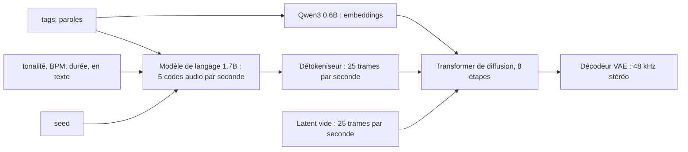

import { Tabs, TabItem } from '@astrojs/starlight/components';

Code : les workflows au format API dans [`audio/workflows/`](https://github.com/spareilleux/learn/tree/a5c8533c8411a80a382e94cadbd1d9bfe4d01777/code/comfyui/audio/workflows), les exécutions de cette leçon dans [`audio/runs/`](https://github.com/spareilleux/learn/tree/a5c8533c8411a80a382e94cadbd1d9bfe4d01777/code/comfyui/audio/runs), le pipeline [`pipeline.py`](https://github.com/spareilleux/learn/blob/a5c8533c8411a80a382e94cadbd1d9bfe4d01777/code/comfyui/audio/pipeline.py), les scripts de mesure [`analyze.py`](https://github.com/spareilleux/learn/blob/a5c8533c8411a80a382e94cadbd1d9bfe4d01777/code/comfyui/audio/analyze.py), [`measure.py`](https://github.com/spareilleux/learn/blob/a5c8533c8411a80a382e94cadbd1d9bfe4d01777/code/comfyui/audio/measure.py) et [`wer.py`](https://github.com/spareilleux/learn/blob/a5c8533c8411a80a382e94cadbd1d9bfe4d01777/code/comfyui/audio/wer.py), le validateur de workflows [`validate.py`](https://github.com/spareilleux/learn/blob/a5c8533c8411a80a382e94cadbd1d9bfe4d01777/code/comfyui/audio/validate.py), et les tests, tous exécutés par [`audio/check.sh`](https://github.com/spareilleux/learn/blob/a5c8533c8411a80a382e94cadbd1d9bfe4d01777/code/comfyui/audio/check.sh) et le workflow [`comfyui-audio.yml`](https://github.com/spareilleux/learn/blob/a5c8533c8411a80a382e94cadbd1d9bfe4d01777/.github/workflows/comfyui-audio.yml).

Les premières leçons généraient des images. Le cœur de ComfyUI génère aussi du son : de la musique avec paroles, des effets sonores, et la piste audio d'une vidéo. Le graphe est du même genre, avec un chargeur, un encodeur de texte, un latent vide, un échantillonneur et un décodeur VAE ; ce qui change, c'est ce que représente un latent et ce que l'encodeur de texte fait d'un prompt. Cette leçon lit cela dans le code source de la v0.36.0, fait tourner deux familles de modèles sur une RTX 5080, mesure ce qui en est sorti face à ce qui était demandé, puis regarde ce que le cœur ne fait pas, la parole, et ce qu'il faut pour l'ajouter.

Chaque extrait ci-dessous a été généré pour cette leçon et normalisé à −16 LUFS par le pipeline de la leçon. Sa légende donne le modèle, la seed, le workflow et la licence. Le cours a mesuré les extraits avec des scripts ; il ne les a pas jugés à l'oreille, et ni les mesures ni ce texte n'affirment qu'ils sonnent bien.

## Le type `AUDIO`

Les images circulent entre les nœuds sous forme de tenseurs ; le son aussi. Une valeur `AUDIO` est un dictionnaire Python à deux clés : `waveform`, un tenseur de flottants de forme `[batch, channels, samples]`, et `sample_rate`, un entier. En termes C#, c'est le `WaveFormat` de NAudio plus un `float[]` par canal ; en Java, un `AudioFormat` plus les échantillons d'un `AudioInputStream`, déjà décodés en flottants.

`LoadAudio` décode un fichier avec [PyAV](https://pyav.basswood-io.com/), les bindings FFmpeg dont ComfyUI a besoin, et lit donc tout ce que lit FFmpeg, y compris la piste audio d'une vidéo. Les échantillons entiers deviennent des flottants entre −1 et 1, et le nœud ajoute la dimension de batch ([`nodes_audio.py`, lignes 333 à 400](https://github.com/Comfy-Org/ComfyUI/blob/ee71d5c4993f29086b27fde1629a945ae48425bf/comfy_extras/nodes_audio.py#L333-L400)) :

```python
waveform, sample_rate = load(audio_path)
audio = {"waveform": waveform.unsqueeze(0), "sample_rate": sample_rate}
```

Sa liste de fichiers est le dossier d'entrée filtré par type de contenu, audio et vidéo ([ligne 364](https://github.com/Comfy-Org/ComfyUI/blob/ee71d5c4993f29086b27fde1629a945ae48425bf/comfy_extras/nodes_audio.py#L364)), et comme pour `LoadImage`, sa clé de cache est le SHA-256 du fichier ([lignes 384 à 390](https://github.com/Comfy-Org/ComfyUI/blob/ee71d5c4993f29086b27fde1629a945ae48425bf/comfy_extras/nodes_audio.py#L384-L390)) : remplacez le fichier, et l'exécution suivante le recharge.

Deux nœuds terminent un graphe :

- **`PreviewAudio`** écrit un fichier FLAC dans le dossier temporaire, sous un nom aléatoire `ComfyUI_temp_`, pour que le navigateur puisse le lire ([`_ui.py`, lignes 417 à 430](https://github.com/Comfy-Org/ComfyUI/blob/ee71d5c4993f29086b27fde1629a945ae48425bf/comfy_api/latest/_ui.py#L417-L430)).
- **`SaveAudioAdvanced`** écrit dans le dossier de sortie, en FLAC, MP3 ou Opus ([`nodes_audio.py`, lignes 251 à 296](https://github.com/Comfy-Org/ComfyUI/blob/ee71d5c4993f29086b27fde1629a945ae48425bf/comfy_extras/nodes_audio.py#L251-L296)). `SaveAudio`, `SaveAudioMP3` et `SaveAudioOpus` existent toujours, marqués comme dépréciés.

`SaveAudioAdvanced` a un *dynamic combo* : l'entrée `quality` n'existe que lorsque `format` vaut `mp3` ou `opus`. Au format API, une telle sous-entrée s'écrit avec un point, `"format.quality"`. Envoyé sans elle, un workflow avec `"format": "mp3"` revient du serveur CPU de la CI avec `Required input is missing: quality`, et avec `"format.quality": "nope"`, avec `Value not in list: format.quality: 'nope' not in ['V0', '128k', '320k']`. Les fichiers enregistrés portent aussi le workflow : `ffprobe` montre une balise `prompt` dans les fichiers FLAC et Opus, le même JSON que la leçon 3 trouvait dans les fichiers PNG.

La catégorie `audio` du cœur compte 15 nœuds, et ce sont des nœuds de plomberie : `LoadAudio`, `RecordAudio`, `PreviewAudio`, les quatre nœuds d'enregistrement, `EmptyAudio`, `TrimAudioDuration`, `SplitAudioChannels`, `JoinAudioChannels`, `AudioConcat`, `AudioMerge`, `AudioAdjustVolume` et `AudioEqualizer3Band`. Le workflow de la CI, [`15-cpu-empty-audio.api.json`](https://github.com/spareilleux/learn/blob/a5c8533c8411a80a382e94cadbd1d9bfe4d01777/code/comfyui/audio/workflows/15-cpu-empty-audio.api.json), en utilise trois pour enregistrer deux secondes de silence sans modèle.

## Latents : un VAE audio compresse le temps

Le VAE de la leçon 2 transforme une image 1024 × 1024 en un latent 128 × 128 à 4 ou 16 canaux. Un VAE audio fait la même chose le long du temps : une trame latente représente un nombre fixe d'échantillons, et le modèle de diffusion travaille sur la courte suite de trames, jamais sur les 48 000 échantillons de chaque seconde. Le cœur détecte quel VAE contient un fichier à partir des noms de ses tenseurs, dans [`sd.py`](https://github.com/Comfy-Org/ComfyUI/blob/ee71d5c4993f29086b27fde1629a945ae48425bf/comfy/sd.py#L697-L731), et les chiffres diffèrent selon le modèle :

| VAE | Fréquence d'échantillonnage | Échantillons par trame latente | Trames latentes par seconde | Canaux |
|---|---|---|---|---|
| Stable Audio Open 1.0 | 44.1 kHz | 2 048 | 21.5 | 64 |
| ACE-Step 1.5 | 48 kHz | 1 920 | 25 | 64 |
| Stable Audio 3 | 44.1 kHz | 4 096 | 10.8 | 256 |

Les nœuds de latent vide transforment des secondes en trames. `EmptyLatentAudio`, écrit pour Stable Audio Open 1.0, calcule `round((seconds * 44100 / 2048) / 2) * 2` trames de 64 canaux ([`nodes_audio.py`, lignes 31 à 34](https://github.com/Comfy-Org/ComfyUI/blob/ee71d5c4993f29086b27fde1629a945ae48425bf/comfy_extras/nodes_audio.py#L31-L34)) ; `EmptyAceStep1.5LatentAudio` calcule `round(seconds * 48000 / 1920)` ([`nodes_ace.py`, lignes 103 à 107](https://github.com/Comfy-Org/ComfyUI/blob/ee71d5c4993f29086b27fde1629a945ae48425bf/comfy_extras/nodes_ace.py#L103-L107)). Stable Audio 3 n'a pas de nœud à lui : son template utilise `EmptyLatentAudio`, et l'échantillonneur corrige la forme. Quand le latent est entièrement nul, `fix_empty_latent_channels` le répète jusqu'au nombre de canaux du modèle et remet sa longueur à l'échelle selon le rapport des deux tailles de trame, ici 2 048 / 4 096 ([`sample.py`, lignes 45 à 69](https://github.com/Comfy-Org/ComfyUI/blob/ee71d5c4993f29086b27fde1629a945ae48425bf/comfy/sample.py#L45-L69), appelé par `KSampler` à la [ligne 1574 de `nodes.py`](https://github.com/Comfy-Org/ComfyUI/blob/ee71d5c4993f29086b27fde1629a945ae48425bf/nodes.py#L1574)). Un latent qui n'est pas vide, issu de `VAEEncodeAudio`, n'est pas modifié.

Les fichiers de cette leçon concordent avec ce calcul, à une exception près. Des exécutions ACE-Step de 6, 10, 20, 30 et 40 secondes ont donné exactement 288 000, 480 000, 960 000, 1 440 000 et 1 920 000 échantillons. Des exécutions Stable Audio 3 de 3 et 10 secondes ont donné 131 072 et 442 368 échantillons, soit 32 et 108 trames de 4 096 ; une exécution de 4 secondes a donné 180 224 échantillons, 44 trames, là où la formule en donne 43. Le décodeur de Stable Audio 3 complète son entrée jusqu'à un multiple d'une taille de bloc ([`vae_sa3.py`, lignes 300 à 304](https://github.com/Comfy-Org/ComfyUI/blob/ee71d5c4993f29086b27fde1629a945ae48425bf/comfy/ldm/audio/vae_sa3.py#L300-L304)), ce qui expliquerait la trame en trop : *à vérifier*.

`VAEDecodeAudio` a une étape de plus qui compte quand on mesure le volume sonore : il divise la forme d'onde par cinq fois son écart type chaque fois que ce produit dépasse 1 ([`nodes_audio.py`, lignes 108 à 110](https://github.com/Comfy-Org/ComfyUI/blob/ee71d5c4993f29086b27fde1629a945ae48425bf/comfy_extras/nodes_audio.py#L108-L110)). Les sorties fortes sont atténuées ; les faibles restent telles quelles. C'est une sécurité contre l'écrêtage, pas une norme de volume : les extraits musicaux bruts de cette page mesuraient entre −11.4 et −21.2 LUFS, et une ambiance de pièce −39.9 LUFS, d'où la normalisation avec FFmpeg dans le pipeline à la fin de cette leçon.

## De la musique avec ACE-Step 1.5

### Quel ACE-Step

Le cœur v0.36.0 prend en charge deux générations d'[ACE-Step](https://github.com/ace-step/ACE-Step-1.5), un modèle musical d'ACE Studio et StepFun. La version 1.0 a `TextEncodeAceStepAudio` et `EmptyAceStepLatentAudio` ; la version 1.5 a `TextEncodeAceStepAudio1.5`, `EmptyAceStep1.5LatentAudio` et un `ReferenceTimbreAudio` expérimental pour les reprises ([`nodes_ace.py`](https://github.com/Comfy-Org/ComfyUI/blob/ee71d5c4993f29086b27fde1629a945ae48425bf/comfy_extras/nodes_ace.py)). Le template livré avec le cœur, `Text to Audio (ACE-Step 1.5)`, charge quatre fichiers de [Comfy-Org/ace_step_1.5_ComfyUI_files](https://huggingface.co/Comfy-Org/ace_step_1.5_ComfyUI_files/tree/694a9723ff772285c73f0700caacf944d3f02f8d) : le modèle de diffusion turbo, deux encodeurs de texte et le VAE. Le cours utilise les mêmes fichiers, sauf le second encodeur de texte : le modèle de langage 1.7B au lieu du 4B, ce qui économise 4.7 GB de téléchargement et de mémoire.

| Fichier | Rôle | Taille | SHA-256 |
|---|---|---|---|
| `acestep_v1.5_turbo.safetensors` | transformer de diffusion, 8 étapes | 4.79 GB | `3f6e0797…e422d7` |
| `qwen_0.6b_ace15.safetensors` | embeddings du texte et des paroles | 1.19 GB | `fd4590c8…aa7a7` |
| `qwen_1.7b_ace15.safetensors` | modèle de langage qui planifie l'audio | 3.71 GB | `ed63e924…ebd710` |
| `ace_1.5_vae.safetensors` | VAE audio, 48 kHz stéréo | 0.34 GB | `6de92e3a…cb2bb` |

Le dépôt amont, [ACE-Step/Ace-Step1.5](https://huggingface.co/ACE-Step/Ace-Step1.5/tree/19671f406d603126926c1b7e2adc169acbcade22), est sous licence MIT, et sa fiche dit « You can strictly use the generated music for commercial purposes » ; les fichiers réempaquetés portent Apache 2.0 sur Hugging Face. Aucune des deux licences ne restreint la publication des sorties ni l'endroit où elles sont utilisées, et la fiche indique que les données d'entraînement sont sous licence, libres de droits et synthétiques.

### Tags, paroles et métadonnées passent par un modèle de langage

`TextEncodeAceStepAudio1.5` a les entrées qu'on attend d'un prompt musical, `tags`, `lyrics`, `bpm`, `duration`, `timesignature`, `language` et `keyscale`, et d'autres plus inattendues : `seed`, `generate_audio_codes`, `cfg_scale`, `temperature`, `top_p`, `top_k` et `min_p` ([`nodes_ace.py`, lignes 31 à 61](https://github.com/Comfy-Org/ComfyUI/blob/ee71d5c4993f29086b27fde1629a945ae48425bf/comfy_extras/nodes_ace.py#L31-L61)). Ce sont les réglages d'un modèle de langage, et le tokenizer montre ce qui se passe ([`ace15.py`, lignes 208 à 274](https://github.com/Comfy-Org/ComfyUI/blob/ee71d5c4993f29086b27fde1629a945ae48425bf/comfy/text_encoders/ace15.py#L208-L274)) :

- La tonalité, le tempo, la signature rythmique et la durée deviennent du texte. Ils sont écrits en YAML dans un bloc `<think>` d'un prompt de chat pour le modèle de langage, et sous forme de liste `# Metas` pour le modèle d'embeddings :

  ```python
  lm_template = "<|im_start|>system\n# Instruction\nGenerate audio semantic tokens based on the given conditions:\n\n<|im_end|>\n<|im_start|>user\n# Caption\n{}\n\n# Lyric\n{}\n<|im_end|>\n<|im_start|>assistant\n{}\n\n<|im_end|>\n"
  ```

- Le modèle de langage génère ensuite des *codes audio*, cinq par seconde de musique : `tokens_duration = duration * 5`, utilisé à la fois comme nombre minimal et maximal de tokens ([lignes 226 à 230](https://github.com/Comfy-Org/ComfyUI/blob/ee71d5c4993f29086b27fde1629a945ae48425bf/comfy/text_encoders/ace15.py#L226-L230)). La boucle d'échantillonnage est celle de n'importe quel modèle de chat : logits restreints à la plage des tokens audio, guidance sans classifieur entre le prompt et un prompt négatif au bloc `<think>` vide, température, top-k, top-p, et un `torch.Generator` initialisé avec la `seed` du nœud ([lignes 30 à 140](https://github.com/Comfy-Org/ComfyUI/blob/ee71d5c4993f29086b27fde1629a945ae48425bf/comfy/text_encoders/ace15.py#L30-L140)).
- Le modèle 0.6B produit les embeddings de la description et, séparément, des paroles ([lignes 323 à 339](https://github.com/Comfy-Org/ComfyUI/blob/ee71d5c4993f29086b27fde1629a945ae48425bf/comfy/text_encoders/ace15.py#L323-L339)).

Dans le modèle de diffusion, un détokeniseur développe chaque code audio en cinq trames, de 5 à 25 trames par seconde, la cadence du latent du VAE, et ces trames sont les « indices » autour desquels le transformer débruite ([`ace_step15.py`, lignes 1077 à 1112](https://github.com/Comfy-Org/ComfyUI/blob/ee71d5c4993f29086b27fde1629a945ae48425bf/comfy/ldm/ace/ace_step15.py#L1077-L1112)). Avec `generate_audio_codes` désactivé, aucun plan n'est généré, et le modèle part à la place d'un latent de silence intégré ([`model_base.py`, lignes 2516 à 2553](https://github.com/Comfy-Org/ComfyUI/blob/ee71d5c4993f29086b27fde1629a945ae48425bf/comfy/model_base.py#L2516-L2553)).



Cela compte pour ce que vous pouvez attendre. Rien dans le graphe n'impose une tonalité ou un tempo : `C major` et `90` sont des mots dans un prompt, que le modèle de langage a été entraîné à suivre. Les mesures ci-dessous vérifient à quel point il y parvient.

Le graphe est celui du template, au format API : [`15-ace-step.api.json`](https://github.com/spareilleux/learn/blob/a5c8533c8411a80a382e94cadbd1d9bfe4d01777/code/comfyui/audio/workflows/15-ace-step.api.json). `ModelSamplingAuraFlow` règle le décalage du flow matching à 3, et `KSampler` exécute 8 étapes d'`euler` à CFG 1, parce que le modèle turbo a été distillé pour se passer de guidance. Le conditionnement négatif est le positif mis à zéro par `ConditioningZeroOut`. La seed est réglée deux fois, sur l'encodeur de texte pour les codes audio et sur `KSampler` pour le bruit ; les exécutions de cette leçon leur donnent toujours la même valeur.

### L'exécuter, et combien de temps cela prend

Les 21 exécutions sont dans [`runs/ace-step.json`](https://github.com/spareilleux/learn/blob/a5c8533c8411a80a382e94cadbd1d9bfe4d01777/code/comfyui/audio/runs/ace-step.json), chacune étant une liste de modifications `--set node.input=value` du workflow, et `pipeline.py batch` les a mises en file l'une après l'autre sur un ComfyUI démarré avec son propre dossier de base. Sur la RTX 5080, avec 12.3 GB de VRAM libres au début du lot, le journal du serveur indique :

- La première exécution a pris 38.8 s, surtout du chargement : les deux encodeurs de texte ont été préparés sur 4 672 MB, le modèle de diffusion sur 4 564 MB, et le VAE chargé sur 321.7 MB, avec le chargement dynamique en VRAM de ComfyUI.
- Un extrait de 20 secondes a ensuite pris 4.3 à 4.5 s, un extrait de 10 secondes 3.2 s, et un extrait de 40 secondes 8.5 s.
- Le même extrait de 20 secondes sans codes audio a pris 1.9 s : la planification du modèle de langage représente plus de la moitié du temps.

### Seed, durée, tags, paroles

La boucle dont partent les mesures suivantes demande `solo acoustic guitar loop, fingerpicked, warm, dry studio recording, instrumental`, les paroles `[Instrumental]`, `C major`, 90 BPM, 4/4, 20 secondes, seed 1.

<audio controls preload="none" src="../../../comfyui/audio/15-loop-c-seed1.mp3"></audio>

*Généré par ComfyUI v0.36.0 : ACE-Step 1.5 turbo avec Qwen3 0.6B et 1.7B, seed 1, 8 étapes, `euler`, `simple`, CFG 1, décalage 3, exécution `loop-c-seed1` de `runs/ace-step.json`, workflow [`15-ace-step.api.json`](https://github.com/spareilleux/learn/blob/a5c8533c8411a80a382e94cadbd1d9bfe4d01777/code/comfyui/audio/workflows/15-ace-step.api.json). Licence MIT. Normalisé à −16 LUFS, MP3 à 96 kb/s.*

[`measure.py`](https://github.com/spareilleux/learn/blob/a5c8533c8411a80a382e94cadbd1d9bfe4d01777/code/comfyui/audio/measure.py) lit chaque fichier FLAC enregistré et affiche son format, une empreinte de ses échantillons et son pic. Pour les exécutions ACE-Step, il compare aussi la tonalité et le tempo demandés avec ce qu'entend [`analyze.py`](https://github.com/spareilleux/learn/blob/a5c8533c8411a80a382e94cadbd1d9bfe4d01777/code/comfyui/audio/analyze.py). La tonalité est l'estimation de Krumhansl-Kessler : le chroma moyen de l'extrait, calculé avec `chroma_cqt` de [librosa](https://librosa.org/doc/latest/index.html), corrélé avec les 24 profils de tonalités majeures et mineures ; `r` est la meilleure corrélation. Le tempo est le `beat_track` de librosa. Un extrait synthétique C-F-G-C à 120 BPM, que construisent les tests, ressort en C major avec r = 0.97 et 117.5 BPM.

```text
$ python measure.py runs/ace-step.json G:/learn-lab/comfyui/audio/runs/ace
loop-c-seed1: 48000 Hz, 2 ch, 20.00 s, samples 3a0f4dc422dd21cc, peak 1.00 | asked C major, 90 BPM; heard C major (r=0.66), 92.3 BPM | key yes, tempo ratio 1.03
loop-c-seed1-again: 48000 Hz, 2 ch, 20.00 s, samples 3a0f4dc422dd21cc, peak 1.00 | asked C major, 90 BPM; heard C major (r=0.66), 92.3 BPM | key yes, tempo ratio 1.03
loop-c-seed2: 48000 Hz, 2 ch, 20.00 s, samples 06a7e133106ce1ce, peak 0.90 | asked C major, 90 BPM; heard G major (r=0.49), 161.5 BPM | key no, tempo ratio 1.79
loop-c-seed3: 48000 Hz, 2 ch, 20.00 s, samples b13fe842c3eef028, peak 1.00 | asked C major, 90 BPM; heard C major (r=0.42), 60.1 BPM | key yes, tempo ratio 0.67
loop-c-10s: 48000 Hz, 2 ch, 10.00 s, samples 388373d59bbef315, peak 0.77 | asked C major, 90 BPM; heard G major (r=0.67), 95.7 BPM | key no, tempo ratio 1.06
loop-c-40s: 48000 Hz, 2 ch, 40.00 s, samples 1ab6165dd90985c5, peak 1.00 | asked C major, 90 BPM; heard A minor (r=0.41), 89.1 BPM | key relative, tempo ratio 0.99
loop-c-no-codes: 48000 Hz, 2 ch, 20.00 s, samples ef78ea83a483aef3, peak 1.00 | asked C major, 90 BPM; heard C major (r=0.69), 89.1 BPM | key yes, tempo ratio 0.99
loop-tags-rock: 48000 Hz, 2 ch, 20.00 s, samples bc707dd2c2b04877, peak 1.00 | asked C major, 90 BPM; heard C major (r=0.66), 89.1 BPM | key yes, tempo ratio 0.99
```

Ce que montrent ces lignes :

- **Même seed, mêmes échantillons, mais pas pour la raison qu'on croit.** `loop-c-seed1-again` a la même empreinte, mais le journal du serveur indique qu'elle s'est exécutée en 0.06 s : toutes les entrées des nœuds étaient identiques sauf le préfixe du nom de fichier, donc ComfyUI a réutilisé son cache et seul le nœud d'enregistrement a tourné. Le vrai test est un serveur neuf. Arrêté, redémarré et soumis aux deux mêmes exécutions, il a produit les mêmes empreintes d'échantillons, `3a0f4dc422dd21cc` pour la boucle et `f892c13bf2b0f920` pour le jingle plus bas. C'était sur un seul GPU avec un seul pilote ; d'un GPU à l'autre, les réserves de la leçon 2 s'appliquent : *à vérifier*.
- **Une autre seed, un autre morceau.** La seed 2 a été entendue en G major, la dominante de C, et la seed 3 en C major avec une corrélation plus faible. La seed pilote l'échantillonnage des codes audio par le modèle de langage et le bruit de diffusion, elle change donc plus que la texture.
- **La durée change aussi le morceau.** 10 secondes de la seed 1 ne sont pas la première moitié de 20 secondes de la seed 1 : le modèle de langage écrit 50 codes au lieu de 100, et la tonalité est sortie en G major. À 40 secondes, l'estimation a été A minor, le relatif mineur de C, avec un r faible.
- **Sans codes audio**, le résultat était encore C major à 89 BPM, la plus proche de la demande des trois boucles, en moins de la moitié du temps. Sur un seul extrait, cela ne dit rien de général.
- **D'autres tags, même tonalité et même tempo.** `loop-tags-rock` a gardé la tonalité, le tempo et la seed et a changé les tags en `distorted electric guitar riff, heavy rock, drums, instrumental`. La tonalité et le tempo ont été tenus ; les scripts ne peuvent pas dire si l'extrait sonne rock.

<audio controls preload="none" src="../../../comfyui/audio/15-loop-c-seed2.mp3"></audio>

*Généré par ComfyUI v0.36.0 : le même workflow et le même prompt, seed 2, exécution `loop-c-seed2`. Entendu en G major à 161.5 BPM. Licence MIT. Normalisé à −16 LUFS, MP3 à 96 kb/s.*

<audio controls preload="none" src="../../../comfyui/audio/15-loop-c-no-codes.mp3"></audio>

*Généré par ComfyUI v0.36.0 : le même workflow et le même prompt, seed 1, `generate_audio_codes` à false, exécution `loop-c-no-codes`. Licence MIT. Normalisé à −16 LUFS, MP3 à 96 kb/s.*

<audio controls preload="none" src="../../../comfyui/audio/15-loop-tags-rock.mp3"></audio>

*Généré par ComfyUI v0.36.0 : le même workflow, seed 1, C major, 90 BPM, tags `distorted electric guitar riff, heavy rock, drums, instrumental`, exécution `loop-tags-rock`. Licence MIT. Normalisé à −16 LUFS, MP3 à 96 kb/s.*

### Tonalité et tempo, huit demandes

Le balayage garde les tags de la boucle et la seed 1, et change la tonalité et le tempo :

| Demandé | Tonalité entendue | r | Tempo entendu | Tonalité | Rapport de tempo |
|---|---|---|---|---|---|
| C major, 90 BPM | C major | 0.66 | 92.3 | oui | 1.03 |
| C major, 70 BPM | G major | 0.72 | 143.6 | non | 2.05 |
| E minor, 100 BPM | E minor | 0.65 | 66.3 | oui | 0.66 |
| A major, 140 BPM | A major | 0.86 | 143.6 | oui | 1.03 |
| F# minor, 80 BPM | F# minor | 0.49 | 80.7 | oui | 1.01 |
| Bb major, 120 BPM | F# major | 0.43 | 117.5 | non | 0.98 |
| D minor, 60 BPM | D minor | 0.74 | 117.5 | oui | 1.96 |
| G major, 160 BPM | G major | 0.59 | 83.4 | oui | 0.52 |
| Eb major, 95 BPM | F# major | 0.50 | 95.7 | non | 1.01 |

Sur les 20 exécutions musicales distinctes de la leçon (la répétition servie par le cache mise à part), l'estimation de tonalité a correspondu à la demande 12 fois, a trouvé le relatif mineur une fois et a manqué 7 fois. L'estimation de tempo était à moins de 7 % de la demande 12 fois ; 7 fois, elle était proche du double, de la moitié ou des deux tiers, y compris pour la chanson plus bas, et une fois elle était sans rapport, 1.79 fois la demande pour la seed 2. Un détecteur de pulsation se cale souvent sur la moitié ou le double du tempo qu'un musicien compterait, donc un rapport de 2 ou 0.5 est aussi probablement l'erreur de l'estimateur que celle du modèle ; le cours n'a pas compté les temps à l'oreille, et les rapports proches de 2 restent *à vérifier*. Les deux échecs dans des tonalités à bémols, Bb et Eb major, tous deux entendus en F# major, sont le motif qui ressort, sur une seed chacun.

### Les exemples Guitar Alchemist, et un échec

Un **jingle** d'introduction de leçon : `short cheerful intro jingle for an online guitar lesson, bright acoustic guitar strum, glockenspiel, handclaps, ends on a clear final chord, instrumental`, G major, 110 BPM, 6 secondes. Les seeds 1 et 2 ont toutes deux été entendues en G major à 112.3 BPM, avec r = 0.87 et 0.51.

<audio controls preload="none" src="../../../comfyui/audio/15-jingle-seed1.mp3"></audio>

*Généré par ComfyUI v0.36.0 : ACE-Step 1.5 turbo, seed 1, G major, 110 BPM, 6 s, exécution `jingle-seed1`, workflow [`15-ace-step.api.json`](https://github.com/spareilleux/learn/blob/a5c8533c8411a80a382e94cadbd1d9bfe4d01777/code/comfyui/audio/workflows/15-ace-step.api.json). Licence MIT. Normalisé à −16 LUFS, MP3 à 96 kb/s.*

Une **chanson** avec des paroles originales sur la construction d'un accord, `gentle folk song, acoustic guitar, soft female vocals, intimate`, D major, 80 BPM, 30 secondes :

```text
[verse]
Find the root and then the third
Stack a fifth and hear the chord
[chorus]
One, four, five, and home again
```

Elle a été entendue en D major avec r = 0.87, et à 152 BPM, près du double de la demande. [Whisper](https://github.com/SYSTRAN/faster-whisper) large-v3, le transcripteur de la section sur la parole plus bas, a entendu « Find the root and then the third Stack a fifth and hear the chord Four and five and home » : le couplet est intact, et le refrain a perdu « One » et « again », un taux d'erreur de 3 mots sur 20.

<audio controls preload="none" src="../../../comfyui/audio/15-song-lyrics.mp3"></audio>

*Généré par ComfyUI v0.36.0 : ACE-Step 1.5 turbo, seed 1, D major, 80 BPM, 30 s, paroles ci-dessus, exécution `song-lyrics`. La voix est celle du modèle ; aucune voix de chanteur réel n'a été demandée. Licence MIT. Normalisé à −16 LUFS, MP3 à 96 kb/s.*

Un **ii-V-I jazz**, c'est là que cela a échoué. Les tags étaient `jazz guitar trio playing a ii-V-I progression, Dm7 G7 Cmaj7, medium swing, clean archtop guitar, upright bass, brushes on snare, instrumental`, C major, 120 BPM, 20 secondes. `measure.py --chords` étiquette chaque mesure avec le plus proche de 60 modèles d'accords (majeur, mineur, 7, maj7 et m7 sur 12 fondamentales), les mesures étant comptées à partir du détecteur de pulsation :

```text
jazz-251-seed1: 48000 Hz, 2 ch, 20.00 s, samples c3e2218b5183858c, peak 1.00 | asked C major, 120 BPM; heard D major (r=0.36), 123.0 BPM | key no, tempo ratio 1.03
      1.04 s  G      r=0.38
      3.04 s  C#maj7 r=0.57
      5.04 s  C#maj7 r=0.50
      7.04 s  Dm     r=0.66
      9.03 s  Bbmaj7 r=0.40
     11.05 s  Ab     r=0.59
     13.05 s  C#maj7 r=0.64
     15.05 s  Bm     r=0.57
jazz-251-seed2: 48000 Hz, 2 ch, 20.00 s, samples 3b84301e70e82c49, peak 1.00 | asked C major, 120 BPM; heard F minor (r=0.34), 60.1 BPM | key no, tempo ratio 0.50
      0.98 s  C      r=0.37
      4.97 s  Dm7    r=0.29
      8.99 s  Fm7    r=0.60
```

Aucune des deux seeds ne montre un cycle Dm7, G7, Cmaj7, et les deux corrélations de tonalité sont les plus faibles de la leçon, ce que donne une harmonie qui ne se pose pas dans une seule tonalité. Les étiquettes d'accords elles-mêmes sont une preuve faible : sur l'extrait synthétique C-F-G-C, dont les tests connaissent les accords, les mesures sont sorties décalées et étiquetées `Cmaj7`, `C`, `Fmaj7`, `G7`, donc prenez-les comme un indice. Ce qu'on peut dire, c'est qu'une grille d'accords écrite dans les tags n'a pas été suivie comme une grille, en deux essais sur deux. Les tags sont une description pour un modèle de langage, pas une partition : ACE-Step 1.5 prend une tonalité, un tempo et une signature rythmique, et rien dans ses entrées n'est un accord.

<audio controls preload="none" src="../../../comfyui/audio/15-jazz-251-seed1.mp3"></audio>

*Généré par ComfyUI v0.36.0 : ACE-Step 1.5 turbo, seed 1, C major, 120 BPM, 20 s, exécution `jazz-251-seed1`. La grille demandée n'est pas celle qu'a trouvée l'analyse. Licence MIT. Normalisé à −16 LUFS, MP3 à 96 kb/s.*

## Effets sonores avec Stable Audio 3

Le cœur a deux familles Stable Audio. [Stable Audio Open 1.0](https://huggingface.co/stabilityai/stable-audio-open-1.0) se conditionne sur un encodeur de texte T5 et sur deux nombres, `seconds_start` et `seconds_total`, réglés par `ConditioningStableAudio`. Stable Audio 3, dont Comfy-Org a réempaqueté les fichiers dans [Comfy-Org/stable-audio-3](https://huggingface.co/Comfy-Org/stable-audio-3/tree/96fc663283cde94cb631bc84f6c9ece7bbe2bf25), utilise un encodeur de texte [T5Gemma](https://huggingface.co/google/t5gemma-b-b-ul2) et seulement `seconds_total`, que le modèle calcule à partir de la longueur du latent quand aucun nœud ne le règle : `int(noise.shape[-1] / 10.7666)`, le nombre de trames divisé par le nombre de trames par seconde ([`model_base.py`, lignes 877 à 906](https://github.com/Comfy-Org/ComfyUI/blob/ee71d5c4993f29086b27fde1629a945ae48425bf/comfy/model_base.py#L877-L906)). Le cœur livre deux templates pour le modèle medium de 9.2 GB. Le cours utilise les deux petits modèles, [l'un entraîné pour les effets sonores](https://huggingface.co/stabilityai/stable-audio-3-small-sfx/tree/ae12755283df9d62ca39a9b050a39a0b607b8c20) et [l'autre pour la musique](https://huggingface.co/stabilityai/stable-audio-3-small-music/tree/0fef1392cd842149a2b6d445e181c97608faac06), de 2.27 GB chacun, avec le même encodeur de texte :

| Fichier | Taille | SHA-256 |
|---|---|---|
| `stable_audio_3_small_sfx.safetensors` | 2.27 GB | `ed9cf1b6…2e515` |
| `stable_audio_3_small_music.safetensors` | 2.27 GB | `da85866b…4b64` |
| `t5gemma_b_b_ul2.safetensors` | 1.19 GB | `1e1eba25…150e` |

Le fichier de l'encodeur de texte n'est pas celui de Google : `google/t5gemma-b-b-ul2` publie un fichier d'une autre empreinte, et celui de Comfy-Org en est une conversion.

Le graphe, [`15-stable-audio-sfx.api.json`](https://github.com/spareilleux/learn/blob/a5c8533c8411a80a382e94cadbd1d9bfe4d01777/code/comfyui/audio/workflows/15-stable-audio-sfx.api.json), est celui du template sans sa branche d'écriture du prompt : `CheckpointLoaderSimple` pour le modèle et son VAE, `CLIPLoader` de type `stable_audio` pour T5Gemma, deux `CLIPTextEncode`, `EmptyLatentAudio`, et `KSampler` avec 8 étapes de `lcm` à CFG 1, comme le template le règle pour ces modèles post-entraînés de façon adversariale.

### Deux licences

Les poids sont sous la [Stability AI Community License](https://huggingface.co/stabilityai/stable-audio-3-small-sfx/blob/ae12755283df9d62ca39a9b050a39a0b607b8c20/LICENSE.md), datée du 5 juillet 2024, le même fichier dans les trois dépôts Stable Audio 3, et l'encodeur de texte sous les [Gemma Terms of Use](https://ai.google.dev/gemma/terms), modifiées pour la dernière fois le 1er avril 2026. Ce qu'elles disent des sorties, mot pour mot :

- Stability, section IV.c.(iii) : « As between You and Stability AI, You own any outputs generated from the Models or Derivative Works to the extent permitted by applicable law. » Sa définition des Derivative Works se termine par « but do not include the output of any Model. »
- Stability, section III, pour l'usage commercial : « If at any time You or Your Affiliate(s), either individually or in aggregate, generate more than USD $1,000,000 in annual revenue (…), any licenses granted to You under this Agreement shall terminate as of such date. » L'usage commercial exige aussi de s'enregistrer auprès de Stability AI.
- Stability, section IV.a, seulement si vous distribuez les modèles ou un produit qui les utilise : une copie de l'accord, un fichier « Notice », et la mention « Powered by Stability AI » affichée. Les deux licences sont accordées « worldwide » (Stability, sections II et III) ; les conditions de Gemma n'ont pas de clause territoriale.
- Stability, section IV.b : les sorties ne peuvent pas servir « to create or improve any foundational generative AI model ».
- Gemma, section 3.3 : « Google claims no rights in Outputs you generate using Gemma. You and your users are solely responsible for Outputs and their subsequent uses. »

Publier les extraits de cette leçon sur un site public est permis par les deux. Le site ne distribue aucun poids, donc les obligations de notice et de « Powered by Stability AI » ne s'appliquent pas ; chaque extrait indique tout de même quel modèle l'a produit.

### Un médiator, un grincement de frette, une pièce

[`runs/stable-audio.json`](https://github.com/spareilleux/learn/blob/a5c8533c8411a80a382e94cadbd1d9bfe4d01777/code/comfyui/audio/runs/stable-audio.json) contient sept exécutions. La première a pris 11.8 s avec le chargement, l'encodeur de texte préparé sur 537 MB, le modèle sur 875 MB et le VAE sur 406 MB ; les suivantes ont pris 0.5 à 0.9 s chacune. Le volume sonore brut, d'après la première passe de `loudnorm` de FFmpeg :

| Exécution | Prompt | Durée | Pic | Volume sonore |
|---|---|---|---|---|
| `pick-seed1` | a single guitar pick plucking one steel acoustic guitar string, close microphone, dry | 4.09 s | 0.41 | −29.2 LUFS |
| `pick-seed2` | le même, seed 2 | 4.09 s | 0.32 | −30.1 LUFS |
| `fret-squeak` | fingers sliding along wound acoustic guitar strings, fret squeak, close microphone | 2.97 s | 0.17 | −27.2 LUFS |
| `studio-room` | quiet recording studio room tone, soft air conditioning hum, distant muffled footsteps | 10.03 s | 0.14 | −39.9 LUFS |

<audio controls preload="none" src="../../../comfyui/audio/15-pick-seed1.mp3"></audio>

*Généré par ComfyUI v0.36.0 : Stable Audio 3 small SFX avec T5Gemma, seed 1, 8 étapes, `lcm`, `simple`, CFG 1, 4 s, exécution `pick-seed1` de `runs/stable-audio.json`, workflow [`15-stable-audio-sfx.api.json`](https://github.com/spareilleux/learn/blob/a5c8533c8411a80a382e94cadbd1d9bfe4d01777/code/comfyui/audio/workflows/15-stable-audio-sfx.api.json). Stability AI Community License et Gemma Terms of Use. Normalisé par le pipeline, à −17.7 LUFS (voir l'exercice 3), MP3 à 96 kb/s.*

<audio controls preload="none" src="../../../comfyui/audio/15-fret-squeak.mp3"></audio>

*Généré par ComfyUI v0.36.0 : Stable Audio 3 small SFX, seed 1, 3 s, exécution `fret-squeak`. Stability AI Community License et Gemma Terms of Use. Normalisé à −16.9 LUFS, MP3 à 96 kb/s.*

<audio controls preload="none" src="../../../comfyui/audio/15-studio-room.mp3"></audio>

*Généré par ComfyUI v0.36.0 : Stable Audio 3 small SFX, seed 1, 10 s, exécution `studio-room`. Stability AI Community License et Gemma Terms of Use. Remonté de −39.9 à −16.7 LUFS par le pipeline, donc son souffle est 23 dB plus fort que généré ; une ambiance de pièce est censée rester bien en dessous de la musique. MP3 à 96 kb/s.*

Le modèle musical prend son tempo et sa tonalité dans le prompt, en texte. `acoustic guitar loop, 100 BPM, C major, fingerpicked`, 10 secondes, a donné C major (r = 0.90) à 99.4 BPM avec la seed 1, et C major (r = 0.93) à 136.0 BPM avec la seed 2. Le même prompt sur le modèle d'effets sonores a donné G major (r = 0.80) à 99.4 BPM.

<audio controls preload="none" src="../../../comfyui/audio/15-music-loop-100.mp3"></audio>

*Généré par ComfyUI v0.36.0 : Stable Audio 3 small music avec T5Gemma, seed 1, 10 s, exécution `music-loop-100`, workflow [`15-stable-audio-sfx.api.json`](https://github.com/spareilleux/learn/blob/a5c8533c8411a80a382e94cadbd1d9bfe4d01777/code/comfyui/audio/workflows/15-stable-audio-sfx.api.json) avec `ckpt_name` modifié. Stability AI Community License et Gemma Terms of Use. Normalisé à −16.4 LUFS, MP3 à 96 kb/s.*

## Du son pour une vidéo

Deux éléments du cœur v0.36.0 touchent au son des vidéos, et aucun n'a été exécuté pour cette leçon.

- **LTX-2.x génère la vidéo et l'audio ensemble.** `LTXVEmptyLatentAudio` dimensionne un latent audio à partir d'un nombre d'images vidéo et d'une cadence, `LTXVAudioVAEDecode` le transforme en `AUDIO`, et la classe de modèle `LTXAV` débruite les deux ([`nodes_lt_audio.py`](https://github.com/Comfy-Org/ComfyUI/blob/ee71d5c4993f29086b27fde1629a945ae48425bf/comfy_extras/nodes_lt_audio.py#L93-L166)). Son VAE audio travaille sur un spectrogramme mel et se termine par un vocodeur ([`audio_vae.py`](https://github.com/Comfy-Org/ComfyUI/blob/ee71d5c4993f29086b27fde1629a945ae48425bf/comfy/ldm/lightricks/vae/audio_vae.py)). Le template `Text to Video (LTX-2.5)` du cœur demande un transformer de 21.5 GB et un encodeur de texte de 15.4 GB, tous deux quantifiés en int8, soit plus que ce que les 16 GB de VRAM de cette machine contiennent à la fois et plus que ce que le cours télécharge sans demander. La [LTX-2.x Community License](https://github.com/Lightricks/LTX-2/blob/a95ab856bf29407b6b066ede0abe1846050db56c/LICENSE-2_x), datée du 11 août 2026, permet de publier les sorties (« Licensor claims no rights in the Output you generate using LTX-2.x », section 5), et exige une licence payante des entités dont le chiffre d'affaires annuel atteint 10 000 000 $. Si LTX-2.5 tient dans 16 GB avec du déchargement, et ce que vaut son son : *à vérifier*.
- **Le VAE de MMAudio est là, MMAudio non.** [`comfy/ldm/mmaudio`](https://github.com/Comfy-Org/ComfyUI/tree/ee71d5c4993f29086b27fde1629a945ae48425bf/comfy/ldm/mmaudio) ne contient qu'un VAE et un vocodeur BigVGAN, que `sd.py` charge pour un modèle à 16 kHz ([lignes 905 à 921](https://github.com/Comfy-Org/ComfyUI/blob/ee71d5c4993f29086b27fde1629a945ae48425bf/comfy/sd.py#L905-L921)), et le VAE audio de LTX lui emprunte sa classe de distribution gaussienne. Aucun nœud n'échantillonne un modèle vidéo-vers-audio avec lui. Quel modèle utilise ce VAE dans le cœur, s'il y en a un : *à vérifier*.

Sans l'un ni l'autre, le son d'une vidéo dans le cœur, ce sont les images de la leçon sur la vidéo plus un graphe audio séparé : générez un extrait de la durée de la vidéo avec ACE-Step ou Stable Audio, et assemblez les deux avec FFmpeg.

## La parole : absente du cœur

Il n'y a pas de modèle local de synthèse vocale dans ComfyUI v0.36.0. Démarré avec `--disable-api-nodes`, le serveur liste 666 types de nœuds dans `/object_info`, et aucun de leurs noms ni de leurs noms d'affichage ne contient « speech », « TTS » ou « voice » ; les 15 nœuds de la catégorie `audio` sont la plomberie listée au début de cette leçon. Les modèles musicaux du cœur savent chanter des paroles, ce qui n'est pas la même chose.

Les nœuds de parole qui existent sont des *nœuds API*, qui envoient votre texte à un service payant et téléchargent le résultat : `ElevenLabsTextToSpeech` ([`nodes_elevenlabs.py`, ligne 240](https://github.com/Comfy-Org/ComfyUI/blob/ee71d5c4993f29086b27fde1629a945ae48425bf/comfy_api_nodes/nodes_elevenlabs.py#L240)), `FishAudioTextToSpeech` ([`nodes_fishaudio.py`, ligne 185](https://github.com/Comfy-Org/ComfyUI/blob/ee71d5c4993f29086b27fde1629a945ae48425bf/comfy_api_nodes/nodes_fishaudio.py#L185)) et `HeyGenTextToSpeechNode` ([`nodes_heygen.py`, ligne 696](https://github.com/Comfy-Org/ComfyUI/blob/ee71d5c4993f29086b27fde1629a945ae48425bf/comfy_api_nodes/nodes_heygen.py#L696)), avec des nœuds de clonage de voix à côté. Ils demandent un compte Comfy avec des crédits, et ce sont eux qui justifient l'existence de [`--disable-api-nodes`](https://github.com/Comfy-Org/ComfyUI/blob/ee71d5c4993f29086b27fde1629a945ae48425bf/comfy/cli_args.py#L216). Pour de la parole locale, il faut un pack de nœuds personnalisés, et les règles de la leçon 11 s'appliquent.

### Choisir et lire un pack

Le cours a choisi [comfyui-kokoro](https://github.com/stavsap/comfyui-kokoro/tree/cfb59b5605b351e196182c836f0b48c1a784e52f), 66 étoiles GitHub, Apache 2.0, épinglé sur son dernier commit du 23 février 2026. Il enveloppe [Kokoro-82M](https://huggingface.co/hexgrad/Kokoro-82M), un modèle de 82 millions de paramètres sous Apache 2.0, au moyen de [kokoro-onnx](https://github.com/thewh1teagle/kokoro-onnx), qui l'exécute avec [ONNX Runtime](https://onnxruntime.ai/). Il est assez petit pour être lu en entier : un `__init__.py` de deux lignes et un fichier Python de 291 lignes.

L'audit de la leçon 11, avant l'installation :

```text
$ python code/comfyui/custom-nodes/audit/audit.py comfyui-kokoro --details 40
== comfyui-kokoro: 16 files, 2 Python, 0 JavaScript, web folder: no
   autorun            2  file that runs without being asked
                        __init__.py  imported by ComfyUI at every start
                        requirements.txt  installed with pip by ComfyUI-Manager
   network            2  network call (urllib, requests, httpx, aiohttp client, socket)
                        ComfyUIKokoro.py:97  with requests.get(url, stream=True, allow_redirects=True) as response:
                        ComfyUIKokoro.py:122  r = requests.get(url)
```

La lecture du code et des dépendances ajoute ce que les compteurs ne peuvent pas dire :

- **À l'import**, le fichier importe NumPy, PyTorch, `kokoro_onnx`, `requests` et `tqdm`, et définit trois classes. Rien ne s'exécute.
- **À la première exécution**, chaque nœud appelle `download_model` et `download_voices` ([`ComfyUIKokoro.py`, lignes 96 à 137](https://github.com/stavsap/comfyui-kokoro/blob/cfb59b5605b351e196182c836f0b48c1a784e52f/ComfyUIKokoro.py#L96-L137)). Le modèle vient d'une release d'un fork, `github.com/taylorchu/kokoro-onnx/releases/download/v0.2.0/kokoro.onnx`, pas des releases de kokoro-onnx lui-même ; les 54 voix viennent de `hexgrad/Kokoro-82M` sur la branche `main`, pas d'un commit épinglé. Aucun des deux téléchargements n'est vérifié par une empreinte, et les deux sont écrits dans le propre dossier du pack. Les voix sont lues avec `torch.load(content, weights_only=True)`, le mode sûr de la leçon 11.
- **Le fichier du fork est le fichier officiel.** Téléchargés des deux façons, `kokoro.onnx` du fork et `kokoro-v1.0.onnx` de la release `model-files-v1.0` de kokoro-onnx ont les mêmes 325 532 387 octets et le même SHA-256, `7d5df8ec…36a6c5`. C'était vrai le 17 septembre 2026 ; rien n'empêche un fichier de release de changer.
- **Les dépendances ne sont pas épinglées** : `kokoro-onnx`, `onnxruntime`, `numpy`, `requests`, `tqdm`. Le 17 septembre 2026, elles se résolvaient en kokoro-onnx 0.6.1 (MIT), onnxruntime 1.30.0, phonemizer 3.4.0 et espeakng-loader 0.2.4. Ce dernier embarque une bibliothèque [eSpeak NG](https://github.com/espeak-ng/espeak-ng) précompilée et ses données, que phonemizer charge pour transformer le texte en phonèmes. eSpeak NG est sous GPL 3.0, ce qui compte si vous redistribuez une installation, pas pour l'audio qu'il produit.
- **kokoro-onnx** lit les voix avec `np.load(voices_path)`, dont le comportement par défaut refuse les pickles, et ne fait aucun appel réseau ; ses seules URL sont dans des messages d'erreur.
- **Les voix sont des enregistrements de personnes.** Le [`VOICES.md`](https://huggingface.co/hexgrad/Kokoro-82M/blob/f3ff3571791e39611d31c381e3a41a3af07b4987/VOICES.md) de Kokoro dit « Support for non-English languages may be absent or thin due to weak G2P and/or lack of training data », annonce moins de 11 heures de données d'entraînement en français, et attribue la voix française `ff_siwis` au jeu de données [SIWIS](https://datashare.ed.ac.uk/handle/10283/2353), les enregistrements d'une vraie locutrice. La licence du modèle permet de publier ses sorties ; ce cours ne publie tout de même pas de parole synthétique dans une voix faite à partir des enregistrements d'une personne réelle, donc cette section donne des transcriptions et des mesures, pas des extraits.

L'installation, dans l'instance isolée seulement, avec les dépendances épinglées sur ce qui a été examiné, et les deux fichiers de modèle placés à la main pour que le pack ne télécharge jamais rien. Le cours a exécuté les commandes Windows, avec [uv](https://docs.astral.sh/uv/), dans l'environnement virtuel propre à l'instance :

<Tabs syncKey="os">
<TabItem label="Windows">

```powershell
git clone https://github.com/stavsap/comfyui-kokoro "$env:COMFY_BASE\custom_nodes\comfyui-kokoro"
git -C "$env:COMFY_BASE\custom_nodes\comfyui-kokoro" checkout cfb59b5605b351e196182c836f0b48c1a784e52f
uv pip install --python .\venv\Scripts\python.exe kokoro-onnx==0.6.1 onnxruntime==1.30.0 phonemizer==3.4.0 espeakng-loader==0.2.4 dlinfo==2.0.0 joblib==1.6.0 cloudpickle==3.1.2 flatbuffers==25.12.19 protobuf==7.36.1
Copy-Item kokoro-v1.0.onnx "$env:COMFY_BASE\custom_nodes\comfyui-kokoro\kokoro_v1.onnx"
Copy-Item voices-v1.0.bin "$env:COMFY_BASE\custom_nodes\comfyui-kokoro\voices_v1.bin"
```

</TabItem>
<TabItem label="Linux / WSL">

```bash
git clone https://github.com/stavsap/comfyui-kokoro "$COMFY_BASE/custom_nodes/comfyui-kokoro"
git -C "$COMFY_BASE/custom_nodes/comfyui-kokoro" checkout cfb59b5605b351e196182c836f0b48c1a784e52f
uv pip install --python ./venv/bin/python kokoro-onnx==0.6.1 onnxruntime==1.30.0 phonemizer==3.4.0 espeakng-loader==0.2.4 dlinfo==2.0.0 joblib==1.6.0 cloudpickle==3.1.2 flatbuffers==25.12.19 protobuf==7.36.1
cp kokoro-v1.0.onnx "$COMFY_BASE/custom_nodes/comfyui-kokoro/kokoro_v1.onnx"
cp voices-v1.0.bin "$COMFY_BASE/custom_nodes/comfyui-kokoro/voices_v1.bin"
```

</TabItem>
<TabItem label="macOS">

```bash
git clone https://github.com/stavsap/comfyui-kokoro "$COMFY_BASE/custom_nodes/comfyui-kokoro"
git -C "$COMFY_BASE/custom_nodes/comfyui-kokoro" checkout cfb59b5605b351e196182c836f0b48c1a784e52f
uv pip install --python ./venv/bin/python kokoro-onnx==0.6.1 onnxruntime==1.30.0 phonemizer==3.4.0 espeakng-loader==0.2.4 dlinfo==2.0.0 joblib==1.6.0 cloudpickle==3.1.2 flatbuffers==25.12.19 protobuf==7.36.1
cp kokoro-v1.0.onnx "$COMFY_BASE/custom_nodes/comfyui-kokoro/kokoro_v1.onnx"
cp voices-v1.0.bin "$COMFY_BASE/custom_nodes/comfyui-kokoro/voices_v1.bin"
```

</TabItem>
</Tabs>

Les commandes Linux et macOS sont *à vérifier*, tout comme ces wheels exactes sur ces systèmes. Sous Windows, uv a installé 9 paquets, et ONNX Runtime a indiqué `AzureExecutionProvider` et `CPUExecutionProvider` : Kokoro tourne ici sur le CPU. Le pack s'est importé en 0.0 s au démarrage du serveur.

### Trois langues, mesurées

Le graphe fait trois nœuds, [`15-kokoro-tts.api.json`](https://github.com/spareilleux/learn/blob/a5c8533c8411a80a382e94cadbd1d9bfe4d01777/code/comfyui/audio/workflows/15-kokoro-tts.api.json) : `KokoroSpeaker` choisit une voix, `KokoroGenerator` prend le texte, la vitesse et une langue, et `SaveAudioAdvanced` enregistre l'`AUDIO` qu'il renvoie. [`runs/kokoro.json`](https://github.com/spareilleux/learn/blob/a5c8533c8411a80a382e94cadbd1d9bfe4d01777/code/comfyui/audio/runs/kokoro.json) fait dire trois phrases de ce cours en anglais avec `af_heart`, en français avec `ff_siwis` et en espagnol avec `ef_dora`. Chacune a pris 2.6 à 4.7 s sur le CPU, 6.9 s pour la première.

Pour mesurer l'intelligibilité sans juger à l'oreille, [`wer.py`](https://github.com/spareilleux/learn/blob/a5c8533c8411a80a382e94cadbd1d9bfe4d01777/code/comfyui/audio/wer.py) transcrit chaque extrait avec Whisper large-v3 via faster-whisper, en int8 sur le CPU, beam 5, température 0, et calcule le taux d'erreur sur les mots (WER) : la distance d'édition entre la phrase et la transcription, en mots, divisée par le nombre de mots de la phrase, après passage en minuscules et suppression de la ponctuation. Les erreurs de Whisper lui-même comptent aussi, donc un WER est un majorant des erreurs du modèle de parole.

| Extrait | WER | Erreurs / mots | Whisper a entendu |
|---|---|---|---|
| en 1 | 0.217 | 5 / 23 | Welcome to Lesson 15. A C major 7 chord stacks a major 3rd, a perfect 5th, and a major 7th on the root. |
| en 2 | 0.0 | 0 / 18 | The sampler removes noise from the latent in eight steps, then the VAE decodes it into a waveform. |
| en 3 | 0.0 | 0 / 21 | Save the workflow as JSON, queue it through the API, and download the file when the history says it is done. |
| fr 1 | 0.28 | 7 / 25 | Bienvenue dans la leçon 15. Un accord de N doufles majeure 7 en pile une tierce majeure, une quinte juste et une septième majeure sur la fondamentale. |
| fr 2 | 0.053 | 1 / 19 | L'échantillonneur retire le bruit du latent en huit étapes, puis le verre le décode en forme d'onde. |
| fr 3 | 0.167 | 4 / 24 | Enregistrez le nWorkflow frange son, mettez-le en fil par l'API et téléchargez le fichier quand l'historique indique qu'il est terminé. |
| es 1 | 0.08 | 2 / 25 | Bienvenidos a la lección 15. Un acorde de do mayor 7 apila una tercera mayor, una quinta justa y una séptima mayor sobre la fundamental. |
| es 2 | 0.0 | 0 / 21 | El muestreador quita el ruido del latente en ocho pasos y luego el VAE lo decodifica en una forma de onda. |
| es 3 | 0.0 | 0 / 25 | Guarda el flujo de trabajo en JSON, ponlo en la cola con la API y descarga el archivo cuando el historial diga que ha terminado. |

Les phrases étaient :

- en : « Welcome to lesson fifteen. A C major seven chord stacks a major third, a perfect fifth and a major seventh on the root. » / « The sampler removes noise from the latent in eight steps, then the VAE decodes it into a waveform. » / « Save the workflow as JSON, queue it through the API, and download the file when the history says it is done. »
- fr : « Bienvenue dans la leçon quinze. Un accord de do majeur sept empile une tierce majeure, une quinte juste et une septième majeure sur la fondamentale. » / « L'échantillonneur retire le bruit du latent en huit étapes, puis le VAE le décode en forme d'onde. » / « Enregistrez le workflow en JSON, mettez-le en file par l'API, et téléchargez le fichier quand l'historique indique qu'il est terminé. »
- es : « Bienvenidos a la lección quince. Un acorde de do mayor siete apila una tercera mayor, una quinta justa y una séptima mayor sobre la fundamental. » / « El muestreador quita el ruido del latente en ocho pasos, y luego el VAE lo decodifica en una forma de onda. » / « Guarda el flujo de trabajo en JSON, ponlo en la cola con la API y descarga el archivo cuando el historial diga que ha terminado. »

Lisez les erreurs, pas seulement les taux. Les 5 erreurs de la phrase anglaise 1 et les deux de la phrase espagnole 1 viennent de Whisper qui écrit les nombres en chiffres, « 15 » pour « fifteen » et « 3rd » pour « third » : la parole était juste. C'est en français que Kokoro a échoué. « do majeur » est devenu « N doufles majeure », « le VAE » est devenu « le verre », parce que les phonèmes français lisent le sigle comme un mot, et « le workflow en JSON » est devenu « le nWorkflow frange son ». Le journal du serveur montre pourquoi pour ce dernier : phonemizer a averti `1 utterances containing language switches` et `extra phones may appear in the "fr-fr" phoneset` pour les deux phrases françaises contenant des mots anglais, qu'eSpeak NG a prononcés avec des phonèmes anglais au milieu de la parole française. « en file » entendu comme « en fil » est un homophone, le choix de Whisper. En ne comptant que les erreurs de parole, le français est à 5 mots sur 25, 1 sur 19 et 3 sur 24 ; l'anglais et l'espagnol à 0.

## Automatiser : un pipeline par l'API

Les clients de la leçon 4 suivaient un prompt par le WebSocket. Pour des tâches audio qui durent quelques secondes, [`pipeline.py`](https://github.com/spareilleux/learn/blob/a5c8533c8411a80a382e94cadbd1d9bfe4d01777/code/comfyui/audio/pipeline.py) interroge plutôt `/history` une fois par seconde, avec la seule bibliothèque standard de Python, et ajoute l'étape dont un site ou un jeu a besoin après la génération : un volume sonore cohérent et un petit fichier.

1. `POST /prompt` avec un workflow, après les modifications `--set node.input=value`. Un workflow rejeté affiche les `node_errors` du serveur.
2. `GET /history/{prompt_id}` jusqu'à ce que le statut soit `success` ou `error`.
3. `GET /view` pour chaque fichier qu'un nœud d'enregistrement signale sous `audio`.
4. [FFmpeg](https://ffmpeg.org/) et son filtre [`loudnorm`](https://ffmpeg.org/ffmpeg-filters.html#loudnorm), en deux passes : la première mesure le volume intégré, le true peak et la plage de volume ; la seconde applique un gain linéaire calculé à partir de la mesure, vers −16 LUFS avec un plafond à −1.5 dBTP, et encode en [Opus](https://opus-codec.org/) à 48 kHz.

−16 LUFS est le niveau qu'[Apple demande aux podcasts](https://podcasters.apple.com/support/893-audio-requirements), « around -16 dB LKFS, with a +/- 1 dB tolerance » ; [Spotify normalise la musique](https://support.spotify.com/artists/article/loudness-normalization/) à −14 dB LUFS. La cible est une option de la ligne de commande.

Une exécution réelle, 8 secondes de la boucle avec la seed 7, sur le serveur de la leçon :

```text
$ python pipeline.py run http://127.0.0.1:8196 workflows/15-ace-step.api.json --set 5.seed=7 --set 8.seed=7 --set 5.duration=8.0 --set 7.seconds=8.0 --set 10.filename_prefix=l15/demo --out out
queued
success after 24.2 s
node 10: l15/demo_00001.flac -> out\demo_00001.flac
  -13.9 LUFS -> demo_00001.opus, -16.0 LUFS, 96455 bytes
```

Les 24.2 s comprennent le chargement des modèles dans un serveur qui venait de démarrer. Le fichier FLAC fait 400 921 octets ; le fichier Opus, 96 455. Les extraits de cette page sont passés par la même fonction `encode` vers du MP3, que davantage de navigateurs lisent :

```text
$ python pipeline.py encode loop-c-seed1_00001.flac 15-loop-c-seed1.mp3
-18.5 LUFS -> -16.4 LUFS
$ python pipeline.py encode pick-seed1_00001.flac 15-pick-seed1.mp3
-29.2 LUFS -> -17.7 LUFS
$ python pipeline.py encode studio-room_00001.flac 15-studio-room.mp3
-39.9 LUFS -> -16.7 LUFS
```

Les onze extraits de cette page pèsent 1.9 MB ensemble.

Le code est vérifié sans GPU. `check.sh unit` valide chaque workflow et chaque exécution par rapport aux définitions de nœuds enregistrées depuis le serveur de la leçon, [`object_info.audio.json`](https://github.com/spareilleux/learn/blob/a5c8533c8411a80a382e94cadbd1d9bfe4d01777/code/comfyui/audio/data/object_info.audio.json), avec les mêmes règles que le serveur (types, liens, bornes, listes, dynamic combos), et exécute les tests : le pipeline face à un faux ComfyUI, la cible de volume avec FFmpeg, les estimations de tonalité et de tempo sur des extraits synthétiques, et le WER. `check.sh server` démarre ComfyUI v0.36.0 sur le CPU, fait passer le workflow silencieux par `pipeline.py`, et compare la transcription. La CI exécute le premier sous Ubuntu, Windows et macOS, et le second sous Ubuntu.

## Points clés

- `AUDIO`, c'est `waveform` `[batch, channels, samples]` plus `sample_rate` ; le chargement passe par PyAV, l'enregistrement par `SaveAudioAdvanced`, dont la `quality` s'écrit `format.quality` au format API.
- Un latent audio est une suite de trames : 25 par seconde pour ACE-Step 1.5, 10.8 pour Stable Audio 3. Les nœuds de latent vide transforment des secondes en trames, et `KSampler` adapte un latent vide au modèle.
- ACE-Step 1.5 transforme tags, paroles, tonalité, tempo et durée en texte pour un modèle de langage, qui écrit cinq codes audio par seconde ; la seed et la durée changent ce plan, et rien n'impose la tonalité ni le tempo.
- Mesurée sur 20 exécutions, la tonalité a correspondu 12 fois ; une grille d'accords écrite dans les tags n'a pas été suivie, deux fois. Mesurez avant de faire confiance à un prompt, et lisez les erreurs propres à l'estimateur, comme un tempo au double.
- La même seed sur la même machine a donné les mêmes échantillons après un redémarrage ; un prompt répété dans un serveur en marche ne fait que toucher le cache.
- Les petits modèles de Stable Audio 3 produisent effets sonores et courtes musiques en moins d'une seconde chacun sur un GPU de 16 GB ; leurs sorties vous appartiennent sous la Stability AI Community License, qui prend fin pour les entreprises au-delà de 1 000 000 USD de chiffre d'affaires.
- Le cœur n'a pas de modèle de parole local, seulement des nœuds API payants. Un pack de parole est un pack de nœuds personnalisés : auditez-le, épinglez ses dépendances, placez ses fichiers à la main, et mesurez-le ; Kokoro a été intelligible en anglais et en espagnol et a fait de vraies erreurs en français.
- Normalisez le volume sonore après la génération : le décodeur ne fait qu'empêcher l'écrêtage. Un `loudnorm` en deux passes atteint −16 LUFS sauf si le plafond de true peak interdit le gain.

## Exercices

1. Un graphe demande 10 secondes à `EmptyAceStep1.5LatentAudio` et une `duration` de 20 à `TextEncodeAceStepAudio1.5`. Combien y a-t-il de trames latentes et de codes audio, et que fait le modèle de diffusion de la différence ? Et avec 20 secondes de latent et une `duration` de 10 ?
2. Mesurez cinq seeds de plus de la boucle en C major, de 4 à 8, et comptez combien sont entendues en C major. Écrivez le fichier d'exécutions, mettez-le en file avec `pipeline.py batch`, et lisez la sortie de `measure.py`.
3. L'extrait du médiator a atteint −17.7 LUFS, pas −16. Pourquoi, d'après les chiffres de l'extrait brut et la documentation de `loudnorm` de FFmpeg ? Que changeriez-vous pour atteindre −16, et qu'est-ce que cela coûterait ?
4. Kokoro a lu « le VAE » comme « le verre ». Réécrivez la phrase française pour que le sigle soit épelé, exécutez-la, et mesurez-la avec `wer.py`.
5. Un workflow règle `"bpm": 400` et `"keyscale": "H major"` sur `TextEncodeAceStepAudio1.5`. Que signale `validate.py`, et que dirait le serveur ?
6. Modifiez le workflow ACE-Step pour enregistrer un MP3 à 320 kb/s par l'API. Quelles entrées du nœud 10 changent ?

<details>
<summary>Solution 1</summary>

Latent : `round(10 * 48000 / 1920)` = 250 trames. Codes : le tokenizer arrondit la durée vers le haut et demande au modèle de langage exactement `20 * 5` = 100 codes, que le détokeniseur transforme en 500 trames d'indices. `prepare_condition` garde ensuite les 250 premières trames d'indices, `lm_hints[:, :src_latents.shape[1], :]` ([`ace_step15.py`, ligne 1104](https://github.com/Comfy-Org/ComfyUI/blob/ee71d5c4993f29086b27fde1629a945ae48425bf/comfy/ldm/ace/ace_step15.py#L1104)) : vous obtenez la première moitié d'un plan de 20 secondes, et le modèle de langage a passé du temps sur la seconde moitié pour rien.

Dans l'autre sens, 500 trames latentes et 50 codes : comme `50 * 5` est inférieur à 500, les codes sont complétés jusqu'à `ceil(500 / 5)` = 100 avec le token constant `35847` avant d'être développés ([lignes 1096 à 1097](https://github.com/Comfy-Org/ComfyUI/blob/ee71d5c4993f29086b27fde1629a945ae48425bf/comfy/ldm/ace/ace_step15.py#L1096-L1097)), donc la seconde moitié du latent est guidée par un code de remplissage répété plutôt que par un plan. Le rendu sonore n'a pas été mesuré : *à vérifier*. Gardez les deux nombres égaux, comme le font les exécutions de la leçon.

</details>

<details>
<summary>Solution 2</summary>

```json
[
  {"name": "loop-c-seed4", "workflow": "../workflows/15-ace-step.api.json",
   "set": ["5.seed=4", "8.seed=4", "10.filename_prefix=l15/loop-c-seed4"]}
]
```

Répétez l'entrée pour les seeds 5 à 8. Les valeurs par défaut du workflow sont déjà les tags de la boucle, C major, 90 BPM et 20 secondes, donc les seeds et le préfixe sont les seuls changements. Puis :

```bash
python pipeline.py batch http://127.0.0.1:8188 runs/seeds.json --out out/seeds
python measure.py runs/seeds.json out/seeds
```

Le cours n'a exécuté que les seeds 1 à 3 : 2 sur 3 ont été entendues en C major. Avec 8 seeds, un décompte reste un petit échantillon ; donnez-le avec les valeurs de r, et écoutez celles en dessous de 0.5.

</details>

<details>
<summary>Solution 3</summary>

Le médiator brut est à −29.2 LUFS avec un pic d'échantillon de 0.41, environ −7.7 dBFS. Atteindre −16 LUFS demande +13.2 dB, ce qui mettrait le pic vers +5.5 dBFS, au-dessus du plafond de −1.5 dBTP. La documentation de `loudnorm` de FFmpeg dit qu'en mode linéaire, « the change in integrated loudness shouldn't result in a true peak which exceeds the target TP », et que sinon « normalization mode will revert to dynamic » ; le mode dynamique limite alors les pics et atterrit sous la cible sur un extrait de 4 secondes dominé par une seule attaque. Pour atteindre −16, relevez le plafond (`TP=0`, en acceptant une attaque plus forte), ou compressez l'attaque avant de normaliser, ce qui change le son du médiator. Pour les effets courts, une cible de pic plutôt qu'une cible de volume est souvent la meilleure règle.

</details>

<details>
<summary>Solution 4</summary>

Écrivez les lettres comme le français les lit, par exemple « puis le vé-a-eu le décode en forme d'onde », ou évitez le sigle, « puis le décodeur le transforme en forme d'onde », et placez la phrase sur le nœud 2 :

```bash
python pipeline.py run http://127.0.0.1:8188 workflows/15-kokoro-tts.api.json --set "2.text=puis le vé-a-eu le décode en forme d'onde." --set 2.lang=\"French\" --out out/fr --bitrate ""
python wer.py --model faster-whisper-large-v3 --lang fr --text "puis le VAE le décode en forme d'onde." out/fr/kokoro_00001.flac
```

Comparez le WER à la phrase de référence, pas au texte réécrit. Le cours n'a pas exécuté cette variante : *à vérifier*.

</details>

<details>
<summary>Solution 5</summary>

`validate.py` vérifie les entrées par rapport aux définitions enregistrées, comme le font les tests :

```text
node 5 (TextEncodeAceStepAudio1.5) bpm: 400 is outside [10, 300]
node 5 (TextEncodeAceStepAudio1.5) keyscale: 'H major' is not one of 34 options
```

Le serveur rejette le prompt avec un 400 et une entrée `node_errors` pour le nœud 5, que `pipeline.py` affiche avant de sortir avec le code 2. « H » est le nom allemand de B (si), et la liste ne contient que les noms de notes anglais.

</details>

<details>
<summary>Solution 6</summary>

`format` devient `mp3`, et la sous-entrée dynamique `format.quality` apparaît, avec `V0`, `128k` ou `320k` :

```bash
python pipeline.py run http://127.0.0.1:8188 workflows/15-ace-step.api.json --set 10.format=\"mp3\" --set 10.format.quality=\"320k\" --bitrate ""
```

`--set` ne coupe qu'au premier point, donc le nom de l'entrée est `format.quality`. Sans elle, le serveur répond `Required input is missing: quality`. `--bitrate ""` saute FFmpeg, puisque le fichier est déjà compressé.

</details>

## Sources

- ComfyUI en v0.36.0, commit `ee71d5c` : [`comfy_extras/nodes_audio.py`](https://github.com/Comfy-Org/ComfyUI/blob/ee71d5c4993f29086b27fde1629a945ae48425bf/comfy_extras/nodes_audio.py), [`comfy_extras/nodes_ace.py`](https://github.com/Comfy-Org/ComfyUI/blob/ee71d5c4993f29086b27fde1629a945ae48425bf/comfy_extras/nodes_ace.py), [`comfy/text_encoders/ace15.py`](https://github.com/Comfy-Org/ComfyUI/blob/ee71d5c4993f29086b27fde1629a945ae48425bf/comfy/text_encoders/ace15.py), [`comfy/ldm/ace/ace_step15.py`](https://github.com/Comfy-Org/ComfyUI/blob/ee71d5c4993f29086b27fde1629a945ae48425bf/comfy/ldm/ace/ace_step15.py), [`comfy/model_base.py`](https://github.com/Comfy-Org/ComfyUI/blob/ee71d5c4993f29086b27fde1629a945ae48425bf/comfy/model_base.py), [`comfy/sample.py`](https://github.com/Comfy-Org/ComfyUI/blob/ee71d5c4993f29086b27fde1629a945ae48425bf/comfy/sample.py), [`comfy/sd.py`](https://github.com/Comfy-Org/ComfyUI/blob/ee71d5c4993f29086b27fde1629a945ae48425bf/comfy/sd.py), [`comfy/ldm/audio/vae_sa3.py`](https://github.com/Comfy-Org/ComfyUI/blob/ee71d5c4993f29086b27fde1629a945ae48425bf/comfy/ldm/audio/vae_sa3.py), [`comfy_extras/nodes_lt_audio.py`](https://github.com/Comfy-Org/ComfyUI/blob/ee71d5c4993f29086b27fde1629a945ae48425bf/comfy_extras/nodes_lt_audio.py), [`comfy_api/latest/_ui.py`](https://github.com/Comfy-Org/ComfyUI/blob/ee71d5c4993f29086b27fde1629a945ae48425bf/comfy_api/latest/_ui.py).
- ACE-Step : [dépôt ACE-Step 1.5](https://github.com/ace-step/ACE-Step-1.5), [fiche du modèle](https://huggingface.co/ACE-Step/Ace-Step1.5/tree/19671f406d603126926c1b7e2adc169acbcade22), [fichiers ComfyUI](https://huggingface.co/Comfy-Org/ace_step_1.5_ComfyUI_files/tree/694a9723ff772285c73f0700caacf944d3f02f8d) ; J. Gong et al., [ACE-Step 1.5: Pushing the Boundaries of Open-Source Music Generation](https://arxiv.org/abs/2602.00744), 2026.
- Stability AI : [Stable Audio 3 small SFX](https://huggingface.co/stabilityai/stable-audio-3-small-sfx/tree/ae12755283df9d62ca39a9b050a39a0b607b8c20), [Stable Audio 3 small music](https://huggingface.co/stabilityai/stable-audio-3-small-music/tree/0fef1392cd842149a2b6d445e181c97608faac06), [Community License](https://huggingface.co/stabilityai/stable-audio-3-small-sfx/blob/ae12755283df9d62ca39a9b050a39a0b607b8c20/LICENSE.md), [fichiers ComfyUI](https://huggingface.co/Comfy-Org/stable-audio-3/tree/96fc663283cde94cb631bc84f6c9ece7bbe2bf25) ; Z. Evans et al., [Stable Audio 3](https://arxiv.org/abs/2605.17991), 2026. Google : [T5Gemma](https://huggingface.co/google/t5gemma-b-b-ul2), [Gemma Terms of Use](https://ai.google.dev/gemma/terms).
- Lightricks : [LTX-2.x Community License](https://github.com/Lightricks/LTX-2/blob/a95ab856bf29407b6b066ede0abe1846050db56c/LICENSE-2_x).
- Parole : [comfyui-kokoro](https://github.com/stavsap/comfyui-kokoro/tree/cfb59b5605b351e196182c836f0b48c1a784e52f), [Kokoro-82M](https://huggingface.co/hexgrad/Kokoro-82M), [kokoro-onnx](https://github.com/thewh1teagle/kokoro-onnx), [ONNX Runtime](https://onnxruntime.ai/), [eSpeak NG](https://github.com/espeak-ng/espeak-ng), [base de données SIWIS de synthèse vocale en français](https://datashare.ed.ac.uk/handle/10283/2353), [faster-whisper](https://github.com/SYSTRAN/faster-whisper).
- Mesure : [librosa](https://librosa.org/doc/latest/index.html) ; D. Temperley, « What's Key for Key? The Krumhansl-Schmuckler Key-Finding Algorithm Reconsidered », *Music Perception* 17(1), 1999, DOI 10.2307/40285812, qui décrit les profils de Krumhansl-Kessler.
- Volume sonore et formats : FFmpeg [`loudnorm`](https://ffmpeg.org/ffmpeg-filters.html#loudnorm), [PyAV](https://pyav.basswood-io.com/), [Opus](https://opus-codec.org/), UIT-R [BS.1770](https://www.itu.int/rec/R-REC-BS.1770), [exigences audio d'Apple Podcasts](https://podcasters.apple.com/support/893-audio-requirements), [normalisation du volume sonore de Spotify](https://support.spotify.com/artists/article/loudness-normalization/).
