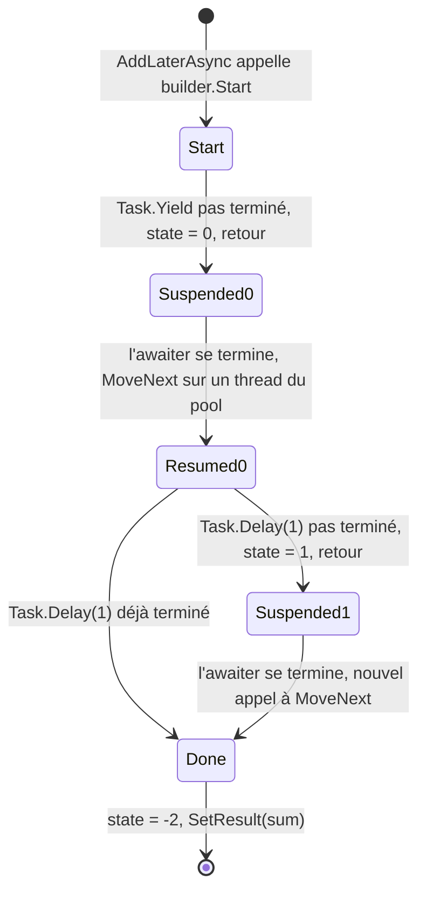
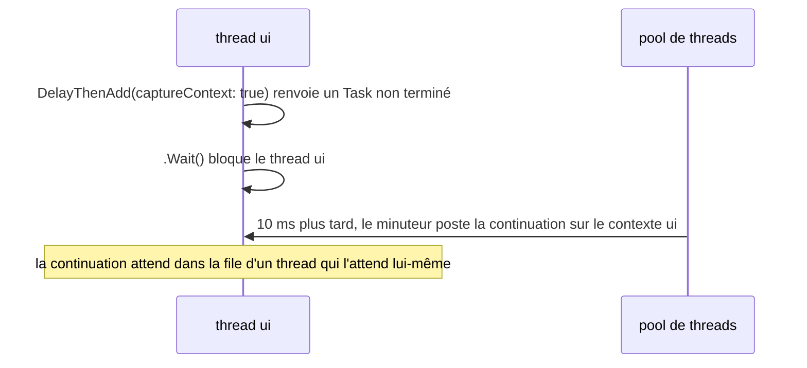

Vous écrivez `async` et `await` depuis des années, et vous connaissez les règles empiriques : ne pas bloquer sur du code asynchrone, renvoyer `ValueTask` sur les chemins critiques, ajouter `ConfigureAwait(false)` dans les bibliothèques. Cette leçon ouvre la méthode que le compilateur émet réellement pour `await`, puis confronte chaque règle à un programme : ce qu'alloue un appel, sur quel thread s'exécute le code après `await`, quelle exception vous attrapez, et où va une annulation. Deux morceaux de code de Guitar Alchemist servent d'études de cas : un utilitaire `Try` qui provoque un interblocage sous un contexte de synchronisation et avale l'annulation, et un cache qui garde un thread du pool endormi pour chaque valeur.

Les liens vers GA pointent sur le commit [`a826864`](https://github.com/GuitarAlchemist/ga/tree/a826864f3a012cad88e415954bf57eca0ce12aa6) ; les liens vers le runtime pointent sur le commit [`4271d88`](https://github.com/dotnet/runtime/tree/4271d88e0aebf3d04f188f1334c2220d80555ef6) de `dotnet/runtime`, étiqueté `v10.0.12`.

## Exécuter le programme de la leçon

```bash
bash code/csharp-advanced/check.sh                                   # toutes les leçons, comparées avec expected/
dotnet run --project code/csharp-advanced/Advanced -c Release -- l3  # cette leçon seulement, après check.sh
```

Le code se trouve dans [`Advanced/Lesson3.cs`](https://github.com/spareilleux/learn/blob/8ba378e7ea22a64a57b3e45b45afa4c85afa85a3/code/csharp-advanced/Advanced/Lesson3.cs), et la méthode décompilée plus bas dans [`Snippets/Async.cs`](https://github.com/spareilleux/learn/blob/8ba378e7ea22a64a57b3e45b45afa4c85afa85a3/code/csharp-advanced/Snippets/Async.cs). La seule ligne qui commence par `# ` dépend du nombre de processeurs ; la leçon la cite telle qu'obtenue sur la machine de l'auteur, un Intel Core Ultra 9 285K à 24 cœurs, et sur les runners de CI.

## Ce que le compilateur fait de `await`

Voici une petite méthode async avec deux `await` et une variable locale qui doit survivre à chacun d'eux :

```csharp
public static async Task<int> AddLaterAsync(int left, int right)
{
    await Task.Yield();
    var sum = left + right;
    await Task.Delay(1);
    return sum;
}
```

Il n'y a pas d'`async` dans l'IL. Le compilateur transforme le corps de la méthode en *machine à états* : un type qui implémente [`IAsyncStateMachine`](https://learn.microsoft.com/dotnet/api/system.runtime.compilerservices.iasyncstatemachine), dont la méthode `MoveNext` exécute le corps jusqu'au prochain `await` pas encore terminé, note où elle s'est arrêtée, et rend la main. `check.sh` décompile la build Release avec [`ilspycmd`](https://github.com/icsharpcode/ILSpy/tree/master/ICSharpCode.ILSpyCmd) au niveau de langage C# 4, antérieur à `async`, pour qu'ILSpy ne puisse pas reconstruire les `await` ([`expected/l3-state-machine.txt`](https://github.com/spareilleux/learn/blob/8ba378e7ea22a64a57b3e45b45afa4c85afa85a3/code/csharp-advanced/expected/l3-state-machine.txt)). La méthode elle-même n'est plus qu'une amorce qui crée la machine à états et la démarre :

```csharp
[AsyncStateMachine(typeof(<AddLaterAsync>d__0))]
public static Task<int> AddLaterAsync(int left, int right)
{
	<AddLaterAsync>d__0 stateMachine = default(<AddLaterAsync>d__0);
	stateMachine.<>t__builder = AsyncTaskMethodBuilder<int>.Create();
	stateMachine.left = left;
	stateMachine.right = right;
	stateMachine.<>1__state = -1;
	stateMachine.<>t__builder.Start(ref stateMachine);
	return stateMachine.<>t__builder.Task;
}
```

Les paramètres et la variable locale `sum` sont devenus des champs, car ils doivent survivre entre deux appels à `MoveNext`. Le champ d'état, `<>1__state`, indique où reprendre : -1 au début, 0 après le premier `await`, 1 après le second, -2 une fois terminé. [`AsyncTaskMethodBuilder<int>`](https://learn.microsoft.com/dotnet/api/system.runtime.compilerservices.asynctaskmethodbuilder-1) crée puis complète le `Task<int>` que reçoit l'appelant. Et `MoveNext` contient le corps, découpé à chaque `await` :

```csharp
private void MoveNext()
{
	int num = <>1__state;
	int result;
	try
	{
		TaskAwaiter awaiter;
		YieldAwaitable.YieldAwaiter awaiter2;
		if (num != 0)
		{
			if (num == 1)
			{
				awaiter = <>u__2;
				<>u__2 = default(TaskAwaiter);
				num = (<>1__state = -1);
				goto IL_00d5;
			}
			awaiter2 = Task.Yield().GetAwaiter();
			if (!awaiter2.IsCompleted)
			{
				num = (<>1__state = 0);
				<>u__1 = awaiter2;
				<>t__builder.AwaitUnsafeOnCompleted(ref awaiter2, ref this);
				return;
			}
		}
		else
		{
			awaiter2 = <>u__1;
			<>u__1 = default(YieldAwaitable.YieldAwaiter);
			num = (<>1__state = -1);
		}
		awaiter2.GetResult();
		<sum>5__2 = left + right;
		awaiter = Task.Delay(1).GetAwaiter();
		if (!awaiter.IsCompleted)
		{
			num = (<>1__state = 1);
			<>u__2 = awaiter;
			<>t__builder.AwaitUnsafeOnCompleted(ref awaiter, ref this);
			return;
		}
		goto IL_00d5;
		IL_00d5:
		awaiter.GetResult();
		result = <sum>5__2;
	}
	catch (Exception exception)
	{
		<>1__state = -2;
		<>t__builder.SetException(exception);
		return;
	}
	<>1__state = -2;
	<>t__builder.SetResult(result);
}
```

Chaque `await x` suit le même schéma : obtenir un *awaiter* avec `x.GetAwaiter()`, et tester `IsCompleted`. Si l'opération est déjà terminée, le code continue sans quitter `MoveNext` : c'est le chemin rapide, et il ne coûte pas plus qu'un appel de méthode. Sinon, il enregistre l'état et l'awaiter dans des champs, demande au builder de rappeler `MoveNext` quand l'awaiter se terminera, et revient à son appelant, qui reçoit un `Task` pas encore terminé. `GetResult()` renvoie la valeur ou relance l'exception de l'opération attendue. Une exception levée n'importe où dans le corps aboutit à `SetException`, qui fait échouer la tâche au lieu de remonter la pile.



Le programme lit le même type par réflexion ([`Lesson3.cs#L68-L79`](https://github.com/spareilleux/learn/blob/8ba378e7ea22a64a57b3e45b45afa4c85afa85a3/code/csharp-advanced/Advanced/Lesson3.cs#L68-L79)) :

```text
== The state machine behind AsyncMachine.AddLaterAsync (reflection)
[AsyncStateMachine(typeof(<AddLaterAsync>d__0))], a struct implementing IAsyncStateMachine
  public  Int32                          <>1__state
  public  AsyncTaskMethodBuilder<Int32>  <>t__builder
  public  Int32                          left
  public  Int32                          right
  private Int32                          <sum>5__2
  private YieldAwaitable.YieldAwaiter    <>u__1
  private TaskAwaiter                    <>u__2
AddLaterAsync(2, 3).Result = 5
```

En Release, la machine à états est une struct : elle vit sur la pile de l'appelant tant que la méthode s'exécute de façon synchrone, et ne coûte rien si aucun `await` n'a besoin d'attendre. La première fois que c'est le cas, le builder la copie dans un objet du tas, un `AsyncStateMachineBox<TStateMachine>` qui est aussi le `Task` renvoyé à l'appelant ([`AsyncTaskMethodBuilderT.cs#L215-L228`](https://github.com/dotnet/runtime/blob/4271d88e0aebf3d04f188f1334c2220d80555ef6/src/libraries/System.Private.CoreLib/src/System/Runtime/CompilerServices/AsyncTaskMethodBuilderT.cs#L215-L228)). En Debug, le compilateur émet plutôt une classe, pour que le débogueur et Edit and Continue puissent travailler avec ; `check.sh` décompile aussi la build Debug de la même méthode :

```text
		private sealed class <AddLaterAsync>d__0 : IAsyncStateMachine
```

Le mécanisme est décrit dans la [spécification du langage C# sur les fonctions async](https://learn.microsoft.com/dotnet/csharp/language-reference/language-specification/classes#1514-async-functions) et, bien plus en détail, dans l'article de Stephen Toub [How async/await really works in C#](https://devblogs.microsoft.com/dotnet/how-async-await-really-works/).

### Ce que la machine à états interdit

Comme les variables locales deviennent des champs d'un type qui peut finir sur le tas, certaines choses que l'on peut écrire dans une méthode synchrone ne compilent pas dans une méthode async. Chaque extrait ci-dessous est compilé par [`CompileFail/Program.cs`](https://github.com/spareilleux/learn/blob/8ba378e7ea22a64a57b3e45b45afa4c85afa85a3/code/csharp-advanced/CompileFail/Program.cs), comme dans la leçon 1. Un paramètre `ref`, `in` ou `out` deviendrait un champ contenant une référence vers la pile de l'appelant :

```csharp
public static async Task NextAsync(ref int fret)
{
    await Task.Yield();
    fret++;
}
```

```text
l3_ref_parameter.cs(4,48): error CS1988: Async methods cannot have ref, in or out parameters
```

Un `Span<T>` ne peut pas être un champ d'un type ordinaire (leçon 1). Depuis C# 13, une méthode async peut déclarer une variable locale de type span, tant qu'elle n'est pas utilisée après un `await`. Celle-ci l'est, trois fois :

```csharp
public static async Task<int> SumAsync(int[] frets)
{
    Span<int> window = frets.AsSpan(0, 3);
    await Task.Yield();
    return window[0] + window[1] + window[2]; // le span survivrait au cadre de pile
}
```

```text
l3_span_across_await.cs(8,16): error CS4007: Instance of type 'System.Span<int>' cannot be preserved across 'await' or 'yield' boundary.
l3_span_across_await.cs(8,28): error CS4007: Instance of type 'System.Span<int>' cannot be preserved across 'await' or 'yield' boundary.
l3_span_across_await.cs(8,40): error CS4007: Instance of type 'System.Span<int>' cannot be preserved across 'await' or 'yield' boundary.
```

Cette erreur est signalée tard, quand le compilateur réécrit la méthode en machine à états : un vérificateur qui s'arrête à `GetDiagnostics()` ne la voit pas, c'est pourquoi `CompileFail` émet chaque extrait. Enfin, un `lock` appartient à un thread, et le code après un `await` peut s'exécuter sur un autre :

```csharp
public async Task TuneAsync()
{
    lock (_gate)
    {
        await Task.Delay(10); // la continuation peut s'exécuter sur un autre thread
    }
}
```

```text
l3_await_in_lock.cs(10,13): error CS1996: Cannot await in the body of a lock statement
```

Pour garder un verrou de part et d'autre d'un `await`, utilisez [`SemaphoreSlim.WaitAsync`](https://learn.microsoft.com/dotnet/api/system.threading.semaphoreslim.waitasync), qui n'est pas lié à un thread.

## `Task` ou `ValueTask` : ce que coûte une fin synchrone

Quand une méthode async se termine sans attendre, le builder doit quand même renvoyer un `Task<int>` terminé. [`SetResult`](https://github.com/dotnet/runtime/blob/4271d88e0aebf3d04f188f1334c2220d80555ef6/src/libraries/System.Private.CoreLib/src/System/Runtime/CompilerServices/AsyncTaskMethodBuilderT.cs#L467-L480) appelle `Task.FromResult`, qui renvoie une tâche en cache pour `null`, `true`, `false` et les entiers de -1 à 8 ([`Task.cs#L5386-L5416`](https://github.com/dotnet/runtime/blob/4271d88e0aebf3d04f188f1334c2220d80555ef6/src/libraries/System.Private.CoreLib/src/System/Threading/Tasks/Task.cs#L5386-L5416), [`TaskCache.cs#L18-L21`](https://github.com/dotnet/runtime/blob/4271d88e0aebf3d04f188f1334c2220d80555ef6/src/libraries/System.Private.CoreLib/src/System/Threading/Tasks/TaskCache.cs#L18-L21)), et en alloue une nouvelle pour tout le reste. Un [`ValueTask<int>`](https://learn.microsoft.com/dotnet/api/system.threading.tasks.valuetask-1) est une struct qui contient soit le résultat, soit un `Task`, si bien qu'un résultat synchrone ne demande aucune allocation. Le programme mesure un appel de chaque, avec `await Task.CompletedTask` pour seul `await` ([`Lesson3.cs#L85-L104`](https://github.com/spareilleux/learn/blob/8ba378e7ea22a64a57b3e45b45afa4c85afa85a3/code/csharp-advanced/Advanced/Lesson3.cs#L85-L104)) :

```text
== Completing synchronously: bytes allocated by one call
TaskOf(5)                   0  (Task<int> results from -1 to 8 are cached)
TaskOf(500)                72
ValueTaskOf(500)            0
Task.FromResult(true)       0
```

72 octets, c'est la taille d'un objet `Task<int>`. C'est peu, mais une méthode appelée des millions de fois, comme une recherche dans un cache ou une lecture tamponnée qui est presque toujours synchrone, le paie à chaque appel. Quand la méthode attend vraiment, les deux variantes allouent la boîte de la machine à états, et `ValueTask` n'économise rien. Le benchmark BenchmarkDotNet [`Benchmarks/AsyncBenchmarks.cs`](https://github.com/spareilleux/learn/blob/8ba378e7ea22a64a57b3e45b45afa4c85afa85a3/code/csharp-advanced/Benchmarks/AsyncBenchmarks.cs) mesure les quatre cas :

```bash
cd code/csharp-advanced
dotnet run -c Release --project Benchmarks -- --filter "*AsyncBenchmarks*"
```

Sur la machine de l'auteur (BenchmarkDotNet 0.15.8, .NET 10.0.12, Intel Core Ultra 9 285K, Windows 11) :

| Method                          | Mean       | Error      | StdDev     | Ratio | RatioSD | Gen0   | Allocated | Alloc Ratio |
|-------------------------------- |-----------:|-----------:|-----------:|------:|--------:|-------:|----------:|------------:|
| TaskCompletedSynchronously      |   8.417 ns |  0.1833 ns |  0.5317 ns |  1.00 |    0.09 | 0.0038 |      72 B |        1.00 |
| ValueTaskCompletedSynchronously |   2.264 ns |  0.0717 ns |  0.1662 ns |  0.27 |    0.03 |      - |         - |        0.00 |
| TaskAfterYield                  | 784.608 ns |  9.1445 ns |  8.5537 ns | 93.60 |    6.27 | 0.0048 |      96 B |        1.33 |
| ValueTaskAfterYield             | 829.301 ns | 12.2729 ns | 11.4801 ns | 98.94 |    6.67 | 0.0048 |     104 B |        1.44 |

- Avec une fin synchrone, `ValueTask<int>` n'alloue rien et s'exécute en environ un quart du temps : le `Task<int>` de 72 octets et son initialisation ont disparu.
- Après un vrai `await Task.Yield()`, les deux allouent la boîte : 96 octets pour la version `Task` et 104 pour la version `ValueTask`, dont la boîte est d'un autre type, qui implémente `IValueTaskSource` au lieu de dériver de `Task`. Marquer la méthode avec l'attribut `[AsyncMethodBuilder(typeof(PoolingAsyncValueTaskMethodBuilder<>))]` lui fait réutiliser ces boîtes à partir d'un pool ([`PoolingAsyncValueTaskMethodBuilder<TResult>`](https://learn.microsoft.com/dotnet/api/system.runtime.compilerservices.poolingasyncvaluetaskmethodbuilder-1)) ; le cours ne l'a pas mesuré, *à vérifier*. Les deux prennent environ 800 ns, passées pour l'essentiel à mettre la continuation en file sur le pool de threads et à changer de thread. `ValueTask` n'y est pas plus rapide, et a même été légèrement plus lent lors de cette exécution.

`ValueTask` n'est donc rentable que là où le chemin synchrone est le cas courant.

`ValueTask` a un prix à l'usage, pas en octets. Un `ValueTask` peut reposer sur un [`IValueTaskSource`](https://learn.microsoft.com/dotnet/api/system.threading.tasks.sources.ivaluetasksource-1) issu d'un pool, réutilisé dès que son résultat a été lu ; c'est pourquoi sa [documentation de référence](https://learn.microsoft.com/dotnet/api/system.threading.tasks.valuetask-1#remarks) liste ce qu'il ne faut jamais en faire : l'attendre deux fois, appeler `AsTask()` deux fois, ou lire `.Result` ou `.GetAwaiter().GetResult()` avant que l'opération soit terminée. Les mêmes règles figurent dans les commentaires du code source du type ([`ValueTask.cs#L30-L53`](https://github.com/dotnet/runtime/blob/4271d88e0aebf3d04f188f1334c2220d80555ef6/src/libraries/System.Private.CoreLib/src/System/Threading/Tasks/ValueTask.cs#L30-L53)). Renvoyez `ValueTask` depuis les méthodes qui se terminent le plus souvent de façon synchrone et sont attendues directement ; gardez `Task` par défaut partout ailleurs ([Understanding the whys, whats, and whens of ValueTask](https://devblogs.microsoft.com/dotnet/understanding-the-whys-whats-and-whens-of-valuetask/)).

## `SynchronizationContext` : où s'exécute le code après `await`

Quand un `await` doit attendre, l'awaiter capture [`SynchronizationContext.Current`](https://learn.microsoft.com/dotnet/api/system.threading.synchronizationcontext.current) et, quand l'opération se termine, poste la suite de la méthode sur ce contexte. Dans une application console ou dans ASP.NET Core, il n'y en a pas, et la continuation s'exécute sur un thread du pool. Dans WPF, Windows Forms, .NET MAUI ou un composant Blazor, le contexte est celui du thread d'interface : le code après `await` peut de nouveau toucher à l'interface. [`ConfigureAwait(false)`](https://learn.microsoft.com/dotnet/api/system.threading.tasks.task.configureawait) signifie « ne le capture pas ».

Le programme du cours n'a pas d'interface, il construit donc son propre contexte : [`SingleThreadContext`](https://github.com/spareilleux/learn/blob/8ba378e7ea22a64a57b3e45b45afa4c85afa85a3/code/csharp-advanced/Advanced/Lesson3.cs#L310-L355), un thread dédié nommé `ui` qui exécute l'un après l'autre les rappels qu'on lui poste, comme une boucle de messages d'interface. `ui.Run` poste une fonction async sur ce thread et attend, depuis le thread principal, qu'elle ait fini ([`Lesson3.cs#L106-L136`](https://github.com/spareilleux/learn/blob/8ba378e7ea22a64a57b3e45b45afa4c85afa85a3/code/csharp-advanced/Advanced/Lesson3.cs#L106-L136)) :

```text
== SynchronizationContext: where the code after await runs
before await:                     on ui True
after await Task.Delay:           on ui True
after ConfigureAwait(false):      on ui False, pool thread True
```

Le minuteur qui termine `Task.Delay` se déclenche sur un thread du pool, et pourtant la première continuation est revenue sur le thread `ui` grâce au contexte capturé. Après `ConfigureAwait(false)`, elle est restée sur le thread du pool.

### L'interblocage classique

Cette fois, la fonction qui s'exécute sur le thread `ui` *bloque* sur du code asynchrone, avec `.Wait()` ou `.Result`, comme le fait parfois un gestionnaire d'événements qui ne peut pas être `async` :

```csharp
ui.Run(() =>
{
    var captured = DelayThenAdd(captureContext: true);
    Line($"awaits with the context, .Wait(1 s):         completed {captured.Wait(TimeSpan.FromSeconds(1))}");
    var free = DelayThenAdd(captureContext: false);
    Line($"awaits with ConfigureAwait(false), .Wait(10 s): completed {free.Wait(TimeSpan.FromSeconds(10))}");
    var gaTry = Try.OfAsync(() => DelayThenAdd(captureContext: false));
    Line($"GA Try.OfAsync(...), .Wait(1 s):             completed {gaTry.Wait(TimeSpan.FromSeconds(1))}");
    return Task.CompletedTask;
});

static async Task<int> DelayThenAdd(bool captureContext)
{
    await Task.Delay(10).ConfigureAwait(captureContext);
    return 2 + 3;
}
```

```text
== Blocking on async code from the ui thread
awaits with the context, .Wait(1 s):         completed False
awaits with ConfigureAwait(false), .Wait(10 s): completed True
GA Try.OfAsync(...), .Wait(1 s):             completed False
```



La première tâche ne se termine jamais : sa continuation est en file sur le thread `ui`, qui est bloqué à attendre justement cette tâche. Sans délai d'expiration, l'application se figerait. Avec `ConfigureAwait(false)`, la continuation s'exécute sur le pool et la tâche se termine.

La troisième ligne est [`Try.OfAsync`](https://github.com/GuitarAlchemist/ga/blob/a826864f3a012cad88e415954bf57eca0ce12aa6/Common/GA.Core/Functional/Try.cs#L62-L73) de GA, qui enveloppe le résultat ou l'exception d'une opération dans un `Try<T>` :

```csharp
public static async Task<Try<T>> OfAsync<T>(Func<Task<T>> operation)
{
    try
    {
        var result = await operation();
        return Try<T>.Success(result);
    }
    catch (Exception ex)
    {
        return Try<T>.Failure(ex);
    }
}
```

L'opération passée en argument est soigneuse, et utilise `ConfigureAwait(false)`. Cela ne sert à rien : le propre `await` de `OfAsync` capture le contexte, et se bloque de la même façon. `ConfigureAwait(false)` ne protège que l'`await` sur lequel il est écrit, donc une bibliothèque doit le mettre sur *chaque* `await`, à chaque niveau. Voilà la vraie règle derrière le folklore, expliquée dans la [ConfigureAwait FAQ](https://devblogs.microsoft.com/dotnet/configureawait-faq/) : le code d'application qui a besoin de son contexte ne l'utilise pas ; le code de bibliothèque généraliste, qui ne peut pas savoir qui l'appelle, l'utilise. Mieux encore, ne bloquez pas du tout sur du code asynchrone.

## Exceptions : `await` en relance une, la tâche les garde toutes

Une tâche peut échouer avec plusieurs exceptions, quand elle combine plusieurs opérations. [`Task.WhenAll`](https://learn.microsoft.com/dotnet/api/system.threading.tasks.task.whenall) les attend toutes et échoue avec toutes leurs exceptions ; `await` ne lance alors que la première, et non une `AggregateException` comme le fait `.Wait()` ([`Lesson3.cs#L138-L164`](https://github.com/spareilleux/learn/blob/8ba378e7ea22a64a57b3e45b45afa4c85afa85a3/code/csharp-advanced/Advanced/Lesson3.cs#L138-L164)) :

```text
== Exceptions: await rethrows the first one, the Task keeps them all
Task.Exception holds 2: first, second; await threw InnerExceptions[0]: True
ConfigureAwaitOptions.SuppressThrowing: no exception
```

Le programme trie les messages avant de les afficher : l'ordre de `InnerExceptions` est celui dans lequel les tâches ont échoué, et il varie d'une exécution à l'autre. Quand vous avez besoin de tous les échecs, attrapez l'exception et lisez `task.Exception.InnerExceptions`. La deuxième ligne montre [`ConfigureAwaitOptions.SuppressThrowing`](https://learn.microsoft.com/dotnet/api/system.threading.tasks.configureawaitoptions), ajouté dans .NET 8 : l'`await` attend la fin de la tâche et ignore son issue, ce qui est utile pour attendre une tâche d'arrière-plan que vous êtes en train d'arrêter. Cette option n'existe que pour `Task`, pas pour `Task<T>`, qui n'aurait aucun résultat à renvoyer.

## Annulation

En .NET, l'annulation est coopérative : un [`CancellationTokenSource`](https://learn.microsoft.com/dotnet/standard/threading/cancellation-in-managed-threads) positionne un indicateur, et chaque opération qui a reçu son jeton vérifie cet indicateur ou enregistre un rappel. Une opération annulée lance [`OperationCanceledException`](https://learn.microsoft.com/dotnet/api/system.operationcanceledexception), ou sa sous-classe `TaskCanceledException`, qui porte le jeton ([`Lesson3.cs#L166-L196`](https://github.com/spareilleux/learn/blob/8ba378e7ea22a64a57b3e45b45afa4c85afa85a3/code/csharp-advanced/Advanced/Lesson3.cs#L166-L196)) :

```text
== Cancellation
Task.Delay(10 s, token cancelled after 50 ms): TaskCanceledException, e.CancellationToken == token True
linked token after parent.Cancel(): IsCancellationRequested True
Task.Delay(10 s).WaitAsync(50 ms): TimeoutException
GA Try.OfAsync(cancelled task): IsFailure True, TaskCanceledException, no exception thrown
```

- Comparer `e.CancellationToken` à votre propre jeton permet de distinguer une annulation que vous avez demandée d'une annulation venue d'ailleurs, comme le délai d'expiration d'un client HTTP.
- [`CancellationTokenSource.CreateLinkedTokenSource`](https://learn.microsoft.com/dotnet/api/system.threading.cancellationtokensource.createlinkedtokensource) crée un jeton annulé dès que l'un de ses parents l'est : par exemple le jeton de la requête combiné à un délai d'expiration propre à l'opération.
- [`WaitAsync`](https://learn.microsoft.com/dotnet/api/system.threading.tasks.task.waitasync) cesse d'*attendre* après un délai, et lance `TimeoutException`. Il n'arrête pas l'opération, qui continue de s'exécuter sans que personne l'observe : passez un jeton à l'opération elle-même quand elle en accepte un.

La dernière ligne montre de nouveau `Try.OfAsync` de GA. Son `catch (Exception ex)` attrape aussi `OperationCanceledException`, et transforme l'annulation en échec ordinaire. L'appelant qui a annulé reçoit un `Try` en état d'échec au lieu d'une exception, le code qui suit l'appel continue comme si une erreur normale s'était produite, et un framework comme ASP.NET Core, qui reconnaît une requête annulée à son `OperationCanceledException`, ne la voit jamais. Du code qui attrape toutes les exceptions doit laisser passer l'annulation, avec `catch (Exception ex) when (ex is not OperationCanceledException)`.

## `IAsyncEnumerable<T>` et `[EnumeratorCancellation]`

Une méthode `async` qui renvoie [`IAsyncEnumerable<T>`](https://learn.microsoft.com/dotnet/csharp/asynchronous-programming/generate-consume-asynchronous-stream) peut à la fois faire des `await` et des `yield return`, et se consomme avec `await foreach`. Le compilateur génère une seule machine à états pour les deux. Le consommateur passe son jeton avec `WithCancellation(token)` ; ce jeton n'atteint le paramètre de l'itérateur que si ce paramètre est marqué [`[EnumeratorCancellation]`](https://learn.microsoft.com/dotnet/api/system.runtime.compilerservices.enumeratorcancellationattribute) ([`Lesson3.cs#L198-L231`](https://github.com/spareilleux/learn/blob/8ba378e7ea22a64a57b3e45b45afa4c85afa85a3/code/csharp-advanced/Advanced/Lesson3.cs#L198-L231)) :

```csharp
static async IAsyncEnumerable<int> Frets([EnumeratorCancellation] CancellationToken token = default)
{
    for (var fret = 0; fret < 12; fret++)
    {
        await Task.Delay(1, token);
        yield return fret;
    }
}
```

Le consommateur annule après la troisième case :

```text
== IAsyncEnumerable: the token reaches the iterator through [EnumeratorCancellation]
frets 0 1 2, then TaskCanceledException
```

Sans l'attribut, le compilateur se contente d'un avertissement. L'exercice 3 montre ce que cet avertissement signifie à l'exécution.

```text
l3_missing_enumerator_cancellation.cs(4,47): warning CS8425: Async-iterator 'Frets.AllAsync(CancellationToken)' has one or more parameters of type 'CancellationToken' but none of them is decorated with the 'EnumeratorCancellation' attribute, so the cancellation token parameter from the generated 'IAsyncEnumerable<>.GetAsyncEnumerator' will be unconsumed
```

## Le temps sans threads endormis : `LazyWithExpiration` de GA

Le type [`LazyWithExpiration<T>`](https://github.com/GuitarAlchemist/ga/blob/a826864f3a012cad88e415954bf57eca0ce12aa6/Common/GA.Core/Utilities/LazyWithExpiration.cs#L20-L40) de GA calcule une valeur à la première utilisation, puis la recalcule une fois qu'elle a expiré. Il mesure l'expiration en démarrant une tâche qui dort :

```csharp
if (!_lazyObject.IsValueCreated)
{
    Task.Factory.StartNew(() =>
    {
        Thread.Sleep(_expirationTime);
        _expired = true;
    });
}
```

[`Task.Factory.StartNew`](https://learn.microsoft.com/dotnet/api/system.threading.tasks.taskfactory.startnew) exécute le délégué sur le pool de threads, et `Thread.Sleep` monopolise ce thread pendant toute la durée d'expiration, sans rien faire. Le pool crée des threads à la demande jusqu'à son minimum, par défaut le nombre de processeurs, et au-delà n'en ajoute que progressivement ([Le pool de threads managés](https://learn.microsoft.com/dotnet/standard/threading/the-managed-thread-pool)). Le programme crée 64 valeurs qui expirent au bout d'une seconde, les lit, puis mesure combien de temps un `Task.Run(() => 0)` trivial attend un thread ([`Lesson3.cs#L233-L255`](https://github.com/spareilleux/learn/blob/8ba378e7ea22a64a57b3e45b45afa4c85afa85a3/code/csharp-advanced/Advanced/Lesson3.cs#L233-L255)) :

```text
== GA LazyWithExpiration: one sleeping thread-pool thread per expiring value
sum of the 64 values: 2016
# thread pool threads: 3 before, 25 after; a Task.Run(() => 0) took 2016 ms
```

Les deux 2016 sont une coïncidence : 0 + 1 + … + 63 = 2016, et l'attente a duré par hasard 2 016 ms. Avec 24 cœurs, les threads endormis ont occupé ceux du pool pendant environ deux secondes avant que l'élément de travail sans rapport en obtienne un. Sur les runners de CI, avec 3 ou 4 cœurs, le même `Task.Run` a attendu 11 001 ms sous Linux, 9 878 ms sous Windows et 11 722 ms sous macOS. Dans un serveur web, ce sont toutes les requêtes qui restent bloquées : c'est une *famine du pool de threads*, causée ici par un cache.

Pour attendre que le temps passe, il faut un minuteur, pas un thread ; et un cache qui a seulement besoin de savoir si une valeur est périmée n'a même pas besoin de minuteur. Il peut comparer des horodatages au moment où la valeur est lue. [`TimeProvider`](https://learn.microsoft.com/dotnet/standard/datetime/timeprovider-overview), ajouté dans .NET 8, rend l'horloge injectable, si bien qu'un test peut avancer le temps au lieu de dormir. Le type [`ExpiringLazy<T>`](https://github.com/spareilleux/learn/blob/8ba378e7ea22a64a57b3e45b45afa4c85afa85a3/code/csharp-advanced/Advanced/Lesson3.cs#L277-L308) du cours fait exactement cela, avec une `ManualClock` pour le test (le paquet [`Microsoft.Extensions.TimeProvider.Testing`](https://www.nuget.org/packages/Microsoft.Extensions.TimeProvider.Testing) fournit un `FakeTimeProvider` complet) :

```csharp
public sealed class ExpiringLazy<T>(Func<T> create, TimeSpan expiration, TimeProvider clock)
{
    private readonly Lock _lock = new();
    private (T Value, DateTimeOffset CreatedAt)? _entry;

    public T Value
    {
        get
        {
            lock (_lock)
            {
                var now = clock.GetUtcNow();
                if (_entry is not { } entry || now - entry.CreatedAt >= expiration)
                {
                    entry = (create(), now);
                    _entry = entry;
                }
                return entry.Value;
            }
        }
    }
}
```

```text
== An expiring cache without a sleeping thread: TimeProvider
t=0:     Value 1
t=4 min: Value 1
t=6 min: Value 2
```

La valeur est calculée une fois, conservée à 4 minutes, et recalculée à 6 minutes, dans un test qui s'exécute instantanément. Le verrou est un [`System.Threading.Lock`](https://learn.microsoft.com/dotnet/api/system.threading.lock), que `lock` utilise directement depuis C# 13 ; la leçon 6 y reviendra.

## Exercices

1. `ThreeDelaysAsync` attend `Task.Delay(1)` trois fois de suite. Combien de champs d'awaiter sa machine à états possède-t-elle ? Faites une prédiction, puis vérifiez par réflexion ou avec `ilspycmd`.
2. Corrigez `Try.OfAsync` de GA pour qu'il ne provoque pas d'interblocage quand on l'appelle et qu'on bloque dessus depuis le thread `ui`, et pour qu'il laisse l'annulation se propager. Vérifiez les deux avec le `SingleThreadContext` du programme et une tâche annulée.
3. Retirez `[EnumeratorCancellation]` de `Frets`, gardez `WithCancellation(cts.Token)` et l'annulation après la troisième case, puis relancez la boucle. Que se passe-t-il, et pourquoi ?

<details>
<summary>Solutions</summary>

1. Un seul. Le compilateur a besoin d'un champ par *type* d'awaiter dont la valeur doit survivre à une suspension, et non d'un champ par `await` : les trois `await` stockent le même genre de `TaskAwaiter` dans le même champ, et chacun le vide après usage pour que la tâche puisse être collectée ([`Lesson3.cs#L25-L30`](https://github.com/spareilleux/learn/blob/8ba378e7ea22a64a57b3e45b45afa4c85afa85a3/code/csharp-advanced/Advanced/Lesson3.cs#L25-L30)). `AddLaterAsync` avait deux champs parce qu'il attendait deux types d'awaiter différents.

    ```text
    1. ThreeDelaysAsync: 1 awaiter field (TaskAwaiter <>u__1), result 3
    ```

2. Ajoutez `ConfigureAwait(false)` à l'`await`, et excluez `OperationCanceledException` du `catch` avec un filtre d'exception ([`Lesson3.cs#L260-L275`](https://github.com/spareilleux/learn/blob/8ba378e7ea22a64a57b3e45b45afa4c85afa85a3/code/csharp-advanced/Advanced/Lesson3.cs#L260-L275)) :

    ```csharp
    public static async Task<Try<T>> OfAsync<T>(Func<Task<T>> operation)
    {
        try
        {
            var result = await operation().ConfigureAwait(false);
            return Try<T>.Success(result);
        }
        catch (Exception ex) when (ex is not OperationCanceledException)
        {
            return Try<T>.Failure(ex);
        }
    }
    ```

    ```text
    2. TryFixed.OfAsync(...) on the ui thread, .Wait(10 s): completed True
       TryFixed.OfAsync(cancelled task): TaskCanceledException, e.CancellationToken == token True
    ```

    La version corrigée se termine sur le thread `ui`, et l'annulation atteint l'appelant avec son propre jeton.

3. La boucle va jusqu'au bout, cases 0 à 11, et se termine normalement. `WithCancellation` passe le jeton à `GetAsyncEnumerator` ; sans l'attribut, l'énumérateur généré n'a nulle part où le mettre, et le paramètre `token` de l'itérateur garde sa valeur par défaut, `CancellationToken.None`. Annuler ne fait rien, et c'est exactement ce que dit l'avertissement CS8425. Comme le programme désactive volontairement cet avertissement ([`Lesson3.cs#L56-L66`](https://github.com/spareilleux/learn/blob/8ba378e7ea22a64a57b3e45b45afa4c85afa85a3/code/csharp-advanced/Advanced/Lesson3.cs#L56-L66)), rien d'autre ne vous prévient.

    ```text
    3. without [EnumeratorCancellation]: frets 0 1 2 3 4 5 6 7 8 9 10 11, then completed
    ```

</details>

## À retenir

- Une méthode `async` se compile en une amorce et une machine à états : les variables locales deviennent des champs, chaque `await` teste `IsCompleted`, et une suspension enregistre l'état, inscrit `MoveNext` comme continuation et rend la main.
- En Release, la machine à états est une struct, copiée sur le tas seulement à la première vraie suspension. Une méthode async qui se termine de façon synchrone n'alloue que son `Task<T>`, et rien du tout pour les résultats en cache ou avec `ValueTask<T>`.
- `ValueTask` économise une allocation sur les chemins synchrones, et doit être attendu exactement une fois.
- `await` reprend sur le `SynchronizationContext` capturé. Bloquer sur du code asynchrone depuis un contexte à un seul thread provoque un interblocage, sauf si *chaque* `await` en dessous utilise `ConfigureAwait(false)` : c'est pourquoi les bibliothèques l'écrivent partout, et pourquoi les applications ne devraient pas bloquer du tout.
- `await` relance la première exception ; la tâche les garde toutes.
- L'annulation est coopérative. N'attrapez pas `OperationCanceledException` avec les autres exceptions, passez le jeton à l'opération plutôt que seulement à `WaitAsync`, et marquez le jeton d'un itérateur async avec `[EnumeratorCancellation]`.
- N'attendez jamais que le temps passe avec `Thread.Sleep` sur le pool de threads : comparez des horodatages fournis par un `TimeProvider`, ou utilisez `Task.Delay` ou un minuteur.

## Sources

- Microsoft Learn : [Programmation asynchrone avec async et await](https://learn.microsoft.com/dotnet/csharp/asynchronous-programming/), [Fonctions async dans la spécification C#](https://learn.microsoft.com/dotnet/csharp/language-reference/language-specification/classes#1514-async-functions), [Annulation dans les threads managés](https://learn.microsoft.com/dotnet/standard/threading/cancellation-in-managed-threads), [Générer et consommer des flux asynchrones](https://learn.microsoft.com/dotnet/csharp/asynchronous-programming/generate-consume-asynchronous-stream), [Le pool de threads managés](https://learn.microsoft.com/dotnet/standard/threading/the-managed-thread-pool), [Qu'est-ce que TimeProvider ?](https://learn.microsoft.com/dotnet/standard/datetime/timeprovider-overview).
- Le blog .NET, par Stephen Toub : [How async/await really works in C#](https://devblogs.microsoft.com/dotnet/how-async-await-really-works/), [ConfigureAwait FAQ](https://devblogs.microsoft.com/dotnet/configureawait-faq/), [Understanding the whys, whats, and whens of ValueTask](https://devblogs.microsoft.com/dotnet/understanding-the-whys-whats-and-whens-of-valuetask/).
- dotnet/runtime à `v10.0.12` (commit `4271d88`) : [`AsyncTaskMethodBuilderT.cs`](https://github.com/dotnet/runtime/blob/4271d88e0aebf3d04f188f1334c2220d80555ef6/src/libraries/System.Private.CoreLib/src/System/Runtime/CompilerServices/AsyncTaskMethodBuilderT.cs#L215-L228), [`Task.cs`](https://github.com/dotnet/runtime/blob/4271d88e0aebf3d04f188f1334c2220d80555ef6/src/libraries/System.Private.CoreLib/src/System/Threading/Tasks/Task.cs#L5386-L5416), [`TaskCache.cs`](https://github.com/dotnet/runtime/blob/4271d88e0aebf3d04f188f1334c2220d80555ef6/src/libraries/System.Private.CoreLib/src/System/Threading/Tasks/TaskCache.cs#L18-L21), [`ValueTask.cs`](https://github.com/dotnet/runtime/blob/4271d88e0aebf3d04f188f1334c2220d80555ef6/src/libraries/System.Private.CoreLib/src/System/Threading/Tasks/ValueTask.cs#L30-L53).
- Guitar Alchemist à `a826864` : [`Try.cs`](https://github.com/GuitarAlchemist/ga/blob/a826864f3a012cad88e415954bf57eca0ce12aa6/Common/GA.Core/Functional/Try.cs#L62-L73), [`LazyWithExpiration.cs`](https://github.com/GuitarAlchemist/ga/blob/a826864f3a012cad88e415954bf57eca0ce12aa6/Common/GA.Core/Utilities/LazyWithExpiration.cs#L20-L40).
