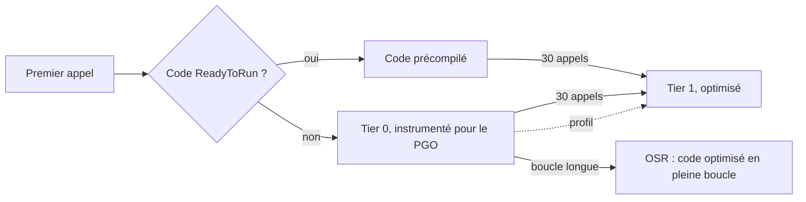

Les trois premières leçons mesuraient des octets, une grandeur exacte. Cette leçon mesure du temps, qui ne l'est pas. Une durée dépend du processeur, de ce que fait la machine par ailleurs, du niveau de compilation atteint par le JIT, et de détails du benchmark faciles à rater. La leçon commence par la façon dont [BenchmarkDotNet](https://benchmarkdotnet.org/) gère tout cela, puis met à l'épreuve quatre idées reçues sur la performance avec du code de Guitar Alchemist : « le JIT a besoin de chauffer », « `SearchValues` bat une boucle », « `FrozenDictionary` bat `Dictionary` » et « le SIMD bat une boucle scalaire ».

Les liens vers GA pointent sur le commit [`a826864`](https://github.com/GuitarAlchemist/ga/tree/a826864f3a012cad88e415954bf57eca0ce12aa6) ; les liens vers le runtime pointent sur le commit [`4271d88`](https://github.com/dotnet/runtime/tree/4271d88e0aebf3d04f188f1334c2220d80555ef6) de `dotnet/runtime`, étiqueté `v10.0.12`.

## Exécuter le programme de la leçon et ses benchmarks

```bash
bash code/csharp-advanced/check.sh                                   # toutes les leçons, comparées avec expected/
dotnet run --project code/csharp-advanced/Advanced -c Release -- l4  # cette leçon seulement, après check.sh
cd code/csharp-advanced
dotnet run -c Release --project Benchmarks -- --filter "*SearchBenchmarks*"   # une seule classe de benchmarks
```

[`Advanced/Lesson4.cs`](https://github.com/spareilleux/learn/blob/8ba378e7ea22a64a57b3e45b45afa4c85afa85a3/code/csharp-advanced/Advanced/Lesson4.cs) vérifie que le code comparé calcule les mêmes résultats ; la CI compare sa sortie sur trois OS. Les durées viennent de [`Benchmarks/`](https://github.com/spareilleux/learn/tree/8ba378e7ea22a64a57b3e45b45afa4c85afa85a3/code/csharp-advanced/Benchmarks), exécutés une classe à la fois sur la machine de l'auteur :

```text
BenchmarkDotNet v0.15.8, Windows 11 (10.0.26200.9445/25H2/2025Update/HudsonValley2)
Intel Core Ultra 9 285K 3.70GHz, 1 CPU, 24 logical and 24 physical cores
.NET SDK 10.0.112
  [Host]     : .NET 10.0.12 (10.0.12, 10.0.1226.42308), X64 RyuJIT x86-64-v3
  DefaultJob : .NET 10.0.12 (10.0.12, 10.0.1226.42308), X64 RyuJIT x86-64-v3
```

La CI exécute chaque benchmark une fois avec `--job Dry`, qui vérifie qu'ils s'exécutent et ne mesure rien. Les durées ne sont jamais comparées en CI : sur un runner partagé, elles varient d'une exécution à l'autre plus que la plupart des écarts ci-dessous.

## Comment BenchmarkDotNet mesure

Un benchmark est une méthode publique marquée `[Benchmark]` dans une classe publique. `BenchmarkSwitcher` génère un projet distinct pour chaque classe, le compile en Release, et exécute chaque benchmark dans son propre processus, pour que l'état du JIT, l'état du GC et les champs statiques d'un benchmark ne débordent pas sur le suivant ([How it works](https://benchmarkdotnet.org/articles/guides/how-it-works.html)). Dans ce processus, il passe par plusieurs étapes, que montre le log. Voici `VoicingWithSpans` de la leçon 2, abrégé :

```text
OverheadJitting  1: 1 op, 297100.00 ns, 297.1000 us/op
WorkloadJitting  1: 1 op, 1748700.00 ns, 1.7487 ms/op
WorkloadPilot    1: 16 op, 5800.00 ns, 362.5000 ns/op
WorkloadPilot    2: 32 op, 6600.00 ns, 206.2500 ns/op
...
WorkloadPilot   15: 262144 op, 39632100.00 ns, 151.1845 ns/op
WorkloadPilot   16: 524288 op, 66413500.00 ns, 126.6737 ns/op
WorkloadPilot   17: 1048576 op, 32909200.00 ns, 31.3847 ns/op
WorkloadPilot   18: 2097152 op, 66566700.00 ns, 31.7415 ns/op
...
OverheadActual   1: 16777216 op, 22217200.00 ns, 1.3242 ns/op
...
WorkloadWarmup   1: 16777216 op, 529044400.00 ns, 31.5335 ns/op
...
// BeforeActualRun
WorkloadActual   1: 16777216 op, 745563700.00 ns, 44.4391 ns/op
WorkloadActual   2: 16777216 op, 787768100.00 ns, 46.9546 ns/op
```

- **Jitting** appelle la méthode une fois, pour que le temps de compilation JIT ne soit pas compté dans une mesure.
- **Pilot** double le nombre d'appels par itération jusqu'à ce qu'une itération dure assez longtemps pour être chronométrée avec précision : ici 16 777 216 appels, environ une demi-seconde.
- **Overhead** exécute la même boucle autour d'une méthode vide ; son temps est soustrait de celui de la charge de travail.
- **Warmup** répète des itérations jusqu'à ce que le temps par appel se stabilise, puis **Actual** exécute les itérations qu'utilisent les statistiques : au moins 15, davantage si elles varient.

La phase pilote montre aussi le JIT à l'œuvre. Pendant environ 500 000 appels, la méthode prenait autour de 150 ns ; puis, d'un coup, 31 ns. Rien n'a changé dans le benchmark : le runtime a remplacé le premier code de la méthode, non optimisé, par du code optimisé, comme l'explique la section suivante. Un chronomètre autour d'une boucle de 100 000 appels aurait mesuré le code non optimisé, et conclu que la méthode était cinq fois plus lente qu'elle ne l'est.

La fin du log réserve une autre surprise : le warmup a atteint 31 ns, et les itérations réelles ont mesuré de 41 à 52 ns, pour le même code. Le tableau de la leçon 2 indique 46 ns. Relancer le benchmark avec l'option `--affinity` de BenchmarkDotNet, qui épingle le processus sur un cœur, a donné 32,4 ns avec un écart type inférieur à 0,5 ns, qu'il soit épinglé sur le premier cœur (`--affinity 1`) ou sur le dernier (`--affinity 8388608`). Le processeur de l'auteur mélange cœurs de performance et cœurs d'efficacité, et l'ordonnanceur déplace les threads des uns aux autres ; la question de savoir si cela explique les itérations plus lentes n'a pas été étudiée, *à vérifier*. La leçon pratique reste valable : quand le warmup et les itérations réelles ne concordent pas, ou quand BenchmarkDotNet signale une distribution multimodale, relancez avant de croire le tableau.

Les règles qui en découlent ([Good practices](https://benchmarkdotnet.org/articles/guides/good-practices.html)) :

- Compilez en Release, sans débogueur. BenchmarkDotNet refuse une build Debug.
- Renvoyez le résultat du travail, comme le fait chaque benchmark du cours, pour que le JIT ne puisse pas supprimer un calcul que personne n'utilise.
- Gardez la préparation hors de la méthode mesurée : `[GlobalSetup]` s'exécute une fois avant les itérations, `[Params]` exécute le benchmark pour chaque valeur.
- Exécutez sur une machine au repos, une classe de benchmarks à la fois, et lisez `Error` et `StdDev` avant de comparer deux moyennes.

## Compilation hiérarchisée, OSR et PGO dynamique

Quand une méthode est appelée pour la première fois, le runtime ne la compile pas avec toutes les optimisations : cela ralentirait le démarrage. Avec la [compilation hiérarchisée](https://learn.microsoft.com/dotnet/core/runtime-config/compilation#tiered-compilation) (tiered compilation), activée par défaut depuis .NET Core 3.0 :

1. **Tier 0** : la méthode est compilée rapidement avec peu d'optimisations, ou bien son code précompilé [ReadyToRun](https://learn.microsoft.com/dotnet/core/deploying/ready-to-run) est utilisé ; la plupart des bibliothèques .NET sont livrées avec du code ReadyToRun.
2. Après 30 appels, comptés une fois écoulé un délai de 100 ms sans nouvelle compilation en tier 0, la méthode est mise en file pour le **tier 1**, et compilée avec toutes les optimisations en arrière-plan ([`clrconfigvalues.h#L474-L480`](https://github.com/dotnet/runtime/blob/4271d88e0aebf3d04f188f1334c2220d80555ef6/src/coreclr/inc/clrconfigvalues.h#L474-L480)). Les appels suivants utilisent le nouveau code.
3. Une méthode appelée une seule fois mais qui boucle longtemps, comme `Main`, resterait coincée en tier 0. Le **remplacement sur la pile** (on-stack replacement, OSR) la fait passer à du code optimisé au milieu de la boucle.
4. Avec le **PGO dynamique** (profile-guided optimization, l'optimisation guidée par profil), activé par défaut depuis .NET 8 ([`clrconfigvalues.h#L520`](https://github.com/dotnet/runtime/blob/4271d88e0aebf3d04f188f1334c2220d80555ef6/src/coreclr/inc/clrconfigvalues.h#L520)), le code de tier 0 compte aussi quelles branches sont prises et quels types un appel d'interface reçoit réellement. Le tier 1 utilise ce profil : par exemple, quand un appel sur `IEnumerable<int>` reçoit toujours une `List<int>`, il vérifie qu'il s'agit bien d'une `List<int>` et appelle ses méthodes directement, là où elles peuvent être inlinées (*dévirtualisation gardée*).



Chaque étape peut être désactivée par une variable d'environnement ([paramètres de compilation](https://learn.microsoft.com/dotnet/core/runtime-config/compilation)). [`Benchmarks/JitBenchmarks.cs`](https://github.com/spareilleux/learn/blob/8ba378e7ea22a64a57b3e45b45afa4c85afa85a3/code/csharp-advanced/Benchmarks/JitBenchmarks.cs) exécute les deux mêmes méthodes sous quatre jobs : les valeurs par défaut, `DOTNET_TieredPGO=0`, `DOTNET_TieredCompilation=0` (tout est compilé avec toutes les optimisations dès le premier appel, sans profil) et `DOTNET_ReadyToRun=0` (le code précompilé des bibliothèques est ignoré, elles passent donc elles aussi par les différents niveaux) :

```csharp
private static readonly IEnumerable<int> Values = PitchClassSetId.Items.Select(id => id.Value).ToList();

// Une boucle sur une interface : avec le PGO, le JIT voit que Values est toujours une List<int> et dévirtualise les appels
[Benchmark]
public long SumThroughInterface()
{
    long sum = 0;
    foreach (var value in Values) sum += value;
    return sum;
}

// La collection des 4096 ensembles de GA, énumérée à travers IReadOnlyCollection<PitchClassSetId>
[Benchmark]
public int CardinalityOfEverySet()
{
    var notes = 0;
    foreach (var id in PitchClassSetId.Items) notes += id.Cardinality;
    return notes;
}
```

| Method                | Job          | EnvironmentVariables       | Mean      | Error     | StdDev    | Ratio | RatioSD | Allocated | Alloc Ratio |
|---------------------- |------------- |--------------------------- |----------:|----------:|----------:|------:|--------:|----------:|------------:|
| SumThroughInterface   | Default      | Empty                      |  1.219 μs | 0.0100 μs | 0.0094 μs |  1.00 |    0.01 |         - |          NA |
| SumThroughInterface   | NoPGO        | DOTNET_TieredPGO=0         | 11.341 μs | 0.0594 μs | 0.0556 μs |  9.30 |    0.08 |      40 B |          NA |
| SumThroughInterface   | NoReadyToRun | DOTNET_ReadyToRun=0        |  1.212 μs | 0.0064 μs | 0.0059 μs |  0.99 |    0.01 |         - |          NA |
| SumThroughInterface   | NoTiering    | DOTNET_TieredCompilation=0 | 11.305 μs | 0.0890 μs | 0.0833 μs |  9.27 |    0.10 |      40 B |          NA |
|                       |              |                            |           |           |           |       |         |           |             |
| CardinalityOfEverySet | Default      | Empty                      |  2.656 μs | 0.0306 μs | 0.0286 μs |  1.00 |    0.01 |      40 B |        1.00 |
| CardinalityOfEverySet | NoPGO        | DOTNET_TieredPGO=0         | 11.353 μs | 0.0778 μs | 0.0728 μs |  4.28 |    0.05 |      40 B |        1.00 |
| CardinalityOfEverySet | NoReadyToRun | DOTNET_ReadyToRun=0        |  2.672 μs | 0.0418 μs | 0.0391 μs |  1.01 |    0.02 |      40 B |        1.00 |
| CardinalityOfEverySet | NoTiering    | DOTNET_TieredCompilation=0 | 11.303 μs | 0.0717 μs | 0.0636 μs |  4.26 |    0.05 |      40 B |        1.00 |

Les deux méthodes se comportent différemment, et les deux résultats méritent une lecture attentive.

- `SumThroughInterface` s'exécute **9 fois plus vite avec le PGO**, et n'alloue rien. Sans le profil (`NoPGO`), ou sans niveaux du tout (`NoTiering`, où rien n'est jamais instrumenté), chaque `MoveNext()` et chaque `Current` est un appel d'interface, et `GetEnumerator()` boxe la struct `List<int>.Enumerator` : 40 octets. Avec le profil, le JIT sait que `Values` est toujours une `List<int>` : il ajoute un test de type, appelle directement les méthodes de l'énumérateur struct et les inline, et comme l'énumérateur ne s'échappe plus, il ne le boxe pas. Cette combinaison de dévirtualisation gardée et d'analyse d'échappement fait partie des améliorations de .NET 10 décrites dans [Performance Improvements in .NET 10](https://devblogs.microsoft.com/dotnet/performance-improvements-in-net-10/).
- `CardinalityOfEverySet`, sur `PitchClassSetId.Items` de GA, va 4 fois plus vite avec le PGO mais **alloue toujours 40 octets**. Sa collection est le `<>z__ReadOnlyList<PitchClassSetId>` généré par le compilateur, vu dans la leçon 1, et le PGO ne supprime pas l'allocation de son énumérateur ; pourquoi exactement, je ne l'ai pas étudié, *à vérifier*.
- `DOTNET_TieredCompilation=0` n'est pas plus rapide que les valeurs par défaut, et ici bien plus lent : du code compilé une seule fois, entièrement optimisé mais sans profil, perd ce qu'apporte le PGO. Désactiver les niveaux pour « sauter le warmup » sacrifie le démarrage et le PGO sans rien gagner en régime établi.
- `DOTNET_ReadyToRun=0` ne change rien de mesurable une fois que le code a atteint le tier 1 ; ReadyToRun compte pour le démarrage, que ce benchmark ne mesure pas.

## `SearchValues<T>` : chercher l'une de plusieurs valeurs

Trouver la première altération dans un chiffrage d'accord, c'est une boucle sur des caractères. [`SearchValues<T>`](https://learn.microsoft.com/dotnet/api/system.buffers.searchvalues-1), ajouté dans .NET 8, précalcule une fois pour toutes un ensemble de valeurs, et `IndexOfAny` utilise ensuite la recherche la plus rapide pour cet ensemble sur le processeur courant ([`Lesson4.cs#L53-L83`](https://github.com/spareilleux/learn/blob/8ba378e7ea22a64a57b3e45b45afa4c85afa85a3/code/csharp-advanced/Advanced/Lesson4.cs#L53-L83)) :

```csharp
static readonly SearchValues<char> Accidentals = SearchValues.Create("#b");
static readonly SearchValues<string> Qualities = SearchValues.Create(["maj7", "m7b5", "dim7", "sus4"], StringComparison.Ordinal);

public static int IndexOfAccidental(string symbol)
{
    var i = symbol.AsSpan(1).IndexOfAny(Accidentals);
    return i < 0 ? -1 : i + 1;
}
```

```text
== SearchValues: the same answers as a loop
first accidental: -1 -1 -1 -1 -1 3 -1 1 1 1 1 1 -1 2; same as the loop: True
quality found: -1 -1 -1 1 -1 1 1 -1 2 -1 -1 -1 1 -1
```

`SearchValues<T>` est abstrait, et `Create` renvoie une sous-classe spécialisée. Laquelle, cela dépend du processeur : c'est pourquoi le programme affiche son nom sur une ligne dépendante de la machine :

```text
# SearchValues.Create("#b") is Any2CharPackedSearchValues
# SearchValues.Create(["maj7", ...]) is AsciiStringSearchValuesTeddyNonBucketizedN3`2
```

Sur x64, deux caractères ASCII obtiennent une implémentation *packed*, qui réduit les caractères UTF-16 à des octets pour en comparer davantage par instruction ; sur le runner macOS Arm64, le même appel a renvoyé ``Any2SearchValues`2``. Les quatre chaînes utilisent *Teddy*, un algorithme vectorisé de recherche de plusieurs sous-chaînes, sur les deux architectures. [`SearchBenchmarks`](https://github.com/spareilleux/learn/blob/8ba378e7ea22a64a57b3e45b45afa4c85afa85a3/code/csharp-advanced/Benchmarks/LookupBenchmarks.cs) cherche dans les 14 chiffrages d'accords, et dans une grille d'accords de 400 mesures, soit 9 606 caractères, dont la seule altération se trouve vers la fin :

| Method                  | Mean        | Error     | StdDev     | Ratio  | RatioSD | Allocated | Alloc Ratio |
|------------------------ |------------:|----------:|-----------:|-------:|--------:|----------:|------------:|
| SymbolsLoop             |    16.51 ns |  0.352 ns |   0.711 ns |   1.00 |    0.06 |         - |          NA |
| SymbolsSearchValues     |    28.53 ns |  0.587 ns |   1.576 ns |   1.73 |    0.12 |         - |          NA |
| ChartLoop               | 2,298.83 ns | 45.726 ns | 115.556 ns | 139.53 |    9.25 |         - |          NA |
| ChartSearchValues       |   162.38 ns |  7.412 ns |  21.853 ns |   9.86 |    1.39 |         - |          NA |
| ChartIndexOfAnyTwoChars |   166.70 ns |  4.382 ns |  12.853 ns |  10.12 |    0.89 |         - |          NA |

Sur les chiffrages d'accords, longs de 1 à 6 caractères, la boucle gagne : `SearchValues` est **1,7 fois plus lent**. Chaque appel à `IndexOfAny` doit vérifier la longueur et choisir un chemin avant d'examiner le moindre caractère, et cela coûte plus que d'examiner trois ou quatre caractères. Sur la grille, la boucle est 14 fois plus lente que `SearchValues`, 2,3 µs contre 162 ns, parce que la recherche vectorisée compare de nombreux caractères par instruction. Et `IndexOfAny('#', 'b')` y fait aussi bien que `SearchValues` (exercice 3). `SearchValues` est fait pour les entrées longues, ou pour des ensembles de valeurs que les surcharges simples ne couvrent pas.

## `FrozenDictionary` : quelle implémentation vous obtenez

[`FrozenDictionary<TKey, TValue>`](https://learn.microsoft.com/dotnet/api/system.collections.frozen.frozendictionary-2), ajouté dans .NET 8, est un dictionnaire en lecture seule qui passe plus de temps à sa création pour être plus rapide en lecture. `ToFrozenDictionary()` examine les clés et choisit une implémentation ([`FrozenDictionary.cs#L157-L280`](https://github.com/dotnet/runtime/blob/4271d88e0aebf3d04f188f1334c2220d80555ef6/src/libraries/System.Collections.Immutable/src/System/Collections/Frozen/FrozenDictionary.cs#L157-L280)). Le programme affiche le type obtenu pour quelques ensembles de clés, dont deux de GA ([`Lesson4.cs#L85-L111`](https://github.com/spareilleux/learn/blob/8ba378e7ea22a64a57b3e45b45afa4c85afa85a3/code/csharp-advanced/Advanced/Lesson4.cs#L85-L111)) :

```text
== FrozenDictionary: which implementation ToFrozenDictionary() picks
10 chord suffixes (string keys)              LengthBucketsFrozenDictionary`1
same, StringComparer.OrdinalIgnoreCase       LengthBucketsFrozenDictionary`1
12 pitch classes (int keys)                  WithFullValues`3
12 PitchClass keys (record struct)           ValueTypeDefaultComparerFrozenDictionary`2
GA: 144 (int, int) keys, PitchClass -        ValueTypeDefaultComparerFrozenDictionary`2
GA: ProgrammaticForteCatalog.ForteByPrimeFormId ValueTypeDefaultComparerFrozenDictionary`2 (224 keys)
lookups agree with the Dictionary: True
```

- Les **clés de type chaîne** de peu de longueurs différentes sont rangées dans des *compartiments par longueur* : une recherche vérifie d'abord la longueur de la clé, puis compare avec au plus cinq clés de cette longueur ([`LengthBuckets.cs#L13`](https://github.com/dotnet/runtime/blob/4271d88e0aebf3d04f188f1334c2220d80555ef6/src/libraries/System.Collections.Immutable/src/System/Collections/Frozen/String/LengthBuckets.cs#L13)). Les autres clés de type chaîne sont analysées pour trouver la plus courte sous-chaîne qui les distingue, et seule cette sous-chaîne est hachée.
- Les **clés entières** dans une plage dense, ici de 0 à 11, n'ont besoin d'aucun hachage : le `DenseIntegralFrozenDictionary` de .NET 10 stocke les valeurs dans un tableau indexé par la clé, tant que l'étendue de la plage ne dépasse pas dix fois le nombre de clés ([`DenseIntegralFrozenDictionary.cs#L27`](https://github.com/dotnet/runtime/blob/4271d88e0aebf3d04f188f1334c2220d80555ef6/src/libraries/System.Collections.Immutable/src/System/Collections/Frozen/Integer/DenseIntegralFrozenDictionary.cs#L27)). `WithFullValues` est sa classe imbriquée pour une plage sans trous.
- Les **autres types valeur**, comme la record struct `PitchClass` de GA ou un tuple, obtiennent une table de hachage générale qui appelle `EqualityComparer<TKey>.Default` directement, sans appel virtuel. Jusqu'à 10 clés, c'est une recherche linéaire qui est utilisée à la place ([`Constants.cs#L32`](https://github.com/dotnet/runtime/blob/4271d88e0aebf3d04f188f1334c2220d80555ef6/src/libraries/System.Collections.Immutable/src/System/Collections/Frozen/Constants.cs#L32)) ; 12 classes de hauteurs, c'est juste au-dessus.

[`Benchmarks/LookupBenchmarks.cs`](https://github.com/spareilleux/learn/blob/8ba378e7ea22a64a57b3e45b45afa4c85afa85a3/code/csharp-advanced/Benchmarks/LookupBenchmarks.cs) recherche douze suffixes d'accords, dont deux absents, dans un `Dictionary` et dans sa copie gelée :

| Method                      | Mean     | Error    | StdDev   | Median   | Ratio | RatioSD | Allocated | Alloc Ratio |
|---------------------------- |---------:|---------:|---------:|---------:|------:|--------:|----------:|------------:|
| DictionaryTryGetValue       | 45.45 ns | 0.928 ns | 2.310 ns | 45.94 ns |  1.00 |    0.07 |         - |          NA |
| FrozenDictionaryTryGetValue | 48.86 ns | 1.920 ns | 5.660 ns | 50.79 ns |  1.08 |    0.14 |         - |          NA |

Pour ces douze recherches, `FrozenDictionary` n'est **pas plus rapide** : 48,9 ns contre 45,5 ns, un écart compris dans sa propre marge d'erreur. Les clés sont courtes, et les hacher coûte déjà peu. Les avantages du dictionnaire gelé, sur des clés où son analyse évite de hacher de longues chaînes, ou sur une grande table en lecture seule, n'apparaissent pas sur une table de suffixes d'accords. Mesurez avec vos propres clés avant de changer.

## La soustraction de classes de hauteurs de GA : un dictionnaire pour faire de l'arithmétique

La [`PitchClass`](https://github.com/GuitarAlchemist/ga/blob/a826864f3a012cad88e415954bf57eca0ce12aa6/Common/GA.Domain.Core/Theory/Atonal/PitchClass.cs#L80-L81) de GA est un nombre de 0 à 11. Son opérateur `-` cherche la différence dans un `FrozenDictionary` des 144 paires possibles, construit une seule fois derrière un `Lazy` ([`PitchClass.cs#L110-L137`](https://github.com/GuitarAlchemist/ga/blob/a826864f3a012cad88e415954bf57eca0ce12aa6/Common/GA.Domain.Core/Theory/Atonal/PitchClass.cs#L110-L137)) :

```csharp
private static readonly Lazy<FrozenDictionary<(int, int), PitchClass>> _lazySubtractionDictionary =
    new(GetSubtractionDictionary);

public static PitchClass NormalizedSubtraction(PitchClass pitchClass1, PitchClass pitchClass2) =>
    _lazySubtractionDictionary.Value[(pitchClass1.Value, pitchClass2.Value)];
```

Chaque valeur de cette table est calculée avec `FromValue((pcValue1 - pcValue2 + 12) % 12)` : le dictionnaire met en cache une soustraction, une addition et un reste. Le programme vérifie que l'arithmétique donne les mêmes 144 résultats, et que la recherche n'alloue rien ([`Lesson4.cs#L113-L131`](https://github.com/spareilleux/learn/blob/8ba378e7ea22a64a57b3e45b45afa4c85afa85a3/code/csharp-advanced/Advanced/Lesson4.cs#L113-L131)) :

```text
== GA PitchClass subtraction: FrozenDictionary lookup versus arithmetic
144 of 144 pairs agree; E - 1 = T, 1 - E = 2
bytes allocated by one GA subtraction: 0
```

`PitchClassBenchmarks` soustrait chaque paire de classes de hauteurs, soit 144 soustractions par appel, avec l'opérateur de GA, avec l'arithmétique, et avec le tableau plat de l'exercice 2 :

| Method          | Mean      | Error     | StdDev    | Ratio | RatioSD | Allocated | Alloc Ratio |
|---------------- |----------:|----------:|----------:|------:|--------:|----------:|------------:|
| GaOperatorMinus | 582.72 ns | 12.656 ns | 37.318 ns |  1.00 |    0.09 |         - |          NA |
| Arithmetic      | 134.46 ns |  2.281 ns |  2.134 ns |  0.23 |    0.02 |         - |          NA |
| LookupTable     |  41.51 ns |  0.417 ns |  0.390 ns |  0.07 |    0.00 |         - |          NA |

La recherche dans le dictionnaire coûte environ 4 ns par soustraction, 583 ns pour 144 : elle lit `Lazy<T>.Value`, construit une clé tuple, la hache, trouve le compartiment et compare. L'arithmétique prend 0,9 ns : une division pour le `%`, et la vérification de plage dans l'accesseur `init` de `PitchClass`. Le tableau plat prend 0,3 ns : une multiplication, une addition et une lecture. Le cache de GA est 14 fois plus lent que la table, et 4 fois plus lent que le calcul qu'il met en cache. Il n'alloue rien, si bien qu'un profileur mémoire ne le signalerait jamais.

## SIMD : `Vector<T>` et `TensorPrimitives`

GA compare les voicings par le produit scalaire de leurs embeddings, des vecteurs de `double`. Son [`SimdOps.Dot`](https://github.com/GuitarAlchemist/ga/blob/a826864f3a012cad88e415954bf57eca0ce12aa6/Common/GA.Core/Numerics/SimdOps.cs#L13-L40) utilise [`Vector<T>`](https://learn.microsoft.com/dotnet/standard/simd), dont le JIT compile les opérations en instructions SIMD (single instruction, multiple data), qui traitent plusieurs éléments à la fois :

```csharp
public static double Dot(ReadOnlySpan<double> a, ReadOnlySpan<double> b)
{
    var len = a.Length;
    var vsz = Vector<double>.Count;
    var i = 0;
    var acc = 0.0;

    if (Vector.IsHardwareAccelerated && len >= vsz)
    {
        var vacc = Vector<double>.Zero;
        var last = len - len % vsz;
        for (; i < last; i += vsz)
        {
            var va = new Vector<double>(a.Slice(i, vsz));
            var vb = new Vector<double>(b.Slice(i, vsz));
            vacc += va * vb;
        }

        acc += Vector.Dot(vacc, Vector<double>.One);
    }

    for (; i < len; i++)
    {
        acc += a[i] * b[i];
    }

    return acc;
}
```

`Vector<double>.Count` est le nombre de `double` que le processeur traite à la fois : 4 avec AVX2 sur x64, 2 sur Arm64. La boucle multiplie les éléments voie par voie, accumule chaque voie séparément, et additionne les voies à la fin ; une queue scalaire traite les éléments restants. [`TensorPrimitives.Dot`](https://learn.microsoft.com/dotnet/api/system.numerics.tensors.tensorprimitives.dot), du paquet [`System.Numerics.Tensors`](https://www.nuget.org/packages/System.Numerics.Tensors), fait le même travail dans la bibliothèque. Le programme compare les trois sur 1 027 éléments, une longueur qui laisse une queue ([`Lesson4.cs#L133-L169`](https://github.com/spareilleux/learn/blob/8ba378e7ea22a64a57b3e45b45afa4c85afa85a3/code/csharp-advanced/Advanced/Lesson4.cs#L133-L169)) :

```text
== Vectorized dot products: GA SimdOps.Dot, TensorPrimitives.Dot and a scalar loop
small integers: scalar 157.000000, SimdOps 157.000000, TensorPrimitives 157.000000; equal to 1e-9: True
small integers: bit-identical to the scalar loop: True
random doubles: scalar 3.010745, SimdOps 3.010745, TensorPrimitives 3.010745; equal to 1e-9: True
random doubles: bit-identical to the scalar loop: (depends on the vector width)
SimdOps.Dot allocates nothing itself: 0 bytes
```

Les résultats concordent à 1e-9 près, mais ne sont pas toujours identiques au bit près. L'addition en virgule flottante n'est pas associative : additionner les éléments sur quatre voies puis sommer les voies n'arrondit pas de la même façon que les additionner un par un. Sur de petits entiers, qu'un `double` représente exactement, aucun arrondi ne se produit. L'ampleur de l'écart dépend du processeur :

```text
# Vector.IsHardwareAccelerated True, Vector<double>.Count 4, Vector256 True, Vector512 False
# random doubles: SimdOps - scalar = 1.15E-014, TensorPrimitives - scalar = 1.02E-014
```

Voilà pour la machine de l'auteur. Le runner Linux a indiqué `Vector512 True` et un écart de 4.88E-015 pour `TensorPrimitives` : `TensorPrimitives` utilise des vecteurs de 512 bits quand le processeur en dispose, alors que `Vector<double>` est resté à 256 bits. Le runner macOS, sur Arm64, a indiqué `Vector<double>.Count 2` et 1.29E-014. Un test qui compare un résultat en virgule flottante à une valeur enregistrée doit utiliser une tolérance.

[`DotBenchmarks`](https://github.com/spareilleux/learn/blob/8ba378e7ea22a64a57b3e45b45afa4c85afa85a3/code/csharp-advanced/Benchmarks/VectorBenchmarks.cs) exécute les trois sur 16 et 1 024 éléments :

| Method              | Length | Mean       | Error     | StdDev    | Ratio | RatioSD |
|-------------------- |------- |-----------:|----------:|----------:|------:|--------:|
| **Scalar**              | **16**     |   **4.688 ns** | **0.0540 ns** | **0.0479 ns** |  **1.00** |    **0.01** |
| GaSimdOps           | 16     |   2.768 ns | 0.1335 ns | 0.3936 ns |  0.59 |    0.08 |
| TensorPrimitivesDot | 16     |   2.906 ns | 0.0970 ns | 0.2859 ns |  0.62 |    0.06 |
|                     |        |            |           |           |       |         |
| **Scalar**              | **1024**   | **431.979 ns** | **8.5494 ns** | **9.1478 ns** |  **1.00** |    **0.03** |
| GaSimdOps           | 1024   | 132.389 ns | 3.2484 ns | 9.5780 ns |  0.31 |    0.02 |
| TensorPrimitivesDot | 1024   |  96.334 ns | 2.4099 ns | 7.1056 ns |  0.22 |    0.02 |

Sur 1 024 éléments, `SimdOps.Dot` de GA est 3,3 fois plus rapide que la boucle scalaire, et `TensorPrimitives.Dot` 4,5 fois. Le JIT ne vectorise pas la boucle scalaire de lui-même : avec des `double`, réordonner les additions changerait le résultat, donc chaque addition attend la précédente. Sur 16 éléments, les deux versions vectorisées sont environ 1,7 fois plus rapides. Pour GA, remplacer le corps de `SimdOps.Dot` par un appel à `TensorPrimitives.Dot` serait plus simple et plus rapide sur cette machine ; les durées sur Arm64 n'ont pas été mesurées, *à vérifier*.

## Si vous connaissez Spring et Reactor

Toutes les difficultés de cette leçon existent sur la JVM, et [JMH](https://github.com/openjdk/jmh) y répond par les mêmes moyens. Son README fait la même promesse que BenchmarkDotNet : « Do not assume that a nice harness will magically free you from considering benchmarking pitfalls. We only promise to make avoiding them easier, not avoiding them completely. »

| BenchmarkDotNet | JMH |
|---|---|
| un processus par benchmark | [`@Fork`](https://github.com/openjdk/jmh/blob/master/jmh-samples/src/main/java/org/openjdk/jmh/samples/JMHSample_12_Forking.java), cinq forks de mesure par défaut, parce que « JVMs are notoriously good at profile-guided optimizations » et que deux tests dans une même JVM mélangent leurs profils |
| plusieurs exécutions pour voir la variance d'une exécution à l'autre | les forks, encore : « JVMs are complex systems, and the non-determinism is inherent for them » |
| des itérations d'échauffement, puis des itérations de mesure | `@Warmup` et `@Measurement` : cinq itérations de dix secondes chacune, par défaut |
| `[MemoryDiagnoser]`, octets alloués par opération | `-prof gc`, dont `gc.alloc.rate.norm` donne les octets par opération |
| le niveau 0, puis le niveau 1, avec l'OSR pour une boucle déjà en cours | l'interpréteur, C1 et C2, avec le [remplacement sur la pile](https://openjdk.org/groups/hotspot/docs/HotSpotGlossary.html), « converting an interpreted stack frame into a compiled stack frame » |
| le PGO dynamique dévirtualise un appel d'interface | C2, le « highly optimizing bytecode compiler », compile à partir du profil collecté par les niveaux inférieurs |
| `DOTNET_TieredCompilation=0` pour voir ce que les niveaux apportaient | [`-XX:-TieredCompilation`](https://docs.oracle.com/en/java/javase/25/docs/specs/man/java.html), documenté « By default, this option is enabled », ou `-Xint` pour l'interpréteur seul |
| l'analyse d'échappement met un box sur la pile | `-XX:+DoEscapeAnalysis`, également activée par défaut, avec le remplacement scalaire |
| `SearchValues<T>`, `FrozenDictionary` | aucune API équivalente : `Map.of` est immuable mais pas réoptimisée pour la recherche, et `String.indexOf` est une intrinsèque |
| `Vector<T>`, et `TensorPrimitives` au-dessus | l'API Vector, à sa douzième incubation ([JEP 537](https://openjdk.org/jeps/537)), qui annonce qu'elle « will incubate until necessary features of Project Valhalla become available as preview features » |

Le côté JVM ajoute deux choses. Le ramasse-miettes est une source de variance de plus : `gc.alloc.rate.norm` est quasi déterministe, alors qu'un temps mesuré sur un tas qui se remplit ne l'est pas — c'est l'argument de la leçon 2, transposé dans un harnais de benchmark. Et mesurer un pipeline Reactor mesure autant ses changements d'ordonnanceur que son travail : un benchmark qui assemble une chaîne et souscrit une seule fois mesure surtout l'assemblage, et `StepVerifier.withVirtualTime` supprime l'attente, pas les sauts de thread.

La dernière règle de cette leçon vaut des deux côtés. Un temps appartient à la machine qui l'a produit : JMH et BenchmarkDotNet impriment tous deux l'environnement au-dessus du tableau pour cette raison, et aucun de ces nombres ne signifie quoi que ce soit sur un runner de CI.

## Exercices

1. Construisez un `FrozenDictionary` à partir des sept notes naturelles, de `"C"` à `"B"`, associées à leur indice. Quelle implémentation obtenez-vous, et pourquoi pas des compartiments par longueur ?
2. Remplacez le dictionnaire de soustraction de GA par un tableau plat de 144 valeurs `PitchClass` indexé par `left * 12 + right`. Vérifiez-le contre l'opérateur de GA pour chaque paire, mesurez ses allocations, et ajoutez-le à `PitchClassBenchmarks`.
3. Sur une grille d'accords de 100 mesures suivie de `"F#m7b5"`, comparez `IndexOfAny('#', 'b')` à `IndexOfAny(SearchValues)`. Renvoient-ils le même indice ? Mesurez-les avec un benchmark sur la grille de `SearchBenchmarks`.

<details>
<summary>Solutions</summary>

1. `OrdinalStringFrozenDictionary_LeftJustifiedSingleChar`. Les sept clés ont toutes la même longueur, donc les compartiments par longueur mettraient sept clés dans un seul compartiment, plus que la limite de cinq. L'analyse des clés trouve alors que le premier caractère suffit à les distinguer, et le dictionnaire hache ce seul caractère au lieu de la chaîne entière ([`Lesson4.cs#L27-L31`](https://github.com/spareilleux/learn/blob/8ba378e7ea22a64a57b3e45b45afa4c85afa85a3/code/csharp-advanced/Advanced/Lesson4.cs#L27-L31)).

    ```text
    1. the 7 natural notes: OrdinalStringFrozenDictionary_LeftJustifiedSingleChar`1
    ```

2. La table est calculée une fois ; une soustraction se résume à un calcul d'indice et à une lecture de tableau ([`Lesson4.cs#L38-L43`](https://github.com/spareilleux/learn/blob/8ba378e7ea22a64a57b3e45b45afa4c85afa85a3/code/csharp-advanced/Advanced/Lesson4.cs#L38-L43)) :

    ```csharp
    static readonly PitchClass[] DifferenceTable =
        [.. Enumerable.Range(0, 144).Select(i => PitchClass.FromValue((i / 12 - i % 12 + 12) % 12))];

    public static PitchClass SubtractWithTable(PitchClass left, PitchClass right) =>
        DifferenceTable[left.Value * 12 + right.Value];
    ```

    ```text
    2. table of 144 PitchClass: agrees with GA True, 0 bytes
    ```

    Dans `PitchClassBenchmarks` ci-dessus, la table correspond à la ligne `LookupTable` : 41,5 ns pour les 144 soustractions, 14 fois plus rapide que l'opérateur de GA.

3. Les deux renvoient 1101, la position du `#`. Pour deux ou trois `char`, `IndexOfAny(char, char)` dispose déjà de chemins vectorisés ; `SearchValues` ajoute une analyse ponctuelle de l'ensemble, et devient rentable pour des ensembles plus grands, ou des ensembles qui n'entrent pas dans ces cas particuliers.

    ```text
    3. IndexOfAny('#', 'b') 1101, IndexOfAny(SearchValues) 1101
    ```

    Dans `SearchBenchmarks` ci-dessus, `ChartIndexOfAnyTwoChars` et `ChartSearchValues` prennent 167 ns et 162 ns sur la longue grille, chacun dans la marge d'erreur de l'autre.

</details>

## À retenir

- BenchmarkDotNet exécute chaque benchmark dans son propre processus, trouve une durée d'itération, soustrait le surcoût, fait chauffer le code, puis mesure. Un chronomètre autour d'une boucle mesure le premier niveau du JIT.
- La compilation hiérarchisée et le PGO dynamique expliquent pourquoi le code accélère au fil de l'exécution. Le PGO a rendu une boucle sur une interface 9 fois plus rapide et supprimé son allocation ; désactiver les niveaux l'a ralentie.
- `SearchValues` gagne sur les entrées longues et perd sur les très courtes ; pour deux ou trois caractères, `IndexOfAny(char, char)` est aussi rapide.
- `ToFrozenDictionary()` choisit une implémentation d'après les clés, et sur des clés de type chaîne courtes, il n'a pas été plus rapide que `Dictionary`. Vérifiez ce que vous obtenez, et mesurez.
- Un dictionnaire qui met en cache une arithmétique bon marché est plus lent que l'arithmétique elle-même : la soustraction de classes de hauteurs de GA est 4 fois plus lente que le calcul, et 14 fois plus lente qu'un tableau plat.
- Le SIMD a accéléré un produit scalaire d'un facteur 3 à 4,5 sur 1 024 éléments, et modifie les derniers bits des résultats en virgule flottante selon la largeur des vecteurs. Préférez `TensorPrimitives` à une boucle `Vector<T>` écrite à la main.
- Rattachez chaque durée à une machine, lisez les marges d'erreur et les avertissements, et ne comparez jamais de durées en CI.

## Sources

- Microsoft Learn : [Options de configuration du runtime pour la compilation](https://learn.microsoft.com/dotnet/core/runtime-config/compilation), [Compilation ReadyToRun](https://learn.microsoft.com/dotnet/core/deploying/ready-to-run), [`SearchValues<T>`](https://learn.microsoft.com/dotnet/api/system.buffers.searchvalues-1), [`FrozenDictionary<TKey, TValue>`](https://learn.microsoft.com/dotnet/api/system.collections.frozen.frozendictionary-2), [Utiliser les types numériques accélérés par SIMD](https://learn.microsoft.com/dotnet/standard/simd), [`TensorPrimitives`](https://learn.microsoft.com/dotnet/api/system.numerics.tensors.tensorprimitives).
- BenchmarkDotNet : [How it works](https://benchmarkdotnet.org/articles/guides/how-it-works.html), [Good practices](https://benchmarkdotnet.org/articles/guides/good-practices.html), [Jobs](https://benchmarkdotnet.org/articles/configs/jobs.html).
- Le blog .NET : Stephen Toub, [Performance Improvements in .NET 10](https://devblogs.microsoft.com/dotnet/performance-improvements-in-net-10/).
- dotnet/runtime à `v10.0.12` (commit `4271d88`) : [`clrconfigvalues.h`](https://github.com/dotnet/runtime/blob/4271d88e0aebf3d04f188f1334c2220d80555ef6/src/coreclr/inc/clrconfigvalues.h#L474-L480), [`FrozenDictionary.cs`](https://github.com/dotnet/runtime/blob/4271d88e0aebf3d04f188f1334c2220d80555ef6/src/libraries/System.Collections.Immutable/src/System/Collections/Frozen/FrozenDictionary.cs#L157-L280), [`DenseIntegralFrozenDictionary.cs`](https://github.com/dotnet/runtime/blob/4271d88e0aebf3d04f188f1334c2220d80555ef6/src/libraries/System.Collections.Immutable/src/System/Collections/Frozen/Integer/DenseIntegralFrozenDictionary.cs#L27), [`LengthBuckets.cs`](https://github.com/dotnet/runtime/blob/4271d88e0aebf3d04f188f1334c2220d80555ef6/src/libraries/System.Collections.Immutable/src/System/Collections/Frozen/String/LengthBuckets.cs#L13).
- Guitar Alchemist à `a826864` : [`PitchClass.cs`](https://github.com/GuitarAlchemist/ga/blob/a826864f3a012cad88e415954bf57eca0ce12aa6/Common/GA.Domain.Core/Theory/Atonal/PitchClass.cs#L110-L137), [`SimdOps.cs`](https://github.com/GuitarAlchemist/ga/blob/a826864f3a012cad88e415954bf57eca0ce12aa6/Common/GA.Core/Numerics/SimdOps.cs#L13-L40).
