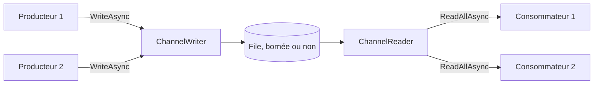

La partie 2 du cours porte sur le transfert de données entre morceaux de code concurrents. La leçon 3 a montré ce que fait un seul `await` ; il y a maintenant des producteurs et des consommateurs qui s'exécutent en même temps, à des vitesses différentes, et les questions changent. Que se passe-t-il quand le producteur va plus vite que le consommateur ? Qui remarque qu'un côté a échoué ? Qu'est-ce qui arrête l'autre côté quand l'un des deux abandonne ?

.NET a quatre réponses, et les quatre leçons suivantes les prennent une à une : les channels ici, TPL Dataflow dans la leçon 7, Rx.NET dans la leçon 8, et `IAsyncEnumerable` avec une comparaison des quatre dans la leçon 9. Un [channel](https://learn.microsoft.com/dotnet/core/extensions/channels) est la plus simple : une file thread-safe avec un écrivain asynchrone à un bout et un lecteur asynchrone à l'autre. Si vous connaissez Java, c'est une `BlockingQueue` dont `put` et `take` ne bloquent pas de thread. Si vous connaissez Reactor, le [cours Spring Boot, Spring Cloud et Reactor](../../spring-cloud-reactor/03-reactor-under-the-hood/#backpressure) montre le même problème vu de l'autre côté, avec des signaux de demande au lieu d'une file.

Guitar Alchemist utilise des channels à deux endroits, et les deux sont de bonnes études de cas : ils fonctionnent quand tout va bien, et ils se bloquent ou continuent de travailler pour personne quand ce n'est pas le cas.

Les liens vers GA pointent sur le commit [`a826864`](https://github.com/GuitarAlchemist/ga/tree/a826864f3a012cad88e415954bf57eca0ce12aa6) ; les liens vers le runtime pointent sur le commit [`4271d88`](https://github.com/dotnet/runtime/tree/4271d88e0aebf3d04f188f1334c2220d80555ef6) de `dotnet/runtime`, étiqueté `v10.0.12`.

## Exécuter le programme de la leçon

```bash
bash code/csharp-advanced/check.sh                                   # toutes les leçons, comparées avec expected/
dotnet run --project code/csharp-advanced/Advanced -c Release -- l6  # cette leçon seulement, après check.sh
```

Le code se trouve dans [`Advanced/Lesson6.cs`](https://github.com/spareilleux/learn/blob/b4d713f86711b770a75d7504f334c5871c95f820/code/csharp-advanced/Advanced/Lesson6.cs). Toutes les sorties ci-dessous viennent de [`expected/l6.txt`](https://github.com/spareilleux/learn/blob/b4d713f86711b770a75d7504f334c5871c95f820/code/csharp-advanced/expected/l6.txt), comparé sous Linux, Windows et macOS. Un programme concurrent est difficile à rendre déterministe, alors le programme ne se fie jamais au temps pour décider de ce qu'il affiche : il retient une tâche avec un `TaskCompletionSource`, attend un état qui ne peut plus changer, ou affiche une comparaison plutôt qu'un compte. Les quelques lignes qui dépendent de la machine commencent par `# ` et ne sont pas comparées.

## Une file à deux bouts

[`Channel<T>`](https://learn.microsoft.com/dotnet/api/system.threading.channels.channel-1) n'est qu'une paire : un [`ChannelWriter<T>`](https://learn.microsoft.com/dotnet/api/system.threading.channels.channelwriter-1) et un [`ChannelReader<T>`](https://learn.microsoft.com/dotnet/api/system.threading.channels.channelreader-1). Vous donnez l'écrivain au code qui produit et le lecteur au code qui consomme, pour qu'aucun ne puisse faire le travail de l'autre. Les méthodes de fabrique statiques de [`Channel`](https://learn.microsoft.com/dotnet/api/system.threading.channels.channel) choisissent l'implémentation d'après les options passées :

```text
== Which channel you get
CreateUnbounded<int>()                       UnboundedChannel<T>                  CanCount True, CanPeek True
CreateUnbounded<int>(SingleReader = true)    SingleConsumerUnboundedChannel<T>    CanCount False, CanPeek True
CreateBounded<int>(10)                       BoundedChannel<T>                    CanCount True, CanPeek True
CreateBounded<int>(10, SingleReader = true)  BoundedChannel<T>                    CanCount True, CanPeek True
CreateUnboundedPrioritized<int>()            UnboundedPrioritizedChannel<T>       CanCount True, CanPeek True
```



- Les channels **non bornés** acceptent chaque écriture immédiatement. La file grossit tant que le consommateur est plus lent.
- Les channels **bornés** ont une capacité, et une politique pour quand elle est atteinte.
- `SingleReader = true` promet qu'un seul consommateur lit à la fois. Un channel non borné reçoit en échange une implémentation plus légère, `SingleConsumerUnboundedChannel`, qui ne sait pas compter ses éléments : `Reader.Count` lève `NotSupportedException`, ce qui compte pour l'étude de cas de GA plus bas. Un channel borné garde la même implémentation.
- [`CreateUnboundedPrioritized`](https://learn.microsoft.com/dotnet/api/system.threading.channels.channel.createunboundedprioritized), ajouté dans .NET 9, rend les éléments dans l'ordre d'un comparateur au lieu de l'ordre d'écriture.

Les options sont des promesses, pas des vérifications : un channel `SingleReader` lu par deux consommateurs à la fois n'est pas détecté, il se comporte simplement mal.

## Backpressure : un channel borné fait attendre l'écrivain

Un channel borné de capacité 2, dans le mode par défaut, [`BoundedChannelFullMode.Wait`](https://learn.microsoft.com/dotnet/api/system.threading.channels.boundedchannelfullmode). Le programme écrit quatre accords sans lire, puis en lit un :

```csharp
static async Task Backpressure()
{
    Title("Backpressure: a bounded channel of capacity 2 makes the writer wait");
    var channel = Channel.CreateBounded<string>(new BoundedChannelOptions(2) { FullMode = BoundedChannelFullMode.Wait });
    var writes = new List<Task>();
    foreach (var chord in Progression)
    {
        var write = channel.Writer.WriteAsync(chord);
        Line($"WriteAsync({chord}): completed {write.IsCompleted}, Reader.Count {channel.Reader.Count}");
        writes.Add(write.AsTask());
    }

    Line($"TryWrite(Dm7): {channel.Writer.TryWrite("Dm7")}");
    var first = await channel.Reader.ReadAsync();
    Line($"ReadAsync: {first}; Reader.Count {channel.Reader.Count}, Cmaj7 moved in from the waiting writer");
    await writes[2];
    Line($"WriteAsync(Cmaj7) has completed; WriteAsync(A7) still waiting {!writes[3].IsCompleted}");

    var rest = new List<string> { first };
    for (var i = 1; i < Progression.Length; i++)
    {
        rest.Add(await channel.Reader.ReadAsync());
    }

    await Task.WhenAll(writes);
    Line($"the reader got {string.Join(" ", rest)}, in the order written");
}
```

```text
== Backpressure: a bounded channel of capacity 2 makes the writer wait
WriteAsync(Dm7): completed True, Reader.Count 1
WriteAsync(G7): completed True, Reader.Count 2
WriteAsync(Cmaj7): completed False, Reader.Count 2
WriteAsync(A7): completed False, Reader.Count 2
TryWrite(Dm7): False
ReadAsync: Dm7; Reader.Count 2, Cmaj7 moved in from the waiting writer
WriteAsync(Cmaj7) has completed; WriteAsync(A7) still waiting True
the reader got Dm7 G7 Cmaj7 A7, in the order written
```

- Les deux premières écritures se sont terminées de façon synchrone. Les deux suivantes ont renvoyé un `ValueTask` non terminé : l'écrivain l'attend, et aucun thread n'est bloqué pendant l'attente.
- `TryWrite` est la version synchrone, et renvoie `false` quand le channel est plein.
- Lire `Dm7` a libéré de la place, et le channel y a aussitôt placé l'élément du premier écrivain en attente : le compte est revenu à 2, et `WriteAsync(Cmaj7)` s'est terminé. `A7` attend encore la lecture suivante.
- Le lecteur a reçu les accords dans l'ordre d'écriture : les écrivains en attente forment aussi une file.

C'est la *backpressure* : un consommateur lent ralentit le producteur, au lieu de laisser les éléments s'accumuler en mémoire. Avec `IAsyncEnumerable`, que couvre la leçon 9, elle est automatique parce que le consommateur tire. Avec un channel, c'est un choix que vous faites en le créant.

## Quand le channel est plein

`Wait` n'est pas la seule politique. Les trois autres ne font jamais attendre l'écrivain, et jettent un élément à la place. Le programme écrit 1 à 6 dans un channel de capacité 3 avec `TryWrite`, dans chaque mode, et passe le callback `itemDropped` de [`Channel.CreateBounded`](https://learn.microsoft.com/dotnet/api/system.threading.channels.channel.createbounded#system-threading-channels-channel-createbounded-1(system-threading-channels-boundedchanneloptions-system-action((-0)))) pour voir ce qui disparaît :

```text
== A full channel: BoundedChannelFullMode, capacity 3, TryWrite 1 to 6
Wait         TryWrite true  true  true  false false false reader gets 1 2 3  dropped -
DropNewest   TryWrite true  true  true  true  true  true  reader gets 1 2 6  dropped 3 4 5
DropOldest   TryWrite true  true  true  true  true  true  reader gets 4 5 6  dropped 1 2 3
DropWrite    TryWrite true  true  true  true  true  true  reader gets 1 2 3  dropped 4 5 6
```

- **`Wait`** refuse l'écriture : `TryWrite` renvoie `false`, et `WriteAsync` attendrait.
- **`DropNewest`** retire l'élément le plus récent *déjà dans le channel*, et accepte le nouveau : 3, 4 et 5 ont chacun été écrits, puis jetés par l'écriture suivante.
- **`DropOldest`** retire l'élément qui attend depuis le plus longtemps : le lecteur reçoit les trois dernières valeurs. C'est le mode « dernières mesures seulement », comme la position d'un curseur.
- **`DropWrite`** jette l'élément en cours d'écriture, et le lecteur garde les trois premiers.

Dans les trois modes qui jettent, `TryWrite` renvoie `true` pour un élément jeté. La [source du channel](https://github.com/dotnet/runtime/blob/4271d88e0aebf3d04f188f1334c2220d80555ef6/src/libraries/System.Threading.Channels/src/System/Threading/Channels/BoundedChannel.cs#L418-L442) le dit dans un commentaire : « Just ignore the item being added but say we added it ». Le cours Reactor [est tombé dans le même piège](../../spring-cloud-reactor/03-reactor-under-the-hood/#backpressure) avec `DropWrite`. Le callback `itemDropped`, disponible depuis .NET 6, est le seul endroit où vous apprenez la perte ; le channel l'appelle après avoir relâché son verrou, si bien que le callback peut prendre son temps sans bloquer les autres écrivains.

## Complétion et erreurs

Un producteur signale la fin avec [`Writer.Complete()`](https://learn.microsoft.com/dotnet/api/system.threading.channels.channelwriter-1.complete). Compléter ne vide pas le channel : le lecteur draine d'abord ce qui a été écrit.

```text
== Completion: the reader drains what was written, then sees the end
after Complete(): Reader.Count 2, Reader.Completion.IsCompleted False
ReadAllAsync: Dm7 G7; Reader.Completion RanToCompletion
WaitToReadAsync: False, TryRead: False
```

`Reader.Completion` est une tâche qui se termine une fois le channel à la fois complété et vide, et `WaitToReadAsync` renvoie alors `false`, c'est ainsi que `ReadAllAsync` sait quand s'arrêter ([`ChannelReader.cs#L103-L112`](https://github.com/dotnet/runtime/blob/4271d88e0aebf3d04f188f1334c2220d80555ef6/src/libraries/System.Threading.Channels/src/System/Threading/Channels/ChannelReader.cs#L103-L112)).

Un producteur qui échoue peut passer son exception à `Complete` :

```text
== Completion with an error
ReadAllAsync: Dm7 G7, then InvalidOperationException: the chord source failed
ReadAsync: ChannelClosedException: The channel has been closed. (inner InvalidOperationException: the chord source failed)
Reader.Completion: Faulted, InvalidOperationException: the chord source failed
WriteAsync after Complete: ChannelClosedException: The channel has been closed. (inner InvalidOperationException: the chord source failed)
TryWrite after Complete: False, TryComplete: False, Complete: ChannelClosedException: The channel has been closed.
```

- Le lecteur reçoit quand même les deux accords écrits avant l'échec.
- `await foreach` sur `ReadAllAsync` lève ensuite la propre `InvalidOperationException` du producteur. Un `ReadAsync` direct lève une `ChannelClosedException` qui l'enveloppe. La différence vient de la source : `WaitToReadAsync`, qu'utilise `ReadAllAsync`, renvoie une tâche en échec avec l'exception stockée ([`UnboundedChannel.cs#L159-L166`](https://github.com/dotnet/runtime/blob/4271d88e0aebf3d04f188f1334c2220d80555ef6/src/libraries/System.Threading.Channels/src/System/Threading/Channels/UnboundedChannel.cs#L159-L166)), tandis que `ReadAsync` l'enveloppe ([`ChannelUtilities.cs#L361-L364`](https://github.com/dotnet/runtime/blob/4271d88e0aebf3d04f188f1334c2220d80555ef6/src/libraries/System.Threading.Channels/src/System/Threading/Channels/ChannelUtilities.cs#L361-L364)). Attrapez les deux quand vous lisez des deux façons.
- Écrire dans un channel complété lève `ChannelClosedException` ; `TryWrite` renvoie `false`.
- Un second `Complete` lève une exception, et `TryComplete` renvoie `false`. Quand plusieurs morceaux de code peuvent compléter le même channel, le producteur et un gestionnaire d'erreurs par exemple, utilisez `TryComplete`.

La règle à retenir : **si personne n'appelle `Complete`, le lecteur attend indéfiniment.** Un channel ne sait pas que son producteur a planté. Les deux études de cas de GA plus bas se ramènent à cela.

## Plusieurs producteurs, plusieurs consommateurs

Trois producteurs écrivent 100 éléments chacun dans un channel borné de capacité 2, et deux consommateurs le lisent :

```csharp
static async Task ProducersAndConsumers()
{
    Title("Three producers, two consumers, one bounded channel");
    var channel = Channel.CreateBounded<(int Producer, int Index)>(new BoundedChannelOptions(2) { SingleReader = false, SingleWriter = false });
    var received = new List<(int Consumer, int Producer, int Index)>();

    var consumers = Enumerable.Range(1, 2).Select(consumer => Task.Run(async () =>
    {
        await foreach (var (producer, index) in channel.Reader.ReadAllAsync())
        {
            lock (received)
            {
                received.Add((consumer, producer, index));
            }
        }
    })).ToList();

    var producers = Enumerable.Range(1, 3).Select(producer => Task.Run(async () =>
    {
        for (var index = 0; index < 100; index++)
        {
            await channel.Writer.WriteAsync((producer, index));
        }
    })).ToList();

    try
    {
        await Task.WhenAll(producers);
        channel.Writer.Complete();
    }
    catch (Exception e)
    {
        channel.Writer.Complete(e);
    }

    await Task.WhenAll(consumers);

    var everyItemOnce = received.Select(r => (r.Producer, r.Index)).Distinct().Count() == 300 && received.Count == 300;
    var inOrderPerProducerAndConsumer = received.GroupBy(r => (r.Consumer, r.Producer)).All(g => g.Select(r => r.Index).SequenceEqual(g.Select(r => r.Index).Order()));
    Line($"300 items written, received {received.Count}, each exactly once: {everyItemOnce}");
    Line($"each consumer saw each producer's items in the order written: {inOrderPerProducerAndConsumer}");
    Machine($"consumer 1 read {received.Count(r => r.Consumer == 1)}, consumer 2 read {received.Count(r => r.Consumer == 2)}");
}
```

```text
== Three producers, two consumers, one bounded channel
300 items written, received 300, each exactly once: True
each consumer saw each producer's items in the order written: True
```

Chaque élément est arrivé exactement une fois, et chez chaque consommateur, les éléments de chaque producteur ont gardé leur ordre. La répartition entre les consommateurs dépend de l'ordonnancement ; sur la machine de l'auteur :

```text
# consumer 1 read 91, consumer 2 read 209
```

Regardez comment l'écrivain est complété : après la fin de *tous* les producteurs, et avec l'exception si l'un d'eux a échoué. Un `Task.WhenAll(producers)` sans ce `try`/`catch` laisserait les consommateurs attendre chaque fois qu'un producteur lève une exception.

## Annulation

`WriteAsync`, `ReadAsync` et `WaitToReadAsync` acceptent un [`CancellationToken`](https://learn.microsoft.com/dotnet/api/system.threading.cancellationtoken), qui annule l'*attente*, pas le channel :

```text
== Cancellation: a write waiting for room, a read waiting for an item
WriteAsync(G7) cancelled: OperationCanceledException, e.CancellationToken == token True
Reader.Count 1: G7 was not written; the reader gets Dm7
ReadAsync on an empty channel, cancelled: OperationCanceledException: The operation was canceled.
the channel still works: TryWrite(Cmaj7) True, TryRead Cmaj7
```

L'écriture annulée n'a pas mis `G7` dans le channel, l'exception porte le jeton qui l'a annulée (la leçon 3 a montré pourquoi c'est utile), et le channel a continué de fonctionner. Pour arrêter tout un pipeline, il faut encore annuler les producteurs et compléter l'écrivain vous-même.

## Étude de cas : le générateur de voicings de GA

GA génère tous les voicings de guitare d'un manche en faisant glisser une fenêtre de quelques cases le long du manche. [`VoicingGenerator.GenerateAllVoicingsAsync`](https://github.com/GuitarAlchemist/ga/blob/a826864f3a012cad88e415954bf57eca0ce12aa6/Common/GA.Domain.Services/Fretboard/Voicings/Generation/VoicingGenerator.cs#L180-L249) le fait en parallèle : `Parallel.ForEachAsync` calcule les fenêtres et écrit la liste des voicings de chaque fenêtre dans un channel non borné, et la méthode, un itérateur asynchrone, lit le channel et rend les voicings à son appelant.

Le projet qui la contient dépend d'ONNX Runtime, d'ILGPU et d'une douzaine de paquets, trop lourd à compiler dans la CI de ce cours. Le programme reproduit plutôt la *forme* de la méthode ligne à ligne, avec les voicings remplacés par des chaînes, et un `WindowProbe` qui compte les fenêtres générées et peut en faire échouer une ([`GaShapeVoicings`](https://github.com/spareilleux/learn/blob/b4d713f86711b770a75d7504f334c5871c95f820/code/csharp-advanced/Advanced/Lesson6.cs#L239-L273)) :

```csharp
// La forme de VoicingGenerator.GenerateAllVoicingsAsync de GA, branche parallèle (VoicingGenerator.cs L180-L249) :
// des producteurs parallèles écrivent des fenêtres entières dans un channel non borné depuis Task.Run, l'écrivain est complété après la
// boucle, et la tâche productrice est attendue après la boucle du lecteur. Le contenu des fenêtres est remplacé par des chaînes.
public static async IAsyncEnumerable<string> GaShapeVoicings(int windows, WindowProbe probe,
    [EnumeratorCancellation] CancellationToken cancellationToken = default)
{
    var channel = Channel.CreateUnbounded<(int WindowIndex, List<string> Voicings)>(new()
    {
        SingleReader = true,
        SingleWriter = false
    });
    probe.Reader = channel.Reader;

    var producerTask = Task.Run(async () =>
    {
        await Parallel.ForEachAsync(
            Enumerable.Range(0, windows),
            new ParallelOptions { MaxDegreeOfParallelism = 4, CancellationToken = cancellationToken },
            async (window, ct) =>
            {
                var voicings = probe.Generate(window);
                await channel.Writer.WriteAsync((window, voicings), ct);
            });

        channel.Writer.Complete();
    }, cancellationToken);
    probe.Producer = producerTask;

    await foreach (var result in channel.Reader.ReadAllAsync(cancellationToken))
    {
        foreach (var voicing in result.Voicings)
        {
            yield return voicing;
        }
    }

    await producerTask;
}
```

Les deux affectations `probe.` servent seulement au programme à observer le channel et la tâche productrice de l'extérieur. Le reste est la structure de GA.

### Le consommateur s'arrête tôt

Les propres appelants de GA s'arrêtent tôt. L'outil en ligne de commande sort de la boucle une fois qu'il a affiché assez de voicings ([`FretboardVoicingsCLI/Program.cs#L577-L580`](https://github.com/GuitarAlchemist/ga/blob/a826864f3a012cad88e415954bf57eca0ce12aa6/Demos/Music%20Theory/FretboardVoicingsCLI/Program.cs#L577-L580)), et les exemples d'utilisation enchaînent `.Take(100)` ([`USAGE_EXAMPLES.md#L31-L41`](https://github.com/GuitarAlchemist/ga/blob/a826864f3a012cad88e415954bf57eca0ce12aa6/Demos/Music%20Theory/FretboardVoicingsCLI/USAGE_EXAMPLES.md#L31-L41)). Le programme lit un voicing sur 24 fenêtres, puis sort :

```text
== GA's voicing generator shape: the consumer stops after one voicing
one voicing read, then break
producer completed within 10 s: True; windows generated 24 of 24, left unread in the channel 23
```

Quitter un `await foreach` libère l'itérateur, ce qui termine la méthode sur son `yield return` courant : le `await producerTask` final ne s'exécute jamais. Rien ne prévient les producteurs. Ils ont généré les 24 fenêtres et les ont écrites dans un channel non borné que personne ne lira. Le travail est perdu, et chaque voicing reste en mémoire jusqu'à ce que le channel lui-même soit collecté. Dans GA, où une fenêtre contient des milliers de voicings, c'est tout le coût CPU et mémoire de la génération pour un appelant qui en voulait cent.

### Une fenêtre échoue

Maintenant la fenêtre 5 lève une exception :

```text
== GA's voicing generator shape: window 5 throws
producer: faulted with InvalidOperationException: window 5 failed
consumer finished within 1 s: False
```

`Parallel.ForEachAsync` cesse de démarrer des fenêtres et relance l'exception, la tâche productrice passe en échec, et `channel.Writer.Complete()`, à la ligne suivante, n'est jamais atteint. Le consommateur a lu les fenêtres écrites avant l'échec, puis attend une complétion qui ne viendra jamais. Il n'échoue pas : il se bloque, et l'exception reste non observée dans une tâche que personne n'attend.

### L'ordre survit-il ?

Le commentaire de la méthode dit « Use channels for parallel processing with ordering preserved » ([`VoicingGenerator.cs#L182`](https://github.com/GuitarAlchemist/ga/blob/a826864f3a012cad88e415954bf57eca0ce12aa6/Common/GA.Domain.Services/Fretboard/Voicings/Generation/VoicingGenerator.cs#L182)). Les fenêtres s'exécutent en parallèle et sont écrites quand elles se terminent, donc le channel les contient dans l'ordre de fin. Le programme retient la fenêtre 0 jusqu'à ce que le lecteur ait reçu quelque chose :

```text
== GA's voicing generator shape: does window order survive?
window 0 held until the reader got something: first voicing from window 0 False, 8 windows read True
```

Le premier voicing venait d'une autre fenêtre. Sur la machine de l'auteur, l'ordre lu était :

```text
# order read: w2-v0 w1-v0 w3-v0 w4-v0 w5-v0 w0-v0 w6-v0 w7-v0
```

Les commentaires plus bas dans la même méthode le reconnaissent (« We lose strict fret-order, but indexing doesn't care about order », [`#L219-L231`](https://github.com/GuitarAlchemist/ga/blob/a826864f3a012cad88e415954bf57eca0ce12aa6/Common/GA.Domain.Services/Fretboard/Voicings/Generation/VoicingGenerator.cs#L219-L231)) : le code est juste, le commentaire de résumé ne l'est pas. L'indice de fenêtre est écrit dans le channel avec chaque liste et jamais utilisé ; ce serait la clé pour rétablir l'ordre si un appelant en avait besoin.

### La correction

Trois changements, tous dans la méthode ([`FixedVoicings`](https://github.com/spareilleux/learn/blob/b4d713f86711b770a75d7504f334c5871c95f820/code/csharp-advanced/Advanced/Lesson6.cs#L277-L324)) :

```csharp
// Le même générateur avec un channel borné, l'erreur transmise au lecteur, et les producteurs arrêtés
// et attendus dès que le lecteur s'arrête : à la fin, sur une erreur, ou quand le consommateur part tôt
public static async IAsyncEnumerable<string> FixedVoicings(int windows, WindowProbe probe, bool cancelInFinally = true,
    [EnumeratorCancellation] CancellationToken cancellationToken = default)
{
    using var cts = CancellationTokenSource.CreateLinkedTokenSource(cancellationToken);
    var channel = Channel.CreateBounded<(int WindowIndex, List<string> Voicings)>(new BoundedChannelOptions(4)
    {
        SingleReader = true,
        SingleWriter = false
    });
    probe.Reader = channel.Reader;

    var producerTask = Task.Run(async () =>
    {
        try
        {
            await Parallel.ForEachAsync(
                Enumerable.Range(0, windows),
                new ParallelOptions { MaxDegreeOfParallelism = 4, CancellationToken = cts.Token },
                async (window, ct) => await channel.Writer.WriteAsync((window, probe.Generate(window)), ct));
            channel.Writer.Complete();
        }
        catch (Exception e)
        {
            channel.Writer.Complete(e); // le lecteur la lève au lieu d'attendre indéfiniment
        }
    });
    probe.Producer = producerTask;

    try
    {
        await foreach (var result in channel.Reader.ReadAllAsync(cts.Token))
        {
            foreach (var voicing in result.Voicings)
            {
                yield return voicing;
            }
        }
    }
    finally
    {
        if (cancelInFinally)
        {
            cts.Cancel(); // le lecteur s'est arrêté : arrêter les producteurs
        }

        await producerTask; // ne lève jamais d'exception : ses erreurs sont passées au channel
    }
}
```

- **Un channel borné.** Au plus quatre fenêtres attendent le lecteur ; un consommateur lent ralentit désormais la génération.
- **Le producteur passe son exception au channel**, si bien que le lecteur la lève au lieu d'attendre.
- **Un `finally` autour de la boucle de lecture** annule les producteurs et les attend, que le lecteur ait fini, échoué ou abandonné. Un `finally` dans un itérateur asynchrone s'exécute quand le consommateur le libère, ce que fait `await foreach` sur `break`, sur une exception, et à la fin.

```text
== Fixed generator: the consumer stops after one voicing
one voicing read, then break
producer already completed when the loop exited: True, windows generated fewer than 24: True
```

```text
== Fixed generator: window 5 throws
consumer: faulted with InvalidOperationException: window 5 failed
```

La sortie anticipée arrête maintenant les producteurs avant que la boucle rende la main, après 8 fenêtres sur la machine de l'auteur, et l'échec atteint le consommateur sous la forme de l'exception d'origine.

## Étude de cas : la commande d'indexation de GA

[`IndexVoicingsCommand`](https://github.com/GuitarAlchemist/ga/blob/a826864f3a012cad88e415954bf57eca0ce12aa6/GaCLI/Commands/IndexVoicingsCommand.cs#L158-L251) stocke des voicings dans MongoDB et Qdrant. Des producteurs parallèles calculent l'entité de chaque voicing et l'écrivent dans un channel borné en mode `Wait` ; un seul consommateur le lit et fait des upserts par lots de 1 000. Le channel est borné et en mode `Wait`, ce qui est juste : c'est la base de données qui donne le rythme. Chaque côté attrape ses propres exceptions et les journalise. Le programme garde cette structure avec des lots de 4 et une capacité de 8 ([`GaShapeIndex`](https://github.com/spareilleux/learn/blob/b4d713f86711b770a75d7504f334c5871c95f820/code/csharp-advanced/Advanced/Lesson6.cs#L427-L478)), et fait échouer le premier upsert, comme le ferait une base de données arrêtée :

```text
== GA's index command shape: the first batch upsert fails
command finished within 1 s: False
upserts tried 1, Reader.Count 8 (capacity 8), log: Error in DB Writer Consumer: database unavailable
```

Le consommateur a journalisé l'erreur et rendu la main, comme le dit son `catch`. Les producteurs n'en ont rien su : ils ont rempli le channel jusqu'à sa capacité de 8, et les écrivains suivants attendent une place qu'aucun lecteur ne libérera jamais. `Parallel.ForEachAsync` ne se termine jamais, la commande n'atteint jamais `Writer.Complete()`, et la barre de progression s'arrête pour toujours. Le `catch` par élément des producteurs n'y peut rien, car rien ne lève d'exception : une écriture qui attend n'est pas une erreur.

La correction consiste à laisser l'échec du consommateur remonter jusqu'aux écrivains ([`FixedIndex`](https://github.com/spareilleux/learn/blob/b4d713f86711b770a75d7504f334c5871c95f820/code/csharp-advanced/Advanced/Lesson6.cs#L481-L525)) :

```csharp
catch (Exception ex)
{
    channel.Writer.TryComplete(ex); // les écrivains qui attendent une place reçoivent une ChannelClosedException
    throw;
}
```

Compléter le channel du côté du consommateur fait échouer toutes les écritures en attente et à venir avec une `ChannelClosedException`. Les producteurs s'arrêtent, la commande attrape cette exception, et attendre le consommateur relance la vraie cause :

```text
== Fixed index command: the first batch upsert fails
command: faulted with IOException: database unavailable, upserts tried 1
```

## Si vous connaissez Spring et Reactor

Reactor n'a pas besoin d'une file entre deux étapes : un abonné dit au publisher combien d'éléments il veut, avec `request(n)`. La [section backpressure du cours Reactor](../../spring-cloud-reactor/03-reactor-under-the-hood/#backpressure) montre ces signaux. Les channels obtiennent le même effet en faisant attendre l'écrivain. Quand une source ne peut pas ralentir, les deux ont des stratégies, et elles se correspondent de près :

| Channels | Reactor | Java |
|---|---|---|
| `Channel.CreateBounded(n)`, mode `Wait` | la demande avec `request(n)` ; `limitRate(n)` pour la regrouper | `ArrayBlockingQueue.put`, qui bloque un thread |
| `Channel.CreateUnbounded()` | `onBackpressureBuffer()` | `LinkedBlockingQueue` |
| `DropWrite` | `onBackpressureDrop()`, ou `onBackpressureBuffer(n, onOverflow, BufferOverflowStrategy.DROP_LATEST)` | `offer` qui renvoie `false` |
| `DropOldest` | `onBackpressureBuffer(n, onOverflow, BufferOverflowStrategy.DROP_OLDEST)` ; `onBackpressureLatest()` pour une capacité de 1 | — |
| `DropNewest` | pas d'équivalent direct | — |
| callback `itemDropped` | le callback `onOverflow` ou `onBackpressureDrop(Consumer)` | — |
| pas de mode erreur : un channel plein attend ou jette | `BufferOverflowStrategy.ERROR` signale une erreur de dépassement | `add` lève `IllegalStateException` |
| `Writer.Complete(exception)` | `onError`, qui termine la séquence | rien : un élément « pilule empoisonnée » par convention |
| `Reader.Completion` | le signal terminal, `doOnTerminate` | — |

Les noms viennent de la Javadoc de [`Flux`](https://projectreactor.io/docs/core/release/api/reactor/core/publisher/Flux.html) et de [`BufferOverflowStrategy`](https://projectreactor.io/docs/core/release/api/reactor/core/publisher/BufferOverflowStrategy.html) : `DROP_LATEST` jette l'élément qui vient d'arriver, comme `DropWrite`, et non l'élément le plus récent déjà en tampon. Les bugs de GA ci-dessus ne se produisent pas tels quels avec Reactor, parce qu'une erreur descend le pipeline et qu'une annulation le remonte sans aucun code de votre part. Ils reviennent dès qu'un pipeline Reactor confie ses éléments à une file écrite à la main.

## Exercices

1. Un channel borné de capacité 2 en mode `DropOldest` reçoit `Dm7`, `G7`, `Cmaj7` et `A7` avec `TryWrite`, puis est complété. Que reçoit le lecteur, et qu'est-ce qui part dans le callback `itemDropped` ?
2. La commande d'indexation de GA rassemble 1 000 éléments avant chaque upsert, même quand les producteurs sont lents, si bien que les premières lignes arrivent tard en base. Écrivez `ReadBatchesAsync(reader, max)`, un itérateur asynchrone qui attend au moins un élément, puis prend ce qui est déjà dans le channel, jusqu'à `max`, et rend ce lot.
3. Dans `FixedVoicings`, retirez le `cts.Cancel()` du bloc `finally`, gardez le `await producerTask`, et quittez la boucle après un voicing. Que se passe-t-il, et pourquoi ?

<details>
<summary>Solutions</summary>

1. Le lecteur reçoit `Cmaj7 A7`, et le callback reçoit `Dm7` puis `G7` : chaque écriture au-delà de la capacité chasse l'élément qui attend depuis le plus longtemps.

    ```text
    1. DropOldest, capacity 2: reader gets Cmaj7 A7, dropped Dm7 G7
    ```

2. `WaitToReadAsync` attend le premier élément, et `TryRead` prend les autres sans attendre ([`ReadBatchesAsync`](https://github.com/spareilleux/learn/blob/b4d713f86711b770a75d7504f334c5871c95f820/code/csharp-advanced/Advanced/Lesson6.cs#L579-L592)) :

    ```csharp
    // Exercice 2 : attend au moins un élément, puis prend ce qui est déjà là, jusqu'à max
    public static async IAsyncEnumerable<List<T>> ReadBatchesAsync<T>(ChannelReader<T> reader, int max,
        [EnumeratorCancellation] CancellationToken cancellationToken = default)
    {
        while (await reader.WaitToReadAsync(cancellationToken))
        {
            var batch = new List<T>(max);
            while (batch.Count < max && reader.TryRead(out var item))
            {
                batch.Add(item);
            }

            yield return batch;
        }
    }
    ```

    Avec dix éléments déjà dans le channel et un maximum de 4 :

    ```text
    2. ReadBatchesAsync(max 4) over 1 to 10: [1 2 3 4] [5 6 7 8] [9 10]
    ```

    Quand les producteurs sont lents, les lots rapetissent et partent plus tôt ; quand ils sont rapides, les lots se remplissent. Le consommateur n'attend jamais un lot complet.

3. Quitter la boucle libère l'itérateur, et le bloc `finally` attend une tâche productrice qui ne se termine jamais. Les producteurs continuent d'écrire dans le channel borné jusqu'à ce qu'il soit plein, puis attendent une place ; plus personne ne lit, donc ils attendent indéfiniment, et `DisposeAsync` aussi. Le `break` du consommateur se bloque. Le channel borné a réglé le problème de mémoire, et sans l'annulation il a transformé la fuite en interblocage.

    ```text
    3. without cts.Cancel() in finally, leaving after one voicing: DisposeAsync completed within 1 s False, Reader.Count 4 (capacity 4)
    ```

</details>

## À retenir

- Un channel est une file thread-safe avec un écrivain et un lecteur asynchrones. Choisissez borné ou non borné, et pour un channel borné, ce que fait un channel plein.
- Un channel borné en mode `Wait` vous donne la backpressure : l'écrivain attend, sans bloquer de thread, que le lecteur fasse de la place.
- Les modes qui jettent font renvoyer `true` à `TryWrite` pour les éléments jetés ; passez un callback `itemDropped` si une perte de données doit se remarquer.
- `Complete` ne jette pas les éléments. `Complete(exception)` fait relancer cette exception par `ReadAllAsync` après les éléments restants, et lever par `ReadAsync` une `ChannelClosedException` qui l'enveloppe.
- Si personne ne complète l'écrivain, le lecteur attend indéfiniment : complétez-le sur tous les chemins, échecs compris, et avec `TryComplete` quand plusieurs chemins le peuvent.
- Un consommateur qui s'arrête, par `break`, par une exception ou par `Take`, n'arrête pas les producteurs. Annulez-les dans un `finally`, et complétez le channel du côté du consommateur quand il échoue.
- `SingleReader` et `SingleWriter` sont des promesses qui achètent une implémentation plus rapide ; le channel non borné à lecteur unique ne sait pas compter ses éléments.

## Sources

- Microsoft Learn : [Channels](https://learn.microsoft.com/dotnet/core/extensions/channels), [`Channel.CreateBounded`](https://learn.microsoft.com/dotnet/api/system.threading.channels.channel.createbounded), [`BoundedChannelFullMode`](https://learn.microsoft.com/dotnet/api/system.threading.channels.boundedchannelfullmode), [`ChannelWriter<T>.TryComplete`](https://learn.microsoft.com/dotnet/api/system.threading.channels.channelwriter-1.trycomplete), [`Parallel.ForEachAsync`](https://learn.microsoft.com/dotnet/api/system.threading.tasks.parallel.foreachasync).
- Stephen Toub, [An Introduction to System.Threading.Channels](https://devblogs.microsoft.com/dotnet/an-introduction-to-system-threading-channels/), sur le blog .NET.
- dotnet/runtime à `v10.0.12` (commit `4271d88`) : [`BoundedChannel.cs`](https://github.com/dotnet/runtime/blob/4271d88e0aebf3d04f188f1334c2220d80555ef6/src/libraries/System.Threading.Channels/src/System/Threading/Channels/BoundedChannel.cs#L418-L442), [`UnboundedChannel.cs`](https://github.com/dotnet/runtime/blob/4271d88e0aebf3d04f188f1334c2220d80555ef6/src/libraries/System.Threading.Channels/src/System/Threading/Channels/UnboundedChannel.cs#L159-L166), [`ChannelUtilities.cs`](https://github.com/dotnet/runtime/blob/4271d88e0aebf3d04f188f1334c2220d80555ef6/src/libraries/System.Threading.Channels/src/System/Threading/Channels/ChannelUtilities.cs#L361-L364), [`ChannelReader.cs`](https://github.com/dotnet/runtime/blob/4271d88e0aebf3d04f188f1334c2220d80555ef6/src/libraries/System.Threading.Channels/src/System/Threading/Channels/ChannelReader.cs#L103-L112).
- Reactor : Javadoc de [`Flux`](https://projectreactor.io/docs/core/release/api/reactor/core/publisher/Flux.html) et de [`BufferOverflowStrategy`](https://projectreactor.io/docs/core/release/api/reactor/core/publisher/BufferOverflowStrategy.html), [guide de référence de Reactor](https://projectreactor.io/docs/core/release/reference/).
- Guitar Alchemist à `a826864` : [`VoicingGenerator.cs`](https://github.com/GuitarAlchemist/ga/blob/a826864f3a012cad88e415954bf57eca0ce12aa6/Common/GA.Domain.Services/Fretboard/Voicings/Generation/VoicingGenerator.cs#L180-L249), [`IndexVoicingsCommand.cs`](https://github.com/GuitarAlchemist/ga/blob/a826864f3a012cad88e415954bf57eca0ce12aa6/GaCLI/Commands/IndexVoicingsCommand.cs#L158-L251), [`FretboardVoicingsCLI/Program.cs`](https://github.com/GuitarAlchemist/ga/blob/a826864f3a012cad88e415954bf57eca0ce12aa6/Demos/Music%20Theory/FretboardVoicingsCLI/Program.cs#L577-L580).
