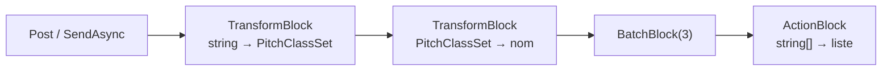

Un channel est une file. Dès qu'un pipeline a plusieurs étapes, chacune avec son degré de parallélisme, son tampon et son regroupement, vous écrivez la même tuyauterie encore et encore : un channel par étape, une boucle par consommateur, un `Complete` par écrivain, et un chemin d'erreur pour chacun. [TPL Dataflow](https://learn.microsoft.com/dotnet/standard/parallel-programming/dataflow-task-parallel-library) emballe cette tuyauterie sous forme de *blocs* que vous reliez entre eux. Il est plus ancien que les channels, puisqu'il a d'abord été livré comme paquet NuGet pour .NET Framework 4.5, et c'est toujours la bibliothèque de pipelines la plus complète de .NET.

Cette leçon construit un petit pipeline sur les [`PitchClassSet`](https://github.com/GuitarAlchemist/ga/blob/a826864f3a012cad88e415954bf57eca0ce12aa6/Common/GA.Domain.Core/Theory/Atonal/PitchClassSet.cs) de Guitar Alchemist, vérifie ce que fait chaque option, puis examine la propre démo Dataflow de GA et la commande d'indexation de la leçon 6 reconstruite avec des blocs. Les règles qui comptent le plus portent sur l'échec : où va une exception, et où elle ne va pas.

Les liens vers GA pointent sur le commit [`a826864`](https://github.com/GuitarAlchemist/ga/tree/a826864f3a012cad88e415954bf57eca0ce12aa6) ; les liens vers le runtime pointent sur le commit [`4271d88`](https://github.com/dotnet/runtime/tree/4271d88e0aebf3d04f188f1334c2220d80555ef6) de `dotnet/runtime`, étiqueté `v10.0.12`.

## Exécuter le programme de la leçon

```bash
bash code/csharp-advanced/check.sh                                   # toutes les leçons, comparées avec expected/
dotnet run --project code/csharp-advanced/Advanced -c Release -- l7  # cette leçon seulement, après check.sh
```

Le code se trouve dans [`Advanced/Lesson7.cs`](https://github.com/spareilleux/learn/blob/b4d713f86711b770a75d7504f334c5871c95f820/code/csharp-advanced/Advanced/Lesson7.cs), et sa sortie est comparée avec [`expected/l7.txt`](https://github.com/spareilleux/learn/blob/b4d713f86711b770a75d7504f334c5871c95f820/code/csharp-advanced/expected/l7.txt) sur trois systèmes d'exploitation.

```text
== Where the types come from
TransformBlock<,>: System.Threading.Tasks.Dataflow, in the shared framework True
```

L'assembly `System.Threading.Tasks.Dataflow` est livrée dans le framework partagé de .NET, donc un projet .NET 10 n'a besoin d'aucun paquet pour elle. Les deux projets de démo de GA qui utilisent Dataflow référencent pourtant le paquet [`System.Threading.Tasks.Dataflow`](https://www.nuget.org/packages/System.Threading.Tasks.Dataflow), version 9.0.10 ([`PerformanceOptimizationDemo.csproj#L18`](https://github.com/GuitarAlchemist/ga/blob/a826864f3a012cad88e415954bf57eca0ce12aa6/Demos/Performance/PerformanceOptimizationDemo/PerformanceOptimizationDemo.csproj#L18)), une copie plus ancienne de ce que le framework fournit déjà. Dans un nouveau projet `net10.0` sur la machine de l'auteur, cette référence se restaure avec l'avertissement NU1510, « PackageReference System.Threading.Tasks.Dataflow will not be pruned. Consider removing this package from your dependencies, as it is likely unnecessary », et le programme charge quand même la `System.Threading.Tasks.Dataflow.dll` du framework depuis `shared/Microsoft.NETCore.App/10.0.12`.

## Blocs et liens

Un bloc est un petit acteur avec un tampon d'entrée, un traitement et un tampon de sortie. Ceux qu'utilise cette leçon :

| Bloc | Entrée | Sortie | Rôle |
|---|---|---|---|
| [`TransformBlock<TIn, TOut>`](https://learn.microsoft.com/dotnet/api/system.threading.tasks.dataflow.transformblock-2) | un élément | un élément | exécute une fonction, synchrone ou `async` |
| [`TransformManyBlock<TIn, TOut>`](https://learn.microsoft.com/dotnet/api/system.threading.tasks.dataflow.transformmanyblock-2) | un élément | zéro élément ou plus | `SelectMany` sous forme de bloc |
| [`BatchBlock<T>`](https://learn.microsoft.com/dotnet/api/system.threading.tasks.dataflow.batchblock-1) | des éléments | des tableaux de `n` éléments | regroupe ; le dernier lot peut être plus court |
| [`BufferBlock<T>`](https://learn.microsoft.com/dotnet/api/system.threading.tasks.dataflow.bufferblock-1) | des éléments | les mêmes éléments | une file que l'on peut relier |
| [`ActionBlock<T>`](https://learn.microsoft.com/dotnet/api/system.threading.tasks.dataflow.actionblock-1) | des éléments | rien | la fin d'un pipeline |

`LinkTo` relie une source à une cible, et [`DataflowLinkOptions.PropagateCompletion`](https://learn.microsoft.com/dotnet/api/system.threading.tasks.dataflow.dataflowlinkoptions.propagatecompletion) fait compléter la cible quand la source se complète. Le pipeline analyse des chaînes de classes de hauteurs, nomme chaque ensemble avec son étiquette dans le catalogue d'Allen Forte, regroupe les noms par trois et écrit les groupes :



```csharp
static async Task Pipeline()
{
    Title("A pipeline: parse, describe, batch by 3, write");
    var parse = new TransformBlock<string, PitchClassSet>(s => PitchClassSet.Parse(s));
    var describe = new TransformBlock<PitchClassSet, string>(Named);
    var batch = new BatchBlock<string>(3);
    var written = new List<string>();
    var write = new ActionBlock<string[]>(names => written.Add($"[{string.Join(", ", names)}]"));

    parse.LinkTo(describe, Propagate);
    describe.LinkTo(batch, Propagate);
    batch.LinkTo(write, Propagate);

    foreach (var chord in Progression.Concat(Progression.Take(3)))
    {
        parse.Post(chord);
    }

    parse.Complete();
    await write.Completion;
    foreach (var line in written)
    {
        Line(line);
    }

    Line($"Completion: parse {parse.Completion.Status}, describe {describe.Completion.Status}, batch {batch.Completion.Status}, write {write.Completion.Status}");
    var labels = Progression.Select(s => PitchClassSet.Parse(s)).Select(set => $"{set.Name}: {ProgrammaticForteCatalog.GetForteNumber(set)}");
    Line($"the same sets in GA's ProgrammaticForteCatalog: {string.Join(", ", labels)}");
}
```

```text
== A pipeline: parse, describe, batch by 3, write
[0 2 5 9 (4-26), 2 5 7 E (4-27), 0 4 7 E (4-20)]
[0 4 7 9 (4-26), 0 2 5 9 (4-26), 2 5 7 E (4-27)]
[0 4 7 E (4-20)]
Completion: parse RanToCompletion, describe RanToCompletion, batch RanToCompletion, write RanToCompletion
the same sets in GA's ProgrammaticForteCatalog: 0 2 5 9: 4-3, 2 5 7 E: 4-2, 0 4 7 E: 4-9, 0 4 7 9: 4-3
```

La progression est ii–V–I–vi en do, Dm7, G7, Cmaj7 et Am7, puis de nouveau ses trois premiers accords : sept ensembles, donc deux lots complets et un dernier d'un seul ensemble. Appeler `Complete` sur le premier bloc a suffi à terminer tout le pipeline, un lien après l'autre, et `await write.Completion` a attendu le tout.

Les étiquettes viennent du [`CanonicalForteCatalog`](https://github.com/GuitarAlchemist/ga/blob/a826864f3a012cad88e415954bf57eca0ce12aa6/Common/GA.Domain.Core/Theory/Atonal/CanonicalForteCatalog.cs#L3-L20) de GA : 4-26 pour les accords de septième mineure, 4-27 pour la septième de dominante, 4-20 pour la septième majeure. La dernière ligne montre pourquoi le programme n'utilise pas [`ProgrammaticForteCatalog`](https://github.com/GuitarAlchemist/ga/blob/a826864f3a012cad88e415954bf57eca0ce12aa6/Common/GA.Domain.Core/Theory/Atonal/ProgrammaticForteCatalog.cs#L5-L19), dont la leçon 4 a mesuré le dictionnaire figé : ses valeurs `ForteNumber` suivent l'ordre de Rahn, et donnent 4-3 là où la table de Forte dit 4-26. Sa documentation qualifie les différences de « mineures » ; pour ces accords, aucun numéro ne correspond.

## Parallélisme et ordre

Par défaut, un bloc traite un élément à la fois. [`MaxDegreeOfParallelism`](https://learn.microsoft.com/dotnet/api/system.threading.tasks.dataflow.executiondataflowblockoptions.maxdegreeofparallelism) lui permet d'en traiter plusieurs, et [`EnsureOrdered`](https://learn.microsoft.com/dotnet/api/system.threading.tasks.dataflow.dataflowblockoptions.ensureordered), `true` par défaut, décide si les sorties gardent l'ordre des entrées. Le programme poste quatre éléments dans un bloc à quatre degrés de parallélisme, retient l'élément 0 jusqu'à ce que les trois autres aient fini, et tente de recevoir pendant une demi-seconde tant que l'élément 0 s'exécute ([`HoldFirst`](https://github.com/spareilleux/learn/blob/b4d713f86711b770a75d7504f334c5871c95f820/code/csharp-advanced/Advanced/Lesson7.cs#L75-L133)) :

```text
== MaxDegreeOfParallelism 4: items 1 to 3 have finished, item 0 is still running
EnsureOrdered = True   received while item 0 runs: nothing  then: 0 1 2 3
EnsureOrdered = False  received while item 0 runs: 1 2 3    then: 0
```

- **Dans l'ordre**, les éléments terminés 1, 2 et 3 attendent dans un tampon de réordonnancement derrière l'élément 0 ([`TransformBlock.cs#L113-L118`](https://github.com/dotnet/runtime/blob/4271d88e0aebf3d04f188f1334c2220d80555ef6/src/libraries/System.Threading.Tasks.Dataflow/src/Blocks/TransformBlock.cs#L113-L118)). Rien ne sort avant que l'élément le plus lent soit fini : le parallélisme accélère le travail, pas le premier résultat.
- **Sans ordre**, chaque élément part en sortie dès que la continuation de sa tâche s'exécute ([`TransformBlock.cs#L256-L261`](https://github.com/dotnet/runtime/blob/4271d88e0aebf3d04f188f1334c2220d80555ef6/src/libraries/System.Threading.Tasks.Dataflow/src/Blocks/TransformBlock.cs#L256-L261)). Leur ordre entre eux n'est pas garanti, c'est pourquoi le programme les trie avant de les afficher.

Une première version de ce programme cherchait à montrer que les sorties sans ordre arrivent « dans l'ordre de fin », et a échoué sur 8 exécutions sur 20 : deux éléments qui finissent presque ensemble peuvent atteindre le tampon de sortie dans n'importe quel ordre. Seul « les éléments finis n'attendent pas le lent » est fiable.

## Capacité bornée

Par défaut, chaque bloc met en tampon sans limite, comme un channel non borné. [`BoundedCapacity`](https://learn.microsoft.com/dotnet/api/system.threading.tasks.dataflow.dataflowblockoptions.boundedcapacity) limite le nombre d'éléments que contient un bloc, *y compris ceux en cours de traitement* :

```csharp
static async Task Capacity()
{
    Title("BoundedCapacity 2: Post refuses, SendAsync waits");
    var gate = new TaskCompletionSource(TaskCreationOptions.RunContinuationsAsynchronously);
    var slow = new ActionBlock<int>(async _ => await gate.Task, new ExecutionDataflowBlockOptions { BoundedCapacity = 2 });
    var posts = Enumerable.Range(1, 4).Select(i => slow.Post(i)).ToList();
    Line($"Post 1 to 4 while item 1 is running: {string.Join(" ", posts)}");
    var send = slow.SendAsync(5);
    Line($"SendAsync(5): completed {send.IsCompleted}");
    gate.SetResult();
    Line($"once item 1 finishes: SendAsync(5) returned {await send}");
    slow.Complete();
    await slow.Completion;
}
```

```text
== BoundedCapacity 2: Post refuses, SendAsync waits
Post 1 to 4 while item 1 is running: True True False False
SendAsync(5): completed False
once item 1 finishes: SendAsync(5) returned True
```

L'élément 1 s'exécute et l'élément 2 attend dans le tampon d'entrée : le bloc contient deux éléments, sa capacité. [`Post`](https://learn.microsoft.com/dotnet/api/system.threading.tasks.dataflow.dataflowblock.post) est l'entrée synchrone, et renvoie `false` quand le bloc est plein. [`SendAsync`](https://learn.microsoft.com/dotnet/api/system.threading.tasks.dataflow.dataflowblock.sendasync) renvoie une tâche qui se termine quand le bloc accepte l'élément, si bien qu'un producteur qui l'attend ralentit au rythme du bloc, comme `WriteAsync` sur un channel borné.

Le même mécanisme fonctionne entre blocs : une cible bornée *diffère* les messages que lui offre sa source, et les prend plus tard, si bien qu'une étape lente remplit les tampons en amont jusqu'à ce que le premier bloc refuse `SendAsync`. Un pipeline n'a de backpressure que si tous ses blocs sont bornés, et si le producteur au départ utilise `SendAsync` plutôt que `Post`, ou vérifie ce que renvoie `Post`.

## Erreurs : en aval des liens, jamais en amont

Un délégué qui lève une exception fait échouer son bloc. Le pipeline reçoit une chaîne qui ne s'analyse pas :

```text
== Errors: '04X7' does not parse
SendAsync(0259) True, SendAsync(04X7) True
await parse.Completion: PitchClassSetParseException: Exception of type 'GA.Domain.Core.Theory.Atonal.PitchClassSetParseException' was thrown.
after the fault: SendAsync(047E) False, Post(0479) False
parse.Completion.Exception: AggregateException > PitchClassSetParseException
describe: Faulted, results: Faulted
results.Completion.Exception: AggregateException > AggregateException > AggregateException > PitchClassSetParseException
results.OutputAvailableAsync(): False, results.Count 0
```

- La mauvaise entrée a été *acceptée* : `SendAsync` dit seulement que le bloc a pris l'élément, pas que son traitement réussira.
- Le `Completion` du bloc a échoué avec la `PitchClassSetParseException` de GA, et à partir de là le bloc refuse tout, `SendAsync` et `Post` renvoyant tous deux `false`.
- Avec `PropagateCompletion`, l'échec est descendu : le bloc suivant a échoué, et le tampon d'après aussi. Chaque lien enveloppe l'exception dans une `AggregateException` de plus, trois niveaux de profondeur au bout de ce court pipeline. Utilisez `Flatten()` ou regardez l'exception la plus interne.
- Un bloc en échec jette les éléments qu'il contient. L'ensemble `0259`, analysé avec succès avant l'échec, n'atteint jamais le tampon final : `OutputAvailableAsync` renvoie `false` et le compte est 0.

L'exception de GA ne porte aucun message : « Exception of type … was thrown. » Un journal qui dirait quelle entrée ne s'est pas analysée aurait besoin que l'analyseur la mette dans le message.

L'autre sens est le dangereux. La leçon 6 a trouvé que la commande d'indexation de GA se bloque quand son consommateur échoue, parce que les producteurs attendent toujours de la place dans un channel que personne ne lit. Le programme reconstruit cette commande avec des blocs : un `BatchBlock` de 4 avec une capacité de 8, qui alimente un `ActionBlock` qui échoue sur son premier lot, et un producteur qui s'arrête quand `SendAsync` renvoie `false` ([`IndexWithBlocks`](https://github.com/spareilleux/learn/blob/b4d713f86711b770a75d7504f334c5871c95f820/code/csharp-advanced/Advanced/Lesson7.cs#L215-L241)) :

```text
== GA's index command with blocks: the writer fails on its first batch
producer finished within 1 s: False; batch block completed False, OutputCount 2
```

L'écrivain a échoué, et rien d'autre ne s'est passé. Un lien porte la complétion de la source vers la cible, jamais de la cible vers la source : le bloc de lots n'a rien su de l'échec, la source [a délié la cible qui refuse désormais définitivement](https://learn.microsoft.com/dotnet/standard/parallel-programming/dataflow-task-parallel-library#predefined-dataflow-block-types), et ses deux lots de quatre ont rempli sa capacité de 8. Le `SendAsync` du producteur attend de la place pour toujours, exactement comme le channel de la leçon 6. Dataflow ne règle pas cela tout seul ; vous remontez l'échec à la main :

```csharp
_ = writer.Completion.ContinueWith(t => ((IDataflowBlock)batches).Fault(t.Exception!.InnerException!),
    TaskContinuationOptions.OnlyOnFaulted);
```

```text
== The same, with the writer's fault passed to the batch block
producer finished within 1 s: True, before sending all 100 items True; batch block: Faulted, IOException: database unavailable
```

[`IDataflowBlock.Fault`](https://learn.microsoft.com/dotnet/api/system.threading.tasks.dataflow.idataflowblock.fault) fait refuser au bloc de lots ses messages différés et à venir, si bien que le `SendAsync` en attente renvoie `false` et que le producteur s'arrête. Le `Completion` du bloc de lots passe à `Faulted` un instant après le retour de `Fault`, c'est pourquoi le programme l'attend avant d'afficher.

## La complétion n'est pas votre consommateur

Quand vous lisez vous-même la sortie d'un bloc, avec `ReceiveAsync` ou `TryReceive`, le `Completion` du bloc vous dit que le bloc n'a plus rien, pas que votre code en a fini avec ce qu'il a reçu. La démo de GA attend le `Completion` du dernier bloc, puis lit la liste de résultats qu'une autre tâche est encore en train de remplir. Le programme fait exprès garder le dernier élément à ce consommateur :

```csharp
static async Task CompletionIsNotYourConsumer()
{
    Title("Completion says the block is empty, not that your consumer is done");
    var block = new TransformBlock<int, int>(i => i);
    var results = new List<int>();
    var mayAddLast = new TaskCompletionSource(TaskCreationOptions.RunContinuationsAsynchronously);
    var consumer = Task.Run(async () =>
    {
        while (await block.OutputAvailableAsync())
        {
            var item = await block.ReceiveAsync();
            if (item == 2)
            {
                await mayAddLast.Task; // travaille encore sur le dernier élément
            }

            results.Add(item);
        }
    });

    block.Post(1);
    block.Post(2);
    block.Complete();
    await block.Completion;
    Line($"await block.Completion returned: results.Count {results.Count}");
    mayAddLast.SetResult();
    await consumer;
    Line($"await consumer returned: results.Count {results.Count}");
}
```

```text
== Completion says the block is empty, not that your consumer is done
await block.Completion returned: results.Count 1
await consumer returned: results.Count 2
```

`Completion` s'est terminé dès que l'élément 2 a quitté le bloc, alors que le consommateur travaillait encore dessus. Attendez la propre tâche du consommateur.

## Annulation

Un [`CancellationToken`](https://learn.microsoft.com/dotnet/api/system.threading.tasks.dataflow.dataflowblockoptions.cancellationtoken) dans les options du bloc annule le bloc, et le jeton atteint aussi le délégué par sa fermeture :

```text
== Cancellation: the token in the block options
Completion: TaskCanceledException: A task was canceled., status Canceled
Post after cancellation: False, InputCount 0
```

L'élément en cours s'est arrêté avec le jeton, l'élément en file a été jeté, et le `Completion` du bloc est `Canceled`, pas `Faulted` : le code qui l'attend reçoit une `TaskCanceledException`, à laquelle s'appliquent les règles de la leçon 3 sur le fait de laisser passer l'annulation.

## Étude de cas : la démo Dataflow de GA

Le [`PerformanceOptimizationDemo`](https://github.com/GuitarAlchemist/ga/blob/a826864f3a012cad88e415954bf57eca0ce12aa6/Demos/Performance/PerformanceOptimizationDemo/Program.cs#L110-L169) de GA montre les channels, Dataflow et Rx l'un après l'autre sur des données musicales générées. Sa partie Dataflow construit trois `TransformBlock`, chacun borné à 100 éléments avec un degré de parallélisme par cœur, les relie avec `PropagateCompletion`, envoie 1 000 entrées avec `SendAsync` depuis une tâche et reçoit les résultats dans une autre :

```csharp
var inputTask = Task.Run(async () =>
{
    for (var i = 0; i < 1000; i++)
    {
        await parseBlock.SendAsync($"musical_input_{i}");
    }

    parseBlock.Complete();
});

var results = new List<RecommendationData>();
var outputTask = Task.Run(async () =>
{
    while (await recommendBlock.OutputAvailableAsync())
    {
        var result = await recommendBlock.ReceiveAsync();
        results.Add(result);
    }
});

await inputTask;
await recommendBlock.Completion;
stopwatch.Stop();

logger.LogInformation("Dataflow: Processed {Count} items through 3-stage pipeline in {ElapsedMs}ms",
    results.Count, stopwatch.ElapsedMilliseconds);
```

Ce qui est juste : chaque bloc est borné et le producteur attend `SendAsync`, donc le pipeline a de la backpressure de bout en bout ; `PropagateCompletion` le complète à partir d'un seul `Complete`. Ce qui ne l'est pas, avec les comportements montrés plus haut :

- `outputTask` n'est jamais attendu. `results.Count` est lu après `recommendBlock.Completion`, qui peut se terminer alors que le consommateur tient encore le dernier résultat, depuis un autre thread, dans une `List<T>` qui n'est pas thread-safe.
- La valeur renvoyée par `SendAsync` est ignorée. Si une étape échoue, chaque `SendAsync` suivant renvoie `false` aussitôt, et la boucle continue d'« envoyer » à un pipeline arrêté.
- Si une étape lève une exception, l'échec ressort de `await recommendBlock.Completion` sous forme d'`AggregateException` imbriquées autour de la vraie exception, une par lien, que le `catch` de la démo journalise comme « Demo failed ». Les entrées générées par GA ne font jamais échouer d'étape, donc la démo ne le montre pas.

L'exercice 2 corrige ces trois points.

## Si vous connaissez Spring et Reactor

Un pipeline Reactor est une chaîne d'opérateurs sur un seul `Flux`, là où Dataflow est un graphe d'objets ; la plupart des blocs ont tout de même un équivalent dans la [Javadoc de `Flux`](https://projectreactor.io/docs/core/release/api/reactor/core/publisher/Flux.html) :

| TPL Dataflow | Reactor |
|---|---|
| `TransformBlock` avec `MaxDegreeOfParallelism = n`, `EnsureOrdered = true` | `flatMapSequential(f, n)` |
| le même avec `EnsureOrdered = false` | `flatMap(f, n)`, qui émet dans l'ordre de fin |
| `TransformBlock` avec le parallélisme par défaut de 1 | `concatMap(f)`, ou `map(f)` pour une fonction synchrone |
| `TransformManyBlock` | `flatMapIterable` |
| `BatchBlock(n)` | `buffer(n)` ; `bufferTimeout(n, duration)` pour vider les lots partiels |
| `BoundedCapacity` | le prefetch de `flatMap`, `concatMap` et `publishOn`, et `limitRate` |
| `SendAsync` qui attend de la place | un publisher qui attend `request(n)` |
| un bloc en échec et `PropagateCompletion` | `onError`, qui descend toujours et annule la souscription en amont |
| `BroadcastBlock`, ou une source reliée à plusieurs cibles | `publish()` avec `connect()`, ou `share()` |
| `LinkTo(target, predicate)` | `filter`, ou `groupBy` pour router |
| `ExecutionDataflowBlockOptions.TaskScheduler` | `publishOn(scheduler)` |

La différence qui compte le plus est celle sur laquelle cette leçon s'est attardée. Avec Reactor, une erreur descend jusqu'à l'abonné *et* annule tout en amont, dans le cadre du contrat Reactive Streams. Avec Dataflow, un échec ne fait que descendre les liens, et un bloc en amont qui ne peut pas livrer attend simplement. La [leçon 2 du cours Reactor](../../spring-cloud-reactor/02-reactor-mono-and-flux/) montre l'ordre de `flatMap` avec une vraie sortie.

## Exercices

1. Reliez un `TransformBlock<string, PitchClassSet>` à deux cibles avec des prédicats, les triades vers l'une et les tétrades vers l'autre, et postez `047`, `0259`, `02479`, `037` et `257E`. Le pipeline se complète-t-il ? Que reçoivent les cibles ? Ajoutez ensuite un troisième lien vers [`DataflowBlock.NullTarget<T>()`](https://learn.microsoft.com/dotnet/api/system.threading.tasks.dataflow.dataflowblock.nulltarget) et relancez.
2. Corrigez la démo Dataflow de GA : arrêtez d'envoyer quand le pipeline refuse, attendez le consommateur, et signalez l'échec. Testez-la avec 1 000 entrées dont l'entrée 500 vaut `musical_input_x`.
3. Un `TransformManyBlock<PitchClassSet, PitchClass>` reçoit l'ensemble `257E`. Qu'est-ce qui sort, et pourquoi la fonction du bloc peut-elle simplement renvoyer l'ensemble ?

<details>
<summary>Solutions</summary>

1. Le pipeline ne se complète jamais. `02479` a cinq classes de hauteurs : aucun prédicat ne l'accepte, donc il reste en tête du tampon de sortie de la source, et chaque message derrière lui attend aussi. La triade `037` et la tétrade `257E` n'arrivent jamais. Un `NullTarget` relié en dernier accepte tout ce que les autres liens ont refusé et le jette :

    ```text
    1. without NullTarget: completed within 1 s False, triads [0 4 7], tetrads [0 2 5 9], parse.OutputCount 3
    1. with NullTarget:    completed within 1 s True, triads [0 4 7, 0 3 7], tetrads [0 2 5 9, 2 5 7 E], parse.OutputCount 0
    ```

    Toute source avec des liens à prédicat a besoin d'un dernier lien qui accepte tout, même s'il ne fait que journaliser.

2. Vérifiez le résultat de `SendAsync`, attendez le consommateur, et laissez l'échec ressortir de `Completion` ([`FixedDemo`](https://github.com/spareilleux/learn/blob/b4d713f86711b770a75d7504f334c5871c95f820/code/csharp-advanced/Advanced/Lesson7.cs#L323-L357)) :

    ```csharp
    // Exercice 2 : le pipeline de DemoDataflowAsync de GA avec son étape d'analyse, corrigé
    static async Task<(int Sent, int Received, string Outcome)> FixedDemo(string[] inputs)
    {
        var options = new ExecutionDataflowBlockOptions { MaxDegreeOfParallelism = 4, BoundedCapacity = 100 };
        var parseBlock = new TransformBlock<string, int>(input => int.Parse(input.Split('_')[2]) % 12, options);
        var analyzeBlock = new TransformBlock<int, string>(pc => pc switch { 0 => "C Major", 4 => "E Major", 7 => "G Major", _ => "Unknown" }, options);
        parseBlock.LinkTo(analyzeBlock, Propagate);

        var results = new List<string>();
        var outputTask = Task.Run(async () =>
        {
            while (await analyzeBlock.OutputAvailableAsync())
            {
                while (analyzeBlock.TryReceive(out var result))
                {
                    results.Add(result);
                }
            }
        });

        var sent = 0;
        foreach (var input in inputs)
        {
            if (!await parseBlock.SendAsync(input))
            {
                break;
            }

            sent++;
        }

        parseBlock.Complete();
        var outcome = await Outcome(async () => { await analyzeBlock.Completion; return "completed"; });
        var consumerFinished = await Completes(outputTask, 10);
        return (sent, results.Count, $"{outcome}, consumer finished {consumerFinished}");
    }
    ```

    ```text
    2. fixed demo: sending stopped before the end True, pipeline AggregateException: One or more errors occurred. (The input string 'x' was not in a correct format.) (inner FormatException: The input string 'x' was not in a correct format.), consumer finished True
    ```

    Dans les exécutions de l'auteur, le producteur s'est arrêté après 544 à 600 entrées acceptées : les tampons bornés l'ont laissé prendre quelques dizaines d'éléments d'avance sur l'échec avant que `SendAsync` ne le voie.

3. `2 5 7 E`, quatre valeurs `PitchClass`. Un `PitchClassSet` est un `IEnumerable<PitchClass>`, et `TransformManyBlock` accepte toute fonction qui renvoie un `IEnumerable<TOut>`, donc l'ensemble est son propre résultat.

    ```text
    3. TransformManyBlock over 257E: 2 5 7 E
    ```

</details>

## À retenir

- Les blocs Dataflow sont des tampons avec un traitement, reliés en graphe ; `PropagateCompletion` permet à un seul `Complete` de terminer tout le pipeline.
- `MaxDegreeOfParallelism` traite les éléments en parallèle ; avec `EnsureOrdered`, la valeur par défaut, les éléments finis attendent derrière le plus lent.
- Les blocs sont non bornés par défaut. `BoundedCapacity` compte les éléments en cours de traitement, `Post` renvoie `false` quand le bloc est plein, et `SendAsync` attend : bornez chaque bloc et attendez `SendAsync` pour avoir de la backpressure.
- Un échec descend les liens, enveloppé dans une `AggregateException` de plus par bloc, et jette les éléments que contenaient les blocs en échec. Il ne remonte jamais : faites échouer vous-même les blocs en amont, sinon un producteur peut attendre indéfiniment.
- Un message qu'aucun lien n'accepte bloque sa source pour de bon ; reliez un `NullTarget` en dernier.
- Le `Completion` du dernier bloc ne signifie pas que votre consommateur a fini : attendez le consommateur.

## Sources

- Microsoft Learn : [Dataflow (Task Parallel Library)](https://learn.microsoft.com/dotnet/standard/parallel-programming/dataflow-task-parallel-library), [Walkthrough: Creating a Dataflow Pipeline](https://learn.microsoft.com/dotnet/standard/parallel-programming/walkthrough-creating-a-dataflow-pipeline), [`DataflowBlockOptions`](https://learn.microsoft.com/dotnet/api/system.threading.tasks.dataflow.dataflowblockoptions), [`ExecutionDataflowBlockOptions`](https://learn.microsoft.com/dotnet/api/system.threading.tasks.dataflow.executiondataflowblockoptions).
- dotnet/runtime à `v10.0.12` (commit `4271d88`) : [`TransformBlock.cs`](https://github.com/dotnet/runtime/blob/4271d88e0aebf3d04f188f1334c2220d80555ef6/src/libraries/System.Threading.Tasks.Dataflow/src/Blocks/TransformBlock.cs#L113-L118).
- Reactor : [Javadoc de `Flux`](https://projectreactor.io/docs/core/release/api/reactor/core/publisher/Flux.html), [guide de référence de Reactor](https://projectreactor.io/docs/core/release/reference/).
- Guitar Alchemist à `a826864` : [`PerformanceOptimizationDemo/Program.cs`](https://github.com/GuitarAlchemist/ga/blob/a826864f3a012cad88e415954bf57eca0ce12aa6/Demos/Performance/PerformanceOptimizationDemo/Program.cs#L110-L169), [`CanonicalForteCatalog.cs`](https://github.com/GuitarAlchemist/ga/blob/a826864f3a012cad88e415954bf57eca0ce12aa6/Common/GA.Domain.Core/Theory/Atonal/CanonicalForteCatalog.cs#L3-L20), [`ProgrammaticForteCatalog.cs`](https://github.com/GuitarAlchemist/ga/blob/a826864f3a012cad88e415954bf57eca0ce12aa6/Common/GA.Domain.Core/Theory/Atonal/ProgrammaticForteCatalog.cs#L5-L19).
