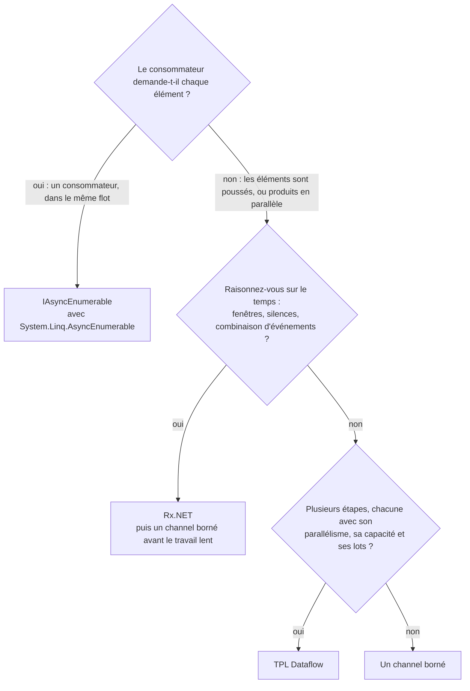

Les leçons 6 à 8 ont examiné trois façons de faire passer des éléments d'un morceau de code à un autre. La quatrième est celle que C# intègre au langage : [`IAsyncEnumerable<T>`](https://learn.microsoft.com/dotnet/api/system.collections.generic.iasyncenumerable-1), consommé avec `await foreach`. Cette leçon commence par elle, puis mène les mêmes quatre expériences sur les quatre : un consommateur qui retient un élément, une source qui échoue, un consommateur qui échoue, et un benchmark de débit. Les réponses sont le tableau et le diagramme de décision vers la fin.

Reactor est la cinquième colonne. Le [cours Spring Boot, Spring Cloud et Reactor](../../spring-cloud-reactor/02-reactor-mono-and-flux/) compare `Flux` à `IAsyncEnumerable` et `IObservable` ; cette leçon ne refait pas cette comparaison, elle en mesure le côté .NET.

Les liens vers GA pointent sur le commit [`a826864`](https://github.com/GuitarAlchemist/ga/tree/a826864f3a012cad88e415954bf57eca0ce12aa6), les liens vers .NET sur l'étiquette [`v10.0.12`](https://github.com/dotnet/runtime/tree/4271d88e0aebf3d04f188f1334c2220d80555ef6) de `dotnet/runtime`.

## Exécuter le programme de la leçon

```bash
bash code/csharp-advanced/check.sh                                   # toutes les leçons, comparées avec expected/
dotnet run --project code/csharp-advanced/Advanced -c Release -- l9  # cette leçon seulement, après check.sh
```

Le code se trouve dans [`Advanced/Lesson9.cs`](https://github.com/spareilleux/learn/blob/b4d713f86711b770a75d7504f334c5871c95f820/code/csharp-advanced/Advanced/Lesson9.cs), et sa sortie est comparée avec [`expected/l9.txt`](https://github.com/spareilleux/learn/blob/b4d713f86711b770a75d7504f334c5871c95f820/code/csharp-advanced/expected/l9.txt). Le benchmark se trouve dans [`Benchmarks/StreamBenchmarks.cs`](https://github.com/spareilleux/learn/blob/b4d713f86711b770a75d7504f334c5871c95f820/code/csharp-advanced/Benchmarks/StreamBenchmarks.cs).

## Les flux asynchrones tirent

Un itérateur asynchrone est une méthode qui renvoie `IAsyncEnumerable<T>` et contient à la fois `await` et `yield return`. Le compilateur la transforme en machine à états, comme la leçon 3 l'a montré pour les méthodes `async`, et le [tutoriel sur les flux asynchrones](https://learn.microsoft.com/dotnet/csharp/asynchronous-programming/generate-consume-asynchronous-stream) couvre la syntaxe. La source de la leçon journalise ce qu'elle fait :

```csharp
static async IAsyncEnumerable<string> Chords(List<string> log, [EnumeratorCancellation] CancellationToken token = default)
{
    try
    {
        foreach (var chord in Progression)
        {
            await Task.Yield();
            log.Add($"produce {chord}");
            yield return chord;
        }
    }
    finally
    {
        log.Add("source finally");
    }
}
```

```text
== An async iterator runs only when the consumer asks for the next item
produce Dm7, consume Dm7, produce G7, consume G7, produce Cmaj7, consume Cmaj7, produce A7, consume A7, source finally
```

Chaque élément n'est produit que lorsque `await foreach` demande le suivant, avec `MoveNextAsync`, et le `finally` s'exécute quand le consommateur libère l'itérateur. Il n'y a ni file, ni seconde tâche, ni thread : le code du producteur s'exécute à l'intérieur des appels du consommateur. C'est pourquoi le cours Reactor dit que `IAsyncEnumerable` a la backpressure gratuitement, un élément à la fois ([cours Reactor, backpressure](../../spring-cloud-reactor/03-reactor-under-the-hood/#backpressure)).

L'attribut [`[EnumeratorCancellation]`](https://learn.microsoft.com/dotnet/api/system.runtime.compilerservices.enumeratorcancellationattribute) relie le paramètre au jeton qu'un consommateur passe avec `WithCancellation(token)`, pour qu'un appelant qui n'a pas créé le flux puisse quand même l'annuler.

Oublier `await` est une erreur de compilation, pas un bug silencieux. Le cours garde l'extrait dans [`CompileFail/snippets/l9_foreach_async_stream.cs`](https://github.com/spareilleux/learn/blob/b4d713f86711b770a75d7504f334c5871c95f820/code/csharp-advanced/CompileFail/snippets/l9_foreach_async_stream.cs) :

```csharp
public static void Print()
{
    foreach (var chord in ChordsAsync())
    {
        Console.WriteLine(chord);
    }
}
```

```text
l9_foreach_async_stream.cs(12,31): error CS8414: foreach statement cannot operate on variables of type 'IAsyncEnumerable<string>' because 'IAsyncEnumerable<string>' does not contain a public instance or extension definition for 'GetEnumerator'. Did you mean 'await foreach' rather than 'foreach'?
```

## LINQ pour les flux asynchrones, dans .NET 10

Jusqu'à .NET 9, LINQ sur `IAsyncEnumerable` venait du paquet communautaire `System.Linq.Async`. .NET 10 livre [`System.Linq.AsyncEnumerable`](https://learn.microsoft.com/dotnet/api/system.linq.asyncenumerable) dans le framework partagé, et la [note de changement cassant](https://learn.microsoft.com/dotnet/core/compatibility/core-libraries/10.0/asyncenumerable) explique comment retirer l'ancien paquet ou éviter les ambiguïtés avec lui.

```csharp
static async Task AsyncLinq()
{
    Title("System.Linq.AsyncEnumerable, part of .NET 10");
    Line($"AsyncEnumerable: {typeof(AsyncEnumerable).Assembly.GetName().Name}, in the shared framework {typeof(AsyncEnumerable).Assembly.Location.Contains("Microsoft.NETCore.App")}");

    var log = new List<string>();
    var firstTwo = await Chords(log).Take(2).ToListAsync();
    Line($"Take(2): {string.Join(" ", firstTwo)}; log: {string.Join(", ", log)}");

    var sevenths = await Progression.ToAsyncEnumerable()
        .Where(async (chord, ct) =>
        {
            await Task.Yield();
            return !chord.Contains("maj");
        })
        .Select((chord, index) => $"{index}:{chord}")
        .ToArrayAsync();
    Line($"Where with an async predicate, then Select with an index: {string.Join(" ", sevenths)}");

    var chunks = await AsyncEnumerable.Range(1, 10).Chunk(4).Select(chunk => $"[{string.Join(" ", chunk)}]").ToListAsync();
    Line($"AsyncEnumerable.Range(1, 10).Chunk(4): {string.Join(" ", chunks)}");
}
```

```text
== System.Linq.AsyncEnumerable, part of .NET 10
AsyncEnumerable: System.Linq.AsyncEnumerable, in the shared framework True
Take(2): Dm7 G7; log: produce Dm7, produce G7, source finally
Where with an async predicate, then Select with an index: 0:Dm7 1:G7 2:A7
AsyncEnumerable.Range(1, 10).Chunk(4): [1 2 3 4] [5 6 7 8] [9 10]
```

- `Take(2)` a cessé de demander après deux éléments et a libéré la source : son `finally` s'est exécuté, et `Cmaj7` n'a jamais été produit.
- Les surcharges asynchrones prennent un `CancellationToken` et renvoient un `ValueTask` : [`Where(Func<TSource, CancellationToken, ValueTask<bool>>)`](https://github.com/dotnet/runtime/blob/4271d88e0aebf3d04f188f1334c2220d80555ef6/src/libraries/System.Linq.AsyncEnumerable/src/System/Linq/Where.cs#L53-L55). L'ancien paquet les appelait `WhereAwait` et `SelectAwait` ; dans .NET 10, ce sont des surcharges de `Where` et `Select`.
- `Chunk`, `CountAsync`, `ToListAsync`, `AsyncEnumerable.Range` et le reste de LINQ sont là.

Une lambda asynchrone qui n'a que l'élément comme paramètre ne correspond à aucune des surcharges. Le compilateur essaie alors le `Func<string, bool>` synchrone et abandonne ([`l9_async_predicate.cs`](https://github.com/spareilleux/learn/blob/b4d713f86711b770a75d7504f334c5871c95f820/code/csharp-advanced/CompileFail/snippets/l9_async_predicate.cs)) :

```csharp
public static IAsyncEnumerable<string> Sevenths(IAsyncEnumerable<string> chords) =>
    chords.Where(async chord => await IsSeventhAsync(chord));
```

```text
l9_async_predicate.cs(11,34): error CS4010: Cannot convert async lambda expression to delegate type 'Func<string, bool>'. An async lambda expression may return void, Task or Task<T>, none of which are convertible to 'Func<string, bool>'.
```

La correction est la lambda à deux paramètres du programme ci-dessus : `async (chord, ct) => …`.

## Étude de cas : `Take(100)` sur le générateur de GA

La leçon 6 a trouvé que [`VoicingGenerator.GenerateAllVoicingsAsync`](https://github.com/GuitarAlchemist/ga/blob/a826864f3a012cad88e415954bf57eca0ce12aa6/Common/GA.Domain.Services/Fretboard/Voicings/Generation/VoicingGenerator.cs#L180-L249) de GA continue de générer après le départ de son consommateur. Les exemples d'utilisation de GA enchaînent précisément cette sortie, `.Take(100)` ([`USAGE_EXAMPLES.md#L31-L41`](https://github.com/GuitarAlchemist/ga/blob/a826864f3a012cad88e415954bf57eca0ce12aa6/Demos/Music%20Theory/FretboardVoicingsCLI/USAGE_EXAMPLES.md#L31-L41)). Le programme exécute le `Take(100)` de `System.Linq.AsyncEnumerable` sur la copie de la méthode de la leçon 6, puis sur sa correction :

```text
== GA's usage example: GenerateAllVoicingsAsync(...).Take(100)
GA shape: took 100; producer completed within 10 s True, windows generated 24 of 24
fixed:    took 100; producer already completed True, windows generated fewer than 24 True
```

`Take` a fait sa part : il a libéré l'itérateur après 100 voicings. Dans la forme de GA, la libération termine seulement la boucle de lecture, donc les producteurs ont continué jusqu'à générer les 24 fenêtres. La version corrigée les annule dans son `finally` ; elle avait généré 8 fenêtres sur la machine de l'auteur quand la boucle a rendu la main. Un opérateur LINQ ne peut pas corriger une source qui ignore sa propre libération.

## Les mêmes expériences sur les quatre

### Un consommateur retient l'élément 0

Chaque source essaie de produire 1 000 éléments, en comptant chacun juste avant de le livrer. Le consommateur reçoit l'élément 0 et ne rend pas la main. Le programme attend que le compte ne bouge plus, puis l'affiche. Les six sources sont dans [`Backpressure`](https://github.com/spareilleux/learn/blob/b4d713f86711b770a75d7504f334c5871c95f820/code/csharp-advanced/Advanced/Lesson9.cs#L97-L206) ; l'utilitaire qui les mesure est court :

```csharp
static async Task Measure(string name, Func<Counter, Task, Task> run)
{
    var produced = new Counter();
    var release = new TaskCompletionSource(TaskCreationOptions.RunContinuationsAsynchronously);
    var running = Task.Run(() => run(produced, release.Task));

    // Attendre que le compte ne bouge plus pendant 200 ms
    var last = -1;
    while (produced.Value != last)
    {
        last = produced.Value;
        await Task.Delay(200);
    }

    Line($"{name,-34} {last,5}");
    release.SetResult();
    await running;
}
```

```text
== A consumer holds item 0: how many of 1,000 items has the source produced?
async iterator (IAsyncEnumerable)      1
Channel.CreateBounded(2)               4
Channel.CreateUnbounded()           1000
ActionBlock, BoundedCapacity 2         3
Rx Subject, no scheduler               1
Rx Subject, ObserveOn(TaskPool)     1000
```

- **Itérateur asynchrone : 1.** Le consommateur n'a jamais demandé l'élément 1.
- **Channel borné à 2 : 4.** L'élément 0 est entre les mains du consommateur, les éléments 1 et 2 remplissent le channel, et l'élément 3 a été compté avant que son `WriteAsync` se mette à attendre.
- **Channel non borné : 1 000.** Rien ne ralentit le producteur.
- **`ActionBlock` avec `BoundedCapacity` 2 : 3.** La leçon 7 a montré que l'élément en cours de traitement compte dans la capacité, il reste donc de la place pour un élément dans la file, et le troisième `SendAsync` attend.
- **Rx sans scheduler : 1.** Le producteur est coincé dans `OnNext(0)`, qui exécute l'observateur sur son thread.
- **Rx avec `ObserveOn` : 1 000.** La file non bornée de la leçon 8.

Le chiffre correspondant côté Reactor est une demande : le `publishOn` du cours Reactor a demandé 256 éléments à sa source, son prefetch par défaut, et un abonné qui demande 2 en reçoit 2.

### La source échoue après trois éléments

```text
== The source fails after 3 items: what does the consumer see?
async iterator                         0, 1, 2, InvalidOperationException: source failed
channel, writer just throws            0, 1, 2, still waiting after 1 s
channel, writer calls Complete(e)      0, 1, 2, InvalidOperationException: source failed
Dataflow, PropagateCompletion          target.Completion Faulted: AggregateException: One or more errors occurred. (source failed) (inner InvalidOperationException: source failed)
Rx                                     0, 1, 2, OnError(InvalidOperationException: source failed)
```

L'itérateur asynchrone et Rx livrent les trois éléments, puis l'exception d'origine. Un channel ne le fait que si l'écrivain passe l'exception à `Complete(e)` : un écrivain qui se contente de lever une exception laisse le lecteur attendre indéfiniment, c'est le bug de GA de la leçon 6. Dataflow fait échouer la cible à travers le lien, enveloppé dans une `AggregateException` comme l'a montré la leçon 7.

### Le consommateur échoue sur l'élément 1

```text
== The consumer fails on item 1: does the source stop?
async iterator                     consumer: InvalidOperationException: consumer failed; source produced 2, its finally ran True
Channel.CreateBounded(2)           consumer: InvalidOperationException: consumer failed; producer finished within 1 s False, Reader.Count 2
ActionBlock, BoundedCapacity 2     block Faulted; SendAsync returned false before the end True
Rx, synchronous source             Subscribe: InvalidOperationException: consumer failed; source produced 2
```

- L'**itérateur asynchrone** est le seul qui fait le ménage tout seul : l'exception sort de `await foreach`, qui libère l'itérateur, et le `finally` de la source s'exécute. La source avait produit deux éléments.
- Le producteur du **channel borné** n'en sait rien. Il remplit le channel et attend indéfiniment, comme dans la commande d'indexation de GA. Le consommateur doit compléter le channel avec l'exception, comme la correction de la leçon 6.
- **`ActionBlock`** échoue et refuse les messages suivants, donc `SendAsync` renvoie `false` : un producteur qui vérifie le résultat s'arrête, un producteur qui l'ignore, comme la démo Dataflow de GA dans la leçon 7, ne s'arrête pas.
- **Rx** avec une source synchrone renvoie l'exception de l'observateur à travers `OnNext` dans la boucle de la source, et hors de `Subscribe`. Rien ne l'a transformée en `OnError` : les opérateurs Rx comme `Select` attrapent les exceptions des fonctions que vous leur donnez et envoient `OnError`, donc une étape qui peut échouer a sa place dans un opérateur, pas dans l'observateur.

## Les ponts

Les quatre types se convertissent l'un dans l'autre, si bien qu'un pipeline peut utiliser chacun là où il est le meilleur. Trois conversions sont dans les bibliothèques : [`ChannelReader.ReadAllAsync`](https://learn.microsoft.com/dotnet/api/system.threading.channels.channelreader-1.readallasync), [`DataflowBlock.ReceiveAllAsync`](https://learn.microsoft.com/dotnet/api/system.threading.tasks.dataflow.dataflowblock.receiveallasync) et [`DataflowBlock.AsObservable`](https://learn.microsoft.com/dotnet/api/system.threading.tasks.dataflow.dataflowblock.asobservable). Le paquet `System.Reactive` 7.0 n'a aucune conversion entre `IObservable` et `IAsyncEnumerable` : la première tentative du programme, `ToAsyncEnumerable()` sur un observable, ne compilait pas. Les deux sens tiennent en quelques lignes :

```csharp
// IObservable<T> vers IAsyncEnumerable<T> : l'abonnement écrit dans un channel, le consommateur le lit
public static async IAsyncEnumerable<T> ReadThrough<T>(IObservable<T> source, Channel<T> channel,
    [EnumeratorCancellation] CancellationToken cancellationToken = default)
{
    using var subscription = source.Subscribe(
        item => channel.Writer.TryWrite(item),
        error => channel.Writer.TryComplete(error),
        () => channel.Writer.TryComplete());
    await foreach (var item in channel.Reader.ReadAllAsync(cancellationToken))
    {
        yield return item;
    }
}
```

```csharp
// IAsyncEnumerable<T> vers IObservable<T> : chaque abonnement énumère la source ; le libérer annule l'énumération
public static IObservable<T> ToObservable<T>(IAsyncEnumerable<T> source) =>
    Observable.Create<T>(async (observer, cancellationToken) =>
    {
        await foreach (var item in source.WithCancellation(cancellationToken))
        {
            observer.OnNext(item);
        }

        observer.OnCompleted();
    });
```

```text
== Bridges
ChannelReader.ReadAllAsync(): Dm7 G7 Cmaj7 A7
ISourceBlock.ReceiveAllAsync(): Dm7 G7 Cmaj7 A7
IObservable through a channel: Dm7 G7 Cmaj7 A7
IAsyncEnumerable with Observable.Create: Dm7 G7 Cmaj7 A7
ISourceBlock.AsObservable(): dm7 g7 cmaj7 a7
```

`ReadThrough` est le plus utile, parce que c'est là qu'une source qui pousse reçoit une politique de backpressure. L'observateur ne peut pas attendre, donc les options du channel décident de ce qui arrive aux éléments pour lesquels le consommateur n'est pas prêt. Le programme pousse 1 000 éléments pendant que le consommateur retient le premier :

```text
== A Subject read through a channel: the channel's options decide what happens to a fast source
unbounded                1,000 OnNext while the consumer held item 0; it then read 1000 items, the last 999
bounded 10, DropOldest   1,000 OnNext while the consumer held item 0; it then read 11 items, the last 999: 0 990 991 992 993 994 995 996 997 998 999
```

Le channel non borné a tout gardé ; le channel borné, en mode `DropOldest`, a gardé les 10 éléments les plus récents. C'est la combinaison pour un clavier MIDI ou un capteur qui alimente une analyse lente : Rx pour les opérateurs temporels, puis un channel borné avant la partie lente. `DropWrite` garderait plutôt les éléments les plus anciens, et le mode `Wait` ne ferait rien ici, parce que `TryWrite` n'attend jamais.

## Le débit

[BenchmarkDotNet](https://benchmarkdotnet.org/) fait passer 100 000 entiers d'un producteur à un consommateur qui les additionne, à travers chaque type de flux. Lancez-le seul, sans rien d'autre de lourd sur la machine :

```bash
cd code/csharp-advanced
dotnet run -c Release --project Benchmarks -- --filter "*StreamBenchmarks*"
```

```text
BenchmarkDotNet v0.15.8, Windows 11 (10.0.26200.9445/25H2/2025Update/HudsonValley2)
Intel Core Ultra 9 285K 3.70GHz, 1 CPU, 24 logical and 24 physical cores
.NET 10.0.12, X64 RyuJIT x86-64-v3

| Method                 | Mean        | Ratio | Allocated   |
|----------------------- |------------:|------:|------------:|
| AsyncIterator          |  1,113.7 us |  1.00 |       168 B |
| UnboundedChannel       |  4,768.1 us |  4.28 |     26758 B |
| BoundedChannel1000     |  5,129.8 us |  4.61 |      9904 B |
| DataflowBufferToAction | 41,904.6 us | 37.64 |   6756271 B |
| RxSubject              |    131.7 us |  0.12 |       232 B |
| RxObserveOnTaskPool    | 10,638.8 us |  9.56 |    392857 B |
```

Le tableau garde quatre des colonnes de BenchmarkDotNet ; la sortie complète a aussi signalé une distribution bimodale pour `RxObserveOnTaskPool`, dont la moyenne est donc moins parlante que les autres.

- **`RxSubject` est le plus rapide parce qu'il n'est pas du tout asynchrone** : chaque `OnNext` est un appel de délégué sur le thread du producteur, environ 1,3 ns par élément.
- **L'itérateur asynchrone** coûte environ 11 ns par élément. Sa source n'attend jamais vraiment, donc chaque `MoveNextAsync` se termine de façon synchrone, et toute l'exécution alloue un seul énumérateur.
- **Les channels** coûtent environ 50 ns par élément, avec le producteur sur un autre thread, et quelques kilo-octets de segments ou de tampon.
- **Rx avec `ObserveOn`** déplace chaque élément dans la file du pool de threads : environ 100 ns par élément.
- **Dataflow** est ici le plus lent, à environ 420 ns par élément et 6,7 Mo pour 100 000 entiers. Le benchmark ne montre pas où cela passe ; le protocole d'offre et de report entre deux blocs bornés en est le coût probable (*à vérifier*).

Chaque élément ne coûte ici rien à traiter, donc le benchmark ne mesure que le flux. À 50 ns par élément, un channel traite 20 millions d'éléments par seconde sur cette machine : dès que chaque élément implique un appel à une base de données ou quelques microsecondes de calcul, le choix dépend des comportements mesurés plus haut, pas de ce tableau.

## Lequel ?



| | `IAsyncEnumerable` | `Channel<T>` | TPL Dataflow | Rx.NET | `Flux` de Reactor |
|---|---|---|---|---|---|
| Modèle | le consommateur tire | une file entre tâches | un graphe de blocs, chacun avec une file | la source pousse | la source pousse ce qui a été demandé |
| Provenance | le langage, et `System.Linq.AsyncEnumerable` dans .NET 10 | framework partagé | framework partagé | paquet `System.Reactive` | `reactor-core` |
| Le consommateur retient l'élément 0 | la source attend après 1 | attend après capacité + 2, ou jamais s'il n'est pas borné | attend après `BoundedCapacity` + 1 | sans scheduler : le thread du producteur attend ; `ObserveOn` : jamais | la source s'arrête à la demande, 256 derrière `publishOn` |
| La source échoue | l'exception, au `await foreach` | l'exception si l'écrivain appelle `Complete(e)`, un blocage sinon | la cible échoue, `AggregateException` imbriquées | `OnError`, définitif | `onError`, définitif |
| Le consommateur échoue | le `finally` de la source s'exécute | le producteur attend indéfiniment, sauf si le consommateur complète le channel | le bloc échoue, `SendAsync` renvoie `false` | l'exception repart dans la source | la souscription est annulée en amont |
| Parallélisme | aucun : un élément à la fois | autant de lecteurs que vous en démarrez | `MaxDegreeOfParallelism` par bloc | `SelectMany`, `Merge(n)` | `flatMap(f, n)`, `parallel()` |
| Ordre | conservé | FIFO ; perdu entre plusieurs lecteurs | conservé sauf si `EnsureOrdered = false` | `Concat` le garde, `SelectMany` non | `concatMap`, `flatMapSequential` le gardent, `flatMap` non |
| Opérateurs temporels | aucun | aucun | `BatchBlock` compte ; le temps demande `TriggerBatch` | `Throttle`, `Sample`, `Buffer(TimeSpan)`, `TestScheduler` | `sample`, `bufferTimeout`, `StepVerifier.withVirtualTime` |
| Coût par élément, travail trivial | ~11 ns | ~50 ns | ~420 ns | ~1,3 ns synchrone, ~100 ns avec `ObserveOn` | mesuré dans aucun des deux cours |

Les comportements de la colonne Reactor viennent du [cours Reactor](../../spring-cloud-reactor/03-reactor-under-the-hood/) et de la [Javadoc de `Flux`](https://projectreactor.io/docs/core/release/api/reactor/core/publisher/Flux.html) ; la ligne « le consommateur échoue » est la règle de Reactive Streams selon laquelle une erreur annule la souscription en amont, que cette leçon n'exécute pas.

En pratique :

- **Renvoyez `IAsyncEnumerable<T>` depuis une API** qui produit une séquence : c'est le type le plus composable, et un appelant qui veut un channel, un bloc ou un observable n'est qu'à un pont de distance.
- **Utilisez un channel borné à l'intérieur d'un composant** pour découpler un producteur d'un consommateur qui vont à des vitesses différentes, et faites passer par le channel les échecs des deux côtés.
- **Prenez Dataflow** quand le pipeline a plusieurs étapes qui ont besoin de leur propre parallélisme et de leur propre capacité, et que vous voulez ces réglages au même endroit.
- **Prenez Rx** pour les événements dans le temps. Ne laissez pas un consommateur lent derrière `ObserveOn` ; mettez-y un channel borné.

## Si vous connaissez Spring et Reactor

| .NET | Reactor, ou Java |
|---|---|
| `IAsyncEnumerable<T>`, `await foreach` | `Flux<T>` consommé avec `request(1)` ; `Stream<T>` ou `Iterator<T>` quand c'est synchrone |
| `System.Linq.AsyncEnumerable` | les opérateurs de `Flux` |
| `Take(n)` libère l'itérateur | `take(n)` annule la souscription |
| `[EnumeratorCancellation]`, `WithCancellation` | `dispose()` sur la souscription |
| `Channel<T>` | `Sinks.many().unicast().onBackpressureBuffer(queue)`, ou une `BlockingQueue` |
| `ReadThrough` vers un channel borné | `onBackpressureBuffer(n, BufferOverflowStrategy.DROP_OLDEST)` |
| `ChannelReader.ReadAllAsync` | `Flux.create` alimenté par une file |
| `ToObservable(IAsyncEnumerable)`, `AsObservable()` | `Flux.fromIterable`, `Flux.fromStream` ; `Flux.from` pour un autre publisher Reactive Streams |

Les tableaux des leçons 6 et 8 donnent les opérateurs des channels et de Rx un par un. Java n'a pas d'itérateur asynchrone ; depuis les threads virtuels, un `Iterator` ou un `Stream` bloquant lu sur un thread virtuel joue ce rôle, ce que la [dernière section du cours Reactor](../../spring-cloud-reactor/03-reactor-under-the-hood/#threads-virtuels-ou-réactif-) compare à Reactor.

## Exercices

1. Écrivez `Merge(first, second)`, qui lit deux `IAsyncEnumerable<T>` en parallèle et rend leurs éléments à mesure qu'ils arrivent. Si une source échoue, la fusion doit se terminer avec cette exception et arrêter l'autre source.
2. La commande d'indexation de GA fait des upserts de voicings par lots. Avec `System.Linq.AsyncEnumerable`, transformez le générateur corrigé de la leçon 6 en lots de 5 voicings. Avec 4 fenêtres de 3 voicings, quelles tailles ont les lots ?
3. Choisissez un flux pour chaque cas : (a) des accords détectés depuis un clavier MIDI, envoyés à un service d'analyse lent ; (b) l'indexation d'un million de voicings, avec calcul parallèle et écritures en base par lots ; (c) un endpoint HTTP qui transmet des résultats de recherche en flux à son client.

<details>
<summary>Solutions</summary>

1. Deux pompes copient les sources dans un channel borné, la première erreur complète le channel, et un `finally` arrête les pompes quand le consommateur s'en va :

    ```csharp
    // Exercice 1 : lit les deux sources en parallèle dans un channel borné ; la première erreur termine la fusion
    public static async IAsyncEnumerable<T> Merge<T>(IAsyncEnumerable<T> first, IAsyncEnumerable<T> second,
        [EnumeratorCancellation] CancellationToken cancellationToken = default)
    {
        using var cts = CancellationTokenSource.CreateLinkedTokenSource(cancellationToken);
        var channel = Channel.CreateBounded<T>(1);

        async Task Pump(IAsyncEnumerable<T> source)
        {
            await foreach (var item in source.WithCancellation(cts.Token))
            {
                await channel.Writer.WriteAsync(item, cts.Token);
            }
        }

        var pumps = Task.WhenAll(Pump(first), Pump(second));
        _ = pumps.ContinueWith(t => channel.Writer.TryComplete(t.Exception?.InnerException), TaskScheduler.Default);
        try
        {
            await foreach (var item in channel.Reader.ReadAllAsync(cts.Token))
            {
                yield return item;
            }
        }
        finally
        {
            cts.Cancel();
            try
            {
                await pumps;
            }
            catch
            {
                // déjà signalée par le channel, ou annulée par nous
            }
        }
    }
    ```

    ```text
    1. Merge(a, b): 6 items, a in order True, b in order True
       Merge(a, failing): InvalidOperationException: b failed
    ```

    Chaque source garde son propre ordre ; la façon dont les deux s'entrelacent dépend du temps, `a0 b0 a1 b1 a2 b2` sur la machine de l'auteur.

2. `Chunk(5)` sur le flux asynchrone ; 12 voicings font des lots de 5, 5 et 2. Le dernier lot est rendu quand la source se termine, donc un générateur lent le retarde : l'exercice `ReadBatchesAsync` de la leçon 6 est la version qui n'attend pas un lot complet.

    ```csharp
    var sizes = await FixedVoicings(4, probe).Chunk(5).Select(chunk => chunk.Length).ToListAsync();
    ```

    ```text
    2. FixedVoicings(4 windows of 3).Chunk(5): 5 5 2
    ```

3. (a) Rx pour la détection des accords, comme dans la leçon 8, puis `ReadThrough` vers un channel borné en mode `DropOldest` avant le service d'analyse, pour qu'il analyse toujours les accords les plus récents. (b) Des producteurs parallèles et un consommateur par lots autour d'un channel borné, comme la commande d'indexation corrigée de la leçon 6, ou un pipeline Dataflow fait d'un `TransformBlock` avec `MaxDegreeOfParallelism`, d'un `BatchBlock` et d'un `ActionBlock` borné. (c) Un `IAsyncEnumerable<T>` renvoyé par l'endpoint, qu'ASP.NET Core écrit à mesure de l'énumération ; la leçon 14 le vérifie (*à vérifier* d'ici là).

</details>

## À retenir

- `IAsyncEnumerable` tire : la source s'exécute à l'intérieur des appels du consommateur, s'arrête quand le consommateur s'arrête, et exécute son `finally` à la libération.
- .NET 10 livre LINQ pour les flux asynchrones ; les surcharges asynchrones prennent un `CancellationToken` et remplacent les méthodes `…Await` de l'ancien paquet.
- Un `Take` de LINQ libère la source, mais une source qui a démarré ses propres producteurs doit les arrêter elle-même.
- Les channels bornés et les blocs Dataflow bornés font attendre un producteur ; les channels non bornés et Rx derrière `ObserveOn` jamais.
- L'échec d'une source n'atteint le consommateur tout seul qu'avec les itérateurs, Rx et les liens Dataflow ; un channel a besoin de `Complete(e)`. L'échec d'un consommateur n'arrête la source tout seul qu'avec les itérateurs.
- Convertissez aux frontières : un observable vers un channel borné, un channel ou un bloc vers un `IAsyncEnumerable`.
- Sans vrai travail par élément, les types de flux diffèrent d'un ordre de grandeur ou plus ; avec un vrai travail, c'est leur comportement qui décide, pas leur vitesse.

## Sources

- Microsoft Learn : [`IAsyncEnumerable<T>`](https://learn.microsoft.com/dotnet/api/system.collections.generic.iasyncenumerable-1), [générer et consommer des flux asynchrones](https://learn.microsoft.com/dotnet/csharp/asynchronous-programming/generate-consume-asynchronous-stream), [`System.Linq.AsyncEnumerable`](https://learn.microsoft.com/dotnet/api/system.linq.asyncenumerable) et [sa note de changement cassant](https://learn.microsoft.com/dotnet/core/compatibility/core-libraries/10.0/asyncenumerable), [`EnumeratorCancellationAttribute`](https://learn.microsoft.com/dotnet/api/system.runtime.compilerservices.enumeratorcancellationattribute), [`ChannelReader<T>.ReadAllAsync`](https://learn.microsoft.com/dotnet/api/system.threading.channels.channelreader-1.readallasync), [`DataflowBlock.ReceiveAllAsync`](https://learn.microsoft.com/dotnet/api/system.threading.tasks.dataflow.dataflowblock.receiveallasync), [`DataflowBlock.AsObservable`](https://learn.microsoft.com/dotnet/api/system.threading.tasks.dataflow.dataflowblock.asobservable).
- dotnet/runtime à `v10.0.12` : [`System.Linq.AsyncEnumerable/Where.cs`](https://github.com/dotnet/runtime/blob/4271d88e0aebf3d04f188f1334c2220d80555ef6/src/libraries/System.Linq.AsyncEnumerable/src/System/Linq/Where.cs).
- [BenchmarkDotNet](https://benchmarkdotnet.org/).
- Reactor : [Javadoc de `Flux`](https://projectreactor.io/docs/core/release/api/reactor/core/publisher/Flux.html) ; le [cours Spring Boot, Spring Cloud et Reactor](../../spring-cloud-reactor/), leçons 2 et 3.
- Guitar Alchemist à `a826864` : [`VoicingGenerator.cs`](https://github.com/GuitarAlchemist/ga/blob/a826864f3a012cad88e415954bf57eca0ce12aa6/Common/GA.Domain.Services/Fretboard/Voicings/Generation/VoicingGenerator.cs#L180-L249), [`USAGE_EXAMPLES.md`](https://github.com/GuitarAlchemist/ga/blob/a826864f3a012cad88e415954bf57eca0ce12aa6/Demos/Music%20Theory/FretboardVoicingsCLI/USAGE_EXAMPLES.md#L31-L41).
