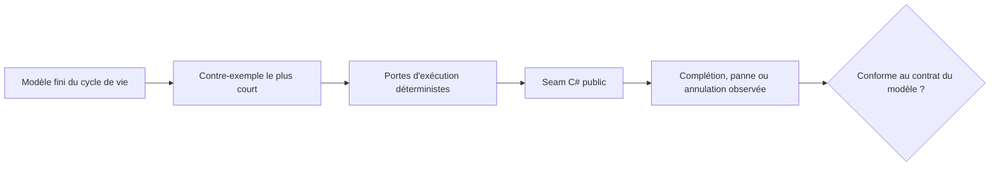

Les leçons [6](../06-channels/), [7](../07-tpl-dataflow/), [8](../08-rx-net/) et [9](../09-choosing-streams/) exécutent des pipelines C#. Elles montrent ce qu'a fait un ordonnancement choisi. Cette leçon ajoute un outil complémentaire : un [oracle de spécification par réseau de Petri](../../petri-nets/14-on-our-systems/) borné qui énumère chaque marquage d'un cycle de vie volontairement petit.

L'oracle **n'exécute pas** le pipeline de production. Il répond à une question plus étroite avant l'écriture du test d'exécution : quels états de succès, panne et annulation ce test doit-il distinguer, et quel entrelacement réfuterait le contrat attendu ?

## Partir du contrat, pas de l'API

Le modèle exécutable contient un item, un producteur, un consommateur et une place dans la file. Lancez-le depuis la racine du dépôt :

```bash
dotnet test code/petri-nets/Tests -c Release --filter PipelineLifecycleTests
dotnet run --project code/petri-nets/Examples -c Release -- l14
```

Son graphe d'accessibilité complet compte huit marquages et trois marquages morts terminaux : `succeeded`, `failed` et `cancelled`. Les tests prouvent aussi l'invariant de file Channel `free + queued = 1`. Consultez la [leçon Petri](../../petri-nets/14-on-our-systems/) pour le modèle, le fichier PNML et la transcription mesurée ; cette leçon se concentre sur la traduction de cet oracle en meilleurs tests C#.



## Les mêmes mots ne désignent pas la même capacité

La première amélioration de conception consiste à ne plus appeler « pipeline borné » trois réalités différentes.

| Mécanisme | Ce qui est borné | Ce que la place Petri `free` peut signifier | Ce qui doit rester explicite |
|---|---|---|---|
| [`Channel<T>`](https://learn.microsoft.com/dotnet/core/extensions/channels) | les items en file | une place disponible dans la file | la complétion du writer, la vidange de la file et la stabilisation du reader sont des observations distinctes |
| [TPL Dataflow](https://learn.microsoft.com/dotnet/standard/parallel-programming/dataflow-task-parallel-library) | les items en file, en cours d'exécution et les sorties retenues dans un bloc d'exécution | pas la place `free` actuelle ; le modèle doit être raffiné | la complétion des blocs, la consommation des sorties, les pannes propagées et les tâches de collecte externes |
| [Rx.NET](https://github.com/dotnet/reactive) | rien par défaut | aucun équivalent tant qu'un pont borné n'est pas ajouté | `OnCompleted`, `OnError`, la libération de la souscription et la stabilisation du travail planifié |

Ainsi, `free + queued = 1` est un invariant utile pour une file Channel, pas une loi universelle de backpressure. Le recopier dans un test Dataflow ou Rx donnerait une preuve précise du mauvais système.

## Transformer un contre-exemple en test déterministe

Ne traduisez pas une transition Petri par `Task.Delay`. Traduisez-la par une porte que le test contrôle : [`TaskCompletionSource`](https://learn.microsoft.com/dotnet/api/system.threading.tasks.taskcompletionsource), une barrière, une fausse dépendance ou un scheduler contrôlable.

| Chemin du modèle | Ordonnancement d'exécution à forcer | Observation exigée au seam public |
|---|---|---|
| `write → read → consume → settle_success` | libérer le consommateur après une écriture acceptée | writer fermé, item observé, tâches du producteur et du consommateur terminées |
| `producer_fail → settle_producer_failure` | faire échouer le producteur avant sa première écriture acceptée | l'erreur est observable et aucun reader n'attend indéfiniment |
| `write → read → consumer_fail` | laisser le consommateur prendre l'item, puis le faire échouer | le producteur est débloqué ou annulé, et toutes les tâches possédées sont jointes |
| `cancel` | demander l'annulation avant le démarrage du travail | l'annulation est observée et tous les participants se stabilisent |

L'oracle actuel à un item ne peut pas reproduire un producteur déjà bloqué par la backpressure quand le consommateur échoue. Sa transition d'annulation est aussi atomique et antérieure au démarrage. Ce sont des hypothèses documentées, pas des résultats de test manquants. Pour couvrir ces ordonnancements, raffinez d'abord le modèle avec au moins deux items et des places séparées `cancel_requested`, `producer_settled` et `consumer_settled`, puis dérivez les portes d'exécution des nouveaux chemins les plus courts.

## Conception des tests par mécanisme

### `Channel<T>`

Utilisez un channel borné avec `capacity: 1` et conservez les références aux deux tâches participantes. Une assertion de succès doit attendre le writer, vider le reader et attendre le consommateur. Une assertion de panne doit prouver que l'exception traverse le seam public **et** qu'aucun participant ne reste incomplet. [`TryComplete(error)`](https://learn.microsoft.com/dotnet/api/system.threading.channels.channelwriter-1.trycomplete) est un événement ; ce n'est pas la preuve que le reader a observé l'erreur.

L'oracle améliore le test en rendant visibles les jetons restants. Si un marquage terminal contient encore `queued` ou `producer`, le test d'exécution analogue doit inspecter l'item en file ou la tâche inachevée au lieu d'accepter une exception seule.

### TPL Dataflow

Ne réutilisez pas l'invariant de capacité de Channel. Le `BoundedCapacity` d'un bloc d'exécution inclut un item pendant l'exécution de son délégué. Un propagateur comme `TransformBlock<TInput,TOutput>` peut aussi retenir une sortie terminée jusqu'à ce qu'une cible l'accepte ou que le test la consomme. Modélisez des places `queued`, `executing` et `output_buffered` séparées, puis énoncez l'invariant du bloc réellement configuré.

Distinguez aussi `PropagateCompletion` de la stabilisation de tout le pipeline. Attendez le `Completion` de chaque bloc et toute tâche de collecte située hors du graphe. Une cible liée peut se terminer alors qu'une tâche latérale possède encore du travail ; l'oracle doit donner sa propre place à ce participant.

### Rx.NET

Rx n'a pas de contrat de backpressure intégré. Une place Petri bornée ne correspond donc à Rx qu'après l'ajout d'un pont ou d'une politique de buffer explicite. Sans cela, modélisez plutôt les notifications et la durée de vie de la souscription : `subscribed`, `next_in_flight`, `completed`, `errored`, `disposed` et, si nécessaire, `scheduled_work_settled`.

Un scheduler en temps virtuel contrôle le temps, pas le travail asynchrone arbitraire. Le test d'exécution doit observer séparément les tâches créées hors du scheduler. Libérer la souscription n'est pas `OnCompleted`, et aucun des deux ne prouve que le travail externe s'est stabilisé.

## Utilité pratique pour GA

Les exemples GA des leçons 6 et 9 contiennent précisément les seams de cycle de vie où cette méthode devient rentable : génération bornée de voicings, consommateur qui peut s'arrêter tôt et pannes de producteur qui doivent parvenir à l'appelant. Les exemples du cours reproduisent la forme de ces mécanismes à des révisions épinglées ; ce ne sont pas des tests des binaires GA actuels.

Pour une modification de GA, suivez cette séquence :

1. Épingler la révision GA cible et nommer le seam public testé.
2. Écrire le plus petit modèle Petri borné qui contient l'ordonnancement suspect.
3. Exiger un graphe d'accessibilité complet et classer chaque marquage mort en succès, panne ou annulation.
4. Extraire le contre-exemple le plus court et le reproduire avec des portes C# déterministes.
5. Ne corriger GA qu'après qu'un test d'exécution en échec a prouvé que le chemin modélisé est réel.
6. Conserver le modèle comme oracle de conception et le test d'exécution comme preuve d'implémentation.

Cette démarche est particulièrement utile pour les bugs de concurrence qui passent des milliers d'itérations de stress jusqu'à l'apparition d'un ordonnancement malchanceux. Le réseau énumère un espace d'états fini ; le test C# prouve que l'API réelle suit le même contrat de cycle de vie.

## Exercices

1. Étendez le modèle à deux écritures et dérivez un test Channel où le second writer est bloqué lorsque le consommateur échoue.
2. Remplacez la correspondance Channel par un [`TransformBlock`](https://learn.microsoft.com/dotnet/api/system.threading.tasks.dataflow.transformblock-2) Dataflow. Définissez un invariant qui compte les items en file, en cours d'exécution et les sorties retenues.
3. Modélisez la libération Rx séparément de la complétion, puis écrivez un test en temps virtuel qui prouve quelle notification est observée.
4. Choisissez un pipeline GA actuel. Notez sa révision exacte, son seam public, ses tâches possédées et ses observations terminales avant de proposer une correction.

<details>
<summary>Pistes de solution</summary>

1. Ajoutez un second jeton de travail et conservez un seul jeton `free`. Le chemin d'échec minimal doit remplir la place, démarrer la seconde écriture, faire échouer le consommateur et laisser le second writer non stabilisé jusqu'au déclenchement de la politique de panne.
2. Séparez `queued`, `executing` et `output_buffered`. Pour ce `TransformBlock` séquentiel, testez `free + queued + executing + output_buffered = configured capacity`, puis consommez la sortie avant d'attendre l'acceptation de l'entrée suivante. Si l'ordre ou le parallélisme change, raffinez de nouveau le modèle au lieu de réutiliser cette équation telle quelle.
3. Donnez des places terminales différentes à `disposed` et `completed`. Avancez le temps virtuel jusqu'à la notification, puis vérifiez séparément que les tâches créées à l'extérieur se sont stabilisées.
4. Un relevé suffisant nomme un SHA de commit, la méthode publique, chaque tâche ou souscription possédée, les portes forcées, le résultat terminal attendu et la commande qui le reproduit.

</details>

## À retenir

- Le réseau de Petri est un oracle de spécification, pas l'exécution.
- La capacité signifie les items en file pour le Channel modélisé, mais les items en file, en exécution et parfois les sorties retenues pour un bloc Dataflow ; Rx est non borné tant que la conception n'ajoute pas de borne.
- Annulation demandée, complétion signalée, file vidée et stabilisation de chaque participant sont des faits distincts.
- Dérivez des portes déterministes d'un contre-exemple minimal ; ne dépendez ni de pauses ni de la chance d'un stress test.
- Pour GA, un modèle suggère l'ordonnancement de régression, tandis qu'un test sur une révision épinglée du dépôt apporte la preuve.
