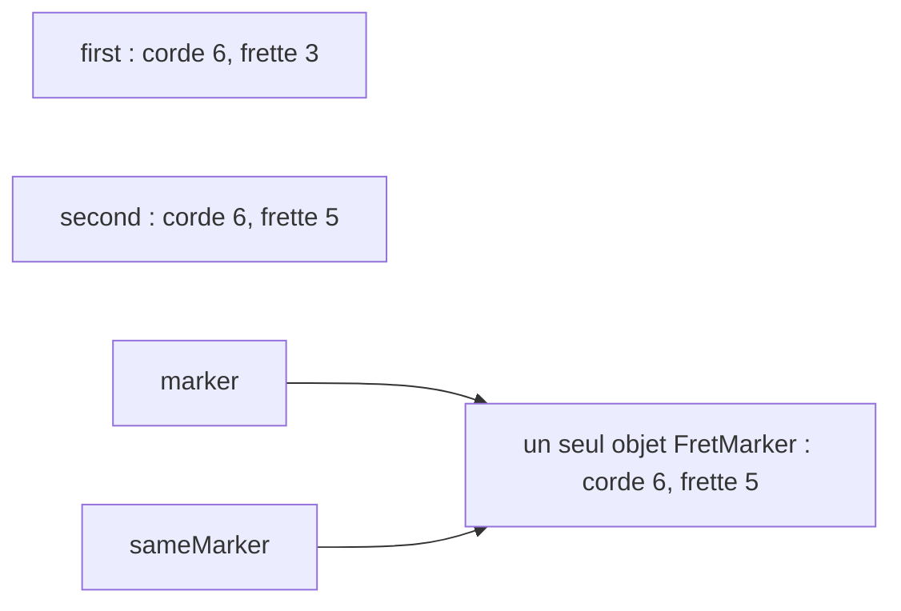

Dans la leçon 5, deux variables de type classe pouvaient désigner le même objet, et un changement fait par l'une se voyait par l'autre. Beaucoup de choses qu'un programme manipule sont au contraire de simples données : une position sur le manche, une note, la qualité d'un accord. Pour elles, partager un seul objet est rarement ce qu'on veut. C# propose trois autres sortes de types pour cela : la [**structure**](https://learn.microsoft.com/dotnet/csharp/language-reference/builtin-types/struct) (`struct`), copiée en entier à chaque affectation ; le [**record**](https://learn.microsoft.com/dotnet/csharp/language-reference/builtin-types/record), comparé par ses données ; et l'[**énumération**](https://learn.microsoft.com/dotnet/csharp/language-reference/builtin-types/enum) (`enum`), une liste fixe de choix nommés.

Tous les programmes de cette leçon sont dans [`code/csharp-beginner`](https://github.com/spareilleux/learn/tree/main/code/csharp-beginner) ; lance-en un avec [`dotnet run`](https://learn.microsoft.com/dotnet/core/tools/dotnet-run) suivi de son chemin, par exemple `examples/l06_copies.cs`. `check.sh` compare leurs sorties, et les erreurs du compilateur pour les extraits refusés, aux fichiers de `expected/`.

## Types valeur et types référence

Ci-dessous, `FretPosition` est une structure et `FretMarker` une classe. Elles contiennent les deux mêmes nombres, et le programme leur fait subir les mêmes opérations :

```csharp
// Une structure est un type valeur : l'affecter copie les données
FretPosition first = new FretPosition(6, 3);    // sol sur la corde de mi grave
FretPosition second = first;
second.Fret = 5;
Console.WriteLine($"first: string {first.StringNumber}, fret {first.Fret}");
Console.WriteLine($"second: string {second.StringNumber}, fret {second.Fret}");

// Une classe est un type référence : l'affecter copie la référence (leçon 5)
FretMarker marker = new FretMarker(6, 3);
FretMarker sameMarker = marker;
sameMarker.Fret = 5;
Console.WriteLine($"marker: string {marker.StringNumber}, fret {marker.Fret}");

// Une méthode reçoit une copie de la structure, et une copie de la référence à l'objet
MoveUpOctave(first);
MoveMarkerUpOctave(marker);
Console.WriteLine($"after the methods: first at fret {first.Fret}, marker at fret {marker.Fret}");

// Equals compare les champs d'une structure, les références d'une classe
Console.WriteLine($"first.Equals(new FretPosition(6, 3)): {first.Equals(new FretPosition(6, 3))}");
Console.WriteLine($"marker.Equals(new FretMarker(6, 17)): {marker.Equals(new FretMarker(6, 17))}");

void MoveUpOctave(FretPosition position) => position.Fret += 12;
void MoveMarkerUpOctave(FretMarker target) => target.Fret += 12;

struct FretPosition
{
    public int StringNumber { get; set; }
    public int Fret { get; set; }

    public FretPosition(int stringNumber, int fret)
    {
        StringNumber = stringNumber;
        Fret = fret;
    }
}

sealed class FretMarker
{
    public int StringNumber { get; set; }
    public int Fret { get; set; }

    public FretMarker(int stringNumber, int fret)
    {
        StringNumber = stringNumber;
        Fret = fret;
    }
}
```

```text
first: string 6, fret 3
second: string 6, fret 5
marker: string 6, fret 5
after the methods: first at fret 3, marker at fret 17
first.Equals(new FretPosition(6, 3)): True
marker.Equals(new FretMarker(6, 17)): False
```

Une structure est un [**type valeur**](https://learn.microsoft.com/dotnet/csharp/language-reference/builtin-types/value-types) : la variable contient les données elles-mêmes. `second = first` copie les deux nombres dans `second` ; changer `second` ne touche donc pas `first`. Une classe est un [**type référence**](https://learn.microsoft.com/dotnet/csharp/language-reference/keywords/reference-types) : la variable contient une référence vers un objet, et `sameMarker = marker` copie la référence. Il n'y a toujours qu'un seul repère, et les deux variables le voient bouger.



Les méthodes suivent la même règle. `MoveUpOctave` reçoit une copie de `first` et déplace la copie, qui disparaît au retour de la méthode : `first` est toujours sur la frette 3. `MoveMarkerUpOctave` reçoit une copie de la référence ; elle déplace donc l'unique repère, de la frette 5 à la 17. La leçon 4 montrait la même chose avec un `int` et un tableau : les types numériques de la leçon 2, `bool` et `char` sont des structures ; `string`, les tableaux et `List<T>` sont des classes.

La comparaison suit aussi cette règle. Le `Equals` d'une structure compare ses champs un par un ([`ValueType.Equals`](https://learn.microsoft.com/dotnet/api/system.valuetype.equals)) : deux positions distinctes sur la corde 6, frette 3, sont égales. Le `Equals` d'une classe compare les références : un nouveau repère au même endroit est un autre objet, il n'est donc pas égal.

### Deux erreurs avec les structures

Une structure que tu déclares n'a pas d'opérateur `==`, sauf si tu en écris un. L'extrait refusé `compile_fail/l06_struct_equals.cs` essaie quand même :

```csharp
FretPosition first = new FretPosition(6, 3);
Console.WriteLine(first == new FretPosition(6, 3));
```

```text
l06_struct_equals.cs(2,19): error CS0019: Operator '==' cannot be applied to operands of type 'FretPosition' and 'FretPosition'
```

La seconde erreur vient avec les listes. `shape[0]` demande son premier élément à la [`List<T>`](https://learn.microsoft.com/dotnet/api/system.collections.generic.list-1), et pour une structure la liste renvoie une copie. Modifier une copie jetée aussitôt ne changerait rien ; le compilateur refuse donc (`compile_fail/l06_list_struct_element.cs`) :

```csharp
List<FretPosition> shape = [new FretPosition(6, 3), new FretPosition(5, 5)];
shape[0].Fret = 5;
```

```text
l06_list_struct_element.cs(2,1): error CS1612: Cannot modify the return value of 'List<FretPosition>.this[int]' because it is not a variable
```

Lis l'élément dans une variable, modifie la variable, puis range-la à sa place avec `shape[0] = position;`. L'exercice 3 fait la même chose en une seule étape, avec `with`.

Les structures de cette section ne sont modifiables que pour montrer la copie. Les recommandations de Microsoft pour [choisir entre une classe et une structure](https://learn.microsoft.com/dotnet/standard/design-guidelines/choosing-between-class-and-struct) ne conseillent une structure que pour une petite valeur qui ne change plus une fois créée, et une [`readonly struct`](https://learn.microsoft.com/dotnet/csharp/language-reference/builtin-types/struct#readonly-struct) fait respecter cette règle par le compilateur. La section suivante montre la manière courte d'en écrire une.

## Les records : comparés par leurs données

Un record déclare, en une ligne, un type fait de valeurs nommées :

```csharp
// Un record : le compilateur écrit le constructeur, les propriétés, ToString et l'égalité
Note c4 = new Note("C", 4);
Note middleC = new Note("C", 4);
Note c5 = c4 with { Octave = 5 };    // une copie avec une propriété changée

Console.WriteLine(c4);
Console.WriteLine(c5);
Console.WriteLine($"c4 == middleC: {c4 == middleC}");
Console.WriteLine($"same object: {ReferenceEquals(c4, middleC)}");
Console.WriteLine($"c4 == c5: {c4 == c5}");

// Une classe avec les mêmes données compare des références
NoteObject a = new NoteObject("C", 4);
NoteObject b = new NoteObject("C", 4);
Console.WriteLine($"two NoteObject: {a == b}");

// Un record struct est un type valeur avec les mêmes commodités
Position g = new Position(6, 3);
Position a2 = g with { Fret = 5 };
Console.WriteLine($"{g} -> {a2}");
Console.WriteLine($"g == new Position(6, 3): {g == new Position(6, 3)}");

record Note(string Name, int Octave);

readonly record struct Position(int StringNumber, int Fret);

sealed class NoteObject
{
    public string Name { get; }
    public int Octave { get; }

    public NoteObject(string name, int octave)
    {
        Name = name;
        Octave = octave;
    }
}
```

```text
Note { Name = C, Octave = 4 }
Note { Name = C, Octave = 5 }
c4 == middleC: True
same object: False
c4 == c5: False
two NoteObject: False
Position { StringNumber = 6, Fret = 3 } -> Position { StringNumber = 6, Fret = 5 }
g == new Position(6, 3): True
```

`record Note(string Name, int Octave);` donne à `Note` un constructeur à deux paramètres, une propriété publique pour chacun, un `ToString` qui les affiche, ainsi qu'un `Equals` et un `==` qui les comparent. Compare avec les onze lignes de `NoteObject`, qui n'a toujours pas de `ToString` et compare des références.

Un `record` est une classe : `c4` et `middleC` sont deux objets, comme le confirme [`ReferenceEquals`](https://learn.microsoft.com/dotnet/api/system.object.referenceequals), et pourtant `c4 == middleC` vaut `True`, car leurs données sont identiques. L'[expression `with`](https://learn.microsoft.com/dotnet/csharp/language-reference/operators/with-expression) fait une copie dont certaines propriétés changent : `c5` est une nouvelle note, et `c4` est toujours à l'octave 4.

`readonly record struct Position(...)` applique la même idée à un type valeur : copié à l'affectation comme les structures de la section précédente, avec un `==` et un `ToString` lisible, et des propriétés qui ne peuvent plus changer une fois la valeur construite.

Les propriétés de `Note` sont **init-only** : on peut leur donner une valeur pendant la création du record, jamais après. L'extrait refusé `compile_fail/l06_record_init_only.cs` essaie `c4.Octave = 5;` :

```text
l06_record_init_only.cs(2,1): error CS8852: Init-only property or indexer 'Note.Octave' can only be assigned in an object initializer, or on 'this' or 'base' in an instance constructor or an 'init' accessor.
```

Pour obtenir une note à une autre octave, écris `c4 with { Octave = 5 }`. Dans un simple `record struct`, sans `readonly`, les propriétés déclarées entre les parenthèses peuvent changer après la création ; la [page sur les records](https://learn.microsoft.com/dotnet/csharp/language-reference/builtin-types/record) détaille les différences.

[Guitar Alchemist](https://github.com/GuitarAlchemist/ga) déclare ainsi ses positions sur le manche : [`public readonly record struct PositionLocation(Str Str, Fret Fret)`](https://github.com/GuitarAlchemist/ga/blob/5c3a52ab40d0d433f8f68dbbd0590f70c8d8cf26/Common/GA.Domain.Core/Instruments/Positions/PositionLocation.cs#L5), au commit `5c3a52a`. Ses `Str` et [`Fret`](https://github.com/GuitarAlchemist/ga/blob/5c3a52ab40d0d433f8f68dbbd0590f70c8d8cf26/Common/GA.Domain.Core/Instruments/Primitives/Fret.cs#L16) sont eux-mêmes des types `readonly record struct`, plutôt que de simples `int`.

## Les énumérations : un ensemble fixe de noms

La qualité d'un accord est un choix parmi quelques-uns : majeur, mineur, diminué… Une `enum` donne un nom à chaque choix :

```csharp
// Une enum nomme un ensemble fixe de choix ; chaque nom représente un nombre
ChordQuality quality = ChordQuality.Minor;
Console.WriteLine(quality);
Console.WriteLine((int)quality);
Console.WriteLine($"A{Suffix(quality)}");

foreach (ChordQuality q in Enum.GetValues<ChordQuality>())
{
    Console.WriteLine($"{(int)q} {q}: C{Suffix(q)}");
}

ChordQuality unset = default;               // la valeur 0
ChordQuality zero = 0;                      // le littéral 0 se convertit sans cast
Console.WriteLine($"default: {unset}, 0: {zero}");

ChordQuality strange = (ChordQuality)7;     // un cast accepte n'importe quel int
Console.WriteLine($"cast from 7: {strange}, defined: {Enum.IsDefined(strange)}");

ChordQuality parsed = Enum.Parse<ChordQuality>("Diminished");
Console.WriteLine($"parsed: {parsed} = {(int)parsed}");

string Suffix(ChordQuality q) => q switch
{
    ChordQuality.Major => "",
    ChordQuality.Minor => "m",
    ChordQuality.Diminished => "dim",
    ChordQuality.Augmented => "aug",
    _ => "?",
};

enum ChordQuality
{
    Other,
    Major,
    Minor,
    Diminished,
    Augmented,
}
```

```text
Minor
2
Am
0 Other: C?
1 Major: C
2 Minor: Cm
3 Diminished: Cdim
4 Augmented: Caug
default: Other, 0: Other
cast from 7: 7, defined: False
parsed: Diminished = 3
```

Chaque nom représente un `int`, numéroté à partir de 0 dans l'ordre de la déclaration : `Minor` vaut 2. `Console.WriteLine` affiche le nom, et le cast `(int)` donne le nombre. [`Enum.GetValues<ChordQuality>()`](https://learn.microsoft.com/dotnet/api/system.enum.getvalues) liste les valeurs, triées par nombre, et [`Enum.Parse`](https://learn.microsoft.com/dotnet/api/system.enum.parse) retrouve une valeur à partir de son nom écrit en texte. Une expression `switch`, vue à la leçon 3, est la façon habituelle de donner à chaque choix son propre résultat.

Une énumération est un type valeur, et sa valeur par défaut est 0, le premier nom. Les [recommandations de Microsoft pour les énumérations](https://learn.microsoft.com/dotnet/standard/design-guidelines/enum) demandent donc un membre valant zéro qui ait du sens comme valeur par défaut. Le [`ChordQuality`](https://github.com/GuitarAlchemist/ga/blob/5c3a52ab40d0d433f8f68dbbd0590f70c8d8cf26/Common/GA.Domain.Core/Theory/Harmony/ChordQuality.cs#L10-L23) de Guitar Alchemist commence par `Other` pour cette raison ; l'énumération plus petite de cette leçon reprend l'idée.

Nombres et noms ne se mélangent pas librement. Le littéral `0` se convertit tout seul en n'importe quelle énumération, comme le montre `zero`, mais tout autre nombre demande un cast. L'extrait refusé `compile_fail/l06_int_to_enum.cs` écrit `ChordQuality quality = 2;` :

```text
l06_int_to_enum.cs(1,24): error CS0266: Cannot implicitly convert type 'int' to 'ChordQuality'. An explicit conversion exists (are you missing a cast?)
```

Le cast, lui, ne vérifie rien : `(ChordQuality)7` est accepté et affiche `7`, une valeur sans nom. [`Enum.IsDefined`](https://learn.microsoft.com/dotnet/api/system.enum.isdefined) indique si une valeur a un nom. La [référence des énumérations](https://learn.microsoft.com/dotnet/csharp/language-reference/builtin-types/enum#implicit-conversions-from-zero) met en garde contre ces deux conversions.

### Une expression switch sur une enum a quand même besoin de `_`

Comme une énumération peut contenir des nombres sans nom, une expression `switch` avec une branche par nom n'est toujours pas complète. `examples/l06_enum_switch_warning.cs` :

```csharp
ChordQuality quality = (ChordQuality)7;

// Chaque nom a sa branche, et le compilateur avertit quand même : une enum peut contenir d'autres nombres
string suffix = quality switch
{
    ChordQuality.Other => "?",
    ChordQuality.Major => "",
    ChordQuality.Minor => "m",
    ChordQuality.Diminished => "dim",
    ChordQuality.Augmented => "aug",
};
Console.WriteLine(suffix);
```

```text
l06_enum_switch_warning.cs(4,25): warning CS8524: The switch expression does not handle some values of its input type (it is not exhaustive) involving an unnamed enum value. For example, the pattern '(ChordQuality)5' is not covered.
Unhandled exception. System.Runtime.CompilerServices.SwitchExpressionException: Non-exhaustive switch expression failed to match its input.
Unmatched value was 7.
```

Les lignes de la trace de pile, qui commencent par `at`, sont omises. L'avertissement est [CS8524](https://learn.microsoft.com/dotnet/csharp/language-reference/compiler-messages/pattern-matching-warnings), un cousin du CS8509 de la leçon 3. Son exemple, `(ChordQuality)5`, est le premier nombre après le dernier nom, pas le 7 sur lequel le programme échoue. La branche `_ => "?"` de `Suffix`, plus haut, couvre les deux.

## Exercices

### Exercice 1 — prévoir les copies

Sans le lancer, prévois ce qu'affiche `exercises/l06_ex_predict.cs`. `Tempo` est une structure, `Metronome` une classe.

```csharp
Tempo a = new Tempo(120);
Tempo b = a;
b.Bpm = 90;

Metronome m1 = new Metronome(120);
Metronome m2 = m1;
m2.Bpm = 90;

Console.WriteLine($"{a.Bpm} {b.Bpm} {m1.Bpm} {m2.Bpm}");

struct Tempo
{
    public int Bpm { get; set; }

    public Tempo(int bpm) => Bpm = bpm;
}

sealed class Metronome
{
    public int Bpm { get; set; }

    public Metronome(int bpm) => Bpm = bpm;
}
```

<details>
<summary>Solution</summary>

```text
120 90 90 90
```

`b = a` copie le tempo : `a` garde 120. `m2 = m1` copie la référence : il n'y a qu'un métronome, et il est à 90 par les deux variables.

</details>

### Exercice 2 — les accords de do majeur

Déclare une énumération `ChordQuality` avec `Other`, `Major`, `Minor` et `Diminished`, et un record `Chord(string Root, ChordQuality Quality)` avec une méthode `Symbol()` qui renvoie `C`, `Dm` ou `Bdim`. Mets les sept accords de do majeur dans une `List<Chord>`, affiche leurs symboles sur une ligne, puis vérifie avec [`Contains`](https://learn.microsoft.com/dotnet/api/system.collections.generic.list-1.contains) si la liste contient un nouveau `Chord("A", ChordQuality.Minor)`, et le même accord rendu majeur avec `with`. La solution testée est `exercises/l06_ex_chords.cs`.

<details>
<summary>Solution</summary>

```csharp
List<Chord> cMajor =
[
    new Chord("C", ChordQuality.Major),
    new Chord("D", ChordQuality.Minor),
    new Chord("E", ChordQuality.Minor),
    new Chord("F", ChordQuality.Major),
    new Chord("G", ChordQuality.Major),
    new Chord("A", ChordQuality.Minor),
    new Chord("B", ChordQuality.Diminished),
];

List<string> symbols = [];
foreach (Chord chord in cMajor)
{
    symbols.Add(chord.Symbol());
}
Console.WriteLine(string.Join(" ", symbols));

Chord am = new Chord("A", ChordQuality.Minor);
Chord aMajor = am with { Quality = ChordQuality.Major };
Console.WriteLine($"Contains {am.Symbol()}: {cMajor.Contains(am)}");
Console.WriteLine($"Contains {aMajor.Symbol()}: {cMajor.Contains(aMajor)}");

record Chord(string Root, ChordQuality Quality)
{
    public string Symbol() => Quality switch
    {
        ChordQuality.Major => Root,
        ChordQuality.Minor => $"{Root}m",
        ChordQuality.Diminished => $"{Root}dim",
        _ => $"{Root}?",
    };
}

enum ChordQuality
{
    Other,
    Major,
    Minor,
    Diminished,
}
```

```text
C Dm Em F G Am Bdim
Contains Am: True
Contains A: False
```

`Contains` compare avec `Equals`. L'objet `am` n'a jamais été mis dans la liste, mais un record compare des données : il retrouve donc le la mineur de la liste. Avec une classe qui compare des références, comme `NoteObject`, la même recherche répond `False`. Un record peut avoir des méthodes après sa ligne de déclaration, entre accolades, comme une classe.

</details>

### Exercice 3 — déplacer une forme d'accord

`List<Position> shape = [new Position(6, 3), new Position(5, 5), new Position(4, 5)];` est un power chord G5, avec `readonly record struct Position(int StringNumber, int Fret)`. Monte la forme de deux frettes, en A5, et affiche-la sous la forme `6:5 5:7 4:7`. `shape[i].Fret += 2` est refusé : les propriétés de `Position` sont init-only, et le compilateur répond par l'erreur CS8852 de la section sur les records (`compile_fail/l06_readonly_position.cs`). La solution testée est `exercises/l06_ex_move_shape.cs`.

<details>
<summary>Solution</summary>

```csharp
// G5, un power chord : corde 6 frette 3, corde 5 frette 5, corde 4 frette 5
List<Position> shape = [new Position(6, 3), new Position(5, 5), new Position(4, 5)];

// shape[i].Fret += 2 est refusé : on remplace chaque élément par une copie déplacée
for (int i = 0; i < shape.Count; i++)
{
    shape[i] = shape[i] with { Fret = shape[i].Fret + 2 };
}

List<string> cells = [];
foreach (Position p in shape)
{
    cells.Add($"{p.StringNumber}:{p.Fret}");
}
Console.WriteLine(string.Join(" ", cells));

readonly record struct Position(int StringNumber, int Fret);
```

```text
6:5 5:7 4:7
```

`with` construit une copie déplacée, et `shape[i] = …` la range à la place de l'ancien élément. Avec un type `readonly`, c'est la seule façon de faire : même une variable locale de type `Position` ne peut pas voir sa `Fret` changer, et le compilateur répond de nouveau CS8852.

</details>

## Ce qu'il faut retenir

- Une structure est un type valeur : l'affecter, ou la passer à une méthode, copie les données.
- Une classe est un type référence : l'affecter copie la référence, et les deux variables atteignent le même objet.
- Un record compare ses données avec `==` et `Equals`, les affiche avec `ToString` et fait des copies modifiées avec `with`.
- Une énumération nomme un ensemble fixe de choix ; chaque nom représente un nombre, et la valeur par défaut est 0.
- Un cast vers une énumération accepte n'importe quel nombre : vérifie avec `Enum.IsDefined`, et donne une branche `_` à une expression `switch`.

La suite, [interfaces et héritage](../07-interfaces-and-inheritance/), montrera des classes qui partagent un comportement.

## Sources

- [Types valeur](https://learn.microsoft.com/dotnet/csharp/language-reference/builtin-types/value-types), [types référence](https://learn.microsoft.com/dotnet/csharp/language-reference/keywords/reference-types), [types structure](https://learn.microsoft.com/dotnet/csharp/language-reference/builtin-types/struct), [valeurs par défaut](https://learn.microsoft.com/dotnet/csharp/language-reference/builtin-types/default-values)
- [Records](https://learn.microsoft.com/dotnet/csharp/language-reference/builtin-types/record), [les records dans les fondamentaux de C#](https://learn.microsoft.com/dotnet/csharp/fundamentals/types/records), [l'expression `with`](https://learn.microsoft.com/dotnet/csharp/language-reference/operators/with-expression)
- [Comparaisons d'égalité](https://learn.microsoft.com/dotnet/csharp/programming-guide/statements-expressions-operators/equality-comparisons), [opérateurs d'égalité](https://learn.microsoft.com/dotnet/csharp/language-reference/operators/equality-operators), [`ValueType.Equals`](https://learn.microsoft.com/dotnet/api/system.valuetype.equals), [`Object.ReferenceEquals`](https://learn.microsoft.com/dotnet/api/system.object.referenceequals)
- [Types énumération](https://learn.microsoft.com/dotnet/csharp/language-reference/builtin-types/enum), [`Enum.GetValues`](https://learn.microsoft.com/dotnet/api/system.enum.getvalues), [`Enum.IsDefined`](https://learn.microsoft.com/dotnet/api/system.enum.isdefined), [`Enum.Parse`](https://learn.microsoft.com/dotnet/api/system.enum.parse)
- Recommandations de conception : [choisir entre classe et structure](https://learn.microsoft.com/dotnet/standard/design-guidelines/choosing-between-class-and-struct), [conception des énumérations](https://learn.microsoft.com/dotnet/standard/design-guidelines/enum)
- [Avertissement du compilateur CS8524](https://learn.microsoft.com/dotnet/csharp/language-reference/compiler-messages/pattern-matching-warnings)
