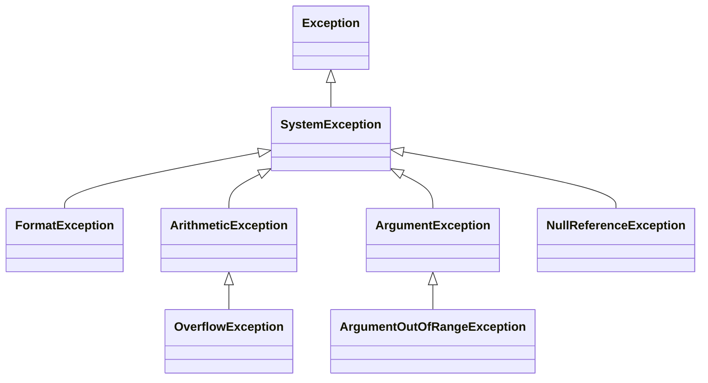

Plusieurs programmes des leçons précédentes se terminaient par `Unhandled exception` : un `switch` sans branche correspondante à la leçon 3, un indice au-delà de la fin d'un tableau et une chaîne `null` à la leçon 4. Une [**exception**](https://learn.microsoft.com/dotnet/csharp/fundamentals/exceptions/) est la façon dont .NET signale une erreur qui survient pendant l'exécution d'un programme. Cette leçon montre comment en attraper une et continuer, comment garantir qu'un code s'exécute toujours, et comment en lever une soi-même. Sa seconde moitié revient sur `null` : le compilateur peut trouver la plupart des valeurs `null` qui feraient planter un programme, à condition de lire ses avertissements.

Tous les programmes de cette leçon se trouvent dans [`code/csharp-beginner`](https://github.com/spareilleux/learn/tree/main/code/csharp-beginner) ; lance-en un avec [`dotnet run`](https://learn.microsoft.com/dotnet/core/tools/dotnet-run) suivi de son chemin, par exemple `examples/l08_try_catch.cs`. `check.sh` compare leur sortie, et les erreurs du compilateur pour les extraits refusés, avec les fichiers de `expected/`.

## Attraper une exception : try et catch

[`int.Parse`](https://learn.microsoft.com/dotnet/api/system.int32.parse), vu à la leçon 2, lève une exception quand son texte n'est pas un nombre. Une [instruction `try`](https://learn.microsoft.com/dotnet/csharp/language-reference/statements/exception-handling-statements) l'attrape :

```csharp
// int.Parse lève une exception quand le texte n'est pas un nombre : catch la traite, et la boucle continue
string[] inputs = ["5", "twelve", "99999999999", ""];

foreach (string text in inputs)
{
    try
    {
        int fret = int.Parse(text);
        Console.WriteLine($"'{text}': fret {fret}");
    }
    catch (FormatException ex)
    {
        Console.WriteLine($"'{text}': not a number ({ex.Message})");
    }
    catch (OverflowException)
    {
        Console.WriteLine($"'{text}': too large for an int");
    }
}

Console.WriteLine("done");
```

```text
'5': fret 5
'twelve': not a number (The input string 'twelve' was not in a correct format.)
'99999999999': too large for an int
'': not a number (The input string '' was not in a correct format.)
done
```

Le bloc `try` contient le code qui peut échouer. Quand une de ses instructions lève une exception, le reste du bloc est sauté : pour `twelve`, la ligne qui affiche la frette ne s'exécute jamais. C# examine alors les clauses `catch` dans l'ordre et exécute la première dont le type correspond à l'exception : une [`FormatException`](https://learn.microsoft.com/dotnet/api/system.formatexception) pour un texte qui n'est pas un nombre, une [`OverflowException`](https://learn.microsoft.com/dotnet/api/system.overflowexception) pour un nombre trop grand pour un `int`. Après le bloc `catch`, le programme reprend après toute l'instruction `try`, ici avec le texte suivant de la boucle, et il atteint `done`.

`catch (FormatException ex)` nomme l'objet exception `ex` ; sa propriété [`Message`](https://learn.microsoft.com/dotnet/api/system.exception.message) décrit l'erreur. `catch (OverflowException)` ne donne pas de nom, car ce bloc n'a pas besoin de l'objet.

Si aucun `catch` ne correspond, l'exception quitte la méthode et remonte au code qui l'a appelée, puis à l'appelant de ce code, et ainsi de suite. Si rien ne l'attrape, le programme s'arrête avec `Unhandled exception`, comme aux leçons 3 et 4.

### Les exceptions sont des classes

Une exception est un objet, et son type est une classe dérivée de [`Exception`](https://learn.microsoft.com/dotnet/api/system.exception), comme à la leçon 7. Voici les exceptions de ce cours et leurs classes de base :



Une clause `catch` attrape aussi les classes dérivées de son type, donc `catch (Exception)` les attrape toutes. C'est pourquoi l'ordre des clauses compte. Dans `compile_fail/l08_catch_order.cs`, `catch (Exception)` vient en premier, et la clause `FormatException` qui le suit ne pourrait jamais s'exécuter :

```csharp
try
{
    Console.WriteLine(int.Parse("twelve"));
}
catch (Exception)
{
    Console.WriteLine("something went wrong");
}
catch (FormatException)
{
    Console.WriteLine("not a number");
}
```

```text
l08_catch_order.cs(9,8): error CS0160: A previous catch clause already catches all exceptions of this or of a super type ('Exception')
```

Mets les types les plus précis en premier. Un `catch (Exception)` qui cache toutes les erreurs derrière un seul message vague rend les bogues difficiles à trouver : attrape les exceptions que tu sais traiter.

Deuxième erreur : une variable affectée dans un bloc `try` peut encore n'avoir aucune valeur après lui. Dans `compile_fail/l08_unassigned_after_try.cs`, si `int.Parse` lève une exception, `fret` n'en reçoit jamais :

```csharp
int fret;
try
{
    fret = int.Parse("twelve");
}
catch (FormatException)
{
    Console.WriteLine("not a number");
}
Console.WriteLine(fret);
```

```text
l08_unassigned_after_try.cs(10,19): error CS0165: Use of unassigned local variable 'fret'
```

Donne une valeur à la variable là où tu la déclares, utilise-la dans le bloc `try`, ou utilise le `int.TryParse` de la leçon 2, qui ne lève aucune exception.

## finally : du code qui s'exécute toujours

Un bloc `finally` s'exécute quand l'instruction `try` se termine, quelle que soit la manière : normalement, par un `return`, après un `catch`, ou avec une exception qui quitte la méthode.

```csharp
// finally s'exécute dans tous les cas : après un return, après un catch, et avant qu'une exception quitte la méthode
Console.WriteLine(Tune("440"));
Console.WriteLine(Tune("A4"));

try
{
    Console.WriteLine(Tune("99999999999"));
}
catch (OverflowException)
{
    Console.WriteLine("caught by the caller: too large");
}

string Tune(string frequency)
{
    Console.WriteLine("tuner on");
    try
    {
        int hertz = int.Parse(frequency);
        return $"tuned to {hertz} Hz";
    }
    catch (FormatException)
    {
        return $"'{frequency}' is not a frequency";
    }
    finally
    {
        Console.WriteLine("tuner off");
    }
}
```

```text
tuner on
tuner off
tuned to 440 Hz
tuner on
tuner off
'A4' is not a frequency
tuner on
tuner off
caught by the caller: too large
```

`tuner off` vient avant `tuned to 440 Hz` : la méthode calcule sa valeur de retour, exécute `finally`, et seulement ensuite renvoie la valeur que l'appelant affiche. Pour `A4`, le `catch` renvoie un message, et `finally` s'exécute à nouveau. Pour `99999999999`, `Tune` n'a pas de `catch` pour une `OverflowException` : `finally` s'exécute quand même, puis l'exception quitte `Tune`, et le `catch` de l'appelant la traite.

`finally` sert à libérer ce qu'une méthode a pris, quoi qu'il arrive : éteindre l'accordeur ici, fermer un fichier à la leçon 10.

## throw : quand une méthode ne peut pas faire son travail

Une méthode peut lever elle-même une exception, avec [`throw`](https://learn.microsoft.com/dotnet/csharp/language-reference/statements/exception-handling-statements#the-throw-statement). Elle le fait quand elle ne peut pas faire ce qu'on lui demande, au lieu de renvoyer une mauvaise réponse :

```csharp
// Une méthode qui ne peut pas faire son travail lève une exception au lieu de renvoyer une mauvaise réponse
string[] standard = ["E2", "A2", "D3", "G3", "B3", "E4"];

Console.WriteLine(NoteOfString(standard, 6));
Console.WriteLine(NoteOfString(standard, 1));

try
{
    Console.WriteLine(NoteOfString(standard, 7));
}
catch (ArgumentOutOfRangeException ex)
{
    Console.WriteLine(ex.Message);
}

// Les cordes sont numérotées de 1, la plus aiguë, à 6, la plus grave
string NoteOfString(string[] tuning, int stringNumber)
{
    if (stringNumber < 1 || stringNumber > tuning.Length)
    {
        throw new ArgumentOutOfRangeException(nameof(stringNumber), stringNumber, $"This tuning has strings 1 to {tuning.Length}.");
    }
    return tuning[tuning.Length - stringNumber];
}
```

```text
E2
E4
This tuning has strings 1 to 6. (Parameter 'stringNumber')
Actual value was 7.
```

`throw` crée un objet exception avec `new` et l'envoie vers le haut, comme les exceptions de .NET. [`ArgumentOutOfRangeException`](https://learn.microsoft.com/dotnet/api/system.argumentoutofrangeexception) est le type habituel pour un argument hors de son intervalle valide ; elle reçoit le nom du paramètre, sa valeur et un message, et son `Message` ajoute les deux premiers au texte. [`nameof(stringNumber)`](https://learn.microsoft.com/dotnet/csharp/language-reference/operators/nameof) donne le texte `"stringNumber"`, et reste juste si tu renommes le paramètre.

Sans la vérification, `NoteOfString(standard, 7)` calculerait l'indice `-1` et échouerait avec une `IndexOutOfRangeException` à propos d'un tableau que l'appelant n'a jamais vu. Avec elle, l'erreur nomme l'argument qui est faux. Pour les vérifications les plus courantes, `ArgumentOutOfRangeException` a des méthodes qui font le `if` et le `throw` en une ligne, comme [`ThrowIfNegative`](https://learn.microsoft.com/dotnet/api/system.argumentoutofrangeexception.throwifnegative) et [`ThrowIfGreaterThan`](https://learn.microsoft.com/dotnet/api/system.argumentoutofrangeexception.throwifgreaterthan) ; les exercices 1 et 2 les utilisent.

Seule une exception peut être levée. `compile_fail/l08_throw_string.cs` essaie `throw "fret out of range";` :

```text
l08_throw_string.cs(1,7): error CS0029: Cannot implicitly convert type 'string' to 'System.Exception'
```

Quand une méthode doit-elle lever une exception, et quand doit-elle renvoyer une valeur qui dit qu'elle a échoué ? Une exception est pour un appel qui n'aurait pas dû avoir lieu, comme la corde 7 d'une guitare à six cordes. Quand un échec est ordinaire, comme un utilisateur qui tape un mauvais nombre, mieux vaut une méthode qui le signale : le `int.TryParse` de la leçon 2 renvoie `false` au lieu de lever une exception. Le guide .NET des [bonnes pratiques pour les exceptions](https://learn.microsoft.com/dotnet/standard/exceptions/best-practices-for-exceptions#call-try-methods-to-avoid-exceptions) recommande ces méthodes *Try*. Guitar Alchemist propose les deux pour ses frettes : au commit `5c3a52a`, le [constructeur de `Fret`](https://github.com/GuitarAlchemist/ga/blob/5c3a52ab40d0d433f8f68dbbd0590f70c8d8cf26/Common/GA.Domain.Core/Instruments/Primitives/Fret.cs#L35-L43) vérifie que le numéro est entre -1 (étouffée) et 36 et documente une `ArgumentOutOfRangeException`, tandis que [`Fret.TryCreate`](https://github.com/GuitarAlchemist/ga/blob/5c3a52ab40d0d433f8f68dbbd0590f70c8d8cf26/Common/GA.Domain.Core/Instruments/Primitives/Fret.cs#L92-L94) renvoie un résultat qui contient soit la frette, soit un message d'erreur. Une sonde à ce commit a confirmé les deux, et a trouvé la même vérification derrière `Fret.FromValue(50)` et la conversion implicite `Fret f = 50;` : les trois lèvent une `ArgumentOutOfRangeException`, tandis que `Fret.TryCreate(50)` renvoie l'erreur `Fret number must be between -1 (muted) and 36, got 50`.

## Sécurité face à null : laisser le compilateur trouver les null

La leçon 4 a présenté `string?`, les opérateurs `?.` et `??`, et l'avertissement CS8602. Une [`NullReferenceException`](https://learn.microsoft.com/dotnet/api/system.nullreferenceexception) est l'exception qu'on obtient quand un programme lit un membre de `null`. L'[analyse de nullabilité](https://learn.microsoft.com/dotnet/csharp/nullable-references) du compilateur avertit avant l'exécution, mais pas toujours sur la ligne qui plante. `examples/l08_null_warnings.cs` s'exécute sans entrée :

```csharp
string? answer = Console.ReadLine();     // aucune entrée : ReadLine renvoie null
string title = answer;                   // un string? va dans un string

Song song = new Song();
Console.WriteLine(song.Title.Length);    // aucun avertissement sur cette ligne, et pourtant Title est null

class Song
{
    public string Title { get; set; }    // aucun constructeur ne la remplit
}
```

```text
l08_null_warnings.cs(9,19): warning CS8618: Non-nullable property 'Title' must contain a non-null value when exiting constructor. Consider adding the 'required' modifier or declaring the property as nullable.
l08_null_warnings.cs(2,16): warning CS8600: Converting null literal or possible null value to non-nullable type.
Unhandled exception. System.NullReferenceException: Object reference not set to an instance of an object.
```

Deux avertissements, deux problèmes différents :

- **CS8600** à la ligne 2 : `answer` peut être `null`, et `title` est un `string`, un type qui promet de ne pas contenir `null`. La promesse est rompue là où la valeur entre.
- **CS8618** à la ligne 9 : `Title` est un `string`, mais aucun constructeur ne lui donne de valeur, donc un nouveau `Song` a un `Title` qui vaut `null`. L'avertissement se trouve sur la déclaration de la propriété. La ligne qui lit `song.Title.Length` n'en reçoit aucun, parce que le compilateur y fait confiance au type `string`, et c'est la ligne qui plante.

Un avertissement de nullabilité désigne l'endroit où `null` entre, qui peut être loin de l'endroit où il fait des dégâts. Lis-les tous. La [liste des avertissements de nullabilité](https://learn.microsoft.com/dotnet/csharp/language-reference/compiler-messages/nullable-warnings) explique chacun, avec ses corrections habituelles. Ici, `examples/l08_null_fixed.cs` corrige les deux :

```csharp
// Le même programme sans avertissement : ?? donne une valeur, required oblige l'appelant à remplir Title
string title = Console.ReadLine() ?? "untitled";

Song song = new Song { Title = title };
Console.WriteLine($"{song.Title}: {song.Title.Length} letters");

class Song
{
    public required string Title { get; init; }
}
```

```text
untitled: 8 letters
```

`??` remplace une réponse `null` par `"untitled"`, donc `title` n'est jamais `null`. Le modificateur [`required`](https://learn.microsoft.com/dotnet/csharp/language-reference/keywords/required) fait vérifier par le compilateur que chaque `new Song` remplit `Title`, entre accolades après l'appel du constructeur ; c'est pourquoi CS8618 le suggère. `compile_fail/l08_required_missing.cs` l'oublie, avec `new Song()` seul :

```text
l08_required_missing.cs(1,17): error CS9035: Required member 'Song.Title' must be set in the object initializer or attribute constructor.
```

Un titre manquant est désormais une erreur à la compilation plutôt qu'un plantage à l'exécution. Déclarer la propriété `string?` serait l'autre correction, quand une chanson sans titre a un sens : chaque utilisation de `Title` doit alors traiter `null`.

### `!` fait taire l'avertissement, pas le null

L'[opérateur de tolérance null](https://learn.microsoft.com/dotnet/csharp/language-reference/operators/null-forgiving) `!`, après une expression, dit au compilateur : « ce n'est pas `null`, fais-moi confiance ». L'avertissement disparaît. Le `null`, non :

```csharp
string? FindTuning(string name) => name == "standard" ? "E A D G B E" : null;

string tuning = FindTuning("drop D")!;   // ! fait taire l'avertissement, pas le null
Console.WriteLine(tuning.Length);
```

```text
Unhandled exception. System.NullReferenceException: Object reference not set to an instance of an object.
```

Le programme compile sans avertissement et plante, exactement comme la version de la leçon 4 qui avait un avertissement. N'utilise `!` que lorsque tu sais quelque chose que le compilateur ne peut pas voir, et préfère `??`, un `if` ou une variable `string?`.

### Transformer les avertissements de nullabilité en erreurs

Un avertissement n'arrête pas la compilation, il est donc facile de l'ignorer. La propriété `WarningsAsErrors` transforme des avertissements en erreurs, et sa valeur `nullable` [sélectionne tous les avertissements de nullabilité](https://learn.microsoft.com/dotnet/csharp/language-reference/compiler-options/errors-warnings#warningsaserrors-and-warningsnotaserrors). Une application basée sur un fichier définit une propriété avec une ligne [`#:property`](https://learn.microsoft.com/dotnet/core/sdk/file-based-apps#property) en haut ; `compile_fail/l08_nullable_errors.cs` en ajoute une à l'avertissement de la leçon 4 :

```csharp
#:property WarningsAsErrors=nullable
string? FindTuning(string name) => name == "standard" ? "E A D G B E" : null;

string? tuning = FindTuning("drop D");
Console.WriteLine(tuning.Length);
```

```text
l08_nullable_errors.cs(5,19): error CS8602: Dereference of a possibly null reference.
```

Le même CS8602 est désormais une erreur, et le programme ne s'exécute pas. Dans un projet, la propriété va dans le fichier `.csproj` de la leçon 1 : `<WarningsAsErrors>nullable</WarningsAsErrors>`.

Guitar Alchemist a fait le choix inverse. Au commit `5c3a52a`, son [`Directory.Build.props`](https://github.com/GuitarAlchemist/ga/blob/5c3a52ab40d0d433f8f68dbbd0590f70c8d8cf26/Directory.Build.props#L19-L21) place quinze avertissements de nullabilité dans [`NoWarn`](https://learn.microsoft.com/dotnet/csharp/language-reference/compiler-options/errors-warnings#nowarn), la propriété qui fait taire des avertissements, « to achieve a clean baseline » (pour obtenir une base propre), et son [`Directory.Build.targets`](https://github.com/GuitarAlchemist/ga/blob/5c3a52ab40d0d433f8f68dbbd0590f70c8d8cf26/Directory.Build.targets#L7) les liste une deuxième fois. Le [journal](../journal/#2026-10-02--exceptions-et-sécurité-face-à-null) a mesuré ce qu'elles cachent. Sans les deux listes, GA.Domain.Core et GA.Core compilent sans un seul avertissement de nullabilité : les listes ne cachent rien aujourd'hui. Mais un fichier de test contenant sept erreurs de nullabilité, ajouté à GA.Domain.Core, a compilé sans avertissement avec les listes, et a reçu ses sept avertissements sans elles. Faire taire un avertissement fait aussi taire les erreurs à venir.

## Exercices

### Exercice 1 — où va le programme ?

Sans l'exécuter, prédis les lignes qu'affiche `exercises/l08_ex_predict.cs`. `ThrowIfGreaterThan(fret, 24)` lève une `ArgumentOutOfRangeException` quand `fret` est supérieur à 24.

```csharp
Console.WriteLine("start");
try
{
    Console.WriteLine(Check(3));
    Console.WriteLine(Check(30));
    Console.WriteLine("after 30");
}
catch (ArgumentOutOfRangeException)
{
    Console.WriteLine("out of range");
}
finally
{
    Console.WriteLine("finally");
}
Console.WriteLine("end");

string Check(int fret)
{
    ArgumentOutOfRangeException.ThrowIfGreaterThan(fret, 24);
    return $"fret {fret}";
}
```

<details>
<summary>Solution</summary>

```text
start
fret 3
out of range
finally
end
```

`Check(30)` lève une exception dans le bloc `try`, donc `after 30` est sauté. Le `catch` correspond, `finally` s'exécute après lui, et le programme continue avec `end` : l'exception a été traitée.

</details>

### Exercice 2 — un lecteur de frettes qui ne s'arrête pas

Lis des frettes tapées une par ligne jusqu'à la fin de l'entrée. Écris une méthode `ParseFret(string text)` qui renvoie la frette, et lève une exception quand le texte n'est pas un nombre ou que la frette est hors de 0 à 24. La boucle attrape les exceptions, affiche une ligne pour chaque entrée, et à la fin affiche combien de frettes étaient valides et la plus haute. Avec les lignes `3`, `12`, `x`, `30`, `-1` et `7` en entrée (`input/l08_ex_frets.txt`), le programme affiche la sortie ci-dessous. La solution testée est `exercises/l08_ex_frets.cs`.

<details>
<summary>Solution</summary>

```csharp
// Exercice 2 : lire des frettes, une par ligne, et signaler les mauvaises sans s'arrêter
int valid = 0;
int highest = 0;
string? line;
while ((line = Console.ReadLine()) != null)
{
    try
    {
        int fret = ParseFret(line);
        valid++;
        highest = Math.Max(highest, fret);
        Console.WriteLine($"{line}: ok");
    }
    catch (FormatException)
    {
        Console.WriteLine($"{line}: not a number");
    }
    catch (ArgumentOutOfRangeException)
    {
        Console.WriteLine($"{line}: out of range (0 to 24)");
    }
}
Console.WriteLine($"{valid} valid frets, highest {highest}");

int ParseFret(string text)
{
    int fret = int.Parse(text);
    ArgumentOutOfRangeException.ThrowIfNegative(fret);
    ArgumentOutOfRangeException.ThrowIfGreaterThan(fret, 24);
    return fret;
}
```

```text
3: ok
12: ok
x: not a number
30: out of range (0 to 24)
-1: out of range (0 to 24)
7: ok
3 valid frets, highest 12
```

`ParseFret` n'attrape rien : `int.Parse` lève la `FormatException` pour `x`, et les deux vérifications lèvent une exception pour `30` et `-1`. La boucle décide quoi faire de chaque exception. `-1` est un `int` valide, donc `int.Parse` l'accepte, et `ThrowIfNegative` le refuse. Quand `valid++` s'exécute, la frette a passé toutes les vérifications.

</details>

### Exercice 3 — supprimer les avertissements

`exercises/l08_ex_null_start.cs` compile avec quatre avertissements, puis plante :

```csharp
// Exercice 3, point de départ : quatre avertissements, puis un plantage
string? FindCapo(string song) => song == "Here Comes the Sun" ? "fret 7" : null;

Practice practice = new Practice();
practice.Song = "Blackbird";
string capo = FindCapo(practice.Song);
Console.WriteLine($"{practice.Song}: {capo.ToUpper()}");
Console.WriteLine($"notes: {practice.Notes.Length} letters");

class Practice
{
    public string Song { get; set; }
    public string Notes { get; set; }
}
```

```text
l08_ex_null_start.cs(12,19): warning CS8618: Non-nullable property 'Song' must contain a non-null value when exiting constructor. Consider adding the 'required' modifier or declaring the property as nullable.
l08_ex_null_start.cs(13,19): warning CS8618: Non-nullable property 'Notes' must contain a non-null value when exiting constructor. Consider adding the 'required' modifier or declaring the property as nullable.
l08_ex_null_start.cs(6,15): warning CS8600: Converting null literal or possible null value to non-nullable type.
l08_ex_null_start.cs(7,39): warning CS8602: Dereference of a possibly null reference.
Unhandled exception. System.NullReferenceException: Object reference not set to an instance of an object.
```

Corrige-le sans utiliser `!` : chaque séance a un morceau, mais pas toujours des notes, et un morceau sans capodastre affiche `NO CAPO`. Essaie-le ensuite sur deux séances, `Blackbird` sans notes et `Here Comes the Sun` avec les notes `strum lightly`. La solution testée est `exercises/l08_ex_null.cs`.

<details>
<summary>Solution</summary>

```csharp
// Exercice 3 : le même programme sans avertissement, et sans !
string? FindCapo(string song) => song == "Here Comes the Sun" ? "fret 7" : null;

Practice[] week = [new Practice { Song = "Blackbird" }, new Practice { Song = "Here Comes the Sun", Notes = "strum lightly" }];

foreach (Practice practice in week)
{
    string capo = FindCapo(practice.Song) ?? "no capo";
    Console.WriteLine($"{practice.Song}: {capo.ToUpper()}");
    Console.WriteLine($"notes: {practice.Notes?.Length ?? 0} letters");
}

class Practice
{
    public required string Song { get; init; }
    public string? Notes { get; set; }
}
```

```text
Blackbird: NO CAPO
notes: 0 letters
Here Comes the Sun: FRET 7
notes: 13 letters
```

Chaque avertissement a sa propre correction. `Song` est toujours là, il devient donc `required`. `Notes` peut manquer, il devient donc `string?`, et la ligne qui l'affiche traite `null` avec `?.` et `??`. `FindCapo` peut renvoyer `null`, donc `??` donne une valeur à `capo`. Le plantage du programme de départ se produisait à la ligne 7, celle de l'avertissement CS8602 : `capo` valait `null` pour `Blackbird`.

</details>

## Ce qu'il faut retenir

- `try` contient du code qui peut échouer ; le premier `catch` dont le type correspond traite l'exception, et le programme reprend après l'instruction `try`.
- Un `catch` attrape aussi les classes dérivées de son type : mets les types les plus précis en premier (erreur CS0160).
- `finally` s'exécute quoi qu'il arrive : après un `return`, après un `catch`, ou avant qu'une exception quitte la méthode.
- Une méthode qui ne peut pas faire son travail lève une exception, comme `ArgumentOutOfRangeException` ; quand l'échec est ordinaire, une méthode *Try* qui renvoie `false` est préférable.
- Un avertissement de nullabilité montre où `null` entre, ce qui n'est pas toujours là où le programme plante. Corrige-le avec `??`, `required`, `string?` ou un `if` ; `!` ne fait que le cacher.
- `WarningsAsErrors` avec la valeur `nullable` transforme les avertissements de nullabilité en erreurs.

La suite, [collections et LINQ](../#plan), montrera comment stocker et interroger beaucoup de valeurs à la fois.

## Sources

- [Exceptions et gestion des exceptions](https://learn.microsoft.com/dotnet/csharp/fundamentals/exceptions/), [instructions de gestion des exceptions : `throw`, `try`, `catch`, `finally`](https://learn.microsoft.com/dotnet/csharp/language-reference/statements/exception-handling-statements), [bonnes pratiques pour les exceptions](https://learn.microsoft.com/dotnet/standard/exceptions/best-practices-for-exceptions)
- Types d'exception : [`Exception`](https://learn.microsoft.com/dotnet/api/system.exception), [`Exception.Message`](https://learn.microsoft.com/dotnet/api/system.exception.message), [`FormatException`](https://learn.microsoft.com/dotnet/api/system.formatexception), [`OverflowException`](https://learn.microsoft.com/dotnet/api/system.overflowexception), [`ArgumentOutOfRangeException`](https://learn.microsoft.com/dotnet/api/system.argumentoutofrangeexception), [`NullReferenceException`](https://learn.microsoft.com/dotnet/api/system.nullreferenceexception)
- [`nameof`](https://learn.microsoft.com/dotnet/csharp/language-reference/operators/nameof), [`required`](https://learn.microsoft.com/dotnet/csharp/language-reference/keywords/required), [`init`](https://learn.microsoft.com/dotnet/csharp/language-reference/keywords/init), [l'opérateur de tolérance null `!`](https://learn.microsoft.com/dotnet/csharp/language-reference/operators/null-forgiving), [`??`](https://learn.microsoft.com/dotnet/csharp/language-reference/operators/null-coalescing-operator)
- [Types référence nullables](https://learn.microsoft.com/dotnet/csharp/nullable-references), [avertissements de nullabilité](https://learn.microsoft.com/dotnet/csharp/language-reference/compiler-messages/nullable-warnings), [`WarningsAsErrors`](https://learn.microsoft.com/dotnet/csharp/language-reference/compiler-options/errors-warnings#warningsaserrors-and-warningsnotaserrors), [`#:property` dans les applications basées sur des fichiers](https://learn.microsoft.com/dotnet/core/sdk/file-based-apps#property)
- Erreurs du compilateur [CS0160](https://learn.microsoft.com/dotnet/csharp/misc/cs0160) et [CS0165](https://learn.microsoft.com/dotnet/csharp/language-reference/compiler-messages/cs0165)
