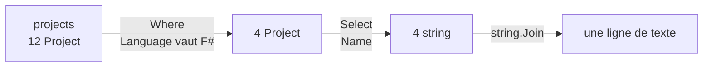

La `List<T>` de la leçon 4 garde ses éléments dans l'ordre et les retrouve par leur position. Deux autres collections répondent à d'autres questions. Un **dictionnaire** répond à « quelle est la valeur pour ce nom ? », et un **ensemble** répond à « cette valeur fait-elle partie du groupe ? ». La seconde moitié de la leçon présente **LINQ**, une famille de méthodes qui comptent, filtrent et trient une collection, chacune en une ligne. Avec elles, chacune des boucles que la leçon 4 écrivait à la main pour les projets de Guitar Alchemist tient en une seule ligne.

Tous les programmes de cette leçon se trouvent dans [`code/csharp-beginner`](https://github.com/spareilleux/learn/tree/main/code/csharp-beginner) ; lance-en un avec [`dotnet run`](https://learn.microsoft.com/dotnet/core/tools/dotnet-run) suivi de son chemin, par exemple `examples/l09_dictionary.cs`. `check.sh` compare leur sortie, et les erreurs du compilateur pour les extraits refusés, avec les fichiers de `expected/`.

## Dictionary : une valeur pour chaque clé

Un [`Dictionary<TKey, TValue>`](https://learn.microsoft.com/dotnet/api/system.collections.generic.dictionary-2) stocke des paires : une **clé**, et la **valeur** qui va avec. Chaque clé n'apparaît qu'une fois. Ses deux types s'écrivent entre les chevrons : `Dictionary<string, int>` a des clés `string` et des valeurs `int`. Ici, la clé est le nom d'une note et la valeur son nombre de demi-tons au-dessus de C, la table que la leçon 3 écrivait sous forme de `switch` :

```csharp
// Un Dictionary<string, int> : le nom de chaque note (la clé) donne son nombre de demi-tons au-dessus de C (la valeur)
var semitones = new Dictionary<string, int>
{
    ["C"] = 0, ["D"] = 2, ["E"] = 4, ["F"] = 5, ["G"] = 7, ["A"] = 9, ["B"] = 11,
};
Console.WriteLine($"{semitones.Count} notes; G is {semitones["G"]} semitones above C");

semitones["F#"] = 6;            // une clé qui n'y est pas encore : ajoutée
semitones.Add("Bb", 10);        // Add ajoute aussi...
try
{
    semitones.Add("C", 0);      // ...mais refuse une clé qui y est déjà
}
catch (ArgumentException ex)
{
    Console.WriteLine(ex.Message);
}
Console.WriteLine($"{semitones.Count} notes");

Console.WriteLine(semitones.ContainsKey("Bb"));
Console.WriteLine(semitones.ContainsKey("H"));   // H est le B de la notation allemande, pas une clé ici

if (semitones.TryGetValue("H", out int h))
{
    Console.WriteLine($"H is {h} semitones above C");
}
else
{
    Console.WriteLine("no H in this dictionary");
}

Console.WriteLine(string.Join(" ", semitones));   // chaque élément est une KeyValuePair<string, int>
```

```text
7 notes; G is 7 semitones above C
An item with the same key has already been added. Key: C
9 notes
True
False
no H in this dictionary
[C, 0] [D, 2] [E, 4] [F, 5] [G, 7] [A, 9] [B, 11] [F#, 6] [Bb, 10]
```

- `["C"] = 0` entre les accolades range la valeur 0 sous la clé `"C"` à la création du dictionnaire.
- `semitones["G"]` lit la valeur d'une clé, avec les mêmes crochets qu'un tableau, mais avec une clé au lieu d'une position.
- `semitones["F#"] = 6` ajoute la clé si elle n'y est pas, et remplace sa valeur si elle y est.
- [`Add`](https://learn.microsoft.com/dotnet/api/system.collections.generic.dictionary-2.add) ajoute aussi une clé, mais lève une [`ArgumentException`](https://learn.microsoft.com/dotnet/api/system.argumentexception) si la clé y est déjà : le `catch` de la leçon 8 affiche son message.
- [`ContainsKey`](https://learn.microsoft.com/dotnet/api/system.collections.generic.dictionary-2.containskey) dit si une clé est présente.
- [`TryGetValue`](https://learn.microsoft.com/dotnet/api/system.collections.generic.dictionary-2.trygetvalue) est une méthode *Try*, comme celles de la leçon 8 : elle renvoie `false` quand la clé manque, et met la valeur dans sa variable `out` quand elle est présente.
- Chaque élément d'un dictionnaire est une [`KeyValuePair<string, int>`](https://learn.microsoft.com/dotnet/api/system.collections.generic.keyvaluepair-2), avec une `Key` et une `Value` ; `string.Join` l'affiche sous la forme `[key, value]`.

Un dictionnaire contient la table sous forme de données, pas de code : un programme peut le remplir pendant qu'il s'exécute, et la [leçon 10](../#plan) en remplira un à partir d'un fichier.

Un dictionnaire se lit par clé, pas par position. Demander l'élément 0 d'un dictionnaire dont les clés sont des chaînes est une erreur de type :

```csharp
var semitones = new Dictionary<string, int> { ["C"] = 0, ["D"] = 2, ["E"] = 4 };
Console.WriteLine(semitones[0]);
```

```text
l09_dictionary_by_position.cs(2,29): error CS1503: Argument 1: cannot convert from 'int' to 'string'
```

### Une clé absente lève une exception

Lire une clé absente du dictionnaire ne renvoie ni 0 ni `null`, mais lève une exception :

```csharp
// Lire une clé qui n'est pas dans le dictionnaire lève une exception
var semitones = new Dictionary<string, int>
{
    ["C"] = 0, ["D"] = 2, ["E"] = 4, ["F"] = 5, ["G"] = 7, ["A"] = 9, ["B"] = 11,
};

string note = "H";
Console.WriteLine($"{note} is {semitones[note]} semitones above C");
```

```text
Unhandled exception. System.Collections.Generic.KeyNotFoundException: The given key 'H' was not present in the dictionary.
```

La règle de la leçon 8 s'applique. Quand une clé absente est un bogue du programme, l'indexeur `semitones[note]` et sa [`KeyNotFoundException`](https://learn.microsoft.com/dotnet/api/system.collections.generic.keynotfoundexception) sont le bon choix : le programme s'arrête là où se trouve le bogue. Quand une clé absente est un cas ordinaire, comme une note tapée par un utilisateur, utilise `TryGetValue`.

### Compter avec un dictionnaire

Un dictionnaire peut compter : la clé est ce que tu comptes, la valeur le nombre de fois que tu l'as vu.

```csharp
// Combien de fois chaque note apparaît dans la première phrase de l'Hymne à la joie de Beethoven
string[] melody = ["E", "E", "F", "G", "G", "F", "E", "D", "C", "C", "D", "E", "E", "D", "D"];

var counts = new Dictionary<string, int>();
foreach (string note in melody)
{
    counts[note] = counts.GetValueOrDefault(note) + 1;   // 0 + 1 la première fois
}

foreach (var (note, count) in counts)
{
    Console.WriteLine($"{note}: {count}");
}
```

```text
E: 5
F: 2
G: 2
D: 4
C: 2
```

[`GetValueOrDefault`](https://learn.microsoft.com/dotnet/api/system.collections.generic.collectionextensions.getvalueordefault) renvoie la valeur de la clé, ou 0, la valeur par défaut d'un `int`, quand la clé n'y est pas encore. Le premier `E` enregistre donc 0 + 1, et chaque `E` suivant remplace le compte par le compte plus un. `foreach (var (note, count) in counts)` décompose chaque `KeyValuePair` en deux variables, sa clé et sa valeur.

### Ne compte pas sur l'ordre d'un dictionnaire

Les notes sont sorties dans l'ordre de leur première apparition : E, F, G, D, C. La documentation de `Dictionary` ne le promet pas : « The order in which the items are returned is undefined. » (l'ordre dans lequel les éléments sont renvoyés n'est pas défini). Voici ce que fait .NET 10 quand on retire une clé, puis qu'on en ajoute une autre :

```csharp
// L'ordre d'un foreach sur un dictionnaire : retirer une clé, en ajouter une autre
var semitones = new Dictionary<string, int> { ["C"] = 0, ["D"] = 2, ["E"] = 4, ["G"] = 7, ["A"] = 9 };
Console.WriteLine(string.Join(" ", semitones.Keys));

semitones.Remove("D");
semitones.Add("F#", 6);
Console.WriteLine(string.Join(" ", semitones.Keys));
```

```text
C D E G A
C F# E G A
```

La clé `F#` a été ajoutée en dernier mais arrive en deuxième position, à la place laissée par `D`. Tant qu'un programme ne fait qu'ajouter des clés, l'ordre ressemble à l'ordre d'ajout ; un seul [`Remove`](https://learn.microsoft.com/dotnet/api/system.collections.generic.dictionary-2.remove) suffit à le casser. Quand l'ordre compte, trie : `OrderBy`, plus bas, le fait, et l'exercice 2 trie les comptes de la mélodie. Le [journal](../journal/#2026-10-02--collections-et-linq) consigne cette expérience, avec l'hypothèse écrite avant de la lancer.

## HashSet : chaque valeur une seule fois

Un [`HashSet<T>`](https://learn.microsoft.com/dotnet/api/system.collections.generic.hashset-1) est un **ensemble** : il contient chaque valeur au plus une fois, et il répond vite à « cette valeur en fait-elle partie ? ». Les notes d'un accord forment un ensemble : do majeur, c'est C, E et G, dans n'importe quel ordre, et ajouter un second E ne change pas l'accord.

```csharp
// Un HashSet<string> contient chaque valeur une seule fois : les notes d'un accord
HashSet<string> cMajor = ["C", "E", "G"];
HashSet<string> aMinor = ["A", "C", "E"];

Console.WriteLine(cMajor.Add("E"));     // False : E y est déjà
Console.WriteLine(cMajor.Add("B"));     // True : C E G B, c'est Cmaj7
Console.WriteLine($"{cMajor.Count} notes, contains G: {cMajor.Contains("G")}");
cMajor.Remove("B");

// IntersectWith, UnionWith et ExceptWith modifient l'ensemble sur lequel on les appelle : travaille sur une copie
var common = new HashSet<string>(cMajor);
common.IntersectWith(aMinor);
Console.WriteLine($"in both chords: {string.Join(" ", common)}");

var all = new HashSet<string>(cMajor);
all.UnionWith(aMinor);
Console.WriteLine($"in either chord: {string.Join(" ", all)}");

var onlyC = new HashSet<string>(cMajor);
onlyC.ExceptWith(aMinor);
Console.WriteLine($"only in C major: {string.Join(" ", onlyC)}");

HashSet<string> sameNotes = ["G", "C", "E"];
Console.WriteLine(cMajor.SetEquals(sameNotes));  // True : mêmes notes, écrites dans un autre ordre

HashSet<string> cSharp = ["C#", "F", "G#"];
HashSet<string> dFlat = ["Db", "F", "Ab"];
Console.WriteLine(cSharp.SetEquals(dFlat));      // False : les chaînes diffèrent, pas les sons
```

```text
False
True
4 notes, contains G: True
in both chords: C E
in either chord: C E G A
only in C major: G
True
False
```

- [`Add`](https://learn.microsoft.com/dotnet/api/system.collections.generic.hashset-1.add) renvoie `false` quand la valeur est déjà dans l'ensemble, et ne change rien.
- [`IntersectWith`](https://learn.microsoft.com/dotnet/api/system.collections.generic.hashset-1.intersectwith) garde les valeurs qui sont aussi dans l'autre ensemble : C et E, les deux notes que do majeur et la mineur ont en commun. [`UnionWith`](https://learn.microsoft.com/dotnet/api/system.collections.generic.hashset-1.unionwith) ajoute les valeurs de l'autre ensemble, et [`ExceptWith`](https://learn.microsoft.com/dotnet/api/system.collections.generic.hashset-1.exceptwith) les retire. Ces trois méthodes modifient l'ensemble lui-même, donc le programme travaille sur des copies faites avec `new HashSet<string>(cMajor)`.
- [`SetEquals`](https://learn.microsoft.com/dotnet/api/system.collections.generic.hashset-1.setequals) compare les contenus et ignore l'ordre.

La dernière ligne est une limite de ce programme, pas de `HashSet`. Do dièse et ré bémol sont la même touche du piano, mais `"C#"` et `"Db"` sont des chaînes différentes, donc les deux ensembles diffèrent. Un programme qui doit les traiter comme la même note compare des nombres, les demi-tons du dictionnaire plus haut, plutôt que des noms.

Un ensemble n'a pas de positions. Sa documentation dit qu'il « is not sorted and cannot contain duplicate elements » (n'est pas trié et ne peut pas contenir de doublons), et il n'a pas d'indexeur :

```csharp
HashSet<string> chord = ["C", "E", "G"];
Console.WriteLine(chord[0]);
```

```text
l09_hashset_index.cs(2,19): error CS0021: Cannot apply indexing with [] to an expression of type 'HashSet<string>'
```

| | `List<T>` | `Dictionary<TKey, TValue>` | `HashSet<T>` |
|---|---|---|---|
| Contient | des éléments dans l'ordre | une valeur par clé | chaque valeur une seule fois |
| Trouver un élément par | position, `list[2]` | clé, `dict["G"]` | valeur, `set.Contains("G")` |
| Un doublon | est gardé | clé : `Add` lève une exception, `[key] =` remplace | `Add` renvoie `false` |
| À utiliser quand | l'ordre compte | tu cherches par nom | tu demandes « est-ce dedans ? » |

## LINQ : compter, filtrer et trier en une ligne

La leçon 4 écrivait une méthode avec une boucle pour chaque question sur les projets de GA : combien commencent par `GA.Business.`, lesquels sont en F#, quel nom est le plus long. [**LINQ**](https://learn.microsoft.com/dotnet/csharp/linq/) (*Language-Integrated Query*, requête intégrée au langage) est une famille de méthodes que possède toute collection : tableaux, listes, dictionnaires et ensembles. Chaque méthode reçoit un petit morceau de code qui dit quoi chercher.

### Les lambdas

Ce morceau de code est une [**expression lambda**](https://learn.microsoft.com/dotnet/csharp/language-reference/operators/lambda-expressions), une méthode sans nom, écrite là où on l'utilise. `Project` est un record de la leçon 6, avec un nom et un langage :

```csharp
// Une lambda et une méthode nommée qui font le même travail
List<Project> projects =
[
    new Project("GA.Core", "C#"),
    new Project("GA.Business.Config", "F#"),
    new Project("GA.Business.DSL", "F#"),
];

Console.WriteLine(projects.Count(p => p.Language == "F#"));
Console.WriteLine(projects.Count(IsFSharp));

bool IsFSharp(Project p) => p.Language == "F#";

record Project(string Name, string Language);
```

```text
2
2
```

Dans `p => p.Language == "F#"`, à gauche de `=>` se trouve le paramètre de la lambda, `p` ; à droite, la valeur qu'elle renvoie, ici un `bool`. [`Count`](https://learn.microsoft.com/dotnet/api/system.linq.enumerable.count) l'appelle une fois pour chaque projet et compte les réponses `true`. La méthode `IsFSharp`, écrite avec `=>` comme à la leçon 8, fait le même travail, et `Count` l'accepte aussi ; la lambda évite de donner un nom à du code utilisé à un seul endroit. Le compilateur déduit le type de `p` de la collection : dans une `List<Project>`, `p` est un `Project`.

### Where, Select, OrderBy et les autres

La leçon 4 rangeait les projets dans deux tableaux qui devaient rester alignés. Avec les records de la leçon 6, chaque projet est un seul objet avec un nom et un langage, et LINQ répond à chaque question en une ligne :

```csharp
// Les douze projets de GuitarAlchemist/ga de la leçon 4, en une seule liste de records, interrogée avec LINQ
List<Project> projects =
[
    new Project("GA.Core", "C#"),
    new Project("GA.Domain.Core", "C#"),
    new Project("GA.Business.Config", "F#"),
    new Project("GA.Business.Core", "C#"),
    new Project("GA.Business.DSL", "F#"),
    new Project("GA.Business.AI", "C#"),
    new Project("GA.Business.ML", "C#"),
    new Project("GA.Business.ProbabilisticGrammar", "F#"),
    new Project("GA.Business.Core.Generated", "F#"),
    new Project("GA.Infrastructure", "C#"),
    new Project("GA.Presentation", "C#"),
    new Project("GA.Testing.Semantic", "C#"),
];

int business = projects.Count(p => p.Name.StartsWith("GA.Business."));
Console.WriteLine($"{business} projects start with GA.Business.");

IEnumerable<string> fsharp = projects.Where(p => p.Language == "F#").Select(p => p.Name);
Console.WriteLine($"F#: {string.Join(", ", fsharp)}");

Project longest = projects.OrderByDescending(p => p.Name.Length).First();
Console.WriteLine($"Longest name: {longest.Name}");

Console.WriteLine("Sorted by language, then by name:");
foreach (Project project in projects.OrderBy(p => p.Language).ThenBy(p => p.Name).Take(4))
{
    Console.WriteLine($"  {project.Language} {project.Name}");
}

Console.WriteLine($"Any F#? {projects.Any(p => p.Language == "F#")}");
Console.WriteLine($"All start with GA.? {projects.All(p => p.Name.StartsWith("GA."))}");

Project? rust = projects.FirstOrDefault(p => p.Language == "Rust");
Console.WriteLine(rust?.Name ?? "no Rust project");

List<string> csharp = projects.Where(p => p.Language == "C#").Select(p => p.Name).ToList();
Console.WriteLine($"{csharp.Count} C# projects, the first is {csharp[0]}");

record Project(string Name, string Language);
```

```text
7 projects start with GA.Business.
F#: GA.Business.Config, GA.Business.DSL, GA.Business.ProbabilisticGrammar, GA.Business.Core.Generated
Longest name: GA.Business.ProbabilisticGrammar
Sorted by language, then by name:
  C# GA.Business.AI
  C# GA.Business.Core
  C# GA.Business.ML
  C# GA.Core
Any F#? True
All start with GA.? True
no Rust project
8 C# projects, the first is GA.Core
```

Les réponses sont celles de la leçon 4, sans ses trois méthodes ni leurs boucles. Une chaîne se lit de gauche à droite, chaque méthode travaillant sur ce que la précédente a renvoyé :



| Méthode | Renvoie | Ici |
|---|---|---|
| `Count` | combien d'éléments correspondent | 7 projets commencent par `GA.Business.` |
| [`Where`](https://learn.microsoft.com/dotnet/api/system.linq.enumerable.where) | les éléments qui correspondent | les projets F# |
| [`Select`](https://learn.microsoft.com/dotnet/api/system.linq.enumerable.select) | une nouvelle valeur par élément | le nom de chaque projet |
| [`OrderBy`](https://learn.microsoft.com/dotnet/api/system.linq.enumerable.orderby), [`OrderByDescending`](https://learn.microsoft.com/dotnet/api/system.linq.enumerable.orderbydescending), [`ThenBy`](https://learn.microsoft.com/dotnet/api/system.linq.enumerable.thenby) | les éléments, triés selon une clé ; `ThenBy` départage les égalités | par langage, puis par nom |
| [`First`](https://learn.microsoft.com/dotnet/api/system.linq.enumerable.first), [`FirstOrDefault`](https://learn.microsoft.com/dotnet/api/system.linq.enumerable.firstordefault) | le premier élément (qui correspond) | le nom le plus long ; aucun projet Rust |
| [`Any`](https://learn.microsoft.com/dotnet/api/system.linq.enumerable.any), [`All`](https://learn.microsoft.com/dotnet/api/system.linq.enumerable.all) | si un élément, ou tous les éléments, correspondent | `True`, `True` |
| [`Take`](https://learn.microsoft.com/dotnet/api/system.linq.enumerable.take) | les *n* premiers éléments | quatre lignes seulement |
| [`ToList`](https://learn.microsoft.com/dotnet/api/system.linq.enumerable.tolist) | une nouvelle `List<T>` avec les éléments | les projets C# |

`First` lève une [`InvalidOperationException`](https://learn.microsoft.com/dotnet/api/system.invalidoperationexception) quand rien ne correspond ; `FirstOrDefault` renvoie `null` à la place, donc son résultat est un `Project?`, et `?.` et `??`, vus à la leçon 8, traitent le projet manquant. `OrderBy` effectue un tri *stable*, dit sa documentation : deux projets qui ont la même clé gardent leur ordre, et `ThenBy` les départage.

`Where` et `Select` renvoient un [`IEnumerable<T>`](https://learn.microsoft.com/dotnet/api/system.collections.generic.ienumerable-1), une séquence qu'on peut lire avec `foreach`, pas une `List<T>`. Mettre le résultat dans une variable de type liste est une erreur, et `ToList` la corrige :

```csharp
List<string> names = ["GA.Core", "GA.Business.DSL", "GA.Business.AI"];
List<string> business = names.Where(n => n.StartsWith("GA.Business."));
```

```text
l09_where_is_not_a_list.cs(2,25): error CS0266: Cannot implicitly convert type 'System.Collections.Generic.IEnumerable<string>' to 'System.Collections.Generic.List<string>'. An explicit conversion exists (are you missing a cast?)
```

La lambda donnée à `Where` doit renvoyer un `bool`, « garder ou non ». Une lambda qui renvoie un nombre reçoit deux erreurs au même endroit :

```csharp
List<string> names = ["GA.Core", "GA.Business.DSL", "GA.Business.AI"];
var longNames = names.Where(n => n.Length);
```

```text
l09_lambda_not_bool.cs(2,34): error CS0029: Cannot implicitly convert type 'int' to 'bool'
l09_lambda_not_bool.cs(2,34): error CS1662: Cannot convert lambda expression to intended delegate type because some of the return types in the block are not implicitly convertible to the delegate return type
```

`n => n.Length > 20` renvoie un `bool` et compile.

### Une requête s'exécute quand on la lit

`Where` ne calcule pas son résultat quand la ligne s'exécute. Il renvoie une requête qui le calcule chaque fois que quelque chose la lit, avec un `foreach`, `string.Join` ou `ToList` :

```csharp
// Une requête s'exécute quand on la lit, pas quand on l'écrit ; ToList garde le résultat d'une exécution
List<int> frets = [0, 3, 5, 7];

IEnumerable<int> high = frets.Where(f => f >= 5);
List<int> highNow = frets.Where(f => f >= 5).ToList();

frets.Add(12);

Console.WriteLine($"query:  {string.Join(" ", high)}");
Console.WriteLine($"ToList: {string.Join(" ", highNow)}");
```

```text
query:  5 7 12
ToList: 5 7
```

La frette 12 a été ajoutée après les deux lignes, et la requête la trouve quand même, parce que `string.Join` l'a exécutée après le `Add`. `ToList` l'a exécutée une fois, avant le `Add`, et a gardé ce résultat. C'est ce qu'on appelle l'[exécution différée](https://learn.microsoft.com/dotnet/standard/linq/deferred-execution-lazy-evaluation). Appelle `ToList` quand tu veux le résultat tel qu'il est maintenant, ou quand tu vas le lire plusieurs fois.

## Ne modifie pas une collection dans son propre foreach

Un `foreach` sur une liste s'arrête avec une exception si la liste change pendant la boucle :

```csharp
// Retirer des éléments d'une liste dans un foreach sur cette même liste
List<string> strings = ["E2", "A2", "D3", "G3", "B3", "E4"];

foreach (string s in strings)
{
    if (s.StartsWith("E"))
    {
        strings.Remove(s);
    }
}

Console.WriteLine(string.Join(" ", strings));
```

```text
Unhandled exception. System.InvalidOperationException: Collection was modified; enumeration operation may not execute.
```

Le `foreach` ne peut pas savoir quel élément vient ensuite une fois que la liste a déplacé ses éléments, donc il refuse de continuer. L'exercice 3 retire les cordes de mi de deux façons qui fonctionnent.

Un dictionnaire fait exception à la règle. Depuis .NET Core 3.0, sa documentation dit que `Remove` « may be safely called without invalidating active enumerators » (peut être appelée sans risque sans invalider les énumérateurs actifs). Ajouter une clé arrête quand même la boucle :

```csharp
// Un dictionnaire permet Remove dans son propre foreach, mais pas l'ajout d'une clé
var semitones = new Dictionary<string, int> { ["C"] = 0, ["D"] = 2, ["E"] = 4 };

foreach (var (name, value) in semitones)
{
    if (name == "D")
    {
        semitones.Remove(name);
    }
}
Console.WriteLine($"after Remove: {string.Join(" ", semitones.Keys)}");

try
{
    foreach (var (name, value) in semitones)
    {
        if (name == "C")
        {
            semitones["B"] = 11;
        }
    }
}
catch (InvalidOperationException ex)
{
    Console.WriteLine($"adding a key: {ex.Message}");
}
```

```text
after Remove: C E
adding a key: Collection was modified; enumeration operation may not execute.
```

## Dans Guitar Alchemist

Au commit `5c3a52a`, Guitar Alchemist utilise les trois collections de cette leçon, et LINQ, dans du code qu'un débutant peut lire.

**Un dictionnaire qui règle le problème de do dièse et ré bémol.** [`ChordVocabulary.PitchClasses`](https://github.com/GuitarAlchemist/ga/blob/5c3a52ab40d0d433f8f68dbbd0590f70c8d8cf26/Common/GA.Business.ML/Agents/ChordVocabulary.cs#L23) associe chaque façon d'écrire une note à sa *classe de hauteur*, son nombre de demi-tons au-dessus de C, de 0 à 11, comme le premier dictionnaire de cette leçon. `"C#"` et `"Db"` donnent tous deux 1 : un programme qui transforme les noms en nombres avant de les comparer traite les deux comme la même note. Le dictionnaire est créé avec [`StringComparer.OrdinalIgnoreCase`](https://learn.microsoft.com/dotnet/api/system.stringcomparer.ordinalignorecase), qui permet à `"c#"` de trouver la clé `"C#"`, et [`TryGetPitchClass`](https://github.com/GuitarAlchemist/ga/blob/5c3a52ab40d0d433f8f68dbbd0590f70c8d8cf26/Common/GA.Business.ML/Agents/ChordVocabulary.cs#L35) le lit avec `TryGetValue`, parce qu'un utilisateur peut taper une note qui n'existe pas. Les remarques de la classe disent pourquoi elle existe : deux copies de la table « had drifted in a load-bearing way » (avaient divergé sur un point dont le code dépendait). À ce commit, 18 fichiers de GA associent `"Db"` à 1 dans une table à eux, celle-ci comprise.

**Un ensemble qui garde ses notes dans l'ordre.** [`PitchClassSet`](https://github.com/GuitarAlchemist/ga/blob/5c3a52ab40d0d433f8f68dbbd0590f70c8d8cf26/Common/GA.Domain.Core/Theory/Atonal/PitchClassSet.cs#L28), l'ensemble de notes de GA, implémente [`IReadOnlySet<PitchClass>`](https://learn.microsoft.com/dotnet/api/system.collections.generic.ireadonlyset-1), l'interface d'un ensemble qu'on ne peut pas modifier, et range ses notes dans un [`ImmutableSortedSet`](https://learn.microsoft.com/dotnet/api/system.collections.immutable.immutablesortedset-1) ([ligne 37](https://github.com/GuitarAlchemist/ga/blob/5c3a52ab40d0d433f8f68dbbd0590f70c8d8cf26/Common/GA.Domain.Core/Theory/Atonal/PitchClassSet.cs#L37)). Contrairement à un `HashSet`, il donne toujours ses notes dans l'ordre croissant, de 0 à 11, et deux ensembles qui ont les mêmes notes sont égaux ([ligne 780](https://github.com/GuitarAlchemist/ga/blob/5c3a52ab40d0d433f8f68dbbd0590f70c8d8cf26/Common/GA.Domain.Core/Theory/Atonal/PitchClassSet.cs#L780)).

**Un tri qu'un dictionnaire garde par hasard.** `MusicalKnowledgeService` compte les entrées de chaque artiste dans les données musicales de GA. La [ligne 226](https://github.com/GuitarAlchemist/ga/blob/5c3a52ab40d0d433f8f68dbbd0590f70c8d8cf26/Common/GA.Business.Config/Configuration/MusicalKnowledgeService.cs#L226) contient `foreach (var artist in GetAllArtists().Take(20)) // Top 20 artists`, et la [ligne 235](https://github.com/GuitarAlchemist/ga/blob/5c3a52ab40d0d433f8f68dbbd0590f70c8d8cf26/Common/GA.Business.Config/Configuration/MusicalKnowledgeService.cs#L235) renvoie `breakdown.OrderByDescending(kvp => kvp.Value).ToDictionary(kvp => kvp.Key, kvp => kvp.Value)`. Deux points de cette leçon s'y rencontrent :

- `GetAllArtists` se termine par `OrderBy(a => a)` ([ligne 125](https://github.com/GuitarAlchemist/ga/blob/5c3a52ab40d0d433f8f68dbbd0590f70c8d8cf26/Common/GA.Business.Config/Configuration/MusicalKnowledgeService.cs#L125)) : les artistes arrivent par ordre alphabétique, donc `Take(20)` garde les 20 premiers de l'alphabet, pas les 20 qui ont le plus d'entrées. Le tri par nombre d'entrées vient après la coupe.
- [`ToDictionary`](https://learn.microsoft.com/dotnet/api/system.linq.enumerable.todictionary) range le résultat trié dans un dictionnaire, dont l'ordre n'est pas promis. Il ressort trié parce que rien n'en est retiré, comme le montre l'expérience de cette leçon ; une liste garderait l'ordre à coup sûr.

Une [sonde](https://github.com/spareilleux/learn/blob/main/code/csharp-beginner/ga-probes/artists.cs) a exécuté ce code à ce commit et a trouvé autre chose : 16 artistes seulement, donc `Take(20)` n'en écarte encore aucun. Trois des quatre fichiers YAML que lit le service ne se chargent pas :

- dans `ChordProgressions.yaml`, [`Function`](https://github.com/GuitarAlchemist/ga/blob/5c3a52ab40d0d433f8f68dbbd0590f70c8d8cf26/Common/GA.Business.Config/ChordProgressions.yaml#L93) est une seule chaîne là où la classe C# attend une `List<string>` ([ligne 16](https://github.com/GuitarAlchemist/ga/blob/5c3a52ab40d0d433f8f68dbbd0590f70c8d8cf26/Common/GA.Business.Config/Configuration/ChordProgressionsConfigLoader.cs#L16)) ;
- dans `GuitarTechniques.yaml`, [`Applications`](https://github.com/GuitarAlchemist/ga/blob/5c3a52ab40d0d433f8f68dbbd0590f70c8d8cf26/Common/GA.Business.Config/GuitarTechniques.yaml#L23) contient des chaînes là où la classe attend des objets ([ligne 20](https://github.com/GuitarAlchemist/ga/blob/5c3a52ab40d0d433f8f68dbbd0590f70c8d8cf26/Common/GA.Business.Config/Configuration/GuitarTechniquesConfigLoader.cs#L20)) ;
- la [ligne 95](https://github.com/GuitarAlchemist/ga/blob/5c3a52ab40d0d433f8f68dbbd0590f70c8d8cf26/Common/GA.Business.Config/SpecializedTunings.yaml#L95) de `SpecializedTunings.yaml` n'est pas du YAML valide.

Chaque chargeur [attrape l'exception](https://github.com/GuitarAlchemist/ga/blob/5c3a52ab40d0d433f8f68dbbd0590f70c8d8cf26/Common/GA.Business.Config/Configuration/ChordProgressionsConfigLoader.cs#L137), affiche une ligne, et continue avec un seul élément d'exemple. C'est l'inverse de la règle de la leçon 8 : ce `catch` cache un bogue au lieu de traiter un échec ordinaire. Le [tableau QA du journal](../journal/#qa) consigne les mesures ; la [leçon 10](../#plan) lit des fichiers.

## Exercices

### Exercice 1 — prédis la sortie

Note ce qu'affiche chaque ligne, puis exécute `exercises/l09_ex_predict.cs` :

```csharp
// Exercice 1 : note ce qu'affiche chaque ligne, puis exécute le programme
HashSet<string> notes = ["C", "E", "G"];
Console.WriteLine(notes.Add("E"));
Console.WriteLine(notes.Count);

var capos = new Dictionary<string, int> { ["Here Comes the Sun"] = 7 };
capos["Blackbird"] = 0;
capos["Here Comes the Sun"] = 2;
Console.WriteLine(capos.Count);
Console.WriteLine(capos["Here Comes the Sun"]);

List<int> frets = [3, 0, 12, 5];
IEnumerable<int> sorted = frets.OrderBy(f => f);
frets.Add(1);
Console.WriteLine(string.Join(" ", sorted));
```

<details>
<summary>Solution</summary>

```text
False
3
2
2
0 1 3 5 12
```

- `Add("E")` renvoie `False` : E est déjà dans l'ensemble, qui garde 3 notes.
- `capos["Here Comes the Sun"] = 2` remplace la valeur d'une clé présente ; il n'ajoute rien, donc le dictionnaire a 2 clés, et la valeur vaut maintenant 2.
- `OrderBy` renvoie une requête, qui s'exécute quand `string.Join` la lit, après le `Add` : le 1 est dans le résultat.

</details>

### Exercice 2 — les notes les plus fréquentes d'abord

Pars de `examples/l09_count_notes.cs` et affiche les comptes de la note la plus fréquente à la moins fréquente ; les notes qui ont le même compte vont dans l'ordre alphabétique. Utilise `OrderByDescending` et `ThenBy` sur le dictionnaire : chaque élément est une `KeyValuePair`, avec `Key` et `Value`.

<details>
<summary>Solution</summary>

```csharp
// Exercice 2 : les notes de la mélodie, la plus fréquente d'abord ; à compte égal, dans l'ordre alphabétique
string[] melody = ["E", "E", "F", "G", "G", "F", "E", "D", "C", "C", "D", "E", "E", "D", "D"];

var counts = new Dictionary<string, int>();
foreach (string note in melody)
{
    counts[note] = counts.GetValueOrDefault(note) + 1;
}

foreach (var (note, count) in counts.OrderByDescending(pair => pair.Value).ThenBy(pair => pair.Key))
{
    Console.WriteLine($"{note}: {count}");
}
```

```text
E: 5
D: 4
C: 2
F: 2
G: 2
```

Sans `ThenBy`, C, F et G garderaient l'ordre du dictionnaire, parce que le tri est stable, et cet ordre n'est pas promis. `ThenBy(pair => pair.Key)` rend la sortie identique quoi que fasse le dictionnaire.

</details>

### Exercice 3 — retirer les cordes de mi

Corrige `examples/l09_modify_while_looping.cs` pour qu'il affiche `A2 D3 G3 B3` sans modifier la liste dans son propre `foreach`. Trouve deux façons : une qui modifie la liste, avec [`List<T>.RemoveAll`](https://learn.microsoft.com/dotnet/api/system.collections.generic.list-1.removeall), et une qui construit une nouvelle liste avec LINQ et garde l'originale.

<details>
<summary>Solution</summary>

```csharp
// Exercice 3 : retirer les cordes de mi sans modifier la liste dans son propre foreach
List<string> strings = ["E2", "A2", "D3", "G3", "B3", "E4"];

// RemoveAll reçoit une lambda et retire chaque élément pour lequel elle renvoie true
List<string> first = new List<string>(strings);
first.RemoveAll(s => s.StartsWith("E"));
Console.WriteLine(string.Join(" ", first));

// Ou construire une nouvelle liste avec Where, et garder l'originale
List<string> second = strings.Where(s => !s.StartsWith("E")).ToList();
Console.WriteLine(string.Join(" ", second));
Console.WriteLine(string.Join(" ", strings));
```

```text
A2 D3 G3 B3
A2 D3 G3 B3
E2 A2 D3 G3 B3 E4
```

`RemoveAll` fait lui-même sa boucle sur la liste et déplace les éléments qu'il garde, donc aucun `foreach` n'est en cours quand la liste change. `Where` lit la liste sans la modifier, et `ToList` copie ce que `Where` garde dans une nouvelle liste.

</details>

### Exercice 4 — les accords de do majeur

Les six accords construits sur les notes de do majeur sont dans un dictionnaire dont les valeurs sont des ensembles :

```csharp
// Exercice 4 : les six accords de do majeur, chacun un ensemble de notes
var chords = new Dictionary<string, HashSet<string>>
{
    ["C"] = ["C", "E", "G"],
    ["Dm"] = ["D", "F", "A"],
    ["Em"] = ["E", "G", "B"],
    ["F"] = ["F", "A", "C"],
    ["G"] = ["G", "B", "D"],
    ["Am"] = ["A", "C", "E"],
};
```

1. Affiche les accords qui contiennent à la fois E et G.
2. Affiche les autres accords, de celui qui a le plus de notes en commun avec C à celui qui en a le moins, puis par nom, avec le nombre de notes qu'ils partagent.

<details>
<summary>Solution</summary>

```csharp
// 1. Les accords qui contiennent à la fois E et G
IEnumerable<string> withEAndG = chords
    .Where(pair => pair.Value.Contains("E") && pair.Value.Contains("G"))
    .Select(pair => pair.Key);
Console.WriteLine($"E and G: {string.Join(" ", withEAndG)}");

// 2. Les autres accords, selon le nombre de notes qu'ils partagent avec C, puis par nom
var others = chords
    .Where(pair => pair.Key != "C")
    .OrderByDescending(pair => CommonWithC(pair.Value))
    .ThenBy(pair => pair.Key);
foreach (var (name, notes) in others)
{
    Console.WriteLine($"{name}: {CommonWithC(notes)} in common with C");
}

int CommonWithC(HashSet<string> notes) => notes.Count(note => chords["C"].Contains(note));
```

```text
E and G: C Em
Am: 2 in common with C
Em: 2 in common with C
F: 1 in common with C
G: 1 in common with C
Dm: 0 in common with C
```

Une chaîne de méthodes LINQ peut s'étendre sur plusieurs lignes, chacune commençant par son `.`. `CommonWithC` est une méthode du même genre que celles de la leçon 4, écrite avec `=>` comme à la leçon 8 ; le `Count` de LINQ fonctionne sur un ensemble comme sur une liste. La mineur (Am) et mi mineur (Em) ont deux notes en commun avec do majeur (C), c'est pourquoi une chanson peut souvent utiliser l'un à la place de l'autre.

</details>

## Ce qu'il faut retenir

- Un `Dictionary<TKey, TValue>` trouve une valeur par sa clé. `dict[key]` lève `KeyNotFoundException` quand la clé manque ; `TryGetValue` renvoie `false`. `dict[key] = value` ajoute ou remplace ; `Add` lève une exception pour une clé déjà présente.
- L'ordre d'un `foreach` sur un dictionnaire n'est pas promis : après un `Remove`, une nouvelle clé peut prendre la place de celle qui a été retirée. Trie quand l'ordre compte.
- Un `HashSet<T>` contient chaque valeur une seule fois, n'a pas de positions, et compare des contenus avec `SetEquals`. `IntersectWith`, `UnionWith` et `ExceptWith` modifient l'ensemble lui-même.
- Une lambda `x => ...` est une méthode sans nom. Les méthodes `Where`, `Select`, `OrderBy`, `Count`, `Any` et `First` de LINQ en reçoivent une et fonctionnent sur toutes les collections.
- `Where` et `Select` renvoient un `IEnumerable<T>` qui s'exécute quand on le lit ; `ToList` fait une liste du résultat tel qu'il est maintenant.
- N'ajoute ni ne retire d'éléments d'une liste dans un `foreach` sur cette liste : utilise `RemoveAll`, ou construis une nouvelle liste.

La suite, [fichiers et texte](../#plan), lira les projets de Guitar Alchemist dans un fichier CSV au lieu de les recopier à la main.

## Sources

- Collections : [`Dictionary<TKey, TValue>`](https://learn.microsoft.com/dotnet/api/system.collections.generic.dictionary-2), [`Add`](https://learn.microsoft.com/dotnet/api/system.collections.generic.dictionary-2.add), [`ContainsKey`](https://learn.microsoft.com/dotnet/api/system.collections.generic.dictionary-2.containskey), [`TryGetValue`](https://learn.microsoft.com/dotnet/api/system.collections.generic.dictionary-2.trygetvalue), [`Remove`](https://learn.microsoft.com/dotnet/api/system.collections.generic.dictionary-2.remove), [`KeyValuePair<TKey, TValue>`](https://learn.microsoft.com/dotnet/api/system.collections.generic.keyvaluepair-2), [`GetValueOrDefault`](https://learn.microsoft.com/dotnet/api/system.collections.generic.collectionextensions.getvalueordefault), [`HashSet<T>`](https://learn.microsoft.com/dotnet/api/system.collections.generic.hashset-1), [`List<T>.RemoveAll`](https://learn.microsoft.com/dotnet/api/system.collections.generic.list-1.removeall), [`IEnumerable<T>`](https://learn.microsoft.com/dotnet/api/system.collections.generic.ienumerable-1)
- Exceptions : [`ArgumentException`](https://learn.microsoft.com/dotnet/api/system.argumentexception), [`KeyNotFoundException`](https://learn.microsoft.com/dotnet/api/system.collections.generic.keynotfoundexception), [`InvalidOperationException`](https://learn.microsoft.com/dotnet/api/system.invalidoperationexception)
- LINQ : [présentation](https://learn.microsoft.com/dotnet/csharp/linq/), [expressions lambda](https://learn.microsoft.com/dotnet/csharp/language-reference/operators/lambda-expressions), [exécution différée](https://learn.microsoft.com/dotnet/standard/linq/deferred-execution-lazy-evaluation), [les méthodes d'`Enumerable`](https://learn.microsoft.com/dotnet/api/system.linq.enumerable)
- Erreurs du compilateur [CS1503](https://learn.microsoft.com/dotnet/csharp/misc/cs1503), [CS0021](https://learn.microsoft.com/dotnet/csharp/misc/cs0021), [CS0266](https://learn.microsoft.com/dotnet/csharp/language-reference/compiler-messages/cs0266), [CS0029](https://learn.microsoft.com/dotnet/csharp/language-reference/compiler-messages/cs0029) et [CS1662](https://learn.microsoft.com/dotnet/csharp/language-reference/compiler-messages/lambda-expression-errors)
