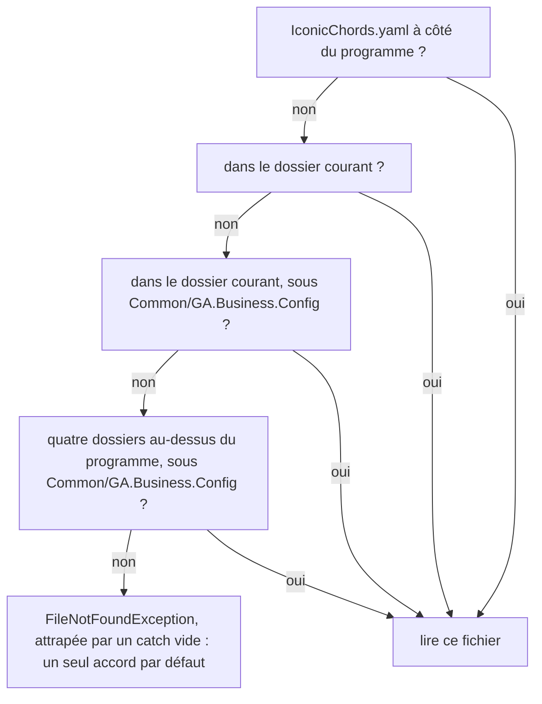

import { Tabs, TabItem } from '@astrojs/starlight/components';

Jusqu'ici, tout ce que savait un programme disparaissait quand il s'arrêtait. Un **fichier** garde du texte sur le disque : un programme peut l'écrire, et le même programme, un autre ou une personne peut le lire plus tard. Cette leçon écrit et lit des fichiers texte, construit leurs chemins, et lit un fichier CSV, un tableau écrit sous forme de texte, avec les projets de [Guitar Alchemist](https://github.com/GuitarAlchemist/ga) que les leçons 4 et 9 tapaient à la main.

Tous les programmes de cette leçon se trouvent dans [`code/csharp-beginner`](https://github.com/spareilleux/learn/tree/main/code/csharp-beginner). Lance-les depuis ce dossier, par exemple avec `dotnet run examples/l10_write_read.cs` : plusieurs d'entre eux y créent un fichier et le suppriment avant de se terminer, et le fichier CSV est dans son dossier `data`. `check.sh` compare leur sortie, et les erreurs du compilateur pour les extraits refusés, avec les fichiers de `expected/`.

## Écrire un fichier, le relire

La classe statique [`File`](https://learn.microsoft.com/dotnet/api/system.io.file), dans l'espace de noms `System.IO` que toute application basée sur un fichier peut utiliser sans `using`, lit et écrit un fichier entier en un seul appel :

```csharp
// Écrire un fichier texte, y ajouter du texte, le relire, puis le supprimer
string path = "practice.txt";

File.WriteAllText(path, "Monday: 30 minutes\n");       // crée le fichier, ou remplace son contenu
File.AppendAllText(path, "Tuesday: 45 minutes\n");     // ajoute à la fin
Console.WriteLine(File.Exists(path));

string text = File.ReadAllText(path);                   // tout le fichier dans une seule chaîne
Console.Write(text);

string[] lines = File.ReadAllLines(path);               // une chaîne par ligne, sans les retours à la ligne
Console.WriteLine($"{lines.Length} lines, the last one: {lines[^1]}");

File.WriteAllLines(path, ["E2", "A2", "D3", "G3", "B3", "E4"]);   // remplace le contenu, un élément par ligne
Console.WriteLine(string.Join(" ", File.ReadAllLines(path)));

File.Delete(path);
Console.WriteLine(File.Exists(path));
```

```text
True
Monday: 30 minutes
Tuesday: 45 minutes
2 lines, the last one: Tuesday: 45 minutes
E2 A2 D3 G3 B3 E4
False
```

| Méthode | Ce qu'elle fait |
|---|---|
| [`File.WriteAllText(path, text)`](https://learn.microsoft.com/dotnet/api/system.io.file.writealltext) | crée le fichier, ou remplace ce qu'il contenait, avec `text` |
| [`File.AppendAllText(path, text)`](https://learn.microsoft.com/dotnet/api/system.io.file.appendalltext) | ajoute `text` à la fin, et crée le fichier si besoin |
| [`File.ReadAllText(path)`](https://learn.microsoft.com/dotnet/api/system.io.file.readalltext) | tout le fichier, sous forme d'une seule `string` |
| [`File.ReadAllLines(path)`](https://learn.microsoft.com/dotnet/api/system.io.file.readalllines) | un `string[]`, un élément par ligne, sans les retours à la ligne |
| [`File.WriteAllLines(path, lines)`](https://learn.microsoft.com/dotnet/api/system.io.file.writealllines) | écrit chaque élément d'une collection sur sa propre ligne |
| [`File.Exists(path)`](https://learn.microsoft.com/dotnet/api/system.io.file.exists) | `true` si le fichier est là |
| [`File.Delete(path)`](https://learn.microsoft.com/dotnet/api/system.io.file.delete) | supprime le fichier ; ne fait rien s'il n'est pas là |

`"\n"` est le retour à la ligne dans une chaîne. `Console.Write`, sans `Line`, affiche le texte tel quel : le fichier se termine déjà par un retour à la ligne.

`ReadAllText` renvoie une seule `string`, qui ne peut donc pas aller dans un tableau. Le compilateur le dit avant que le programme s'exécute :

```csharp
// ReadAllText renvoie une seule chaîne, pas un tableau de lignes
string[] lines = File.ReadAllText("practice.txt");
```

```text
l10_readalltext_array.cs(2,18): error CS0029: Cannot implicitly convert type 'string' to 'string[]'
```

### Quand le fichier n'est pas là

Lire un fichier qui n'existe pas lève une exception, le genre d'échec ordinaire que la leçon 8 attrape. L'exception dit ce qui manque : le fichier, ou un dossier sur le chemin qui y mène.

```csharp
// Lire un fichier qui n'est pas là lève une exception : laquelle dépend de ce qui manque
try
{
    string text = File.ReadAllText("missing.txt");
}
catch (FileNotFoundException ex)
{
    Console.WriteLine($"{ex.GetType().Name}: {Path.GetFileName(ex.FileName)}");
}

try
{
    string text = File.ReadAllText(Path.Combine("nowhere", "missing.txt"));
}
catch (DirectoryNotFoundException ex)
{
    Console.WriteLine(ex.GetType().Name);
}

// Demander d'abord évite l'exception, mais le fichier peut encore disparaître entre les deux lignes
if (File.Exists("missing.txt"))
{
    Console.WriteLine(File.ReadAllText("missing.txt"));
}
else
{
    Console.WriteLine("No missing.txt here");
}
```

```text
FileNotFoundException: missing.txt
DirectoryNotFoundException
No missing.txt here
```

[`FileNotFoundException`](https://learn.microsoft.com/dotnet/api/system.io.filenotfoundexception) porte le chemin du fichier dans `FileName` ; le programme n'affiche que le nom, avec `Path.GetFileName`, pour que sa sortie soit la même sur tous les ordinateurs. [`DirectoryNotFoundException`](https://learn.microsoft.com/dotnet/api/system.io.directorynotfoundexception) veut dire qu'un dossier du chemin manque. Attrape-les là où le programme peut faire quelque chose d'utile, comme demander un autre fichier ; un `catch` qui ne fait qu'afficher puis continuer cache le problème, comme Guitar Alchemist le montre à la fin de cette leçon.

## Chemins

Un **chemin** dit où se trouve un fichier : une liste de noms de dossiers, puis le nom du fichier. Windows les sépare par une barre oblique inverse, `\`, alors que Linux et macOS utilisent une barre oblique, `/`. La classe statique [`Path`](https://learn.microsoft.com/dotnet/api/system.io.path) construit et décompose les chemins avec le bon séparateur, donc le même programme fonctionne partout :

```csharp
// Path construit et décompose les chemins de fichiers sans se soucier du système d'exploitation
string path = Path.Combine("data", "ga-projects.csv");   // data\ga-projects.csv sous Windows, data/ga-projects.csv ailleurs

Console.WriteLine(Path.GetFileName(path));
Console.WriteLine(Path.GetFileNameWithoutExtension(path));
Console.WriteLine(Path.GetExtension(path));
Console.WriteLine(Path.GetFileName(Path.ChangeExtension(path, ".json")));
Console.WriteLine(Path.GetFileName(Path.GetDirectoryName(path)));
Console.WriteLine(Path.IsPathRooted(path));               // False : un chemin relatif

// Le séparateur est la seule différence entre les systèmes
Console.WriteLine(path == "data" + Path.DirectorySeparatorChar + "ga-projects.csv");
```

```text
ga-projects.csv
ga-projects
.csv
ga-projects.json
data
False
True
```

<Tabs syncKey="os">
<TabItem label="Windows">

`Path.Combine("data", "ga-projects.csv")` donne `data\ga-projects.csv`. Un chemin complet commence par une lettre de lecteur, par exemple `C:\Users\you\learn\code\csharp-beginner\data\ga-projects.csv`.

</TabItem>
<TabItem label="Linux / WSL">

`Path.Combine("data", "ga-projects.csv")` donne `data/ga-projects.csv`. Un chemin complet commence à la racine, `/`, par exemple `/home/you/learn/code/csharp-beginner/data/ga-projects.csv`.

</TabItem>
<TabItem label="macOS">

`Path.Combine("data", "ga-projects.csv")` donne `data/ga-projects.csv`. Un chemin complet commence à la racine, `/`, par exemple `/Users/you/learn/code/csharp-beginner/data/ga-projects.csv`.

</TabItem>
</Tabs>

[`Path.Combine`](https://learn.microsoft.com/dotnet/api/system.io.path.combine) joint les morceaux avec [`Path.DirectorySeparatorChar`](https://learn.microsoft.com/dotnet/api/system.io.path.directoryseparatorchar) ; [`GetFileName`](https://learn.microsoft.com/dotnet/api/system.io.path.getfilename), [`GetFileNameWithoutExtension`](https://learn.microsoft.com/dotnet/api/system.io.path.getfilenamewithoutextension), [`GetExtension`](https://learn.microsoft.com/dotnet/api/system.io.path.getextension), [`ChangeExtension`](https://learn.microsoft.com/dotnet/api/system.io.path.changeextension) et [`GetDirectoryName`](https://learn.microsoft.com/dotnet/api/system.io.path.getdirectoryname) décomposent un chemin. Aucune de ces méthodes ne regarde le disque : elles travaillent sur le texte du chemin. Un chemin qui commence par un lecteur ou par `/` est *enraciné* (*rooted*), ou absolu ; [`IsPathRooted`](https://learn.microsoft.com/dotnet/api/system.io.path.ispathrooted) dit `False` pour `data/ga-projects.csv`, un chemin *relatif*.

Taper un chemin Windows dans une chaîne normale pose un autre problème : dans une chaîne, une barre oblique inverse commence une [séquence d'échappement](https://learn.microsoft.com/dotnet/csharp/programming-guide/strings/#string-escape-sequences), comme `\n`.

```csharp
// Dans une chaîne normale, une barre oblique inverse commence une séquence d'échappement, et \g n'en est pas une
string path = "data\ga-projects.csv";
```

```text
l10_backslash.cs(2,20): error CS1009: Unrecognized escape sequence
```

`\g` n'est pas une séquence d'échappement, donc le compilateur la refuse. `"data\new.csv"` compilerait, avec un retour à la ligne au milieu du nom, parce que `\n` en est une. Une [chaîne verbatim](https://learn.microsoft.com/dotnet/csharp/language-reference/tokens/verbatim), `@"data\ga-projects.csv"`, prend les barres obliques inverses telles quelles, mais le chemin ne fonctionne alors que sous Windows ; `Path.Combine` fonctionne partout.

### Un chemin relatif part du dossier courant

Un chemin relatif est complété avec le **dossier courant** : le dossier où se trouvait le terminal quand `dotnet run` a démarré, pas le dossier du fichier `.cs`. Une application basée sur un fichier peut aussi demander le dossier de son propre fichier, avec [`AppContext.GetData`](https://learn.microsoft.com/dotnet/api/system.appcontext.getdata)`("EntryPointFileDirectoryPath")`, l'un des [chemins que `dotnet run` donne à une application basée sur un fichier depuis .NET 10](https://learn.microsoft.com/dotnet/core/whats-new/dotnet-10/sdk#file-based-apps-enhancements) :

```csharp
// Un chemin relatif part du dossier courant : le dossier depuis lequel dotnet run a été lancé
string relative = Path.Combine("data", "ga-projects.csv");
Console.WriteLine($"From the current directory: {File.Exists(relative)}");

// Une application basée sur un fichier peut demander le dossier de son fichier .cs, quel que soit le dossier courant
string folder = (string)AppContext.GetData("EntryPointFileDirectoryPath")!;
string fromProgram = Path.Combine(folder, "..", "data", "ga-projects.csv");
Console.WriteLine($"From the program's folder: {File.Exists(fromProgram)}");
```

Depuis `code/csharp-beginner`, avec `dotnet run examples/l10_where.cs` :

```text
From the current directory: True
From the program's folder: True
```

Depuis la racine du dépôt, deux dossiers plus haut, avec `dotnet run code/csharp-beginner/examples/l10_where.cs` :

```text
From the current directory: False
From the program's folder: True
```

Le même programme, sans aucun changement, trouve le fichier ou non selon l'endroit d'où il est lancé. `".."` est le dossier parent, ici `code/csharp-beginner` vu depuis `examples`. `GetData` renvoie un `object?` : le cast `(string)` et le `!` de la leçon 8 disent que c'est une chaîne et qu'elle n'est pas `null` quand le programme s'exécute avec `dotnet run app.cs`. Un programme basé sur un projet n'a pas cette entrée ; [`AppContext.BaseDirectory`](https://learn.microsoft.com/dotnet/api/system.appcontext.basedirectory), le dossier du programme compilé, est ce qu'il utilise pour trouver un fichier que la compilation a copié à côté de lui. Pour une application basée sur un fichier, ce dossier est un dossier temporaire, sous `dotnet/runfile` dans le dossier temporaire du système ([applications basées sur des fichiers](https://learn.microsoft.com/dotnet/core/sdk/file-based-apps#build-applications)). `check.sh` exécute ce programme depuis les deux dossiers, sous Linux, Windows et macOS.

## Lignes et fins de ligne

Une ligne se termine par un caractère de retour à la ligne, `\n`. Windows termine généralement une ligne par deux caractères, `\r\n`. `ReadAllLines` comprend les deux ; découper le texte entier sur `'\n'`, non :

```csharp
// Les trois mêmes lignes, terminées par \n (Linux, macOS) ou par \r\n (Windows)
string[] endings = ["\n", "\r\n"];
foreach (string ending in endings)
{
    string name = ending == "\n" ? "LF" : "CRLF";
    File.WriteAllText("tuning.txt", "E2" + ending + "A2" + ending + "D3" + ending);

    string[] split = File.ReadAllText("tuning.txt").Split('\n');
    string[] lines = File.ReadAllLines("tuning.txt");

    Console.WriteLine($"{name}, Split('\\n'): {split.Length} items, lengths {string.Join(" ", split.Select(s => s.Length))}");
    Console.WriteLine($"{name}, ReadAllLines: {lines.Length} lines, lengths {string.Join(" ", lines.Select(s => s.Length))}");
    Console.WriteLine($"{name}, first line is \"E2\": {split[0] == "E2"} with Split, {lines[0] == "E2"} with ReadAllLines");
}
File.Delete("tuning.txt");
```

```text
LF, Split('\n'): 4 items, lengths 2 2 2 0
LF, ReadAllLines: 3 lines, lengths 2 2 2
LF, first line is "E2": True with Split, True with ReadAllLines
CRLF, Split('\n'): 4 items, lengths 3 3 3 0
CRLF, ReadAllLines: 3 lines, lengths 2 2 2
CRLF, first line is "E2": False with Split, True with ReadAllLines
```

Deux pièges apparaissent avec `Split('\n')` :

- le dernier retour à la ligne n'est suivi de rien, donc `Split` renvoie un élément de plus qu'il n'y a de lignes, un élément vide ;
- avec `\r\n`, chaque morceau garde son `\r` : `"E2\r"` fait trois caractères, et n'est pas égal à `"E2"`. Un programme qui découpe de cette façon fonctionne sur la machine Linux de son auteur et échoue sur une machine Windows.

`ReadAllLines` retire les retours à la ligne des deux sortes et n'ajoute pas de ligne vide à la fin. `\\n` dans le programme affiche une barre oblique inverse et un `n`, et `\"` affiche un guillemet : ce sont aussi des séquences d'échappement.

Pour un gros fichier, [`File.ReadLines`](https://learn.microsoft.com/dotnet/api/system.io.file.readlines) lit une ligne à la fois, quand un `foreach` ou une méthode LINQ la demande, comme les requêtes de la leçon 9 qui s'exécutent quand on les lit. Elle renvoie un `IEnumerable<string>`, qui n'a pas de `Length` :

```csharp
// ReadLines donne un IEnumerable<string>, lu à la demande : il n'a pas de Length
int count = File.ReadLines("practice.txt").Length;
```

```text
l10_readlines_length.cs(2,44): error CS1061: 'IEnumerable<string>' does not contain a definition for 'Length' and no accessible extension method 'Length' accepting a first argument of type 'IEnumerable<string>' could be found (are you missing a using directive or an assembly reference?)
```

Le `Count()` de LINQ compte les lignes en les lisant toutes.

## Lire un fichier CSV

Un fichier **CSV**, pour *comma-separated values* (valeurs séparées par des virgules), est un tableau écrit sous forme de texte : une ligne par rangée, les valeurs séparées par des virgules, et en général une première ligne, l'*en-tête*, avec les noms des colonnes. `code/csharp-beginner/data/ga-projects.csv` contient les douze projets de Guitar Alchemist de la leçon 4, avec le nombre de fichiers `.cs` et `.fs` de chacun au commit `5c3a52a` :

```csv
Name,Language,CsFiles,FsFiles
GA.Core,C#,67,0
GA.Domain.Core,C#,209,0
GA.Business.Config,F#,8,11
```

Le programme lit chaque ligne, la coupe aux virgules avec [`Split`](https://learn.microsoft.com/dotnet/api/system.string.split), et la transforme en record `Project` de la leçon 9, avec deux nombres de plus :

```csharp
// Lire les projets de Guitar Alchemist dans un fichier CSV : une ligne par projet, valeurs séparées par des virgules
string[] lines = File.ReadAllLines(Path.Combine("data", "ga-projects.csv"));
Console.WriteLine($"Header: {lines[0]}");

List<Project> projects = [];
foreach (string line in lines.Skip(1))                   // chaque ligne sauf l'en-tête
{
    string[] fields = line.Split(',');
    projects.Add(new Project(fields[0], fields[1], int.Parse(fields[2]), int.Parse(fields[3])));
}
Console.WriteLine($"{projects.Count} projects");

foreach (Project p in projects.OrderByDescending(p => p.CsFiles + p.FsFiles).Take(3))
{
    Console.WriteLine($"{p.Name}: {p.CsFiles + p.FsFiles} files");
}

Console.WriteLine($"C# files in F# projects: {projects.Where(p => p.Language == "F#").Sum(p => p.CsFiles)}");
Console.WriteLine($"Projects without a source file: {string.Join(", ", projects.Where(p => p.CsFiles + p.FsFiles == 0).Select(p => p.Name))}");

record Project(string Name, string Language, int CsFiles, int FsFiles);
```

```text
Header: Name,Language,CsFiles,FsFiles
12 projects
GA.Business.ML: 226 files
GA.Domain.Core: 209 files
GA.Core: 67 files
C# files in F# projects: 8
Projects without a source file: GA.Presentation
```

[`Skip(1)`](https://learn.microsoft.com/dotnet/api/system.linq.enumerable.skip) laisse l'en-tête de côté, et [`Sum`](https://learn.microsoft.com/dotnet/api/system.linq.enumerable.sum) additionne un nombre par élément, comme `Count` les compte. Les données elles-mêmes réservent deux surprises. Le projet F# `GA.Business.Config` contient huit fichiers C# : la leçon 9 les a rencontrés, ses services de connaissances musicales, qu'un autre projet compile. `GA.Presentation` n'a aucun fichier source, seulement son fichier de projet.

### Une virgule dans une valeur

Une valeur qui contient le séparateur, comme le nom d'un groupe, est mise entre guillemets doubles. Un simple `Split` ne connaît pas les guillemets :

```csharp
using Microsoft.VisualBasic.FileIO;

// Une valeur qui contient une virgule est mise entre guillemets, et un simple Split la coupe quand même
string line = "\"Crosby, Stills & Nash\",Suite: Judy Blue Eyes,1969";
string[] split = line.Split(',');
Console.WriteLine($"Split: {split.Length} fields: {string.Join(" | ", split)}");

// TextFieldParser, fourni avec .NET, connaît les guillemets
using TextFieldParser parser = new TextFieldParser(new StringReader(line));
parser.SetDelimiters(",");
parser.HasFieldsEnclosedInQuotes = true;
string[] fields = parser.ReadFields()!;
Console.WriteLine($"TextFieldParser: {fields.Length} fields: {string.Join(" | ", fields)}");
```

```text
Split: 4 fields: "Crosby |  Stills & Nash" | Suite: Judy Blue Eyes | 1969
TextFieldParser: 3 fields: Crosby, Stills & Nash | Suite: Judy Blue Eyes | 1969
```

[`TextFieldParser`](https://learn.microsoft.com/dotnet/api/microsoft.visualbasic.fileio.textfieldparser) vient de la bibliothèque de Visual Basic, qui fait partie de .NET, donc C# peut l'utiliser avec un `using`. `Split` convient pour un fichier que tu écris toi-même et dont les valeurs ne contiennent jamais de virgule, comme `ga-projects.csv` ; un fichier qui vient d'ailleurs demande un lecteur qui gère les guillemets. La leçon 12 ajoute un package NuGet, une bibliothèque faite par d'autres, et les lecteurs de CSV sont une raison courante d'en ajouter un. Le `using` placé devant `TextFieldParser parser` est le sujet de la section qui suit la prochaine.

### Les nombres dans un fichier CSV

La leçon 2 a montré que lire `"1.5"` dépend de la culture de la machine. Écrire aussi : avec la culture française, le séparateur décimal est une virgule, le séparateur des colonnes du CSV. Guitar Alchemist construit les rangées de ses données d'entraînement pour un modèle d'apprentissage automatique avec cette ligne ([NaturalnessTrainingDataGenerator.cs:160](https://github.com/GuitarAlchemist/ga/blob/5c3a52ab40d0d433f8f68dbbd0590f70c8d8cf26/Common/GA.Business.ML/Naturalness/NaturalnessTrainingDataGenerator.cs#L160)), après une étiquette `1,` ou `0,` ([ligne 78](https://github.com/GuitarAlchemist/ga/blob/5c3a52ab40d0d433f8f68dbbd0590f70c8d8cf26/Common/GA.Business.ML/Naturalness/NaturalnessTrainingDataGenerator.cs#L78)). Le programme écrit une de ces rangées sur une machine canadienne, puis sur une machine française :

```csharp
using System.Globalization;

// Une rangée du CSV de naturalité de Guitar Alchemist, écrite comme l'écrit son générateur :
// l'étiquette, puis $"{deltaAvg:F2},{deltaAvg:F2},{changedStrings},{deltaStretch},{sharedStrings}"
double deltaAvg = 2.5;
int changedStrings = 2;
double deltaStretch = 1;
int sharedStrings = 4;

string[] cultures = ["en-CA", "fr-FR"];
foreach (string name in cultures)
{
    CultureInfo.CurrentCulture = new CultureInfo(name);   // comme sur une machine canadienne, puis française
    string row = $"1,{deltaAvg:F2},{deltaAvg:F2},{changedStrings},{deltaStretch},{sharedStrings}";
    Console.WriteLine($"{name}: {row} -> {row.Split(',').Length} fields");
}

// string.Create avec la culture invariante écrit un point sur toutes les machines
string invariant = string.Create(CultureInfo.InvariantCulture,
    $"1,{deltaAvg:F2},{deltaAvg:F2},{changedStrings},{deltaStretch},{sharedStrings}");
Console.WriteLine($"Invariant: {invariant} -> {invariant.Split(',').Length} fields");

// Pour relire : lire avec la même culture que celle qui a écrit
double read = double.Parse(invariant.Split(',')[1], CultureInfo.InvariantCulture);
Console.WriteLine(read == deltaAvg);
```

```text
en-CA: 1,2.50,2.50,2,1,4 -> 6 fields
fr-FR: 1,2,50,2,50,2,1,4 -> 8 fields
Invariant: 1,2.50,2.50,2,1,4 -> 6 fields
True
```

Sur une machine française, chaque `2.50` devient `2,50`, et les six colonnes de l'en-tête deviennent huit valeurs : un programme qui lit le fichier met alors chaque nombre dans la mauvaise colonne. [`CultureInfo.CurrentCulture`](https://learn.microsoft.com/dotnet/api/system.globalization.cultureinfo.currentculture) est la culture qu'utilise `$"..."` ; le programme la change pour imiter chaque machine. [`string.Create`](https://learn.microsoft.com/dotnet/api/system.string.create) avec [`CultureInfo.InvariantCulture`](https://learn.microsoft.com/dotnet/api/system.globalization.cultureinfo.invariantculture) construit la même chaîne sur toutes les machines, et `double.Parse` avec la même culture la relit. Les nombres entiers, comme `changedStrings` et `deltaStretch`, qui est un `double` valant 1, s'écrivent sans séparateur dans toutes les cultures. La règle pour un fichier : écris et lis les nombres avec la culture invariante, et garde la culture de la machine pour ce qu'une personne lit à l'écran.

## Flux et `using`

`ReadAllText` et `WriteAllText` ouvrent le fichier, font leur travail et le ferment. Pour écrire un fichier petit à petit, un [`StreamWriter`](https://learn.microsoft.com/dotnet/api/system.io.streamwriter) le garde ouvert entre les appels, et le programme doit le fermer quand il a fini. L'instruction [`using`](https://learn.microsoft.com/dotnet/csharp/language-reference/statements/using) le fait à la fin de son bloc :

```csharp
// Écrire ligne par ligne avec un StreamWriter, puis lire ligne par ligne avec File.ReadLines
string path = "frets.txt";

using (StreamWriter writer = new StreamWriter(path))
{
    for (int fret = 0; fret <= 12; fret += 3)
    {
        writer.WriteLine($"Fret {fret}: {110 * Math.Pow(2, fret / 12.0):F1} Hz");
    }
}   // sortir du bloc using ferme le fichier, même après une exception

// ReadLines lit une ligne à la fois, quand le foreach la demande, comme une requête LINQ
foreach (string line in File.ReadLines(path))
{
    Console.WriteLine(line);
}
Console.WriteLine($"First line with 220: {File.ReadLines(path).First(l => l.Contains("220"))}");
File.Delete(path);
```

```text
Fret 0: 110.0 Hz
Fret 3: 130.8 Hz
Fret 6: 155.6 Hz
Fret 9: 185.0 Hz
Fret 12: 220.0 Hz
First line with 220: Fret 12: 220.0 Hz
```

Les fréquences sont celles de la leçon 2 : chaque case multiplie la fréquence de la corde de la, 110 Hz, par la racine douzième de 2. Elles sont écrites pour qu'une personne les lise, avec la culture de la machine : sur une machine française, le fichier contient `110,0`. Une déclaration `using`, sans accolades, comme devant `TextFieldParser` plus haut, ferme l'objet à la fin du bloc qui la contient, ici la fin du programme.

Ce que fait `using`, c'est appeler [`Dispose`](https://learn.microsoft.com/dotnet/api/system.idisposable.dispose). Jusque-là, un `StreamWriter` garde en mémoire ce qu'on lui donne, et l'écrit sur le disque par plus gros morceaux :

```csharp
// Un StreamWriter garde le texte en mémoire et l'écrit sur le disque plus tard
StreamWriter writer = new StreamWriter("notes.txt");
writer.Write("E2 A2 D3");
Console.WriteLine($"Before Dispose: {new FileInfo("notes.txt").Length} bytes");

writer.Dispose();                                         // écrit ce qui reste, puis ferme le fichier
Console.WriteLine($"After Dispose: {new FileInfo("notes.txt").Length} bytes");
File.Delete("notes.txt");
```

```text
Before Dispose: 0 bytes
After Dispose: 8 bytes
```

[`FileInfo.Length`](https://learn.microsoft.com/dotnet/api/system.io.fileinfo.length) est la taille du fichier sur le disque. Un programme qui oublie d'appeler `Dispose` sur son `StreamWriter` peut se terminer avec un fichier vide ou tronqué, et garde le fichier ouvert jusqu'à sa fin : pendant ce temps, Windows ne laisse aucun autre programme le modifier ou le supprimer. Mets chaque objet `StreamWriter`, [`StreamReader`](https://learn.microsoft.com/dotnet/api/system.io.streamreader) ou autre objet [`IDisposable`](https://learn.microsoft.com/dotnet/api/system.idisposable) dans un `using`.

### Caractères et octets

Un fichier contient des octets, et un fichier texte, ce sont des caractères transformés en octets par un **encodage**. .NET écrit en [UTF-8](https://learn.microsoft.com/dotnet/standard/base-types/character-encoding-introduction) par défaut : un octet pour une lettre de l'alphabet anglais, deux pour `é`. Une option ajoute trois octets au début du fichier :

```csharp
using System.Text;

// "Ré" fait deux caractères ; combien d'octets le fichier reçoit-il ?
File.WriteAllText("note.txt", "Ré");
byte[] bytes = File.ReadAllBytes("note.txt");
Console.WriteLine($"Default:       {bytes.Length} bytes: {Convert.ToHexString(bytes)}");

// Encoding.UTF8 ajoute une marque d'ordre des octets (BOM), EF BB BF, au début du fichier
File.WriteAllText("note.txt", "Ré", Encoding.UTF8);
bytes = File.ReadAllBytes("note.txt");
Console.WriteLine($"Encoding.UTF8: {bytes.Length} bytes: {Convert.ToHexString(bytes)}");

// ReadAllText reconnaît la marque et la retire
string text = File.ReadAllText("note.txt");
Console.WriteLine($"Read back: {text}, {text.Length} characters");
File.Delete("note.txt");
```

```text
Default:       3 bytes: 52C3A9
Encoding.UTF8: 6 bytes: EFBBBF52C3A9
Read back: Ré, 2 characters
```

`52` est `R`, et `C3 A9` est `é`. [`File.ReadAllBytes`](https://learn.microsoft.com/dotnet/api/system.io.file.readallbytes) donne les octets bruts, et [`Convert.ToHexString`](https://learn.microsoft.com/dotnet/api/system.convert.tohexstring) les affiche en hexadécimal. Sans encodage, `WriteAllText` écrit de l'UTF-8 sans marque ; [`Encoding.UTF8`](https://learn.microsoft.com/dotnet/api/system.text.encoding.utf8) ajoute la *marque d'ordre des octets* (*byte order mark*, BOM), `EF BB BF`. `ReadAllText` et `ReadAllLines` la reconnaissent et la retirent, mais un programme qui lit les octets autrement peut trouver trois caractères étranges devant le nom de la première colonne. N'indique l'encodage que si le programme qui lit le fichier en a besoin.

## Dans Guitar Alchemist

Au commit `5c3a52a`, Guitar Alchemist lit plusieurs fichiers de données, et son code illustre chaque point de cette leçon. Une [sonde](https://github.com/spareilleux/learn/blob/main/code/csharp-beginner/ga-probes/files.cs) en a exécuté une partie.

**Où GA cherche un fichier.** Les services de connaissances musicales de la leçon 9 lisent des fichiers YAML. [`IconicChordsConfigLoader.FindYamlFile`](https://github.com/GuitarAlchemist/ga/blob/5c3a52ab40d0d433f8f68dbbd0590f70c8d8cf26/Common/GA.Business.Config/Configuration/IconicChordsConfigLoader.cs#L91-L105) essaie quatre chemins et prend le premier qui existe, avec `possiblePaths.FirstOrDefault(File.Exists)` : une méthode donnée à LINQ à la place d'une lambda, comme `Count(IsFSharp)` à la leçon 9.



La compilation copie les fichiers YAML à côté du programme, donc le premier chemin l'emporte en général. Sinon, deux chemins dépendent du dossier courant, et la dernière réponse est une exception qu'un [`catch` vide](https://github.com/GuitarAlchemist/ga/blob/5c3a52ab40d0d433f8f68dbbd0590f70c8d8cf26/Common/GA.Business.Config/Configuration/IconicChordsConfigLoader.cs#L25-L28) avale, avant que le chargeur ne renvoie un seul accord, « C Major Triad ». La sonde a tourné trois fois : telle que compilée, puis après suppression des fichiers YAML à côté d'elle, depuis deux dossiers :

| Lancée depuis | Chemin trouvé | Accords iconiques |
|---|---|---|
| `ga-probes`, avec les fichiers à côté du programme | le premier | 17, dont le premier « Hendrix Chord » |
| `ga-probes`, sans eux | aucun | 1, « C Major Triad » |
| la racine du code de GA, sans eux | le troisième | 17 |

Rien n'est affiché dans le deuxième cas : le programme continue avec un accord au lieu de dix-sept. [GaCLI](https://github.com/GuitarAlchemist/ga/blob/5c3a52ab40d0d433f8f68dbbd0590f70c8d8cf26/GaCLI/Program.cs#L17-L19), l'outil en ligne de commande de GA, fait l'erreur de `l10_where.cs` dans l'autre sens : son projet [copie `appsettings.yaml` à côté du programme](https://github.com/GuitarAlchemist/ga/blob/5c3a52ab40d0d433f8f68dbbd0590f70c8d8cf26/GaCLI/GaCLI.csproj#L59-L61), mais le programme le lit depuis le dossier courant, comme un fichier facultatif. Lancé depuis un autre dossier, la racine du dépôt par exemple, il s'exécuterait sans ses réglages et ne dirait rien : cela vient de la lecture du code, que la sonde n'a pas exécuté, et reste *à vérifier*.

**Un fichier ni incorporé ni copié.** [`ScaleVideoUrlById`](https://github.com/GuitarAlchemist/ga/blob/5c3a52ab40d0d433f8f68dbbd0590f70c8d8cf26/Common/GA.Domain.Core/Theory/Tonal/Scales/ScaleVideoUrlById.cs#L27-L52) donne l'URL d'une vidéo pour chaque gamme. Il cherche ses données dans la bibliothèque compilée, sous forme de *ressource* nommée `GA.Domain.Core.Scales.Data.scale_video_urls.json`, puis dans un fichier `Scales/Data/scale_video_urls.json` à côté de la bibliothèque. Le fichier, avec 1 490 URL, est dans `Theory/Tonal/Scales/Data/`, et le projet ne l'incorpore ni ne le copie : les deux recherches échouent, et le code renvoie un dictionnaire vide. La sonde n'a trouvé aucune ressource dans la bibliothèque, aucun fichier à côté d'elle, et 0 gamme avec une vidéo. `PitchClassSet.ScaleVideoUrl` et `ScaleMetadataRegistry.GetMetadata`, qui l'appellent, n'en obtiennent jamais aucune URL.

**Nombres et lignes.** Les rangées de naturalité de la section sur les nombres viennent du [générateur de données d'entraînement](https://github.com/GuitarAlchemist/ga/blob/5c3a52ab40d0d433f8f68dbbd0590f70c8d8cf26/Common/GA.Business.ML/Naturalness/NaturalnessTrainingDataGenerator.cs#L160) de GA, que la sonde n'a pas exécuté : il a besoin d'une collection de tablatures. Sa commande affiche ensuite le nombre de rangées avec [`csvContent.Split('\n').Length - 1`](https://github.com/GuitarAlchemist/ga/blob/5c3a52ab40d0d433f8f68dbbd0590f70c8d8cf26/GaCLI/Commands/GenerateNaturalnessDataCommand.cs#L38) : le `- 1` retire l'élément vide après le dernier retour à la ligne, mais l'en-tête compte encore comme une rangée, donc le message annonce une rangée de plus que les données n'en contiennent.

Le [tableau QA du journal](../journal/#qa) consigne ces mesures.

## Exercices

### Exercice 1 — prédis la sortie

Note ce qu'affiche chaque ligne, puis exécute `exercises/l10_ex_predict.cs` :

```csharp
// Exercice 1 : prédis chaque ligne avant d'exécuter le programme
File.WriteAllText("chords.txt", "C\nG\nAm\nF\n");
Console.WriteLine(File.ReadAllLines("chords.txt").Length);
Console.WriteLine(File.ReadAllText("chords.txt").Split('\n').Length);

File.AppendAllText("chords.txt", "C");
Console.WriteLine(File.ReadAllLines("chords.txt").Length);
Console.WriteLine(File.ReadAllLines("chords.txt")[^1]);

File.WriteAllText("chords.txt", "");
Console.WriteLine(File.ReadAllLines("chords.txt").Length);

File.Delete("chords.txt");
Console.WriteLine(File.Exists("chords.txt"));
```

<details>
<summary>Solution</summary>

```text
4
5
5
C
0
False
```

- Quatre lignes, chacune terminée par `\n` : `ReadAllLines` donne 4, et `Split('\n')` donne 5, le dernier élément vide.
- `AppendAllText` ajoute `C` après le dernier retour à la ligne : une cinquième ligne, sans retour à la ligne à elle, que `ReadAllLines` lit aussi.
- `WriteAllText` avec `""` vide le fichier sans le supprimer : 0 ligne. Après `Delete`, le fichier a disparu.

</details>

### Exercice 2 — les fichiers par langage

Lis `data/ga-projects.csv` et affiche le nombre de fichiers source, `.cs` et `.fs` ensemble, des projets C# et des projets F#. Utilise un dictionnaire comme à la leçon 9, et `File.ReadLines`.

<details>
<summary>Solution</summary>

```csharp
// Exercice 2 : le nombre de fichiers source par langage, à partir de data/ga-projects.csv
var files = new Dictionary<string, int>();
foreach (string line in File.ReadLines(Path.Combine("data", "ga-projects.csv")).Skip(1))
{
    string[] fields = line.Split(',');
    string language = fields[1];
    files[language] = files.GetValueOrDefault(language) + int.Parse(fields[2]) + int.Parse(fields[3]);
}

foreach (var pair in files.OrderBy(pair => pair.Key))
{
    Console.WriteLine($"{pair.Key}: {pair.Value} files");
}
```

```text
C#: 557 files
F#: 75 files
```

`int.Parse` est sûr ici quelle que soit la machine : un nombre entier n'a pas de séparateur décimal. `OrderBy` rend certain l'ordre du dictionnaire.

</details>

### Exercice 3 — un fichier CSV de l'accordage

Écris les six cordes de la guitare dans `tuning.csv`, avec un en-tête `String,Note,Frequency`, les fréquences avec deux décimales et un point sur toutes les machines : `82.41`, `110`, `146.83`, `196`, `246.94` et `329.63` Hz, de la corde 6, E2, à la corde 1, E4. Affiche le fichier, puis relis-le et affiche la fréquence moyenne, elle aussi avec un point.

<details>
<summary>Solution</summary>

```csharp
using System.Globalization;

// Exercice 3 : écrire l'accordage dans un fichier CSV que toutes les machines lisent de la même façon, puis le relire
string[] notes = ["E2", "A2", "D3", "G3", "B3", "E4"];
double[] hertz = [82.41, 110, 146.83, 196, 246.94, 329.63];

List<string> rows = ["String,Note,Frequency"];
for (int i = 0; i < notes.Length; i++)
{
    rows.Add(string.Create(CultureInfo.InvariantCulture, $"{6 - i},{notes[i]},{hertz[i]:F2}"));
}
File.WriteAllLines("tuning.csv", rows);
Console.Write(File.ReadAllText("tuning.csv"));

double total = 0;
foreach (string line in File.ReadLines("tuning.csv").Skip(1))
{
    total += double.Parse(line.Split(',')[2], CultureInfo.InvariantCulture);
}
Console.WriteLine($"Average: {(total / notes.Length).ToString("F2", CultureInfo.InvariantCulture)} Hz");
File.Delete("tuning.csv");
```

```text
String,Note,Frequency
6,E2,82.41
5,A2,110.00
4,D3,146.83
3,G3,196.00
2,B3,246.94
1,E4,329.63
Average: 185.30 Hz
```

La culture invariante sert trois fois : pour écrire chaque rangée, pour lire chaque fréquence, et pour afficher la moyenne. [`ToString("F2", culture)`](https://learn.microsoft.com/dotnet/api/system.double.tostring) est la forme méthode de `{value:F2}`.

</details>

### Exercice 4 — depuis n'importe quel dossier

Modifie `l10_csv.cs` pour qu'il trouve `data/ga-projects.csv` à partir de son propre dossier, quel que soit le dossier courant, et affiche un message clair, avec le chemin complet qu'il a essayé, quand le fichier n'est pas là. Affiche le nombre de projets et le nombre de projets F#. Renvoie 1 quand le fichier manque, 0 sinon : `return` au niveau supérieur termine le programme avec ce code de sortie.

<details>
<summary>Solution</summary>

```csharp
// Exercice 4 : trouver data/ga-projects.csv à partir du dossier du programme, et le dire clairement quand il n'est pas là
string folder = (string)AppContext.GetData("EntryPointFileDirectoryPath")!;
string path = Path.GetFullPath(Path.Combine(folder, "..", "data", "ga-projects.csv"));

if (!File.Exists(path))
{
    Console.WriteLine($"Can't find {path}");
    return 1;
}

string[] lines = File.ReadAllLines(path);
int fsharp = lines.Skip(1).Count(line => line.Split(',')[1] == "F#");
Console.WriteLine($"{lines.Length - 1} projects in {Path.GetFileName(path)}, {fsharp} in F#");
return 0;
```

```text
12 projects in ga-projects.csv, 4 in F#
```

[`Path.GetFullPath`](https://learn.microsoft.com/dotnet/api/system.io.path.getfullpath) retire le `..` et donne un chemin absolu, qui dit au lecteur du message exactement où le programme a cherché. Le chargeur de GA, plus haut, fait le contraire : il essaie quatre endroits et ne dit rien.

</details>

## Ce qu'il faut retenir

- `File.ReadAllText`, `ReadAllLines`, `WriteAllText`, `WriteAllLines` et `AppendAllText` lisent ou écrivent un fichier entier en un seul appel. Un fichier manquant lève `FileNotFoundException`, un dossier manquant `DirectoryNotFoundException`.
- Construis les chemins avec `Path.Combine`, jamais en collant des `\` ou des `/`. Dans une chaîne normale, une barre oblique inverse commence une séquence d'échappement.
- Un chemin relatif part du dossier courant, le dossier depuis lequel `dotnet run` a été lancé. Une application basée sur un fichier trouve son propre dossier avec `AppContext.GetData("EntryPointFileDirectoryPath")`.
- `ReadAllLines` gère `\n` et `\r\n` ; `Split('\n')` garde le `\r` et ajoute un élément vide après le dernier retour à la ligne. `ReadLines` lit à la demande et renvoie un `IEnumerable<string>`.
- Une ligne CSV ne se découpe avec `Split(',')` que si aucune valeur ne contient de virgule. Écris et lis les nombres d'un fichier avec `CultureInfo.InvariantCulture`.
- Mets un `StreamWriter` ou un `StreamReader` dans un `using` : jusqu'à `Dispose`, le texte peut encore être en mémoire.
- `WriteAllText` écrit de l'UTF-8 sans marque d'ordre des octets ; `Encoding.UTF8` en ajoute une.

La suite, [tests unitaires](../11-unit-tests/), vérifiera les méthodes de ces leçons avec xUnit et `dotnet test`.

## Sources

- Fichiers : [tâches d'E/S courantes](https://learn.microsoft.com/dotnet/standard/io/common-i-o-tasks), [`File`](https://learn.microsoft.com/dotnet/api/system.io.file), [`File.ReadLines`](https://learn.microsoft.com/dotnet/api/system.io.file.readlines), [`FileInfo.Length`](https://learn.microsoft.com/dotnet/api/system.io.fileinfo.length), [`FileNotFoundException`](https://learn.microsoft.com/dotnet/api/system.io.filenotfoundexception), [`DirectoryNotFoundException`](https://learn.microsoft.com/dotnet/api/system.io.directorynotfoundexception)
- Chemins : [formats de chemins de fichiers sous Windows](https://learn.microsoft.com/dotnet/standard/io/file-path-formats), [`Path`](https://learn.microsoft.com/dotnet/api/system.io.path), [`Path.Combine`](https://learn.microsoft.com/dotnet/api/system.io.path.combine), [`Path.GetFullPath`](https://learn.microsoft.com/dotnet/api/system.io.path.getfullpath), [`AppContext.GetData`](https://learn.microsoft.com/dotnet/api/system.appcontext.getdata), [`AppContext.BaseDirectory`](https://learn.microsoft.com/dotnet/api/system.appcontext.basedirectory), [applications basées sur des fichiers](https://learn.microsoft.com/dotnet/core/sdk/file-based-apps), [nouveautés du SDK .NET 10](https://learn.microsoft.com/dotnet/core/whats-new/dotnet-10/sdk#file-based-apps-enhancements)
- Texte : [séquences d'échappement](https://learn.microsoft.com/dotnet/csharp/programming-guide/strings/#string-escape-sequences), [chaînes verbatim](https://learn.microsoft.com/dotnet/csharp/language-reference/tokens/verbatim), [encodage des caractères](https://learn.microsoft.com/dotnet/standard/base-types/character-encoding-introduction), [`Encoding.UTF8`](https://learn.microsoft.com/dotnet/api/system.text.encoding.utf8), [`TextFieldParser`](https://learn.microsoft.com/dotnet/api/microsoft.visualbasic.fileio.textfieldparser), [`CultureInfo.InvariantCulture`](https://learn.microsoft.com/dotnet/api/system.globalization.cultureinfo.invariantculture), [`string.Create`](https://learn.microsoft.com/dotnet/api/system.string.create)
- Flux : [`StreamWriter`](https://learn.microsoft.com/dotnet/api/system.io.streamwriter), [`StreamReader`](https://learn.microsoft.com/dotnet/api/system.io.streamreader), [l'instruction `using`](https://learn.microsoft.com/dotnet/csharp/language-reference/statements/using), [`IDisposable`](https://learn.microsoft.com/dotnet/api/system.idisposable)
- Erreurs du compilateur [CS0029](https://learn.microsoft.com/dotnet/csharp/language-reference/compiler-messages/cs0029), [CS1009](https://learn.microsoft.com/dotnet/csharp/language-reference/compiler-messages/string-literal) et [CS1061](https://learn.microsoft.com/dotnet/csharp/language-reference/compiler-messages/cs1061)
