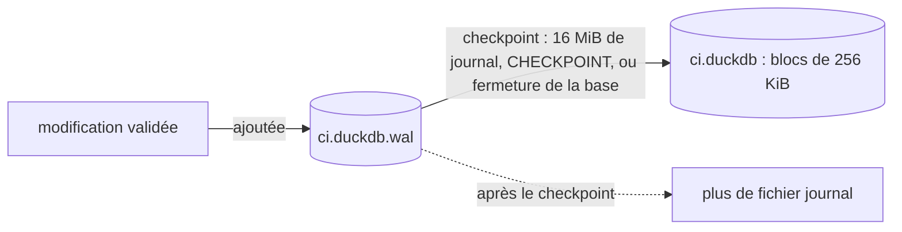
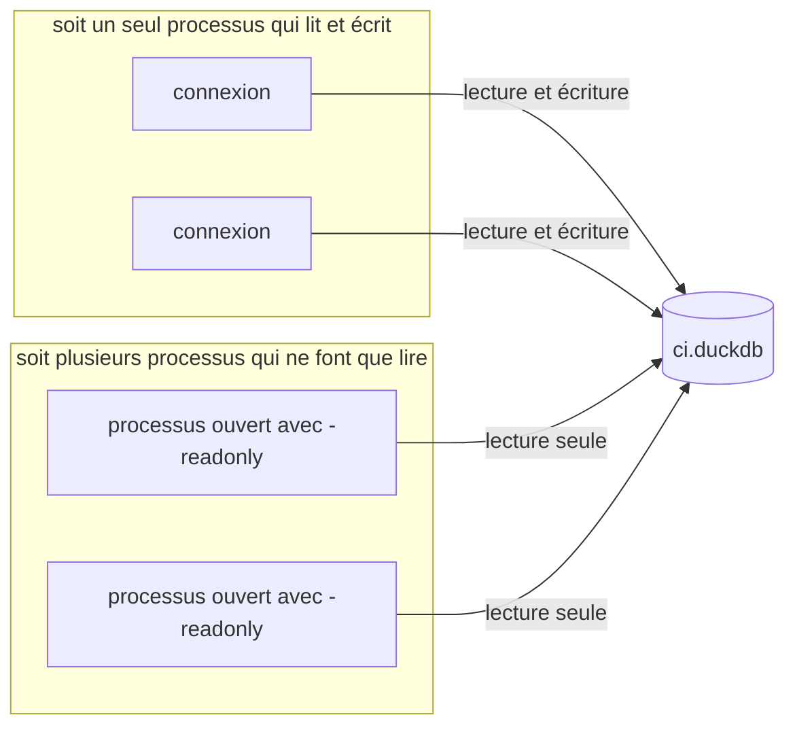

import { Tabs, TabItem } from '@astrojs/starlight/components';

Jusqu'ici, les tables vivaient en mémoire et disparaissaient avec le processus, et les fichiers étaient en CSV, JSON ou Parquet. Cette leçon garde les données dans un fichier de base de données DuckDB, puis fait ce qu'une application fait avec une base de données : des transactions, des contraintes, et plus d'une connexion ou d'un processus à la fois.

Deux programmes, comparés par la CI sur les trois systèmes d'exploitation comme les requêtes des autres leçons :

- [`shell/08-persistence.sh`](https://github.com/spareilleux/learn/blob/main/code/duckdb/shell/08-persistence.sh) lance la CLI DuckDB plusieurs fois, parfois deux processus en même temps, et affiche des tailles de fichiers et des codes de sortie. Sa sortie est comparée à [`shell/expected/08-persistence.txt`](https://github.com/spareilleux/learn/blob/main/code/duckdb/shell/expected/08-persistence.txt).
- [`java/src/main/java/ci/Transactions.java`](https://github.com/spareilleux/learn/blob/main/code/duckdb/java/src/main/java/ci/Transactions.java) ouvre deux connexions JDBC sur le même fichier, et sa sortie est comparée à [`java/expected-transactions.txt`](https://github.com/spareilleux/learn/blob/main/code/duckdb/java/expected-transactions.txt).

```bash
bash shell/08-persistence.sh
mvn -q -f java/pom.xml compile exec:java -Dexec.mainClass=ci.Transactions
```

Dans le script, `run` est la CLI DuckDB en mode CSV suivie de son code de sortie, et `files` affiche la taille de chaque fichier.

## Un fichier de base de données

Donne un nom de fichier à la CLI, et les tables vont dans ce fichier ([lignes 49-51](https://github.com/spareilleux/learn/blob/93f6f82/code/duckdb/shell/08-persistence.sh#L49-L51)) :

```bash
run $db -c "CREATE TABLE runs AS FROM 'data/runs.json'; CREATE TABLE jobs AS FROM 'data/jobs.json';"
files $db $db.wal
run $db -c "SELECT database_size, block_size, total_blocks, used_blocks, free_blocks, wal_size FROM pragma_database_size();"
```

```text
exit code 0
out/ci.duckdb: 798720 bytes
out/ci.duckdb.wal: absent
database_size,block_size,total_blocks,used_blocks,free_blocks,wal_size
768.0 KiB,262144,3,3,0,0 bytes
exit code 0
```

Un seul fichier, `out/ci.duckdb`, pour toutes les tables, comme un fichier SQLite plutôt qu'un `.mdf` SQL Server. [`pragma_database_size`](https://duckdb.org/docs/current/configuration/pragmas) montre son organisation : des blocs de 262 144 octets (256 KiB), trois ici, plus 12 288 octets avant le premier bloc. Le fichier grandit par blocs entiers.

Dans un programme, [`ATTACH`](https://duckdb.org/docs/current/sql/statements/attach) ouvre un fichier de base de données à côté de la base en mémoire, et une requête peut joindre des tables des deux. `ATTACH` choisit aussi le format de stockage ([ligne 52](https://github.com/spareilleux/learn/blob/93f6f82/code/duckdb/shell/08-persistence.sh#L52)) :

```bash
run -c "ATTACH '$db' AS ci; ATTACH 'out/ci-v150.duckdb' AS v150 (STORAGE_VERSION 'v1.5.0'); SELECT database_name, tags FROM duckdb_databases() WHERE NOT internal ORDER BY ALL;"
```

```text
database_name,tags
ci,{storage_version=v1.0.0+}
memory,{}
v150,{storage_version=v1.5.0+}
exit code 0
```

DuckDB 1.5.5 écrit toujours les fichiers au format 1.0.0 par défaut, pour que les versions plus anciennes puissent les lire : la [page sur le stockage](https://duckdb.org/docs/current/internals/storage) indique que les versions 1.0 à 1.5 créent toutes la version de stockage 64 par défaut. Je l'ai vérifié avec la CLI DuckDB 1.0.0, qui ne fait pas partie de la CI, sur deux fichiers créés de la même façon : elle a lu celui par défaut, et refusé celui en `v1.5.0` :

```text
Error: unable to open database "out/v-150.duckdb": IO Error: Trying to read a database file with version number 68, but we can only read version 64.
The database file was created with an newer version of DuckDB.
```

La suite de ce message dit encore que le format de stockage n'est pas encore stable et qu'il le sera avec la version 1.0, c'est-à-dire la version même qui l'affiche. Garde le format par défaut quand un fichier est partagé avec d'autres outils ou d'autres versions de DuckDB.

## Le journal d'écriture anticipée

Une modification validée n'est pas écrite tout de suite dans les blocs. DuckDB l'ajoute à un journal d'écriture anticipée (write-ahead log), un second fichier qui porte le nom de la base suivi de `.wal`, et la reporte dans le fichier de base de données lors d'un **checkpoint** : quand le journal atteint 16 MiB (`checkpoint_threshold`), sur [`CHECKPOINT`](https://duckdb.org/docs/current/sql/statements/checkpoint), et à la fermeture de la base. Le script désactive le checkpoint à la fermeture pour voir le journal ([lignes 55-58](https://github.com/spareilleux/learn/blob/93f6f82/code/duckdb/shell/08-persistence.sh#L55-L58)) :

```bash
run $db -c "PRAGMA disable_checkpoint_on_shutdown; CREATE TABLE steps AS SELECT j.id AS job_id, s.* FROM jobs j, unnest(j.steps) AS t(s);"
files $db $db.wal
run $db -c "SELECT count(*) AS steps FROM steps;"
files $db $db.wal
```

```text
Success
exit code 0
out/ci.duckdb: 798720 bytes
out/ci.duckdb.wal: 135677 bytes
steps
2204
exit code 0
out/ci.duckdb: 1060864 bytes
out/ci.duckdb.wal: absent
```

Après le premier processus, le fichier de base de données n'a pas changé et les 2 204 steps ne sont que dans le journal de 135 677 octets. Le second processus a rejoué le journal en ouvrant le fichier, et a fait un checkpoint en le fermant : un bloc de plus, plus de journal. Le fichier `.wal` joue le rôle du [journal des transactions SQL Server](https://learn.microsoft.com/sql/relational-databases/logs/the-transaction-log-sql-server), mais il ne vit que jusqu'au checkpoint suivant : pas de sauvegardes ni de troncature du journal à gérer.

Le chemin d'une modification validée, du journal au fichier de base de données.



La conséquence pour les sauvegardes : une copie de `ci.duckdb` seul peut manquer des données validées. Dans un test jetable, une copie faite pendant que le journal existait s'est ouverte sans sa dernière table ; avec le fichier `.wal` copié à côté, la table était là. Copie les deux fichiers, ou lance d'abord `CHECKPOINT`, ou ferme la base.

## Blocs libres et compaction

Extrait de [`shell/08-persistence.sh`, lignes 61-64](https://github.com/spareilleux/learn/blob/93f6f82/code/duckdb/shell/08-persistence.sh#L61-L64) :

```bash
run $db -c "SELECT total_blocks, used_blocks, free_blocks FROM pragma_database_size();"
run $db -c "DROP TABLE jobs; CHECKPOINT; SELECT total_blocks, used_blocks, free_blocks FROM pragma_database_size();"
run -c "ATTACH '$db' AS ci; ATTACH 'out/ci-compact.duckdb' AS compact; COPY FROM DATABASE ci TO compact;"
files $db out/ci-compact.duckdb
```

```text
total_blocks,used_blocks,free_blocks
4,4,0
exit code 0
Success
total_blocks,used_blocks,free_blocks
4,3,1
exit code 0
exit code 0
out/ci.duckdb: 1060864 bytes
out/ci-compact.duckdb: 798720 bytes
```

Supprimer `jobs` a libéré un bloc au milieu du fichier : DuckDB le réutilise pour les écritures suivantes, mais le fichier garde sa taille. Dans une version antérieure du script, j'ai supprimé `steps`, la dernière table écrite, et le fichier est revenu à 798 720 octets : les blocs libres en fin de fichier sont coupés. Pour récupérer l'espace dans tous les cas, [`COPY FROM DATABASE`](https://duckdb.org/docs/current/sql/statements/copy) copie toutes les tables dans un nouveau fichier.

## Transactions

Chaque instruction s'exécute dans sa propre transaction, sauf si tu en ouvres une avec `BEGIN` ([lignes 68-79](https://github.com/spareilleux/learn/blob/93f6f82/code/duckdb/shell/08-persistence.sh#L68-L79)) :

```sql
BEGIN;
DELETE FROM runs;
SELECT count(*) AS runs_in_transaction FROM runs;
ROLLBACK;
SELECT count(*) AS runs_after_rollback FROM runs;
BEGIN;
CREATE TABLE counters (name VARCHAR PRIMARY KEY, n INTEGER);
INSERT INTO counters VALUES ('builds', 0);
INSERT INTO counters VALUES ('builds', 1);
SELECT count(*) FROM counters;
COMMIT;
SELECT count(*) FROM counters;
```

```text
runs_in_transaction
0
runs_after_rollback
125
Constraint Error: PRIMARY KEY or UNIQUE constraint violation: duplicate key "builds"
TransactionContext Error: Current transaction is aborted (please ROLLBACK)
Catalog Error: Table with name counters does not exist!
Did you mean "pg_constraint"?

LINE 1: SELECT count(*) FROM counters;
                             ^
exit code 1
```

Trois choses à lire dans cette sortie :

- `CREATE TABLE` est transactionnel : le rollback a aussi supprimé la table.
- La première erreur a abandonné toute la transaction. Le `SELECT` suivant a été refusé, et l'`INSERT` valide d'avant l'erreur a été perdu.
- **Le `COMMIT` d'une transaction abandonnée n'a affiché aucune erreur.** Il a fait un rollback, en silence : la table n'existe pas ensuite. Le seul signal dans la CLI est le code de sortie, 1 à cause des erreurs précédentes. Le programme Java plus bas montre le même comportement via JDBC.

Un développeur SQL Server s'attend à autre chose : avec [`SET XACT_ABORT OFF`](https://learn.microsoft.com/sql/t-sql/statements/set-xact-abort-transact-sql), le réglage par défaut, une violation de contrainte n'annule que l'instruction, et `COMMIT` valide le reste. Dans DuckDB, vérifie chaque instruction d'une transaction, et ne te fie pas à un `COMMIT` qui n'a pas levé d'exception.

La [page sur les transactions](https://duckdb.org/docs/current/sql/statements/transactions) donne le niveau d'isolation : l'isolation par instantané (snapshot isolation). Une transaction voit la base de données telle qu'elle était au début de la transaction.

## Contraintes et upserts

Extrait de [`shell/08-persistence.sh`, lignes 84-90](https://github.com/spareilleux/learn/blob/93f6f82/code/duckdb/shell/08-persistence.sh#L84-L90) :

```sql
CREATE TABLE counters (name VARCHAR PRIMARY KEY, n INTEGER);
INSERT INTO counters VALUES ('builds', 0), ('deploys', 0);
INSERT INTO counters VALUES ('builds', 5);
INSERT INTO counters VALUES ('builds', 5) ON CONFLICT DO UPDATE SET n = counters.n + excluded.n;
INSERT OR REPLACE INTO counters VALUES ('deploys', 2);
INSERT OR IGNORE INTO counters VALUES ('deploys', 99), ('tests', 1);
FROM counters ORDER BY name;
```

```text
Constraint Error: Duplicate key "name: builds" violates primary key constraint.
name,n
builds,5
deploys,2
tests,1
exit code 1
```

La même violation a deux messages : `Duplicate key "name: builds" violates primary key constraint` pour une instruction seule, et `PRIMARY KEY or UNIQUE constraint violation: duplicate key "builds"` dans une transaction, à la section précédente. Ne te fie pas au texte.

Là où SQL Server a `MERGE`, DuckDB a [`INSERT … ON CONFLICT`](https://duckdb.org/docs/current/sql/statements/insert), comme PostgreSQL : `excluded` est la ligne qui a été refusée. `INSERT OR REPLACE` et `INSERT OR IGNORE` sont les raccourcis SQLite pour `DO UPDATE` sur toutes les colonnes et `DO NOTHING`. Ils ont besoin d'une clé primaire ou d'une [contrainte](https://duckdb.org/docs/current/sql/constraints) d'unicité pour détecter le conflit.

## Deux connexions dans un processus

Deux appels à `DriverManager.getConnection` avec le même nom de fichier partagent une seule base de données : la seconde connexion voit la table créée par la première. Chaque connexion a sa propre transaction ([`java/src/main/java/ci/Transactions.java`, lignes 21-35](https://github.com/spareilleux/learn/blob/93f6f82/code/duckdb/java/src/main/java/ci/Transactions.java#L21-L35)) :

```java
execute(a, "a", "CREATE TABLE counters (name VARCHAR PRIMARY KEY, n INTEGER)");
execute(a, "a", "INSERT INTO counters VALUES ('builds', 0)");
a.setAutoCommit(false);
b.setAutoCommit(false);

section("1. Isolation: b doesn't see what a hasn't committed");
execute(a, "a", "UPDATE counters SET n = n + 1 WHERE name = 'builds'");
execute(b, "b", "SELECT n FROM counters WHERE name = 'builds'");

section("2. Two updates of the same row");
execute(b, "b", "UPDATE counters SET n = n + 1 WHERE name = 'builds'");
execute(b, "b", "SELECT n FROM counters WHERE name = 'builds'");
commit(a, "a");
commit(b, "b");
execute(a, "a", "SELECT n FROM counters WHERE name = 'builds'");
```

`execute` affiche la première valeur du résultat, `ok`, ou l'erreur, sur une ligne :

```text
== 1. Isolation: b doesn't see what a hasn't committed
a: UPDATE counters SET n = n + 1 WHERE name = 'builds' -> ok
b: SELECT n FROM counters WHERE name = 'builds' -> 0

== 2. Two updates of the same row
b: UPDATE counters SET n = n + 1 WHERE name = 'builds' -> TransactionContext Error: Conflict on update!
b: SELECT n FROM counters WHERE name = 'builds' -> Invalid Input Error: Attempting to execute an unsuccessful or closed pending query result | Error: TransactionContext Error: Current transaction is aborted (please ROLLBACK)
a: commit -> ok
b: commit -> ok
a: SELECT n FROM counters WHERE name = 'builds' -> 1
```

Dans SQL Server, avec le comportement de verrouillage par défaut, l'`UPDATE` de `b` attendrait que `a` valide, puis s'appliquerait. DuckDB utilise un contrôle de concurrence optimiste : `b` échoue immédiatement avec `Conflict on update!`, sa transaction est abandonnée, et `commit()` rend la main sans exception, comme le `COMMIT` de la CLI. Le compteur finit à 1, pas à 2 : un incrément a été perdu, et seule l'erreur sur l'`UPDATE` te le signale. La [page sur la concurrence](https://duckdb.org/docs/current/connect/concurrency) suggère de relancer la transaction ; c'est l'exercice 2.

Les insertions se comportent autrement :

```text
== 3. Two inserts with different keys
a: INSERT INTO counters VALUES ('deploys', 1) -> ok
b: INSERT INTO counters VALUES ('tests', 1) -> ok
a: commit -> ok
b: commit -> ok

== 4. Two inserts with the same key
a: INSERT INTO counters VALUES ('lint', 1) -> ok
b: INSERT INTO counters VALUES ('lint', 2) -> ok
a: commit -> ok
b: commit -> TransactionContext Error: Failed to commit: PRIMARY KEY or UNIQUE constraint violation: duplicate key "lint"
```

Des ajouts de lignes dans la même table n'entrent pas en conflit. Une clé en double entre deux transactions n'est pas détectée à l'`INSERT`, mais au second commit, qui lève une exception cette fois.

Le pilote C# encapsule le même moteur, donc le comportement devrait être le même avec DuckDB.NET ; le programme C# de la leçon 5 ne le teste pas (*à vérifier*).

## Deux processus

Dans un processus, de nombreuses connexions. Entre processus, la règle est plus simple : le script garde la base ouverte dans un processus CLI en arrière-plan, puis en lance un second.

Extrait de [`shell/08-persistence.sh`, lignes 94-96](https://github.com/spareilleux/learn/blob/93f6f82/code/duckdb/shell/08-persistence.sh#L94-L96) :

```bash
hold_open writer $db
run_os_error $db -c "SELECT count(*) FROM runs;"
run_os_error -readonly $db -c "SELECT count(*) FROM runs;"
```

Les deux tentatives échouent, même celle en lecture seule, et même si le premier processus n'écrit rien. Le message dépend du système d'exploitation, donc le script ne compare que le type d'erreur et le code de sortie, et affiche le message complet sur la sortie d'erreur. D'après les logs de la CI et ma machine ([`local_file_system.cpp`: Windows](https://github.com/duckdb/duckdb/blob/v1.5.5/src/common/local_file_system.cpp#L958-L1020), [Linux, macOS](https://github.com/duckdb/duckdb/blob/v1.5.5/src/common/local_file_system.cpp#L398-L453)) :

<Tabs syncKey="os">
<TabItem label="Windows">

```text
IO Error: Cannot open file "out/ci.duckdb": The process cannot access the file because it is being used by another process.

File is already open in 
C:\Users\spare\tools\duckdb-1.5.5\duckdb.exe (PID 147148)
```

</TabItem>
<TabItem label="Linux / WSL">

```text
IO Error: Could not set lock on file "/home/runner/work/learn/learn/code/duckdb/out/ci.duckdb": Conflicting lock is held in /home/runner/.duckdb/cli/1.5.5/duckdb (PID 2268). See also https://duckdb.org/docs/stable/connect/concurrency
```

</TabItem>
<TabItem label="macOS">

```text
IO Error: Could not set lock on file "/Users/runner/work/learn/learn/code/duckdb/out/ci.duckdb": Conflicting lock is held in /Users/runner/.duckdb/cli/1.5.5/duckdb (PID 1345) by user runner. See also https://duckdb.org/docs/stable/connect/concurrency
```

</TabItem>
</Tabs>

Les trois nomment le processus qui détient le fichier, ce qui aide quand une CLI oubliée ou un IDE le garde ouvert. L'onglet Linux / WSL vient du runner Ubuntu, pas de WSL.

Des processus qui ouvrent le fichier en lecture seule, avec `-readonly` dans la CLI, peuvent le partager ([lignes 103-106](https://github.com/spareilleux/learn/blob/93f6f82/code/duckdb/shell/08-persistence.sh#L103-L106)) :

```bash
hold_open reader -readonly $db
run -readonly $db -c "SELECT 'second reader' AS process, count(*) AS runs FROM runs;"
run -readonly $db -c "INSERT INTO counters VALUES ('lint', 1);"
run_os_error $db -c "SELECT count(*) FROM runs;"
```

```text
process,runs
second reader,125
exit code 0
Invalid Input Error: Cannot execute statement of type "INSERT" on database "ci" which is attached in read-only mode!
exit code 1
IO Error
exit code 1
```

Un second lecteur fonctionne, un processus en lecture seule ne peut pas écrire, et un processus qui veut écrire ne peut pas ouvrir le fichier tant qu'un lecteur le détient. Sous Linux et macOS, ce dernier message ajoute une indication : `However, you would be able to open this database in read-only mode, e.g. by using the -readonly parameter in the CLI.` Avec JDBC, la propriété `duckdb.read_only` à `true` dans les propriétés de connexion a ouvert le fichier en lecture seule dans un programme jetable, et a refusé un `INSERT` avec le même message.

Un fichier DuckDB a donc soit **un seul processus qui lit et écrit**, avec autant de connexions et de threads qu'il veut à l'intérieur, soit **plusieurs processus qui ne font que lire**. La [page sur la concurrence](https://duckdb.org/docs/current/connect/concurrency) cite deux façons de contourner cette règle pour plusieurs processus qui écrivent, aucune testée dans ce cours : le protocole distant Quack, qui fait de DuckDB une base de données client-serveur et qui est en bêta dans la 1.5 ; et [DuckLake](https://ducklake.select/), qui stocke le catalogue dans une base de données comme PostgreSQL et les données dans des fichiers Parquet. Et la [FAQ](https://duckdb.org/faq) déconseille fortement les charges en lecture-écriture sur un stockage réseau.

Les deux organisations qu'un fichier de base de données permet, côte à côte.



## À retenir

- Un fichier de base de données est fait de blocs de 256 KiB ; `pragma_database_size` les montre, et un bloc libéré est réutilisé mais ne réduit pas le fichier, sauf s'il est à la fin. `COPY FROM DATABASE` compacte.
- Les nouveaux fichiers utilisent par défaut le format de stockage 1.0.0, lisible par DuckDB 1.0 ; `STORAGE_VERSION` permet de choisir des formats plus récents.
- Les modifications validées vont d'abord dans le fichier `.wal`, puis dans la base lors d'un checkpoint. Sauvegarde les deux fichiers, ou fais d'abord un checkpoint.
- La première erreur abandonne une transaction, et `COMMIT` fait alors un rollback sans erreur, dans la CLI comme avec JDBC.
- `INSERT … ON CONFLICT`, `INSERT OR REPLACE` et `INSERT OR IGNORE` gèrent les clés en double.
- La concurrence est optimiste : une seconde mise à jour de la même ligne échoue immédiatement, une clé en double échoue au commit, les ajouts de lignes n'entrent pas en conflit. Relance la transaction.
- Un seul processus peut ouvrir un fichier en écriture, et alors aucun autre processus ne peut l'ouvrir ; ou plusieurs processus peuvent l'ouvrir en lecture seule.

## Exercices

1. La CLI DuckDB exécute trois instructions dans un seul argument `-c` ; la troisième viole la clé primaire. Combien de lignes restent ? Et avec `BEGIN;` et `COMMIT;` autour ?

Extrait de [`shell/08-exercises.sh`, ligne 10](https://github.com/spareilleux/learn/blob/93f6f82/code/duckdb/shell/08-exercises.sh#L10) :

```bash
duckdb -csv $db -c "INSERT INTO counters VALUES ('builds', 1); INSERT INTO counters VALUES ('tests', 1); INSERT INTO counters VALUES ('builds', 2);"
```

<details>
<summary>Solution</summary>

D'après [`shell/08-exercises.sh`](https://github.com/spareilleux/learn/blob/main/code/duckdb/shell/08-exercises.sh) :

```text
== Exercise 1: three statements in one -c argument, the last one failing
Constraint Error: Duplicate key "name: builds" violates primary key constraint.
exit code 1
rows
2
== Exercise 1: the same statements in an explicit transaction
Constraint Error: PRIMARY KEY or UNIQUE constraint violation: duplicate key "builds"
exit code 1
rows
0
```

Deux lignes : chaque instruction a été validée séparément, et seule celle qui a échoué a été perdue. La [page sur les transactions](https://duckdb.org/docs/current/sql/statements/transactions) indique que des instructions envoyées ensemble s'exécutent dans une seule transaction implicite et sont toutes annulées si l'une d'elles échoue ; ce n'est pas ce qu'a fait la CLI avec DuckDB 1.5.5, ni JDBC, où `statement.execute` avec les trois mêmes instructions a aussi laissé deux lignes dans un programme jetable. Avec `BEGIN` et `COMMIT`, l'erreur a abandonné la transaction, `COMMIT` l'a annulée en silence, et aucune ligne n'est restée. Quand plusieurs instructions doivent réussir ensemble, écris la transaction explicitement.

</details>

2. Dans la section 2 du programme Java, `b` perd son incrément. Modifie la fin de la section pour que le compteur finisse à 2.

<details>
<summary>Solution</summary>

Après le conflit, fais un rollback de `b`, puis relance sa transaction une fois que `a` a validé :

```java
commit(a, "a");
b.rollback();
execute(b, "b", "UPDATE counters SET n = n + 1 WHERE name = 'builds'");
commit(b, "b");
```

Dans un programme jetable avec la même séquence, en partant de 1, le compteur a fini à 3 : les deux incréments ont été appliqués. Dans un vrai programme, la nouvelle tentative est une boucle autour de toute la transaction, qui relit la ligne, car la valeur que `b` a lue avant le conflit est périmée. Ne réessaie que sur les conflits d'écriture comme `Conflict on update!` : une clé en double au commit est aussi une `TransactionContext Error`, et la réessayer échoue à chaque fois. Le `SQLState` est null avec ce pilote (leçon 6), donc le message est tout ce que tu as.

</details>

3. Ton API ASP.NET Core tourne sur deux instances derrière un répartiteur de charge, et les deux doivent insérer des exécutions CI dans `ci.duckdb` sur un disque partagé. Que se passe-t-il, et que ferais-tu ?

<details>
<summary>Solution</summary>

La première instance qui ouvre le fichier l'obtient ; la seconde échoue au démarrage ou à sa première requête avec `IO Error`, comme dans la section sur les deux processus, et il en irait de même pour tout autre processus, même en lecture seule, tant que la première instance garde le fichier ouvert. Un disque réseau partagé aggrave les choses : la FAQ y déconseille les charges en lecture-écriture.

Les options, de la plus simple à la plus lourde :

- un seul écrivain : un processus unique possède le fichier et les autres instances lui envoient leurs insertions, via une API ou une file d'attente ;
- chaque instance écrit ses propres fichiers (Parquet ou son propre fichier DuckDB), et un lecteur les interroge tous avec un glob, comme dans la leçon 4 ;
- ouvrir, écrire et fermer rapidement, et réessayer quand le fichier est verrouillé : deux processus qui s'exécutent l'un après l'autre ne posent pas de problème, mais ils échouent sous charge (*à vérifier* à grande échelle) ;
- si les données sont vraiment transactionnelles et partagées, une base de données serveur comme PostgreSQL ou SQL Server, éventuellement avec DuckDB qui la lit pour l'analytique ; DuckLake et Quack sont les réponses de DuckDB, non testées ici.

</details>

## Sources

- [Concurrence](https://duckdb.org/docs/current/connect/concurrency) et [transactions](https://duckdb.org/docs/current/sql/statements/transactions)
- [`ATTACH`](https://duckdb.org/docs/current/sql/statements/attach), [`CHECKPOINT`](https://duckdb.org/docs/current/sql/statements/checkpoint), [`COPY FROM DATABASE`](https://duckdb.org/docs/current/sql/statements/copy)
- [Versions de stockage et compatibilité](https://duckdb.org/docs/current/internals/storage)
- [Pragmas](https://duckdb.org/docs/current/configuration/pragmas) : `database_size`, `disable_checkpoint_on_shutdown`
- [`INSERT`](https://duckdb.org/docs/current/sql/statements/insert) et [contraintes](https://duckdb.org/docs/current/sql/constraints)
- [Arguments de la CLI](https://duckdb.org/docs/current/clients/cli/arguments), dont `-readonly`
- [DuckLake](https://ducklake.select/) et la [FAQ DuckDB](https://duckdb.org/faq)
- SQL Server : [journal des transactions](https://learn.microsoft.com/sql/relational-databases/logs/the-transaction-log-sql-server), [`SET XACT_ABORT`](https://learn.microsoft.com/sql/t-sql/statements/set-xact-abort-transact-sql), [verrouillage et gestion de versions de lignes](https://learn.microsoft.com/sql/relational-databases/sql-server-transaction-locking-and-row-versioning-guide)
