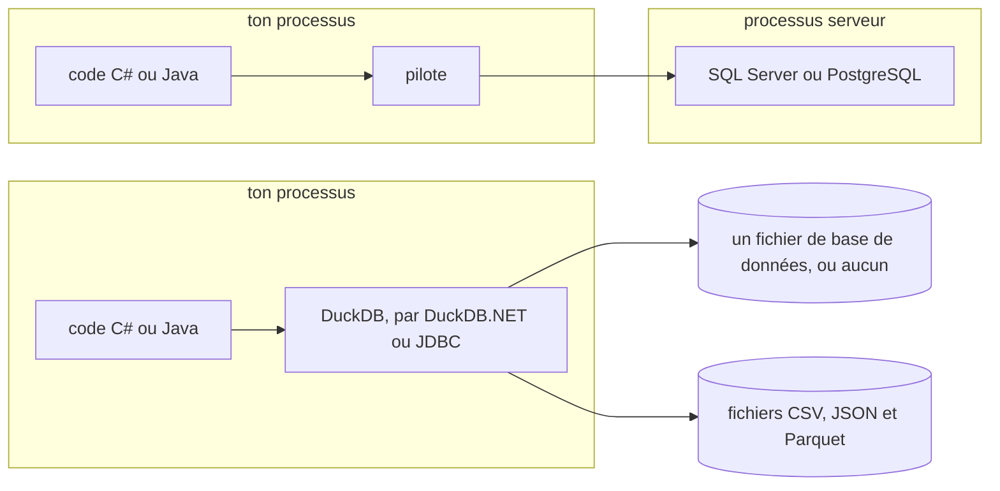

:::note[Comment ce cours est testé]
Chaque requête de ce cours se trouve dans [`code/duckdb/sql`](https://github.com/spareilleux/learn/tree/main/code/duckdb/sql), à côté de sa sortie attendue. [`.github/workflows/duckdb-examples.yml`](https://github.com/spareilleux/learn/blob/main/.github/workflows/duckdb-examples.yml) les exécute toutes avec la CLI de DuckDB sous Linux, Windows et macOS et compare les résultats. Les sorties des leçons ont été capturées avec DuckDB 1.5.5 en septembre 2026.
:::

## Pourquoi j'apprends ça

Chaque question que je me pose sur la CI de ce site — quel workflow échoue le plus, combien de temps prennent les jobs Windows, quel step a ralenti — finit en une pile de JSON sortie de `gh run list` et `gh api`. Je la lis avec `jq`, ou je la colle dans un tableur. [DuckDB](https://duckdb.org/) promet de répondre à ces questions en SQL, directement depuis les fichiers, sans serveur à installer.

## À qui s'adresse ce cours

Tu connais le SQL de [SQL Server](https://learn.microsoft.com/sql/sql-server/), [PostgreSQL](https://www.postgresql.org/docs/current/) ou [SQLite](https://www.sqlite.org/) : `SELECT`, `JOIN`, `GROUP BY`. Tu écris du C# ou du Java. Tu n'as besoin de rien savoir de l'analytique ni du data engineering.

## DuckDB en un tableau

| | SQL Server / PostgreSQL | SQLite | DuckDB |
|---|---|---|---|
| S'exécute | comme un serveur | dans ton processus | dans ton processus |
| Conçu pour | les transactions (OLTP) | les transactions, les petites applications | l'analytique (OLAP) : parcours, agrégats, jointures sur beaucoup de lignes |
| Stockage | par lignes | par lignes | par colonnes |
| Base de données | une instance de serveur | un fichier | un fichier, ou aucun : il interroge aussi directement des fichiers CSV, JSON et Parquet |
| Depuis .NET | `Microsoft.Data.SqlClient`, Npgsql | `Microsoft.Data.Sqlite` | DuckDB.NET (ADO.NET) |
| Depuis Java | pilote JDBC | pilote JDBC | pilote JDBC |

La première ligne du tableau, en image : SQL Server et PostgreSQL s'exécutent comme un serveur, dans un processus à eux, alors que DuckDB s'exécute dans ton processus, à côté des fichiers qu'il lit.

## Les données

Le cours interroge un instantané de l'historique GitHub Actions de ce dépôt, exporté le 2026-09-14 dans [`code/duckdb/data`](https://github.com/spareilleux/learn/tree/main/code/duckdb/data) :

- `runs.json` : 125 exécutions de workflow, obtenues avec `gh run list --limit 1000 --json databaseId,workflowName,event,status,conclusion,createdAt,updatedAt,startedAt,headBranch,headSha,attempt` ;
- `jobs.json` : les 315 jobs de ces exécutions, avec leurs steps, obtenus avec l'API REST de GitHub.

Ce sont les exécutions produites par le [cours GitHub Actions](../github-actions/) : de vrais échecs, de vraies durées, trois systèmes d'exploitation.

## À la fin de ce cours, je saurai

- interroger des fichiers CSV, JSON et Parquet en SQL depuis la CLI de DuckDB ;
- utiliser les extensions SQL de DuckDB pour écrire des requêtes analytiques plus courtes ;
- aplatir du JSON imbriqué avec `STRUCT`, `LIST` et `unnest` ;
- convertir d'un format à l'autre et lire plusieurs fichiers d'un coup ;
- utiliser DuckDB depuis C# et depuis Java ;
- lire un plan de requête et savoir quand DuckDB n'est pas le bon outil.

## Plan

| # | Leçon | Si tu connais SQL Server |
|---|---|---|
| 1 | [Premières requêtes](01-first-queries/) | `sqlcmd`, `OPENROWSET`, `SELECT INTO` |
| 2 | [Friendly SQL : dates, fenêtres, `QUALIFY`, `PIVOT`](02-friendly-sql/) | fonctions de fenêtrage, `PIVOT` |
| 3 | [Données imbriquées : `STRUCT`, `LIST`, `unnest`](03-nested-data/) | `OPENJSON`, `CROSS APPLY` |
| 4 | [Fichiers : CSV, Parquet, globs, fichiers distants](04-files/) | `BULK INSERT`, tables externes |
| 5 | [DuckDB depuis C#](05-csharp/) | ADO.NET |
| 6 | [DuckDB depuis Java](06-java/) | JDBC |
| 7 | [Performances : plans et stockage en colonnes](07-performance/) | plans d'exécution, index columnstore |
| 8 | [Persistance, transactions et concurrence](08-persistence/) | isolation, verrous |
| — | [Journal](journal/) | |

## Ressources

- [Documentation de DuckDB](https://duckdb.org/docs/current/)
- [Pourquoi DuckDB](https://duckdb.org/why_duckdb)
- [CLI de DuckDB](https://duckdb.org/docs/current/clients/cli/overview)
- [Friendly SQL](https://duckdb.org/docs/current/sql/dialect/friendly_sql) : les extensions au SQL standard
- [Code source de DuckDB](https://github.com/duckdb/duckdb)
