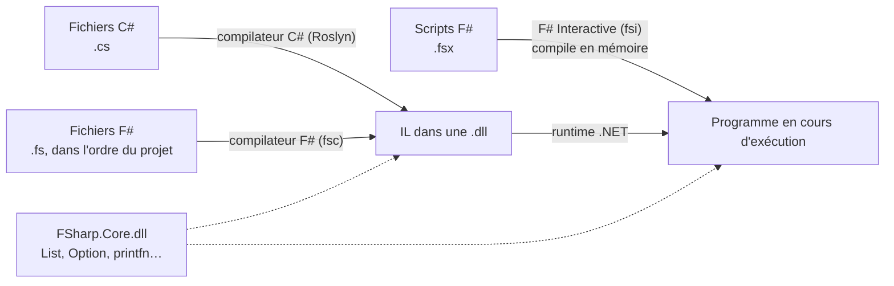
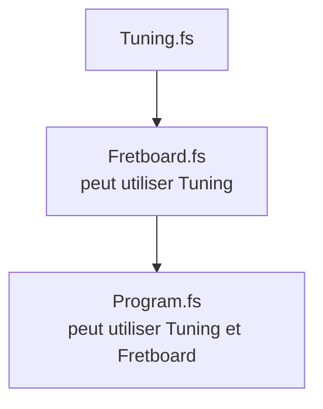

import { Tabs, TabItem } from '@astrojs/starlight/components';

Code : les scripts [`examples/l01_*.fsx`](https://github.com/spareilleux/learn/tree/14eebfd073566c52654d9f5671d893d392308871/code/fsharp/examples), les extraits rejetés dans [`compile_fail/`](https://github.com/spareilleux/learn/tree/14eebfd073566c52654d9f5671d893d392308871/code/fsharp/compile_fail), la session [`sessions/l01_fsi.txt`](https://github.com/spareilleux/learn/blob/14eebfd073566c52654d9f5671d893d392308871/code/fsharp/sessions/l01_fsi.txt) et les projets [`l01-project`](https://github.com/spareilleux/learn/tree/14eebfd073566c52654d9f5671d893d392308871/code/fsharp/l01-project/Hello) et [`l01-order`](https://github.com/spareilleux/learn/tree/14eebfd073566c52654d9f5671d893d392308871/code/fsharp/l01-order/Hello).

## F# dans le paysage .NET

F# est un langage .NET, comme C#. Son compilateur transforme les fichiers `.fs` dans le même langage intermédiaire (IL) et les mêmes fichiers `.dll`, qu'exécute le même runtime. Un projet C# peut référencer une bibliothèque F#, et inversement.



Trois choses diffèrent de C# :

- **FSharp.Core.** Les programmes F# utilisent leur propre bibliothèque, [FSharp.Core](https://fsharp.github.io/fsharp-core-docs/), pour les listes, les options, `printfn` et le reste des fonctions de base. Le SDK l'ajoute à chaque projet F#, et un programme publié embarque son `FSharp.Core.dll`.
- **F# Interactive.** Le SDK contient un REPL et un exécuteur de scripts, [`dotnet fsi`](https://learn.microsoft.com/dotnet/fsharp/tools/fsharp-interactive/). F# en a un depuis ses premières versions ; C# a obtenu les applications fichier avec .NET 10.
- **L'ordre des fichiers.** Un projet F# compile ses fichiers dans l'ordre où son `.fsproj` les liste, et un fichier ne peut utiliser que ce que définissent les fichiers au-dessus de lui. [Les fichiers compilent dans l'ordre](#les-fichiers-compilent-dans-lordre) explique pourquoi.

## Vérifier le SDK

F# est fourni avec le SDK .NET : il n'y a rien d'autre à installer. Si `dotnet --version` ne répond pas, installez le SDK .NET 10 comme l'explique la [leçon 1 de C# pour débutants](../../csharp-beginner/01-first-program/#installer-le-sdk-net) pour chaque système.

```text
> dotnet --version
10.0.112
> dotnet fsi --help
Microsoft (R) F# Interactive version 14.0.112.0 for F# 10.0
Copyright (c) Microsoft Corporation. All Rights Reserved.
…
```

F# Interactive 14.0.112 est la version de l'outil ; **F# 10.0** est la version du langage, celle que décrit [Nouveautés de F# 10](https://learn.microsoft.com/dotnet/fsharp/whats-new/fsharp-10). Le dossier du cours contient un [`global.json`](https://github.com/spareilleux/learn/blob/14eebfd073566c52654d9f5671d893d392308871/code/fsharp/global.json) qui sélectionne un SDK de version 10, car ma machine a aussi une préversion de .NET 11.

## F# Interactive

`dotnet fsi` seul démarre une session interactive. Vous tapez du code, le terminez par deux points-virgules `;;`, et F# Interactive le compile, l'exécute et affiche ce qu'il a défini :

```text
> let strings = 6;;
val strings: int = 6

> strings * 22;;
val it: int = 132

> let greet name = "Hello, " + name;;
val greet: name: string -> string

> greet "F#";;
val it: string = "Hello, F#"

> #quit;;
```

- `let strings = 6` définit une valeur. F# Interactive répond avec son **nom, son type et sa valeur** : `val strings: int = 6`. Vous n'avez écrit aucun type : le compilateur l'a *inféré* à partir de `6`.
- Une expression sans `let`, comme `strings * 22`, reçoit le nom `it`.
- `greet` est une fonction. Son type, `name: string -> string`, se lit « prend une chaîne nommée `name` et renvoie une chaîne ». Le compilateur sait que `name` est une chaîne parce que `"Hello, " + name` l'ajoute à une chaîne. La [leçon 2](../02-values-and-functions/) revient sur l'inférence et sur les flèches `->`.
- `#quit;;` quitte la session.

Cette session est vérifiée par le cours : [`check.sh`](https://github.com/spareilleux/learn/blob/14eebfd073566c52654d9f5671d893d392308871/code/fsharp/check.sh) tape les lignes de [`sessions/l01_fsi.txt`](https://github.com/spareilleux/learn/blob/14eebfd073566c52654d9f5671d893d392308871/code/fsharp/sessions/l01_fsi.txt) dans `dotnet fsi --nologo` et compare les réponses. En C#, les outils les plus proches sont la fenêtre C# Interactive de Visual Studio et les [notebooks .NET Interactive](https://github.com/dotnet/interactive) ; Java a `jshell`.

## Votre premier script

Un script est un fichier d'extension `.fsx`. Créez `hello.fsx` avec une ligne :

```fsharp
printfn "Hello, world!"
```

```text
> dotnet fsi hello.fsx
Hello, world!
```

[`printfn`](https://fsharp.github.io/fsharp-core-docs/reference/fsharp-core-extratopleveloperators.html#printfn) affiche une ligne, comme `Console.WriteLine`. Il n'y a pas de parenthèses autour de son argument, ni de point-virgule à la fin : en F#, on appelle une fonction en écrivant ses arguments après elle, séparés par des espaces, et un saut de ligne termine l'expression.

Un script plus long s'exécute de haut en bas, comme les instructions de niveau supérieur d'un fichier C# :

```fsharp
// Un script s'exécute de haut en bas, comme les instructions de niveau supérieur d'un fichier C#
let tuning = "E2 A2 D3 G3 B3 E4"   // let donne un nom à une valeur
let strings = 6

printfn "Guitar Alchemist tunes a guitar like this: %s" tuning
printfn "%d strings, %d frets each" strings 22

// Chaînes interpolées : {expression}, ou %d{expression} pour vérifier aussi le type
printfn $"{strings} strings x 22 frets = {strings * 22} positions"
printfn $"%d{strings} strings"

// %A affiche n'importe quelle valeur comme F# l'écrit
printfn "%A" [ "E2"; "A2"; "D3"; "G3"; "B3"; "E4" ]
```

```text
> dotnet fsi examples/l01_script.fsx
Guitar Alchemist tunes a guitar like this: E2 A2 D3 G3 B3 E4
6 strings, 22 frets each
6 strings x 22 frets = 132 positions
6 strings
["E2"; "A2"; "D3"; "G3"; "B3"; "E4"]
```

- `%s`, `%d` et `%A` sont des **spécificateurs de format** : une chaîne, un entier et n'importe quelle valeur. `printfn "%d strings, %d frets each" strings 22` prend un argument par spécificateur. La page [mise en forme de texte brut](https://learn.microsoft.com/dotnet/fsharp/language-reference/plaintext-formatting) les liste tous.
- `$"…"` est une [chaîne interpolée](https://learn.microsoft.com/dotnet/fsharp/language-reference/interpolated-strings), comme en C#. `%d{strings}` ajoute une vérification de type au trou.
- `[ "E2"; "A2"; … ]` est une liste ; ses éléments sont séparés par `;`. La leçon 5 porte sur les listes.
- `//` commence un commentaire, comme en C#. `(* … *)` entoure un commentaire sur plusieurs lignes.

L'accordage est celui de Guitar Alchemist par défaut, écrit `E2 A2 D3 G3 B3 E4` dans [`Tuning.cs`](https://github.com/GuitarAlchemist/ga/blob/32f143c866c126338b332e384e4a615cd4b44381/Common/GA.Domain.Core/Instruments/Tuning.cs#L20-L23).

## La chaîne de format est vérifiée

En C#, `Console.WriteLine("{0} strings", "six")` compile : les emplacements acceptent n'importe quoi. En F#, le compilateur lit la chaîne de format :

```fsharp
let strings = "six"
printfn "Starting the script"
printfn "%d strings" strings
```

```text
> dotnet fsi compile_fail/l01_format_type.fsx
l01_format_type.fsx(3,22): error FS0001: The type 'string' is not compatible with any of the types byte,int16,int32,int64,sbyte,uint16,uint32,uint64,nativeint,unativeint, arising from the use of a printf-style format string
```

Le message a les mêmes parties qu'une erreur C# : le fichier, `(ligne,colonne)`, `error`, un code et le texte. Les codes F# commencent par `FS` ; la page des [messages du compilateur](https://learn.microsoft.com/dotnet/fsharp/language-reference/compiler-messages/) en documente certains. `FS0001` est le plus courant : une incompatibilité de types.

Remarquez ce qui ne s'est pas produit : `Starting the script` n'a pas été affiché. F# Interactive **vérifie tout le script avant d'en exécuter la moindre partie**. Un script qui contient une erreur n'exécute rien.

## L'indentation fait partie de la syntaxe

F# n'a pas d'accolades autour des blocs : l'indentation indique où un bloc commence et finit, comme en Python. La documentation F# l'appelle la [règle du hors-jeu](https://learn.microsoft.com/dotnet/fsharp/language-reference/code-formatting-guidelines#indentation) (*offside rule*).

```fsharp
let describe name =
    let label = name + " major"
  label

printfn "%s" (describe "C")
```

```text
l01_indentation.fsx(2,5): error FS0588: The block following this 'let' is unfinished. Every code block is an expression and must have a result. 'let' cannot be the final code element in a block. Consider giving this block an explicit result.
```

Le corps de `describe` est le bloc indenté sous lui. `label`, indenté de deux espaces au lieu de quatre, est hors de ce bloc : le bloc se termine donc par `let label = …` et n'a pas de résultat. Le message dit quelque chose d'important sur F# : **chaque bloc est une expression et a un résultat**, la valeur de sa dernière ligne. Il n'y a pas de `return` :

```fsharp
let describe name =
    let label = name + " major"
    label   // la dernière expression du bloc est le résultat de la fonction

printfn "%s" (describe "C")
```

```text
C major
```

Utilisez des espaces, pas des tabulations : F# rejette les tabulations dans l'indentation. Quatre espaces, c'est la convention du [guide de style F#](https://learn.microsoft.com/dotnet/fsharp/style-guide/formatting).

## Référencer un paquet NuGet

Un script peut utiliser un paquet NuGet avec `#r "nuget: …"`. F# Interactive le télécharge à la première exécution et le garde dans le cache NuGet :

```fsharp
// Un script peut référencer un paquet NuGet : dotnet fsi le télécharge à la première exécution
#r "nuget: FParsec, 1.1.1"

open FParsec

// FParsec est la bibliothèque de parseurs du DSL musical de Guitar Alchemist (leçon 11)
printfn "%A" (run pint32 "22")
printfn "%A" (run pint32 "twenty-two")
```

```text
Success: 22
Failure:
Error in Ln: 1 Col: 1
twenty-two
^
Expecting: integer number (32-bit, signed)
```

- `open FParsec` est le `using FParsec;` de C# et l'`import` de Java.
- [FParsec](https://www.quanttec.com/fparsec/) est une bibliothèque de combinateurs de parseurs. `run pint32 "22"` exécute le parseur d'un entier 32 bits sur le texte. Le projet `GA.Business.DSL` de GA utilise FParsec 1.1.1 pour analyser les symboles d'accords ; la leçon 4 exécute ce parseur.

Les applications fichier de C# ont la même fonctionnalité avec `#:package`. La [page F# Interactive](https://learn.microsoft.com/dotnet/fsharp/tools/fsharp-interactive/#referencing-packages-in-f-interactive) décrit les autres directives : `#load` charge un autre fichier `.fs` ou `.fsx`, `#r` une `.dll`, `#I` ajoute un dossier de recherche.

## Un projet

Les scripts conviennent pour explorer et pour les outils. Une application ou une bibliothèque est un projet :

```text
> dotnet new console -lang "F#" -o Hello
The template "Console App" was created successfully.

Processing post-creation actions...
Restoring C:\Users\spare\…\Hello\Hello.fsproj:
  Determining projects to restore...
  Restored C:\Users\spare\…\Hello\Hello.fsproj (in 535 ms).
Restore succeeded.
```

Le modèle écrit deux fichiers :

```xml
<Project Sdk="Microsoft.NET.Sdk">

  <PropertyGroup>
    <OutputType>Exe</OutputType>
    <TargetFramework>net10.0</TargetFramework>
  </PropertyGroup>

  <ItemGroup>
    <Compile Include="Program.fs" />
  </ItemGroup>

</Project>
```

```fsharp
// For more information see https://aka.ms/fsharp-console-apps
printfn "Hello from F#"
```

Comparez avec le `.csproj` de `dotnet new console` en C# : il n'y a ni `ImplicitUsings` ni `Nullable`, et il y a un `ItemGroup` qui **liste les fichiers source**. Un projet C# compile tous les fichiers `.cs` de son dossier ; un projet F# compile les fichiers de ses éléments `Compile`, dans cet ordre, et rien d'autre.

Ajoutons un fichier. Le projet de [`l01-project/Hello`](https://github.com/spareilleux/learn/tree/14eebfd073566c52654d9f5671d893d392308871/code/fsharp/l01-project/Hello) a un `Tuning.fs` :

```fsharp
module Tuning

let standard = "E2 A2 D3 G3 B3 E4"

let describe name = name + " tuning: " + standard
```

listé avant `Program.fs` :

```xml
  <ItemGroup>
    <Compile Include="Tuning.fs" />
    <Compile Include="Program.fs" />
  </ItemGroup>
```

et `Program.fs` l'utilise :

```fsharp
// For more information see https://aka.ms/fsharp-console-apps
printfn "Hello from F#"

// Program.fs est le dernier fichier de Hello.fsproj : il voit Tuning.fs, listé au-dessus de lui
printfn "%s" (Tuning.describe "Standard")
```

```text
> dotnet run --project l01-project/Hello
Hello from F#
Standard tuning: E2 A2 D3 G3 B3 E4
```

`module Tuning` place les définitions du fichier dans un module nommé `Tuning`, qui compile en classe statique ; `Tuning.describe` appelle une fonction de ce module. La leçon 6 porte sur les modules et les espaces de noms.

<Tabs syncKey="os">
<TabItem label="Windows">

`dotnet build` écrit le programme dans `bin\Debug\net10.0\` : `Hello.dll`, `Hello.exe` et `FSharp.Core.dll`, avec des dossiers comme `cs`, `de`, `es` et `fr` qui contiennent les ressources traduites de FSharp.Core.

</TabItem>
<TabItem label="Linux / WSL">

`dotnet build` écrit le programme dans `bin/Debug/net10.0/` : `Hello.dll`, un exécutable `Hello` et `FSharp.Core.dll`, avec des dossiers comme `cs`, `de`, `es` et `fr` pour les messages traduits de FSharp.Core (*à vérifier* : j'ai compilé le projet sous Windows, et sous Linux seulement en CI).

</TabItem>
<TabItem label="macOS">

`dotnet build` écrit le programme dans `bin/Debug/net10.0/` : `Hello.dll`, un exécutable `Hello` et `FSharp.Core.dll`, avec des dossiers comme `cs`, `de`, `es` et `fr` pour les messages traduits de FSharp.Core (*à vérifier* : j'ai compilé le projet sous Windows, et sous macOS seulement en CI).

</TabItem>
</Tabs>

## Les fichiers compilent dans l'ordre

Maintenant, un projet où l'ordre est faux. Dans [`l01-order/Hello`](https://github.com/spareilleux/learn/tree/14eebfd073566c52654d9f5671d893d392308871/code/fsharp/l01-order/Hello), `Fretboard.fs` utilise `Tuning`, mais le projet le liste en premier :

```xml
  <ItemGroup>
    <Compile Include="Fretboard.fs" />
    <Compile Include="Tuning.fs" />
    <Compile Include="Program.fs" />
  </ItemGroup>
```

```fsharp
module Fretboard

// Utilise Tuning, que Hello.fsproj liste après ce fichier
let positions frets = Tuning.strings * (frets + 1)
```

```text
> dotnet build l01-order/Hello
Fretboard.fs(4,23): error FS0039: The value, namespace, type or module 'Tuning' is not defined.
```

`Tuning` existe, mais il est défini *après* `Fretboard.fs` : `Fretboard.fs` ne peut donc pas le voir. Placer `Tuning.fs` au-dessus de `Fretboard.fs` répare la compilation.



Ce n'est pas une limite que F# a oublié de lever ; c'est un choix de conception. Puisqu'un fichier ne dépend que des fichiers au-dessus de lui, **il n'y a pas de cycle de dépendances entre fichiers**, et on peut lire un projet de haut en bas : les types de base d'abord, le programme en dernier. L'inférence de types s'appuie aussi dessus : le compilateur vérifie chaque fichier en connaissant tout ce qui est au-dessus. Rider, Visual Studio et Ionide permettent de monter et descendre les fichiers dans le projet.

Les vrais projets montrent la même structure. Le [`GA.Business.DSL.fsproj`](https://github.com/GuitarAlchemist/ga/blob/32f143c866c126338b332e384e4a615cd4b44381/Common/GA.Business.DSL/GA.Business.DSL.fsproj#L8-L57) de GA liste 48 fichiers : les types d'abord (`Types/ChordAst.fs`, `Types/MusicalSetTypes.fs`…), puis les parseurs qui produisent ces types, les générateurs qui les rendent, les services qui utilisent les deux, et `Library.fs` en dernier. Le [`Tars.Core.fsproj`](https://github.com/GuitarAlchemist/tars/blob/87464ce583c42cd11c3d76836e05842377455b24/v2/src/Tars.Core/Tars.Core.fsproj#L32-L37) de TARS garde une trace du problème d'ordre dans un commentaire :

```xml
    <Compile Include="SymbolicReflection.fs" />
    <!-- Moved here for dependency reasons -->
    <Compile Include="WorkflowOfThought\ExecutionTypes.fs" />
    <Compile Include="WorkflowOfThought\AgentRegistry.fs" />
    <Compile Include="WorkflowOfThought\TraceTypes.fs" />
    <Compile Include="Abstractions.fs" />
```

Ces trois fichiers du dossier `WorkflowOfThought` sont au milieu de la liste, alors que les dix autres fichiers de ce dossier viennent à la fin : des fichiers intermédiaires en dépendent. Le projet met aussi `EnableDefaultCompileItems` à `false`, ce qui garantit seulement que le SDK n'ajoute aucun fichier de lui-même.

La liste explicite a une conséquence que les développeurs C# n'attendent pas : **un fichier `.fs` qui n'est pas listé n'est pas compilé**, même dans le dossier du projet. Le dossier `v2/src` de TARS contient neuf fichiers `.fs` (`Fibonacci.fs`, `Program.fs`, `Main.fs`…) qu'aucun projet ne liste : rien ne les compile, et rien ne vous le signale. Le [journal](../journal/) donne les détails.

## Le point d'entrée

Une application console démarre en haut de son **dernier fichier**, comme `Program.fs` ci-dessus. Un développeur C# peut aussi garder la méthode `Main` familière, avec l'attribut [`[<EntryPoint>]`](https://learn.microsoft.com/dotnet/fsharp/language-reference/functions/entry-point). Le serveur de langage du DSL musical de GA, [`GaMusicTheoryLsp`](https://github.com/GuitarAlchemist/ga/blob/32f143c866c126338b332e384e4a615cd4b44381/Apps/GaMusicTheoryLsp/Program.fs#L8-L20), fait ainsi :

```fsharp
[<EntryPoint>]
let main argv =
    eprintfn "Starting Music Theory DSL Language Server..."
    eprintfn "Listening on stdin/stdout for LSP messages..."

    try
        // Run the LSP server
        LanguageServer.run ()
        0
    with ex ->
        eprintfn "Fatal error: %s" ex.Message
        eprintfn "Stack trace: %s" ex.StackTrace
        1
```

- `[<EntryPoint>]` est un attribut : F# écrit les attributs entre `[<` et `>]`, là où C# utilise `[` et `]`.
- `main` prend les arguments de la ligne de commande `argv` (un `string[]`) et renvoie le code de sortie : `0` ou `1`, la dernière expression de chaque branche. C'est le `static int Main(string[] args)` de C#.
- `eprintfn` écrit sur la sortie d'erreur, ce qui compte ici : un serveur de langage parle à l'éditeur sur la sortie standard.
- `try … with ex ->` est un `try … catch (Exception ex)`, et c'est aussi une expression : sa valeur est `0` ou `1`.

Le point d'entrée doit être la dernière déclaration du dernier fichier.

## Choisir un éditeur

| Éditeur | Systèmes | Prise en charge de F# |
|---|---|---|
| [Visual Studio Code](https://code.visualstudio.com/) avec [Ionide](https://ionide.io/) | Windows, Linux, macOS | gratuit ; Ionide est l'extension F# communautaire, construite sur le service du compilateur F# |
| [JetBrains Rider](https://www.jetbrains.com/rider/) | Windows, Linux, macOS | F# intégré ; gratuit pour un usage non commercial |
| [Visual Studio](https://visualstudio.microsoft.com/) | Windows | F# intégré ; l'édition Community est gratuite pour les particuliers |

Les trois peuvent envoyer les lignes sélectionnées d'un script à F# Interactive, avec <kbd>Alt</kbd>+<kbd>Entrée</kbd> par défaut (*à vérifier* : les leçons de ce cours ont été exécutées en ligne de commande, pas depuis un éditeur). Les licences changent avec le temps : lisez les conditions de chaque éditeur quand vous l'installez.

## À retenir

- F# compile vers le même IL que C# et utilise FSharp.Core ; F# 10 est livré avec le SDK .NET 10.
- `dotnet fsi` est un REPL (terminez chaque saisie par `;;`) et exécute les scripts `.fsx` ; un script est vérifié en entier avant que la moindre partie ne s'exécute, et peut référencer des paquets NuGet avec `#r "nuget: …"`.
- Les chaînes de format de `printfn` sont vérifiées par le typage ; le résultat d'un bloc est sa dernière expression, et l'indentation délimite les blocs.
- Un projet F# liste ses fichiers dans le `.fsproj` et les compile dans cet ordre ; un fichier ne voit que les fichiers au-dessus de lui, et les fichiers non listés ne sont pas compilés.
- Une application console démarre en haut de son dernier fichier, ou dans une fonction marquée `[<EntryPoint>]`.

## Exercices

1. Écrivez un script `chord.fsx` qui affiche le nom d'un accord, les six cordes et les cases d'un accord de do majeur (`x 3 2 0 1 0`), puis la somme des trois cases appuyées calculée par F#. Utilisez `printfn` avec un spécificateur de format pour chaque valeur.

<details>
<summary>Solution</summary>

[`exercises/l01_ex_chord.fsx`](https://github.com/spareilleux/learn/blob/14eebfd073566c52654d9f5671d893d392308871/code/fsharp/exercises/l01_ex_chord.fsx) :

```fsharp
// Un accord de do majeur (x32010) : son nom, les cordes et les cases à appuyer
let name = "C major"
let frets = "x 3 2 0 1 0"

printfn "%s" name
printfn "E A D G B E"
printfn "%s" frets
printfn "Frets played: %d" (3 + 2 + 1)
```

```text
C major
E A D G B E
x 3 2 0 1 0
Frets played: 6
```

Les parenthèses autour de `3 + 2 + 1` sont nécessaires : sans elles, `printfn "Frets played: %d" 3 + 2 + 1` donnerait `3` à `printfn`, puis essaierait d'ajouter `2` à ce que renvoie `printfn`. L'application de fonction est prioritaire sur les opérateurs.

</details>

2. Le [`Scripts/ModesConfig.fsx`](https://github.com/GuitarAlchemist/ga/blob/32f143c866c126338b332e384e4a615cd4b44381/Scripts/ModesConfig.fsx#L20-L21) de GA affiche les autres noms d'un mode avec cette ligne. La voici réduite à une liste ; exécutez-la, corrigez ce que F# signale, et recommencez jusqu'à ce qu'elle fonctionne.

```fsharp
// Réduit depuis Scripts/ModesConfig.fsx de Guitar Alchemist : la même ligne printfn, avec une liste au lieu du fichier de configuration
let names = [ "Major"; "Ionian mode" ]
printfn $"  Alternate Names: %s{String.Join(", ", names)}"
```

<details>
<summary>Solution</summary>

La première exécution s'arrête sur la chaîne :

```text
l01_ex_modes.fsx(3,45): error FS3373: Invalid interpolated string. Single quote or verbatim string literals may not be used in interpolated expressions in single quote or verbatim strings. Consider using an explicit 'let' binding for the interpolation expression or use a triple quote string as the outer string literal.

l01_ex_modes.fsx(3,47): error FS3373: Invalid interpolated string. Single quote or verbatim string literals may not be used in interpolated expressions in single quote or verbatim strings. Consider using an explicit 'let' binding for the interpolation expression or use a triple quote string as the outer string literal.
```

Une chaîne interpolée entre guillemets simples, `$"…"`, ne peut pas contenir `", "` dans ses trous : F# lit le `"` comme la fin de la chaîne. Comme le suggère le message, une chaîne entre triples guillemets `$"""…"""` peut contenir des guillemets. La deuxième exécution va plus loin :

```text
l01_ex_modes_step2.fsx(3,42): error FS0039: The value, constructor, namespace or type 'Join' is not defined.
```

`String.Join` est `System.String.Join`. Sans `open System`, `String` est le [module `String`](https://fsharp.github.io/fsharp-core-docs/reference/fsharp-core-stringmodule.html) de FSharp.Core, qui a `String.concat` mais pas de `Join`. Le script corrigé ([`exercises/l01_ex_modes_fixed.fsx`](https://github.com/spareilleux/learn/blob/14eebfd073566c52654d9f5671d893d392308871/code/fsharp/exercises/l01_ex_modes_fixed.fsx)) :

```fsharp
// Étape 3 : String.Join est System.String.Join, le script a donc besoin de open System
open System

let names = [ "Major"; "Ionian mode" ]
printfn $"""  Alternate Names: %s{String.Join(", ", names)}"""
```

```text
  Alternate Names: Major, Ionian mode
```

Le script de GA a la même ligne, et pas d'`open System` : il ne s'exécute pas. Le [journal](../journal/) décrit ce qui l'arrête encore.

</details>

3. Dans le projet d'[Un projet](#un-projet), supprimez la ligne `module Tuning` en haut de `Tuning.fs` et compilez. Que dit le compilateur, et pourquoi `Program.fs` n'a-t-il pas besoin d'une telle ligne ?

<details>
<summary>Solution</summary>

```text
Tuning.fs(1,1): error FS0222: Files in libraries or multiple-file applications must begin with a namespace or module declaration, e.g. 'namespace SomeNamespace.SubNamespace' or 'module SomeNamespace.SomeModule'. Only the last source file of an application may omit such a declaration.
```

Chaque fichier d'un projet, sauf le dernier, doit dire à quel module ou espace de noms appartiennent ses définitions, pour que les autres fichiers puissent les nommer (`Tuning.describe`). Le dernier fichier d'une application est le programme lui-même : rien ne vient après lui qui aurait besoin de l'appeler par son nom, il peut donc omettre la déclaration. Le projet est [`l01-ex-module/Hello`](https://github.com/spareilleux/learn/tree/14eebfd073566c52654d9f5671d893d392308871/code/fsharp/l01-ex-module/Hello).

</details>

## Sources

- [Bien démarrer avec F#](https://learn.microsoft.com/dotnet/fsharp/get-started/), [F# Interactive](https://learn.microsoft.com/dotnet/fsharp/tools/fsharp-interactive/)
- [Nouveautés de F# 10](https://learn.microsoft.com/dotnet/fsharp/whats-new/fsharp-10)
- [Mise en forme de texte brut](https://learn.microsoft.com/dotnet/fsharp/language-reference/plaintext-formatting), [chaînes interpolées](https://learn.microsoft.com/dotnet/fsharp/language-reference/interpolated-strings)
- [Règles de mise en forme du code : indentation](https://learn.microsoft.com/dotnet/fsharp/language-reference/code-formatting-guidelines), [règles de mise en forme F#](https://learn.microsoft.com/dotnet/fsharp/style-guide/formatting)
- [Modules](https://learn.microsoft.com/dotnet/fsharp/language-reference/modules), [applications console et point d'entrée](https://learn.microsoft.com/dotnet/fsharp/language-reference/functions/entry-point)
- [La spécification du langage F#](https://fsharp.org/specs/language-spec/), section sur l'ordre de compilation des fichiers
