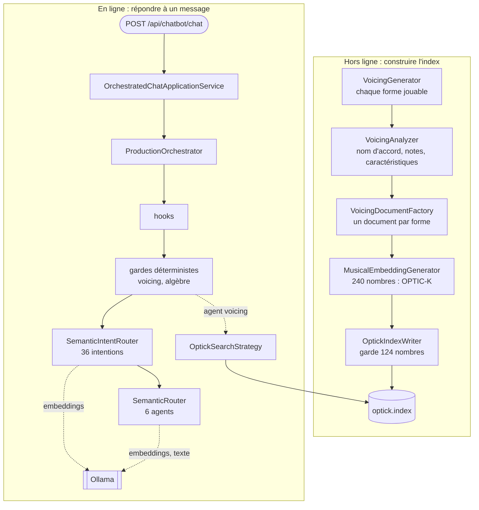

« L'IA de GA » n'est pas un composant unique. C'est un pipeline qui calcule un vecteur pour chaque forme d'accord jouable à la guitare et les range dans un fichier, et un hôte web qui répond aux messages de chat, tantôt avec ce fichier, tantôt avec du simple code C#, tantôt avec un modèle de langage. Cette leçon dessine les deux, puis ouvre l'hôte du chatbot et liste ce qu'il enregistre réellement, pour que les trois leçons suivantes zooment chacune sur une case de la carte.

Tous les liens vers GA pointent sur le commit [`a826864`](https://github.com/GuitarAlchemist/ga/tree/a826864f3a012cad88e415954bf57eca0ce12aa6).

## Exécuter le code

Le programme du cours se trouve dans [`code/ga-ai`](https://github.com/spareilleux/learn/tree/main/code/ga-ai). La première exécution clone dans `code/ga-ai/.ga` les parties de GA dont il a besoin, compile le tout et compare chaque leçon avec sa sortie attendue :

```bash
bash code/ga-ai/check.sh
```

Sous Windows, lance-le depuis Git Bash ; les commandes sont les mêmes sur les trois systèmes. Le clone est sans blobs et clairsemé : [`fetch-ga.sh`](https://github.com/spareilleux/learn/blob/8e335d7/code/ga-ai/fetch-ga.sh) extrait 17 dossiers de projets, environ 11 Mo de sources, et ne touche jamais à un clone de GA que tu aurais déjà. Sur les runners de CI, une exécution complète, clone et compilation compris, prend une minute et demie sous Linux et trois sous Windows. Ensuite, chaque leçon s'exécute seule :

```bash
dotnet run --project code/ga-ai/GaAi -c Release -- l1
```

## Cinq couches

Le [`CLAUDE.md`](https://github.com/GuitarAlchemist/ga/blob/a826864f3a012cad88e415954bf57eca0ce12aa6/CLAUDE.md#L20-L30) de GA décrit un modèle strict de cinq couches, de bas en haut, et une règle : le code d'IA va dans la couche 4, l'orchestration dans la couche 5, jamais plus bas.

| Couche | Projets | Ce que le côté IA en utilise |
|---|---|---|
| 1. Core | `GA.Core`, `GA.Domain.Core` | notes, classes de hauteurs, manche, classes d'ensembles : le [cours de théorie musicale](../../music-theory-ga/) les lit |
| 2. Domain | `GA.Business.Core`, `GA.Business.Config` | les records que remplit l'analyse d'un voicing |
| 3. Analysis | génération et analyse des voicings (dans `GA.Domain.Services` à ce commit) | `VoicingGenerator`, `VoicingAnalyzer` |
| 4. AI/ML | `GA.Business.ML` | le schéma OPTIC-K, le générateur d'embeddings, la lecture et la recherche dans l'index, les agents et les intentions |
| 5. Orchestration | `GA.Business.Core.Orchestration` | `ProductionOrchestrator`, le plugin des skills, les services de préchauffage |

Les projets de couche 3 que nomme `CLAUDE.md`, `GA.Business.Core.Harmony` et `GA.Business.Core.Fretboard`, ne sont pas ceux qui contiennent le code des voicings à ce commit : `VoicingGenerator` et `VoicingAnalyzer` sont dans `Common/GA.Domain.Services`. Les applications sont au-dessus des cinq couches : l'hôte du chatbot est [`Apps/GaChatbot.Api`](https://github.com/GuitarAlchemist/ga/tree/a826864f3a012cad88e415954bf57eca0ce12aa6/Apps/GaChatbot.Api), et l'outil qui écrit l'index est un projet de démonstration, [`Demos/Music Theory/FretboardVoicingsCLI`](https://github.com/GuitarAlchemist/ga/tree/a826864f3a012cad88e415954bf57eca0ce12aa6/Demos/Music%20Theory/FretboardVoicingsCLI).

## Deux pipelines

Le diagramme montre les deux moitiés. Le premier groupe est le travail fait une fois, hors ligne : chaque forme d'accord jouable devient un vecteur, et les vecteurs vont dans un seul fichier. Le second groupe est le travail fait pour chaque message de chat.



La leçon 2 ouvre la case de l'embedding, la leçon 3 l'index et sa recherche, la leçon 4 l'orchestrateur. Deux remarques dès maintenant :

- **Le même schéma sert des deux côtés.** Une requête de recherche est transformée en vecteur avec les mêmes partitions et les mêmes poids que les formes stockées, pour qu'un produit scalaire entre eux ait un sens. Si les deux divergent, l'en-tête du fichier d'index porte une empreinte de la disposition, et le lecteur refuse un fichier écrit avec une autre (leçon 3).
- **Le serveur de modèles est facultatif pour certains chemins et indispensable pour d'autres.** GA parle à [Ollama](https://ollama.com/), un serveur local de modèles à poids ouverts, via [Microsoft.Extensions.AI](https://learn.microsoft.com/dotnet/ai/microsoft-extensions-ai) : `IEmbeddingGenerator` pour les embeddings, `IChatClient` pour le texte. La leçon 4 montre quelles questions survivent sans lui.

## Les dépôts voisins

Le [`CLAUDE.md`](https://github.com/GuitarAlchemist/ga/blob/a826864f3a012cad88e415954bf57eca0ce12aa6/CLAUDE.md#L55-L59) de GA nomme trois dépôts qui échangent des fichiers avec lui :

- **[ix](https://github.com/GuitarAlchemist/ix)**, des algorithmes d'apprentissage automatique en Rust, « produit `state/voicings/optick.index` consommé par la couche RAG de GA », et entraîne dessus des autoencodeurs parcimonieux. Dans le code de GA, pourtant, le fichier est écrit par le `OptickIndexWriter` en C# de `FretboardVoicingsCLI` : le [skill `optic-k-rebuild`](https://github.com/GuitarAlchemist/ga/blob/a826864f3a012cad88e415954bf57eca0ce12aa6/.claude/skills/optic-k-rebuild/SKILL.md#L71-L112) de GA lui-même construit l'index avec cette CLI, puis lance dessus les diagnostics d'ix. Qu'ix puisse aussi écrire le fichier est *à vérifier*. Le [cours sur IX](../../machine-learning-ix/) lit le code d'ix à un autre commit.
- **[Demerzel](https://github.com/GuitarAlchemist/Demerzel)**, la gouvernance : ses pipelines exécutent les revues que décrivent les contrats de GA, et il génère les modules [Streeling](../../streeling/) de ce site.
- **[TARS](https://github.com/GuitarAlchemist/tars)**, en F#, est décrit comme un « validateur de théorie inter-modèles ». Rien dans ce cours ne l'appelle.

## Ce qu'enregistre l'hôte du chatbot

L'hôte canonique du chatbot est `GaChatbot.Api` : le [document sur les surfaces de chat](https://github.com/GuitarAlchemist/ga/blob/a826864f3a012cad88e415954bf57eca0ce12aa6/docs/architecture/chat-surfaces.md#L16-L21) de GA le dit depuis le 2026-05-13, et dit qu'il sert la démo publique sur `demos.guitaralchemist.com/chatbot/`. L'hôte a trois modes. [`AddMinimalChatbotApi`](https://github.com/GuitarAlchemist/ga/blob/a826864f3a012cad88e415954bf57eca0ce12aa6/Apps/GaChatbot.Api/Extensions/ServiceCollectionExtensions.cs#L22-L50) lit `Chatbot:Mode`, `direct` par défaut : `direct` envoie chaque message au modèle, `routed` utilise un routeur léger, et `full` (ou `orchestrated`) enregistre toute la pile d'orchestration. Le cours utilise `full`.

Plutôt que de lire les enregistrements, le programme démarre l'hôte et interroge son conteneur. [`WebApplicationFactory<TEntryPoint>`](https://learn.microsoft.com/aspnet/core/test/integration-tests) est la classe qu'utilisent les tests d'intégration d'ASP.NET Core : elle exécute le `Program` d'une application dans le processus de test, avec un serveur en mémoire, et permet à l'appelant de remplacer paramètres et services. Le [`ChatHost.cs`](https://github.com/spareilleux/learn/blob/8e335d7/code/ga-ai/GaAi/ChatHost.cs#L38-L43) du cours en est la version pour un programme console :

```csharp
builder.UseSetting("Chatbot:Mode", "full");
builder.UseSetting("Chatbot:PathBase", "");
builder.UseSetting("Ollama:BaseUrl", DeadOllama);
builder.UseSetting("Ollama:Endpoint", DeadOllama);
builder.UseSetting("VoicingSearch:OpticIndexPath", Lesson3.IndexPath);
builder.UseSetting("IX:External:Enabled", "false");
```

`DeadOllama` vaut `http://127.0.0.1:9`, un port sur lequel rien n'écoute, si bien que chaque appel au modèle échoue aussitôt, comme sur un runner de CI. L'index est un petit index que construit la leçon 3. La mémoire du chat, que GA range par défaut dans `~/.ga`, est redirigée vers des fichiers à côté du programme, pour qu'une exécution ne lise ni ne modifie jamais celle de l'auteur. Puis [`Lesson1.cs`](https://github.com/spareilleux/learn/blob/8e335d7/code/ga-ai/GaAi/Lesson1.cs) résout quelques services :

```text
== Orchestrator and application service
IHarmonicChatOrchestrator        ProductionOrchestrator
IChatApplicationService (host)   OrchestratedChatApplicationService
```

### 36 intentions

Une **intention** (*intent*), ici, est un objet C# capable de répondre à un type de question, avec une liste de prompts d'exemple. Le routeur sémantique d'intentions compare un message à ces exemples (leçon 4). L'hôte en enregistre 36 :

```text
== Intents the semantic router chooses from (36)
id                           examples  first example
skill.chordinfo              32        What is a C major chord?
skill.scaleinfo              24        What notes are in C major?
skill.modes                  37        What are the modes of the major scale
skill.interval               13        What is the interval between C and G?
skill.fretspan               0         (none)
skill.chordsubstitution      12        Tritone substitution for G7
skill.beginnerchords         7         Show me some easy beginner chords
skill.progressionmood        15        How do I make this progression sound darker?
skill.circleoffifths         10        Explain the circle of fifths
skill.practiceroutine        9         give me a 20 minute practice routine
skill.genreessentials        8         essential chords for blues guitar
skill.whatcanyoudo           14        what can you do
skill.transpose              13        transpose this progression down a half step
skill.commontones            9         What notes do Cmaj7 and Am7 share?
skill.diatonicchords         20        Give me the diatonic chords in C major
skill.relativekey            12        What is the relative minor of G major
skill.theorycomparison       7         What is the difference between major and minor
skill.settheoryequivalence   5         Are pitch classes 0,1,4 and 0,1,6 equivalent under inversion
skill.capo                   10        What shape do I play in E with capo 4
skill.voiceleading           10        voice leading from C to F
skill.alternatetunings       12        what is DADGAD tuning
skill.intervalclassvector    10        what is the interval-class vector of Cmaj7
skill.grothendieckdelta      10        how harmonically far is Am from D7
skill.icvneighbors           10        which chords are most similar to Dm7
skill.icvshortestpath        10        shortest harmonic path from Cmaj7 to G7
skill.grothendieckparse      10        parse C ⊗ G
skill.chordvoicings          12        voicings for Cmaj7
skill.improvisation          17        what scale can I use to solo over Cmaj7?
skill.outsidenotes           10        why does F sound outside over Cmaj7
skill.keyidentification      7         What key is C Am F G in?
skill.progressioncompletion  5         What chord comes next after C G Am?
skill.rememberthis           7         remember that I prefer drop-2 voicings for jazz comping
algebra                      13        Are 0146 and 0137 z-related?
tab.optimize                 5         Make this progression smoother to play
tab.analyze                  4         Analyse this tab
voicing                      11        Show me Drop 2 voicings of Cmaj7
```

32 d'entre elles enveloppent un **skill**, une classe qui implémente `IOrchestratorSkill` et que [`GaPlugin`](https://github.com/GuitarAlchemist/ga/blob/a826864f3a012cad88e415954bf57eca0ce12aa6/Common/GA.Business.Core.Orchestration/Plugins/GaPlugin.cs#L32-L40) enregistre trois fois : comme elle-même, comme `IOrchestratorSkill`, et enveloppée dans un `OrchestratorSkillIntent`. L'une d'elles, `skill.fretspan`, n'a aucun exemple, et le routeur [ignore les intentions sans exemples](https://github.com/GuitarAlchemist/ga/blob/a826864f3a012cad88e415954bf57eca0ce12aa6/Common/GA.Business.ML/Agents/Intents/SemanticIntentRouter.cs#L95-L96) : elle ne peut jamais être choisie par similarité.

### 6 agents et 4 hooks

Un **agent**, dans le code de GA, est une classe qui répond avec un modèle de langage, en appelant éventuellement des outils. Les messages qu'aucune intention ne réclame vont à l'un des six :

```text
== Agents behind the LLM path (6)
tab          TabAgent
theory       TheoryAgent
technique    TechniqueAgent
composer     ComposerAgent
critic       CriticAgent
voicing      VoicingAgent

== Hooks, in the order they run (4)
PromptSanitizationHook
MemoryHook
MemoryWriteHook
ObservabilityHook
```

Un **hook** s'exécute à des points fixes de chaque requête : quand elle arrive, avant et après un skill, quand la réponse part. C'est la même idée que les hooks du [cours de programmation agentique](../../agentic-coding/03-hooks-skills-subagents/), vue de l'autre côté : là-bas, du code autour d'un agent que tu utilises ; ici, du code autour des agents que GA exécute.

La dernière ligne de la leçon relie les deux pipelines :

```text
== The embedding every voicing gets
OPTIC-K-v1.8, 240 dims in 11 partitions, 124 of them searched
```

## Ce que le chatbot doit devenir

La [feuille de route du chatbot](https://github.com/GuitarAlchemist/ga/blob/a826864f3a012cad88e415954bf57eca0ce12aa6/docs/plans/2026-05-07-chatbot-roadmap.md#L23-L25) de GA énonce son étoile polaire en une phrase : le chatbot est « the conversational front end to the Guitar Alchemist domain », la façade conversationnelle du domaine de Guitar Alchemist, où « each user query is **routed by intent**, **answered by the domain**, **formatted by the skill**, and **shaped by the LLM only at the prose layer** » : chaque question est routée par intention, répondue par le domaine, mise en forme par le skill, et façonnée par le modèle seulement au niveau de la prose. Le modèle écrit les phrases ; les faits viennent de la théorie musicale typée de GA.

Le ticket [#623](https://github.com/GuitarAlchemist/ga/issues/623), ouvert le 2026-08-01 et marqué P0, en fait un objectif visible par l'utilisateur : un guitariste donne une progression d'accords et un accordage, et obtient la tonalité et les fonctions des accords, des choix de gammes et d'arpèges, des voicings jouables avec peu de déplacement de la main entre eux, et une explication des compromis. Le ticket [#589](https://github.com/GuitarAlchemist/ga/issues/589) nomme le risque auquel il répond : « free-form LLM text asserting music-theory claims nothing validates », du texte libre de modèle qui affirme des faits de théorie musicale que rien ne valide, et propose que le modèle se contente de remplir une structure JSON que le moteur de théorie vérifie.

Où en sont les choses, pour autant que ce cours puisse le dire le 2026-09-14 :

| État | Quoi | Preuve |
|---|---|---|
| Fonctionne, vérifié ici | vecteurs OPTIC-K, écriture et lecture de l'index, recherche par chiffrage d'accord, chemins algèbre et voicing du chatbot, skills appelés directement | leçons 2 à 4, exécutées en CI sans modèle |
| Fonctionne avec un modèle, non vérifié ici | routage par embeddings, les six agents, réponses en prose | nécessite Ollama ; non exécuté par ce cours (*à vérifier*) |
| Problèmes connus, ouverts | la partition CONTEXT ne porte rien ([#616](https://github.com/GuitarAlchemist/ga/issues/616)) ; mauvais conseils sur les accords d'emprunt ([#567](https://github.com/GuitarAlchemist/ga/issues/567)) ; « E-flat major » lu comme E majeur ([#554](https://github.com/GuitarAlchemist/ga/issues/554)) ; tonalités des cadences ([#614](https://github.com/GuitarAlchemist/ga/issues/614)) | tickets de GA, ouverts le 2026-09-14 |
| Prévu | le coach de la progression aux voicings ([#623](https://github.com/GuitarAlchemist/ga/issues/623)) ; sortie structurée validée ([#589](https://github.com/GuitarAlchemist/ga/issues/589)) | proposés, ouverts |
| Recherche | modèles du monde latents et planification sur OPTIC-K ([#605](https://github.com/GuitarAlchemist/ga/issues/605), [#610](https://github.com/GuitarAlchemist/ga/issues/610), [#611](https://github.com/GuitarAlchemist/ga/issues/611), [#606](https://github.com/GuitarAlchemist/ga/issues/606), [#607](https://github.com/GuitarAlchemist/ga/issues/607)) | explorations, ouvertes |

Les leçons complètent la ligne des problèmes connus : le cours a trouvé plus d'une douzaine de différences entre le code de GA et ses documents, listées dans le [journal](../journal/).

## Exercices

1. Sans rien exécuter, quel chemin répond à « Are 0146 and 0137 z-related? » : une intention, un agent, ou quelque chose avant les deux ? Regarde la liste des intentions ci-dessus et le diagramme.
2. L'hôte est démarré avec `Chatbot:Mode` laissé à sa valeur par défaut. Quel `IChatApplicationService` résout-il, et qu'arrive-t-il à chaque message ?
3. Pourquoi le programme du cours redirige-t-il `MemoryStore` et `ChatTranscriptStore` au lieu de laisser GA utiliser ses valeurs par défaut ?

<details>
<summary>Solutions</summary>

1. Quelque chose avant les deux : `ProductionOrchestrator` exécute un test d'algèbre déterministe avant tout routage par intention ([lignes 359-373](https://github.com/GuitarAlchemist/ga/blob/a826864f3a012cad88e415954bf57eca0ce12aa6/Common/GA.Business.Core.Orchestration/Services/ProductionOrchestrator.cs#L359-L373)). Le prompt contient « z-related », l'un des mots-clés du classifieur. L'intention `algebra` existe aussi, avec ce prompt même comme premier exemple, mais le chemin rapide répond avant que le routeur soit consulté. La leçon 4 montre la réponse : `routingMethod ix-algebra`.
2. `DirectChatApplicationService` : le mode par défaut est `direct` ([ligne 22](https://github.com/GuitarAlchemist/ga/blob/a826864f3a012cad88e415954bf57eca0ce12aa6/Apps/GaChatbot.Api/Extensions/ServiceCollectionExtensions.cs#L22)), et dans ce mode chaque message part directement au modèle de chat avec un prompt système. Si le modèle est injoignable, chaque message échoue.
3. Parce que les valeurs par défaut sont des fichiers dans le répertoire personnel de l'utilisateur, `~/.ga` : un test qui écrit un tour de chat modifierait la vraie mémoire de l'auteur, et un test qui la lit en dépendrait. Faire pointer les deux stockages vers un dossier neuf rend l'exécution reproductible et inoffensive. `ConfigureTestServices` enregistre les remplacements après les enregistrements de l'application elle-même, donc ce sont eux qui l'emportent.

</details>

## À retenir

- L'IA de GA, ce sont deux pipelines qui partagent un schéma : hors ligne, les formes d'accords deviennent des vecteurs OPTIC-K de 240 nombres rangés dans un index ; en ligne, un message de chat passe par des hooks, des gardes déterministes, 36 intentions et 6 agents.
- Le code d'IA vit dans `GA.Business.ML` (couche 4), l'orchestration dans `GA.Business.Core.Orchestration` (couche 5) ; l'hôte du chatbot est `GaChatbot.Api`, et l'écrivain de l'index est une CLI de `Demos`.
- `WebApplicationFactory` permet à un simple programme console de démarrer un vrai hôte ASP.NET Core, de remplacer ses paramètres et services, et de lire son conteneur : la carte la plus fiable de ce qui est enregistré.
- L'étoile polaire est un chatbot où le domaine répond et le modèle ne fait que formuler ; le coach prévu et la sortie structurée sont des pas dans cette direction, et plusieurs problèmes connus barrent la route.

## Sources

- GuitarAlchemist/ga au commit [`a826864`](https://github.com/GuitarAlchemist/ga/tree/a826864f3a012cad88e415954bf57eca0ce12aa6) : `CLAUDE.md`, `docs/architecture/chat-surfaces.md`, `docs/plans/2026-05-07-chatbot-roadmap.md`, `Apps/GaChatbot.Api/Extensions/ServiceCollectionExtensions.cs`, `Common/GA.Business.Core.Orchestration/Plugins/GaPlugin.cs`, `Common/GA.Business.Core.Orchestration/Services/ProductionOrchestrator.cs`.
- Tickets de GA [#554](https://github.com/GuitarAlchemist/ga/issues/554), [#567](https://github.com/GuitarAlchemist/ga/issues/567), [#589](https://github.com/GuitarAlchemist/ga/issues/589), [#605](https://github.com/GuitarAlchemist/ga/issues/605), [#606](https://github.com/GuitarAlchemist/ga/issues/606), [#607](https://github.com/GuitarAlchemist/ga/issues/607), [#610](https://github.com/GuitarAlchemist/ga/issues/610), [#611](https://github.com/GuitarAlchemist/ga/issues/611), [#614](https://github.com/GuitarAlchemist/ga/issues/614), [#616](https://github.com/GuitarAlchemist/ga/issues/616), [#623](https://github.com/GuitarAlchemist/ga/issues/623), lus le 2026-09-14.
- Microsoft Learn : [Tests d'intégration dans ASP.NET Core](https://learn.microsoft.com/aspnet/core/test/integration-tests), [Bibliothèques Microsoft.Extensions.AI](https://learn.microsoft.com/dotnet/ai/microsoft-extensions-ai).
- [Ollama](https://ollama.com/).
