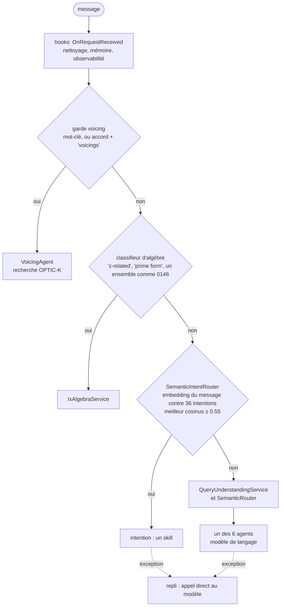

Les leçons précédentes appelaient les classes de GA une par une. Celle-ci envoie des requêtes HTTP à l'hôte du chatbot lui-même, `GaChatbot.Api`, démarré dans le processus du cours comme à la leçon 1, avec l'index de la leçon 3 et une adresse de modèle où rien n'écoute. Quatre messages entrent ; ce qui sort, réponses, traces et erreurs, montre l'ordre dans lequel GA essaie de répondre, et ce qui dépend d'un modèle.

Tous les liens vers GA pointent sur le commit [`a826864`](https://github.com/GuitarAlchemist/ga/tree/a826864f3a012cad88e415954bf57eca0ce12aa6). Les sorties viennent de :

```bash
dotnet run --project code/ga-ai/GaAi -c Release -- l4
```

## L'ordre des tentatives

`POST /api/chatbot/chat` arrive à [`ChatbotController.Chat`](https://github.com/GuitarAlchemist/ga/blob/a826864f3a012cad88e415954bf57eca0ce12aa6/Apps/GaChatbot.Api/Controllers/ChatbotController.cs#L102-L109), puis à [`OrchestratedChatApplicationService`](https://github.com/GuitarAlchemist/ga/blob/a826864f3a012cad88e415954bf57eca0ce12aa6/Apps/GaChatbot.Api/Services/OrchestratedChatApplicationService.cs#L43-L125), qui appelle l'orchestrateur et se replie sur un simple appel au modèle si quoi que ce soit échoue. [`ProductionOrchestrator.AnswerAsync`](https://github.com/GuitarAlchemist/ga/blob/a826864f3a012cad88e415954bf57eca0ce12aa6/Common/GA.Business.Core.Orchestration/Services/ProductionOrchestrator.cs#L304-L520) essaie, dans l'ordre :



| Étape | Besoin d'un modèle ? | Code |
|---|---|---|
| hooks | non | [lignes 318-339](https://github.com/GuitarAlchemist/ga/blob/a826864f3a012cad88e415954bf57eca0ce12aa6/Common/GA.Business.Core.Orchestration/Services/ProductionOrchestrator.cs#L318-L339) |
| garde voicing : un mot-clé comme « voicings » ou « fingering », ou un chiffrage d'accord suivi de « shape » ou « voicings » | non | [lignes 343-357](https://github.com/GuitarAlchemist/ga/blob/a826864f3a012cad88e415954bf57eca0ce12aa6/Common/GA.Business.Core.Orchestration/Services/ProductionOrchestrator.cs#L343-L357), [779-787](https://github.com/GuitarAlchemist/ga/blob/a826864f3a012cad88e415954bf57eca0ce12aa6/Common/GA.Business.Core.Orchestration/Services/ProductionOrchestrator.cs#L779-L787) |
| chemin rapide d'algèbre : un mot-clé ou un motif d'ensemble de classes de hauteurs | non | [lignes 359-373](https://github.com/GuitarAlchemist/ga/blob/a826864f3a012cad88e415954bf57eca0ce12aa6/Common/GA.Business.Core.Orchestration/Services/ProductionOrchestrator.cs#L359-L373), [`KeywordAlgebraPromptClassifier`](https://github.com/GuitarAlchemist/ga/blob/a826864f3a012cad88e415954bf57eca0ce12aa6/Common/GA.Business.Core.Orchestration/Services/KeywordAlgebraPromptClassifier.cs) |
| routeur sémantique d'intentions | **embeddings** | [ligne 403](https://github.com/GuitarAlchemist/ga/blob/a826864f3a012cad88e415954bf57eca0ce12aa6/Common/GA.Business.Core.Orchestration/Services/ProductionOrchestrator.cs#L403), [`SemanticIntentRouter`](https://github.com/GuitarAlchemist/ga/blob/a826864f3a012cad88e415954bf57eca0ce12aa6/Common/GA.Business.ML/Agents/Intents/SemanticIntentRouter.cs#L87-L160) |
| extraction des filtres et routage vers un agent, en parallèle | **texte et embeddings** | [lignes 501-506](https://github.com/GuitarAlchemist/ga/blob/a826864f3a012cad88e415954bf57eca0ce12aa6/Common/GA.Business.Core.Orchestration/Services/ProductionOrchestrator.cs#L501-L506) |

Le routeur d'intentions est un classifieur par plus proches voisins sur des embeddings de texte : il calcule l'embedding du message, le compare à la description et aux exemples de chaque intention, garde le meilleur cosinus de chaque intention, ajoute de petits bonus pour des motifs de surface, et accepte la meilleure intention si elle atteint `DefaultMinConfidence`, 0.55 ([ligne 47](https://github.com/GuitarAlchemist/ga/blob/a826864f3a012cad88e415954bf57eca0ce12aa6/Common/GA.Business.ML/Agents/Intents/SemanticIntentRouter.cs#L36-L47)). Les embeddings viennent d'Ollama. Les deux gardes placées devant lui sont les parties qui n'en ont pas besoin, et toutes deux ont été mises là exprès : la garde voicing parce que le routeur envoyait « Show me Drop 2 voicings of Cmaj7 » au skill des modes, le chemin d'algèbre parce que, sans point d'accès aux embeddings, « CI runners without Ollama » échouent « and 500s when the LLM is ALSO unreachable », et renvoient des 500 quand le modèle est lui aussi injoignable ([lignes 359-368](https://github.com/GuitarAlchemist/ga/blob/a826864f3a012cad88e415954bf57eca0ce12aa6/Common/GA.Business.Core.Orchestration/Services/ProductionOrchestrator.cs#L359-L368)).

## Une question d'algèbre

[`Lesson4.cs`](https://github.com/spareilleux/learn/blob/8e335d7/code/ga-ai/GaAi/Lesson4.cs), dans le cours, poste `{ "message": "..." }` avec le `HttpClient` de [`WebApplicationFactory`](https://learn.microsoft.com/aspnet/core/test/integration-tests), et affiche les champs de la réponse JSON :

```text
== POST /api/chatbot/chat "Are 0146 and 0137 z-related?"
HTTP 200
agentId        algebra
routingMethod  ix-algebra
confidence     1.00
grounding      ix-compatible 7b02a56 z-relation
  left         [0,1,4,6]
  right        [0,1,3,7]
  leftIcv      <1 1 1 1 1 1>
  rightIcv     <1 1 1 1 1 1>
  zRelated     True
answer:
  | [0,1,4,6] and [0,1,3,7] are Z-related: they share ICV <1 1 1 1 1 1> but have different prime forms.
trace:
  chat.request             completed
  orchestration.answer     completed
  orchestration.route      completed
  agent.semantic_result    completed
  notation.vextab          completed
  response.emit            completed
```

Le classifieur d'algèbre a reconnu « z-related » : aucun modèle n'a été sollicité. La réponse dit qui a répondu (`agentId`), comment il a été choisi (`routingMethod`), avec quelle confiance, et sur quel **ancrage** (*grounding*) : une source, une révision et les faits sur lesquels repose la réponse. Les classes d'ensembles et leur vecteur d'intervalles commun sont ceux du [cours de théorie musicale](../../music-theory-ga/04-set-classes/). C'est l'étoile polaire de la leçon 1 en miniature : le domaine a calculé les faits, et la phrase ne fait que les reformuler.

La **trace** est la liste des étapes que l'hôte a enregistrées pour le panneau de droite de la page de chat de GA. Le cours affiche les noms des étapes et leurs statuts ; l'hôte enregistre aussi des durées et des attributs comme `routing.method`, laissés de côté ici parce que les durées changent à chaque exécution.

## Une question de voicing

````text
== POST /api/chatbot/chat "Show me Cmaj7 voicings"
HTTP 200
agentId        voicing
routingMethod  deterministic-voicing
confidence     0.92
grounding      (none)
answer:
  | Found 2 voicings matching chord Cmaj7:
  |
  | - **Cmaj7** `3-0-x-2-3-x` (guitar, score 0.369)
  | ```vextab
  | 6/3 5/0 3/2 2/3
  | ```
  | - **Cmaj7** `3-0-0-2-3-x` (guitar, score 0.369)
  | ```vextab
  | 6/3 5/0 4/0 3/2 2/3
  | ```
trace:
  chat.request             completed
  orchestration.answer     completed
  orchestration.route      completed
  agent.semantic_result    completed
  notation.vextab          completed
  response.emit            completed
````

« voicings » a déclenché la garde, et [`VoicingAgent`](https://github.com/GuitarAlchemist/ga/blob/a826864f3a012cad88e415954bf57eca0ce12aa6/Common/GA.Business.ML/Agents/VoicingAgent.cs#L46-L150) a répondu. Malgré son nom et son paramètre `IChatClient`, il n'a pas appelé le modèle : un analyseur typé a extrait le chiffrage `Cmaj7`, [`MusicalQueryEncoder`](https://github.com/GuitarAlchemist/ga/blob/a826864f3a012cad88e415954bf57eca0ce12aa6/Common/GA.Business.ML/Search/MusicalQueryEncoder.cs#L43-L109) a construit le vecteur de requête, et la recherche avec le filtre `ChordName` a renvoyé les deux formes de la leçon 3, avec le même score, 0.369. L'étiquette « agent », dans GA, désigne une classe qui *peut* utiliser le modèle.

Puis [`PlayableNotationFormatter`](https://github.com/GuitarAlchemist/ga/blob/a826864f3a012cad88e415954bf57eca0ce12aa6/Common/GA.Business.ML/Notation/PlayableNotationFormatter.cs#L31-L53) a ajouté un bloc [VexTab](https://vexflow.com/vextab/) sous chaque diagramme, pour que la page puisse dessiner une tablature. Il lit le diagramme mi grave en premier : l'élément 0 devient la corde 6. Les diagrammes de GA commencent au mi aigu, donc `3-0-x-2-3-x` (C, E, B et G en partant de la basse) devient `6/3 5/0 3/2 2/3` : G, A, A et D. L'accord affiché sous « Cmaj7 » n'est pas un Cmaj7. C'est encore le problème d'ordre des diagrammes de la leçon 2, cette fois sous les yeux d'un utilisateur.

## Une question pour un skill

```text
== POST /api/chatbot/chat "What is the relative minor of C major?"
HTTP 500
logged:
  Error ExceptionHandlerMiddleware: An unhandled exception has occurred while executing the request. [HttpRequestException at DirectChatApplicationService.GenerateAnswerAsync, DirectChatApplicationService.cs:96]
  Error OrchestratedChatApplicationService: Chat orchestration failed. Falling back to direct chat client. [HttpRequestException at SemanticRouter.EnsureEmbeddingsInitializedAsync, SemanticRouter.cs:251]
  Warning QueryUnderstandingService: [QueryUnderstanding] Failed to extract filters [HttpRequestException at OllamaGenerateClient.GenerateAsync, OllamaGenerateClient.cs:46]
  Warning SemanticIntentRouter: SemanticIntentRouter: example embedding failed; router will degrade to fallback [HttpRequestException at SemanticIntentRouter.EnsureExamplesEmbeddedAsync, SemanticIntentRouter.cs:370]
  Warning SemanticIntentRouter: SemanticIntentRouter: query embedding failed; routing falls through to LLM path [HttpRequestException at SemanticIntentRouter.RouteAsync, SemanticIntentRouter.cs:111]
```

HTTP 500, et pas de réponse. Le cours garde les avertissements et les erreurs de l'hôte, avec le type d'exception et la frame de GA la plus profonde, et les affiche triés. Remis dans l'ordre où ils se sont produits :

1. Aucune garde n'a reconnu le message : l'orchestrateur a donc interrogé `SemanticIntentRouter`. Le calcul des embeddings des exemples des intentions a échoué ([ligne 370](https://github.com/GuitarAlchemist/ga/blob/a826864f3a012cad88e415954bf57eca0ce12aa6/Common/GA.Business.ML/Agents/Intents/SemanticIntentRouter.cs#L341-L385)), puis celui de la requête ([ligne 111](https://github.com/GuitarAlchemist/ga/blob/a826864f3a012cad88e415954bf57eca0ce12aa6/Common/GA.Business.ML/Agents/Intents/SemanticIntentRouter.cs#L106-L127)). Les deux exceptions sont interceptées : le routeur journalise un avertissement et renvoie `null`, « aucune intention ».
2. L'orchestrateur est passé à `QueryUnderstandingService`, dont l'appel au modèle a échoué et a été intercepté aussi.
3. En parallèle, [`SemanticRouter.RouteAsync`](https://github.com/GuitarAlchemist/ga/blob/a826864f3a012cad88e415954bf57eca0ce12aa6/Common/GA.Business.ML/Agents/SemanticRouter.cs#L68-L104) a appelé `EnsureEmbeddingsInitializedAsync`, qui calcule les embeddings des descriptions des six agents ([ligne 251](https://github.com/GuitarAlchemist/ga/blob/a826864f3a012cad88e415954bf57eca0ce12aa6/Common/GA.Business.ML/Agents/SemanticRouter.cs#L233-L258)). Rien dans `RouteAsync` n'intercepte cette exception. `RouteAsync` a un repli par mots-clés, à l'étape 3 de ses propres commentaires, `semanticResult ?? KeywordRoute(query)` : il n'est jamais atteint.
4. `OrchestratedChatApplicationService` a intercepté l'exception, journalisé « Chat orchestration failed. Falling back to direct chat client. » ([lignes 109-124](https://github.com/GuitarAlchemist/ga/blob/a826864f3a012cad88e415954bf57eca0ce12aa6/Apps/GaChatbot.Api/Services/OrchestratedChatApplicationService.cs#L109-L124)), et appelé [`DirectChatApplicationService`](https://github.com/GuitarAlchemist/ga/blob/a826864f3a012cad88e415954bf57eca0ce12aa6/Apps/GaChatbot.Api/Services/DirectChatApplicationService.cs#L69-L99), qui appelle le modèle, encore, et lève une exception, à la ligne 96. Celle-là atteint le gestionnaire d'exceptions d'ASP.NET Core : 500.

La question n'a besoin d'aucun modèle. Le skill qui y répond existe, et le programme l'appelle directement, sans le routeur :

```text
== The skill.relativekey intent, called directly with "What is the relative minor of C major?"
confidence     1.00
  | The relative minor of **C major** is **Am**.
  |
  | Both share the same key signature (no sharps or flats). Same notes, different tonal center — the relative minor starts on the 6th degree of the major scale.
```

Confiance 1.00, la bonne réponse, calculée par le code du domaine de GA. Avant que le routeur sémantique existe, la méthode `CanHandle` de chaque skill décidait avec des mots-clés. L'orchestrateur ne l'appelle plus, mais les skills l'implémentent toujours :

```text
== IOrchestratorSkill.CanHandle for each prompt (the keyword path the orchestrator no longer calls)
Are 0146 and 0137 z-related?             (none)
Show me Cmaj7 voicings                   ChordVoicings
What is the relative minor of C major?   ScaleInfo
Why does a ii-V-I sound resolved?        (none)
```

Le chemin par mots-clés n'aurait pas sauvé cette question non plus : il choisit `ScaleInfo`, pas le skill des tonalités relatives. La feuille de route de GA range « replacing semantic routing with regex », remplacer le routage sémantique par des expressions régulières, parmi ses [non-objectifs](https://github.com/GuitarAlchemist/ga/blob/a826864f3a012cad88e415954bf57eca0ce12aa6/docs/plans/2026-05-07-chatbot-roadmap.md#L46-L49), et cette sortie montre pourquoi les mots-clés seuls sont fragiles. Elle montre aussi le coût de ce choix : à `a826864`, quand le serveur d'embeddings est en panne, chaque question qu'aucune garde n'attrape finit en 500, y compris celles auxquelles un skill déterministe répond avec certitude.

## Une question pour le modèle

```text
== POST /api/chatbot/chat "Why does a ii-V-I sound resolved?"
HTTP 500
logged:
  Error ExceptionHandlerMiddleware: An unhandled exception has occurred while executing the request. [HttpRequestException at DirectChatApplicationService.GenerateAnswerAsync, DirectChatApplicationService.cs:96]
  Error OrchestratedChatApplicationService: Chat orchestration failed. Falling back to direct chat client. [HttpRequestException at SemanticRouter.EnsureEmbeddingsInitializedAsync, SemanticRouter.cs:251]
  Warning QueryUnderstandingService: [QueryUnderstanding] Failed to extract filters [HttpRequestException at OllamaGenerateClient.GenerateAsync, OllamaGenerateClient.cs:46]
  Warning SemanticIntentRouter: SemanticIntentRouter: example embedding failed; router will degrade to fallback [HttpRequestException at SemanticIntentRouter.EnsureExamplesEmbeddedAsync, SemanticIntentRouter.cs:370]
  Warning SemanticIntentRouter: SemanticIntentRouter: query embedding failed; routing falls through to LLM path [HttpRequestException at SemanticIntentRouter.RouteAsync, SemanticIntentRouter.cs:111]
```

Les cinq mêmes lignes de journal. Celle-ci a vraiment besoin d'un modèle : expliquer pourquoi une cadence sonne résolue, c'est de la prose, et aucun skill ne la réclame. Ce que répondent les six agents de la leçon 1, avec Ollama en marche, n'est pas vérifié par ce cours (*à vérifier*). Sans modèle, le bon résultat serait un message clair, « l'assistant est indisponible » ; l'hôte renvoie à la place un 500 depuis son gestionnaire d'exceptions. Le ticket [#589](https://github.com/GuitarAlchemist/ga/issues/589) décrit où GA veut mener ce chemin : le modèle propose une structure typée, et le moteur de théorie la valide avant que l'utilisateur ne voie quoi que ce soit.

## Une course dans la CI du cours lui-même

La première version de cette leçon passait sous Windows et échouait sous Linux et macOS. Sur ces deux systèmes, les lignes de journal de la requête sur le relatif mineur apparaissaient aussi sous la requête d'algèbre, la première envoyée. La cause est [`IntentEmbeddingWarmupService`](https://github.com/GuitarAlchemist/ga/blob/a826864f3a012cad88e415954bf57eca0ce12aa6/Common/GA.Business.Core.Orchestration/Services/IntentEmbeddingWarmupService.cs#L27-L66), un [service hébergé](https://learn.microsoft.com/aspnet/core/fundamentals/host/hosted-services) dont le `StartAsync` lance le calcul des embeddings des exemples de chaque intention, et rend la main aussitôt :

```csharp
public Task StartAsync(CancellationToken cancellationToken)
{
    // Fire-and-forget — host startup must not block on this.
    _ = Task.Run(() => WarmAsync(cancellationToken), cancellationToken);
    return Task.CompletedTask;
}
```

Pour un vrai serveur, c'est raisonnable : le premier utilisateur n'attend pas une minute que le cache se remplisse. Pour un test, cela veut dire que les avertissements du préchauffage atterrissent dans la requête qui s'exécute à ce moment-là, et ce moment dépend de la machine. Le cours attend maintenant la dernière ligne de journal du préchauffage lui-même, « cache warmed » ou « warmup failed », avant d'envoyer quoi que ce soit, et lève une exception au bout de deux minutes ([`ChatHost.WaitForWarmup`](https://github.com/spareilleux/learn/blob/8e335d7/code/ga-ai/GaAi/ChatHost.cs#L23-L34)). Une ligne de journal est un signal fragile pour se synchroniser ; un service hébergé qui exposerait une `Task` pour sa fin en serait un meilleur.

## Exercices

1. Quel chemin répond à « What voicings of G7 are easy? », et a-t-il besoin d'un modèle ?
2. `SemanticRouter.RouteAsync` a un repli par mots-clés. Change le moins de code possible pour qu'un message l'atteigne quand le serveur d'embeddings est en panne. Où mettrais-tu un `try`, et que devrait-il intercepter ?
3. Avec ta modification de l'exercice 2, « What is the relative minor of C major? » obtiendrait-il une réponse correcte hors ligne ?
4. Le cours affiche les noms des étapes de la trace, mais pas leurs durées. Pourquoi, et que ferais-tu pour tester les durées malgré tout ?

<details>
<summary>Solutions</summary>

1. La garde voicing : « voicings » est l'un de ses mots-clés ([ligne 128](https://github.com/GuitarAlchemist/ga/blob/a826864f3a012cad88e415954bf57eca0ce12aa6/Common/GA.Business.Core.Orchestration/Services/ProductionOrchestrator.cs#L128-L134)). Ensuite, `VoicingAgent` extrait `G7` avec l'analyseur typé, et n'a pas besoin de modèle. L'effet de « easy » sur la recherche dépend de l'extracteur et du filtre de confort ; ce n'est pas vérifié ici (*à vérifier*).
2. Par exemple dans `RouteAsync`, autour du bloc sémantique :

   ```csharp
   if (textEmbeddings != null)
   {
       try
       {
           await EnsureEmbeddingsInitializedAsync(cancellationToken);
           semanticResult = await SemanticRouteAsync(query, cancellationToken);
           // ... le test de confiance, inchangé
       }
       catch (HttpRequestException ex)
       {
           _logger.LogWarning(ex, "Agent embeddings unavailable; using keyword routing");
       }
   }
   ```

   Intercepte l'exception que produit un serveur mort, `HttpRequestException`, pas `Exception`, pour qu'un vrai bug remonte quand même ; laisse passer `OperationCanceledException`, l'annulation demandée par l'appelant. Ni compilé ni exécuté contre GA (*à vérifier*) : l'étape de routage par le modèle, juste après, appelle aussi le modèle, et pourrait demander le même traitement.
3. Non. Le routeur par mots-clés choisit l'un des six agents, et un agent répond avec le modèle, qui est en panne. Le skill des tonalités relatives n'est atteint que par le routeur d'intentions, qui a besoin des embeddings. Une réponse hors ligne demande une route déterministe vers le skill : son `CanHandle`, un indice par mot-clé, ou un cache d'embeddings d'intentions calculés à l'avance.
4. Les durées changent à chaque exécution et sur chaque machine : une comparaison exacte avec `expected/` échouerait donc toujours. Un test peut plutôt vérifier des propriétés : chaque durée est positive ou nulle, les étapes sont dans l'ordre, le total reste sous une borne généreuse.

</details>

## À retenir

- Le chatbot de GA essaie, dans l'ordre : les hooks, une garde voicing, un classifieur d'algèbre, un routeur d'intentions par embeddings sur 36 intentions, puis un routage par le modèle vers 6 agents ; une orchestration qui échoue se replie sur un appel direct au modèle.
- Sans serveur de modèles, les deux gardes répondent encore, avec des faits d'ancrage et une trace ; tout le reste finit en HTTP 500 à `a826864`, parce qu'une exception non interceptée dans le routage vers les agents court-circuite le repli par mots-clés, et que le repli lui-même a besoin du modèle.
- « Agent » désigne une classe qui peut utiliser un modèle : `VoicingAgent` répond à « Show me Cmaj7 voicings » avec un analyseur et l'index OPTIC-K, rien de plus.
- La tablature affichée sous les voicings lit les diagrammes de GA dans le mauvais ordre de cordes : l'accord dessiné n'est pas l'accord nommé.
- Un préchauffage lancé sans attente dans un service hébergé rend les journaux d'un hôte dépendants du timing ; les tests ont besoin d'un signal de fin, et c'est la CI sur plusieurs systèmes qui a révélé la course.

## Sources

- GuitarAlchemist/ga au commit [`a826864`](https://github.com/GuitarAlchemist/ga/tree/a826864f3a012cad88e415954bf57eca0ce12aa6) : `Apps/GaChatbot.Api` (`Controllers/ChatbotController.cs`, `Services/OrchestratedChatApplicationService.cs`, `Services/DirectChatApplicationService.cs`), `Common/GA.Business.Core.Orchestration/Services` (`ProductionOrchestrator.cs`, `KeywordAlgebraPromptClassifier.cs`, `IntentEmbeddingWarmupService.cs`), `Common/GA.Business.ML/Agents` (`SemanticRouter.cs`, `VoicingAgent.cs`, `Intents/SemanticIntentRouter.cs`), `Common/GA.Business.ML/Notation/PlayableNotationFormatter.cs`, `docs/plans/2026-05-07-chatbot-roadmap.md`.
- Ticket de GA [#589](https://github.com/GuitarAlchemist/ga/issues/589), lu le 2026-09-14.
- Microsoft Learn : [Tests d'intégration dans ASP.NET Core](https://learn.microsoft.com/aspnet/core/test/integration-tests), [Tâches en arrière-plan avec des services hébergés](https://learn.microsoft.com/aspnet/core/fundamentals/host/hosted-services), [Gérer les erreurs dans ASP.NET Core](https://learn.microsoft.com/aspnet/core/fundamentals/error-handling).
- [VexTab](https://vexflow.com/vextab/).
