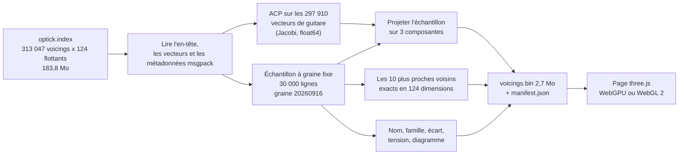

import LazyDemo from '../../../../components/LazyDemo.astro';

L'index épinglé de Guitar Alchemist stocke chaque voicing sous forme d'un vecteur compact de 124 nombres, extrait du plongement OPTIC-K à 240 dimensions. Ce prototype affiche un échantillon fixe de 30 000 de ses 297 910 voicings de guitare dans un nuage de points qu'on peut faire tourner, pointer et écouter, puis mesure quelle part de l'espace réel l'image montre. La réponse courte : une bonne carte, et un mauvais guide du voisinage.

<LazyDemo
	path="ga-lab/p1/"
	title="Explorateur de l'espace des voicings de GA"
	screenshot="ga-lab/p1-explorer.png"
	alt="Un nuage de points colorés sur fond sombre, avec un panneau qui montre un diagramme d'accord ouvert et ses dix voicings les plus proches"
	label="Charger l'explorateur (3,7 Mo)"
	note="L'image d'aperçu se charge avec la leçon ; l'explorateur et ses données ne se chargent qu'après le clic. L'interface de la démo est en anglais. Faites glisser pour tourner, survolez pour nommer un voicing, cliquez pour le sélectionner et l'entendre. Page complète :"
/>

Dans la version publiée, les dix voisins sont recherchés parmi les **30 000 voicings de l'échantillon**, pas parmi tout l'index. Les filtres masquent des points du nuage sans recalculer cette liste ; la sélection et ses voisins surlignés peuvent donc rester visibles malgré un filtre. Sur petit écran, ouvrez la page complète pour disposer de plus de place. Si WebGPU ne fonctionne pas, essayez la [version WebGL 2](https://spareilleux.github.io/learn/ga-lab/p1/?webgl).

La page publiée pèse 3,7 Mo : 2,7 Mo de voicings, 0,9 Mo de JavaScript avec three.js, et un manifeste. Chaque chiffre de cette leçon vient de [`code/ga-protos/p1-voicing-explorer`](https://github.com/spareilleux/learn/tree/main/code/ga-protos/p1-voicing-explorer), et les hypothèses ont été [commitées](https://github.com/spareilleux/learn/blob/03f2bbb/code/ga-protos/p1-voicing-explorer/results/hypotheses.md) avant les mesures.

## Ce que vous connaissez déjà : un index vectoriel

Si vous avez utilisé la [recherche vectorielle d'Azure AI Search](https://learn.microsoft.com/azure/search/vector-search-overview) ou la [recherche des k plus proches voisins d'Elasticsearch](https://www.elastic.co/docs/solutions/search/vector/knn), vous connaissez la forme de l'index des voicings de GA. Chaque document devient un vecteur ; une requête devient aussi un vecteur ; la réponse, ce sont les `k` documents dont les vecteurs obtiennent le meilleur score face à elle. En C#, le cœur du calcul est une boucle d'appels à [`TensorPrimitives.Dot`](https://learn.microsoft.com/dotnet/api/system.numerics.tensors.tensorprimitives.dot) et une file de priorité des `k` meilleurs.

Deux choses changent quand on veut *regarder* l'index au lieu de l'interroger.

- Un écran a deux dimensions, une vue 3D en a trois. Les vecteurs en ont 124. Il faut les projeter, et une projection perd de l'information.
- Un service de recherche répond à « qu'est-ce qui est proche de ceci ? ». Une image invite à la même question, à l'œil : les points dessinés à côté d'une voicing ressemblent à ses voisins. Le sont-ils vraiment ? Cela se mesure, et c'est la mesure principale de cette leçon.

## OPTIC-K en un paragraphe

Le plongement de GA est construit à la main, pas appris. Le [cours sur l'IA de GA](../../ga-ai/02-optic-k-embeddings/) le démonte : 240 nombres nommés répartis en 11 partitions, dont 6 partitions et 124 nombres comptent pour la similarité. STRUCTURE décrit l'ensemble de classes de hauteur (son chroma, son vecteur d'intervalles), MORPHOLOGY la forme sur le manche, CONTEXT la fonction harmonique, SYMBOLIC les étiquettes de technique, MODAL les modes auxquels l'accord appartient, ROOT la fondamentale. Chaque partition est normalisée puis multipliée par la racine carrée de son poids (0,45, 0,25, 0,20, 0,10, 0,10, 0,05), si bien qu'un seul produit scalaire donne la somme pondérée des cosinus par partition, 1,15 au plus. La [leçon 3](../../ga-ai/03-index-and-search/) de ce cours lit l'index binaire octet par octet, et l'[annexe OPTIC](../../music-theory-ga/appendix-optic/) du cours de théorie musicale explique les équivalences qui lui donnent son nom.

## Les données, épinglées

La branche `main` de GA était à [`66bdd049`](https://github.com/GuitarAlchemist/ga/tree/66bdd049ad3f4b10f996e4cc6a9c6e58797cf30e). Le fichier d'index n'est pas dans le dépôt : `FretboardVoicingsCLI --export-embeddings` le génère. Une session qui travaillait sur les performances de GA avait compilé cet outil à ce commit et exporté l'index 25 minutes plus tôt ; j'ai lu ce fichier sans le reconstruire, et je l'ai épinglé par son empreinte :

| | |
|---|---|
| fichier | `optick.index`, 183 770 270 octets |
| SHA-256 | `1e91e4695bab8aa4bb451fdd1f199a4afaa4c4ad913f08acc5163c6ab07caa23` |
| voicings | 313 047 : 297 910 pour la guitare, 7 795 pour la basse, 7 342 pour le ukulélé |
| dimensions | 124, empreinte de schéma `0x37cd8ecf` |
| export | 688 351 voicings brutes, 313 047 gardées après déduplication, 149 s |

La même session a exporté l'index une deuxième fois avec la même compilation. [`compare-indexes.mjs`](https://github.com/spareilleux/learn/blob/main/code/ga-protos/p1-voicing-explorer/scripts/compare-indexes.mjs) apparie les deux exports voicing par voicing :

```text
{"small":313047,"big":313047,"identical":312977,"differ":0,"missing":70,"vectorFound":313011,"sameName":312977,"maxAbsDifference":0}
```

Chaque vecteur présent dans les deux est identique bit à bit, mais 70 voicings d'un export sont absentes de l'autre. L'export déduplique les voicings qui partagent une forme de cases et un ensemble de classes de hauteur, et garde la plus facile à jouer ([`Program.cs`, lignes 759-787](https://github.com/GuitarAlchemist/ga/blob/66bdd049ad3f4b10f996e4cc6a9c6e58797cf30e/Demos/Music%20Theory/FretboardVoicingsCLI/Program.cs#L759-L787)) ; le générateur tourne en parallèle, et quand deux candidates coûtent autant, la première arrivée gagne. « L'index au commit `66bdd049` » n'est donc pas un seul fichier : c'est l'empreinte qui épingle les données.

### Quelle corde vient en premier

L'index stocke chaque diagramme sous forme de texte. La ligne 1000 donne :

```text
diagram "1-2-x-5-x-1", midiNotes [65, 61, 55, 41], quality_inferred "Gm7b5/F"
```

Lu depuis la corde de mi aigu, `1` est un fa 4, MIDI 65, la première note de la liste. Lu depuis le mi grave, `1` serait un fa 2, MIDI 41, la dernière. **L'index de GA écrit la corde 1, le mi aigu, en premier.** Un guitariste écrit la même forme mi grave en premier, `1x5x21`. Le [composant React `FretDiagram`](https://github.com/GuitarAlchemist/ga/blob/66bdd049ad3f4b10f996e4cc6a9c6e58797cf30e/ReactComponents/ga-react-components/src/components/FretDiagram.tsx#L8-L11) de GA et son [analyseur `FretDiagram.cs`](https://github.com/GuitarAlchemist/ga/blob/66bdd049ad3f4b10f996e4cc6a9c6e58797cf30e/Common/GA.Business.ML/Agents/FretDiagram.cs#L14) attendent le mi grave en premier. Le prototype garde l'ordre de GA dans ses données et convertit une seule fois, dans [`voicing.mjs`](https://github.com/spareilleux/learn/blob/main/code/ga-protos/p1-voicing-explorer/src/lib/voicing.mjs), et l'étape de construction vérifie chaque ligne de l'échantillon : le diagramme lu mi aigu en premier doit redonner les notes MIDI de l'index. Elle a trouvé 0 écart sur 30 000 lignes, et un test unitaire épingle la ligne 1000.

## La chaîne de construction



[`build-data.mjs`](https://github.com/spareilleux/learn/blob/main/code/ga-protos/p1-voicing-explorer/scripts/build-data.mjs) est du Node.js pur, sans dépendance :

```bash
cd code/ga-protos/p1-voicing-explorer
node scripts/build-data.mjs --index G:/learn-33/ga-p1/optick.index --out public/data --ga-sha 66bdd049ad3f4b10f996e4cc6a9c6e58797cf30e
```

```text
sampled 30000 of 297910 guitar voicings with seed 20260916
PCA on 297910 vectors: 11 Jacobi sweeps, first 3 components explain 22.2 %
exact 10-NN of 30000 voicings in 124 dimensions: 84.9 s
checks: {"midiMismatches":0,"stringCountMismatches":0}
PCA explained variance, first 3 components: 8.8 %, 8.2 %, 5.3 %
wrote public\data\voicings.bin (2670024 bytes) and manifest.json (3380 chord names)
timings: openMs 48, pcaMs 1291, knnMs 84876, totalMs 86348
```

Chaque étape est choisie pour donner les mêmes octets sur toutes les machines.

- **Le lecteur** ([`optick.mjs`](https://github.com/spareilleux/learn/blob/main/code/ga-protos/p1-voicing-explorer/src/lib/optick.mjs)) suit la disposition d'`OptickIndexReader`, et recalcule l'empreinte de schéma comme le CRC-32 de la chaîne de disposition : un fichier écrit avec une autre disposition est refusé.
- **L'ACP** ([`pca.mjs`](https://github.com/spareilleux/learn/blob/main/code/ga-protos/p1-voicing-explorer/src/lib/pca.mjs)) construit la matrice de covariance 124 × 124 en `float64` et la diagonalise par rotations de Jacobi cycliques, la méthode de la [leçon 5](../../machine-learning-ix/05-dimensionality-reduction/) du cours IX. Le signe d'un vecteur propre est arbitraire : chacun est donc retourné jusqu'à ce que sa plus grande composante soit positive. Sans cela, une reconstruction pourrait donner le nuage en miroir. Un test ajuste deux fois les mêmes données et compare les bits.
- **L'échantillon** ([`sample.mjs`](https://github.com/spareilleux/learn/blob/main/code/ga-protos/p1-voicing-explorer/src/lib/sample.mjs)) est un mélange de Fisher-Yates partiel piloté par mulberry32, un générateur écrit uniquement avec `Math.imul`, si bien qu'aucun arrondi flottant ne peut varier d'une plateforme à l'autre. Le test épingle les premières lignes que choisit la graine 20260916 : 4, 10, 42, 47, 52.
- **Les voisins** ([`knn.mjs`](https://github.com/spareilleux/learn/blob/main/code/ga-protos/p1-voicing-explorer/src/lib/knn.mjs)) sont exacts : chaque paire des 30 000 voicings, 900 millions de produits scalaires, 85 secondes sur un seul fil. Les égalités vont à la ligne la plus petite, comme dans l'`OptickSearchStrategy` de GA.
- **Le fichier** ([`format.mjs`](https://github.com/spareilleux/learn/blob/main/code/ga-protos/p1-voicing-explorer/src/lib/format.mjs)) est un en-tête de 24 octets suivi de tableaux typés, chacun aligné sur 4 octets, pour que la page les lise sur place : positions en `Float32Array`, cases en `Int8Array`, identifiants de noms et de voisins en `Uint16Array`, scores en `Float32Array`. Les 3 380 noms d'accords distincts, les familles et la provenance vont dans `manifest.json`.

L'échantillon publié contient 30 000 des 297 910 voicings de guitare, soit 10 %. La basse et le ukulélé sont laissés de côté : leurs diagrammes ont quatre cordes, et la page dessine des grilles de guitare.

## La page

[`main.js`](https://github.com/spareilleux/learn/blob/main/code/ga-protos/p1-voicing-explorer/src/main.js) utilise le `WebGPURenderer` de three.js, qui se replie sur WebGL 2 quand WebGPU manque, comme dans le [cours three.js](../../threejs/01-scene-camera-renderer/).

- **Les points.** WebGPU dessine les primitives de type point larges d'un seul pixel, quelle que soit la taille demandée ([`PointsNodeMaterial`](https://threejs.org/docs/pages/PointsNodeMaterial.html) le dit). La page dessine donc un seul [`Sprite`](https://threejs.org/docs/pages/Sprite.html), 30 000 fois : son matériau lit la position, la couleur et la visibilité de chaque instance dans des attributs instanciés, et une expression TSL sur les coordonnées de texture du quadrilatère le rend rond. Filtrer met la taille d'une instance à zéro : un petit envoi de tampon, aucune nouvelle géométrie.
- **La couleur.** Par famille d'accord (majeur, mineur, septième de dominante… ou « nommé seulement par classe d'ensemble » quand GA n'a pas de symbole d'accord), par la mesure de tension, par la position sur le manche, ou par le nombre de notes.
- **La sélection.** Quand le pointeur bouge, la page projette chaque point visible avec la matrice de la caméra et garde le plus proche à moins de 8 pixels : une simple boucle sur un `Float32Array`, comme on l'écrirait en C#.
- **Le diagramme** est porté du `FretDiagram.tsx` de GA vers un canevas 2D, géométrie et règle de case de départ comprises, et reçoit les cases converties mi grave en premier.
- **Le son** est une synthèse [Karplus-Strong](https://en.wikipedia.org/wiki/Karplus%E2%80%93Strong_string_synthesis) dans [`synth.mjs`](https://github.com/spareilleux/learn/blob/main/code/ga-protos/p1-voicing-explorer/src/lib/synth.mjs) : une ligne à retard longue d'une période, remplie de bruit, réinjectée à travers la moyenne de deux échantillons voisins. Cette moyenne est un filtre passe-bas : les partiels aigus s'éteignent en premier, comme sur une vraie corde. Les notes démarrent à 35 ms d'écart, corde grave en premier, et les échantillons partent vers la [Web Audio API](https://developer.mozilla.org/docs/Web/API/Web_Audio_API) en un seul tampon.
- **Les voisins** listés à droite sont les dix précalculés, avec le score de GA et leur distance dans la vue 3D. Des lignes jaunes relient la voicing à eux dans le nuage.

Les filtres d'écart et de tension utilisent deux valeurs calculées par l'étape de construction. L'écart est la distance entre la note frettée la plus basse et la plus haute. La tension n'est pas celle de GA : STRUCTURE a bien une case « tension », mais l'index la stocke normalisée avec sa partition, et la valeur ne peut pas être relue. Le prototype compte à la place les demi-tons, les tons et les tritons de l'ensemble de classes de hauteur : 0 pour un accord parfait majeur, 2 pour une septième de dominante.

## Mesures

[`measure.mjs`](https://github.com/spareilleux/learn/blob/main/code/ga-protos/p1-voicing-explorer/scripts/measure.mjs) tourne en deux minutes environ sur un seul fil et écrit [`results/measurements.json`](https://github.com/spareilleux/learn/blob/main/code/ga-protos/p1-voicing-explorer/results/measurements.json) :

```bash
node scripts/measure.mjs --index G:/learn-33/ga-p1/optick.index
```

Il choisit 2 000 voicings de requête parmi les 30 000 avec la graine 20260917, trouve leurs 10 plus proches voisins exacts par produit scalaire en 124 dimensions, et les compare aux 10 plus proches par distance euclidienne après projection sur 2, 3, 10 ou 32 composantes principales. Le rappel à 10 est la part des dix vrais voisins retrouvés parmi les dix voisins projetés.

### Ce qu'expliquent les trois axes

| Composantes | 1 | 2 | 3 | 10 | 32 | 64 |
|---|---|---|---|---|---|---|
| Variance expliquée | 8.8 % | 17.0 % | 22.2 % | 48.0 % | 84.7 % | 99.9 % |

Les deux premiers axes, c'est la forme. Les carrés des coefficients de la première composante sont à 85 % MORPHOLOGY et à 12 % ROOT ; ceux de la deuxième, à 83 % et 13 % ; la troisième est à 84 % STRUCTURE, les classes de hauteur. CONTEXT ne contribue à aucune : c'est la même constante pour toutes les voicings, une découverte que le cours sur l'IA de GA a faite aussi. Vers 64 composantes, 99,9 % de la variance est atteinte : les 124 nombres vivent en réalité dans une soixantaine de dimensions.

### Les voisins à l'écran sont-ils les vrais voisins ?

| Rappel à 10 | ACP 2 | ACP 3 | ACP 10 | ACP 32 |
|---|---|---|---|---|
| dans l'échantillon de 30 000 | 0.036 | 0.168 | 0.438 | 0.693 |
| face aux 297 910 voicings de guitare | 0.168 | 0.348 | 0.765 | 0.787 |

Dans la vue de l'explorateur, environ un des dix points les plus proches d'une voicing sur six est l'un de ses dix vrais voisins. Les lignes jaunes le montrent : elles traversent le nuage.

Une deuxième mesure pose une question de musicien : les voisins d'une voicing appartiennent-ils à la même famille d'accords ?

| Même famille parmi les 10 voisins | exacts, 124 dim. | ACP 3 | ACP 10 | ACP 32 |
|---|---|---|---|---|
| dans l'échantillon | 61.3 % | 36.9 % | 73.0 % | 60.5 % |
| face à toutes les voicings de guitare | 96.5 % | 60.6 % | 96.9 % | 95.3 % |

Dix composantes gardent des voisinages aussi cohérents musicalement que l'espace complet, et un peu plus dans l'échantillon.

### Les égalités

Pour 10,1 % des requêtes dans l'échantillon, et 47,4 % face à l'index complet, le 10ᵉ et le 11ᵉ vrais voisins ont le même score. La cause est plus profonde qu'un arrondi : **121 768 des 297 910 vecteurs de guitare (40,9 %) sont des copies exactes du vecteur d'une autre voicing**, bit à bit. Il y a 176 142 vecteurs distincts, et le plus grand groupe compte 12 voicings : `5-1-2-4-2-x`, `5-1-4-4-2-x`, `5-1-4-4-x-2`… toutes un accord de fa dièse diminué avec la en haut, sur si, sur do ou sans basse. Des voicings au même ensemble de classes de hauteur, à la même note aiguë et à une forme de main proche sont indiscernables pour OPTIC-K. Le « top 10 » est alors un choix entre égaux, et la mesure donne aussi un rappel qui compte comme trouvé tout voisin dont le score atteint celui du 10ᵉ : 0,354 au lieu de 0,348 pour trois composantes face à l'index complet.

### Les diagrammes

Le `FretDiagram` de GA montre cinq cases, et commence au sillet quand la note frettée la plus basse est en case 1 ou 2 ([ligne 31](https://github.com/GuitarAlchemist/ga/blob/66bdd049ad3f4b10f996e4cc6a9c6e58797cf30e/ReactComponents/ga-react-components/src/components/FretDiagram.tsx#L31)). Une voicing qui va de la case 2 à la case 6 demande six rangées, et la [ligne 104](https://github.com/GuitarAlchemist/ga/blob/66bdd049ad3f4b10f996e4cc6a9c6e58797cf30e/ReactComponents/ga-react-components/src/components/FretDiagram.tsx#L104) laisse tomber sans rien dire le point qui ne tient pas. Sur tout l'index de guitare, **15 853 voicings (5,32 %) perdent au moins un point**. Le portage garde la règle, pour que l'explorateur montre ce que montre GA ; l'exercice 4 la corrige.

### Le temps d'image

[`probe.mjs`](https://github.com/spareilleux/learn/blob/main/code/ga-protos/p1-voicing-explorer/scripts/probe.mjs) ouvre la page dans le Chromium 153 sans interface de Playwright, en 1280 × 720, rend 10 images de chauffe, puis 120 images pendant que la caméra tourne, et donne trois temps par image : le temps **mur**, de `render()` jusqu'à ce que le GPU annonce qu'il a fini ([`onSubmittedWorkDone`](https://developer.mozilla.org/docs/Web/API/GPUQueue/onSubmittedWorkDone) sur WebGPU, un `readPixels` d'un pixel sur WebGL 2) ; le temps **CPU**, l'appel à `render()` seul ; et la **passe GPU**, la passe de rendu elle-même, mesurée par les requêtes d'horodatage du GPU. [`frame-series.sh`](https://github.com/spareilleux/learn/blob/main/code/ga-protos/p1-voicing-explorer/scripts/frame-series.sh) lance la série. La machine a une NVIDIA RTX 5080 avec le pilote 610.88 ; WebGPU utilise son adaptateur « blackwell », et WebGL 2 passe par ANGLE sur Direct3D 11. Médianes, en millisecondes :

| Points | Backend | Dessinés en | Mur | CPU | Passe GPU | Sélection |
|---|---|---|---|---|---|---|
| 30,000 | WebGPU | sprites | 3.5 | 0.3 | 0.066 | 0.2 |
| 30,000 | WebGL 2 | sprites | 0.9 | 0.3 | 0.071 | 0.1 |
| 30,000 | WebGPU | points d'un pixel | 3.5 | 0.3 | 0.066 | 0.2 |
| 297,910 | WebGPU | sprites | 3.6 | 0.3 | 0.262 | 1.4 |
| 297,910 | WebGL 2 | sprites | 1.1 | 0.3 | 0.276 | 1.3 |
| 1,000,000 aléatoires | WebGPU | sprites | 3.7 | 0.3 | 0.786 | 4.8 |
| 1,000,000 aléatoires | WebGL 2 | sprites | 1.8 | 0.3 | 0.832 | 4.4 |
| 3,000,000 aléatoires | WebGPU | sprites | 4.4 | 0.3 | 2.294 | 14.1 |

Les lignes brutes sont dans [`results/frame-times.jsonl`](https://github.com/spareilleux/learn/blob/main/code/ga-protos/p1-voicing-explorer/results/frame-times.jsonl). Trois choses ressortent.

- **La scène ne coûte presque rien.** Dessiner 30 000 quadrilatères prend 66 microsecondes de GPU, et le coût croît à peu près avec le nombre de points : 0,26 ms pour 300 000, 2,3 ms pour 3 millions. Côté CPU, on reste à 0,3 ms, puisque le nuage est toujours un seul appel de dessin.
- **Le temps mur mesure l'attente, pas le travail.** Le temps mur de WebGPU reste à 3,5 ms quel que soit le nombre de points, 50 fois la passe de rendu : c'est le temps que met `onSubmittedWorkDone` à revenir dans ce navigateur, pas le temps que met le GPU à dessiner. Ma première série n'utilisait que ce chiffre, et WebGPU y paraissait quatre fois plus lent que WebGL 2. Les requêtes d'horodatage montrent les deux backends faire le même travail.
- **La sélection croît linéairement, et c'est elle qui casse en premier.** Projeter chaque point sur le CPU coûte 1,4 ms à 300 000 points et 14 ms à 3 millions, l'essentiel d'une image à 60 Hz. La page fait au plus une sélection toutes les 40 ms pendant que le pointeur bouge.

Lors de la première série, `renderer.info.render.drawCalls` affichait 434, puis des nombres négatifs : three.js remet ce compteur à zéro au début de chaque image d'animation, et les attentes de la sonde enjambent les images. Le tableau ne donne pas ce compte plutôt que d'en afficher un faux.

### Hypothèses face aux résultats

| | Prédiction, écrite d'abord | Résultat | Verdict |
|---|---|---|---|
| H1 | 3 composantes expliquent moins de 30 % | 22,2 % | juste, mais vu avant d'écrire |
| H2 | rappel à 10 de la vue 3D sous 0,15 dans l'échantillon ; au-dessus de 0,6 avec 32 composantes | 0,168 ; 0,693 | fausse de peu ; juste |
| H3 | rappel pire face à l'index complet que dans l'échantillon ; score du 10ᵉ voisin plus haut d'au moins 0,05 | meilleur (0,348 contre 0,168) ; +0,051 | fausse ; juste de justesse |
| H4 | 10ᵉ et 11ᵉ voisins à égalité pour plus de 5 % des voicings | 10,1 % dans l'échantillon, 47,4 % dans l'index | juste, et la cause (40,9 % de vecteurs en double) n'était pas prévue |
| H5 | 30 000 points sous 2 ms de temps GPU, toutes les voicings de guitare sous 5 ms ; WebGL 2 à moins d'un facteur 2 de WebGPU | passe de rendu de 0,066 ms et 0,262 ms ; WebGL 2 à 8 % près | juste, une fois la bonne horloge utilisée |
| H6 | sélection sous 5 ms pour 30 000 points, au-dessus de 16 ms pour 297 910 | 0,2 ms ; 1,4 ms, avec une boucle de projection plutôt que `Raycaster` | juste ; fausse, 10 fois plus rapide que je ne le pensais |
| H7 | plus de 1 % des diagrammes perdent un point | 5,32 % | juste |

H3 était fausse pour une raison qui vaut d'être gardée. Je raisonnais ainsi : les vrais voisins d'une voicing échantillonnée sont surtout hors de l'échantillon, donc l'échantillon ferait moins bien. Mais le rappel compare deux listes de voisins *dans le même ensemble de candidats*. Face à l'index complet, les vrais voisins sont si proches (score moyen du 10ᵉ : 1,107 sur 1,15) qu'ils sont presque des doublons, et des presque-doublons restent proches les uns des autres dans n'importe quelle projection. Dans un échantillon clairsemé, les dix plus proches sont plus loin et plus dispersés, et la projection les mélange.

## Mode local : tout l'index de guitare

La page publiée s'arrête à 30 000 voicings. La même page peut charger les 297 910, avec leurs vecteurs de 124 dimensions, et chercher les voisins dans le navigateur. Ces données pèsent 156 Mo et restent sur votre machine :

```bash
node scripts/build-data.mjs --index G:/learn-33/ga-p1/optick.index --out public/data-full --sample 297910 --k 0 --with-vectors --ga-sha 66bdd049ad3f4b10f996e4cc6a9c6e58797cf30e
npm run dev
# puis ouvrez http://localhost:5198/?data=data-full
```

`--k 0` saute le précalcul des voisins, qui prendrait environ 100 fois les 85 secondes de l'échantillon ; la page calcule à la place les dix voisins de la voicing cliquée, sur tous les vecteurs. Mesuré avec la sonde sur la même machine : charger et décoder les 156 Mo depuis le serveur local prend 341 ms, le tas JavaScript occupe 180 Mo, la passe de rendu reste à 0,26 ms, et trouver les dix voisins exacts d'une voicing cliquée parmi 297 910 vecteurs prend 28 ms dans le navigateur, sur un seul fil. Au-delà d'un million de voicings, cette recherche, comme la sélection, demanderait un fil de travail séparé ou le GPU.

## Ce qui a marché, ce qui n'a pas marché

**Ce qui a marché.** L'étape de construction est rapide, à part les voisins exacts, et déterministe, avec un test pour chaque pièce. Les sprites instanciés dessinent tous les points en un seul appel de dessin, et même 3 millions de points laissent libre l'essentiel d'une image à 60 Hz. La vérification de l'ordre des cordes n'a rien trouvé, et c'est bien le but : l'ordre est maintenant testé au lieu d'être supposé. Et la page est amusante : passer de voisin en voisin en les écoutant est une bonne façon de sentir ce qu'OPTIC-K appelle « similaire ».

**Ce qui n'a pas marché.**

- **La vue 3D est une carte, pas un voisinage.** 22 % de la variance et un rappel de 0,17 veulent dire que des points dessinés ensemble ne sont, la plupart du temps, pas voisins dans l'espace de GA. Le panneau liste donc les vrais voisins au lieu de se fier à l'image, et les lignes rendent le désaccord visible.
- **Les axes montrent surtout la forme sur le manche.** Colorez par famille, et les familles se chevauchent ; colorez par position sur le manche, et des dégradés apparaissent. Une projection ajustée sur STRUCTURE seule montrerait mieux l'harmonie : c'est l'exercice 2.
- **Mes hypothèses H3 et H6 étaient fausses**, et H2 a manqué son seuil.
- **Ma première série de temps d'image mesurait la mauvaise chose.** Elle chronométrait `render()` plus `onSubmittedWorkDone`, et donnait WebGPU à 3,5 ms et WebGL 2 à 0,5 ms pour la même scène. La deuxième série a ajouté les requêtes d'horodatage du GPU, qui ont montré le même travail de 0,07 ms des deux côtés. La première série est gardée dans [`results/frame-times-run1.jsonl`](https://github.com/spareilleux/learn/blob/main/code/ga-protos/p1-voicing-explorer/results/frame-times-run1.jsonl).
- **Un export partiel ne peut pas vérifier la provenance.** J'ai essayé de confirmer l'index en régénérant 3 000 voicings avec l'outil de GA (`--export-max 3000`). La limite s'arrête après les 3 000 premières voicings brutes dans l'ordre de génération, qui commençait en case 19 ; la déduplication, dans ce petit ensemble, a gardé 2 641 voicings haut sur le manche, et aucun de leurs vecteurs n'existe dans l'index complet, où des formes plus faciles, plus bas sur le manche, l'ont emporté. La vérification qui a marché, c'est la comparaison de deux exports complets.
- **UMAP n'a pas été essayé.** Il préserverait mieux les voisinages locaux que l'ACP, au prix du déterminisme d'une version de bibliothèque à l'autre, et d'une dépendance. C'est l'exercice 6.

## Exercices

1. La page colore par famille d'accords. À l'aide de `manifest.json`, comptez combien des 3 380 noms d'accords sont « nommés seulement par classe d'ensemble ou par intervalle », et combien de voicings de l'échantillon les portent.
2. Ajustez l'ACP sur la seule partition STRUCTURE (dimensions compactes 0 à 23) au lieu des 124 dimensions. Prédisez d'abord : le rappel à 10 face aux vecteurs complets va-t-il monter ou baisser, et les familles vont-elles mieux se séparer ?
3. L'étape de construction stocke les identifiants de voisins en `Uint16Array` pour 30 000 voicings. Jusqu'à quelle taille d'échantillon cela fonctionne-t-il, et que fait `format.mjs` au-delà ?
4. Corrigez la règle de diagramme de GA pour qu'aucun point ne soit jamais perdu, en gardant cinq rangées. Mesurez combien des 297 910 voicings perdent encore un point.
5. Expliquez pourquoi deux voicings qui ont le même score face à une requête peuvent être à des endroits différents de la vue 3D.
6. Ajoutez UMAP (par exemple le paquet `umap-js`) avec une graine fixe comme deuxième projection. Que faudrait-il épingler pour garder la construction déterministe, et comment le testeriez-vous ?
7. La mesure de tension compte les paires de notes à un demi-ton, un ton ou un triton l'une de l'autre, par classe de hauteur. Quelles sont les tensions la plus basse et la plus haute possibles pour un accord de quatre classes de hauteur distinctes, et quels accords les atteignent ?

<details>
<summary>Solutions</summary>

1. Filtrez `manifest.names` avec `familyOf(name) === FAMILY_LIST.length - 1` : 104 des 3 380 noms sont des noms que GA n'a pas su écrire comme un accord, comme `Forte 5-7 (pentachord)` ou `C + Gb (Tritone)`. Décoder `voicings.bin` et compter `family[i] === 11` donne 1 237 voicings de l'échantillon, le nombre qu'affiche la légende de la page.
2. Faites travailler `fitPca(index.vectors, index.dim, fitRows)` sur une copie qui ne garde que les 24 premiers nombres de chaque vecteur, et projetez de la même façon. Le rappel face aux voisins en 124 dimensions devrait baisser, puisque la forme, qui domine les axes actuels, n'est plus vue ; la séparation des familles devrait s'améliorer, puisque les familles se définissent par les classes de hauteur. Mesurez les deux avec `measure.mjs` avant de croire l'un ou l'autre.
3. `Uint16Array` contient des identifiants jusqu'à 65 535, donc jusqu'à 65 536 voicings. `encode` vérifie `count <= 65536` et passe à `Uint32Array`, en notant la largeur (2 ou 4 octets) dans l'en-tête, que `decode` lit avant de construire les vues.
4. Une correction : ne commencer la grille au sillet que si toutes les notes frettées tiennent en cinq rangées depuis là, `base = max <= 5 ? 1 : min`. La fenêtre de GA garde chaque forme dans un écart de 4 cases, donc cinq rangées suffisent toujours à partir de `min`. Sur les 297 910 voicings de guitare, avec la boucle de `measure.mjs`, le nombre de voicings qui perdent un point passe de 15 853 à 0.
5. Le score est une somme sur 124 dimensions ; la position 3D ne garde que les trois directions de plus grande variance. Deux voicings peuvent ressembler autant à la requête sur des partitions différentes (l'une sur STRUCTURE, l'autre sur MORPHOLOGY), et ces partitions pointent le long d'axes principaux différents. Des vecteurs en double, en revanche, tombent toujours sur le même point 3D.
6. Épinglez la version du paquet dans le fichier de verrouillage, passez une fonction aléatoire à graine (mulberry32) au lieu de `Math.random`, et fixez chaque paramètre (voisins, distance minimale, époques). Testez comme pour l'ACP : construisez deux fois, comparez les octets, et épinglez quelques coordonnées dans un test, pour qu'une mise à jour de la bibliothèque qui change le résultat fasse échouer la CI au lieu de déplacer le nuage en silence.
7. Quatre classes de hauteur font six paires. L'accord augmenté do, mi, sol dièse n'a ni demi-ton, ni ton, ni triton, mais toute quatrième note tombe à un demi-ton ou à un ton de l'une de ses notes, et la boucle sur les 495 ensembles de quatre notes ne trouve aucun accord à 0 : le minimum est 1, atteint par exemple par Cmaj7 (do, mi, sol, si, où seuls si et do frottent). Le maximum est 5, atteint par la grappe do, ré bémol, ré, mi bémol : trois demi-tons et deux tons, la sixième paire étant une tierce mineure. Écrire cette boucle est la façon fiable de répondre.

</details>

## À retenir

- Une image d'un index vectoriel répond bien à « où est chaque chose ? » et mal à « qu'est-ce qui est proche de ceci ? » : trois composantes principales gardent 22 % de la variance de GA et un vrai voisin sur six.
- Dix composantes gardent des voisinages aussi cohérents musicalement que les 124 dimensions ; l'espace a en réalité une soixantaine de dimensions.
- 40,9 % des vecteurs de guitare de GA sont des copies exactes du vecteur d'une autre voicing : un « top 10 » est souvent un choix entre égaux.
- L'index de GA écrit les diagrammes mi aigu en premier, alors que les composants de diagramme de GA lisent le mi grave en premier : testez l'ordre face aux notes MIDI, ne le supposez pas.
- Une construction déterministe demande plus qu'une graine : des nombres aléatoires entiers, des signes de vecteurs propres fixés, des égalités départagées par identifiant, et l'empreinte du fichier d'entrée, puisque deux exports au même commit diffèrent.
- Chronométrez le GPU avec sa propre horloge : attendre la file prenait 3,5 ms là où la passe de rendu prenait 0,07 ms.
- Écrivez l'hypothèse d'abord. Trois des miennes étaient fausses ou ont manqué leur seuil, et la raison pour laquelle H3 était fausse m'a appris plus que celles qui étaient justes.

## Sources

- GuitarAlchemist/ga à [`66bdd049`](https://github.com/GuitarAlchemist/ga/tree/66bdd049ad3f4b10f996e4cc6a9c6e58797cf30e) : `Common/GA.Business.ML/Embeddings/EmbeddingSchema.cs`, `Common/GA.Business.ML/Search/OptickIndexReader.cs`, `Demos/Music Theory/FretboardVoicingsCLI/OptickIndexWriter.cs` et `Program.cs`, `Common/GA.Business.ML/Agents/FretDiagram.cs`, `ReactComponents/ga-react-components/src/components/FretDiagram.tsx`.
- Kevin Karplus et Alex Strong, [« Digital Synthesis of Plucked-String and Drum Timbres »](https://doi.org/10.2307/3680062), *Computer Music Journal* 7 (2), 1983, p. 43-55.
- Karl Pearson, « On Lines and Planes of Closest Fit to Systems of Points in Space », *Philosophical Magazine* 2 (11), 1901, p. 559-572, l'origine de l'analyse en composantes principales ; Wikipédia, [Principal component analysis](https://en.wikipedia.org/wiki/Principal_component_analysis) et [Jacobi eigenvalue algorithm](https://en.wikipedia.org/wiki/Jacobi_eigenvalue_algorithm).
- three.js r186 : [`WebGPURenderer`](https://threejs.org/docs/pages/WebGPURenderer.html), [`PointsNodeMaterial`](https://threejs.org/docs/pages/PointsNodeMaterial.html) et son [code source](https://github.com/mrdoob/three.js/blob/r186/src/materials/nodes/PointsNodeMaterial.js), [`Sprite`](https://threejs.org/docs/pages/Sprite.html), [`OrbitControls`](https://threejs.org/docs/pages/OrbitControls.html).
- MDN : [WebGPU API](https://developer.mozilla.org/docs/Web/API/WebGPU_API), [`GPUQueue.onSubmittedWorkDone`](https://developer.mozilla.org/docs/Web/API/GPUQueue/onSubmittedWorkDone), [Web Audio API](https://developer.mozilla.org/docs/Web/API/Web_Audio_API).
- Microsoft Learn : [Vector search in Azure AI Search](https://learn.microsoft.com/azure/search/vector-search-overview), [`TensorPrimitives.Dot`](https://learn.microsoft.com/dotnet/api/system.numerics.tensors.tensorprimitives.dot) ; Elastic, [kNN search](https://www.elastic.co/docs/solutions/search/vector/knn).
- [Vite](https://vite.dev/), [Playwright](https://playwright.dev/), [l'exécuteur de tests de Node.js](https://nodejs.org/api/test.html), [MessagePack](https://msgpack.org/).
