import LazyDemo from '../../../../components/LazyDemo.astro';

Grattez un accord devant votre micro : la page le nomme, allume sur un manche 3D les doigtés les plus courants, allume ses notes sur un anneau de douze perles, fait tourner cet anneau pour montrer de combien l'accord s'est déplacé depuis le précédent, propose ce qui pourrait suivre, et fait briller une galaxie de douze bras en spirale avec les notes qu'elle entend. Pas de micro ? Une démo joue seize accords synthétisés.

<LazyDemo path="ga-lab/p2/" title="Joue un accord, vois l'univers" screenshot="ga-lab/p2/screenshot.png" alt="Une page sombre avec, à gauche, un panneau qui affiche le nom de l'accord en grandes lettres jaunes, sa confiance et trois candidats ; un anneau de douze perles dont certaines sont allumées et reliées par un polygone jaune ; un manche de guitare avec des repères bleus et dorés ; et, en arrière-plan, de pâles bras en spirale de petites étoiles colorées." label="Lancer le prototype" note="La démo, les fichiers audio et le micro fonctionnent dans le cadre ci-dessous. Si votre navigateur y refuse le micro, ouvrez l'application dans son propre onglet :" height={620} />

**Confidentialité.** Le son ne quitte jamais votre appareil. Le flux du micro, ou le fichier choisi, est analysé dans la page, trame par trame, puis jeté. La page publiée déclare une politique de sécurité du contenu avec `connect-src 'none'` : le navigateur lui-même refuse tout `fetch`, WebSocket ou balise d'envoi venant d'elle, si bien que même un bogue ne pourrait pas téléverser un son. L'exécution sans interface décrite plus bas liste aussi chaque requête faite par la page.

Code : [`code/ga-protos/p2-chord-universe`](https://github.com/spareilleux/learn/tree/9d2e393/code/ga-protos/p2-chord-universe). Le traitement du signal est dans [`src/dsp/`](https://github.com/spareilleux/learn/tree/9d2e393/code/ga-protos/p2-chord-universe/src/dsp), partagé mot pour mot par l'application du navigateur et par l'évaluation dans Node.js.

## Ce que vous savez déjà

Si vous avez écrit un pipeline de données en C# ou en Java, vous connaissez la forme de ce prototype : un flux de tampons de taille fixe, une chaîne de transformations pures, un peu d'état porté d'un tampon au suivant, et une décision à la fin. Pensez à une chaîne de blocs [TPL Dataflow](https://learn.microsoft.com/dotnet/standard/parallel-programming/dataflow-task-parallel-library), ou à un `Flux` de [Project Reactor](https://projectreactor.io/docs/core/release/reference/) avec un `window` et quelques `map`.

La seule étape que vous n'avez peut-être jamais écrite vous-même est la transformée de Fourier. [`System.Numerics`](https://learn.microsoft.com/dotnet/api/system.numerics) en .NET fournit [`Complex`](https://learn.microsoft.com/dotnet/api/system.numerics.complex) et des vecteurs SIMD, mais pas de FFT ; les choix habituels sont `Fourier.Forward` de [Math.NET Numerics](https://numerics.mathdotnet.com/) en C# et `DoubleFFT_1D` de [JTransforms](https://github.com/wendykierp/JTransforms) en Java. Le navigateur n'en offre aucune que l'on puisse appeler sur ses propres tampons, à part celle de l'[`AnalyserNode`](https://developer.mozilla.org/docs/Web/API/AnalyserNode), qui applique sa propre fenêtre et son propre lissage. [`fft.ts`](https://github.com/spareilleux/learn/blob/9d2e393/code/ga-protos/p2-chord-universe/src/dsp/fft.ts) fait donc 60 lignes : l'algorithme itératif en base 2, permutation par inversion des bits d'abord, puis les papillons, avec ses tables construites une fois par taille, comme le chemin en puissance de deux de JTransforms. Un test unitaire la vérifie sur une sinusoïde et avec le théorème de Parseval : l'énergie est la même dans les deux domaines.

Le code est en TypeScript. [Node.js 24 exécute directement les fichiers `.ts`](https://nodejs.org/api/typescript.html) en retirant les types : l'évaluation importe exactement les modules qu'importe la page, sans étape de compilation, et le `tsconfig.json` active `erasableSyntaxOnly` pour que rien de ce que Node.js ne sait pas retirer ne s'y glisse.

## Le pipeline

À chaque pas de 2 048 échantillons, la page copie les 8 192 derniers échantillons de l'entrée et les fait passer dans cette chaîne.

```mermaid
flowchart LR
  A["Micro, fichier ou démo"] --> B["8192 derniers échantillons<br/>tous les 2048"]
  B --> C["Fenêtre de Hann<br/>et FFT"]
  C --> D["Magnitude logarithmique"]
  D --> E["Blanchiment spectral"]
  E --> F["Pics et<br/>estimation de l'accordage"]
  F --> G["Notes par somme<br/>d'harmoniques"]
  G --> H["Chroma : 12 cases<br/>et basse"]
  H --> I["Attaque et<br/>intégration"]
  I --> J["Correspondance de gabarits :<br/>156 accords"]
  J --> K["Étiquette stable,<br/>confiance, top 3"]
  K --> L["Manche, bracelet,<br/>accord suivant"]
```



### Trames : la résolution qu'on peut se permettre

Une trame de 8 192 échantillons dure 186 ms à 44,1 kHz et 171 ms à 48 kHz, et ses cases de FFT sont espacées de 5,4 ou 5,9 Hz. Les deux notes les plus graves d'une guitare, mi 2 à 82,4 Hz et fa 2 à 87,3 Hz, sont à 4,9 Hz l'une de l'autre : plus proches qu'une case. Des trames plus longues les sépareraient mais brouilleraient les changements d'accord ; des trames plus courtes réagiraient plus vite mais confondraient la basse. Le prototype garde 8 192 échantillons et contourne le grave de deux façons : il situe chaque pic entre les cases, et il nomme les notes par leurs harmoniques, plus espacées.

### Compression logarithmique et blanchiment

[`chroma.ts`](https://github.com/spareilleux/learn/blob/9d2e393/code/ga-protos/p2-chord-universe/src/dsp/chroma.ts) met les magnitudes à l'échelle pour qu'une sinusoïde à pleine échelle culmine à 1, puis les compresse avec log(1 + 1000 × a), comme le recommandent [les carnets FMP de Meinard Müller](https://www.audiolabs-erlangen.de/resources/MIR/FMP/C3/C3S1_LogCompression.html) : une corde aiguë jouée doucement compte, et une corde grave forte ne la noie pas.

Le blanchiment soustrait ensuite une moyenne glissante de ce spectre logarithmique, large d'environ deux demi-tons de chaque côté, et garde ce qui dépasse. Le bruit à large bande et le frottement du médiator sont plats, donc ils s'annulent ; les partiels d'une corde sont des pics étroits, donc ils restent.

### Pics et accordage

Chaque maximum local du spectre blanchi devient un pic, placé entre les cases en ajustant une parabole sur les trois magnitudes logarithmiques qui l'entourent. Une guitare est rarement accordée exactement sur un la à 440 Hz : l'extracteur mesure donc aussi l'écart des pics au-dessus de 200 Hz au demi-ton le plus proche, fait la moyenne de cet écart comme d'un angle (une moyenne circulaire, puisque 49 cents trop bas et 51 cents trop haut sont voisins), la lisse d'une trame à l'autre, et décale la grille des demi-tons d'autant.

### Des notes, pas des partiels

C'est l'étape qui compte le plus, et elle n'était pas dans la première conception. Une corde pincée n'est pas une sinusoïde : sa deuxième harmonique est l'octave, la troisième une octave et une quinte, la cinquième deux octaves et une tierce majeure, la septième presque une septième mineure. Rangez chaque pic dans sa classe de hauteur, le chromagramme classique de [Fujishima (1999)](https://quod.lib.umich.edu/i/icmc/bbp2372.1999.446), et un accord de do majeur montre aussi sol, mi et si bémol venus de ses propres harmoniques : sur l'ensemble de développement, les accords de trois sons sortaient comme des accords de septième.

L'extracteur estime donc d'abord les notes, d'après [la somme d'harmoniques d'Anssi Klapuri (2006)](https://ismir2006.ismir.net/PAPERS/ISMIR06105_Paper.pdf). Chaque pic sous 800 Hz posé sur la grille accordée des demi-tons est un candidat fondamental. Sa saillance est la somme des racines carrées des amplitudes trouvées à 1, 2, 3 et jusqu'à 10 fois sa fréquence. Le candidat le plus saillant devient une note ; les pics qu'il explique sont retirés, et la recherche recommence, jusqu'à 10 notes, tant que le meilleur candidat dépasse 15 % du premier. Chaque note ajoute à sa classe de hauteur la racine carrée de sa saillance relative.

La basse est décidée avant tout retrait : le pic le plus grave sous 260 Hz, sur la grille, avec au moins 10 % de l'amplitude la plus forte dans cette zone, et deux de ses harmoniques 2 à 5 présentes.

### Attaques, intégration, stabilité

[`tracker.ts`](https://github.com/spareilleux/learn/blob/9d2e393/code/ga-protos/p2-chord-universe/src/dsp/tracker.ts) ajoute le temps. Un nouveau coup de médiator se voit comme un saut du flux spectral, la somme des hausses du spectre logarithmique d'une trame à la suivante : quand le flux dépasse deux fois la médiane des 8 dernières trames plus un plancher, le chroma accumulé est remis à zéro, et les cordes de l'accord précédent qui résonnent encore cessent de voter. Entre deux attaques, chroma et basse s'additionnent avec une décroissance de 0,75 par trame. Une étiquette ne remplace la courante qu'après avoir gagné 2 trames de suite, et le silence l'efface.

## Correspondance de gabarits sur les qualités d'accords de GA

Guitar Alchemist nomme les accords à partir d'ensembles de classes de hauteurs. Son [`CanonicalChordPatternCatalog`](https://github.com/GuitarAlchemist/ga/blob/a826864f3a012cad88e415954bf57eca0ce12aa6/Common/GA.Domain.Core/Theory/Harmony/CanonicalChordPatternCatalog.cs#L45-L112) liste chaque motif comme des intervalles depuis la fondamentale, modulo 12, avec une priorité : « la priorité la plus basse gagne quand plusieurs motifs correspondent ». [`chords.ts`](https://github.com/spareilleux/learn/blob/9d2e393/code/ga-protos/p2-chord-universe/src/dsp/chords.ts) en porte 13, avec les identifiants, intervalles et priorités de GA, au commit `a826864`.

| Symbole | Identifiant GA | Intervalles | Priorité GA | Ligne |
|---|---|---|---|---|
| C | `major-triad` | 0 4 7 | 0 | [47](https://github.com/GuitarAlchemist/ga/blob/a826864f3a012cad88e415954bf57eca0ce12aa6/Common/GA.Domain.Core/Theory/Harmony/CanonicalChordPatternCatalog.cs#L47) |
| Cm | `minor-triad` | 0 3 7 | 1 | [48](https://github.com/GuitarAlchemist/ga/blob/a826864f3a012cad88e415954bf57eca0ce12aa6/Common/GA.Domain.Core/Theory/Harmony/CanonicalChordPatternCatalog.cs#L48) |
| Cdim | `diminished-triad` | 0 3 6 | 2 | [49](https://github.com/GuitarAlchemist/ga/blob/a826864f3a012cad88e415954bf57eca0ce12aa6/Common/GA.Domain.Core/Theory/Harmony/CanonicalChordPatternCatalog.cs#L49) |
| Caug | `augmented-triad` | 0 4 8 | 3 | [50](https://github.com/GuitarAlchemist/ga/blob/a826864f3a012cad88e415954bf57eca0ce12aa6/Common/GA.Domain.Core/Theory/Harmony/CanonicalChordPatternCatalog.cs#L50) |
| Csus2 | `sus2` | 0 2 7 | 8 | [51](https://github.com/GuitarAlchemist/ga/blob/a826864f3a012cad88e415954bf57eca0ce12aa6/Common/GA.Domain.Core/Theory/Harmony/CanonicalChordPatternCatalog.cs#L51) |
| Csus4 | `sus4` | 0 5 7 | 8 | [52](https://github.com/GuitarAlchemist/ga/blob/a826864f3a012cad88e415954bf57eca0ce12aa6/Common/GA.Domain.Core/Theory/Harmony/CanonicalChordPatternCatalog.cs#L52) |
| C6 | `major-6` | 0 4 7 9 | 10 | [55](https://github.com/GuitarAlchemist/ga/blob/a826864f3a012cad88e415954bf57eca0ce12aa6/Common/GA.Domain.Core/Theory/Harmony/CanonicalChordPatternCatalog.cs#L55) |
| C7 | `dominant-7` | 0 4 7 10 | 5 | [61](https://github.com/GuitarAlchemist/ga/blob/a826864f3a012cad88e415954bf57eca0ce12aa6/Common/GA.Domain.Core/Theory/Harmony/CanonicalChordPatternCatalog.cs#L61) |
| Cmaj7 | `major-7` | 0 4 7 11 | 5 | [62](https://github.com/GuitarAlchemist/ga/blob/a826864f3a012cad88e415954bf57eca0ce12aa6/Common/GA.Domain.Core/Theory/Harmony/CanonicalChordPatternCatalog.cs#L62) |
| Cm7 | `minor-7` | 0 3 7 10 | 5 | [63](https://github.com/GuitarAlchemist/ga/blob/a826864f3a012cad88e415954bf57eca0ce12aa6/Common/GA.Domain.Core/Theory/Harmony/CanonicalChordPatternCatalog.cs#L63) |
| Cm7b5 | `half-diminished-7` | 0 3 6 10 | 6 | [65](https://github.com/GuitarAlchemist/ga/blob/a826864f3a012cad88e415954bf57eca0ce12aa6/Common/GA.Domain.Core/Theory/Harmony/CanonicalChordPatternCatalog.cs#L65) |
| Cdim7 | `diminished-7` | 0 3 6 9 | 7 | [66](https://github.com/GuitarAlchemist/ga/blob/a826864f3a012cad88e415954bf57eca0ce12aa6/Common/GA.Domain.Core/Theory/Harmony/CanonicalChordPatternCatalog.cs#L66) |
| Cadd9 | `add-9` | 0 2 4 7 | 50 | [107](https://github.com/GuitarAlchemist/ga/blob/a826864f3a012cad88e415954bf57eca0ce12aa6/Common/GA.Domain.Core/Theory/Harmony/CanonicalChordPatternCatalog.cs#L107) |

Douze fondamentales fois 13 qualités font 156 gabarits, chacun un vecteur normalisé de 12 zéros et uns. Le score d'un candidat est la similarité cosinus entre son gabarit et le chroma, c'est-à-dire le produit scalaire de deux vecteurs unitaires, plus 0,08 fois le chroma de basse sur la fondamentale du candidat. Les candidats sont triés par score ; à égalité, la priorité GA la plus basse l'emporte, puis la fondamentale la plus basse. Un softmax de température 0,02 transforme les scores en confiance et en pourcentages du top 3.

```ts
const t = list[root * QUALITIES.length + q];
let score = 0;
for (let i = 0; i < 12; i++) score += c[i] * t[i];
if (bass && bassMax > 0) score += (options.bassWeight * bass[root]) / bassMax;
```

Le terme de basse n'est pas décoratif. Parmi les 156 accords, il n'y a que 115 ensembles de classes de hauteurs distincts, et un script sur le tableau liste ceux qui commencent par do :

```text
chords 156 distinct sets 115
shared: Caug = Eaug = G#aug; Csus2 = Gsus4; Csus4 = Fsus2; C6 = Am7; Cm7 = D#6; Cdim7 = D#dim7 = F#dim7 = Adim7
```

Les notes de C6 et de Am7 sont les mêmes quatre ; ce qui les distingue sur une guitare, c'est la plus grave. Sans basse, les gabarits sont exactement à égalité et les priorités de GA décident : `minor-7` (5) bat `major-6` (10), donc C6 est toujours lu Am7, comme le vérifie un test unitaire.

## D'une étiquette à l'univers

### Le manche

Les doigtés les plus courants viennent d'une petite recherche dans [`voicings.ts`](https://github.com/spareilleux/learn/blob/9d2e393/code/ga-protos/p2-chord-universe/src/dsp/voicings.ts), pas d'un portage du générateur de GA : pour chaque fenêtre de quatre cases jusqu'à la case 12, chaque corde est étouffée ou appuyée sur une note de l'accord, et un doigté est gardé s'il a au moins quatre cordes, des cordes étouffées seulement du côté des basses ou sur le mi aigu, toutes les notes de l'accord (un accord de quatre notes peut perdre sa quinte), et au plus quatre doigts. Les doigtés sont classés par un coût qui favorise la fondamentale à la basse, les positions basses, les cordes à vide et peu de doigts ; un test unitaire vérifie que les premiers sont les accords ouverts qu'attend un guitariste, do en `x32010` et ré en `xx0232`.

Le manche lui-même est importé du cours three.js : [`scene.ts`](https://github.com/spareilleux/learn/blob/9d2e393/code/ga-protos/p2-chord-universe/src/app/scene.ts) le construit à partir des positions de frettes et de l'écartement des cordes du [`guitar.ts` de la leçon 13](../../threejs/13-project-ga-fretboard/), les mesures de GA, et allume vivement le premier doigté, la fondamentale en or, et plus faiblement les deux suivants.

### Le bracelet

Le bracelet est le diagramme de [la leçon 2 du cours de théorie musicale](../../music-theory-ga/02-scales-and-modes/) : la classe de hauteur 0 en haut, les autres dans le sens des aiguilles d'une montre, les perles de l'accord allumées et reliées. Quand un nouvel accord arrive, des fantômes quittent les anciennes perles et voyagent de l'intervalle qui sépare les deux fondamentales. De do à fa, l'intervalle est 5 : si les deux accords ont la même qualité, les fantômes arrivent exactement sur les nouvelles perles, et c'est cela, une transposition. Sinon, certains fantômes s'arrêtent entre les perles allumées, et la différence se voit. La ligne d'état donne l'intervalle et le nombre de notes communes.

Deux qualités sont particulières sur l'anneau : un accord augmenté retombe sur lui-même quand on le tourne de 4 ou 8 pas, et un accord de septième diminuée de 3, 6 ou 9. Sur le bracelet, ces accords sont un triangle et un carré, et les tourner ne change pas l'image : c'est exactement pour cela qu'on ne peut pas entendre leur fondamentale.

### L'accord suivant

[`harmony.ts`](https://github.com/spareilleux/learn/blob/9d2e393/code/ga-protos/p2-chord-universe/src/dsp/harmony.ts) porte un petit sous-ensemble de l'harmonie fonctionnelle de GA, chaque règle avec sa source :

- les accords diatoniques d'une tonalité majeure et d'une mineure naturelle, d'après [`DomainClosures.fs`, lignes 104 à 110](https://github.com/GuitarAlchemist/ga/blob/a826864f3a012cad88e415954bf57eca0ce12aa6/Common/GA.Business.DSL/Closures/BuiltinClosures/DomainClosures.fs#L104-L110) ;
- les trois fonctions principales, tonique (I, iii, vi), sous-dominante (ii, IV) et dominante (V, vii°), d'après [`HarmonicFunctionAnalyzer.cs`, lignes 92 à 99](https://github.com/GuitarAlchemist/ga/blob/a826864f3a012cad88e415954bf57eca0ce12aa6/Common/GA.Domain.Services/Tonal/HarmonicFunctionAnalyzer.cs#L92-L99) ;
- les cadences parfaite, plagale, suspensive et rompue, et le ii-V-I, d'après [`Cadences.yaml`, lignes 6 à 50](https://github.com/GuitarAlchemist/ga/blob/a826864f3a012cad88e415954bf57eca0ce12aa6/Common/GA.Business.Config/Cadences.yaml#L6-L50).

La tonalité est celle des 24 dont les accords diatoniques couvrent le mieux les accords récents, les plus récents pesant plus, avec un bonus pour l'accord de tonique. Une tonalité majeure et sa relative mineure partagent tous leurs accords : le cours ajoute donc son propre départage, qui n'est pas celui de GA, une septième de dominante sur le cinquième degré désigne sa tonique. Les suggestions sont ensuite, dans l'ordre, l'accord dont la fondamentale est une quinte plus bas (le cycle des quintes), la fonction suivante (de la tonique à la sous-dominante, de la sous-dominante à la dominante, de la dominante à la tonique) et une cadence. Après C, Am, F et G7, la tonalité est do majeur et les suggestions sont Cmaj7 (« circle of fifths, V to I ») et Am7 (une cadence rompue). Une septième diminuée qui se résout un demi-ton plus haut relève de la pratique générale, pas de GA, et la page le dit.

## L'évaluation

### L'hypothèse d'abord

[`eval/hypothesis.md`](https://github.com/spareilleux/learn/blob/ec4ae18/code/ga-protos/p2-chord-universe/eval/hypothesis.md) a été commité dans `ec4ae18`, avant toute analyse du corpus. Il dit aussi ce qui avait été regardé avant : les paramètres du traitement du signal ont été choisis sur un ensemble de développement séparé de 104 extraits, fondamentales ré et sol, où le chromagramme classique en reconnaissait 71 et l'estimation des notes 92.

L'hypothèse : estimer les notes compte plus que tout autre choix, et ce qui reste ensuite est un problème de nom, celui des accords qui partagent un ensemble de classes de hauteurs, que seule la basse peut séparer ; leurs renversements seront donc nommés d'après la basse.

### Le corpus synthétique

[`eval/corpus.ts`](https://github.com/spareilleux/learn/blob/9d2e393/code/ga-protos/p2-chord-universe/eval/corpus.ts) gratte 13 qualités × 12 fondamentales × 4 doigtés = 624 extraits de 1,2 s à 44,1 kHz, avec une corde [Karplus-Strong](https://doi.org/10.2307/3680062) : une ligne à retard d'une période, remplie de bruit, rebouclée à travers la moyenne de deux échantillons. Le filtre passe-tout de [Jaffe et Smith](https://doi.org/10.2307/3680063) fournit la partie fractionnaire de la période, si bien que les notes sont justes à 3 cents près de 82 Hz à 1,3 kHz, ce que mesure un test unitaire. Tout vient de graines, donc chaque machine obtient les mêmes échantillons. Les quatre doigtés de chaque accord sont le plus courant, un à la case 3 ou plus haut, un à la case 7 ou plus haut, et le renversement le plus courant. Chaque extrait reçoit à tour de rôle une condition : propre, désaccordé (de 10 à 35 cents pour toute la guitare, plus ou moins 8 par corde), bruité (bruit blanc à 12 dB de rapport signal sur bruit), ou les deux.

[`eval/evaluate.ts`](https://github.com/spareilleux/learn/blob/9d2e393/code/ga-protos/p2-chord-universe/eval/evaluate.ts) donne chaque extrait au même extracteur et au même suivi que la page, pas à pas, et prend l'étiquette stable à la fin. Il a pris 44,6 s pour sept configurations sur la machine de l'auteur, et a donc tourné sous le verrou des travaux lourds de la machine. Une ligne « oracle » donne au comparateur les classes de hauteurs exactes du doigté et sa basse : ce qu'il manque, aucun traitement du signal ne peut le rattraper avec ces gabarits.

```bash
cd code/ga-protos/p2-chord-universe
npm ci
npm test
node eval/evaluate.ts
```

### Résultats face aux prédictions

| Configuration | exact prédit % | exact mesuré % | fondamentale % | qualité % | même ensemble % | dans le top 3 % |
|---|---|---|---|---|---|---|
| oracle (classes de hauteurs et basse idéales) | 88 (86 à 90) | **85,7** | 85,7 | 89,6 | 95,2 | 98,7 |
| principale : notes, gabarits binaires, blanchiment, basse, accordage | 72 (62 à 82) | **79,3** | 83,7 | 83,5 | 89,1 | 98,2 |
| notes, gabarits harmoniques | 62 (50 à 72) | **67,1** | 81,3 | 72,8 | 76,3 | 89,1 |
| pics rangés (chroma classique), gabarits harmoniques | 58 (48 à 68) | **51,1** | 74,5 | 54,6 | 56,1 | 75,3 |
| pics rangés (chroma classique), gabarits binaires | 45 (30 à 55) | **40,4** | 74,5 | 43,4 | 43,9 | 66,5 |
| sans blanchiment | 67 (57 à 77) | **66,3** | 79,5 | 70,5 | 75,3 | 88,6 |
| sans terme de basse | 60 (50 à 70) | **67,5** | 72,0 | 78,0 | 89,1 | 95,4 |
| sans correction d'accordage | 64 (54 à 74) | **73,2** | 80,6 | 77,4 | 83,3 | 94,9 |

Sept des huit chiffres exacts tombent dans leur fourchette prédite. L'oracle est en dessous de la sienne : j'avais compté les renversements des qualités ambiguës comme ses seules pertes, et oublié un choix de ma propre recherche de doigtés. Elle permet à un accord de quatre notes de perdre sa quinte, et un accord de sixte sans quinte est un accord mineur : C6 en `x32210` joue do, mi et la, c'est-à-dire la mineur sur do. Quatorze doigtés de sixte à l'état fondamental du corpus sont ainsi, et l'oracle les nomme tous les quatorze comme des accords mineurs. L'hypothèse tient : passer des pics rangés aux notes ajoute 39 points avec les gabarits binaires, plus que n'importe quel autre réglage, et retirer le terme de basse coûte 11,8 points de précision exacte alors que la colonne « même ensemble de classes de hauteurs » ne bouge pas, 89,1 % dans les deux cas : les notes sont trouvées, le nom ne l'est pas.

Par doigté et par condition, configuration principale :

| | extraits | exact % | fondamentale % | qualité % | même ensemble % |
|---|---|---|---|---|---|
| doigté le plus courant | 156 | 89,7 | 96,2 | 89,7 | 90,4 |
| case 3 ou plus haut | 156 | 91,0 | 94,2 | 91,0 | 91,0 |
| case 7 ou plus haut | 156 | 86,5 | 89,7 | 87,8 | 89,7 |
| renversement | 156 | 50,0 | 54,5 | 65,4 | 85,3 |
| propre | 156 | 76,9 | 82,1 | 80,8 | 87,2 |
| désaccordé | 156 | 80,8 | 87,2 | 84,6 | 88,5 |
| bruité | 156 | 81,4 | 85,3 | 85,9 | 91,0 |
| désaccordé et bruité | 156 | 78,2 | 80,1 | 82,7 | 89,7 |

L'état fondamental atteint 89,1 %, contre environ 78 % prédits ; les renversements 50 %, contre environ 45 %. Les conditions prédisaient une baisse régulière du propre (82) au désaccordé et bruité (65) : il n'y en a pas. Les quatre chiffres tiennent dans 4,5 points, les extraits propres arrivent derniers, et avec 156 extraits chacun, des écarts de cette taille sont du bruit. L'estimation de l'accordage et le blanchiment absorbent les dégradations qu'applique le corpus ; ils n'absorbent pas ce que fait une vraie pièce, comme le montrent les enregistrements plus bas.

Le temps médian entre le coup de médiator et la première trame portant la bonne étiquette stable est de 182 ms d'audio, sous la fourchette prédite de 190 à 330 ms : la première trame qui contient le coup se termine déjà 136 ms après lui, et il en faut deux. Le calcul par trame, des échantillons à l'étiquette, a pris 0,315 ms en médiane et 0,741 ms au 95e centile dans Node.js 24 sur la machine de l'auteur, comme prédit : un pas dure 46 ms.

### La matrice de confusion

Les lignes sont la qualité vraie, les colonnes la qualité prédite, configuration principale, 48 extraits par ligne. La diagonale compte la bonne qualité, quelle que soit la fondamentale.

| vérité \ prédiction | maj | m | dim | aug | sus2 | sus4 | 6 | 7 | maj7 | m7 | m7b5 | dim7 | add9 |
|---|---|---|---|---|---|---|---|---|---|---|---|---|---|
| maj | **45** | 0 | 0 | 0 | 0 | 0 | 0 | 1 | 1 | 0 | 0 | 0 | 1 |
| m | 0 | **41** | 0 | 0 | 0 | 0 | 5 | 0 | 0 | 2 | 0 | 0 | 0 |
| dim | 0 | 0 | **47** | 0 | 0 | 0 | 0 | 0 | 0 | 0 | 1 | 0 | 0 |
| aug | 0 | 0 | 0 | **48** | 0 | 0 | 0 | 0 | 0 | 0 | 0 | 0 | 0 |
| sus2 | 0 | 0 | 0 | 0 | **37** | 11 | 0 | 0 | 0 | 0 | 0 | 0 | 0 |
| sus4 | 0 | 0 | 0 | 0 | 10 | **37** | 0 | 0 | 0 | 0 | 0 | 0 | 1 |
| 6 | 1 | 21 | 0 | 0 | 0 | 0 | **14** | 0 | 0 | 12 | 0 | 0 | 0 |
| 7 | 0 | 0 | 2 | 0 | 0 | 0 | 0 | **46** | 0 | 0 | 0 | 0 | 0 |
| maj7 | 8 | 2 | 0 | 0 | 0 | 0 | 1 | 0 | **36** | 1 | 0 | 0 | 0 |
| m7 | 0 | 4 | 0 | 0 | 0 | 0 | 2 | 0 | 0 | **40** | 1 | 0 | 1 |
| m7b5 | 0 | 1 | 2 | 0 | 0 | 1 | 2 | 0 | 0 | 0 | **42** | 0 | 0 |
| dim7 | 0 | 0 | 2 | 0 | 0 | 0 | 0 | 0 | 0 | 0 | 0 | **46** | 0 |
| add9 | 3 | 0 | 0 | 0 | 2 | 1 | 0 | 0 | 0 | 0 | 0 | 0 | **42** |

Aucun extrait ne s'est terminé sans étiquette : la colonne « aucune », toute à zéro, est omise. La ligne de l'accord augmenté est parfaite et celle de la septième diminuée presque, et pourtant leur précision exacte est de 70,8 % chacune : la qualité est juste et la fondamentale est l'un des autres noms du même ensemble, 14 fois sur 48 pour chacune. Les erreurs les plus fréquentes, avec la fondamentale prédite relative à la vraie :

```text
  21  6 -> m (root +9)
  12  6 -> m7 (root +9)
  11  sus2 -> sus4 (root +7)
  10  sus4 -> sus2 (root +5)
   9  aug -> aug (root +4)
   8  maj7 -> maj (root +0)
   5  aug -> aug (root +8)
   5  m -> 6 (root +3)
   4  dim7 -> dim7 (root +3)
   4  dim7 -> dim7 (root +6)
   4  dim7 -> dim7 (root +9)
   4  m7 -> m (root +0)
```

### Le corpus enregistré

Les cordes synthétiques sont trop gentilles : ni inharmonicité, ni caisse, ni pièce. [`eval/recorded/sources.json`](https://github.com/spareilleux/learn/blob/9d2e393/code/ga-protos/p2-chord-universe/eval/recorded/sources.json) liste 17 enregistrements de [Freesound](https://freesound.org/), chacun sous [CC0 1.0](https://creativecommons.org/publicdomain/zero/1.0/), chacun avec son titre, son auteur et sa page ; les fichiers sont les aperçus MP3 à 128 kbit/s de Freesound, 3,2 Mo au total. Les étiquettes viennent des titres et des descriptions ; l'un d'eux, « F#min (Low-D) », est décrit par son auteur comme un ré majeur avec fa dièse à la basse, et il est étiqueté D. Chromium les décode ([`scripts/decode-recorded.ts`](https://github.com/spareilleux/learn/blob/9d2e393/code/ga-protos/p2-chord-universe/scripts/decode-recorded.ts)), puisque Node.js n'a pas de décodeur MP3, et [`eval/recorded.ts`](https://github.com/spareilleux/learn/blob/9d2e393/code/ga-protos/p2-chord-universe/eval/recorded.ts) garde, pour chaque enregistrement, l'étiquette stable qui tient le plus de trames. Les prédictions ont été ajoutées au fichier d'hypothèses après le passage synthétique et avant celui-ci : 11 exacts sur 17, 13 fondamentales.

| id Freesound | étiquette | prédiction | étiquettes tenues le plus longtemps (part des trames) |
|---|---|---|---|
| 705409 | Bm | Bm | Bm 93% |
| 705410 | D | D | D 86% |
| 705411 | Em | Em | Em 94%, Esus2 2% |
| 705412 | G | G | G 85%, Gadd9 7%, Gmaj7 2% |
| 700651 | A | F#m7 ✗ | F#m7 71%, C#aug 15%, A 6% |
| 315706 | C | C | C 49%, Gsus2 14%, Am7 9% |
| 456801 | Dm | Dm7 ✗ | Dm7 46%, Dm 15%, Bdim 8% |
| 584138 | Em | Emaj7 ✗ | Emaj7 25%, Esus2 15%, D#m 13% |
| 8566 | E7 | E7 | E7 91%, Bsus4 9% |
| 8603 | Fm | Fm | Fm 29% |
| 47868 | Gm | Gm | Gm 91%, Gsus2 5%, Gadd9 2% |
| 380367 | Am | Am | Am 88%, E 4% |
| 334629 | Asus4 | Asus4 | Asus4 91%, Dsus2 6%, D7 1% |
| 246288 | E | A7 ✗ | A7 33%, Asus2 30%, Gadd9 20% |
| 420954 | G | G | G 76%, Gmaj7 3% |
| 177041 | Am | A ✗ | A 25%, Aadd9 22%, Asus2 21% |
| 8495 | D | Asus4 ✗ | Asus4 71%, D 28% |

11 exacts et 14 fondamentales : le compte correspond à la prédiction, la liste non. Je m'attendais à l'échec de l'enregistrement passé dans des plugins de guitare, et c'est l'un des meilleurs ; je m'attendais à la réussite du ré à trois notes sur fa dièse, et il est lu Asus4. L'accord de la sort en F#m7, dont l'ensemble, fa dièse, la, do dièse, mi, est celui de A6 : l'enregistrement fait probablement sonner un fa dièse, ou le détecteur en invente un, et la réponse à quatre notes bat celle à trois. La « variation de Dm » ajoute un do, et Dm7 est peut-être le nom honnête. Le coup percussif avant l'accord de mi sort en A7, Asus2 et Gadd9, et la nappe passée dans un délai et une réverbération sort majeure. Je n'ai pas analysé pourquoi trame par trame : le coup déclenche probablement des attaques à répétition, et la réverbération étale les notes du coup précédent sur les trames suivantes (*à vérifier*).

## Dans un vrai navigateur

[`scripts/fake-mic.ts`](https://github.com/spareilleux/learn/blob/9d2e393/code/ga-protos/p2-chord-universe/scripts/fake-mic.ts) écrit les seize accords de la démo dans un fichier WAV de 32 secondes à 48 kHz, chacun dans son doigté le plus courant, 12 cents trop bas, avec du bruit à 30 dB de rapport signal sur bruit. [`scripts/browser-run.ts`](https://github.com/spareilleux/learn/blob/9d2e393/code/ga-protos/p2-chord-universe/scripts/browser-run.ts) sert l'application construite sur 127.0.0.1, lance Chromium sans interface depuis [Playwright](https://playwright.dev/) avec `--use-fake-device-for-media-stream` et `--use-file-for-fake-audio-capture` pointant vers ce fichier, ouvre la page avec `?source=mic`, attend la fin de la progression, lit une sonde que la page expose et liste chaque requête. Une exécution sur la machine de l'auteur, avec Chromium 153.0.8010.12 de Playwright 1.63 ; une autre tâche tenait le GPU, alors l'exécution a ajouté `?webgl`, et elle a utilisé une construction d'avant l'ajout de la politique de sécurité du contenu.

```text
WebGL 2, 153.0.8010.12, 48000 Hz, 251 frames
expected chords found in order: 15 of 16, extra labels: 5
labels: C Am Dm7 Bm7b5 G7 Cmaj7 C Fmaj7 Bm7b5 Eadd9 E7 Am Dsus4 D Gadd9 G6 Em Caug C#dim7 Dm
compute per frame: median 0.40 ms, p95 0.60 ms; offsite requests: 0
```

Quinze des seize accords sortent dans l'ordre, et la page n'a fait aucune requête vers un autre hôte. L'accord manqué est fa, lu Fmaj7 avec une confiance de 52 % : probablement le mi du Cmaj7 précédent qui résonne encore. G6, joué `320000` avec sa quinte, tient 0,4 s puis cède la place à Em pendant 1,7 s : le ré, dont l'octave est la troisième harmonique du sol grave, part probablement avec les harmoniques du sol, comme dans les échecs des accords de sixte du corpus. Les autres étiquettes en trop sont de courtes transitions, comme Bm7b5 entre Dm7 et G7, dont les notes sont le mélange des deux.

Ces chiffres sont des compteurs, pas des mesures de performance. 251 trames d'analyse en 33 secondes environ, c'est une toutes les 130 ms, pas toutes les 43 ms comme le demande le minuteur : le minuteur partage le fil principal avec le rendu, et la machine faisait tourner les tâches d'autres chantiers, si bien qu'une étiquette stable a mis environ un quart de seconde au lieu de 90 ms. Les temps de calcul avancent par pas de 0,1 ms, la précision de `performance.now()` dans une page qui n'est pas isolée entre origines. La capture en haut de cette page est la dernière image de cette exécution.

## Ce qui a échoué

- **La première conception.** Un chromagramme classique avec des gabarits harmoniques, la recette des manuels, transformait les accords de trois sons en accords de septième sur l'ensemble de développement. Elle reste dans l'évaluation comme ablation : 51,1 % exacts, contre 79,3 % avec l'estimation des notes.
- **Les sixtes, et mon propre corpus.** C6 est lu Am dans 21 extraits sur 48 et Am7 dans 12. Quatorze des 21 ne sont pas la faute du détecteur : la recherche de doigtés a retiré la quinte, et do, mi, la forment un accord de la mineur, ce que confirme l'oracle. Les sept autres, et les 8 maj7 lus majeurs, sont probablement le prix de l'estimation des notes : une note de l'accord posée exactement sur la troisième harmonique d'une note plus grave (la quinte au-dessus de la fondamentale, ou la septième majeure au-dessus de la tierce majeure) est retirée avec les harmoniques de cette note. Un retrait plus doux, qui ne soustrait que ce que prédit l'enveloppe spectrale de la note elle-même, a fait moins bien sur l'ensemble de développement, 20 sur 26 contre 23, et a été abandonné. Un corpus plus juste garderait la quinte des accords de sixte ; ce serait aussi un autre corpus que celui pour lequel les prédictions ont été écrites, alors celui-ci reste.
- **Les accords qui partagent un ensemble.** sus2 et sus4 s'échangent 21 fois ; accords augmentés et septièmes diminuées sont nommés d'après leur basse. Certaines de ces erreurs n'en sont même pas : le renversement le plus courant que la recherche trouve pour Csus2 est `330013`, que tout guitariste joue comme Gsus4.
- **Les renversements.** 50 % exacts. Le bonus de basse qui sépare C6 de Am7 à l'état fondamental nomme l'accord d'après sa note la plus grave quand ce n'est pas la fondamentale.
- **Les prédictions.** La fourchette de l'oracle était fausse, les quatre conditions ne dégradent pas comme prévu, le temps de détection est plus court que la fourchette, et le corpus enregistré échoue sur d'autres extraits que ceux que j'avais nommés.
- **Le micro dans le cadre de la leçon.** Les navigateurs ne donnent le micro qu'à une iframe dont l'attribut `allow` contient `microphone` ([Permissions Policy](https://developer.mozilla.org/docs/Web/HTTP/Reference/Headers/Permissions-Policy/microphone)). Le cadre de démo du cours n'autorisait d'abord que `autoplay`, et l'exécution sans interface ci-dessus contourne la question en ouvrant l'application seule. Le cadre autorise maintenant `microphone`, et si un navigateur refuse encore, l'application propose un lien pour s'ouvrir dans son propre onglet. Testé seulement sans interface pour l'instant (*à vérifier* dans un navigateur de bureau).

## La confidentialité, en détail

- La page demande le micro avec [`getUserMedia`](https://developer.mozilla.org/docs/Web/API/MediaDevices/getUserMedia), seulement quand vous cliquez sur le bouton, avec l'annulation d'écho, la réduction de bruit et le gain automatique désactivés, car ils abîment les harmoniques. Les navigateurs ne l'autorisent que dans un contexte sécurisé : HTTPS, comme sur le site publié, ou `localhost`.
- Le flux entre dans un `AnalyserNode`, qui n'est pas relié aux haut-parleurs. À chaque pas, la page copie les 8 192 derniers échantillons, calcule une étiquette et écrase le tampon. Rien n'est stocké ni enregistré ; quand vous appuyez sur Stop, les pistes sont arrêtées et le témoin de micro du navigateur s'éteint.
- La page construite porte une [politique de sécurité du contenu](https://developer.mozilla.org/docs/Web/HTTP/Reference/Headers/Content-Security-Policy/connect-src) avec `connect-src 'none'`, qui fait refuser par le navigateur `fetch`, `XMLHttpRequest`, les WebSockets, `EventSource` et `sendBeacon` venant de la page. La politique est ajoutée par un petit plugin Vite au moment de la construction seulement, car le serveur de développement a besoin d'un WebSocket.
- Un fichier audio est lu avec `File.arrayBuffer()` et décodé par `decodeAudioData`, dans la page.

## À vous de l'exécuter

Les commandes sont les mêmes sous Windows (Git Bash), Linux, WSL et macOS.

```bash
cd code/ga-protos/p2-chord-universe
npm ci
npm run dev                      # http://localhost:5192, micro autorisé sur localhost
npm run build                    # vérification des types et construction dans dist/
node scripts/fake-mic.ts         # out/fake-mic.wav, la progression de la démo
node scripts/browser-run.ts      # Chromium sans interface avec ce fichier comme micro
node scripts/decode-recorded.ts  # décode les enregistrements CC0
node eval/recorded.ts
```

## Points clés

- Un reconnaisseur d'accords est un pipeline d'étapes pures sur des trames de taille fixe, plus un peu d'état ; gardez les étapes dans un seul module, et le navigateur comme l'évaluation peuvent les exécuter.
- Les harmoniques sont le principal ennemi d'un chromagramme : estimer d'abord les notes a fait passer la précision exacte de 51 % à 79 % sur le même corpus.
- Vérifiez le corpus avant d'accuser le détecteur : 14 des accords de sixte qu'il a « mal lus » n'avaient pas de quinte, et étaient des accords mineurs.
- Les ensembles de classes de hauteurs ne nomment pas les accords. C6 et Am7, Csus2 et Gsus4, les trois accords augmentés et les quatre septièmes diminuées partagent leurs ensembles ; seule la basse les sépare, et un renversement la met en défaut.
- Écrivez les chiffres avant de mesurer, et dites ce que vous aviez déjà regardé : ici, la liste des prédictions était juste en nombre et fausse dans le détail.
- Testez sur de vrais enregistrements, même peu nombreux : le corpus synthétique cachait des échecs que 17 enregistrements CC0 ont montrés d'un coup.
- La confidentialité peut être imposée, pas seulement promise : `connect-src 'none'` fait refuser par le navigateur tout envoi.

## Exercices

1. Le catalogue de GA contient aussi `minor-6`, intervalles 0 3 7 9 ([ligne 56](https://github.com/GuitarAlchemist/ga/blob/a826864f3a012cad88e415954bf57eca0ce12aa6/Common/GA.Domain.Core/Theory/Harmony/CanonicalChordPatternCatalog.cs#L56)). Avant de l'ajouter, prédisez combien d'ensembles de classes de hauteurs distincts auraient les 168 accords, et avec quel accord existant Cm6 serait à égalité.
2. Une trame de 8 192 échantillons est trop courte pour séparer mi 2 de fa 2 par leurs fondamentales. Quelle longueur de trame faudrait-il à 48 kHz pour que les cases soient plus proches que ces deux notes, et que coûterait-elle à la page ?
3. Lesquelles des 13 qualités retombent sur elles-mêmes quand on les transpose, et de combien de demi-tons ? Répondez d'abord avec le bracelet, puis avec quelques lignes de code sur `QUALITIES`.
4. Le bonus de basse nomme un renversement d'après sa note la plus grave. Esquissez un score qui rende un accord avec basse, C/E, au lieu de forcer la basse à être la fondamentale, et dites quelles erreurs mesurées il corrigerait et lesquelles non.
5. Comment vous convaincre, sans lire le code, que la page n'envoie de son nulle part ?
6. Les règles de l'accord suivant proposent Cmaj7 et Am7 après G7 en do majeur. Que proposent-elles après Bm7b5 en la mineur, et de quelle source de GA vient chaque suggestion ?

<details>
<summary>Solution 1</summary>

Cm6, c'est do, mi bémol, sol, la. En partant de la, les mêmes notes sont la, do, mi bémol, sol : une fondamentale, une tierce mineure, une quinte diminuée et une septième mineure, Am7b5. Chaque accord m6 partage donc son ensemble avec un accord m7b5, et ajouter la qualité ajoute 12 accords et aucun nouvel ensemble. Un script sur le tableau, avec `minor-6` ajouté, affiche :

```text
chords 168 distinct sets 115
Cm6 = Am7b5
```

Avec la fondamentale à la basse, le terme de basse les sépare ; sans elle, les priorités de GA décident, et `half-diminished-7` (6) bat `minor-6` (11) : Cm6 serait lu Am7b5.

</details>

<details>
<summary>Solution 2</summary>

Les cases doivent être espacées de moins de 4,9 Hz, l'écart entre mi 2 (82,41 Hz) et fa 2 (87,31 Hz). L'espacement des cases est la fréquence d'échantillonnage divisée par la longueur de la trame : 48 000 / 16 384 = 2,93 Hz, ce qui suffit, alors que 8 192 donne 5,86 Hz. En pratique, le lobe principal d'une fenêtre de Hann fait quatre cases de large, et séparer proprement deux pics demande environ deux fois plus de résolution, 32 768 échantillons. Cette trame dure 683 ms : un changement d'accord mettrait presque une seconde à apparaître, une attaque serait étalée sur deux accords, et chaque FFT coûterait quatre fois plus. Le prototype nomme plutôt les notes graves par leurs harmoniques, plus espacées.

</details>

<details>
<summary>Solution 3</summary>

Sur le bracelet, un ensemble retombe sur lui-même quand tourner l'anneau laisse les mêmes perles allumées : il faut pour cela des perles réparties régulièrement. L'accord augmenté est un triangle équilatéral, invariant par 4 et 8 pas ; la septième diminuée est un carré, invariant par 3, 6 et 9. Aucune autre qualité n'est régulière. En code :

```ts
for (const q of QUALITIES) {
  const m = pcsMask(q.intervals);
  const t = [1,2,3,4,5,6,7,8,9,10,11].filter((k) => pcsMask(q.intervals.map((i) => (i + k) % 12)) === m);
  if (t.length) console.log(q.symbol, 'invariant under T' + t.join(', T'));
}
```

```text
aug invariant under T4, T8
dim7 invariant under T3, T6, T9
```

</details>

<details>
<summary>Solution 4</summary>

Notez séparément l'ensemble de classes de hauteurs et la basse. Choisissez d'abord l'ensemble avec le cosinus seul, sans terme de basse ; puis, parmi les accords de cet ensemble, préférez celui dont la fondamentale est la basse ; si aucun ne l'est, rendez le meilleur selon la priorité de GA, avec la basse après une barre oblique : C/E. L'étiquette dirait alors ce qu'un guitariste lit sur une grille pour les renversements d'ensembles à un seul nom, comme do majeur sur mi. Cela ne corrigerait pas ce qui rend les renversements difficiles ici : pour les ensembles partagés, Am7 sur do reste impossible à distinguer de C6 à l'état fondamental, et une septième diminuée sur n'importe laquelle de ses notes est nommée d'après cette note dans les deux cas. Et cela ne ferait rien pour les sixtes lues comme des accords mineurs, qui viennent des quintes absentes du corpus et de l'estimation des notes. Une conception, pas du code exécuté (*à vérifier*).

</details>

<details>
<summary>Solution 5</summary>

Trois vérifications indépendantes. Dans les outils de développement du navigateur, le panneau Réseau reste vide pendant que le micro tourne. La politique de sécurité du contenu de la page, visible dans le panneau Éléments comme balise `meta`, contient `connect-src 'none'`, et le navigateur l'applique : un `fetch` tapé dans la console échoue avec une erreur CSP. Enfin, [`scripts/browser-run.ts`](https://github.com/spareilleux/learn/blob/9d2e393/code/ga-protos/p2-chord-universe/scripts/browser-run.ts) enregistre chaque requête de la page dans Chromium sans interface et fait échouer la CI si l'une d'elles part ailleurs que vers le serveur local. Ce que ces vérifications ne couvrent pas, c'est le navigateur lui-même ou une extension : là, c'est votre confiance dans le navigateur, pas dans la page.

</details>

<details>
<summary>Solution 6</summary>

En la mineur, le motif mineur naturel de GA donne les accords i, ii°, III, iv, v, VI et VII, et Bm7b5 est ii°, une sous-dominante. Les règles proposent, dans l'ordre : le cycle des quintes, de ii° à v, une fondamentale une quinte plus bas, mi, sous la forme de l'accord de septième de ce degré, Em7 (source : les motifs diatoniques) ; puis de la sous-dominante à la dominante, v également, Em7, déjà listé ; puis le retour à la tonique, Am7. La liste est donc Em7 et Am7. `suggestNext` dans Node.js renvoie exactement ces deux accords, avec les raisons « circle of fifths, ii° to v » et « back to the tonic, i ». Un musicien de jazz attendrait E7, la dominante du mineur harmonique ; le motif mineur naturel de GA ne l'a pas, et le prototype suit GA.

</details>

## Sources

- GuitarAlchemist/ga à `a826864` : [`CanonicalChordPatternCatalog.cs`](https://github.com/GuitarAlchemist/ga/blob/a826864f3a012cad88e415954bf57eca0ce12aa6/Common/GA.Domain.Core/Theory/Harmony/CanonicalChordPatternCatalog.cs#L45-L112), [`DomainClosures.fs`](https://github.com/GuitarAlchemist/ga/blob/a826864f3a012cad88e415954bf57eca0ce12aa6/Common/GA.Business.DSL/Closures/BuiltinClosures/DomainClosures.fs#L104-L110), [`HarmonicFunction.cs`](https://github.com/GuitarAlchemist/ga/blob/a826864f3a012cad88e415954bf57eca0ce12aa6/Common/GA.Domain.Core/Theory/Tonal/HarmonicFunction.cs#L7-L17), [`HarmonicFunctionAnalyzer.cs`](https://github.com/GuitarAlchemist/ga/blob/a826864f3a012cad88e415954bf57eca0ce12aa6/Common/GA.Domain.Services/Tonal/HarmonicFunctionAnalyzer.cs#L92-L99), [`Cadences.yaml`](https://github.com/GuitarAlchemist/ga/blob/a826864f3a012cad88e415954bf57eca0ce12aa6/Common/GA.Business.Config/Cadences.yaml#L6-L50)
- Takuya Fujishima, [« Realtime Chord Recognition of Musical Sound: a System Using Common Lisp Music »](https://quod.lib.umich.edu/i/icmc/bbp2372.1999.446), ICMC 1999
- Anssi Klapuri, [« Multiple Fundamental Frequency Estimation by Summing Harmonic Amplitudes »](https://ismir2006.ismir.net/PAPERS/ISMIR06105_Paper.pdf), ISMIR 2006
- Kevin Karplus et Alex Strong, [« Digital Synthesis of Plucked-String and Drum Timbres »](https://doi.org/10.2307/3680062), Computer Music Journal 7(2), 1983 ; David A. Jaffe et Julius O. Smith, [« Extensions of the Karplus-Strong Plucked-String Algorithm »](https://doi.org/10.2307/3680063), même numéro
- Meinard Müller, [carnets FMP : compression logarithmique](https://www.audiolabs-erlangen.de/resources/MIR/FMP/C3/C3S1_LogCompression.html) et [chromagramme](https://www.audiolabs-erlangen.de/resources/MIR/FMP/C3/C3S1_SpecLogFreq-Chromagram.html)
- MDN : [`getUserMedia`](https://developer.mozilla.org/docs/Web/API/MediaDevices/getUserMedia), [`AnalyserNode`](https://developer.mozilla.org/docs/Web/API/AnalyserNode), [`connect-src`](https://developer.mozilla.org/docs/Web/HTTP/Reference/Headers/Content-Security-Policy/connect-src), [Permissions Policy `microphone`](https://developer.mozilla.org/docs/Web/HTTP/Reference/Headers/Permissions-Policy/microphone)
- [three.js `WebGPURenderer`](https://threejs.org/docs/pages/WebGPURenderer.html), [Vite](https://vite.dev/), [Playwright](https://playwright.dev/), [prise en charge de TypeScript par Node.js](https://nodejs.org/api/typescript.html)
- Enregistrements : [Freesound](https://freesound.org/), 17 sons sous [CC0 1.0](https://creativecommons.org/publicdomain/zero/1.0/), listés avec leurs auteurs dans `eval/recorded/sources.json`
