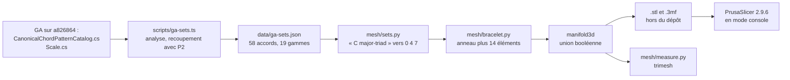

Le prototype 2 dessine un anneau de douze perles et allume celles que joue l'accord. Celui-ci demande si cet anneau peut quitter l'écran : un jonc de 65 mm, douze positions autour, une perle là où l'ensemble de GA a une note, une nervure là où il n'en a pas, et une quille sur do pour que le pouce trouve le haut sans compter. Rien n'a été imprimé — il n'y a pas d'imprimante ici — et la question devient donc plus étroite, mais elle reste honnête : **le maillage survit-il à tout ce que le logiciel d'une imprimante vérifie avant la première couche ?**


*Do majeur : perles sur do, mi et sol, nervures sur les neuf autres positions, et la quille de do face à l'objectif. Rendu par Blender 5.2.2 depuis le `.stl` exporté.*

Code : [`code/ga-protos/p5-printable-bracelets`](https://github.com/spareilleux/learn/tree/b171d57/code/ga-protos/p5-printable-bracelets). Les classes de hauteur viennent de [`scripts/ga-sets.ts`](https://github.com/spareilleux/learn/blob/b171d57/code/ga-protos/p5-printable-bracelets/scripts/ga-sets.ts), la géométrie de [`mesh/bracelet.py`](https://github.com/spareilleux/learn/blob/b171d57/code/ga-protos/p5-printable-bracelets/mesh/bracelet.py), et tous les chiffres ci-dessous de [`mesh/measure.py`](https://github.com/spareilleux/learn/blob/b171d57/code/ga-protos/p5-printable-bracelets/mesh/measure.py) et [`mesh/slice.py`](https://github.com/spareilleux/learn/blob/b171d57/code/ga-protos/p5-printable-bracelets/mesh/slice.py). Les fichiers `.stl` et `.3mf` ne sont pas dans le dépôt : ils sont écrits dans un dossier à l'extérieur, parce que la série complète fait 91 fichiers et 15.5 Mo, plus 49 Mo de G-code, et que rien de tout cela n'est une source.

## Ce que vous savez déjà

Si vous avez déjà sérialisé un graphe d'objets, vous savez ce qu'est un fichier STL : la pire sérialisation possible. C'est une liste plate de triangles, chacun portant en entier les coordonnées de ses trois sommets. Pas de table de sommets, pas d'arête, aucune notion de quel triangle touche quel autre. Deux triangles sont voisins seulement parce que deux de leurs sommets ont, par hasard, les mêmes coordonnées flottantes. Tout ce qu'un modeleur solide sait d'une forme est jeté, et chaque outil en aval doit le redeviner.

D'où un vocabulaire de l'impression 3D qui parle de reconstruire une topologie à partir d'une soupe :

- **Étanche**, ou variété au sens des arêtes : chaque arête est partagée par exactement deux triangles. Aucun trou.
- **Orientation cohérente** : tous les triangles s'accordent sur le côté qui est l'extérieur. Un solide dont les normales se contredisent n'a pas d'intérieur.
- **Variété** (*manifold*) : étanche, orienté de façon cohérente, et aucune arête partagée par trois triangles ou plus.
- **Auto-intersection** : des triangles qui se traversent. Un maillage peut être parfaitement étanche et n'avoir aucun sens.

L'autre moitié du vocabulaire appartient à l'imprimante. L'objet est construit couche de 0.2 mm par couche de 0.2 mm, depuis le plateau vers le haut, chaque couche posée sur la précédente. Une face trop penchée n'a rien sous elle : c'est un **porte-à-faux**, mesuré ici par la **pente** de la face, l'angle entre la face et le plan horizontal, qui est [la convention de PrusaSlicer pour son seuil de supports](https://help.prusa3d.com/article/support-material_1698). Une paroi verticale est à 90 degrés et ne coûte rien ; un plafond tourné vers le plateau est à 0 degré et demande un échafaudage imprimé dessous, puis cassé.

Rien dans le prototype n'est en C# ni en Java : c'est du Python, parce que [trimesh](https://trimesh.org/) et [manifold3d](https://github.com/elalish/manifold) y sont, et un peu de Node.js, parce que le catalogue de GA était déjà analysé pour le prototype 2 et qu'il n'y avait aucune raison de l'analyser deux fois.

## La chaîne



## D'où viennent les douze positions

Le bracelet ne vaut la peine d'être imprimé que s'il est juste ; les classes de hauteur sont donc lues dans GA plutôt que tapées à la main. [`scripts/ga-sets.ts`](https://github.com/spareilleux/learn/blob/b171d57/code/ga-protos/p5-printable-bracelets/scripts/ga-sets.ts) lance `git show` sur un clone de GA épinglé sur `a826864` et analyse deux fichiers :

- [`CanonicalChordPatternCatalog.cs`](https://github.com/GuitarAlchemist/ga/blob/a826864f3a012cad88e415954bf57eca0ce12aa6/Common/GA.Domain.Core/Theory/Harmony/CanonicalChordPatternCatalog.cs#L45-L112), 58 motifs d'accords, chacun une liste d'intervalles relatifs à la fondamentale ;
- [`Scale.cs`](https://github.com/GuitarAlchemist/ga/blob/a826864f3a012cad88e415954bf57eca0ce12aa6/Common/GA.Domain.Core/Theory/Tonal/Scales/Scale.cs#L53-L75), 19 gammes nommées, écrites là-bas en noms de notes : `Scale.Major` est la chaîne `"C D E F G A B"`.

Le résultat est [`data/ga-sets.json`](https://github.com/spareilleux/learn/blob/b171d57/code/ga-protos/p5-printable-bracelets/data/ga-sets.json), avec le SHA-256 de chaque blob lu. Trois garde-fous le protègent, et les trois tournent dans la CI, où il n'y a pas de clone de GA :

1. chacune des 13 qualités portées par le prototype 2 doit avoir exactement les mêmes intervalles et la même priorité ici — la même table `QUALITIES` est importée, pas recopiée ;
2. chaque ensemble doit être trié, sans doublon, fondé sur 0 et compris entre 0 et 11 ;
3. `Scale.Major` doit sortir en 0 2 4 5 7 9 11.

### Le serveur de GA contredit les sources de GA

Les fichiers sont une source ; le serveur en est une autre. Interrogé par les outils MCP de GA le 2026-09-17, l'analyseur d'accords en service a répondu :

| Question | Réponse de GA | Ce que dit le fichier de catalogue de GA |
|---|---|---|
| `get_scale_notes('C major')` | 0 2 4 5 7 9 11 | pareil |
| `get_scale_notes('A minor')` | 9 11 0 2 4 5 7 | pareil |
| `ga_chord_to_set('Cmaj7')` | do mi sol si | pareil |
| `ga_chord_to_set('Cdim7')` | do mi bémol fa dièse si bémol, Forte 4-27 | `diminished-7` vaut 0 3 6 9, Forte 4-28 |
| `ga_chord_to_set('Cm7b5')` | do mi bémol sol si bémol, Forte 4-26 | `half-diminished-7` vaut 0 3 6 10 |

`ga_parse_chord('Cdim7')` renvoie la qualité `diminished` avec le composant `ext:7` : la septième est donc ajoutée comme une septième mineure et non comme une septième diminuée, et le `b5` de `Cm7b5` est purement et simplement perdu. Deux des treize bracelets auraient leurs perles aux mauvais endroits s'ils avaient été construits depuis le chatbot plutôt que depuis le catalogue. L'échange complet est dans [`results/ga-check.json`](https://github.com/spareilleux/learn/blob/b171d57/code/ga-protos/p5-printable-bracelets/results/ga-check.json) ; c'est exactement le genre de chose pour laquelle ce laboratoire existe, et c'est noté dans le journal du cours, à l'auteur de décider s'il en fait un ticket.

### L'anneau se lit comme à l'écran

La position `pc` se trouve à `angle = pi/2 - pc * pi/6` : do en haut, le reste dans le sens des aiguilles d'une montre, exactement la formule du [`scene.ts`](https://github.com/spareilleux/learn/blob/b171d57/code/ga-protos/p2-chord-universe/src/app/scene.ts) du prototype 2 et du diagramme de [la leçon 2 du cours de théorie musicale](../../music-theory-ga/02-scales-and-modes/). Un test unitaire vérifie la formule, et trois autres vérifient que do est à 90 degrés, que fa dièse lui fait face à 270, et que chaque écart vaut 30 degrés.


*Vu de dessus : do à midi avec sa quille, mi à quatre heures, sol à huit heures.*

## L'objet

| Paramètre | Valeur |
|---|---|
| Diamètre intérieur | 65.0 mm |
| Paroi de l'anneau | 2.0 mm |
| Hauteur de l'anneau | 12.0 mm |
| Diamètre extérieur | 69.0 mm |
| Segments par cercle | 192 |
| Perle, note présente dans l'ensemble | cône, rayon de base 3.0 mm, hauteur 3.0 mm, enfoncé de 0.4 mm dans la paroi |
| Nervure, pas de note | 1.2 mm de large, 0.8 mm de saillie, toute la hauteur |
| Quille, classe de hauteur 0 | 2.5 mm de large, 1.6 mm de saillie, toute la hauteur |

Quatorze pièces sont construites le long de l'axe +X puis tournées sur leur position, avant d'être fusionnées. L'anneau est un `trimesh.creation.annulus`, le cône un `trimesh.creation.cone` couché sur le flanc, les nervures des boîtes, et la quille un profil extrudé avec [Shapely](https://shapely.readthedocs.io/). La fusion est tout l'enjeu :

```python
def solid(self) -> trimesh.Trimesh:
    """The boolean union, computed by manifold3d."""
    return trimesh.boolean.union([p.copy() for p in self.parts], engine="manifold")
```

L'alternative, que font quantité de scripts sur Internet, est d'écrire les quatorze pièces dans un seul fichier et d'appeler ça un modèle :

```python
def naive(self) -> trimesh.Trimesh:
    """Every part in one file, with no boolean at all: what a script without a CSG engine writes."""
    return trimesh.util.concatenate([p.copy() for p in self.parts])
```

Les deux ont été construits et mesurés. Ce qui est arrivé n'est pas ce qui avait été prédit.

## Les hypothèses, commitées d'abord

[`results/hypotheses.md`](https://github.com/spareilleux/learn/blob/8a2ed53/code/ga-protos/p5-printable-bracelets/results/hypotheses.md) a été commité dans [`8a2ed53`](https://github.com/spareilleux/learn/commit/8a2ed53), avant que `mesh/build.py`, `mesh/measure.py` ou `mesh/slice.py` n'existent. Douze prédictions, H1 à H12. Les verdicts sont à la fin de cette leçon ; quatre sont fausses.

## Ce que dit le maillage

Tous les chiffres ci-dessous viennent de [`results/measurements.json`](https://github.com/spareilleux/learn/blob/b171d57/code/ga-protos/p5-printable-bracelets/results/measurements.json), 31 solides construits et mesurés en **5.95 s** sur Python 3.14.2, trimesh 5.1.0, Windows 11. Aucun GPU n'intervient à aucun moment.

### Topologie

| | union, perles coniques | union, perles sphériques | pièces concaténées |
|---|---|---|---|
| Étanche | oui | oui | **oui** |
| Orientation cohérente | oui | oui | oui |
| Corps connexes | 1 | 1 | **14** |
| Caractéristique d'Euler | 0 | 0 | 26 |
| Verdict de manifold3d | NoError | NoError | **NoError** |
| Triangles | 2 386 | 5 474 | 2 040 |
| Volume | 5.2473 cm3 | 5.3761 cm3 | **5.3829 cm3** |

Une caractéristique d'Euler de 0, c'est la signature d'un jonc : un solide de genre 1, un tore avec des bosses. Le fichier concaténé obtient 26 parce qu'il est fait de quatorze solides fermés distincts, treize de genre 0 et un de genre 1, qui se chevauchent dans l'espace mais ne se touchent nulle part dans les données.

Et voici la première surprise. **H2 prédisait que le maillage concaténé échouerait au test d'étanchéité. Il le passe.** Chaque pièce est fermée sur elle-même, donc chaque arête a toujours exactement deux triangles, et trimesh comme manifold3d le déclarent bon. « Étanche » est une affirmation sur des arêtes, pas sur des solides. Ce que coûte vraiment le fichier concaténé, c'est tout ce qui, en aval, le croit :

- son volume est trop grand de 2.6 %, parce que les pièces comptent leurs recouvrements deux fois : 5.3829 cm3 au lieu de 5.2473 ;
- sa surface est trop grande de 10.8 %, 68.13 cm2 au lieu de 61.48 ;
- et la mesure d'épaisseur de paroi, ci-dessous, donne **1.40 mm** au lieu de 2.00, parce que les faces intérieures enterrées des nervures sont de vraies surfaces posées à l'intérieur de l'anneau. Avec des perles sphériques, elle donne 0.0488 mm.

### Le poignet passe-t-il encore

Des rayons sont tirés vers l'extérieur depuis 2 000 points situés à l'intérieur de la paroi ; l'endroit où chacun quitte le solide donne l'épaisseur à cet endroit. L'alésage est mesuré comme la plus petite distance de l'axe à un point quelconque de la surface, qui sur un polygone à 192 côtés se trouve au milieu d'une arête, jamais sur un sommet.

| | perles coniques | perles sphériques |
|---|---|---|
| Diamètre intérieur | **64.9913 mm** | **63.0287 mm** |
| Perdu par la facettisation | 0.0044 mm | 0.986 mm |
| Paroi, minimum | 1.9954 mm | 1.9954 mm |
| Paroi, médiane | 1.9968 mm | 1.9969 mm |


*La variante rejetée, avec des perles sphériques. De l'extérieur elle paraît correcte ; le millimètre de chaque sphère qui dépasse dans l'alésage est de l'autre côté de la paroi.*

La facettisation coûte 4.4 micromètres de rayon, une cinquantaine de fois moins que la tolérance d'une imprimante grand public. La deuxième colonne est le deuxième échec : **une sphère de 3.0 mm de rayon centrée sur la surface extérieure d'une paroi de 2.0 mm ressort de 1.0 mm dans l'alésage.** Trois perles deviennent trois bosses à l'intérieur du bracelet, et l'alésage perd 1.96 mm. C'est exactement la perle que le prototype 2 dessine à l'écran, là où une perle n'a aucune épaisseur à entamer, transplantée sans réfléchir dans un objet qui en a une. La leçon n'est pas que les sphères sont mauvaises : c'est qu'une forme qui se lit bien dans un moteur de rendu n'a aucun avis sur la paroi qui la porte.

### Porte-à-faux

Les faces sont regroupées par pente ; celles qui reposent sur le plateau sont exclues, puisqu'elles ne surplombent rien.

| | perles coniques | perles sphériques |
|---|---|---|
| Pire pente, hors plateau | **45.0 degrés** | **4.87 degrés** |
| Surface sous 45 degrés | 0.0000 cm2 | 0.2163 cm2 |
| Part de la surface | 0.00 % | 0.35 % |

Un cône dont la hauteur égale le rayon de base présente 45 degrés partout, exactement le seuil, et ne coûte donc rien. La moitié inférieure de la sphère devient presque plate : 4.87 degrés, c'est un plafond. Les supports n'y sont pas facultatifs, et le slicer le confirme plus bas.

**H6 prédisait que 3 % à 8 % de la surface demanderait des supports avec des perles sphériques ; la réponse est 0.35 %.** La prédiction était dix fois trop haute — trois petites sphères sur un objet de 62 cm2, cela ne fait tout simplement pas beaucoup de surface. La direction était bonne, le chiffre non, et cela mérite d'être dit franchement : « il faut des supports » et « 3 % de la surface » sont deux affirmations différentes, et seule la première a tenu.

### La quille, trois fois

Le repère sur do a connu trois formes, et [`results/keel-sweep.json`](https://github.com/spareilleux/learn/blob/b171d57/code/ga-protos/p5-printable-bracelets/results/keel-sweep.json) les contient toutes les trois.

| Hauteur de rampe | Pire pente | Surface à supporter | Saillie à 0.5 mm | à 1 mm | à 2 mm | à mi-hauteur |
|---|---|---|---|---|---|---|
| 1.6 mm | 36.03 degrés | 0.0498 cm2 | 0.0875 mm | 0.775 mm | 1.6 mm | 2.6 mm |
| 2.2 mm | 45.0 degrés | 0.0000 cm2 | 0.0 mm | 0.4 mm | 1.4 mm | 2.6 mm |
| aucune | 45.04 degrés | 0.0000 cm2 | **1.6 mm** | **1.6 mm** | **1.6 mm** | 2.6 mm |

Le fichier d'hypothèses décrit la quille comme « chanfreinée à 45 degrés en haut et en bas ». Le code a construit une rampe de 1.6 mm de haut sur 2.2 mm de profondeur, soit 36 degrés, sous le seuil et demandant des supports — une intention de conception que l'implémentation n'a pas respectée, et que seule la mesure a rattrapée. Faire une vraie rampe à 45 degrés a supprimé le porte-à-faux et coûté sa profondeur au repère : à 1 mm au-dessus du plateau, la quille ne saillait plus que de 0.4 mm, moitié moins qu'une nervure ordinaire, et l'élément censé se trouver au toucher avait disparu exactement là où se pose un pouce.

La troisième ligne est la réponse, et elle est un peu gênante : un élément vertical sur une paroi verticale, imprimé l'axe du jonc vers le haut, **ne surplombe rien du tout**. Sa face inférieure, c'est le plateau, et sa face supérieure regarde le ciel. La rampe résolvait un problème qui n'existait pas, et le porte-à-faux à 36 degrés comme la profondeur perdue étaient auto-infligés. Les nervures, de simples boîtes sans la moindre rampe, annonçaient zéro surface en porte-à-faux depuis le début.

## Ce que dit le slicer

Il n'y avait pas de slicer sur cette machine au moment où les hypothèses ont été écrites, et H11 le disait. [PrusaSlicer 2.9.6](https://github.com/prusa3d/PrusaSlicer/releases/tag/version_2.9.6) a ensuite été téléchargé dans sa version portable pour Windows (106.6 Mo, [AGPL-3.0](https://github.com/prusa3d/PrusaSlicer/blob/master/LICENSE)) et lancé en mode console, tout le profil écrit sur la ligne de commande pour que rien ne dépende d'une configuration réglée par quelqu'un dans une fenêtre :

```bash
prusa-slicer-console.exe --export-gcode \
  --nozzle-diameter 0.4 --filament-diameter 1.75 --filament-density 1.24 \
  --layer-height 0.2 --first-layer-height 0.2 --perimeters 3 \
  --top-solid-layers 4 --bottom-solid-layers 4 --fill-density 15% --fill-pattern gyroid \
  --temperature 215 --bed-temperature 60 --support-material-threshold 45 \
  --skirts 1 --bed-shape 0x0,250x0,250x210,0x210 --gcode-flavor marlin2 \
  --output out.gcode bracelet.stl
```

Il a découpé chaque fichier sans une plainte, et n'a imprimé aucun message de réparation pour aucun d'eux. Soixante couches chacun.

| Objet | Filament | Volume | Temps |
|---|---|---|---|
| Anneau nu, sans éléments | 6.15 g | 4.96 cm3 | 26 min 43 s |
| Accord parfait de do, perles coniques | 6.42 g | 5.18 cm3 | 35 min 40 s |
| Gamme de do majeur, perles coniques | 6.47 g | 5.22 cm3 | 39 min 56 s |
| Accord parfait de do, perles sphériques | 6.60 g | — | 37 min 31 s |
| le même, supports activés | 6.81 g | — | 39 min 07 s |
| Gamme de do majeur, perles sphériques | 6.90 g | — | 45 min 58 s |
| la même, supports activés | 7.47 g | — | 49 min 33 s |


*La gamme de do majeur : sept perles, cinq nervures. C'est le plus lourd et le plus long de la série, 6.47 g et 39 min 56 s. Un la mineur naturel produit exactement cet objet, et c'est bien le but.*

Les treize bracelets d'accords tombent tous entre 6.42 et 6.44 g et entre 35 min 16 s et 37 min 10 s : les perles et les nervures sont une erreur d'arrondi à côté de l'anneau. Les supports coûtent 0.21 g et 1 min 36 s pour un accord parfait, 0.57 g et 3 min 35 s pour une gamme de sept notes — peu de chose, mais il faut aussi les casser à la main sur douze éléments en relief, et c'est là le vrai prix.

Le volume de filament reste environ 1.3 % en dessous du volume du maillage, même à 15 % de remplissage, parce qu'une paroi de 2.0 mm avec trois périmètres de 0.45 mm de chaque côté est pleine de part en part : il n'y a presque aucun remplissage dans cet objet.

**H11 demandait 6.0 à 7.5 g et 25 à 50 minutes. Les deux ont tenu.** Le reste de H11, non.

### Le slicer se moque de vos quatorze corps

H11 prédisait aussi que PrusaSlicer réparerait au moins une erreur dans le maillage concaténé. Il n'a rien signalé, et l'a découpé en **6.42 g et 36 min 34 s** contre **6.42 g et 35 min 40 s** pour l'union — 2 154.16 mm de filament contre 2 154.05, un écart de 0.005 %. Un slicer moderne fusionne les solides fermés qui se chevauchent dans son propre découpage : quatorze corps qui s'interpénètrent sont pour lui un seul objet.

Cela mérite d'être formulé avec soin, parce que c'est l'inverse du conseil habituel. Le danger du maillage non fusionné, ce n'est pas le slicer. C'est tout le reste : le volume et la masse que vous annoncez, l'épaisseur de paroi que vous mesurez, un slicer résine ou un service d'impression en ligne plus stricts, un import CAO, un outil de réparation de maillage qui « corrige » les intersections en supprimant de la géométrie, et quiconque ouvre le fichier en s'attendant à un seul objet. L'union reste la bonne chose à faire — ce n'est simplement pas le slicer qui vous le dira.

### La seule vérification que seul le slicer fait

H12 prédisait que le slicer trouverait des éléments qui ne tiennent pas dans un nombre entier d'extrusions. C'est le cas, et le G-code le dit : PrusaSlicer écrit un commentaire `;WIDTH:` chaque fois qu'il change de largeur d'extrusion.

| Objet | Largeurs distinctes | Plage | Hors du nominal 0.45 mm |
|---|---|---|---|
| Anneau nu | 18 | 0.371 à 0.572 mm | 17 |
| Accord parfait de do, perles coniques | 173 | 0.358 à 0.667 mm | 141 |
| Gamme de do majeur, perles coniques | 185 | 0.357 à 0.662 mm | 151 |

Le témoin compte : l'anneau sans le moindre élément a déjà besoin de 18 largeurs différentes, parce qu'une paroi courbe de 2.0 mm n'est pas non plus un nombre entier de cordons de 0.45 mm. Les éléments multiplient cela par dix. Rien n'est cassé ici — les périmètres à largeur variable de PrusaSlicer s'en chargent — mais aucune mesure géométrique du maillage n'aurait pu prédire un seul de ces nombres. **H12 a tenu, avec la réserve que l'expérience témoin montre que l'effet n'est pas seulement la faute des nervures.**

## Verdict face aux hypothèses

| | Prédiction | Résultat | |
|---|---|---|---|
| H1 | l'union est étanche, un seul corps, Euler 0, du premier coup, pour les deux formes de perles et les 13 qualités | 30 solides sur 30, étanches, orientés de façon cohérente, un corps, Euler 0, manifold3d NoError | tenue |
| H2 | les pièces concaténées ne sont pas étanches | elles le sont, et manifold3d les accepte : 14 corps, volume 2.6 % trop grand, paroi lue à 1.40 mm | **fausse** |
| H3 | volume 5.2 à 5.6 cm3, masse PLA 6.4 à 7.0 g | 5.2473 cm3, 6.507 g | tenue |
| H4 | diamètre intérieur d'au moins 64.98 mm, facettisation sous 0.02 mm | 64.9913 mm, 0.0044 mm — mais 63.0287 mm avec des perles sphériques | tenue pour la version livrée, et la variante sphérique est un échec publié |
| H5 | parois d'au moins 1.99 mm, anneau à 2.00 plus ou moins 0.01 | minimum 1.9954 mm, médiane 1.9968 mm | tenue |
| H6 | perles sphériques : 3 % à 8 % de la surface à supporter | 0.35 %, pire pente 4.87 degrés | **fausse en ordre de grandeur**, juste sur la nécessité des supports |
| H7 | perles coniques : sous 0.5 %, pire porte-à-faux à 45 degrés ou moins | 0.00 %, pire pente 45.0 degrés — après correction de la quille ; la première construction mesurait 36.03 degrés | tenue après une correction que l'hypothèse n'avait pas prévue |
| H8 | moins de 60 000 triangles, STL sous 3 Mo | 2 386 triangles et 119 Ko pour un accord parfait ; 10 354 et 518 Ko au pire | tenue |
| H9 | 13 bracelets, les deux formes, mesurés et écrits, en moins de 60 s | 31 solides en 5.95 s | tenue |
| H10 | le catalogue de GA s'accorde avec le portage de P2 ; `Scale.Major` vaut 0 2 4 5 7 9 11 ; les angles suivent P2 | les trois, vérifiés dans la CI | tenue |
| H11 | pas de slicer ; s'il y en a un, 0 réparation pour l'union et au moins 1 pour la concaténation, 6.0 à 7.5 g, 25 à 50 min | un slicer a été trouvé ; 6.42 g et 35 min 40 s ; **0 réparation pour les deux**, et la concaténation donne les mêmes grammes | grammes et minutes tenus, la prédiction sur les réparations est **fausse** |
| H12 | au moins un élément trop fin pour un nombre entier d'extrusions | 173 largeurs d'extrusion distinctes, 141 hors nominal — mais l'anneau nu en demande déjà 18 | tenue, avec une réserve que l'hypothèse avait ratée |

## Ce qui a échoué

- **La perle sphérique a mangé le bracelet.** La perle du prototype 2, posée sur une paroi de 2 mm, ressort de 1 mm dans l'alésage et lui retire 1.96 mm de diamètre. Les deux variantes sont toujours construites et toujours mesurées, et le contrôle de CI vérifie que l'échec reste reproductible, pour que la leçon ne cite pas un fantôme.
- **Le chanfrein de la quille faisait 36 degrés, pas les 45 annoncés dans les hypothèses.** Personne ne l'avait vu avant que `min_slope_deg` n'affiche 36.027. Puis la correction a coûté en lisibilité, et la vraie réponse était de supprimer l'élément qui causait les deux problèmes.
- **H2 se trompait sur le sens d'« étanche ».** C'est une propriété des arêtes. Quatorze solides qui partagent une boîte englobante la vérifient.
- **Le slicer a refusé d'être choqué.** Il a découpé le maillage non fusionné aux mêmes grammes que l'union, sans rien dire. L'argument en faveur de vraies opérations booléennes doit se construire ailleurs.
- **H6 s'est trompée d'un ordre de grandeur.** Prédire un pourcentage de surface sans faire le calcul d'abord, c'est deviner.

## Ce que seule une imprimante peut dire, et qui reste *à vérifier*

Tout ce qui précède est de la géométrie et du G-code. Rien n'a été imprimé, et voici les questions qui restent ouvertes :

- si un alésage de 65 mm va réellement au poignet visé, et s'il devrait faire 63 ou 68 — la taille d'un jonc est une mesure de corps, pas une propriété de maillage (*à vérifier*) ;
- si les nervures de 1.2 mm et la quille de 2.5 mm se distinguent au toucher une fois imprimées en couches de 0.2 mm, avec les largeurs d'extrusion ci-dessus (*à vérifier*) ;
- si le dessous à 45 degrés des perles coniques s'imprime proprement ou s'affaisse, puisque 45 degrés est exactement le seuil et qu'une vraie imprimante n'est pas exactement à ses réglages nominaux (*à vérifier*) ;
- si un anneau de PLA de 2.0 mm et de 12 mm de haut survit au passage forcé sur une main, ou casse — un anneau de PLA de 2 mm n'est pas manifestement assez solide, et aucune simulation ici n'en dit quoi que ce soit (*à vérifier*) ;
- si les 8 triangles dégénérés, d'aire nulle, que manifold3d laisse dans les unions coniques dérangent un autre slicer. PrusaSlicer n'en a pas parlé (*à vérifier*).

## À vous de l'exécuter

```bash
cd code/ga-protos/p5-printable-bracelets
npm run sets                                    # check the committed GA sets against P2's port
npm test                                        # the Node.js side
python -m pip install -r requirements.txt
python -m unittest discover -s tests -t . -v    # 14 tests: order, bore, walls, overhangs, readability
python mesh/run.py --suite --band --bead both --naive \
  --out /somewhere/outside/the/repo --results results/measurements.json
python mesh/keel_sweep.py --results results/keel-sweep.json
python mesh/check_ci.py --results results/measurements.json
```

Avec un slicer, ajoutez son chemin ; sans, le script le dit et tous les chiffres du slicer restent *à vérifier* :

```bash
python mesh/slice.py --slicer /path/to/prusa-slicer-console --out /somewhere/gcode \
  --results results/slicer.json /somewhere/outside/the/repo/*-cone.stl
```

Les images demandent Blender, et seulement les images :

```bash
blender --background --python mesh/render.py -- \
  --stl /somewhere/C-major-triad-cone.stl --out shot.png --view three-quarter
python mesh/shrink.py shot.png --colors 128
```

Le job de CI `p5-printable-bracelets` exécute tout sauf le slicer et Blender, sur Ubuntu, Windows et macOS.

## Points clés

- « Étanche » est une affirmation sur des arêtes, pas sur des solides. Quatorze pièces fermées qui s'interpénètrent passent tous les tests d'étanchéité, et celui de manifold3d aussi, tout en se trompant de 2.6 % sur le volume et de 30 % sur l'épaisseur de paroi.
- Faites quand même l'union — mais sachez pourquoi. Le slicer ne vous en remerciera pas : il a découpé les deux maillages à 6.42 g. Tout le reste en aval, si.
- Une forme qui se lit bien à l'écran n'a aucun avis sur la paroi qui la porte. Une perle de 3 mm sur une paroi de 2 mm coûte 2 mm d'alésage.
- L'orientation d'impression décide des éléments qui sont gratuits. Le jonc posé l'axe vers le haut, chaque nervure verticale est gratuite et chaque rampe ajoutée est un problème que vous avez inventé.
- Écrivez l'intention du dessin en chiffres, puis mesurez ces chiffres. « Chanfreiné à 45 degrés » était dans les hypothèses et 36 degrés dans le code.
- Les pourcentages de surface ne sont pas intuitifs. Prédisez-les en calculant une aire, ou ne les prédisez pas.
- Épinglez les données. Les fichiers de catalogue de GA et son analyseur d'accords en service ne disent pas la même chose de `dim7` et de `m7b5` ; un bracelet construit depuis le second serait faux, et seule une source épinglée et vérifiée le garde juste.

## Exercices

1. Le volume analytique de l'anneau est `pi * (34.5^2 - 32.5^2) * 12`. Calculez-le, comparez aux 5.0508 cm3 annoncés par le maillage, et dites d'où vient la différence et dans quel sens.
2. L'alésage est mesuré comme la plus petite distance de l'axe à la surface, pas à un sommet. Pour un polygone régulier à 192 côtés inscrit dans un cercle de 32.5 mm de rayon, de combien la distance au milieu d'une arête est-elle plus petite ? Vérifiez face aux 0.0044 mm du tableau, et dites combien de segments il faudrait pour que la perte atteigne 0.05 mm.
3. Douze positions séparées de 30 degrés. Au rayon extérieur, quelle distance sépare deux centres de perles voisins, et jusqu'à quelle taille une perle pourrait-elle grossir avant que deux d'entre elles ne se touchent ?
4. Un cône dont la hauteur égale le rayon de base a une pire pente d'exactement 45 degrés. Quelle pente aurait une demi-sphère de même rayon de base, et quelle pente a un cône de 3 mm de rayon de base et 4.5 mm de haut ? Lequel imprimeriez-vous, et pourquoi aucun des deux n'est peut-être la bonne réponse ?
5. `Scale.Augmented` de GA est la chaîne `"C D# E G G# B"`. Trouvez ses classes de hauteur, puis dites à quoi ressemble le bracelet quand on le tourne de quatre positions, et ce que cela dit de la gamme.
6. Le maillage non fusionné annonce une épaisseur de paroi minimale de 1.40 mm avec des perles coniques et de 0.0488 mm avec des sphériques. Expliquez les deux nombres à partir de la géométrie.

<details>
<summary>Solution 1</summary>

`pi * (1190.25 - 1056.25) * 12 = pi * 134 * 12 = 5050.9 mm3`, soit 5.0509 cm3. Le maillage annonce 5.0508 cm3, une part sur cinquante mille en dessous. Le maillage est plus bas parce que les cercles sont des polygones inscrits à 192 côtés, légèrement plus petits que les cercles qui les contiennent. L'aire d'un polygone régulier inscrit vaut `(N / 2 pi) * sin(2 pi / N)` fois celle du cercle, environ `1 - 6.58 / N^2` ; à N = 192, le cercle intérieur comme l'extérieur rétrécissent de 1.8 parties sur 100 000, l'anneau entre les deux rétrécit du même facteur, et le volume avec lui.

</details>

<details>
<summary>Solution 2</summary>

La distance au milieu d'une arête vaut `R * cos(pi / N)`, donc la perte est `R * (1 - cos(pi / N))`. Avec R = 32.5 mm et N = 192 : `cos(0.9375 degrés) = 0.99986612`, donc la perte est `32.5 * 1.338e-4 = 0.00435 mm`, ce qui est bien les 0.0044 mm du tableau, et le diamètre vaut `65 - 2 * 0.00435 = 64.9913 mm`.

Pour une perte de 0.05 mm, résolvez `32.5 * (1 - cos(pi/N)) = 0.05`, d'où `cos(pi/N) = 0.9984615`, `pi/N = 0.055475` radian, `N = 56.6`. Tout cercle tracé avec 57 segments ou plus garde donc la facettisation sous 0.05 mm, et 192 est généreux : la raison de les utiliser est la douceur de l'ombrage, pas l'ajustement.

</details>

<details>
<summary>Solution 3</summary>

Le rayon extérieur vaut 34.5 mm et 30 degrés font `pi/6` radian, donc l'arc entre deux centres mesure `34.5 * pi / 6 = 18.06 mm`, et la distance en ligne droite `2 * 34.5 * sin(15 degrés) = 17.86 mm`. Deux perles de rayon de base `r` se touchent quand `2r` atteint cette valeur, soit `r = 8.9 mm` — près de trois fois les 3.0 mm employés. Bien avant cela, une perle de rayon `r` centrée sur la surface extérieure atteint `34.5 - r` vers l'intérieur ; elle perce dans l'alésage dès que `r` dépasse la paroi de 2.0 mm, ce qui est précisément l'échec que montre la sphère de 3.0 mm. Sur cet anneau, la contrainte qui mord est la paroi, pas l'espacement.

</details>

<details>
<summary>Solution 4</summary>

La surface d'une demi-sphère est verticale à sa base et horizontale à son pôle : quelque part sur elle, la pente prend toutes les valeurs de 90 à 0 degré, sa pire pente est donc 0, un plafond, et c'est pourquoi la perle sphérique mesure 4.87 degrés une fois le maillage facetté. Un cône de 3 mm de rayon de base et 4.5 mm de haut est plus raide que 45 degrés : sa surface fait `atan(4.5 / 3) = 56.3` degrés avec le plan de base, donc son dessous a une pente de 56.3 degrés, confortablement au-dessus du seuil et meilleure que le cône à 45 degrés, qui est posé pile dessus.

Aucun des deux n'est peut-être le bon, parce que les deux sont pointus. Un cône qui dépasse de 2.6 à 4.5 mm d'un bracelet est une pointe contre le poignet et s'accroche aux manches. Une meilleure réponse est probablement un cône tronqué, ou un demi-cylindre d'axe vertical dont le haut et le bas sont coupés à 45 degrés — ce qu'est devenue la quille, moins les rampes.

</details>

<details>
<summary>Solution 5</summary>

Do vaut 0, ré dièse 3, mi 4, sol 7, sol dièse 8 et si 11, donc l'ensemble est 0 3 4 7 8 11. Ajoutez 4 à chacun et réduisez modulo 12 : 4 7 8 11 0 3, les mêmes six notes. Ajoutez 8 : 8 11 0 3 4 7, les mêmes encore. La gamme augmentée se retrouve sur elle-même quand on la tourne de quatre ou de huit positions ; le bracelet a donc une symétrie d'ordre trois et son image ne peut pas dire laquelle de do, mi ou la bémol est la fondamentale — la même propriété que le prototype 2 note pour l'accord augmenté et la septième diminuée, et la raison pour laquelle une quille sur do n'est pas une décoration mais la seule chose qui dise où l'on se trouve.

</details>

<details>
<summary>Solution 6</summary>

Les rayons partent juste à l'intérieur de la surface intérieure et vont vers l'extérieur ; la mesure est la distance à la première surface rencontrée. Avec des perles coniques, les pièces qui pénètrent le plus loin sont les nervures, enfoncées de 0.6 mm dans la paroi. Dans le fichier concaténé, la face intérieure de la nervure est toujours là, un vrai triangle au rayon `34.5 - 0.6 = 33.9` : un rayon qui traverse une nervure s'y arrête, `33.9 - 32.5 = 1.40 mm`. Dans l'union cette face est intérieure et a été supprimée, le rayon continue donc jusqu'à la vraie surface extérieure à 34.5 et annonce 2.00.

Avec des perles sphériques, la surface de la sphère est elle-même dans l'alésage : une sphère de 3.0 mm de rayon centrée à 34.5 descend jusqu'à 31.5, soit en dessous du rayon intérieur de 32.5. Un rayon parti de 32.51 et dirigé vers l'extérieur à travers une perle quitte la sphère presque tout de suite, d'où les 0.0488 mm sur l'échantillon mesuré. Ce nombre n'est pas une paroi du tout ; c'est la mesure qui vous dit que la géométrie n'est pas celle que vous croyez.

</details>

## Sources

- GuitarAlchemist/ga sur `a826864` : [`CanonicalChordPatternCatalog.cs`](https://github.com/GuitarAlchemist/ga/blob/a826864f3a012cad88e415954bf57eca0ce12aa6/Common/GA.Domain.Core/Theory/Harmony/CanonicalChordPatternCatalog.cs#L45-L112), [`Scale.cs`](https://github.com/GuitarAlchemist/ga/blob/a826864f3a012cad88e415954bf57eca0ce12aa6/Common/GA.Domain.Core/Theory/Tonal/Scales/Scale.cs#L53-L75)
- [trimesh](https://trimesh.org/) 5.1.0 et son [`trimesh.boolean`](https://trimesh.org/trimesh.boolean.html), [manifold3d](https://github.com/elalish/manifold) 3.5.3, [Shapely](https://shapely.readthedocs.io/) 2.1.2, [NumPy](https://numpy.org/) 2.5.3, [SciPy](https://scipy.org/) 1.18.1
- [PrusaSlicer 2.9.6](https://github.com/prusa3d/PrusaSlicer/releases/tag/version_2.9.6), [AGPL-3.0](https://github.com/prusa3d/PrusaSlicer/blob/master/LICENSE) ; [interface en ligne de commande](https://help.prusa3d.com/article/command-line-interface_1937) et [supports](https://help.prusa3d.com/article/support-material_1698)
- [Blender](https://www.blender.org/) 5.2.2 LTS, utilisé seulement pour faire les images
- 3MF Consortium, [spécification du cœur de 3MF](https://github.com/3MFConsortium/spec_core), le format que STL aurait dû être
- Marco Attene, Marcel Campen et Leif Kobbelt, [« Polygon Mesh Repairing: An Application Perspective »](https://doi.org/10.1145/2431211.2431214), *ACM Computing Surveys* 45(2), 2013 : ce que veut dire « maillage cassé », et pourquoi l'étanchéité n'est qu'une des propriétés qui comptent
- Le prototype 2 de ce laboratoire, [Joue un accord, vois l'univers](02-chord-universe/), dont ce bracelet est fait
