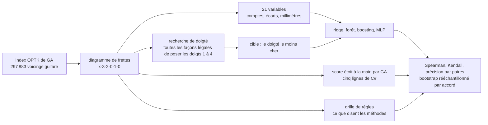

Demandez à Guitar Alchemist les voicings faciles d'un accord et il les trie avec un nombre, `DifficultyScore`, entre 1 et 10. Ce nombre, ce sont cinq lignes de C#. Ce prototype se demande si un petit modèle entraîné sur le processeur d'un portable peut faire mieux — et, d'abord, ce que « mieux » pourrait bien vouloir dire, puisque personne n'a étiqueté 297 883 voicings avec leur difficulté.

Tout tourne ici sur un seul cœur de CPU, sans GPU et sans autre dépendance que [Node.js](https://nodejs.org/). Le code est [`code/ga-protos/p7-playability`](https://github.com/spareilleux/learn/tree/main/code/ga-protos/p7-playability) et les douze prédictions chiffrées ont été [commitées](https://github.com/spareilleux/learn/blob/c6a9937/code/ga-protos/p7-playability/results/hypotheses.md) avant l'expérience. Quatre étaient fausses.

## Ce que vous savez déjà : un problème de classement sans étiquettes

Si vous avez utilisé [ML.NET](https://learn.microsoft.com/dotnet/machine-learning/), la moitié « modélisation » de cette leçon ne vous surprendra pas. Lire des variables sur chaque ligne, ajuster [`FastTreeRegressionTrainer`](https://learn.microsoft.com/dotnet/api/microsoft.ml.trainers.fasttree.fasttreeregressiontrainer) — des arbres boostés par gradient, la même famille que le modèle d'ici —, puis évaluer sur des lignes que le modèle n'a pas vues. Peu de données tabulaires, quelques centaines d'arbres, un CPU : c'est le bout ennuyeux et fiable de l'apprentissage automatique, et ça marche.

L'autre moitié est plus intéressante. Un modèle supervisé a besoin d'une colonne à prédire, et « à quel point ce voicing est-il dur à jouer » n'est une colonne de personne. GA a un avis, mais l'avis de GA est justement ce qu'on teste : entraîner un modèle sur le score de GA puis annoncer que le modèle est d'accord avec GA ne prouverait rien. L'essentiel de cette leçon consiste donc à construire une cible discutable, et à dire tout haut ce qu'elle vaut.



## Le coût de GA, lu ligne à ligne

Le score vit dans [`VoicingPhysicalAnalyzer.CalculatePlayability`](https://github.com/GuitarAlchemist/ga/blob/66bdd049ad3f4b10f996e4cc6a9c6e58797cf30e/Common/GA.Domain.Services/Fretboard/Voicings/Analysis/VoicingPhysicalAnalyzer.cs#L133-L142), au commit [`66bdd049`](https://github.com/GuitarAlchemist/ga/tree/66bdd049ad3f4b10f996e4cc6a9c6e58797cf30e) de GA, celui que P1 avait déjà épinglé :

```csharp
// Compute numeric difficulty score (1-10) using spanScore
var difficultyScore = 1.0;
if (barreRequired) difficultyScore += 2.0;

// Use logarithmic span score instead of raw fret count
difficultyScore += spanScore * 3.0; // max ~4.0 extra for wide stretch

if (layout.OpenStrings.Length == 0) difficultyScore += 1.0;
if (minimumFingers == 4) difficultyScore += 1.0;
difficultyScore = Math.Min(10.0, difficultyScore);
```

`spanScore` est la distance en millimètres entre la note frettée la plus basse et la plus haute, divisée par 80. Les millimètres sont réels : [`PhysicalFretboardCalculator`](https://github.com/GuitarAlchemist/ga/blob/66bdd049ad3f4b10f996e4cc6a9c6e58797cf30e/Common/GA.Domain.Services/Fretboard/Analysis/PhysicalFretboardCalculator.cs#L52-L58) place chaque frette à `scale * (1 - 2^(-fret/12))` sur un manche de 648 mm, si bien que le même écart de trois frettes coûte plus cher près du sillet qu'à la douzième case. Cette partie-là est juste, et ce prototype la réutilise.

Le reste de la formule est plus intéressant. [`ga-cost.mjs`](https://github.com/spareilleux/learn/blob/main/code/ga-protos/p7-playability/src/lib/ga-cost.mjs) la porte ligne à ligne en JavaScript, pour que les deux se comparent sur les mêmes lignes. Quatre choses tombent de ce portage, avant tout entraînement.

**L'indicateur de barré rate le barré le plus célèbre.** [`DetectBarreRequirement`](https://github.com/GuitarAlchemist/ga/blob/66bdd049ad3f4b10f996e4cc6a9c6e58797cf30e/Common/GA.Domain.Services/Fretboard/Voicings/Analysis/VoicingPhysicalAnalyzer.cs#L219-L233) cherche la même frette sur **trois cordes adjacentes**. Le barré de fa, `133211`, tient les cordes 1, 2 et 6 à la frette 1 — trois cordes, mais pas trois cordes adjacentes, puisque les cordes 3, 4 et 5 sont plus haut. `barreRequired` vaut faux, et l'accord que redoute tout débutant perd ses deux points. Le barré en forme de la, `x13331`, le déclenche bien, sur les trois cordes du milieu à la frette 3, là où c'est l'*annulaire* qui se pose d'habitude.

**« Nombre minimal de doigts » compte des frettes, pas des doigts.** `minimumFingers` vaut `Math.Min(uniqueFrets, 4)`, le nombre de positions frettées distinctes. Am (`x02210`) et Am7 (`x02010`) ont les deux mêmes frettes distinctes, donc GA leur donne le même 2.29, alors que l'un demande trois doigts et l'autre deux. La même égalité frappe E contre E7, G contre le G à quatre doigts, et D contre Dsus4.

**Un barré de fa complet et un petit fa sur quatre cordes obtiennent le même score.** `133211` et `xx3211` vont tous deux de la frette 1 à la frette 3, sans corde à vide et avec trois frettes distinctes, et aucun des deux ne déclenche l'indicateur de barré : les deux sortent à exactement 4.50. L'un est le mur de toutes les méthodes pour débutants ; l'autre est ce que les professeurs proposent à la place.

**L'étiquette et le nombre se contredisent.** La chaîne `Difficulty` se calcule elle aussi à partir de `spanScore`, avec une plage « Beginner » à `spanScore <= 0.8`, c'est-à-dire un écart d'au plus 64 mm. Les frettes 1 à 3 mesurent déjà 66.7 mm, si bien que l'accord de do à vide — `x32010`, le premier accord de la plupart des méthodes — ressort **Intermediate**. Pendant ce temps, un voicing que GA appelle « Advanced » peut porter un score dans le quart le plus facile de l'index, comme le montre la section des désaccords plus bas.

Rien de tout cela n'est un crime. Ce sont cinq lignes qui doivent répondre en microsecondes, à l'intérieur de [`VoicingFilterService`](https://github.com/GuitarAlchemist/ga/blob/66bdd049ad3f4b10f996e4cc6a9c6e58797cf30e/Apps/ga-server/GaApi/Services/VoicingFilterService.cs#L53-L70), qui filtre sur `DifficultyScore` et trie par lui. Mais la barre est basse, et le but de P7 est de mesurer à quel point.

## Une cible discutable

Le coût de GA n'attribue jamais de doigts. Il lit quatre nombres résumés sur le diagramme et les additionne. [`fingering.mjs`](https://github.com/spareilleux/learn/blob/main/code/ga-protos/p7-playability/src/lib/fingering.mjs) fait l'inverse : il énumère toutes les façons légales de poser les doigts 1 à 4 sur les notes frettées et garde la moins chère. C'est la forme classique du problème, du [« paradigme du chemin optimal »](https://doi.org/10.2307/3680014) de Sayegh en 1989 à la recherche par contraintes de [Radicioni et Lombardo](https://doi.org/10.1007/s10601-007-9015-y), avec la biomécanique de la difficulté guitaristique mesurée par [Heijink et Meulenbroek](https://doi.org/10.1080/00222890209601952).

Les règles sont courtes. Les numéros de doigts suivent les frettes : rien de ce que tient l'index ne se trouve au-dessus de ce que tient le majeur. Plusieurs notes sur une même frette peuvent partager un doigt — un barré, complet ou partiel, et *n'importe quel* doigt peut en faire un, ce que fait un guitariste avec l'annulaire dans une forme de la. Un barré est impossible quand une corde située entre ses extrémités est à vide, ou sonne sur une frette plus basse. Puis chaque placement est facturé :

| terme | coût |
|---|---|
| chaque doigt posé | 0.15 |
| l'auriculaire est utilisé | 0.20 |
| deux doigts serrés sur la même frette | 0.25 par paire |
| écart au-delà de ce que la paire de doigts couvre confortablement | 0.06 par millimètre |
| un doigt qui tient plusieurs cordes | 1.00, plus 0.35 par corde supplémentaire |
| ce barré est sur la frette 1 ou 2 | 0.80 |
| ce barré est fait par l'annulaire ou l'auriculaire | 0.60 |
| une corde étouffée à l'intérieur de l'accord | 0.90 chacune |
| une corde étouffée sous un barré | 0.80 chacune |
| la forme se situe au-dessus de la frette 15 | 0.50 |

Les écarts confortables sont de 42 mm entre les doigts 1 et 2, 34 mm entre 2 et 3, 30 mm entre 3 et 4, et les sommes de ceux-là pour les paires qui sautent un doigt. La géométrie — espacement des frettes, espacement des cordes à une frette donnée — est celle de GA.

**Chaque nombre de ce tableau est une constante que j'ai choisie.** Personne n'a joué une note pour les calibrer. Ce qui en fait une *cible* défendable plutôt qu'un second avis, c'est que c'est un objet d'une autre nature : une recherche combinatoire sur un modèle de main explicite, là où le score de GA est une somme fermée de quatre indicateurs. Elle connaît les doigts ; celui de GA non. Elle laisse aussi de côté de la vraie guitare : le pouce par-dessus le manche, une corde étouffée par la main gauche, une note tenue par deux doigts. Les formes qui en ont besoin ressortent plus chères qu'un guitariste ne les trouve, ou impossibles.

## Ce que vaut la cible

Trois vérifications, dont aucune n'est une preuve.

**Contre un jeu de paires classées à la main et déclaré.** [`results/annotations.json`](https://github.com/spareilleux/learn/blob/main/code/ga-protos/p7-playability/results/annotations.json) contient 32 jugements par paires sur des formes canoniques : laquelle des deux est la plus dure. Le fichier nomme son annotateur — le modèle de langage qui a écrit ce prototype, pas un guitariste — et énonce les règles que suivent les réponses : un accord à vide est plus facile qu'un barré, moins de doigts est plus facile, un écart plus petit est plus facile, une corde étouffée à l'intérieur de l'accord est plus dure, la même forme est plus dure à la première frette. Les paires indéfendables à partir de ces règles ont été écartées ; les discutables sont marquées et comptées à part.

| coût | les 25 paires à confiance élevée | les 32 paires |
|---|---|---|
| recherche de doigté (la cible) | 1.000 | 0.938 |
| score écrit à la main par GA | 0.880 | 0.781 |
| grille de règles | 0.760 | 0.688 |

Le score parfait de la cible n'est **pas** une preuve qu'elle a raison. La même tête a écrit le modèle de main et le protocole d'annotation à partir des mêmes règles écrites : cette ligne mesure une cohérence interne, rien d'autre. La ligne qui compte est celle de GA, parce qu'elle vient de quelqu'un d'autre : sur huit de ses trente-deux erreurs, GA renvoie une égalité exacte entre deux formes qu'une méthode sépare.

**Contre une grille qui n'est ni l'une ni l'autre.** [`rules.mjs`](https://github.com/spareilleux/learn/blob/main/code/ga-protos/p7-playability/src/lib/rules.mjs) transforme en points ce que les méthodes disent avec des mots — barré, écart, corde étouffée à l'intérieur, quatre doigts occupés, aucune corde à vide. Rien n'est entraîné dessus. Sur tout l'index, sa corrélation de rang vaut 0.445 avec la recherche et 0.785 avec le score de GA : la grille et GA sont d'accord parce que les deux comptent des indicateurs additifs, et les deux diffèrent d'une recherche qui pose des doigts.

**Contre elle-même, sur des formes que vous pouvez visualiser.** Voici les coûts des formes annotées, avec le score de GA et son étiquette à côté :

| forme | grille | recherche de doigté | GA | étiquette GA |
|---|---|---|---|---|
| Em | `0-2-2-0-0-0` | 0.55 | 1.00 | Beginner |
| Am | `x-0-2-2-1-0` | 0.70 | 2.29 | Beginner |
| Am7 | `x-0-2-0-1-0` | 0.30 | 2.29 | Beginner |
| C | `x-3-2-0-1-0` | 0.65 | 3.50 | Intermediate |
| Cmaj7 | `x-3-2-0-0-0` | 0.30 | 2.21 | Beginner |
| Cadd9 | `x-3-2-0-3-3` | 1.55 | 2.21 | Beginner |
| D | `x-x-0-2-3-2` | 0.73 | 2.21 | Beginner |
| G | `3-2-0-0-0-3` | 0.90 | 2.21 | Beginner |
| Fmaj7 | `x-x-3-2-1-0` | 0.65 | 3.50 | Intermediate |
| Fa, quatre cordes | `x-x-3-2-1-1` | 2.25 | 4.50 | Intermediate |
| Fa barré | `1-3-3-2-1-1` | 3.75 | 4.50 | Intermediate |
| La barré, frette 5 | `5-7-7-6-5-5` | 2.75 | 3.99 | Intermediate |
| Si♭ barré | `x-1-3-3-3-1` | 3.87 | 6.50 | Intermediate |
| grand écart | `x-x-7-9-8-11` | 3.00 | 6.35 | Intermediate |
| petit écart | `x-x-7-9-8-9` | 1.05 | 3.77 | Intermediate |

La recherche place le barré de fa au-dessus du petit fa et au-dessus de la même forme à la cinquième frette, et elle sépare Am de Am7, ce que GA ne sait pas faire. Elle se trompe aussi sur deux des trente-deux paires, toutes deux marquées en confiance moyenne : elle trouve Dsus4 légèrement plus facile que D, et l'accord de puissance A5 plus facile que le ré à vide. Ses constantes ne sont pas calibrées, et ces deux paires sont l'endroit où cela se voit.

## Un tiers de l'index guitare de GA ne peut pas être doigté

La première mesure n'était pas prévue. En construisant le jeu de données sur tout l'index — 297 883 voicings guitare, depuis le fichier que P1 avait épinglé par empreinte —, la recherche n'a trouvé **aucun doigté légal pour 101 967 d'entre eux, soit 34.2 %**.

Ce nombre a bougé une fois. La première version de la recherche n'autorisait que l'index à barrer, et seulement sur toutes les notes de la frette la plus basse ; elle rejetait 62 % de l'index. En la généralisant — n'importe quel doigt peut barrer, un barré peut ne tenir qu'une partie des notes d'une frette, un barré peut passer sous des notes plus hautes — on tombe à 34.2 %. Ce qui reste ressemble à `x12345` (cinq frettes, cinq doigts, une main) ou à `103212`, où deux notes de la frette 1 se trouvent de part et d'autre d'une corde à vide et trois autres sur les frettes 2 et 3 : il faudrait deux barrés et aucun des deux n'est possible.

L'index de GA est produit par combinatoire — P1 avait relevé 688 351 voicings bruts dédupliqués en 313 047 —, donc la survie de formes injouables n'est pas une surprise. Ce qui mérite d'être noté, c'est que **le score de GA ne le dit jamais**. Le score le plus élevé qu'il donne à un voicing que personne ne peut doigter est 7.73, confortablement dans la plage des accords ordinaires, et `VoicingFilterService` en renverra volontiers un sous `maxDifficulty: 8`.

Un petit modèle peut-il le voir ? Entraîné sur les mêmes 21 variables, séparé par accord, le boosting de gradient sépare doigtable et indoigtable avec une exactitude de **0.903** contre une référence majoritaire de 0.663, et une aire sous la courbe ROC de **0.973**. Lu comme un classement pour la même question, le score de GA atteint **0.677**. L'information est dans le diagramme ; c'est la formule qui ne la cherche pas.

## Séparer par accord, et pourquoi ça n'a rien changé

Le piège classique du domaine est de séparer par voicing. Dix doigtés du même do majeur, à une frette d'écart, ne sont pas dix lignes indépendantes : mettez-en une partie en apprentissage et une partie en test, et le jeu de test répond à une question qu'il a déjà vue. L'expérience sépare donc de trois façons et publie les trois :

- **par voicing** — la séparation naïve, chaque ligne son propre groupe ;
- **par accord** — le groupe est l'ensemble de classes de hauteurs, donc tous les voicings d'un accord restent du même côté ;
- **par forme** — le groupe est le motif de frettes débarrassé de sa position, donc la même prise transposée le long du manche est un seul groupe, ce qui est encore plus strict.

Corrélation de rang de chaque prédicteur sur les lignes réservées, mêmes données, seul le mur bouge :

| prédicteur | par voicing | par accord | par forme |
|---|---|---|---|
| score de GA | 0.597 | 0.596 | 0.602 |
| écart seul | 0.793 | 0.794 | 0.803 |
| ridge | 0.907 | 0.906 | 0.910 |
| forêt aléatoire | 0.958 | 0.957 | 0.960 |
| boosting de gradient | 0.964 | 0.964 | 0.966 |
| MLP | 0.961 | 0.959 | 0.962 |

**H6 prévoyait un écart de 0.005 à 0.05 pour les arbres boostés, et il n'y en a aucun : 0.0005.** La prédiction était fausse, et la raison est la partie utile. La fuite vous coûte quelque chose quand le groupe porte une information que les variables n'ont pas. Ici les variables sont de la pure géométrie du diagramme, la cible est une fonction déterministe du même diagramme, et l'étiquette d'accord n'ajoute rien : savoir qu'un voicing épelle un do majeur n'apprend au modèle rien qu'il ne lise sur les frettes. Séparer par groupe reste le bon réglage par défaut — c'est gratuit, et le jour où quelqu'un ajoute une variable qui dépend de l'accord, la séparation naïve se mettrait à mentir. Mais sur ces données elle n'achète rien, et le dire est plus utile que de répéter l'avertissement.

## Les modèles

Un cœur d'un Intel Core Ultra 9 285K, Node.js v24.12.0, sans GPU, sans dépendances. 118 243 lignes d'apprentissage, 38 287 pour choisir les hyperparamètres, 39 386 réservées, séparation par accord. L'exécution complète — trois séparations, six prédicteurs chacune, intervalles par bootstrap, modèle de faisabilité — a pris **302 secondes**. Construire le jeu de données depuis l'index de 183 Mo, recherche de doigté comprise sur les 297 883 voicings, a pris 7.8 secondes.

| prédicteur | Spearman | IC 95 % | Kendall | MAE | par paires | IC 95 % | entraînement | taille |
|---|---|---|---|---|---|---|---|---|
| référence moyenne | 0.000 | 0.000 – 0.000 | 0.000 | 2.112 | 0.500 | 0.500 – 0.500 | 2 ms | 23 o |
| score de GA | 0.596 | 0.584 – 0.607 | 0.427 | 1.654 | 0.715 | 0.700 – 0.725 | — | — |
| grille de règles | 0.449 | 0.437 – 0.465 | 0.322 | 1.888 | 0.650 | 0.639 – 0.663 | — | — |
| écart seul | 0.794 | 0.785 – 0.803 | 0.610 | 1.295 | 0.799 | 0.785 – 0.813 | 3 ms | 59 o |
| ridge, 21 variables | 0.906 | 0.901 – 0.910 | 0.736 | 0.882 | 0.871 | 0.857 – 0.876 | 64 ms | 1 238 o |
| forêt aléatoire, 60 arbres | 0.957 | 0.955 – 0.959 | 0.826 | 0.526 | 0.915 | 0.905 – 0.920 | 3.4 s | 11 947 829 o |
| boosting de gradient, 300 arbres | 0.964 | 0.962 – 0.966 | 0.841 | 0.477 | 0.921 | 0.912 – 0.930 | 15.9 s | 949 448 o |
| MLP, 32 unités cachées | 0.959 | 0.957 – 0.961 | 0.831 | 0.507 | 0.916 | 0.908 – 0.925 | 19.3 s | 15 395 o |

« Par paires » est la question que pose vraiment un utilisateur : entre deux voicings d'accords *différents*, lequel est le plus dur ? L'erreur absolue moyenne n'est comparable qu'après avoir ramené chaque prédicteur sur l'échelle de la cible par une droite des moindres carrés ajustée sur les lignes d'apprentissage, et le tableau le fait. Les intervalles de confiance sont un bootstrap par percentiles sur 200 tours, rééchantillonnant des accords entiers plutôt que des voicings.

Trois choses à en retenir.

- **Une seule variable vous emmène presque au bout.** Une droite des moindres carrés sur le seul écart physique atteint 0.794, bien au-dessus des 0.596 de GA — c'est-à-dire le terme principal de GA lui-même, sans les trois indicateurs qu'il ajoute autour. Ces indicateurs nuisent activement.
- **L'écart entre linéaire et non linéaire est réel mais petit.** La ridge sur 21 variables atteint 0.906 ; les arbres boostés atteignent 0.964 et divisent l'erreur absolue par deux. Le coût d'un doigté est surtout monotone en quelques distances, avec des interactions sur les bords.
- **Taille et vitesse ne sont pas le même axe.** La forêt pèse 12.6 fois le modèle boosté pour des scores légèrement moins bons, parce que 60 arbres profonds non élagués contiennent bien plus de nœuds que 300 arbres peu profonds. Le MLP tient dans 15 Ko et reste à 0.005 du meilleur.

Et le taux d'égalités, là où le coût de GA s'effondre : si on lui demande de classer deux voicings *du même accord*, GA renvoie une égalité exacte pour 3.0 % des paires sur tout l'index, et la cible pour 0.3 %. Sur les lignes réservées, la grille de règles est à égalité 12.4 % du temps, GA 4.1 %, les arbres boostés 0.09 %. La référence moyenne, elle, est à égalité à chaque fois.

## Ce que le modèle a appris

La part du gain d'erreur quadratique récoltée par les arbres boostés, par variable, séparation par accord :

| variable | part |
|---|---|
| `diagonalMm` — la paire de notes frettées la plus large, mesurée en travers du manche | 0.723 |
| `frettedCount` | 0.057 |
| `fingerSpreadMm` — la même paire, le long du manche seulement | 0.031 |
| `physicalSpanMm` — le terme de GA lui-même | 0.028 |
| `maxAtMinFret` — combien de cordes sont sur la frette la plus basse, un barré déguisé | 0.026 |
| `lowStringPlayed` | 0.017 |
| `distinctFrets` | 0.016 |
| `barreAdjacent3` — l'indicateur de barré de GA | 0.011 |

**H9 avait à moitié raison.** La première variable est géométrique, comme prévu, et l'indicateur de barré de GA détient 0.011 du gain, sous le plafond de 0.10 que je lui donnais. Mais le modèle n'ignore pas les barrés : il les reconstruit à partir de `maxAtMinFret`, qui compte les cordes sur la frette la plus basse sans se soucier de leur adjacence — exactement le test que l'indicateur de GA rate. Et la deuxième variable, `frettedCount`, est celle dont GA n'a aucun équivalent.

Que la diagonale batte l'écart est la leçon la plus claire. GA mesure la distance le long du manche entre la frette la plus basse et la plus haute. Le modèle préfère la distance entre les deux notes frettées les plus éloignées *en comptant aussi les cordes*, c'est-à-dire ce que la main doit réellement couvrir.

### Deux désaccords, démontés sur le manche

`scripts/explain.mjs` affiche le coût d'un voicing terme par terme. Les deux extrêmes du jeu réservé :

**GA dit le plus dur, le modèle dit le plus facile.** `555678`, que GA nomme Gmaj11/A. GA le met au 97e centile de ses propres scores ; le modèle au 12e, et la cible au 8e.

```text
=== 555678   index diagram 8-7-6-5-5-5
  GA's difficulty score: 7.896 — "Intermediate"
    1.000  the base every voicing starts from
    2.000  three adjacent strings share a fret
    2.896  span of 77.2 mm / 80 x 3
    1.000  no open string
    1.000  four distinct frets

  fingering search: 2.500
    finger 1 on the D string, fret 5
    finger 1 on the A string, fret 5
    finger 1 on the low E string, fret 5
    finger 2 on the G string, fret 6
    finger 3 on the B string, fret 7
    finger 4 on the high E string, fret 8
      0.600  4 fingers
      0.200  the little finger is used
      1.700  finger 1 holds 3 strings at fret 5
```

Posez la main dessus : c'est un escalier. L'index barre les trois cordes graves à la frette 5 et les trois autres doigts montent d'une frette par corde, chacun sur la corde voisine de la précédente. Chaque doigt tombe où il tombe naturellement, et la recherche ne facture aucun écart. GA facture quatre pénalités séparées — le barré, l'écart, l'absence de corde à vide, les quatre frettes — et chacune se déclenche sur une forme dont la difficulté est faible *précisément parce que* ces quatre choses s'alignent.

**GA dit facile, le modèle dit presque impossible.** `141404`, un voicing de F7♭9♯9. GA le met dans le quart le plus facile, à 4.65 ; le modèle au 95e centile, et la cible au 92e.

```text
=== 141404   index diagram 4-0-4-1-4-1
  GA's difficulty score: 4.649 — "Advanced"
    1.000  the base every voicing starts from
    3.649  span of 97.3 mm / 80 x 3

  fingering search: 10.318
    finger 1 on the D string, fret 1
    finger 1 on the low E string, fret 1
    finger 2 on the high E string, fret 4
    finger 3 on the G string, fret 4
    finger 4 on the A string, fret 4
      0.600  4 fingers
      0.200  the little finger is used
      1.350  finger 1 holds 2 strings at fret 1
      0.800  that barre is on fret 1 or 2
      3.693  fingers 1 and 2 are 103.5 mm apart, 61.5 mm over
      2.072  fingers 1 and 3 are 100.5 mm apart, 34.5 mm over
      0.852  fingers 1 and 4 are 100.2 mm apart, 14.2 mm over
      0.250  fingers 2 and 3 share fret 4
```

L'index doit couvrir la corde de mi grave et la corde de ré à la frette 1 pendant que la corde de la, entre les deux, sonne à la frette 4, et les trois notes restantes se trouvent sur des cordes alternées, trois frettes plus haut. Cela fait plus de 100 mm entre l'index et chacun des trois autres doigts, sur un manche où 42 mm est confortable entre les deux premiers. GA voit une corde à vide, un écart de trois frettes et seulement deux frettes distinctes, et ne facture que l'écart — tout en l'étiquetant « Advanced », ce que son propre score contredit. Cette contradiction entre l'étiquette de GA et le nombre de GA est la chose la plus nette qu'a trouvée ce prototype.

**H10 avait à moitié raison.** Je prévoyais que les plus gros désaccords viendraient du « +1 quand rien n'est à vide » de GA. Ils viennent de l'autre côté : les quatre pénalités de GA se déclenchant *ensemble* sur des formes dont l'ergonomie est bonne, et le terme d'écart de GA restant seul sur des formes dont l'ergonomie est catastrophique.

## Est-ce que ça valait le coup ?

Pas pour la vitesse. **H12 prévoyait que le modèle noterait un voicing au moins 50 fois plus vite que la recherche ne trouve son doigté ; il est 3.8 fois plus rapide** — 0.0145 ms contre 0.0558 ms par voicing, sur 2 000 voicings. La recherche que j'appelais coûteuse ne l'est pas : six notes, quatre doigts et une contrainte de monotonie font un arbre minuscule, et 300 arbres boostés ne sont pas gratuits à parcourir non plus. Tout l'index prend 4.8 secondes de recherche. Si vous vouliez la cible, vous la calculeriez, tout simplement.

Ce que le modèle achète est ailleurs. Ce sont 949 Ko de JSON qui répondent à partir de 21 nombres, donc qui s'embarquent dans un navigateur ou un téléphone sans le modèle de main, ses constantes et ses hypothèses. Et c'est un *instrument de mesure* : il dit quelle part de la structure de la cible un résumé du diagramme peut porter, et la réponse — 0.964 de corrélation de rang, contre 0.596 pour les cinq lignes de GA — est l'écart que GA pourrait combler en réécrivant ces cinq lignes, sans aucun apprentissage automatique. La référence à une seule variable, à 0.794, dit que l'essentiel de cet écart tient à trois mauvais indicateurs.

## Hypothèses contre résultats

| | Prédiction, écrite d'abord | Résultat | Verdict |
|---|---|---|---|
| H0 | scores d'annotation, déclarés déjà mesurés | 1.000 / 0.880 / 0.760 sur les paires à confiance élevée | inchangés après la généralisation de la recherche |
| H1 | GA contre la cible, Spearman entre 0.55 et 0.80 | 0.593 sur tout l'index | juste |
| H2 | GA à égalité sur plus de 25 % des paires d'un même accord, la cible sous 5 % | 3.0 % et 0.3 % | faux : le terme d'écart de GA est continu, donc il tombe rarement exactement à égalité |
| H3 | boosting au moins 0.93, ridge de 0.80 à 0.92, GA sous 0.80 | 0.964, 0.906, 0.596 | juste |
| H4 | tout modèle entraîné bat GA d'au moins 0.10 | plus petite marge 0.31, pour la ridge | juste |
| H5 | par paires : boosting au moins 0.92, GA au plus 0.82, moyenne exactement 0.50 | 0.921, 0.715, 0.500 | juste |
| H6 | la séparation naïve surestime le boosting de 0.005 à 0.05 | 0.0005 | faux, et la raison compte |
| H7 | l'expérience complète sous 30 minutes de CPU | 302 s, plus 7.8 s pour le jeu de données | juste |
| H8 | boosting sous 1.5 Mo, MLP sous 25 Ko, ridge sous 1.5 Ko | 949 Ko, 15.4 Ko, 1.24 Ko | juste |
| H9 | les trois premières variables toutes géométriques ; indicateur de barré de GA sous 0.10 | `diagonalMm`, `frettedCount`, `fingerSpreadMm` ; indicateur à 0.011 | à moitié juste |
| H10 | un voicing au-dessus du 90e centile de GA et sous le 50e du modèle, expliqué par le terme des cordes à vide | trouvé, à 0.970 pour GA et 0.115 pour le modèle — expliqué par quatre pénalités qui se déclenchent ensemble | à moitié juste |
| H11 | moins de 2 % des voicings sans doigté légal | 34.2 % | gravement faux |
| H12 | le modèle note au moins 50 fois plus vite que la recherche | 3.8 fois | faux |

Quatre faux, deux à moitié justes. H11 est celui qui a changé le prototype : il a forcé la généralisation de la recherche, puis la coupure de toute l'expérience en deux, une tâche de classement sur les voicings jouables et une question par oui ou non sur le reste.

## Exercices

1. L'indicateur de barré de GA rate `133211`. Écrivez le test qui l'aurait attrapé, puis une règle qui attrape à la fois `133211` et `x13331` sans appeler barré un double-corde de deux notes.
2. L'étiquette `Difficulty` et le `DifficultyScore` se contredisent : trouvez un voicing que GA appelle « Beginner » dont le score dépasse la médiane, et un qu'il appelle « Advanced » dont le score est sous le premier quartile. Quelle borne de plage est en cause ?
3. Prédisez d'abord : si vous retirez `diagonalMm` de la liste des variables, la corrélation de Spearman des arbres boostés descend-elle sous les 0.906 de la ridge ? Mesurez ensuite.
4. La recherche n'utilise jamais le pouce. Ajoutez un pouce capable de fretter la corde de mi grave à la frette la plus basse, au coût de votre choix, et comptez combien des 101 967 voicings indoigtables deviennent jouables.
5. L'exécution publiée sépare par ensemble de classes de hauteurs. Groupez plutôt par fondamentale et qualité telles que GA les nomme (`quality_inferred`), ce qui sépare C6 de Am7. Un nombre bouge-t-il ?
6. Entraînez les arbres boostés sur **le score de GA** plutôt que sur le coût de doigté, puis évaluez ce modèle contre le coût de doigté. Que vous dit le résultat que le tableau de la leçon ne dit pas ?
7. Le modèle pèse 949 Ko. Réduisez le boosting à 60 tours de profondeur 3 et publiez la corrélation de Spearman et la taille. Quelle courbe est la plus raide ?

<details>
<summary>Solutions</summary>

1. `assert.equal(gaBarreRequired(parseChart('1-3-3-2-1-1')), true)` échoue sur le portage, comme il échouerait sur le C# ; le test de [`tests/voicing.test.mjs`](https://github.com/spareilleux/learn/blob/main/code/ga-protos/p7-playability/tests/voicing.test.mjs) affirme donc le comportement actuel, avec un commentaire, pour que le jour où GA corrige, le test échoue bruyamment. Une meilleure règle : compter les cordes sur la frette frettée la plus basse, en exiger au moins trois, et exiger qu'aucune corde *entre* la plus basse et la plus haute de celles-là ne sonne sur une frette plus basse. C'est `maxAtMinFret >= 3` plus le contrôle de validité de barré de `fingering.mjs`, ce qui accepte les deux formes en rejetant un double-corde.
2. Em (`022000`) est « Beginner » avec un score de 1.00, donc regardez dans l'autre sens : `141404` est « Advanced » à 4.65, le 26e centile de l'index. Les plages de `Difficulty` utilisent `spanScore` avec une frontière dure à 1.2, alors que le score utilise le même `spanScore` de façon continue puis ajoute des indicateurs ; un voicing peut donc franchir la frontière d'étiquette sans que le score bouge beaucoup. La borne 0.8 de « Beginner » est l'autre faute : c'est moins de deux frettes près du sillet, ce qui exclut presque tous les accords à vide.
3. Non. Le modèle reconstruit l'essentiel de la diagonale à partir de `fingerSpreadMm` et des comptes liés aux cordes ; attendez-vous à une baisse de quelques millièmes, pas à 0.906. Mesurer est tout l'intérêt de l'exercice : changez `FEATURE_NAMES` et `features()` ensemble, relancez `train.mjs`, comparez la séparation `chord`.
4. Autorisez un cinquième « doigt » 0 qui ne peut tenir que la corde de mi grave, seulement à la frette la plus basse, au coût d'environ 0.8, plus une pénalité si l'écart de la forme est inférieur à trois frettes, un pouce aussi proche étant inconfortable. Le compte est la mesure ; ce qui est intéressant, c'est qu'il devrait surtout sauver des formes à six notes frettées sur trois frettes, pas la famille de `x12345`, qui reste impossible.
5. Les groupes d'accords passent de 2 498 ensembles de classes de hauteurs à plusieurs milliers de noms, donc les groupes rétrécissent et la séparation devient *moins* stricte. Puisque la séparation par forme — bien plus stricte — ne bouge déjà rien, n'attendez aucun changement au-delà de la troisième décimale, pour la raison même de l'échec de H6.
6. Le modèle entraîné sur le score de GA atteindra une forte corrélation avec le score de GA, et une corrélation proche des 0.596 de GA lui-même avec le coût de doigté. Il ne peut pas hériter d'un savoir que l'étiquette ne contient pas. C'est tout l'argument pour passer l'essentiel de ce prototype sur la cible plutôt que sur les modèles.
7. Soixante tours de profondeur 3 donnent environ un cinquième des nœuds, donc autour de 100 à 200 Ko, et une corrélation de Spearman un peu sous 0.96. La taille tombe plus vite que l'exactitude, ce qui est la forme habituelle : les cent derniers arbres d'un boosting corrigent des lignes rares.

</details>

## Points clés

- Quand l'étiquette n'existe pas, la construire honnêtement est l'essentiel du travail. Dites qui l'a faite, à partir de quoi, et ce qu'elle ne voit pas.
- Un modèle entraîné sur votre propre cible battra une formule qui n'y a jamais été ajustée. Ce n'est pas le résultat ; le résultat est *combien* de structure la formule laisse derrière elle — ici 0.596 contre 0.964 de corrélation de rang, dont l'essentiel récupérable par une seule variable continue.
- Mesurez votre référence avant d'essayer de la battre. Lire les cinq lignes de GA a révélé un indicateur de barré qui rate le barré de fa, un « nombre minimal de doigts » qui compte des frettes, un barré complet noté comme une forme à quatre cordes, et une étiquette qui contredit son propre score.
- 34.2 % de l'index guitare de GA n'a aucun doigté légal sous un modèle de main à quatre doigts, et le score de GA ne dépasse jamais 7.73 sur aucun d'eux.
- Séparez par groupe quand même, mais vérifiez que ça change quelque chose : ici la séparation naïve, celle par accord et celle par forme transposée coïncident à trois décimales, parce que l'étiquette d'accord n'ajoute rien que le diagramme ne dise déjà.
- De petits modèles sur un seul cœur de CPU suffisent pour des données tabulaires de cette taille : 118 000 lignes, 21 variables, 300 arbres boostés, 16 secondes.
- La chose coûteuse ne l'était pas. Un prototype dont la prémisse est « remplacer une recherche lente par un modèle rapide » doit mesurer les deux, et le mien n'était que 3.8 fois plus rapide.
- Écrivez les nombres d'abord. Quatre de mes douze prédictions étaient fausses, et la plus fausse — 2 % contre 34.2 % — a changé la forme de tout le prototype.

## Sources

- GuitarAlchemist/ga au commit [`66bdd049`](https://github.com/GuitarAlchemist/ga/tree/66bdd049ad3f4b10f996e4cc6a9c6e58797cf30e) : [`VoicingPhysicalAnalyzer.cs`](https://github.com/GuitarAlchemist/ga/blob/66bdd049ad3f4b10f996e4cc6a9c6e58797cf30e/Common/GA.Domain.Services/Fretboard/Voicings/Analysis/VoicingPhysicalAnalyzer.cs), [`PhysicalFretboardCalculator.cs`](https://github.com/GuitarAlchemist/ga/blob/66bdd049ad3f4b10f996e4cc6a9c6e58797cf30e/Common/GA.Domain.Services/Fretboard/Analysis/PhysicalFretboardCalculator.cs), [`PlayabilityInfo.cs`](https://github.com/GuitarAlchemist/ga/blob/66bdd049ad3f4b10f996e4cc6a9c6e58797cf30e/Common/GA.Business.Core/Analysis/Voicings/PlayabilityInfo.cs), [`VoicingFilterService.cs`](https://github.com/GuitarAlchemist/ga/blob/66bdd049ad3f4b10f996e4cc6a9c6e58797cf30e/Apps/ga-server/GaApi/Services/VoicingFilterService.cs), [`VoicingComfortService.cs`](https://github.com/GuitarAlchemist/ga/blob/66bdd049ad3f4b10f996e4cc6a9c6e58797cf30e/Apps/ga-server/GaApi/Services/VoicingComfortService.cs).
- Samir I. Sayegh, [« Fingering for String Instruments with the Optimum Path Paradigm »](https://doi.org/10.2307/3680014), *Computer Music Journal* 13 (3), 1989.
- Daniele P. Radicioni et Vincenzo Lombardo, [« A Constraint-based Approach for Annotating Music Scores with Gestural Information »](https://doi.org/10.1007/s10601-007-9015-y), *Constraints* 12 (4), 2007.
- Wieke Heijink et Ruud G. J. Meulenbroek, [« On the Complexity of Classical Guitar Playing: Functional Adaptations to Task Constraints »](https://doi.org/10.1080/00222890209601952), *Journal of Motor Behavior* 34 (4), 2002.
- Jerome H. Friedman, [« Greedy Function Approximation: A Gradient Boosting Machine »](https://doi.org/10.1214/aos/1013203451), *Annals of Statistics* 29 (5), 2001 ; Leo Breiman, [« Random Forests »](https://doi.org/10.1023/A:1010933404324), *Machine Learning* 45, 2001 ; Diederik Kingma et Jimmy Ba, [« Adam: A Method for Stochastic Optimization »](https://arxiv.org/abs/1412.6980), 2014 ; Bradley Efron, [« Bootstrap Methods: Another Look at the Jackknife »](https://doi.org/10.1214/aos/1176344552), *Annals of Statistics* 7 (1), 1979.
- scikit-learn, [validation croisée par groupes](https://scikit-learn.org/stable/modules/cross_validation.html) ; SciPy, [`kendalltau`](https://docs.scipy.org/doc/scipy/reference/generated/scipy.stats.kendalltau.html) et sa correction pour les égalités.
- Microsoft Learn : [ML.NET](https://learn.microsoft.com/dotnet/machine-learning/), [`FastTreeRegressionTrainer`](https://learn.microsoft.com/dotnet/api/microsoft.ml.trainers.fasttree.fasttreeregressiontrainer).
- [Le lanceur de tests de Node.js](https://nodejs.org/api/test.html) et [`Math.imul`](https://developer.mozilla.org/docs/Web/JavaScript/Reference/Global_Objects/Math/imul) sur MDN, que le générateur aléatoire graine et le hachage de groupe utilisent tous les deux.
